# 计算机科学导论：L16.1：Python 介绍：与 Python Shell 交互 🐍

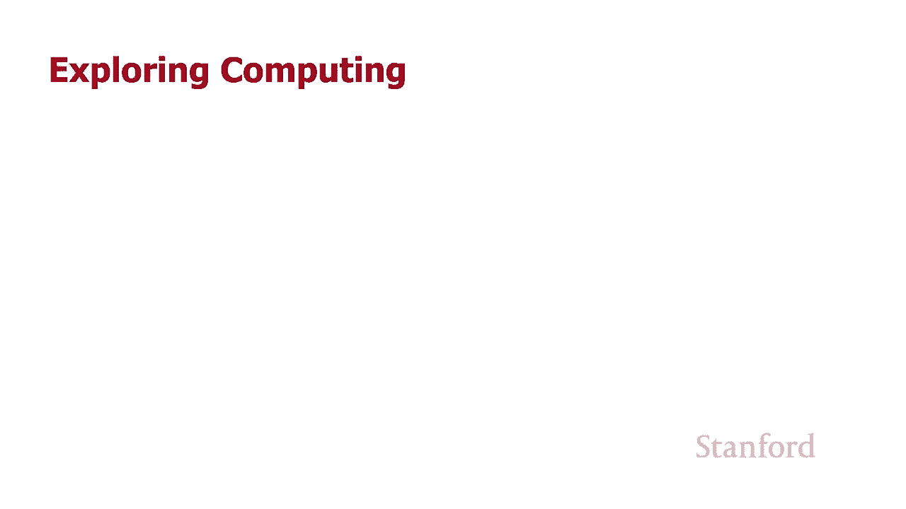

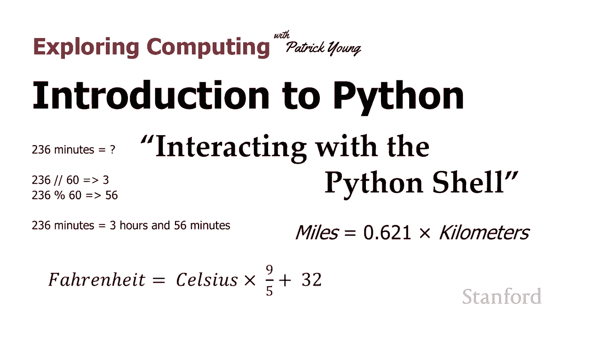

在本节课中，我们将要学习 Python 编程语言的基础，特别是如何与 Python Shell 进行交互。我们将了解 Shell 是什么，如何执行基本的算术运算，以及如何理解变量和运算符优先级等核心概念。

---

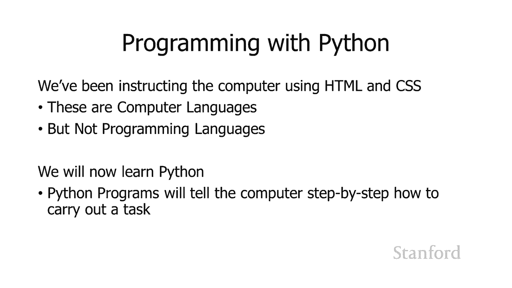

## 什么是 Shell？ 💻

上一节我们介绍了课程背景，本节中我们来看看什么是 Shell。

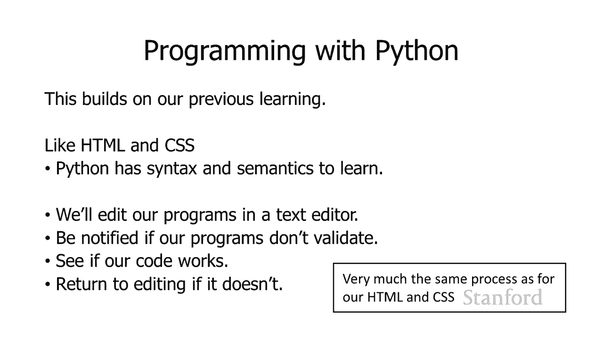

Shell 是一个程序。Shell 是用户与操作系统交互的接口。用户通过键入命令与 Shell 进行交互。在这个视频中，Shell 是一个程序，它最终实现了用户与程序的交互。


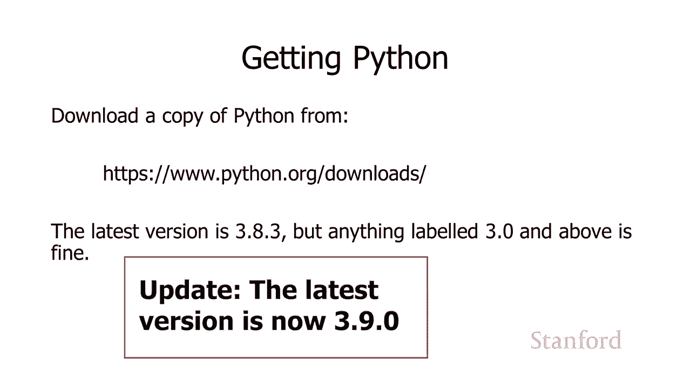

---

## 启动 Python Shell 🚀

要开始使用 Python，你需要启动 Python Shell。你可以在你的电脑上打开终端或命令提示符，然后输入 `python` 来启动它。

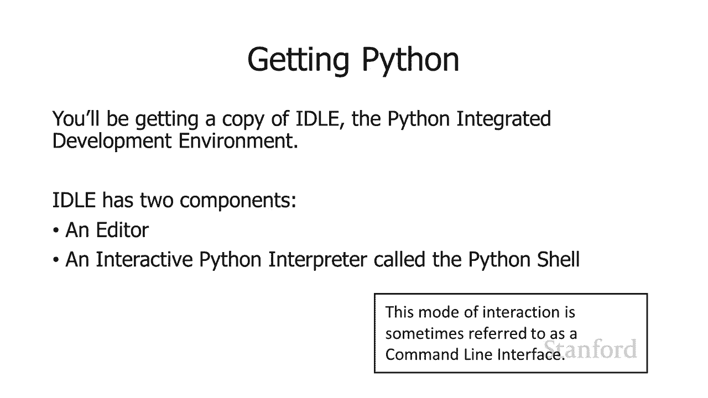


---

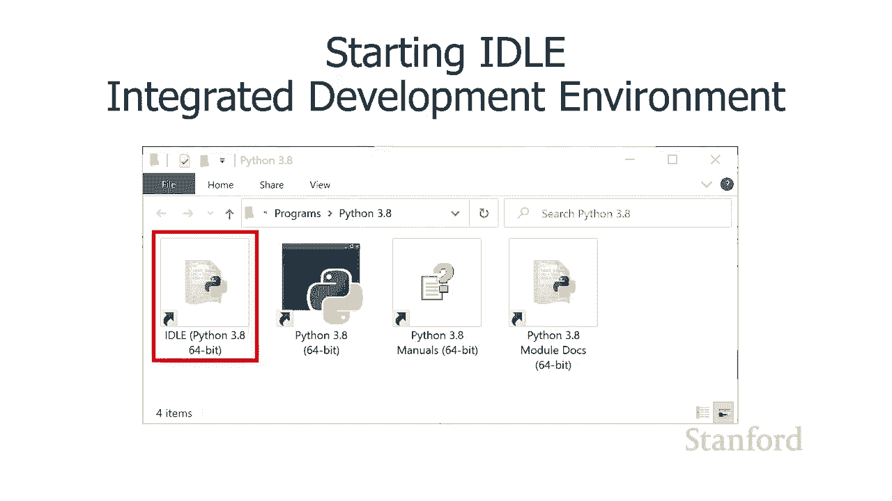

## 基本算术运算 ➕➖✖️➗

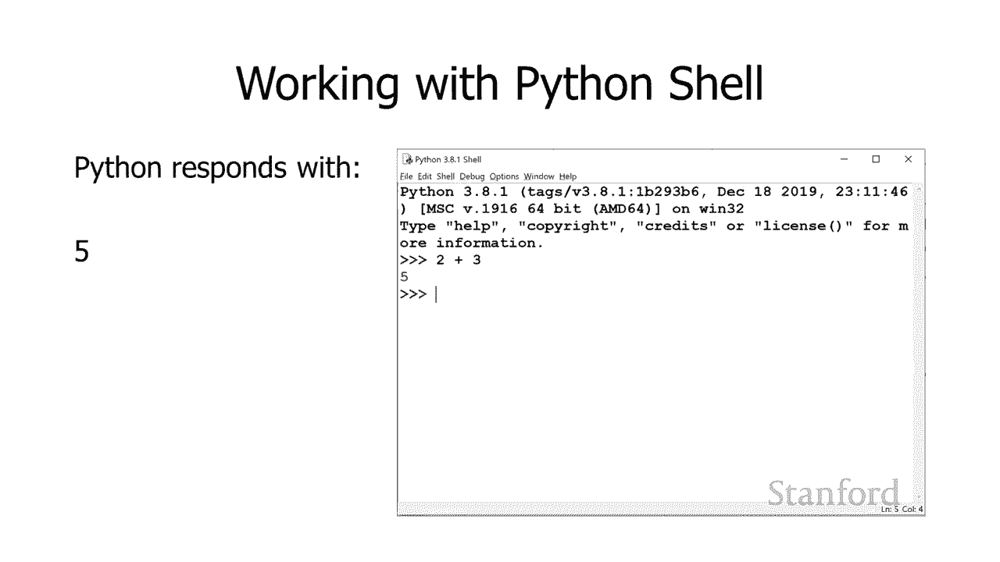

现在我们已经启动了 Shell，接下来看看如何在其中执行基本操作。Python Shell 可以作为一个强大的计算器使用。

以下是你可以执行的基本算术操作：

*   **加法**：使用 `+` 符号。例如，输入 `2 + 3`。
*   **减法**：使用 `-` 符号。例如，输入 `5 - 2`。
*   **乘法**：使用 `*` 符号。例如，输入 `3 * 4`。
*   **除法**：使用 `/` 符号。例如，输入 `9 / 3`。
*   **指数运算**：使用 `**` 符号。例如，`2 ** 3` 表示 2 的 3 次方。
*   **取模运算**：使用 `%` 符号。它返回除法后的余数。例如，`17 % 5` 的结果是 2。

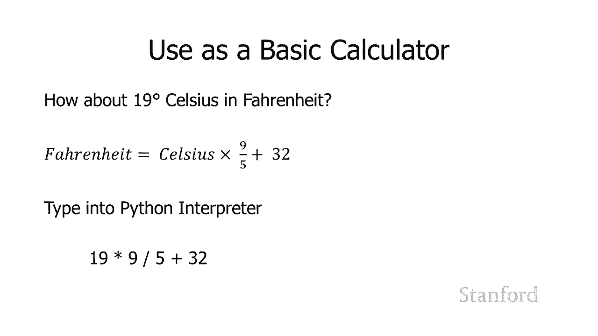


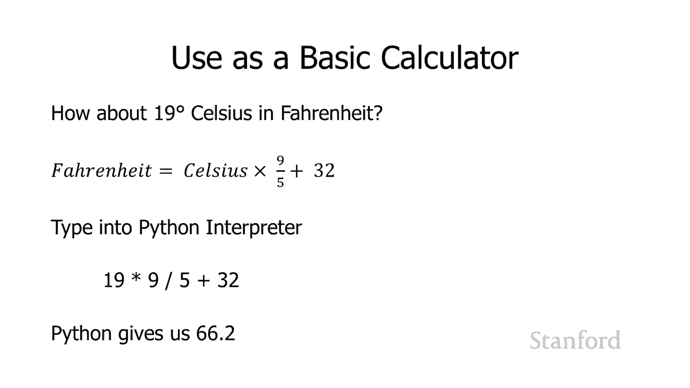

当你输入 `2 + 3` 时，Shell 会立即显示结果 `5`。这就是你如何看待基本算术。你可以通过 Shell 执行这些操作。


---

## 运算符优先级与括号 🔢

当我们进行更复杂的计算时，理解运算顺序很重要。例如，`5 + 3 * 2` 的结果是多少？

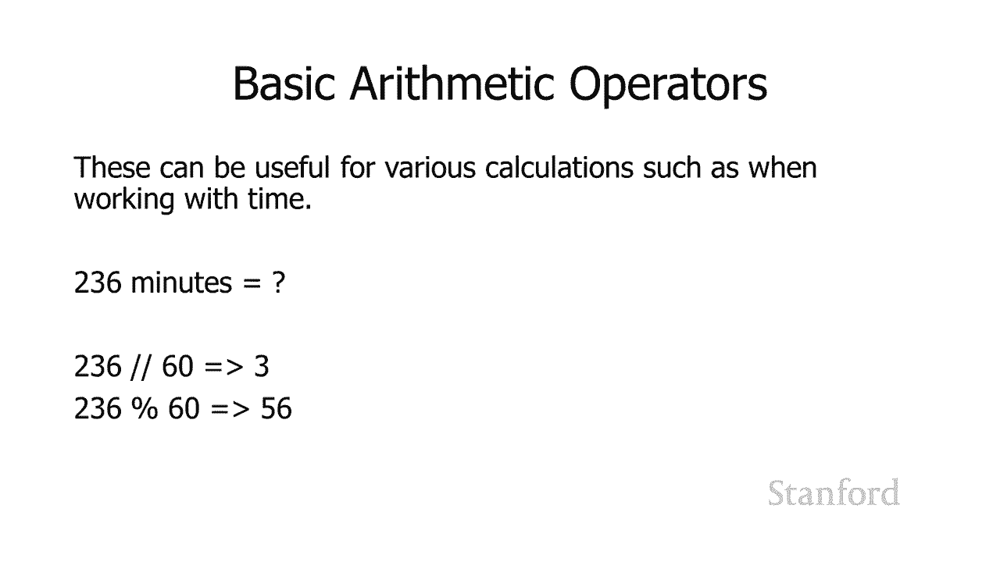

Python 遵循标准的数学运算符优先级：乘法和除法在加法和减法之前进行。所以，`3 * 2` 先计算得到 `6`，然后 `5 + 6` 得到 `11`。

如果你想改变运算顺序，可以使用括号 `()`。例如，`(5 + 3) * 2` 会先计算 `5+3` 得到 `8`，然后 `8 * 2` 得到 `16`。


---

## 变量与赋值 📦

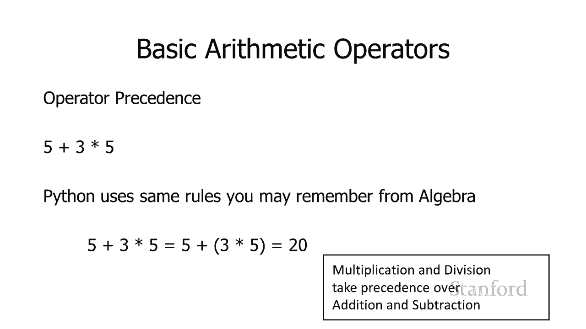

仅仅进行计算还不够，我们常常需要保存结果以供后续使用。这时就需要用到变量。

变量就像计算机内存中的一个存储位置，你可以给它起一个名字（标识符）并存入一个值。

以下是关于变量的要点：

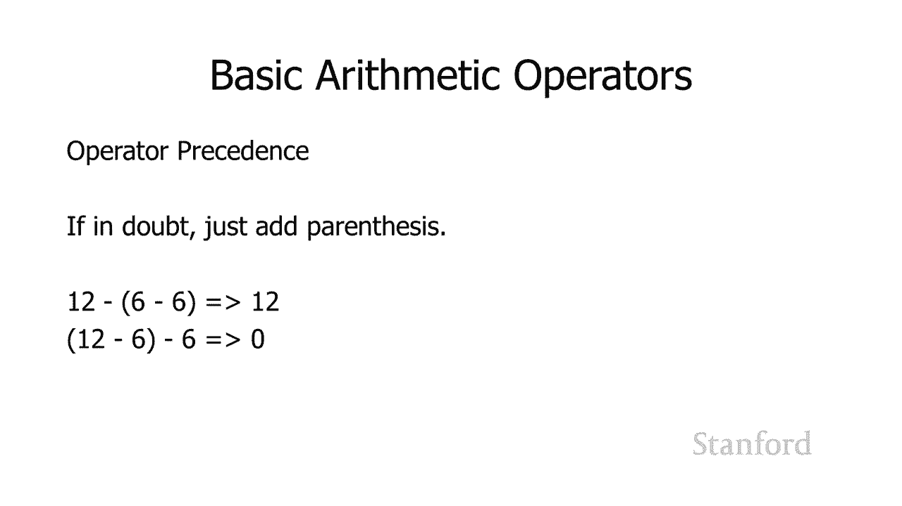

*   使用等号 `=` 进行赋值。例如，`x = 5`。
*   变量名可以包含字母、数字和下划线，但不能以数字开头。
*   赋值后，你可以通过变量名来使用这个值。例如，输入 `x * 2` 会得到 `10`。


例如，我们可以将摄氏温度转换为华氏温度。公式是：`华氏度 = 摄氏度 * 9/5 + 32`。

在 Python Shell 中，你可以这样做：
```python
celsius = 19
fahrenheit = celsius * 9 / 5 + 32
print(fahrenheit)
```
`print()` 函数会将变量的值显示在屏幕上。

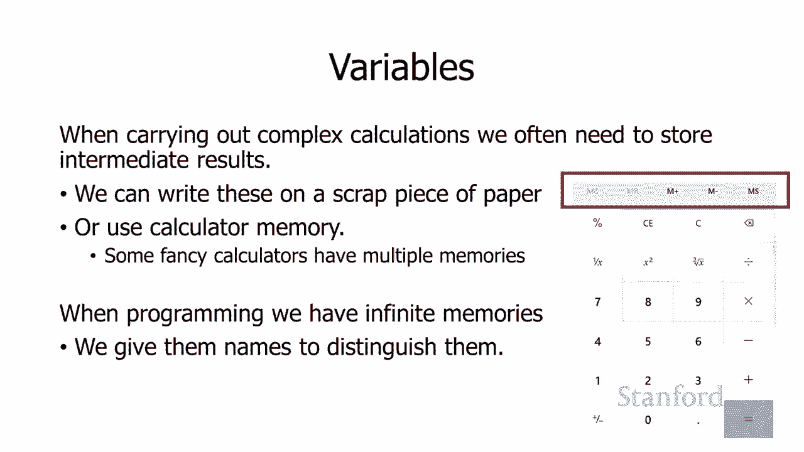


变量 `celsius` 和 `fahrenheit` 就存储在计算机的内存中，程序可以随时访问它们。


---

## 数值类型：整数与浮点数 🔢

Python 主要处理两种数字类型：

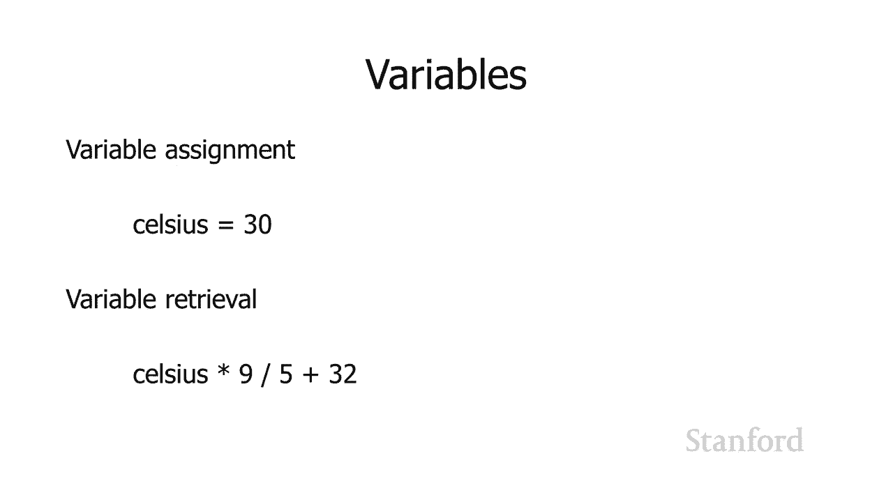

*   **整数**：没有小数部分的数字，如 `5`，`-3`，`0`。
*   **浮点数**：包含小数点的数字，如 `3.14`，`2.0`，`-0.5`。

当你进行除法运算时，即使能整除，结果也通常是浮点数。例如，`4 / 2` 的结果是 `2.0`。


---

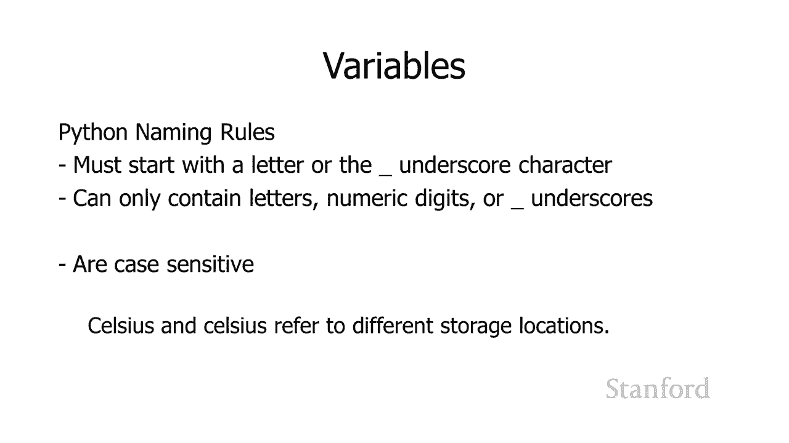

## 字符串简介 🔤

除了数字，Python 还可以处理文本，这称为“字符串”。字符串需要用引号括起来，单引号 `‘’` 或双引号 `“”` 都可以。

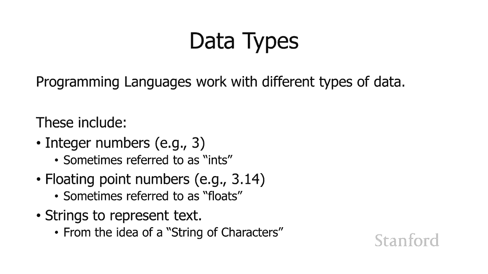

例如：
```python
name = “Stanford”
print(“Hello, “ + name)
```
这段代码会输出：`Hello， Stanford`。`+` 操作符可以连接两个字符串。


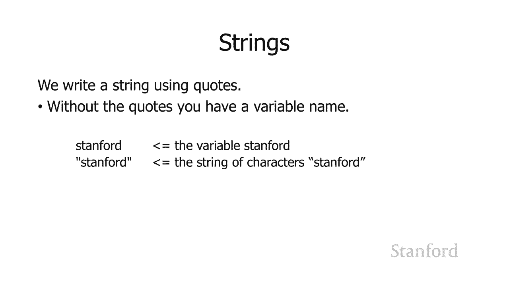

---

## 总结 📝

本节课中我们一起学习了 Python 编程的基础入门知识。我们首先了解了 Shell 是用户与计算机系统交互的界面。然后，我们学习了如何在 Python Shell 中执行基本的算术运算，并理解了运算符的优先级规则。接着，我们引入了变量的概念，它允许我们在内存中存储和操作数据。我们还简单区分了整数和浮点数这两种数值类型，并接触了用于表示文本的字符串。

通过这些练习，你已经迈出了与 Python 交互的第一步，为编写更复杂的程序打下了基础。

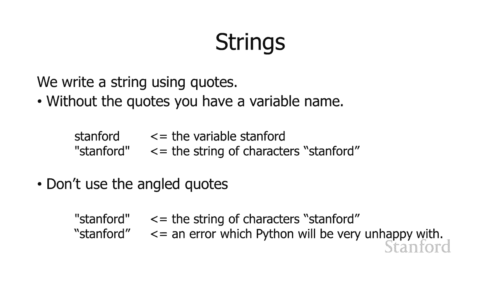


