# L16.2：Python 介绍：我们的第一个 Python程序 🐍


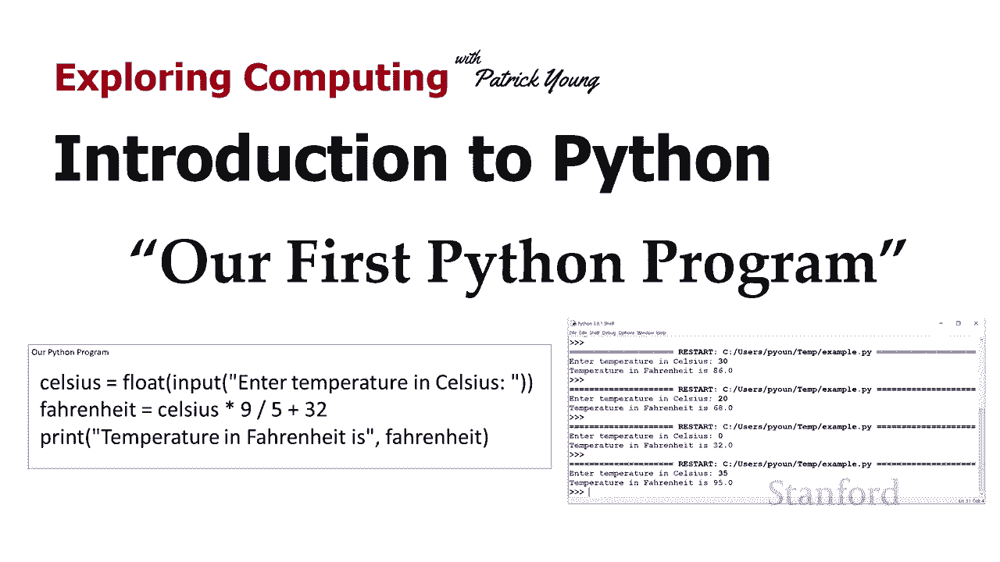

在本节课中，我们将学习如何创建并运行你的第一个Python程序。我们将从使用Python Shell作为计算器开始，逐步过渡到编写一个可以保存和重复使用的完整程序。课程的核心是学习如何使用`print`函数输出结果，以及如何通过`input`函数获取用户输入，从而创建一个实用的温度转换程序。

---

## 从交互式Shell到程序文件

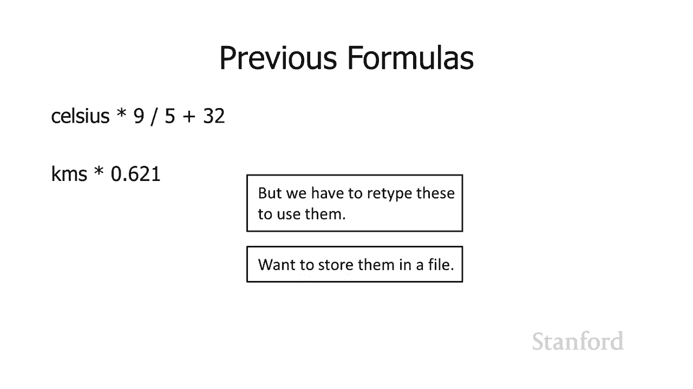

上一节我们介绍了如何将Python Shell用作一个基本的超级计算器，并尝试了如摄氏度转华氏度（`摄氏度 * 9 / 5 + 32`）和公里转英里（`公里 * 0.621`）等公式。

然而，上次使用的方式存在一个问题：每次想要使用这些公式时，都需要重新输入。虽然Python Shell可以作为临时的计算工具，但这并没有真正创建一个可以重复使用的程序。

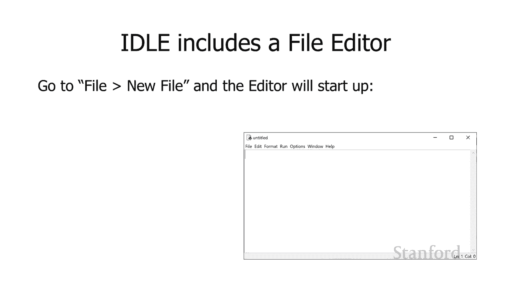

为了将它们转换成真正的程序，我们需要将这些代码存储到一个文件中，以便在需要时能够重用它们。

---

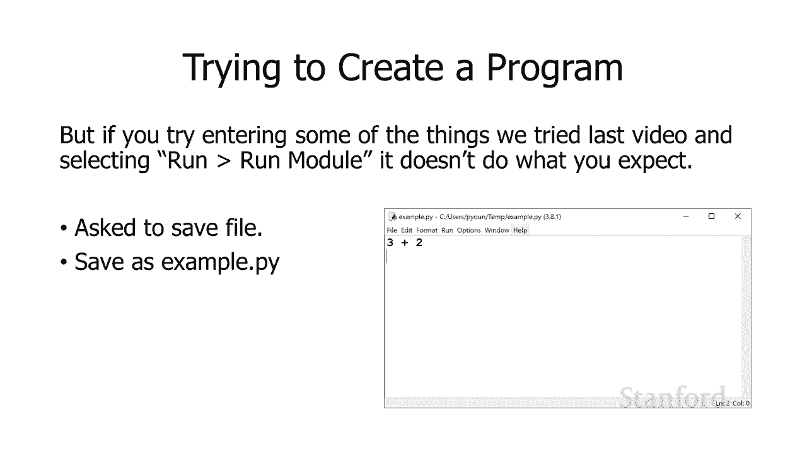

## 使用IDLE的文件编辑器

幸运的是，IDLE（Python的集成开发环境）内置了一个文件编辑器。如果你正在运行IDLE（关于如何运行IDLE的说明，请参考上一个视频），你可以通过“文件”菜单创建一个新文件。

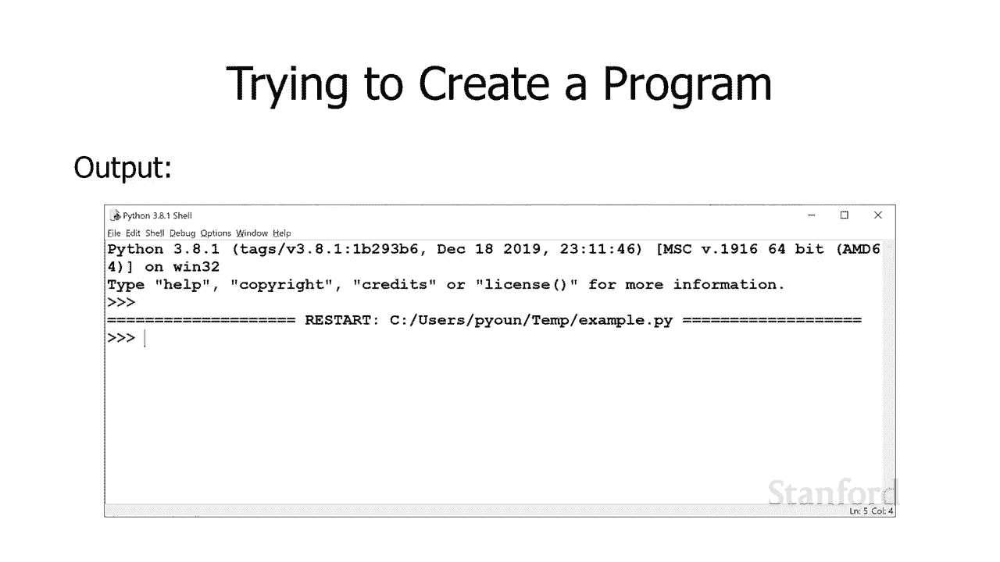

当你这样做时，编辑器窗口将会启动。现在，窗口底部显示的内容就是我们的代码编辑区域。

---

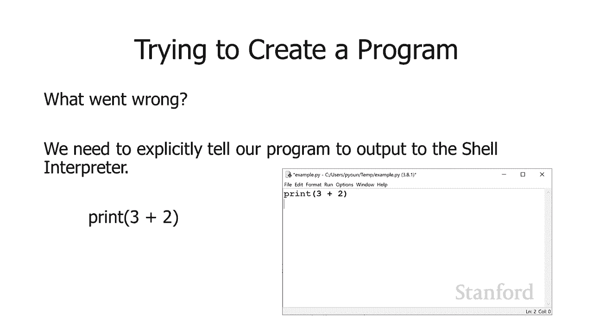

## 编写并运行第一个程序

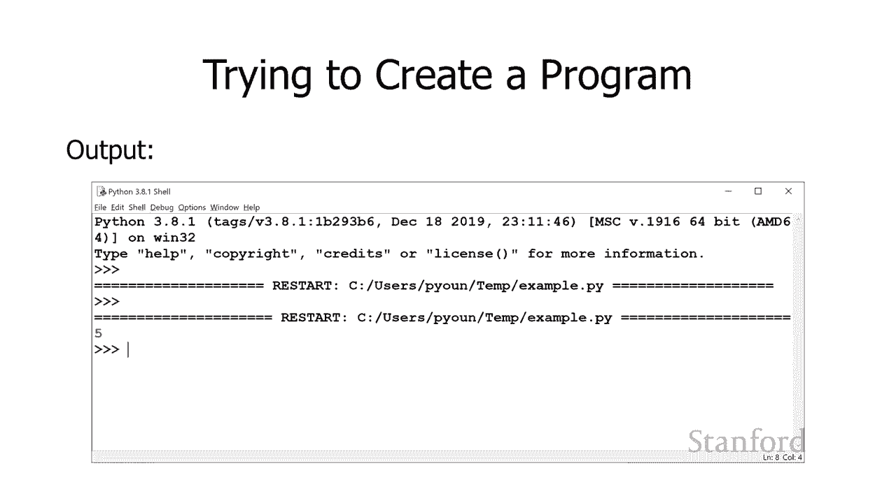

我们的第一个程序非常简单，基本上只是将两个数字相加。例如，我们输入 `3 + 2` 并将其放入编辑器中。

当我们尝试通过编辑器“运行”菜单中的“运行模块”来执行它时，系统会询问我们是否要保存文件。我们将文件保存为 `example.py`。Python文件通常以 `.py` 作为扩展名。

保存后，再次选择“运行模块”来执行它。但此时，程序似乎没有输出任何内容。这是因为在Python程序中，我们需要明确地告诉解释器我们想要输出内容到Shell。

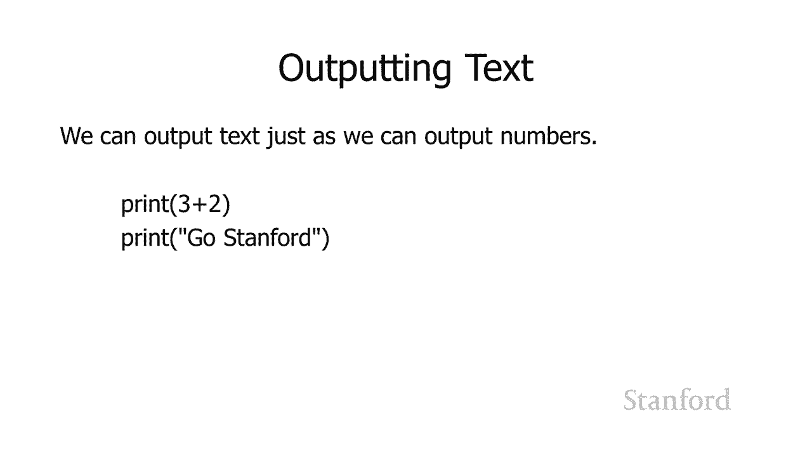

---

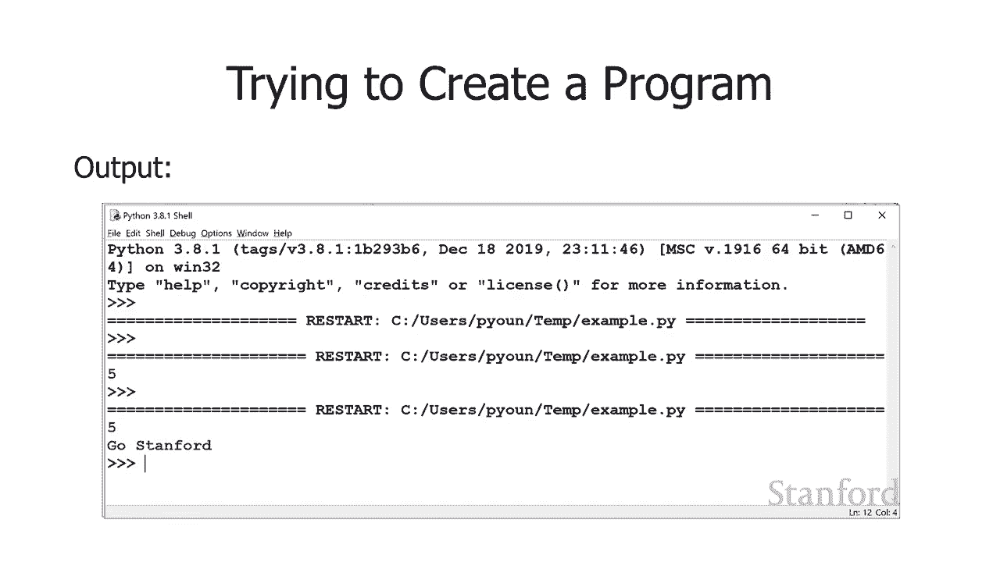

## 使用 `print` 函数输出结果

我们可以使用 `print` 函数来实现输出。`print` 函数后面跟着一对括号，括号内是我们希望它打印的内容。

例如，我们输入：
```python
print(3 + 2)
```
现在，当我们运行这个程序时，可以在Shell中看到它打印出了数字 `5`。

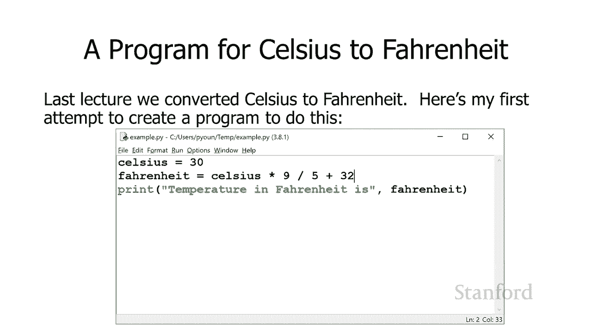

这样，我们就成功地让程序输出了一个数学表达式的结果。`print` 函数不仅可以输出数字，还可以输出文本（字符串）。记得上一课我们提到，Python可以处理整数、浮点数以及字符串。

例如：
```python
print("go stanford")
```
这行代码会打印出字符串 `go stanford`。引号表明这是一个字符串，而不是名为 `go` 和 `stanford` 的变量。

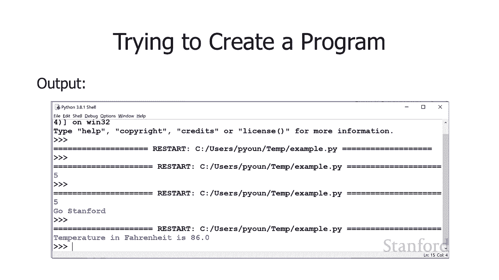

---

## 创建温度转换程序

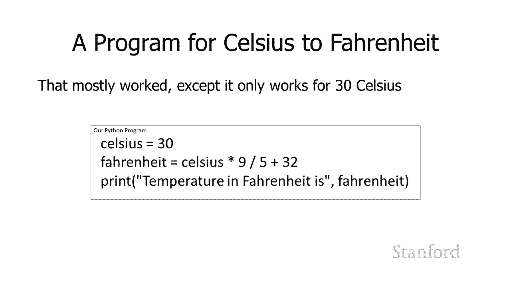

上一课我们手动将摄氏度转换为华氏度。现在，让我们创建一个程序来自动进行这种转换。

以下是我们的第一次尝试：
```python
celsius = 30
fahrenheit = celsius * 9 / 5 + 32
print("Temperature in Fahrenheit is", fahrenheit)
```
在这段代码中：
1.  我们创建了一个名为 `celsius` 的变量，并将 `30` 存储在其中。
2.  我们进行转换计算 `celsius * 9 / 5 + 32`，并将结果存储在变量 `fahrenheit` 中。
3.  我们使用 `print` 语句输出结果。这个 `print` 语句稍微高级一些：它先打印字符串 `"Temperature in Fahrenheit is"`，然后打印变量 `fahrenheit` 的值。

运行这个模块，程序会输出：`Temperature in Fahrenheit is 86.0`。

这个程序可以工作，但它有一个问题：程序将 `celsius` 变量固定设置为 `30`。如果温度总是30度，这个程序就失去了通用性。我们希望程序能处理不同的摄氏温度。

---

## 使用 `input` 函数获取用户输入

为了实现这个目标，我们需要从用户那里获取输入。这是编程中获取用户信息的下一步。

我们将使用 `input` 函数。`input` 函数后面也有一对括号，括号内我们可以放一个字符串，作为给用户的提示信息。

`input` 函数会返回一个值，我们可以将这个值存储到一个变量中。例如：
```python
username = input("Enter your name: ")
```
这行代码会提示用户“Enter your name:”，用户输入的任何内容（结果）都将作为字符串存储在变量 `username` 中。

---

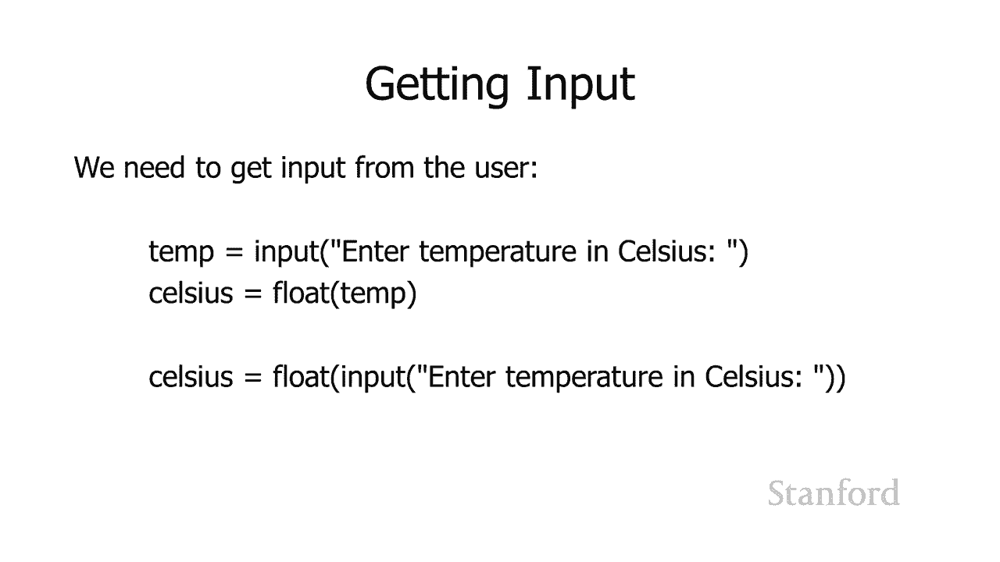

## 完善温度转换程序

现在，我们将 `input` 应用到温度转换程序中。我们希望用户输入摄氏温度。

你会注意到下面的代码有两行：
```python
temp = input("Enter temperature in Celsius: ")
celsius = float(temp)
```
为什么有两行？原因是 `input` 函数返回的是**字符串**数据类型。如果用户输入 `30`，我们得到的不是数字 `30`，而是由字符 `‘3’` 和 `‘0’` 组成的字符串。我们不能直接将字符串用于数学公式。

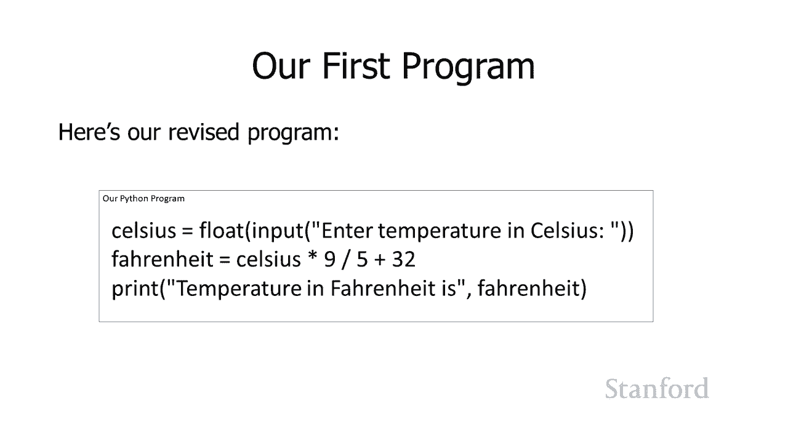

因此，我们需要第二行代码：`float(temp)`。`float()` 函数会将其参数（括号内的内容）转换为浮点数。在这里，它将用户输入的字符串（例如 `"30"`）转换为实际的数字 `30.0`，并将这个值存储到 `celsius` 变量中。

实际上，我们可以将这两行合并为一行：
```python
celsius = float(input("Enter temperature in Celsius: "))
```
这行代码会请求用户输入，然后将返回的结果（字符串）立即传递给 `float()` 函数进行转换，最后将转换后的数字存储在 `celsius` 变量中。

---


## 完整的交互式温度转换程序

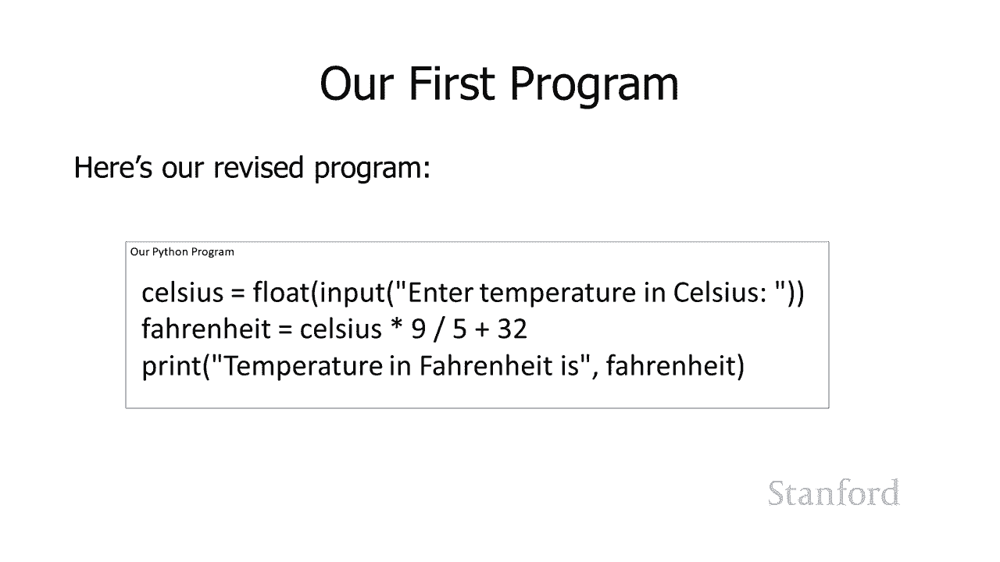

现在，我们有了完整的程序：
```python
# 提示用户输入摄氏温度，并转换为浮点数
celsius = float(input("Enter temperature in Celsius: "))

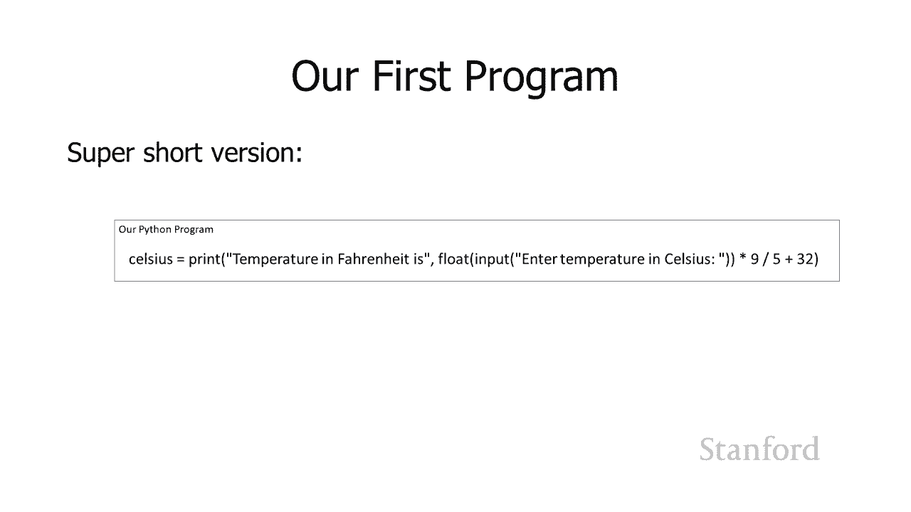

# 进行华氏度转换计算
fahrenheit = celsius * 9 / 5 + 32

# 打印结果
print("Temperature in Fahrenheit is", fahrenheit)
```
程序流程如下：
1.  要求用户输入摄氏温度。
2.  将输入转换为浮点数并存储在变量 `celsius` 中。
3.  检索 `celsius` 的值，进行 `* 9 / 5 + 32` 计算。
4.  将结果存储在变量 `fahrenheit` 中。
5.  打印出华氏温度。

你可以多次运行这个程序，每次它都会要求输入一个新的摄氏温度，并给出对应的华氏温度。这比一遍又一遍地重新键入公式要方便得多。

**关于代码风格的建议**：虽然技术上可以将所有计算放在 `print` 语句的一行内完成，但将程序分解为更小的步骤（如上面的示例）会使代码更易于阅读和调试。将太多逻辑塞进一行代码，虽然紧凑，但更容易出错，并且让他人（或未来的你）难以理解。

---

## 总结

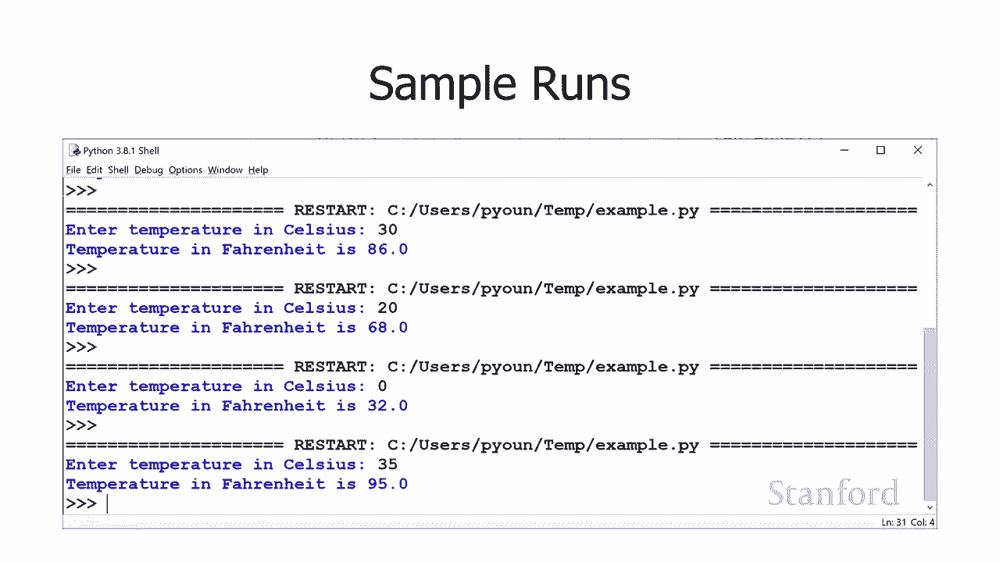


本节课中我们一起学习了如何创建你的第一个Python程序。我们从使用交互式Shell过渡到编写保存在文件中的程序，学会了使用 `print` 函数输出内容，以及使用 `input` 函数获取用户输入。通过构建一个实用的温度转换程序，你了解了变量、数据类型转换（`float()`）和基本运算如何协同工作。这让你初步体验了编程的样子以及编程语言是如何运作的。Python因其易用性和强大的功能，在包括科学计算在内的众多领域被广泛使用，这也是它备受推崇的原因。在下一节课中，我们将扩展编程能力，学习如何做更多有趣的事情。