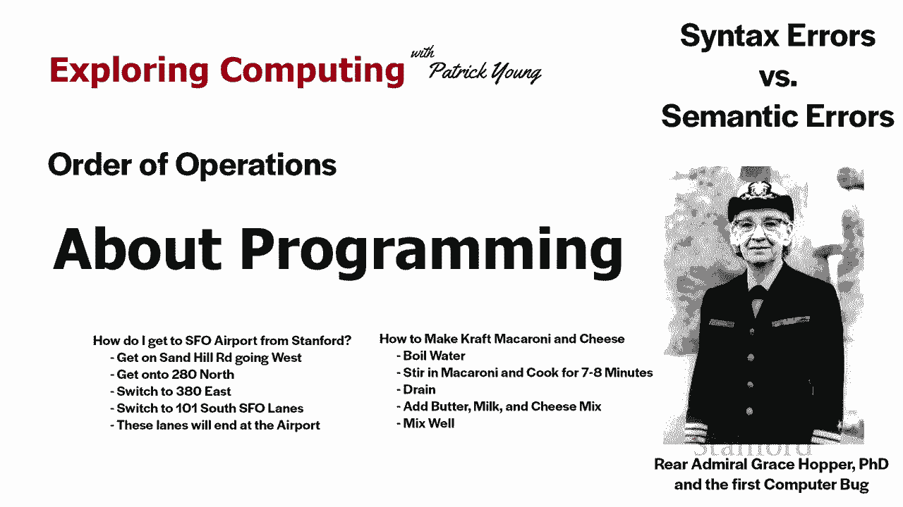
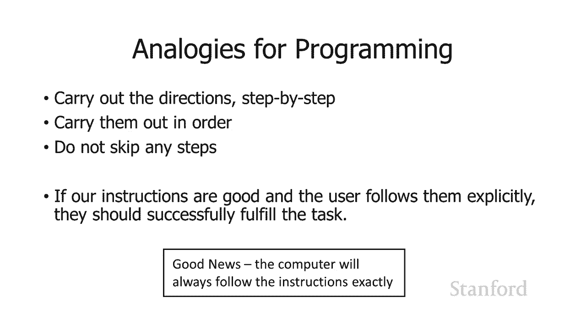
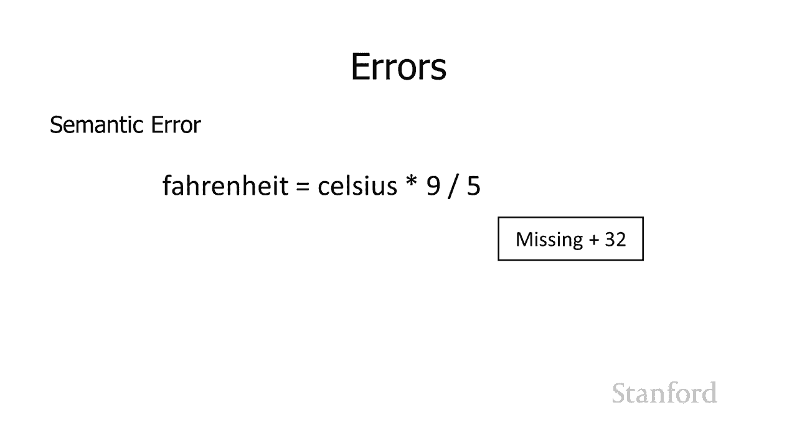
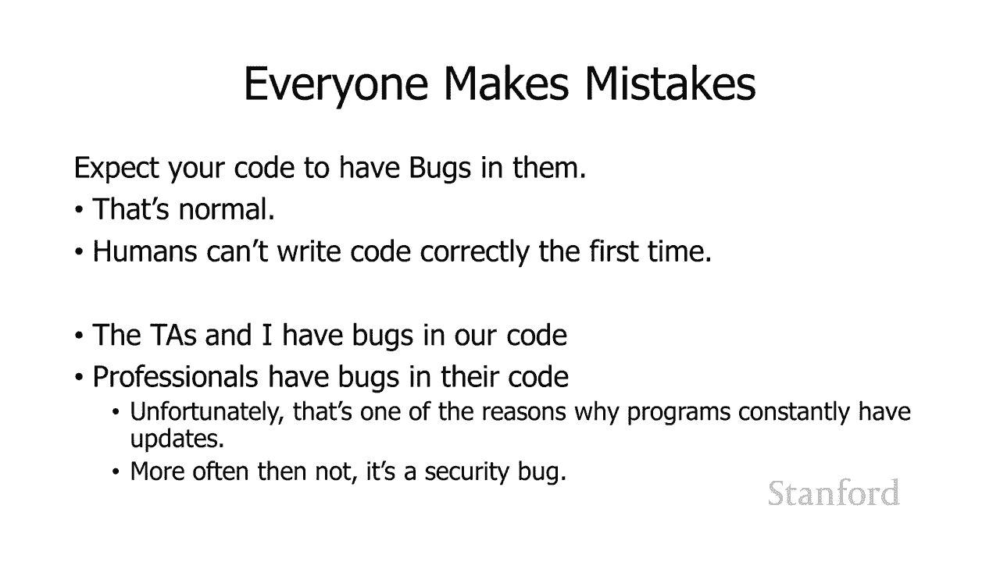

# 斯坦福CS105：计算机科学导论：L17.1：关于编程 🧑‍💻




在本节课中，我们将要学习编程的基本概念。编程并非神秘莫测，它实际上与我们日常生活中的许多活动非常相似。我们将通过类比来理解编程的核心思想，并学习如何编写和调试简单的程序。

## 编程与日常活动的相似性

上一节我们介绍了编程并非遥不可及，本节中我们来看看编程与我们熟悉的日常活动有何相似之处。

编程的核心是给出一系列明确的指令，让执行者（无论是人还是计算机）按顺序执行，以完成特定任务。这与我们为他人指路或按照菜谱做饭的过程非常相似。



以下是两个具体的类比：

*   **指路**：如果有人问“如何从斯坦福到旧金山国际机场”，我会给出如下指示：
    1.  上沙山路向东行驶。
    2.  上280号高速公路向北。
    3.  转380号高速公路向东。
    4.  转101号高速公路向南。
    5.  进入SFO车道，即可到达机场。
*   **烹饪**：制作卡夫通心粉和奶酪的说明：
    1.  把水煮沸。
    2.  加入通心粉，煮7到8分钟。
    3.  沥干水分。
    4.  加入黄油、牛奶和奶酪混合物。
    5.  搅拌均匀。

对于这两项任务，我们都给出了一系列**应该逐步执行的指示**，并且它们**将按照列出的顺序执行**。这很重要，**并且不要跳过任何一个实际证明的步骤也很重要**。所以如果我们的指令很好，并且用户明确地遵循它们，他们应该成功地完成我们给出的指令的任务。

这里的好消息是，**计算机将始终遵循指令**。事实证明，人类并非总是如此。一个尴尬的例子是：我第一次尝试制作通心粉和奶酪时，跳过了“沥干水分”的步骤，最后得到了通心粉奶酪汤，这很恶心。但如果你告诉电脑“排干通心粉”，它一定会执行。

## 指令顺序的重要性

上一节我们了解了计算机严格遵循指令的特性，本节中我们来看看指令的排列顺序为何如此关键。

计算机执行指令会**按照列出的顺序**。您列出计算机指令的**顺序通常非常重要**。因此，如果我们在编写程序时颠倒了语句的顺序，可能会导致程序无法工作或产生错误结果。

考虑一个将摄氏温度转换为华氏温度的小程序：
```python
celsius = input(“请输入摄氏温度：”)
fahrenheit = celsius * 9 / 5 + 32
print(fahrenheit)
```
程序必须按照这个顺序发生：先获取输入，再计算，最后输出。在下面的错误例子中，顺序被颠倒了：
```python
celsius = input(“请输入摄氏温度：”)
print(fahrenheit) # 此时fahrenheit还未计算，没有意义
fahrenheit = celsius * 9 / 5 + 32
```
如果我重新排序这些语句，它不会起作用。我经常看到学生只是随机重新排列他们的语句，因为它不起作用，他们认为如果只是重新排列它们，也许会解决问题。**您需要仔细考虑顺序是什么，以及为什么语句按该顺序排列，并在逻辑上将它们按正确的顺序排列**。

在另一个将总分钟数转换为小时和分钟的例子中：
```python
total_minutes = 125
hours = total_minutes // 60
minutes = total_minutes % 60
print(hours, “小时”, minutes, “分钟”)
```
在这种特殊情况下，前两个计算`hours`和`minutes`的语句顺序可以互换，因为它们的计算互不依赖。而最后的打印语句确实必须在前两个语句发生之后执行。

**排序通常很重要，但并不总是很重要**。解决这个问题的最佳方法是**从逻辑上思考这些语句中的每一个所做的事情**，判断这个语句和下一个语句之间的顺序，或者前一个语句和这个语句之间的顺序是否那么重要。

## 编辑-调试周期

在理解了指令和顺序后，我们需要一个有效的方法来构建和修正我们的程序，这就是编辑-调试周期。

正如我在上一堂课中所建议的，有一个**编辑调试周期**。我在其中编写或编辑我的代码，我尝试一下，看看它是否有效。如果它不起作用，我将返回编写或编辑代码，然后我再试一次。只要有必要，我就会继续重复这个过程。

这与我们为HTML和CSS所做的过程非常相似。这是我们将使用Python或任何其他编程语言的过程。

我认为不是这个过程分崩离析的一个领域，它仍然是相同的过程。但编程过程比使用HTML和CSS的过程更难的一个领域是：在HTML和CSS中，结果总是可见的。这就是为什么我喜欢教HTML和CSS首先，你在网页上加载它，你可以看到出了什么问题。例如，“哦，我以为我只是让标题加粗，但我看到了整个网页都是粗体”，然后我开始考虑什么可能使整个网页变粗，也许我忘了结束我的粗体标签。

在编程中，有时结果是不可见的，尤其是中间结果通常是不可见的。因为我们有这些存储位置（变量），我们将中间结果存储在这些变量中，我们不知道变量被设置为什么。

## 使用打印语句进行调试

既然中间结果不可见会导致调试困难，那么本节我们将学习一个让这些结果“可见”的强大工具——打印语句。

为了弄清楚程序是否运行良好，或者为什么它不起作用，很多时候它不起作用的原因是我们的中间结果是错误的。所以我将如何弄清楚中间结果是什么？因为它们作为专业程序员是不可见的。我们可以应用各种不同的工具使不可见的结果可见，但对于刚开始的人来说，最简单的事情就是**使用打印语句**。

打印语句会将打印语句中的任何内容的值打印到Python解释器或Python Shell。假设我有一个变量`x`，我不知道`x`在做什么，它似乎不起作用。我猜`x`是错误的，但我不确定，因为我实际上看不到它，它是不可见的。我所做的是将这个`print(x)`语句添加到我的代码中。

然后您再次考虑将代码放在哪里，这取决于您关注代码的哪一部分。但您知道，如果我放在`print(x)`中，会发生什么是Python Shell将在那里打印`x`的值。我要么就像“哦，它实际上看起来像我期望的那样，所以也许问题出在另一个变量”，或者它打印出`x`的值，我觉得这是不对的，我认为它应该是另一个值，然后我开始深入研究代码，试图找出为什么`x`的值是Python解释器所认为的，与我认为应该是的相反。

实际上有一个更高级的版本：`print(“x:”, x)`。这要做的是：第一个`“x:”`用引号括起来，它是一个字符串，所以计算机会按原样打印“x:”。然后逗号后的第二个`x`是一个变量名，所以它会检索`x`的值并打印出来。假设`x`的值当前是3，这个打印语句将打印出`x: 3`。所以，如果你打印出一堆不同变量的值，它会帮助你识别。例如，在另一个地方我有`print(“y:”, y)`，我会在一个地方看到`x`是12，`y`是15，所以它很有用。继续并添加额外的标签，当我试图弄清楚不同的变量被设置为什么时，将打印出来。

## 语法错误与语义错误

在编程过程中，我们不可避免地会遇到错误。了解错误的类型是有效调试的第一步。实际上有几种不同类型的错误可以当我们在编程时会发生：**语法错误**和**语义错误**。

当语法中有错误时会发生语法错误。例如：
```python
celsius = input(“请输入温度：”)
fahrenheit = celsius * 9 / 5 + 32 # 这里缺少乘号，语法错误
```
这相当于试图用一种人类语言的语言而不是遵循正确的语法规则来理解一个句子。人类有时可以弄清楚你想说什么，但是如果你不遵守语法规则，计算机就会像“我不知道你想告诉我什么，所以我会忽略它”。所以这是第一个错误来源。通常，当你在Python编辑器中编辑你的程序时，如果你有语法错误，你告诉它运行，它会立即告诉你：“嘿，我浏览了这个程序，你告诉我运行，但在Python中有一堆完全非法的东西，这些是不允许的，这些是你的语法错误。”



另一个错误来源是**语义错误**。当你有一个完全合法的程序，但它实际上不是正确的时，会发生语义错误。在这种情况下，我将摄氏度转换为华氏度，我乘以9，然后除以5，结果我也应该加上32，但我没有。所以这个程序会运行，它是完全合法的、语法正确的Python，但它会给我错误的答案。

因此，与Python将发现的语法错误形成对比，一旦我告诉它运行，它会列出“嘿，这里是你做的一堆错误，这些是非法的”。语义上不正确的程序是合法的，它会运行，它只是不会给你正确的结果。所以当发生这种情况时，如果它是一个短程序，你只需要查看程序并思考“为什么我会得到这个数字，而我认为我应该得到另一个数字”。而当你有一个稍长的程序时，你必须回到我几分钟前所说的关于试图计算的内容，找出那些不可见的中间结果是什么，以及这些结果出了什么问题。所以，添加一些打印语句来弄清楚出了什么问题。

## 关于“错误”和编程心态

我想告诉你的最后一件事是，编程可能非常令人沮丧。而且很多时候，你刚开始是一名程序员，你认为“我的程序中有所有这些错误，这一定是我的错，我一定不是很擅长这个”。这实际上不是真的。

所以结果证明，如果你的程序中有错误代码，你的代码中有错误或漏洞，实际上有一个关于为什么将它们称为“bug”（虫子）的故事。这是杜撰的，虽然显然这个故事确实发生过，但尚不清楚这是为什么它们被称为bug。故事是：当我们有机电机器时，程序无法运行。当他们试图找出程序无法运行的原因时，有一只飞蛾卡在其中一个电磁开关中。因此，他们说“这是一个bug”。所以这个故事的一部分实际上是真的，发现这个错误的人是格蕾丝·霍珀海军少将。她创造了一个当时使用最广泛的编程语言之一，叫做COBOL。海军实际上有一张bug的照片。不太清楚的是，这实际上是名称“bug”的来源，但这是一个有趣的故事。

所以，你的代码中有错误，你的代码中有漏洞，因为你是**一个人**，而人类通常不会在第一次就正确地编写代码。正常情况下，这意味着您不是某种机器人。所以这主要是为了让您了解，助教们和我的代码中也有错误。所以如果您的代码中有错误，恭喜，我们在我们的代码中也有很多次错误。很多次我和我的电脑坐在那里，想把电脑扔出窗外，因为我非常确定我写的代码是正确的，但它仍然是错误的。你知道试图找出答案是非常令人沮丧的，你真的确定你搞砸了。

事实上，发生的非常罕见的情况之一是：大约五六年前，我刚刚接管了CS108，每年我都会在学生做之前自己重写家庭作业，以提醒自己学生将要努力解决的问题。我记得我写的一个程序，它实际上是第一次运行，令人震惊，这是有史以来最好的感觉。我提到了这一点，因为那是非常不寻常的，从未发生过。**你不擅长编程，这是因为它（调试）是编程经验的一部分**。

事实上，专业人士的代码中有错误，而且他们的代码中经常有很多错误。这就是程序不断更新的原因之一。所以你知道，如果你看到操作系统正在更新，就像Windows一样不断更新，你的应用程序也在不断更新，有时它会添加新功能，但通常是因为他们发现了代码中的错误，或者他们的代码中可能存在安全漏洞，因为他们没有仔细考虑事情。

所以，在你的代码中有错误，是体验中完全正常的一部分。我认为对我们这些程序员来说，这只是实际创建一个正在运行的程序，并看到我们在脑海中想到的东西的乐趣，我们实际上已经创建了它并且它正在运行。最终让它全部运行的乐趣是值得的，尽管在调试过程中会遇到挫折。但不要觉得有什么问题，因为您的代码中有错误，这再次是成为人类的一部分。这是每个程序员都会经历的事情，包括助教们和我自己，以及所有专业程序员。

## 总结与预告

本节课中我们一起学习了编程的基本思想。我们了解到编程就像给出清晰的指令，关键在于指令的顺序必须合乎逻辑。我们介绍了编辑-调试周期，并学习了使用`print()`语句来查看不可见的中间变量值，这是调试的重要工具。我们还区分了**语法错误**（代码格式非法）和**语义错误**（代码合法但逻辑错误）。最后，我们建立了正确的心态：代码中出现错误是编程过程中完全正常且普遍的一部分，无需因此气馁。




在下一个视频中，我们将通过添加一些新结构来扩展您的编程能力，这些结构实际上将大大增强您使用程序的能力。