# L17.2：控制结构：条件流程


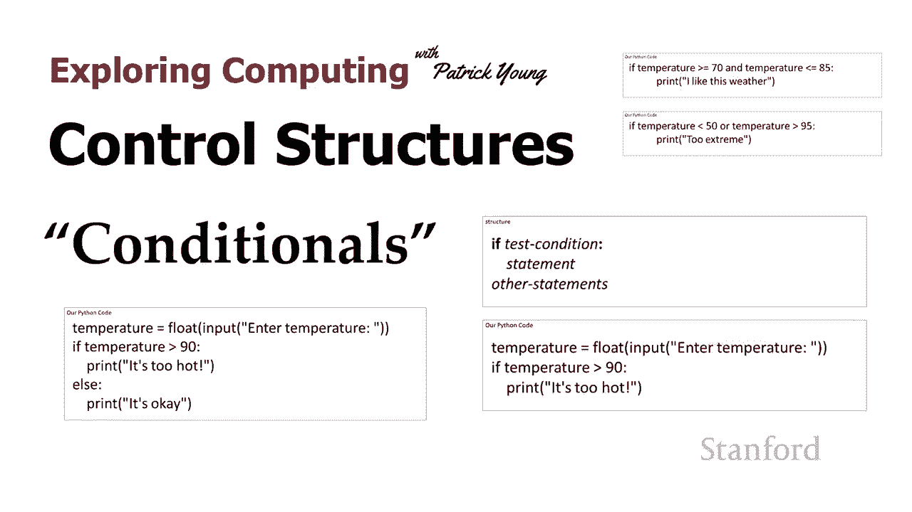

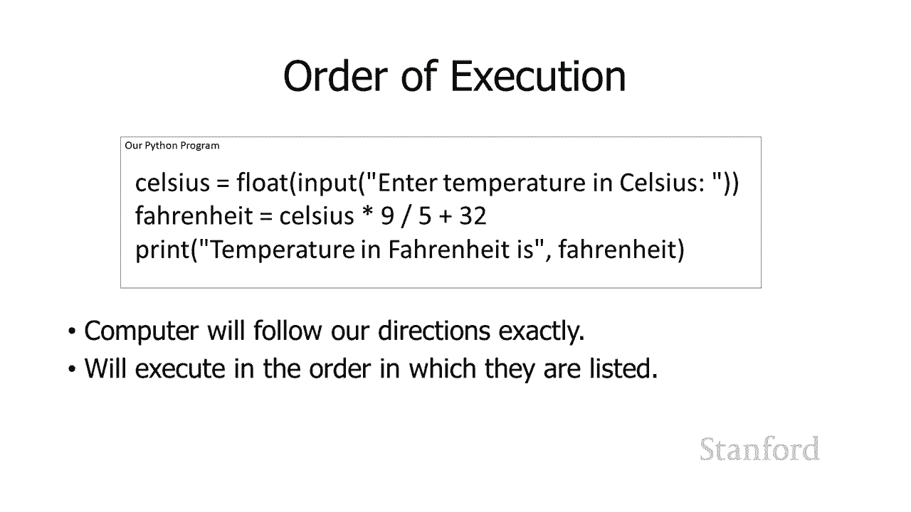

在本节课中，我们将要学习程序中的控制结构，特别是条件控制结构。这些结构允许程序根据特定条件决定执行哪些语句，从而让程序的行为更加灵活和智能。

## 程序执行的顺序

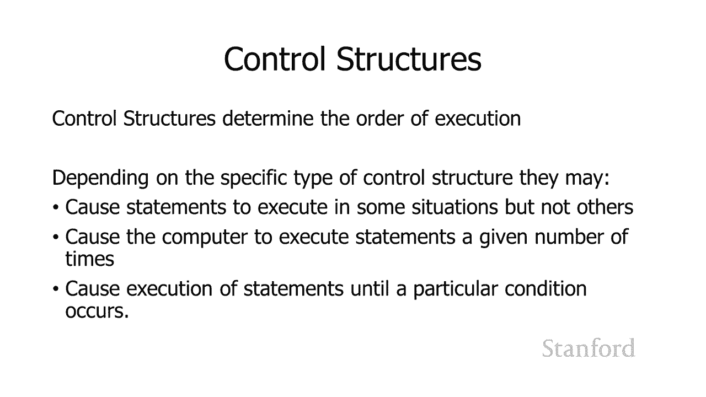

在上一课中，我们讨论了程序通常按照语句编写的顺序依次执行。这就是我们希望在简单程序中发生的事情。

但有时，我们希望更精确地控制哪些语句被执行。我们可以使用称为“控制结构”的工具来实现这一点。控制结构决定了程序语句的执行顺序。

## 控制结构的类型

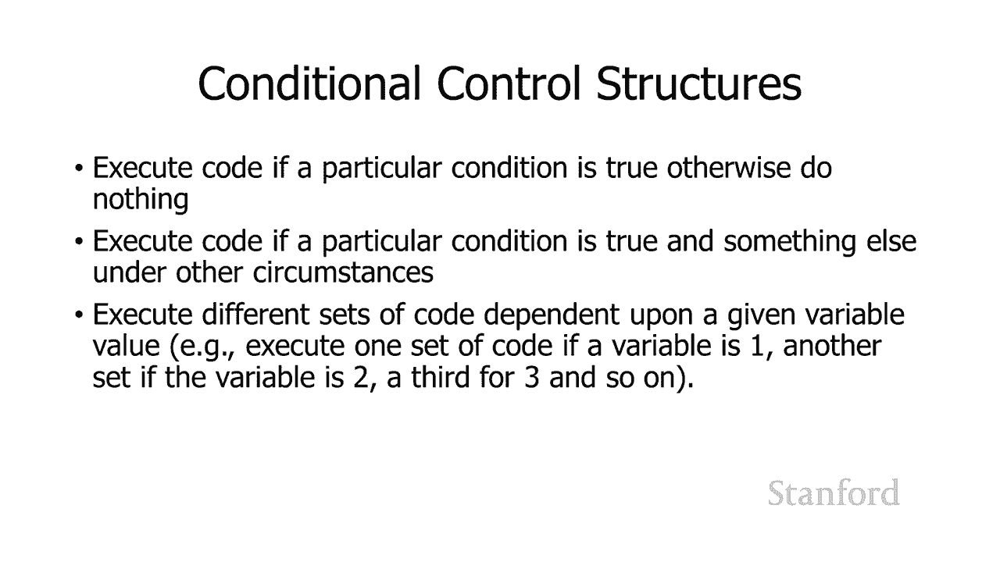

根据控制结构的特定类型，它可能会：
*   在某些情况下执行某些语句，而在其他情况下不执行。
*   导致计算机重复执行给定的语句，直到特定条件发生。

我们将研究几种不同类型的控制结构。今天要讨论的控制结构属于一类称为“条件控制结构”的类别。

## 条件控制结构简介

最简单的条件控制结构是：如果特定条件为真，则执行一段代码；否则，不执行任何操作。

更高级的版本，我们今天也将讨论，包括：
*   如果条件为真，则执行一段代码；如果条件为假，则执行另一段不同的代码。
*   根据特定变量的值，执行不同的代码段。例如，如果变量值为1，执行代码A；如果值为2，执行代码B；如果值为3，执行代码C。

实际上，最后一组功能可以通过组合前两组控制结构来实现。这在计算机科学中经常发生：更基础的机制可以用来实现更复杂的机制。但我们通常直接使用更复杂的机制，因为它更容易让人理解和阅读代码。

## If 语句

让我们来看第一个控制结构：**if 语句**。

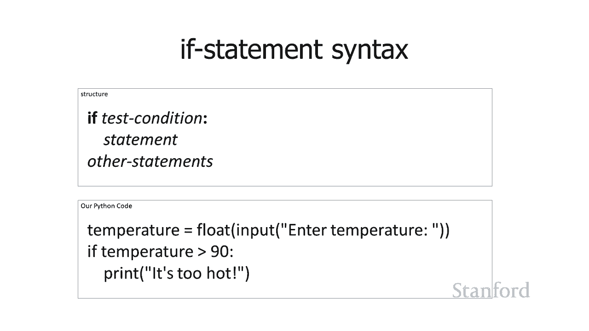

以下是一个使用 if 语句的代码示例，我们将以温度为例：

```python
temperature = float(input("输入温度："))
print("计算机对热敏感。")
if temperature > 90:
    print("太热了！")
    print("您的计算机不会感到高兴。")
print("对您的计算机很好。")
```

这段代码的作用是：
1.  使用 `input` 语句从用户那里获取温度。
2.  将输入的字符串转换为浮点数，因为我们需要将其视为数字。
3.  比较存储在变量 `temperature` 中的数字是否大于 90。
4.  如果该温度大于 90 度，我们将打印“太热了！”。

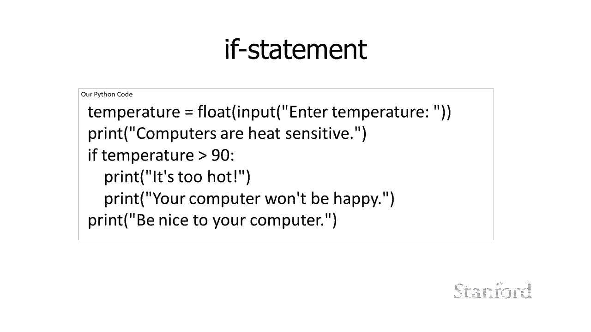

让我们看看这个 if 语句的语法：
*   `if` 是一个关键字（或保留字），在 Python 中具有特定含义。
*   在 `if` 之后，我们有一个**测试条件**。
*   测试条件后面跟着一个冒号 `:`，这个冒号非常重要，不能省略。
*   冒号之后，是**一个或多个缩进的语句**。

这种工作方式是：
1.  评估测试条件，它会给出一个真（True）或假（False）的值。
2.  如果该测试条件为真（例如，温度大于 90），则执行下面缩进的语句。
3.  如果测试条件为假，则跳过缩进的语句。
4.  无论测试条件如何，后面未缩进的语句（如最后的 `print`）总是会被执行。

在 Python 中，语句的缩进决定了哪些语句从属于其他语句。在上面的代码中：
*   前两行和最后一行总是会执行。
*   中间两个缩进的 `print` 语句只有在 `if` 条件为真时才会执行。

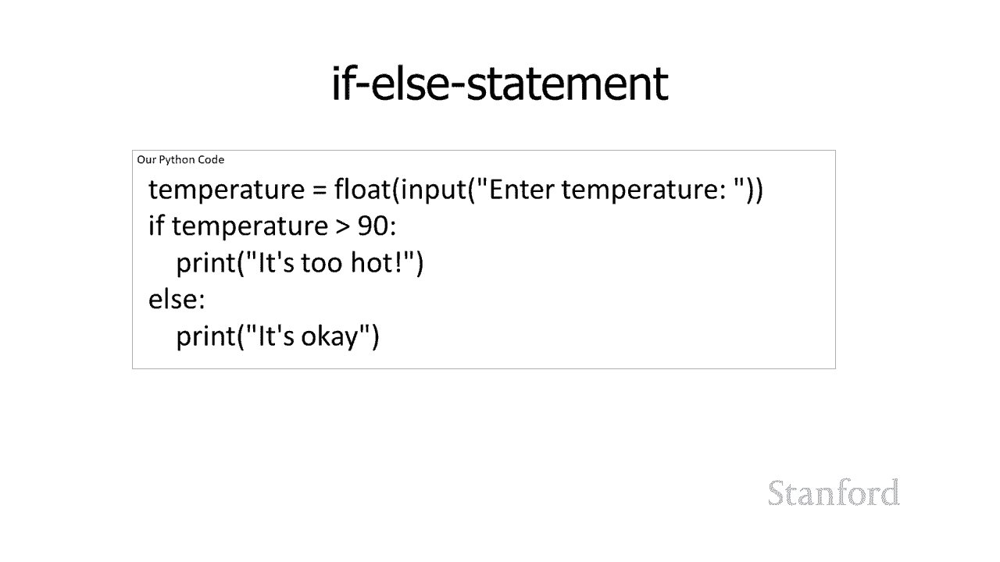

## If-Else 语句

正如之前提到的，有时我们希望在条件为真时执行一组语句，在条件为假时执行另一组语句。这就是 **if-else 语句** 变体提供的功能。

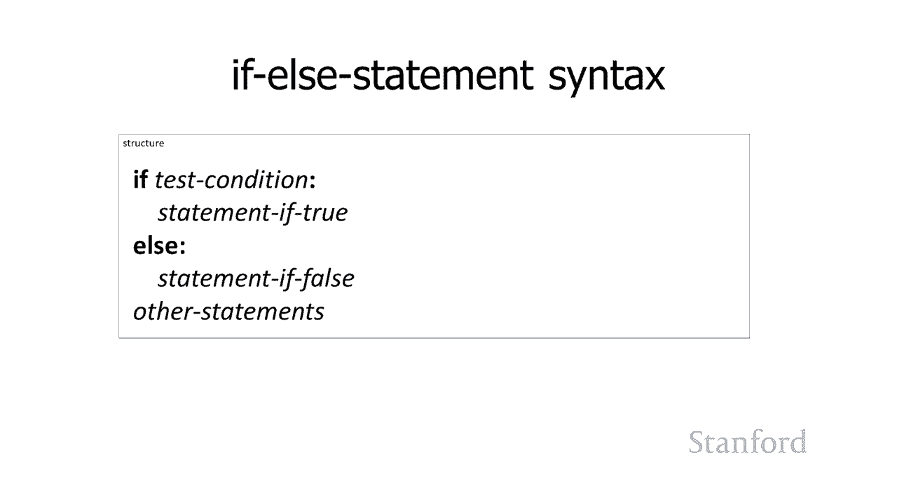

请看以下代码：

```python
temperature = float(input("输入温度："))
if temperature > 90:
    print("太热了！")
else:
    print("没关系。")
```

这段代码的作用是：
*   如果温度大于 90 度，打印“太热了！”。
*   否则（即温度小于或等于 90 度），打印“没关系。”。

这里需要注意，当进行比较时，我们需要考虑边界情况。在这个例子中，如果温度正好是 90 度，它属于“小于或等于 90”的范畴，因此会执行 `else` 分支，打印“没关系。”。

以下是 if-else 语句的语法：
1.  `if` 后跟测试条件和冒号。
2.  缩进一个或多个语句（条件为真时执行）。
3.  `else` 后跟冒号。
4.  缩进一个或多个语句（条件为假时执行）。

如果 `if-else` 结构后面还有其他未缩进的语句，它们总是会被执行。

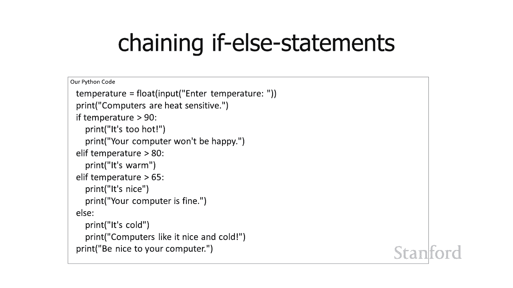

## 链式 If-Elif-Else 语句

我们也可以将多个 if 语句链接在一起，处理多种情况。

```python
temperature = float(input("输入温度："))
print("计算机对热敏感。")
if temperature > 90:
    print("太热了！您的计算机不会感到高兴。")
elif temperature > 80:
    print("很温暖。")
elif temperature > 65:
    print("很好，您的电脑感觉不错。")
else:
    print("很冷，电脑喜欢又冷又好。")
print("对您的计算机很好。")
```

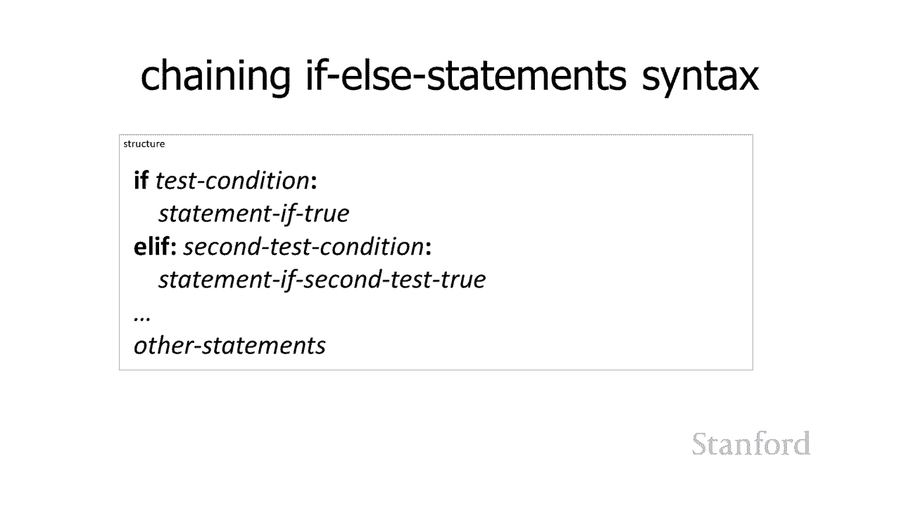

这里的执行逻辑是：
1.  首先检查温度是否大于 90。如果是，执行其下的打印语句，然后**跳过**所有后续的 `elif` 和 `else`，直接执行最后的 `print`。
2.  如果温度不大于 90，则检查第一个 `elif` 的条件：温度是否大于 80。如果是，执行对应语句，然后跳过剩余部分。
3.  如果温度也不大于 80，则检查下一个 `elif` 的条件：温度是否大于 65。如果是，执行对应语句。
4.  如果以上所有条件都不满足，则执行 `else` 分支的语句。

链式结构非常方便。如果不使用它，代码会变得更加混乱，因为我们需要同时检查多个条件（例如，检查温度是否大于80 **并且** 小于等于90），以避免重复打印。

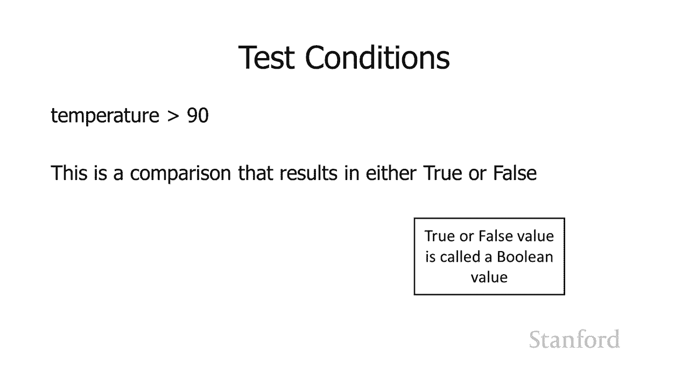

链式结构的一般语法是：
*   `if` [测试条件1]： [语句块1]
*   `elif` [测试条件2]： [语句块2]
*   `elif` [测试条件3]： [语句块3]
*   ...
*   `else`: [语句块N] （可选）

程序会从上到下检查条件，执行第一个为真的条件对应的语句块，然后跳出整个结构。如果所有条件都为假，则执行 `else` 块（如果存在）。

## 测试条件与布尔值

测试条件需要返回一个真（True）或假（False）的值。例如 `temperature > 90` 就是一个比较运算，它会产生一个布尔值。

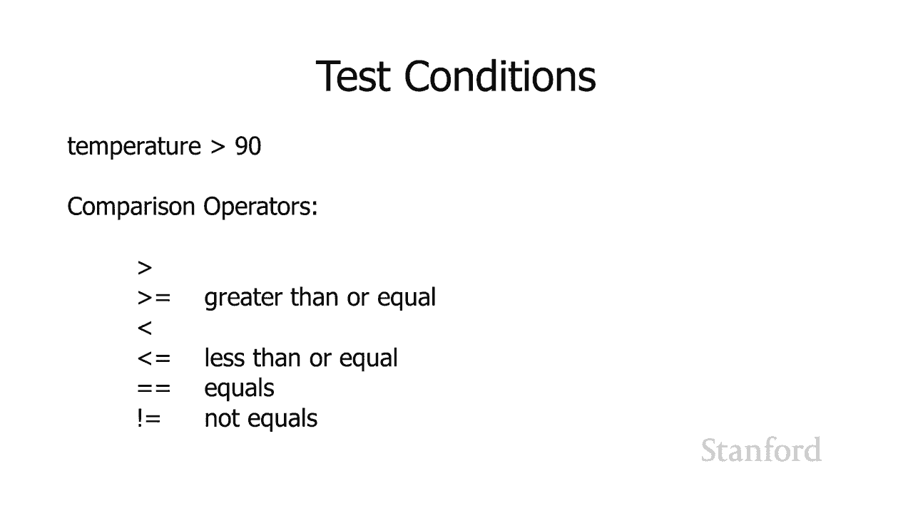

在计算机科学中，真/假值通常被称为**布尔值**，以数学家乔治·布尔的名字命名。他提出了一套基于真假的数学体系，这后来成为了计算的基础。

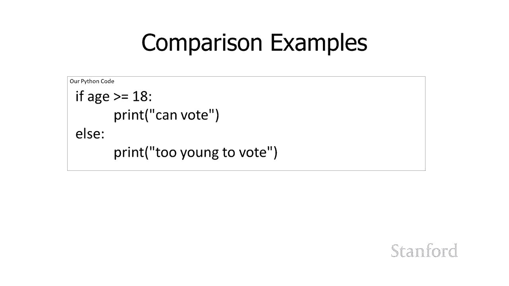

以下是可以使用的比较运算符：
*   `>` ：大于
*   `>=` ：大于或等于（因为键盘上无法直接输入数学符号 ≥）
*   `<` ：小于
*   `<=` ：小于或等于
*   `==` ：等于（注意：双等号用于比较，单等号 `=` 用于变量赋值）
*   `!=` ：不等于

示例：检查投票年龄
```python
age = int(input("请输入你的年龄："))
if age >= 18:
    print("你可以投票。")
else:
    print("你太年轻，不能投票。")
```

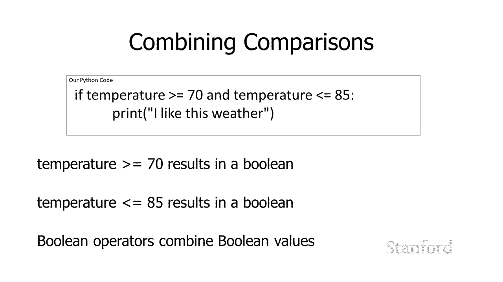

## 组合布尔条件

我们可以使用逻辑运算符将多个比较组合在一起，构成更复杂的条件。

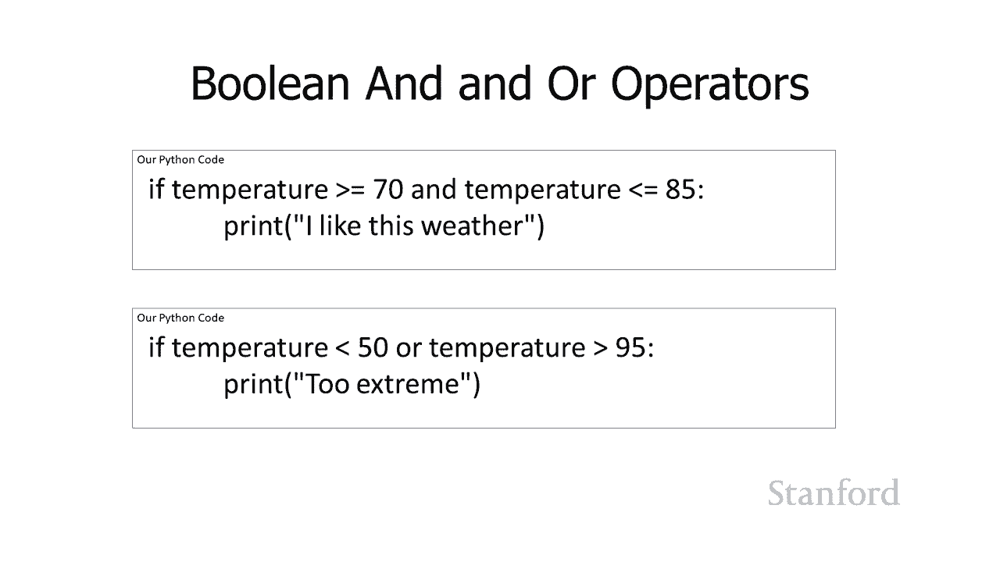

**1. 与运算符 `and`**
`and` 运算符要求两边的条件**同时**为真，整个表达式才为真。
```python
if temperature >= 70 and temperature <= 85:
    print("我喜欢这种天气。")
```
只有当温度大于等于70 **并且** 小于等于85时，才会打印。

**2. 或运算符 `or`**
`or` 运算符要求两边的条件**至少有一个**为真，整个表达式就为真。
```python
if temperature < 50 or temperature > 95:
    print("太极端了！")
```
如果温度小于50度 **或者** 大于95度，都会打印“太极端了！”。

**3. 非运算符 `not`**
`not` 运算符将其后的布尔值反转。
```python
if not (age >= 18):
    print("三岁就可以投票！") # 注意：这是一个逻辑反转的示例，并非实际法律
```
`not (age >= 18)` 等价于 `age < 18`。这个例子展示了逻辑反转，但实际代码中直接写 `age < 18` 会更清晰。

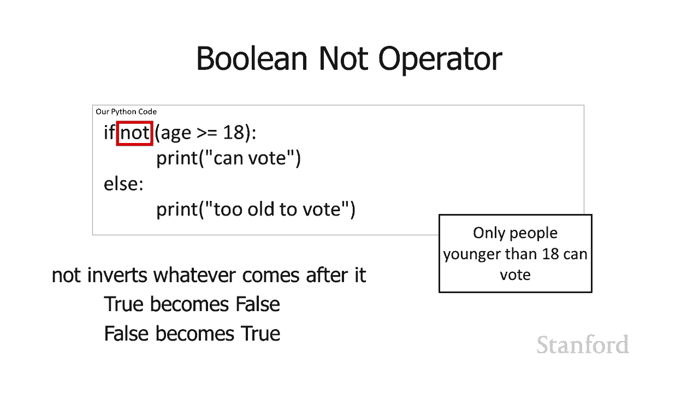

## 布尔值本身

在 Python 中，布尔值可以直接写成 `True` 和 `False`（首字母大写）。
```python
if True:
    print("我喜欢这种天气。") # 这行总是会打印
```
虽然你不会在简单的 `if` 语句中直接使用 `True`，但布尔值本身是一种数据类型，可以存储在变量中，并用于其他控制结构。
```python
is_sunny = True
is_warm = (temperature > 70)
```
就像整数、浮点数和字符串一样，布尔值是我们可以存储在变量中的另一种值，并且有运算符（`and`, `or`, `not`）可以对它们进行操作。

## 总结

在本节课中，我们一起学习了条件控制结构，它们是编程中实现决策逻辑的核心工具。
*   我们首先了解了 **`if` 语句**，它允许在条件为真时执行代码块。
*   接着学习了 **`if-else` 语句**，它提供了条件为真和为假时的两条执行路径。
*   然后探讨了 **链式 `if-elif-else` 语句**，用于处理多个互斥的条件分支。
*   我们详细介绍了构成条件的**比较运算符**（`>`, `<`, `==`, `!=`, `>=`, `<=`）和**逻辑运算符**（`and`, `or`, `not`）。
*   最后，我们认识了**布尔值**（`True`, `False`）作为一种基本数据类型。


掌握这些条件流程控制，是让程序变得“智能”和适应不同情况的第一步。在下一节课中，我们将继续探索其他类型的控制结构。