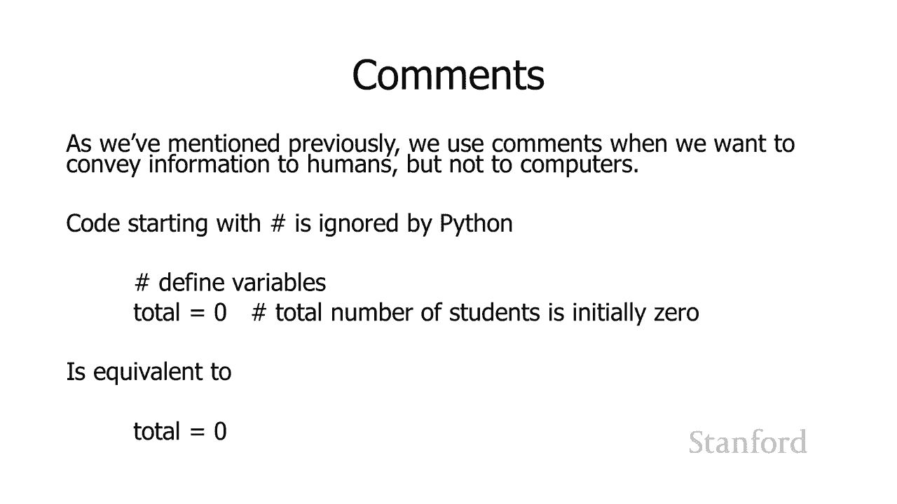

# L18.1：Python语言附加功能 🐍

在本节课中，我们将学习Python语言的一些附加功能。这些功能在某些情况下非常方便，能帮助我们编写更清晰、更易读的代码。我们将探讨如何处理长语句、连接字符串以及如何编写注释。

## 多行语句的编写 ✍️

有时，一行代码太长，无法舒适地放在一行中。在某些语言中，你可以直接跨行拆分代码。但在Python中，直接换行会导致错误。

以下是几种解决方案：

1.  **使用反斜杠（\\）**：在未完成行的末尾加上一个反斜杠，告诉Python这一行尚未结束，下一行是当前行的延续。
    ```python
    name = \
    input("Enter your name: ")
    ```

2.  **使用括号（()）**：如果语句中已有括号（例如函数调用或数学表达式），Python会自动将跨行的内容视为同一语句的一部分，直到遇到右括号。
    ```python
    total = (1 + 2 + 3 +
             4 + 5 + 6)
    ```

3.  **使用方括号（[]）**：对于列表等数据结构，同样可以使用方括号来实现多行编写。
    ```python
    my_list = [
        "item1",
        "item2",
        "item3"
    ]
    ```

## 字符串的连接 🔗

在计算机科学中，连接字符串意味着将两个字符串组合成一个。Python提供了简单的方法来实现这一点。

在Python中，只需用空格分隔字符串，它们就会自动连接在一起。
```python
greeting = "Hello" "World"  # 结果为 "HelloWorld"
```
请注意，这种方法不会自动添加空格。如果需要空格，必须在字符串中包含它。
```python
greeting = "Hello " "World"  # 结果为 "Hello World"
# 或者
greeting = "Hello" + " " + "World"  # 使用加号连接
```

当处理很长的字符串时，可以将其分解为多个较短的字符串，然后让Python自动连接它们。这在多行编写时特别有用。
```python
motto = ("Die Luft der Freiheit weht "  # 注意每个字符串末尾的空格
         "- The wind of freedom blows")
```

此外，还可以使用三引号（`'''` 或 `"""`）来创建跨越多行的字符串，无需在每行都加引号。
```python
long_text = """This is a very long string
that spans multiple lines
without needing backslashes or plus signs."""
```

## 如何编写注释 💬

注释用于向阅读代码的人传达信息，但会被计算机忽略。在Python中，使用井号（`#`）来编写注释。

当Python看到井号时，它会忽略该行中井号之后的所有内容。
```python
# 这是一个完整的注释行，计算机将完全忽略它
total = 0  # 学生总数初始化为零
```
在上面的例子中，第一行是完整的注释。第二行中，`total = 0` 会被执行，但 `# 学生总数初始化为零` 部分会被忽略。

---




本节课中我们一起学习了Python的几个附加功能：如何编写多行语句、如何连接字符串以及如何编写注释。掌握这些技巧能让你的代码更整洁、更易维护。