# 计算机科学导论：L18.2：列表和循环 🧮


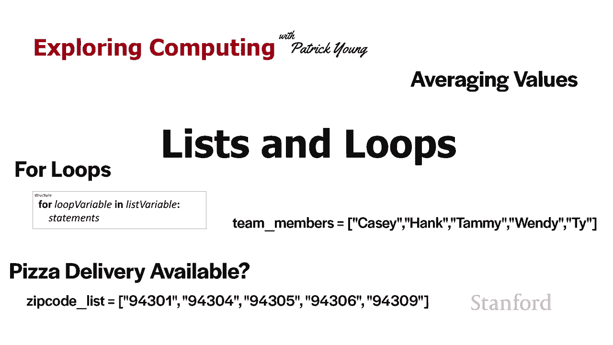

在本节课中，我们将要学习 Python 中两个极其重要的概念：**列表**和**循环**。列表是存储一系列数据的结构，而循环则允许我们高效地处理列表中的每一个元素。掌握这两者，你将能编写出处理大量数据的程序。

## 列表基础 📝

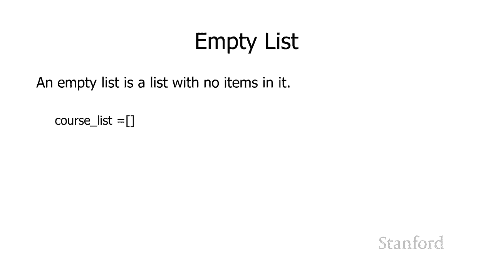

上一节我们介绍了本节课的主题。本节中，我们来看看什么是列表以及如何创建它。

计算机真正擅长的一件事是处理信息列表。我们并不喜欢手动处理大量信息。例如，对单个学生进行毕业检查很简单，但对成千上万名学生进行同样的检查就非常繁琐。计算机则不在乎项目的数量，它擅长对列表中的每个项目执行完全相同的计算。

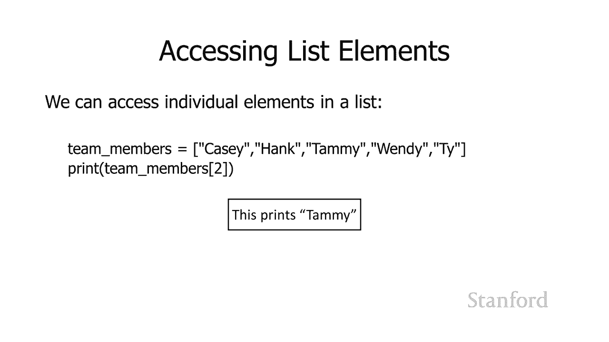

在 Python 中，列表用方括号 `[]` 表示，其中的元素用逗号分隔。

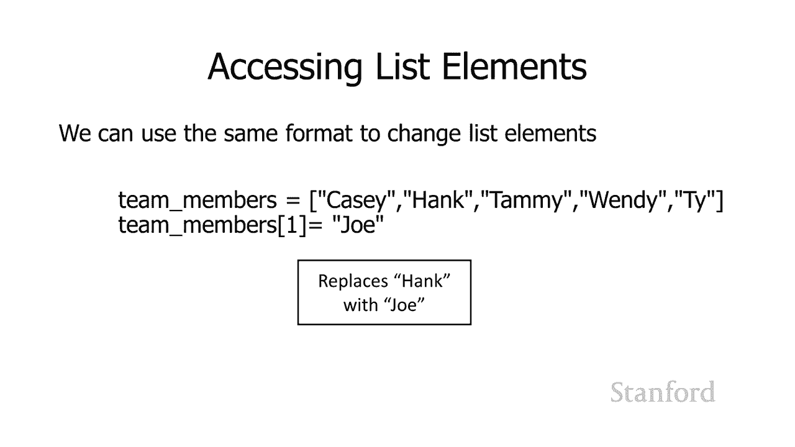

```python
ages = [19, 21, 20]
team_members = ["KC", "Hank", "Tammy"]
```

以下是创建列表时的几个要点：
*   列表可以包含数字、字符串等多种类型的数据。
*   列表可以存储在变量中，便于后续使用。
*   可以创建一个空列表，即不包含任何元素的列表。

```python
courses = []  # 这是一个空列表
```

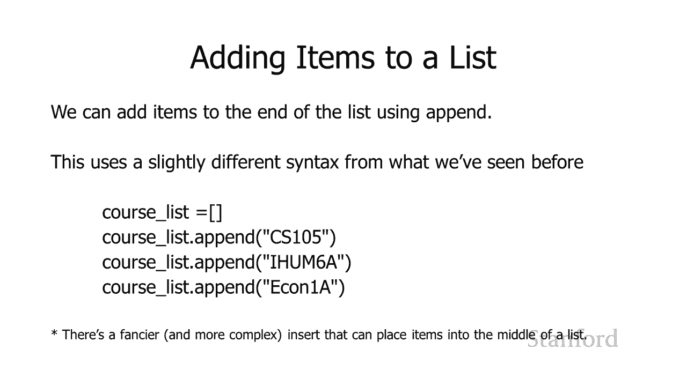

## 访问和修改列表元素 🔍

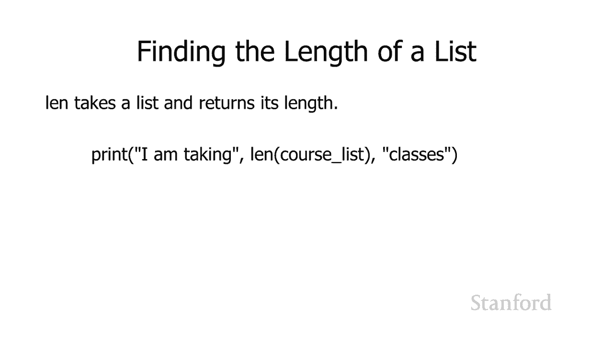

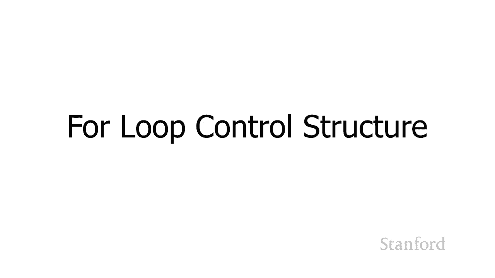

创建列表后，我们经常需要访问或修改其中的元素。这通过**索引**来实现。

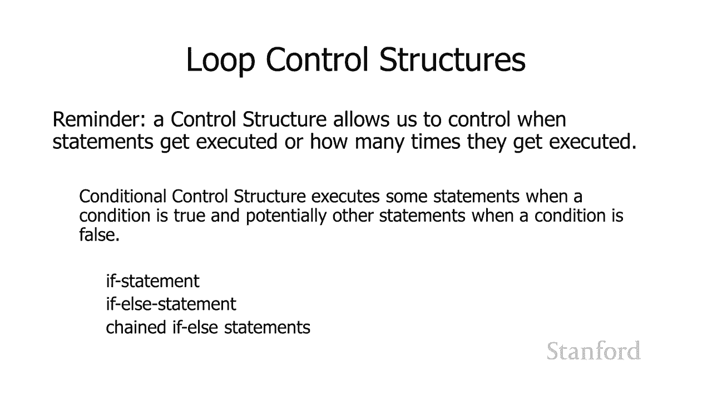

Python 使用方括号 `[]` 和索引号来访问列表中的特定元素。需要注意的是，Python 中的索引从 **0** 开始计数。

```python
print(team_members[2])  # 输出：Tammy
```

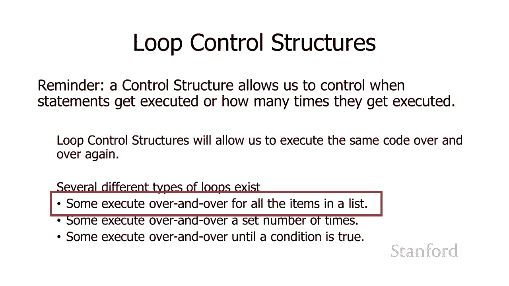

我们也可以使用同样的方式修改列表中某个位置的值。

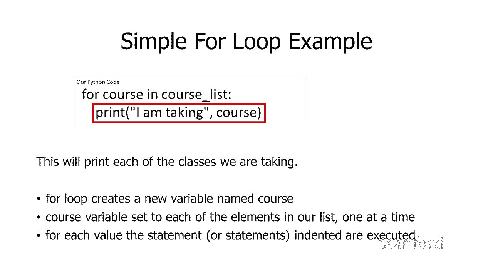

```python
team_members[1] = "Joe"  # 将列表中的第二个元素（索引1）从"Hank"改为"Joe"
```

## 向列表添加元素 ➕

除了直接修改，我们还可以向列表末尾添加新元素，这需要使用 `append()` 方法。

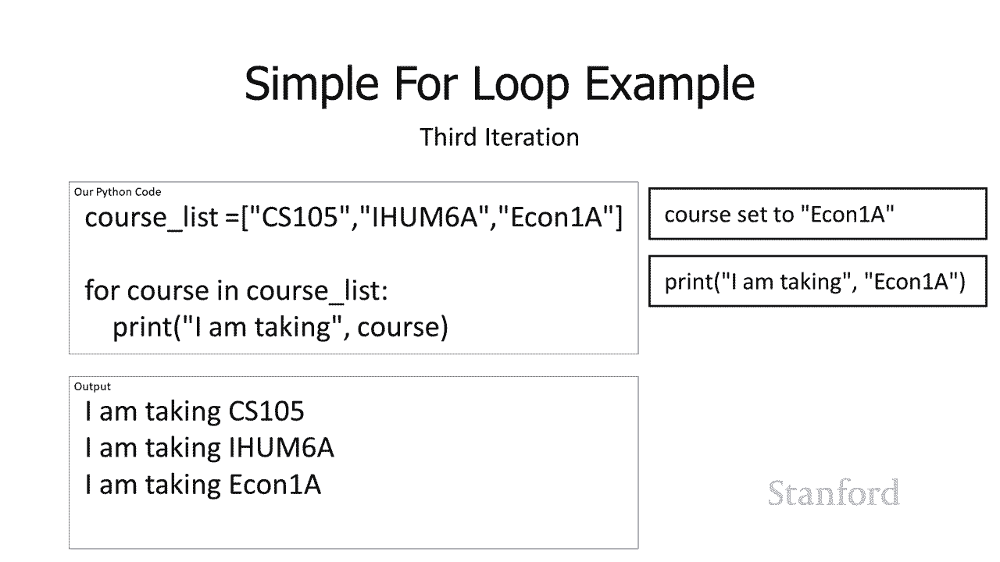

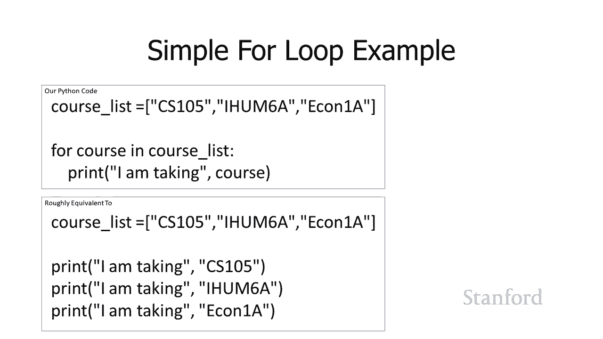

`append()` 的语法是：`列表变量.append(要添加的元素)`。它会修改原列表，在其末尾添加新元素。

```python
courses.append("CS105")
courses.append("IHUM 6A")
courses.append("ECON 1A")
# 现在 courses 列表是 ['CS105', 'IHUM 6A', 'ECON 1A']
```

有时你想知道列表当前有多长，可以使用 `len()` 函数。

```python
num_of_courses = len(courses)  # 结果为 3
```

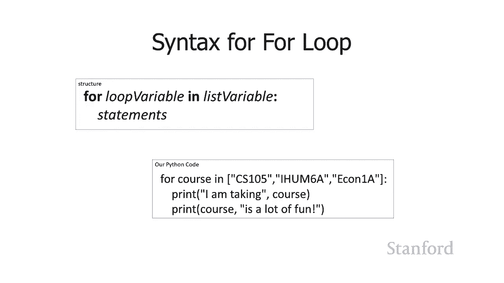

## For 循环：遍历列表 🔄

我们想要对列表做的最常见的事情之一，就是处理其中的每一个项目。为此，我们将使用 **for 循环**。

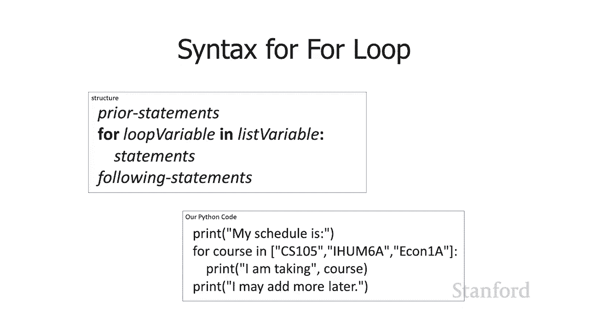

循环是一种控制结构，允许我们控制一段代码执行的次数。`for` 循环特别适合对列表中的每个项目执行相同的操作。

其基本语法是：`for 循环变量 in 列表变量:`。接下来所有缩进的代码将针对列表中的每个元素重复执行。

```python
for course in courses:
    print("I am taking", course)
```

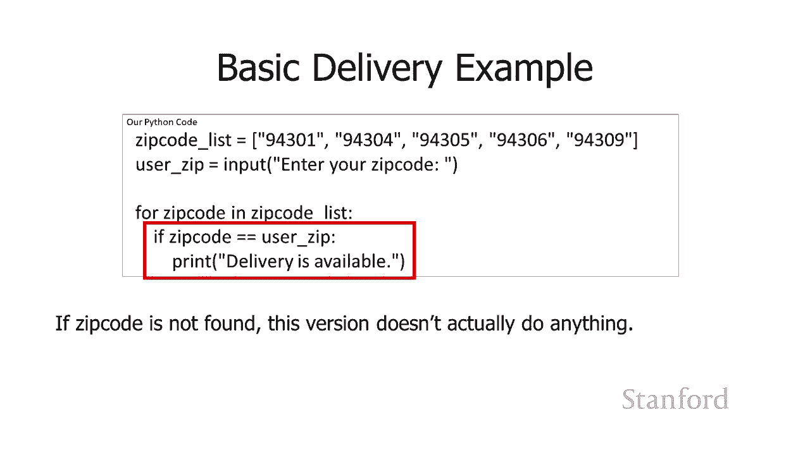

以下是 `for` 循环的执行过程：
1.  第一次迭代：`course` 变量被设置为列表中的第一个值 `"CS105"`，然后执行缩进块的代码，打印 “I am taking CS105”。
2.  第二次迭代：`course` 变量被设置为 `"IHUM 6A"`，再次执行打印语句。
3.  第三次迭代：`course` 变量被设置为 `"ECON 1A"`，执行打印语句。

循环体（即缩进的代码块）可以包含多条语句，它们都会针对每个元素执行。循环外部（未缩进）的代码则只在循环开始前或结束后执行一次。

## 循环应用示例：求和与平均值 📊

为了加深理解，让我们看两个使用循环处理数字列表的实用例子。

第一个例子是计算列表中所有数字的总和。思路是创建一个变量（如 `total`）初始为0，然后在循环中把每个数字依次加到这个变量上。

```python
numbers = [100, 200, 150, 400]
total = 0
for number in numbers:
    total = total + number  # 将当前数字加到总和上
print(total)  # 输出：850
```

这里的 `total = total + number` 需要正确理解：它先计算等号右边 `total + number` 的值，然后将这个**结果**赋值给左边的 `total` 变量，更新其值。

基于求和的例子，我们可以进一步计算这些数字的平均值。平均值等于总和除以元素个数。

```python
average = total / len(numbers)
print(average)  # 输出：212.5
```

## 循环应用示例：使用布尔标志 🚩

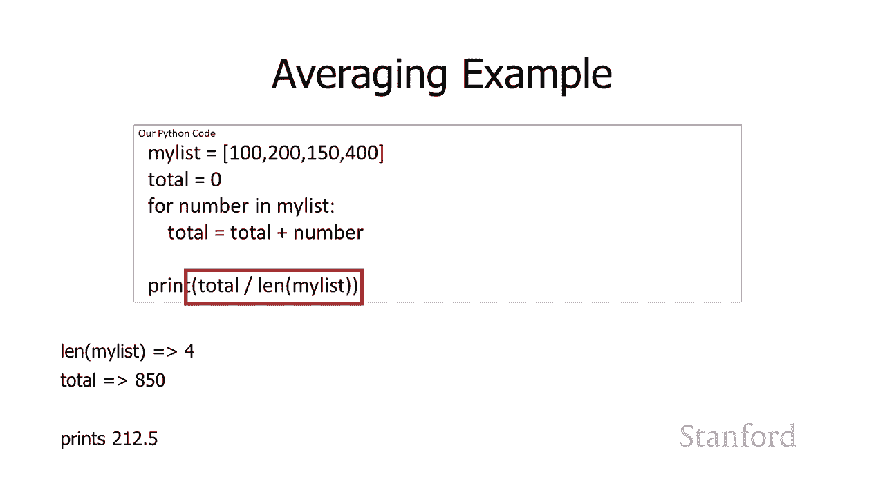

有时，我们需要在遍历列表时记录是否找到了某个特定条件。这时，**布尔变量**（`True` 或 `False`）就非常有用，它像一个标志。

假设我们有一个提供服务的邮编列表，需要检查用户输入的邮编是否在列表中。如果在，就打印提示；如果遍历完整个列表都没找到，则需要告知用户无法服务。

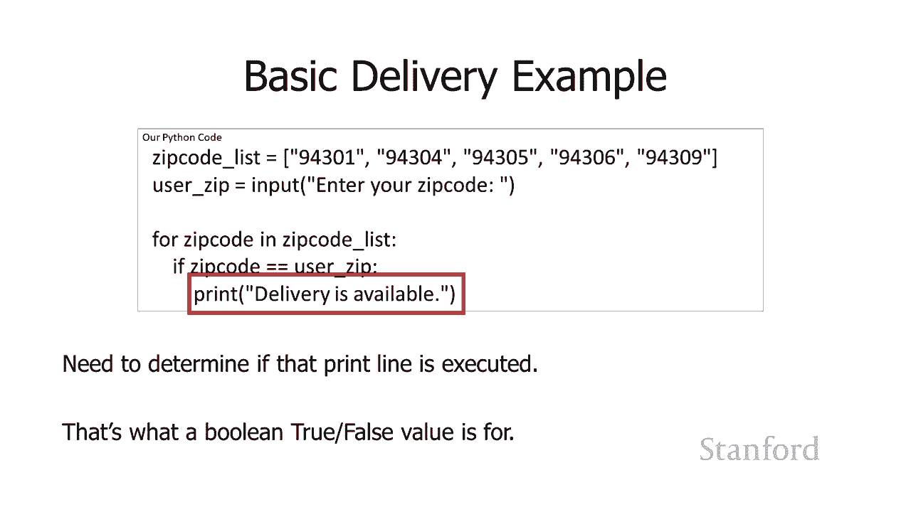

```python
service_zips = [94301, 94304, 94305]
user_zip = int(input("What is your zip code? "))

zip_found = False  # 先设置一个“未找到”的标志

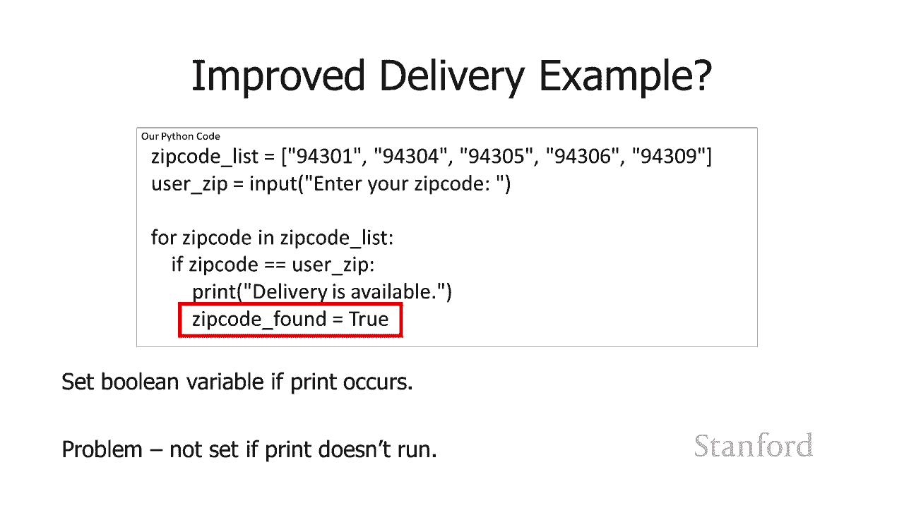

for zip_code in service_zips:
    if user_zip == zip_code:
        print("Delivery is available to you!")
        zip_found = True  # 找到了，把标志设为 True

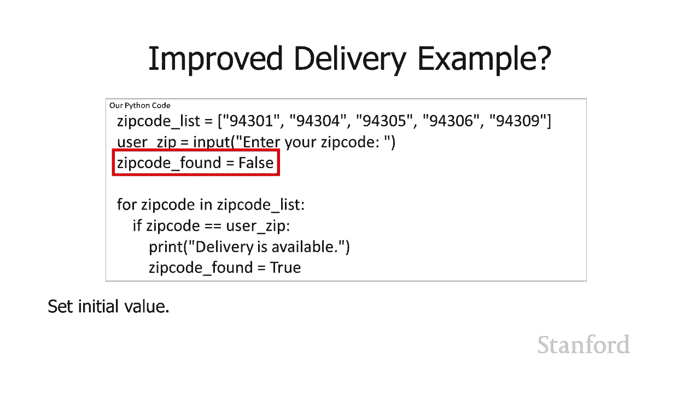

# 循环结束后，检查标志
if not zip_found:  # 如果 zip_found 为 False
    print("Sorry, no delivery available.")
```

在这个模式中，我们首先假设“没找到”（`zip_found = False`）。在循环中，一旦找到匹配项，除了执行相应操作（打印信息），还将标志置为 `True`。循环结束后，通过检查这个布尔标志，就能知道是否发生过匹配，从而执行不同的后续逻辑。

## 总结 🎯

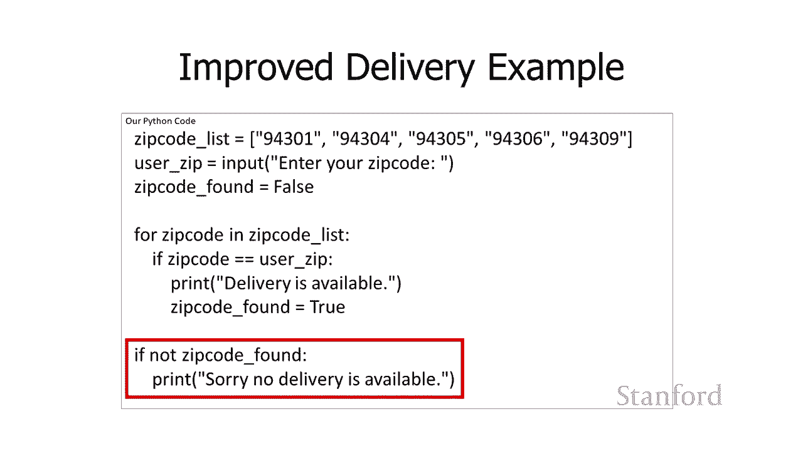


本节课中我们一起学习了 Python 的**列表**和**for循环**。我们了解了如何创建列表、访问和修改元素、以及使用 `append()` 添加元素。更重要的是，我们掌握了如何使用 `for` 循环来遍历列表，并对每个元素执行操作，这包括计算总和、平均值以及利用布尔变量进行条件追踪。列表和循环的结合是自动化处理数据的基石，希望你通过本课的学习，能够开始编写更强大、更高效的程序。