# 计算机科学导论：L19.1：字符串 🧵


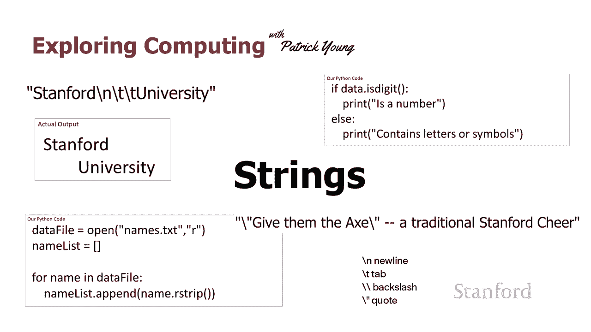

在本节课中，我们将要学习Python中字符串（String）的基本概念和操作方法。字符串是编程中用于表示文本数据的重要数据类型。我们将了解如何创建字符串、使用转义序列、访问字符串中的字符，以及一些常用的字符串方法。

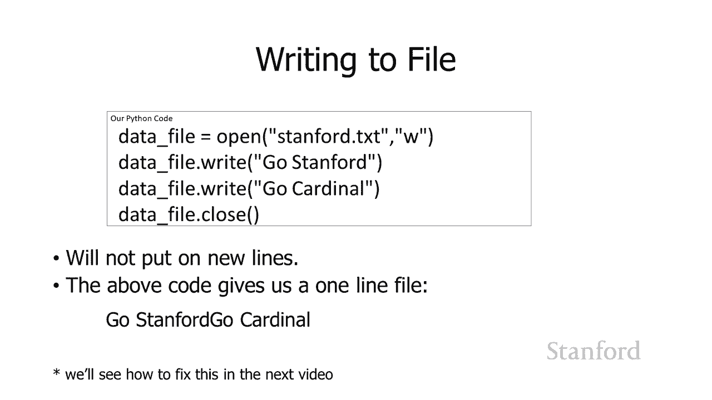

---

## 字符串与转义序列

上一节我们介绍了字符串的基本概念，本节中我们来看看如何表示字符串中的特殊字符。

在Python中，字符串由引号（单引号或双引号）包围。有时我们需要在字符串中包含一些特殊字符，例如换行符或引号本身。这时，我们就需要使用**转义序列**。

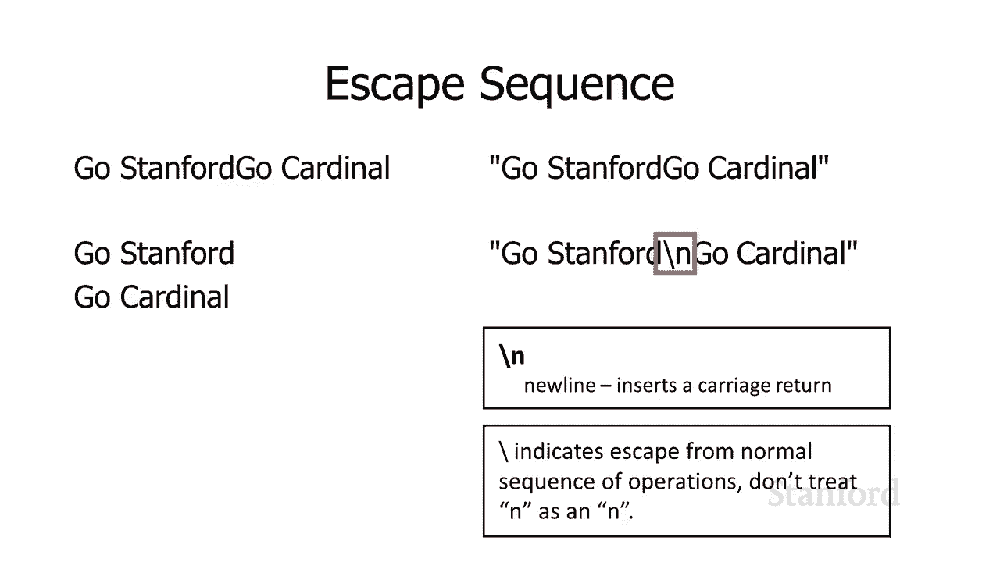

转义序列以反斜杠 `\` 开头，它告诉Python接下来的字符具有特殊含义，而不是其字面意义。

以下是几个常见的转义序列：

*   `\n`：代表一个**换行符**。
*   `\t`：代表一个**制表符**。
*   `\\`：代表一个**反斜杠**本身。
*   `\"` 或 `\'`：代表字符串中的**引号**。

例如，字符串 `"Stanford\n\tUniversity"` 在输出时会显示为：
```
Stanford
    University
```
其中 `\n` 让“University”换到新的一行，`\t` 让它前面有一个制表符的缩进。

如果你想在字符串中包含双引号，但不能直接用 `"`（因为它会与表示字符串开始和结束的引号混淆），就需要使用转义序列 `\"`。

**示例代码：**
```python
# 错误的写法：引号会提前结束字符串
# my_string = "Go "Stanford"!"

# 正确的写法：使用转义序列
my_string = "Go \"Stanford\"!"
print(my_string)  # 输出：Go "Stanford"!
```

---

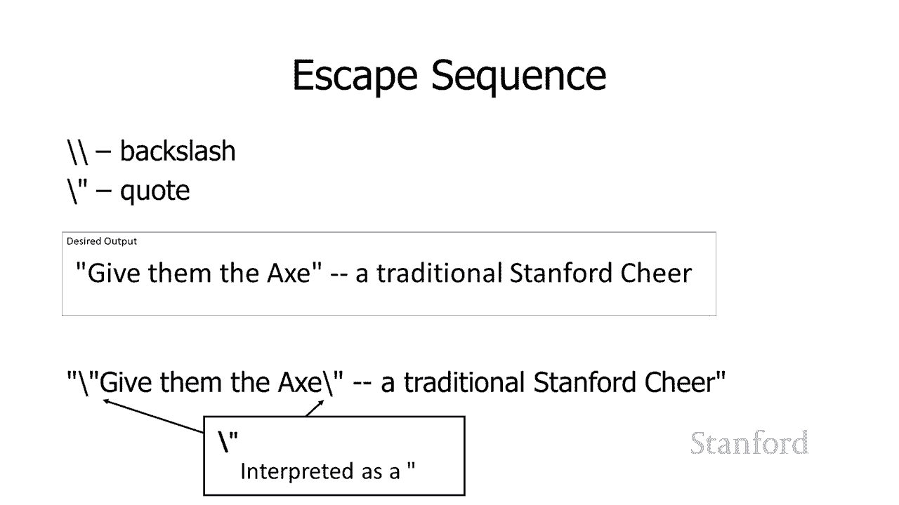

## 字符串的序列操作

字符串和列表（List）在Python中都属于**序列**类型。这意味着它们共享一些相似的操作。

就像列表一样，我们可以使用方括号 `[]` 和索引来访问字符串中的单个字符。索引从0开始。

**示例代码：**
```python
name = "Stanford"
print(name[0])  # 输出：S
print(name[1])  # 输出：t
print(name[4])  # 输出：f
```

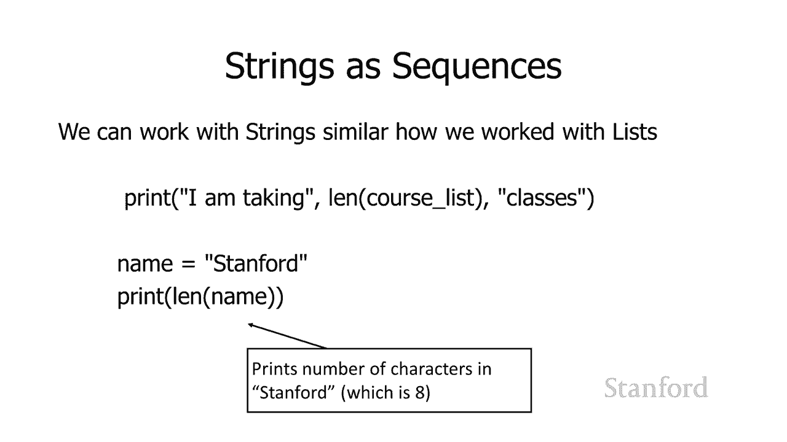

我们也可以使用 `len()` 函数来获取字符串的长度（即包含的字符数）。

**示例代码：**
```python
name = "Stanford"
print(len(name))  # 输出：8
```

**重要区别**：虽然可以访问字符串中的字符，但**不能直接修改**它们。字符串在Python中是不可变的（Immutable）。这与列表不同，列表中的元素是可以被修改的。

---

## 函数与方法

在操作字符串时，你会遇到两种形式的调用：**函数**和**方法**。理解它们的区别很重要。

*   **函数**：像一个独立的工具。你直接使用它的名字，后面跟上括号和参数。
    *   例如：`print("Hello")`， `len(my_string)`
*   **方法**：像一个“属于”某个特定数据的工具。你首先指定这个数据（变量），然后是一个点 `.`，接着是方法名和括号。
    *   例如：`my_string.strip()`， `my_list.append(item)`

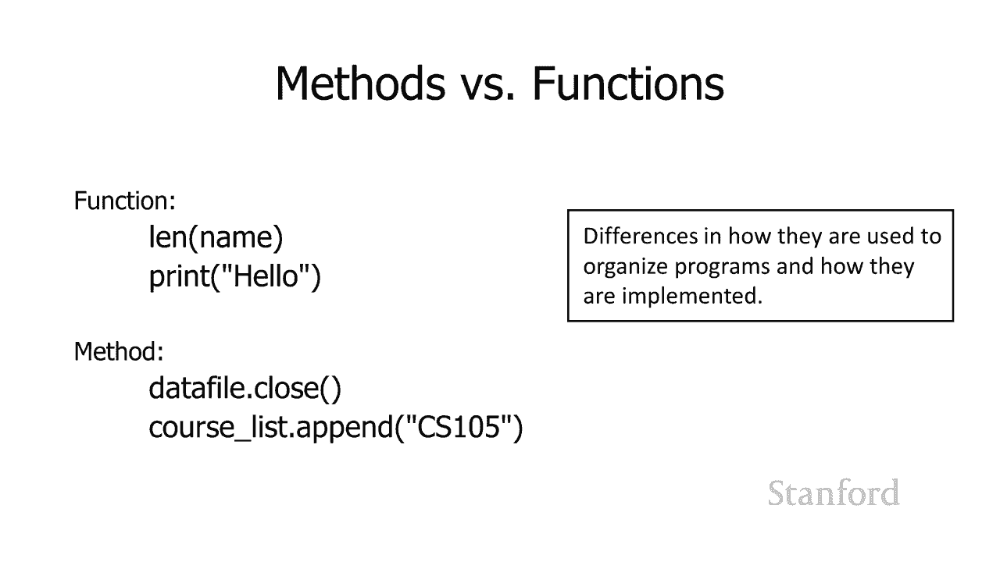

简单来说，方法是附加在特定数据类型（如字符串、列表）上的函数。接下来我们将看到一些常用的字符串方法。

---

## 常用的字符串方法

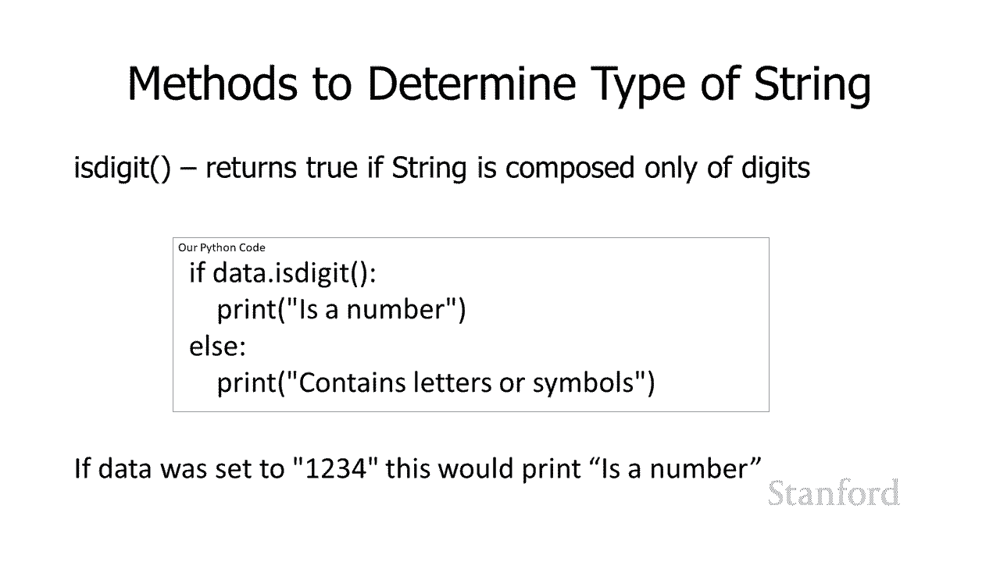

以下是处理字符串时非常有用的几个方法。

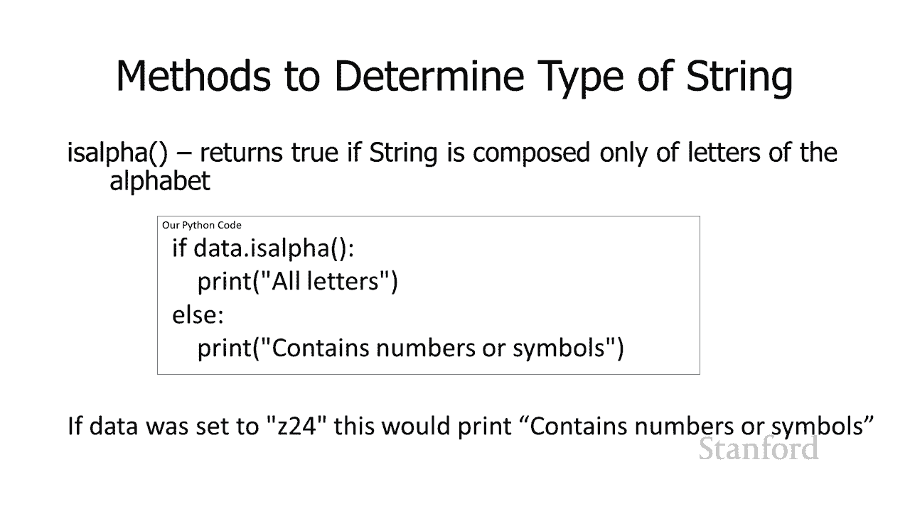

### 1. 检查字符串内容：`.isdigit()` 和 `.isalpha()`

*   `字符串.isdigit()`：如果字符串**只包含数字**，则返回 `True`，否则返回 `False`。
*   `字符串.isalpha()`：如果字符串**只包含字母**，则返回 `True`，否则返回 `False`。

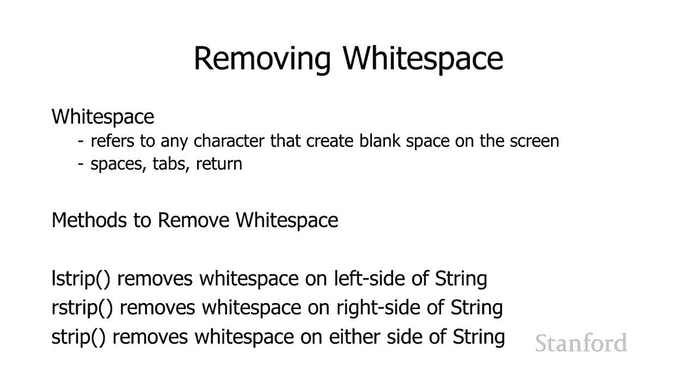

**示例代码：**
```python
data1 = "1234"
data2 = "z24"
data3 = "Hello"

print(data1.isdigit())  # 输出：True
print(data2.isalpha())  # 输出：False (因为包含数字)
print(data3.isalpha())  # 输出：True
```

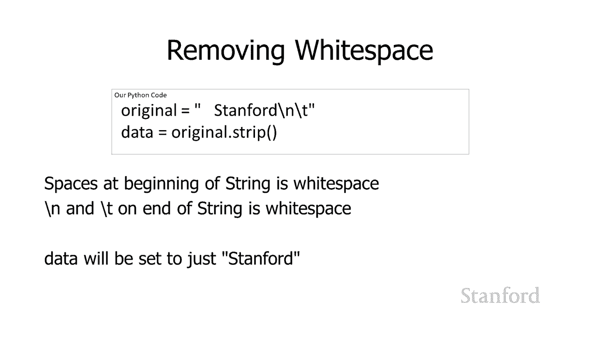

### 2. 去除空白字符：`.strip()`, `.lstrip()`, `.rstrip()`

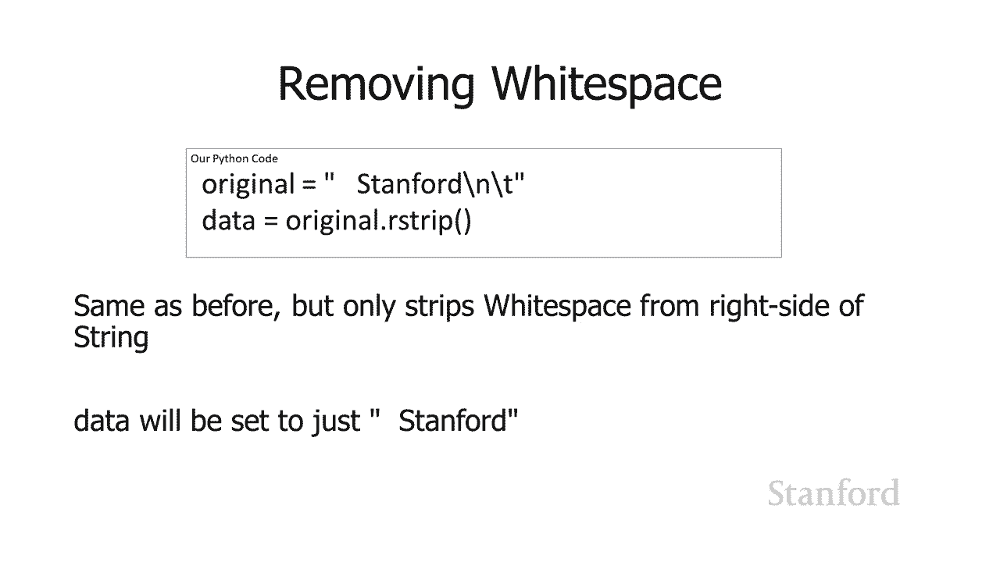

空白字符包括空格、制表符 `\t`、换行符 `\n` 等。
*   `字符串.strip()`：**去除字符串两侧**的所有空白字符。
*   `字符串.lstrip()`：**仅去除字符串左侧（开头）** 的空白字符。
*   `字符串.rstrip()`：**仅去除字符串右侧（末尾）** 的空白字符。

这在读取文件时特别有用，因为每行末尾通常带有换行符 `\n`。

**示例代码：**
```python
original = "  Stanford\n\t"
print(f"原始字符串: '{original}'")

data_strip = original.strip()
print(f"使用.strip(): '{data_strip}'")  # 输出：'Stanford'

data_rstrip = original.rstrip()
print(f"使用.rstrip(): '{data_rstrip}'") # 输出：'  Stanford'
```

**实际应用场景**：从文件读取多行内容时，通常会用 `.rstrip()` 去掉每行末尾的换行符，然后再进行处理。

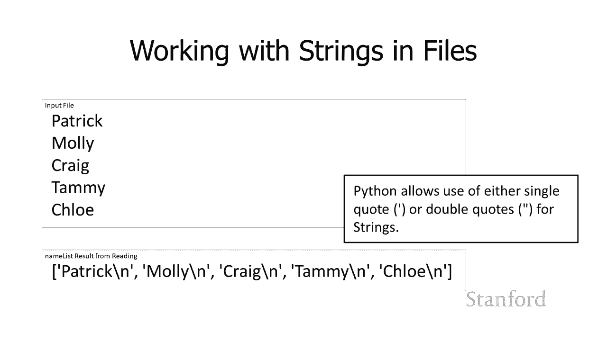

**示例代码：**
```python
names_list = []
# 假设 data_file 是一个已打开的文件对象
for line in data_file:
    clean_name = line.rstrip()  # 去掉行末的换行符
    names_list.append(clean_name)
# 现在 names_list 里是不带换行符的干净名字
```

---

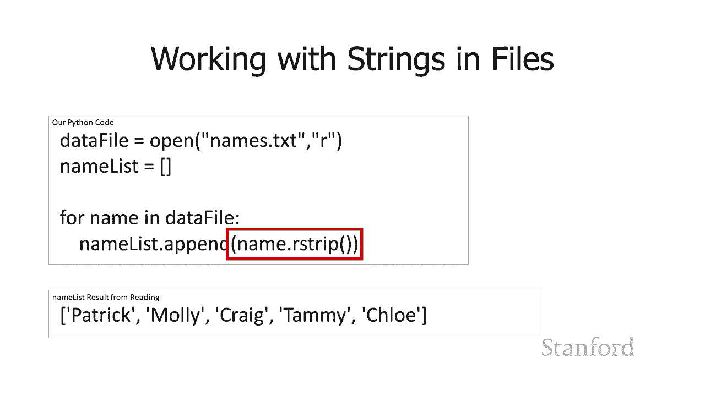


本节课中我们一起学习了Python字符串的核心知识。我们了解了如何用转义序列表示特殊字符，字符串作为序列支持索引和长度查询，以及函数与方法的区别。最后，我们掌握了几种实用的字符串方法，包括检查内容（`isdigit`, `isalpha`）和清理数据（`strip`系列）。这些是处理文本信息的基础，在文件操作和数据清洗中会经常用到。