# 斯坦福CS105：计算机科学导论：L19.2：Python文件操作 📂


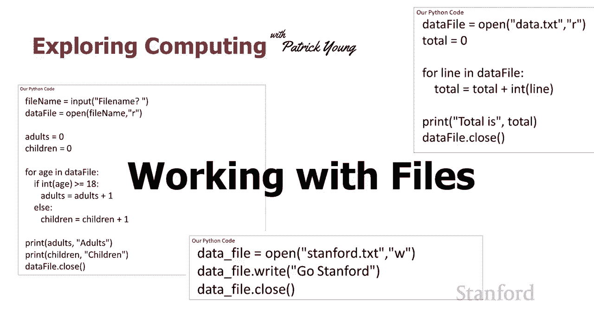

在本节课中，我们将学习如何使用Python进行文件操作。文件操作是编程中的一项核心技能，它允许程序从外部文件读取数据，或将计算结果保存到文件中，从而极大地扩展了程序的功能和实用性。

## 打开与关闭文件

上一节我们介绍了文件操作的重要性，本节中我们来看看如何打开和关闭文件。这是与文件交互的第一步。

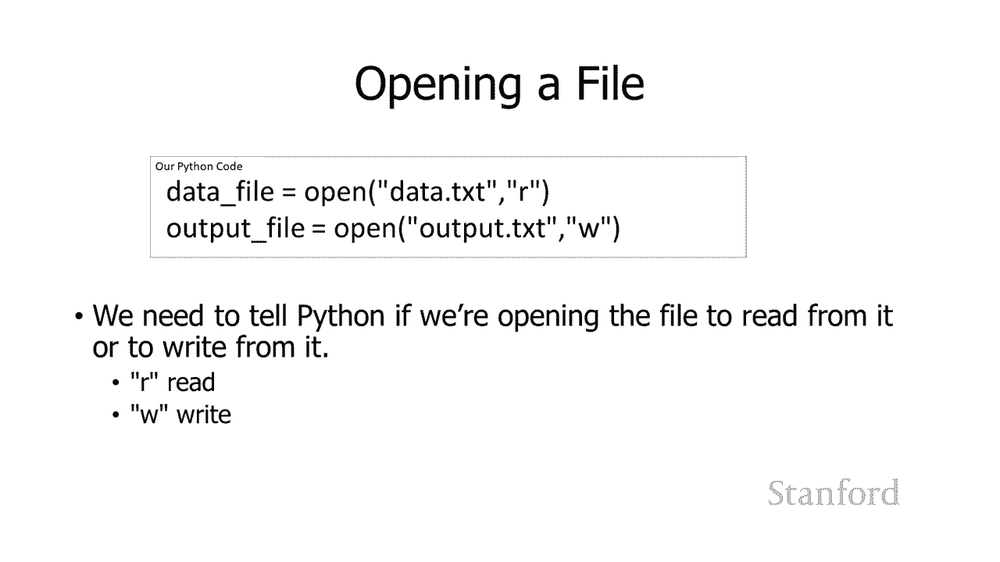

在Python中，使用 `open()` 函数来打开一个文件。这个函数需要两个主要参数：文件名和打开模式。

**代码示例：打开文件**
```python
file = open("data.txt", "r")
```

*   **文件名**：一个字符串，指定要打开的文件路径。如果文件与你的Python脚本在同一目录下，只需提供文件名即可。
*   **打开模式**：也是一个字符串，告诉Python你打算对文件做什么。
    *   `"r"`：表示“读取”。如果文件不存在，Python会报错。
    *   `"w"`：表示“写入”。如果文件不存在，Python会创建它；如果文件已存在，Python会**覆盖**其原有内容。
    *   `"a"`：表示“追加”。如果文件不存在，Python会创建它；如果文件已存在，新内容会添加到文件末尾，不会覆盖原有内容。

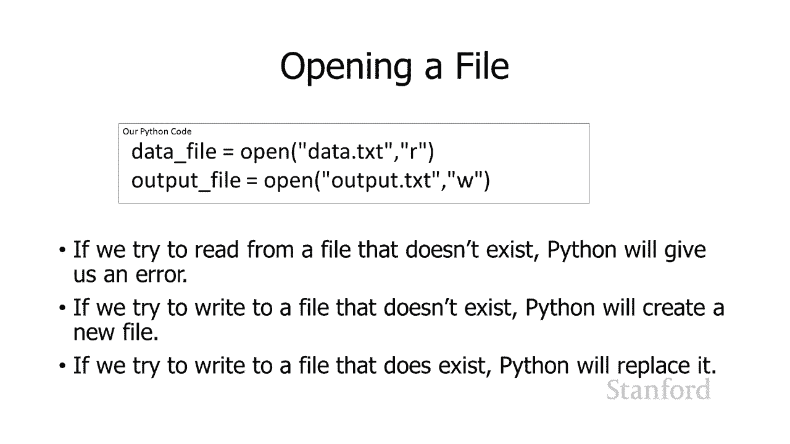

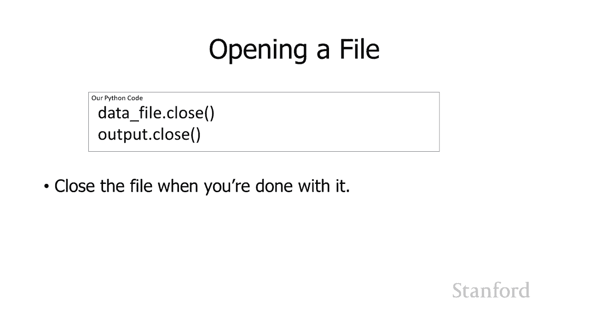

完成文件操作后，必须使用 `.close()` 方法关闭文件。这是一个好习惯，可以确保所有数据都被正确写入并释放系统资源。

**代码示例：关闭文件**
```python
file.close()
```

## 从文件中读取数据

学会了打开和关闭文件后，接下来我们学习如何从文件中读取内容。从文件中读取数据的最简单方法是使用 `for` 循环。

以下是一个示例程序，它读取一个包含数字的文件，并计算这些数字的总和。

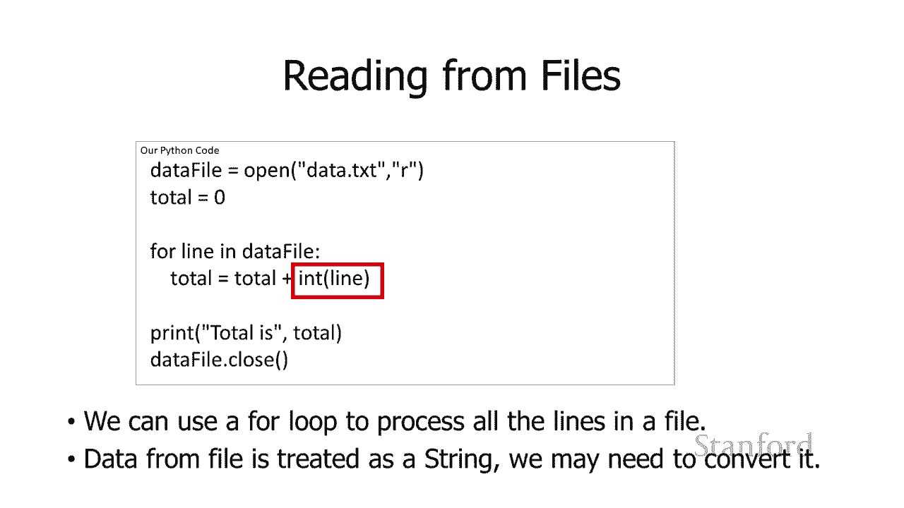

**代码示例：读取文件并求和**
```python
# 1. 打开文件
file = open("data.txt", "r")
total = 0

# 2. 逐行读取并处理
for line in file:
    number = int(line)  # 将从文件读取的字符串转换为整数
    total = total + number

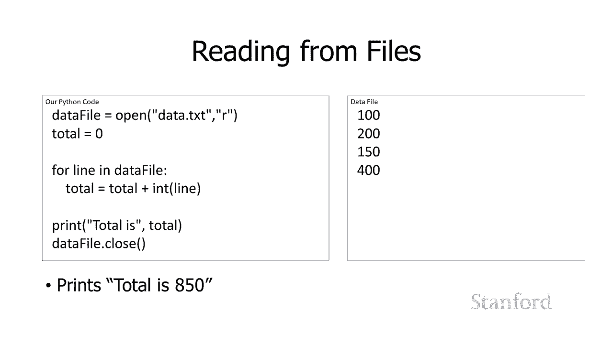

# 3. 关闭文件
file.close()

print(total)
```

**核心概念解释**：
*   `for line in file:` 这个循环会遍历文件中的每一行。变量 `line` 在每次迭代中自动被赋值为文件中的下一行内容。
*   `int(line)`：从文件中读取的每一行内容，Python都将其视为**字符串**。如果我们需要将其作为数字进行计算，必须使用 `int()` 或 `float()` 函数进行类型转换。

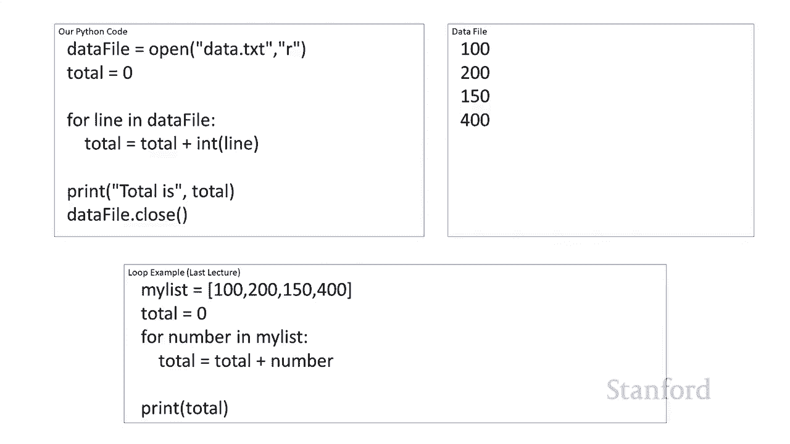

除了使用循环，也可以使用 `.readline()` 方法逐行读取。

**代码示例：使用readline逐行读取**
```python
file = open(“data.txt”, “r”)
first_line = file.readline() # 读取第一行
second_line = file.readline() # 读取第二行
file.close()
```

当使用 `.readline()` 读取到文件末尾后，它会返回一个**空字符串**（`“”`），这可以作为读取结束的标志。

## 向文件中写入数据

上一节我们学习了如何读取文件，本节我们来看看如何向文件中写入数据。写入文件同样简单。

使用 `open()` 函数以写入（`“w”`）或追加（`“a”`）模式打开文件后，就可以使用 `.write()` 方法写入内容。

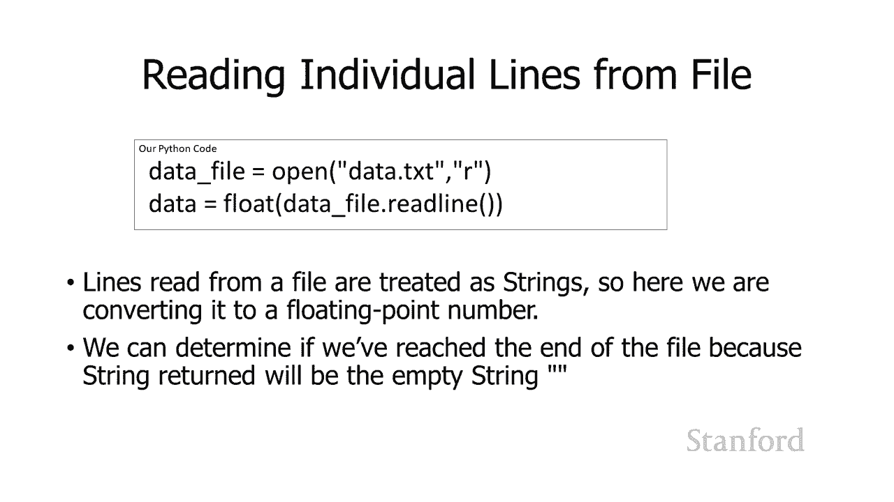

**代码示例：写入文件**
```python
file = open(“output.txt”, “w”)
file.write(“Hello, World!\n”) # 写入一行文本，\n表示换行
file.write(“This is a second line.”)
file.close()
```

**重要提示**：
*   `.write()` 方法只接受**字符串**作为参数。如果要写入数字，需要先用 `str()` 函数将其转换为字符串。
*   默认情况下，连续的 `.write()` 调用不会自动换行。如果需要换行，必须在字符串末尾手动添加换行符 `\n`。
*   务必在操作完成后调用 `.close()` 方法，否则数据可能不会真正保存到磁盘。

## 综合应用示例

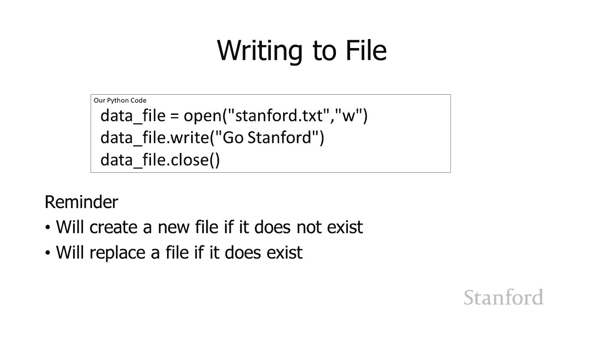

掌握了基本的读写操作后，让我们通过两个更复杂的例子来巩固所学知识。

**示例一：计算文件中数字的平均值**

这个例子演示了如何在读取文件时，同时统计行数。

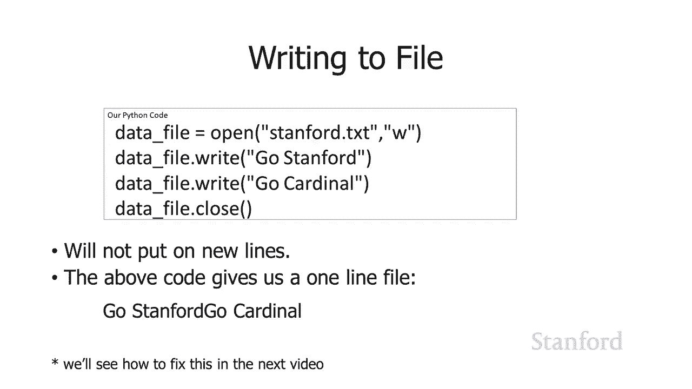

**代码示例：计算平均值**
```python
filename = input(“请输入文件名：”)
file = open(filename, “r”)

total = 0
count = 0 # 新增一个变量来计数

for line in file:
    number = float(line)
    total = total + number
    count = count + 1 # 每读一行，计数加1

file.close()

if count > 0:
    average = total / count # 计算平均值
    print(“平均值是：”, average)
else:
    print(“文件为空。”)
```

**示例二：统计成年人与儿童的数量**

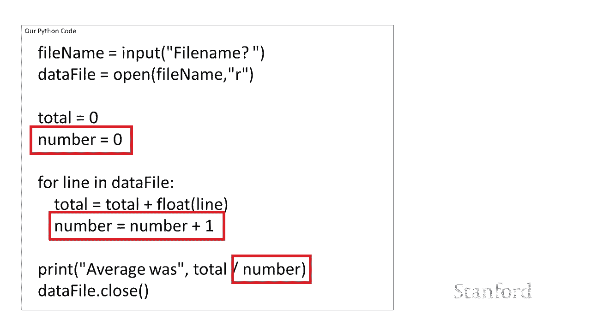

这个例子展示了如何根据文件内容（如年龄）进行分类统计。

**代码示例：年龄统计**
```python
filename = input(“请输入包含年龄数据的文件名：”)
file = open(filename, “r”)

adults = 0
children = 0

for line in file:
    age = int(line)
    if age >= 18:
        adults = adults + 1
    else:
        children = children + 1

file.close()

print(“成年人数量：”, adults)
print(“儿童数量：”, children)
```

**编程模式总结**：
在循环处理文件数据前，先初始化用于存储结果的变量（如 `total=0`, `count=0`），这是一个非常常见且有用的模式。

## 总结 🎯

本节课中我们一起学习了Python文件操作的核心知识：
1.  **打开与关闭**：使用 `open()` 函数和 `.close()` 方法，并理解了不同模式（`”r”`, `”w”`, `”a”`）的含义。
2.  **读取文件**：主要使用 `for line in file:` 循环逐行读取，并注意将从文件读取的字符串转换为所需的数据类型（如 `int()`, `float()`）。
3.  **写入文件**：使用 `.write()` 方法向文件写入字符串，并记得在字符串中添加 `\n` 来实现换行。
4.  **综合应用**：通过计算平均值和分类统计的例子，学习了在文件处理中初始化变量、计数和条件判断的综合运用。

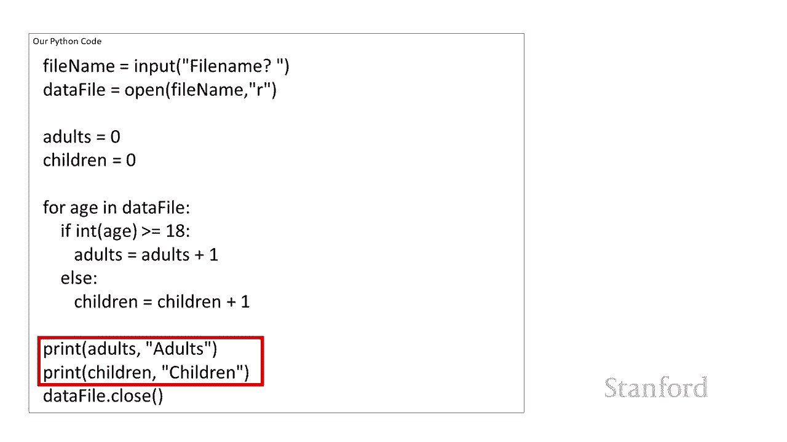


文件操作是连接程序与外部世界的重要桥梁，熟练掌握它将使你能够构建功能更强大、更实用的应用程序。