# L20.1：计算机安全介绍 🔐

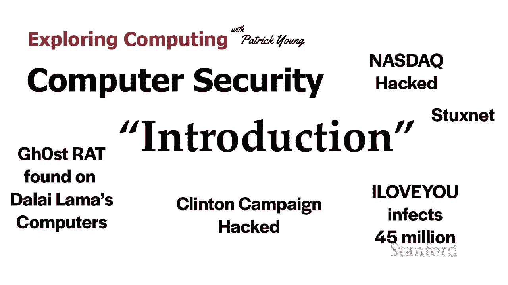

在本节课中，我们将要学习计算机安全的基本概念。我们将通过几个真实世界的攻击案例，来理解安全的重要性，并初步认识几个核心的安全目标。

## 概述

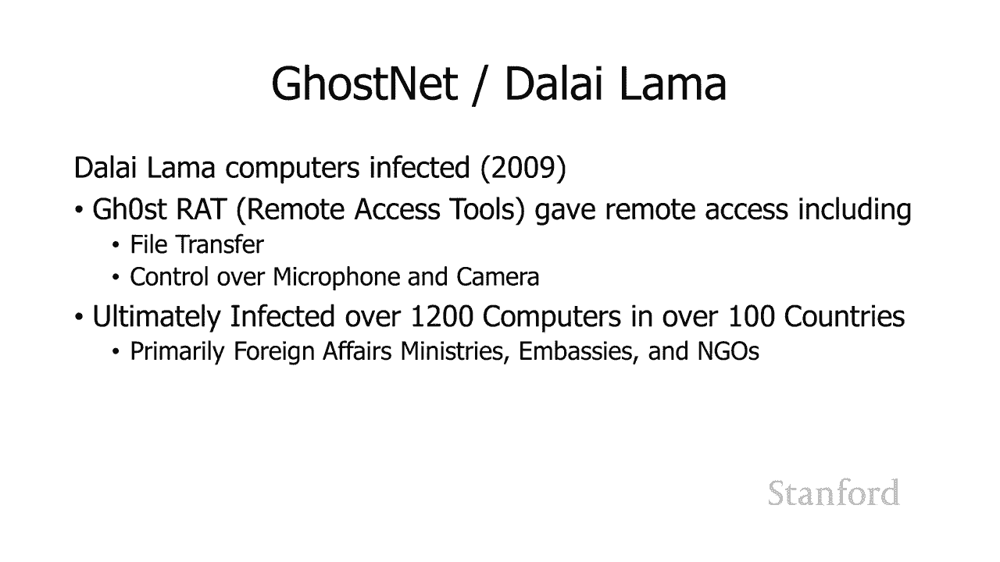

计算机安全是一个至关重要的领域，它关乎如何保护我们的信息、系统和隐私免受恶意攻击。本节课程将首先介绍几个历史上著名的安全事件，然后引出计算机安全需要达成的几个核心目标。

## 真实世界攻击案例

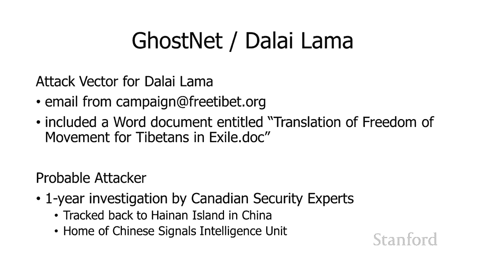

以下是几个历史上发生的、具有代表性的计算机安全攻击事件，它们展示了安全漏洞可能带来的严重后果。

### 案例一：GhostNet攻击（2009年）

2009年，达赖喇嘛办公室的计算机上被安装了一个名为GhOst RAT的程序。RAT代表“远程访问工具”。这个工具提供了对受感染计算机的远程完全控制能力，最终导致大量文件从计算机传输到攻击者手中。大多数被感染的计算机位于大使馆和非政府组织内。

调查发现，攻击始于一封来自伪造电子邮件地址的邮件，邮件附有一份关于“行动自由”的Word文档。经过为期一年的调查，攻击源头被追踪至中国海南岛，那里是某情报部门的所在地。因此，这次攻击很可能具有国家背景。

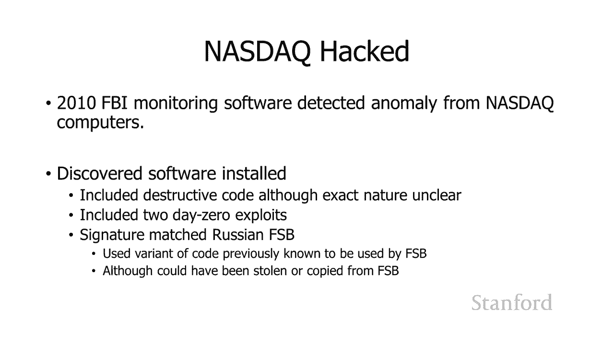

### 案例二：纳斯达克交易所攻击（约2010年）

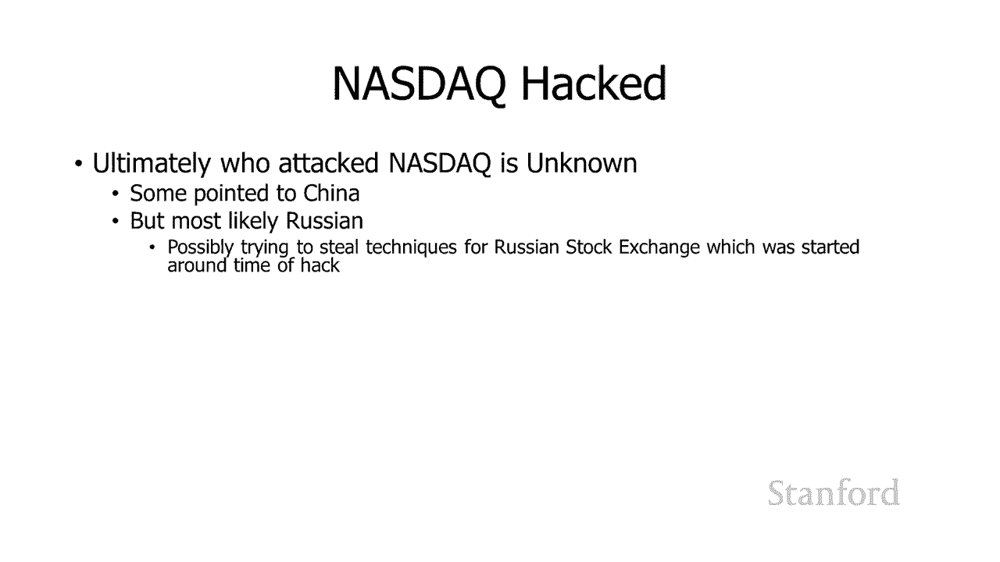

2010年，FBI在检测纳斯达克计算机系统时发现了异常。系统中被植入了破坏性代码。这次攻击使用了两个“零日漏洞”。

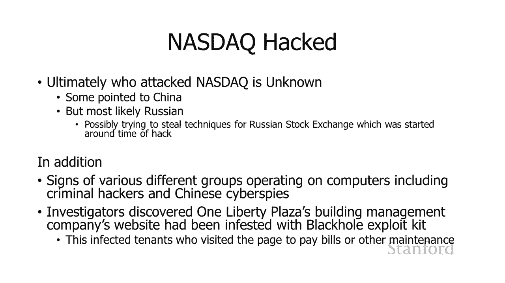

**零日漏洞**指的是软件中存在的、软件供应商尚未知晓的漏洞。因此，在漏洞被公开和修复之前，攻击者可以利用它攻击任何未打补丁的系统。在这个案例中，攻击软件上的数字签名与俄罗斯联邦安全局（FSB）相符。因此，攻击者很可能是俄罗斯情报机构，或者是从FSB窃取了攻击代码的其他组织。

FBI还发现纳斯达克系统上存在其他恶意软件，包括用于金融犯罪的工具包。攻击者甚至入侵了负责纳斯达克网站管理的服务器。

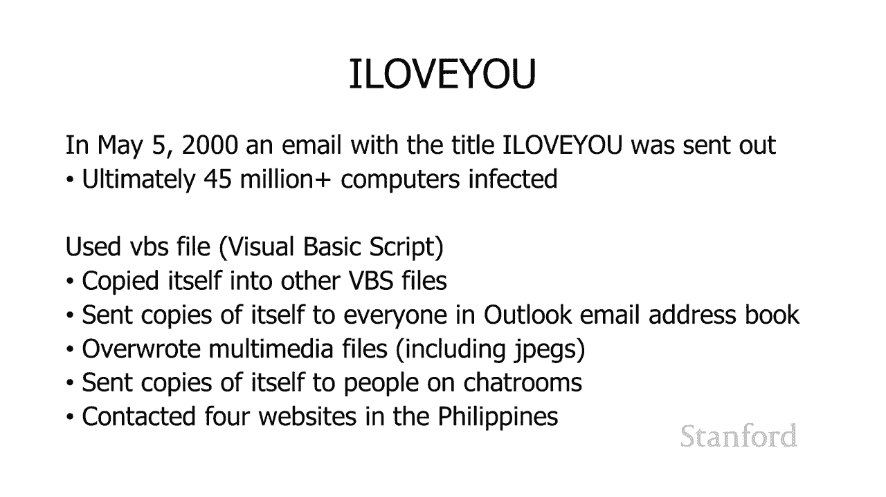

### 案例三：ILOVEYOU病毒（2000年）

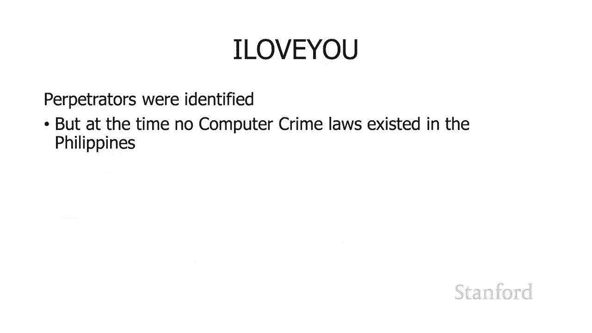

2000年5月5日，一封主题为“ILOVEYOU”的邮件开始传播。它包含一种病毒，最终感染了约4500万台计算机。它利用了一个Visual Basic脚本漏洞，该文件会将自身复制到其他文件，并向用户Outlook通讯录中的所有地址发送邮件。病毒还会覆盖多媒体文件，造成数据破坏。肇事者最终被抓获，但由于当时缺乏计算机犯罪法，他们并未受到严厉惩罚。

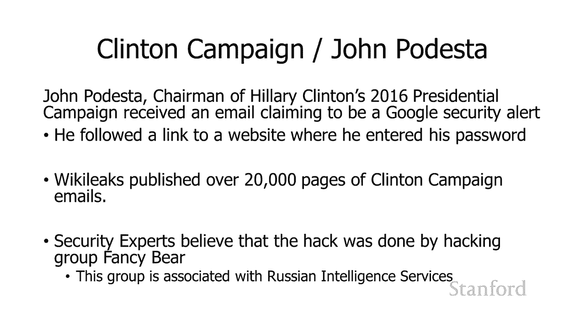

### 案例四：约翰·波德斯塔邮件泄露（2016年）

2016年，希拉里·克林顿竞选团队主席约翰·波德斯塔收到了一封伪装成谷歌安全警报的钓鱼邮件。他点击了链接，导致其邮箱凭证泄露。随后，维基解密公布了他的邮件内容。安全专家分析认为，这次攻击是由名为“Fancy Bear”的黑客组织完成的，该组织与俄罗斯情报机构有关联。

### 案例五：震网病毒（Stuxnet）

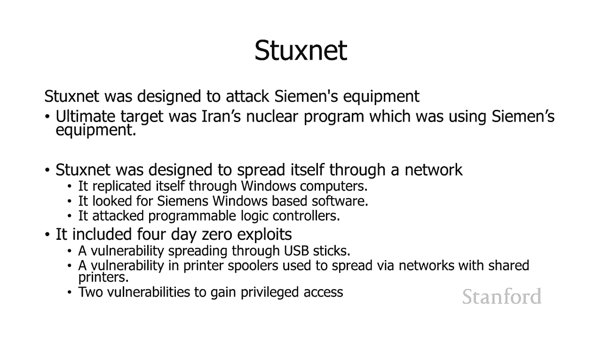

震网病毒是一个旨在攻击工业控制系统的复杂程序。它专门针对伊朗核计划中使用的西门子设备，尤其是用于提炼铀的离心机。震网病毒会寻找基于西门子的可编程逻辑控制器（PLC）并进行攻击。它包含了四个零日漏洞，并通过USB设备进行传播。这被认为是首个被广泛确认的、由国家力量发起的网络武器。

## 计算机安全的核心目标

上一节我们看到了安全攻击的多样性与危害性。本节中我们来看看，为了抵御这些攻击，计算机安全系统需要达成的几个核心目标。我们通常用Alice（发送方）、Bob（接收方）和Mallory（攻击者）这三个角色来举例说明。

以下是四个关键的安全目标：

1.  **保密性**
    *   **含义**：确保信息只能被授权方访问。当Alice给Bob发送消息“你想见面吃午饭吗？”时，需要保证像Mallory这样的第三方无法阅读该消息。

2.  **身份验证**
    *   **含义**：确认通信对方的身份是真实的。当Alice通过互联网与Bob通信时，她需要一种方法来证明正在与她对话的人就是Bob本人，而不是伪装成Bob的Mallory。

3.  **完整性**
    *   **含义**：确保信息在传输过程中未被篡改。Alice发送的消息在到达Bob手中时必须与原始消息完全一致。Mallory可能无法读取消息，但他可以篡改它（例如，将见面地点从“食堂”改为“咖啡厅”），导致通信失败。

4.  **不可否认性**
    *   **含义**：防止通信方事后否认其行为。例如，如果我发送了一条消息说“取消期末考试”，之后我不能抵赖说“那条消息不是我发的”。系统需要提供证据来证明消息确实出自我手。

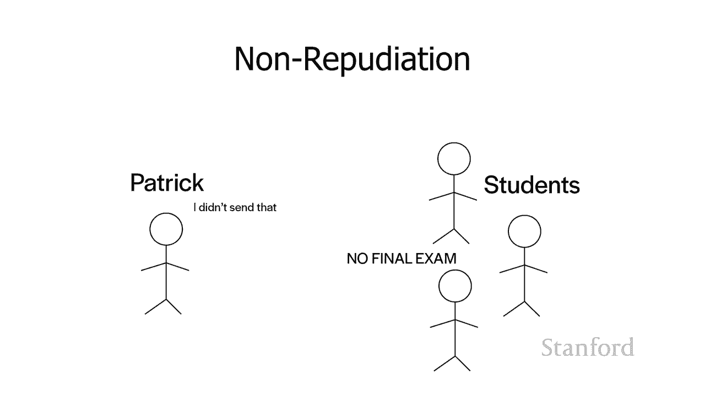

这些目标相互关联，共同构成了信息安全的基础。

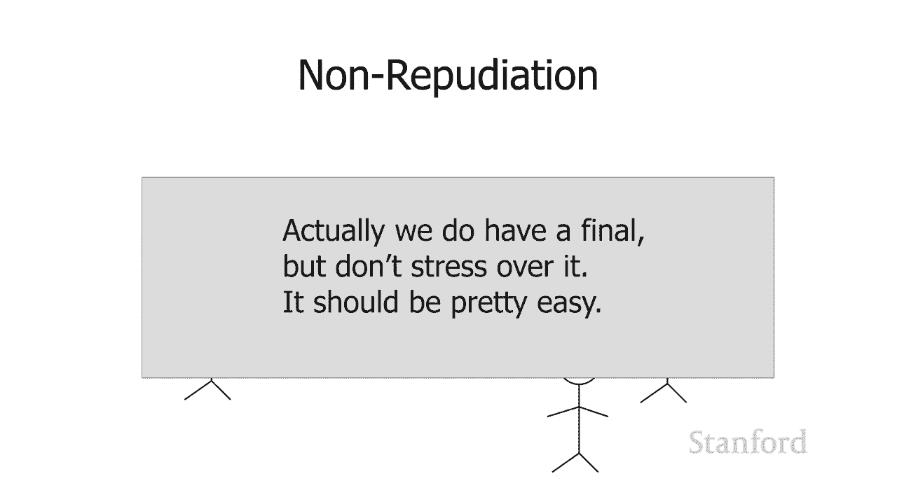

## 总结

本节课中我们一起学习了计算机安全的入门知识。我们通过GhostNet、震网病毒等多个真实案例，看到了安全漏洞可能被利用的多种方式及其严重后果。接着，我们明确了计算机安全的四个核心目标：**保密性**、**身份验证**、**完整性**和**不可否认性**。理解这些目标是学习具体安全技术和机制的第一步。在接下来的课程中，我们将深入探讨用于实现这些目标的具体方法。