# 计算机科学导论：L20.2：计算机安全机制 🔐

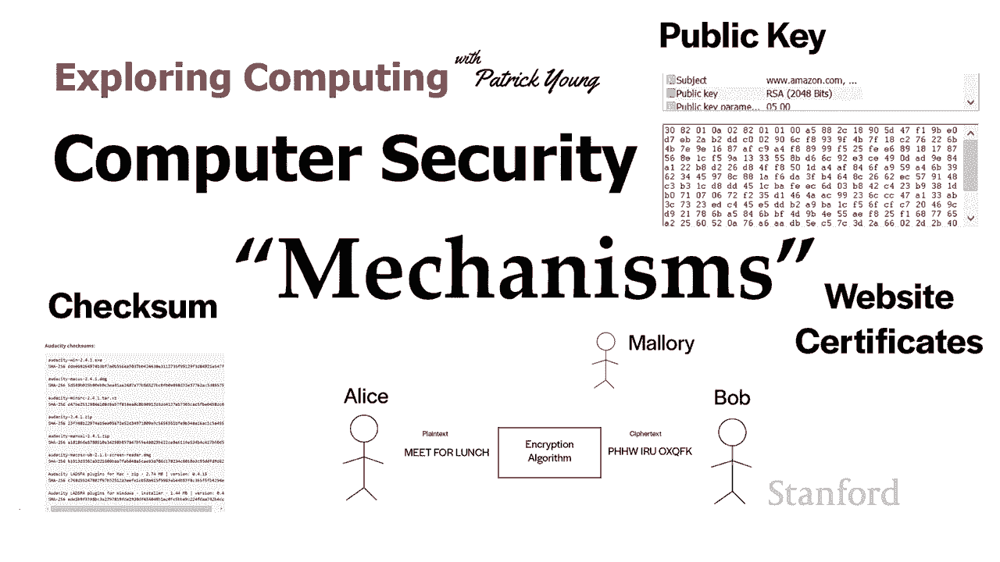

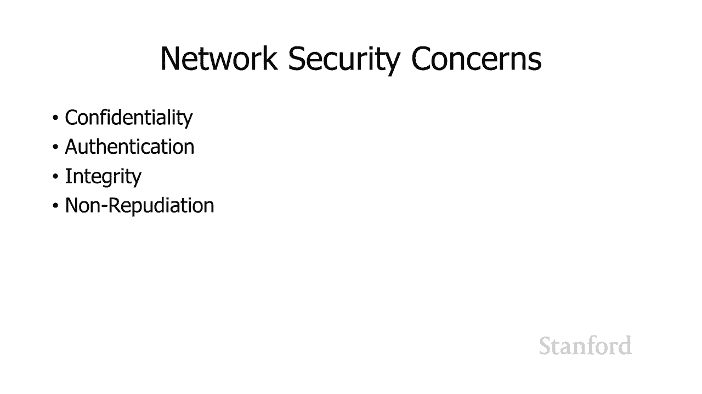

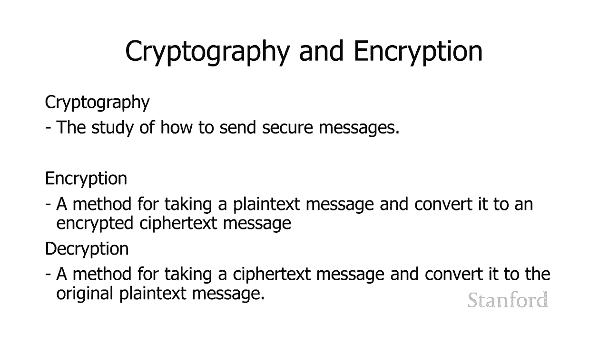

## 概述
在本节课中，我们将学习用于保护计算机网络安全的几种核心机制。这些机制旨在解决保密性、身份验证、完整性和不可否认性等安全问题，它们都基于密码学技术。

上一节我们介绍了网络安全涉及的几个核心问题。本节中，我们来看看解决这些问题的具体技术。

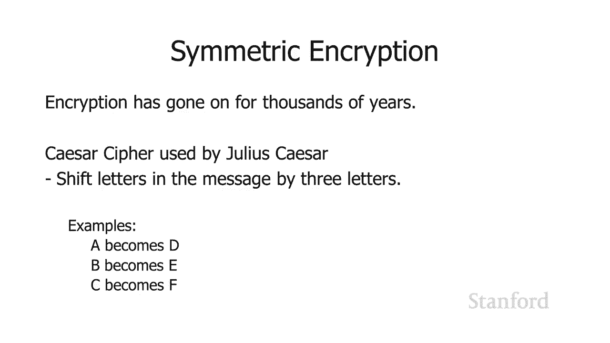

## 加密技术基础
加密技术是发送安全消息的基础。它涉及两个核心过程：
*   **加密**：将原始**明文**消息转换为加密的**密文**消息。
*   **解密**：将**密文**消息转换回原始**明文**消息。

加密技术已有数千年历史。我们将从一个简单的例子开始，以便理解其基本原理。

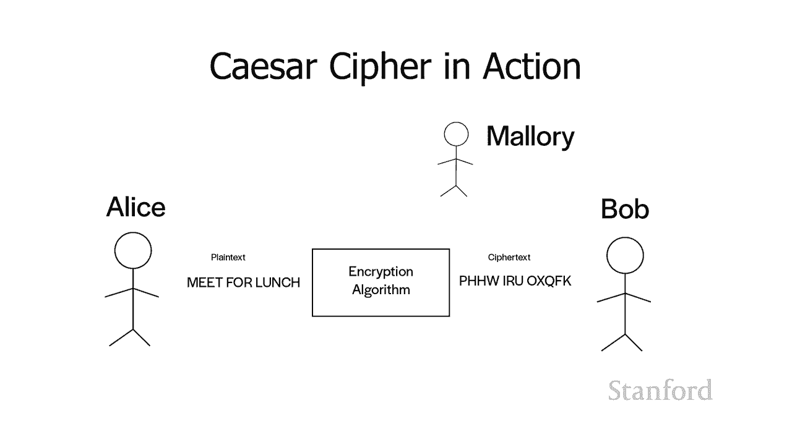

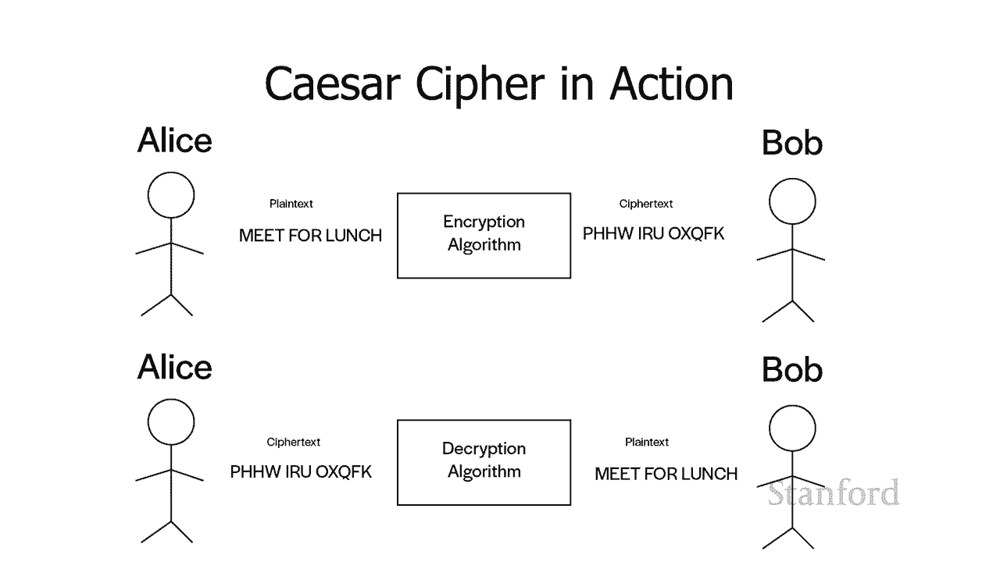

### 凯撒密码
凯撒密码是一种非常简单的加密方法，由朱利叶斯·凯撒使用。它的工作原理是将消息中的每个字母在字母表中向后移动固定的位数。

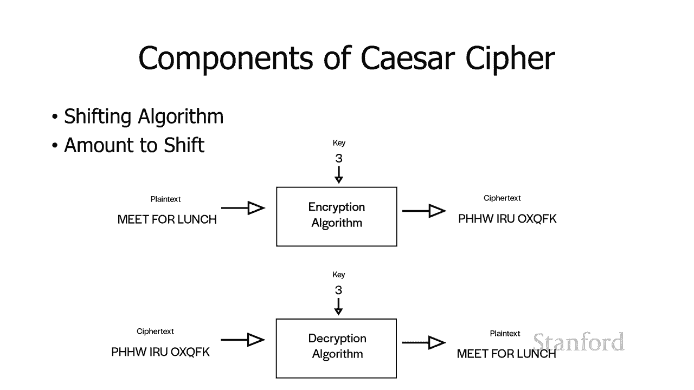

以下是凯撒密码（移位数为3）的加密过程示例：
*   明文：`meet for lunch`
*   加密过程：每个字母向后移动3位（a->d, b->e, m->p, e->h, t->w 等）。
*   密文：`phhw iru oxqfk`

在这个例子中，发送者Alice将明文“meet for lunch”加密为密文“phhw iru oxqfk”。接收者Bob收到密文后，需要执行相反的解密过程（每个字母向前移动3位）才能理解消息内容。

凯撒密码包含两个组成部分：通用的**移位算法**和具体的**移位数量**（即密钥）。奥古斯都·凯撒使用了相同的算法，但改变了移位的数量。

然而，凯撒密码存在严重的安全问题。

### 凯撒密码的弱点
凯撒密码的主要弱点在于其**密钥空间太小**。对于英文字母，最多只有25种有效的移位可能性（移位26位等于没有移位）。这使得它极易受到**暴力攻击**。

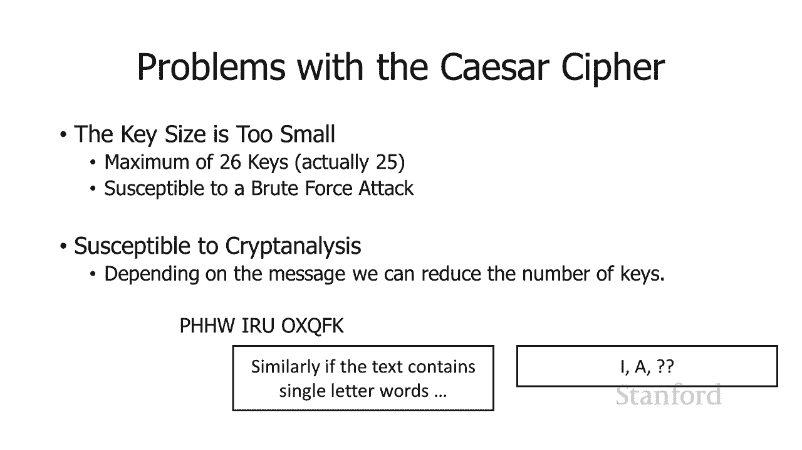

暴力攻击是指攻击者尝试所有可能的密钥组合，直到其中一个能产生有意义的明文。

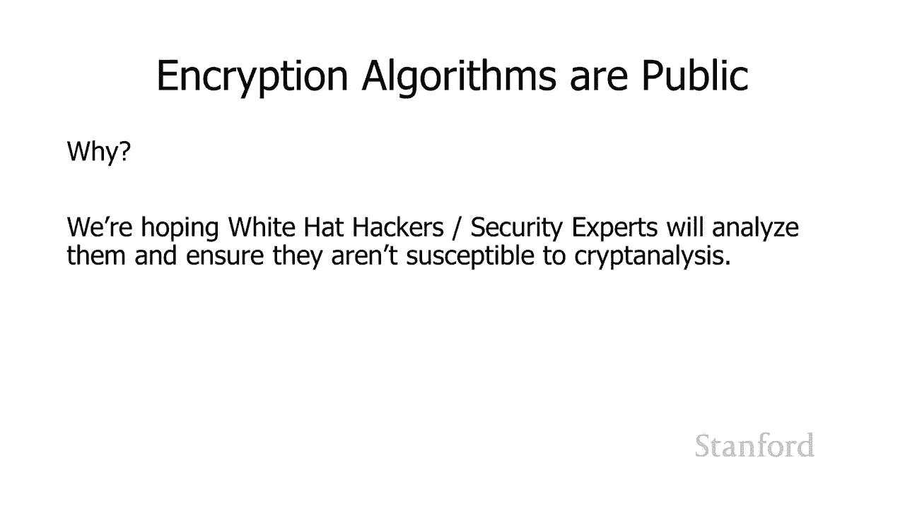

此外，凯撒密码也容易受到**密码分析**的攻击。密码分析是指通过分析密文本身来推断出明文或密钥信息。

以下是密码分析可能利用的线索：
*   **字母频率**：分析密文中字母出现的频率。例如，英文中“e”是最常见的字母。
*   **重复模式**：寻找密文中重复的字母组合。例如，在示例密文“phhw iru oxqfk”中，“hh”是一个明显的重复。
*   **单字母单词**：识别可能是“I”或“a”等单字母单词的密文片段。

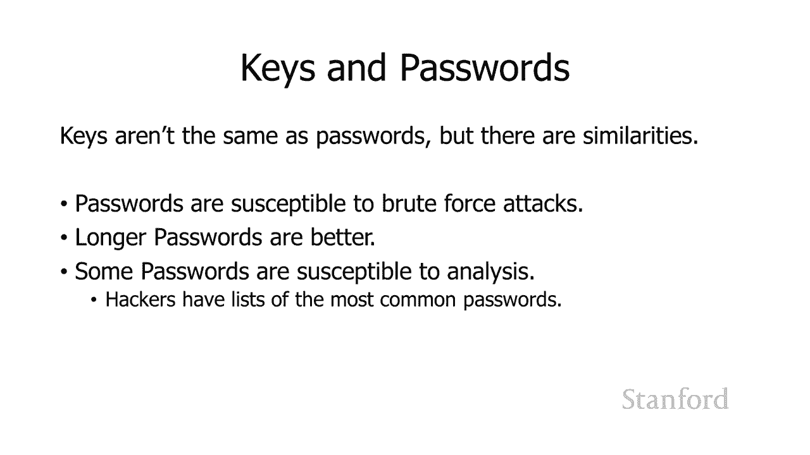

通过这些分析，攻击者可以大大减少需要尝试的密钥数量，从而破解密码。

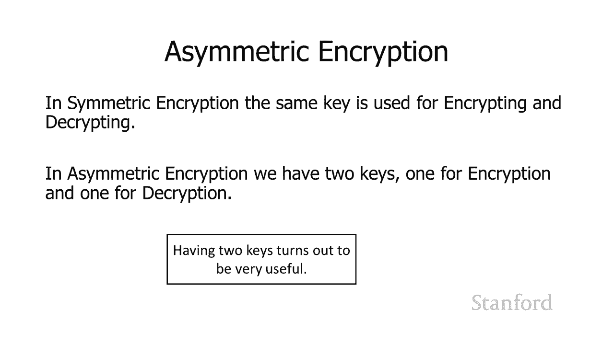

因此，现代加密算法需要克服这些弱点。它们主要依赖两点：
1.  **足够大的密钥空间**：使暴力攻击在计算上不可行。
2.  **算法的复杂性**：即使算法公开，也能保证在没有密钥的情况下无法从密文推导出明文。

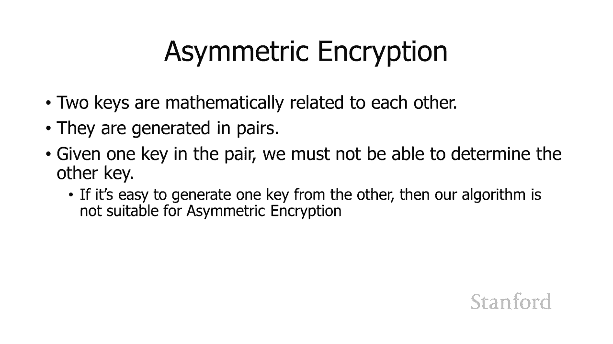

## 现代加密类型
现代加密主要分为两种类型：对称加密和非对称加密。

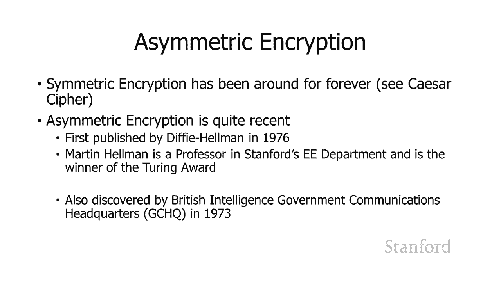

### 对称加密
在对称加密中，**加密和解密使用相同的密钥**。凯撒密码就是一个对称加密的例子，加密和解密都依赖于“移位3”这个相同的密钥。

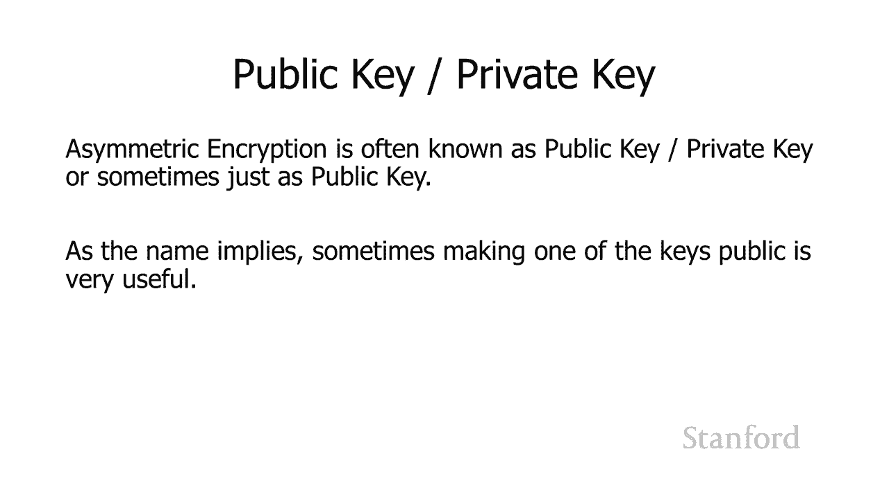

对称加密历史悠久，但面临一个关键挑战：**密钥分发**。通信双方如何在首次安全地共享同一个密钥？如果通过不安全的渠道（如电子邮件）发送密钥，密钥本身就可能被截获。

### 非对称加密（公钥加密）
非对称加密使用一对数学上关联的密钥：一个**公钥**和一个**私钥**。
*   **公钥**可以公开给任何人。
*   **私钥**必须由所有者严格保密。
*   用公钥加密的消息，**只能**用对应的私钥解密。
*   从公钥推导出私钥在计算上是极其困难的。

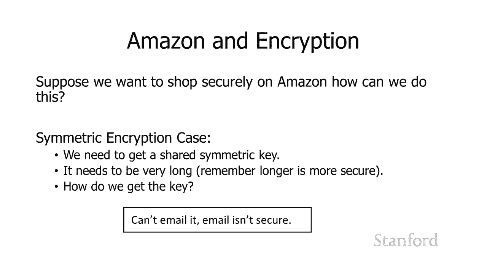

非对称加密的概念在1976年由迪菲和赫尔曼首次公开提出（马丁·赫尔曼是斯坦福大学教授，也是图灵奖获得者）。有趣的是，英国情报机构GCHQ在1973年就独立发现了该技术，但未公开发表。

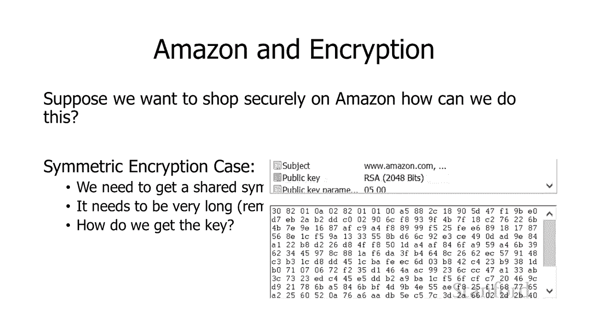

非对称加密完美解决了对称加密中的密钥分发问题。以下是如何使用它进行安全通信：

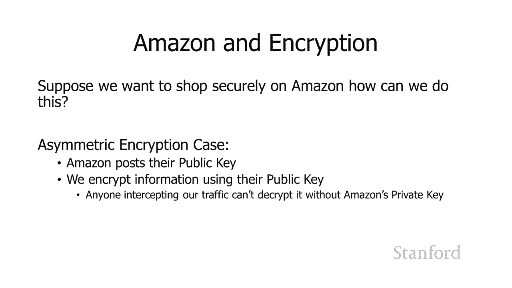

假设你想与亚马逊安全通信：
1.  亚马逊将其**公钥**放在网站上。
2.  你用亚马逊的**公钥**加密你的消息（如信用卡信息）。
3.  你将加密后的密文发送给亚马逊。
4.  亚马逊使用其**私钥**解密并读取消息。

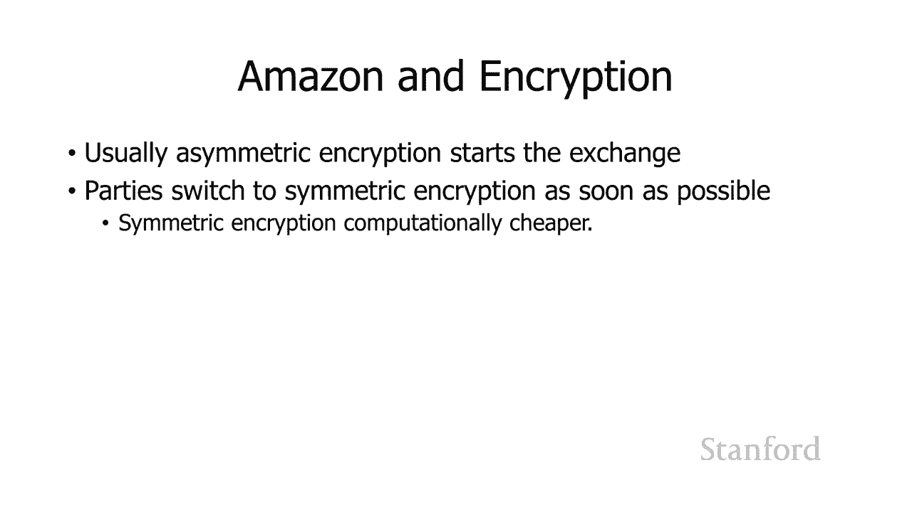

任何截获流量的人即使拥有公钥，也无法解密消息，因为他们没有私钥。

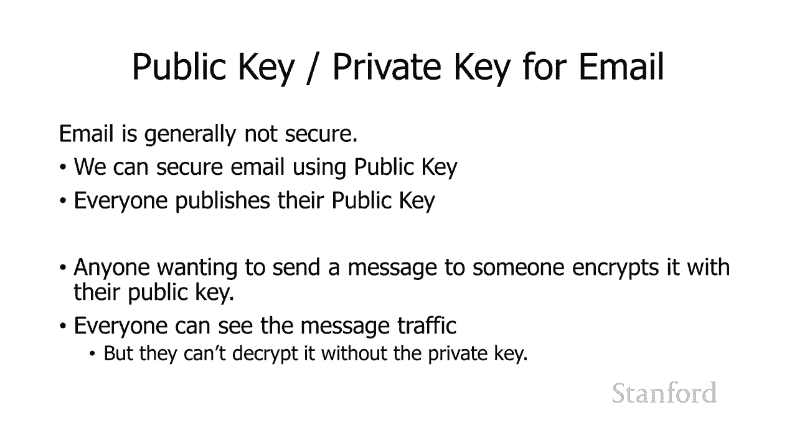

在实际应用中（如HTTPS），通常结合使用两种加密：
1.  连接开始时使用**非对称加密**来安全地交换一个随机的**会话密钥**。
2.  后续的通信则使用**对称加密**和该会话密钥进行，因为对称加密速度更快，计算开销更小。

## 公钥加密的应用
公钥加密技术除了保证通信机密性，还能解决其他安全问题。

### 1. 身份验证与数字证书
我们如何确认正在访问的网站（如`amazon.com`）是真的亚马逊，而不是假冒的？这依赖于**数字证书**和**证书颁发机构** 体系。

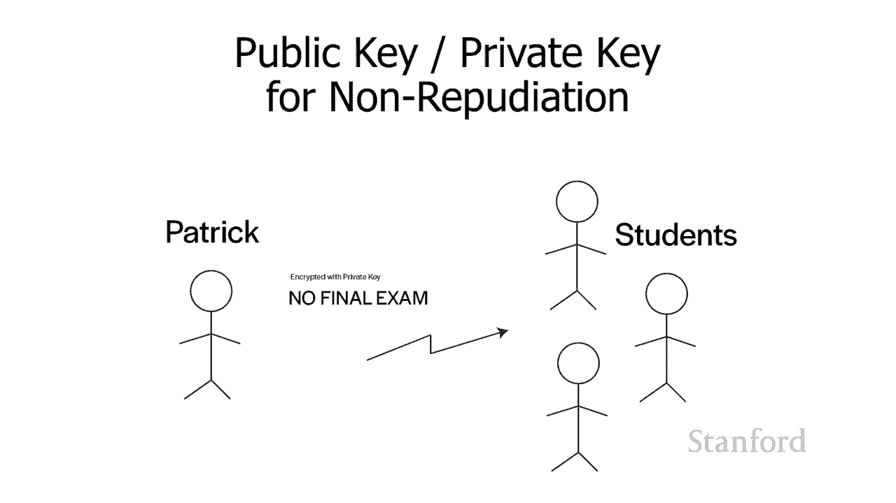

以下是其工作流程：
1.  网站向受信任的**证书颁发机构** 申请证书。
2.  CA验证网站的真实身份后，使用自己的**私钥**为该网站的信息（包含网站的公钥）生成一个**数字签名**（即证书）。
3.  网站将这张证书部署到服务器上。
4.  你的浏览器访问网站时，会收到这张证书。浏览器内置了各大CA的**公钥**。
5.  浏览器用CA的公钥验证证书上的签名。如果验证通过，则证明该证书是真实的，进而相信证书中包含的网站公钥也是真实的。
6.  浏览器随后使用该网站的公钥发起安全通信。

当你使用`https://`（而非`http://`）访问网站时，就意味着正在使用这套基于证书的安全通信机制。

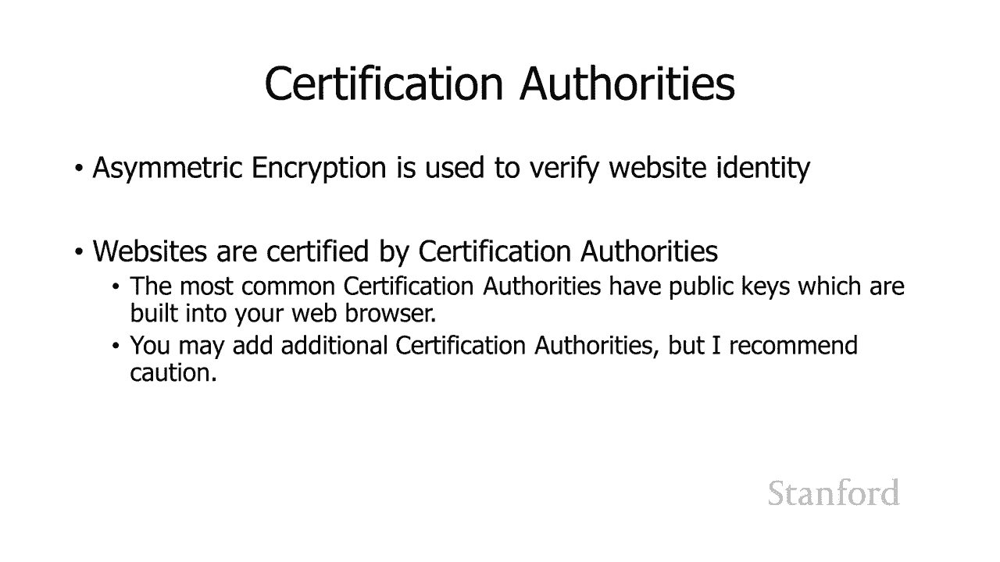

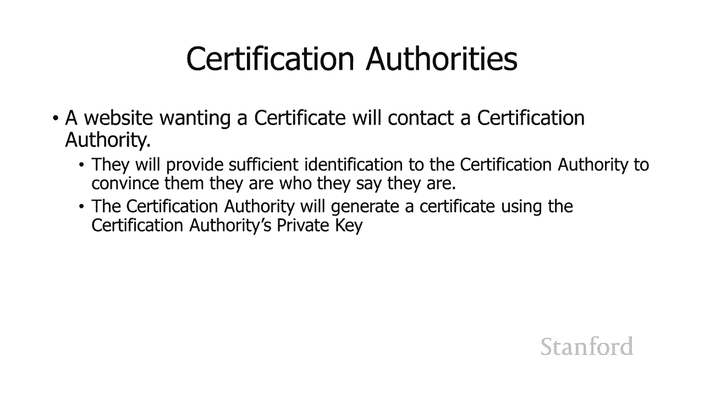

### 2. 不可否认性
公钥加密还能提供**不可否认性**，即发送者事后无法否认自己发送过的消息。

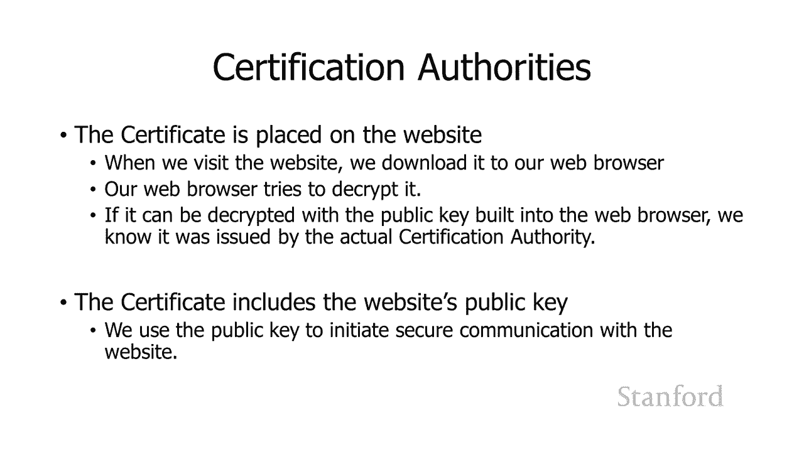

实现方式如下：
1.  发送者使用自己的**私钥**对消息进行“签名”（一种特殊的加密处理）。
2.  接收者使用发送者的**公钥**对签名进行验证。
3.  如果验证通过，则证明该消息确实来自对应的私钥持有者。因为公钥只能解密由配对私钥加密的内容，发送者无法抵赖。

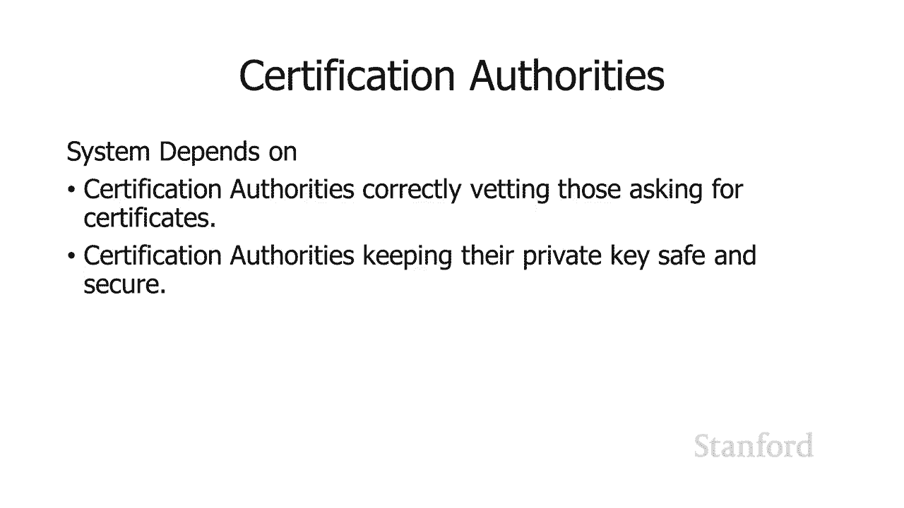

需要注意的是，整个系统的安全性取决于**私钥的保密性**。如果私钥泄露，那么不可否认性也就失效了。

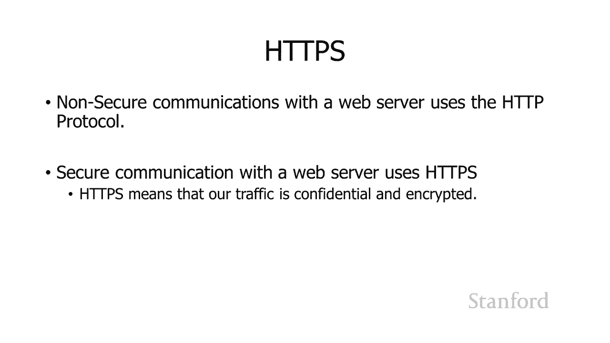

## 数据完整性保障
**完整性**确保数据在传输过程中未被篡改。除了加密，我们还可以使用**校验和**与**加密散列**来验证完整性。

### 校验和
校验和是一种简单的完整性检查方法。发送方对数据的所有字节执行某种计算（如求和），得到一个较小的值（校验和），并将其随数据一起发送。

接收方对收到的数据执行同样的计算，并将结果与发送方提供的校验和进行比较。如果两者匹配，则数据在传输过程中**可能**是完整的。

然而，简单的校验和容易被恶意攻击者破解。攻击者可以在修改数据的同时，也相应地修改校验和，使其匹配，从而绕过检查。

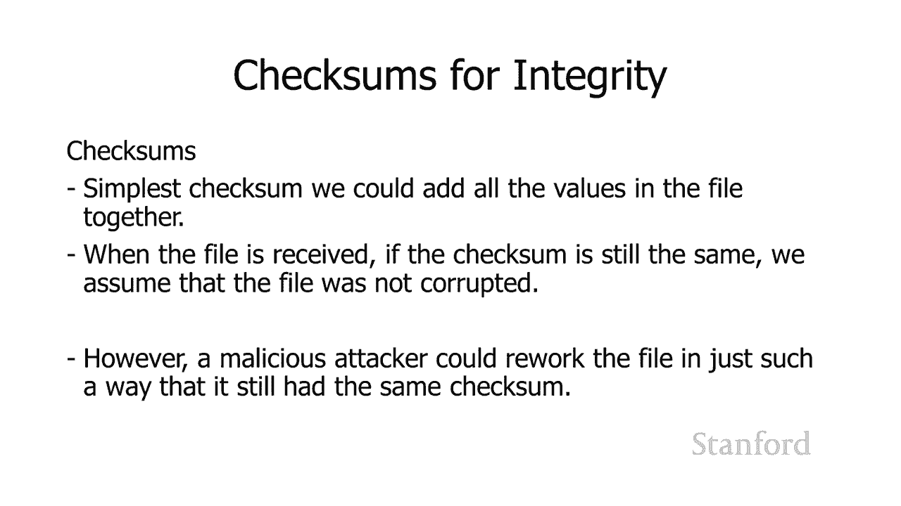

### 加密散列函数
为了更可靠地保证完整性，特别是防止恶意篡改，我们使用**加密散列函数**（如SHA-256）。

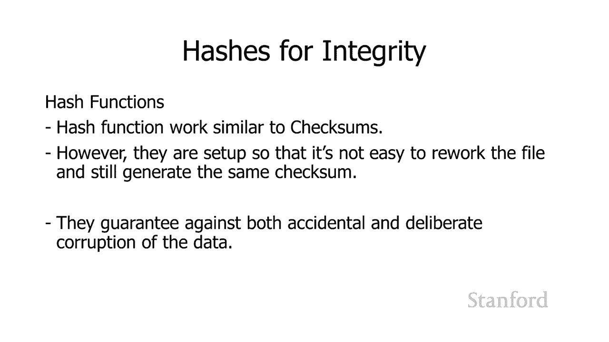

加密散列函数的特点：
*   将任意长度的数据映射为固定长度的**散列值**（又称“指纹”）。
*   即使输入数据发生微小改变，输出的散列值也会发生巨大且不可预测的变化。
*   从散列值反向推导原始数据在计算上不可行。
*   找到两个不同数据产生相同散列值（即“碰撞”）在计算上极其困难。

应用实例：
许多开源软件（如Audacity）的下载页面会提供文件的SHA-256散列值。下载文件后，你可以使用工具计算该文件的SHA-256散列值，并与官网提供的值进行比对。

*   如果**散列值匹配**，说明你下载的文件与官方发布的完全一致，未被篡改或损坏。
*   如果**散列值不匹配**，则说明文件可能已在传输中损坏，或者更危险的是，已被植入恶意软件。

## 总结
本节课我们一起学习了保护计算机网络安全的核心机制。
*   我们首先从**凯撒密码**入手，理解了加密、解密、明文、密文和密钥等基本概念，并分析了简单密码的弱点。
*   接着，我们探讨了两种现代加密方式：**对称加密**（使用相同密钥）和**非对称加密**（使用公钥/私钥对）。非对称加密解决了密钥分发的难题。
*   然后，我们看到了非对称加密如何应用于**身份验证**（通过CA和数字证书确认网站身份）和**不可否认性**（通过数字签名确保行为无法抵赖）。
*   最后，我们学习了如何通过**校验和**与更安全的**加密散列函数**（如SHA-256）来保障数据的**完整性**，确保信息在传输过程中未被意外或恶意修改。

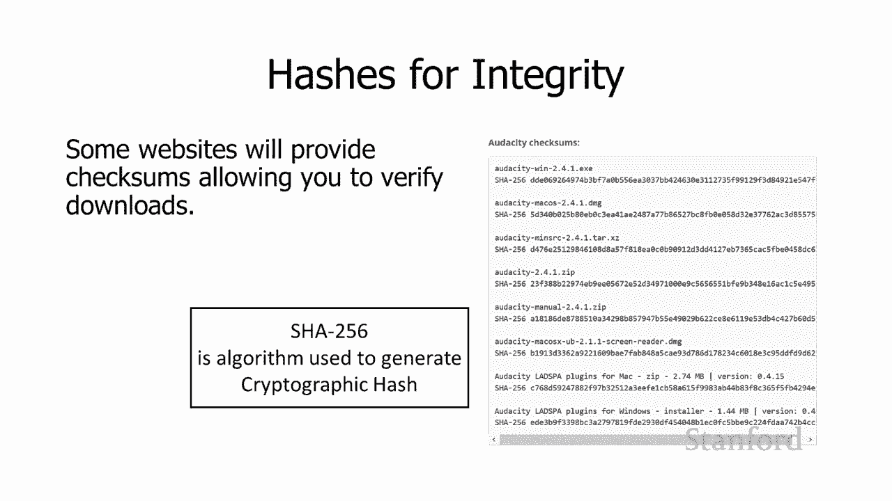

这些机制共同构成了我们在互联网上进行安全通信和交易的基础。