# 计算机科学导论：L21.1：计算机安全（攻击）：恶意软件 🛡️

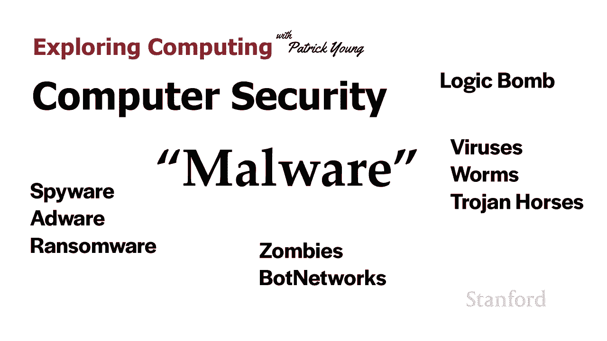

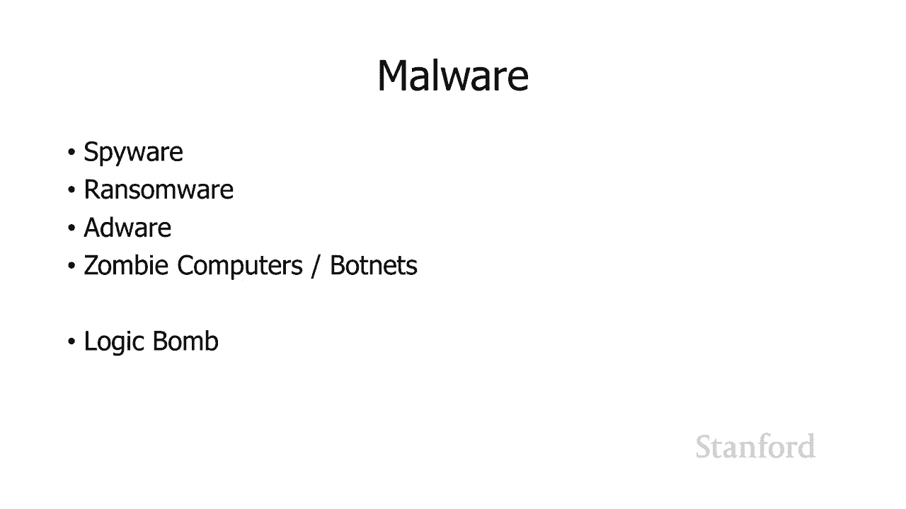

在本节课中，我们将要学习计算机安全领域中的一个核心威胁：恶意软件。我们将了解不同类型的恶意软件，它们如何运作，以及它们可能对您的计算机造成何种危害。

## 恶意软件概述

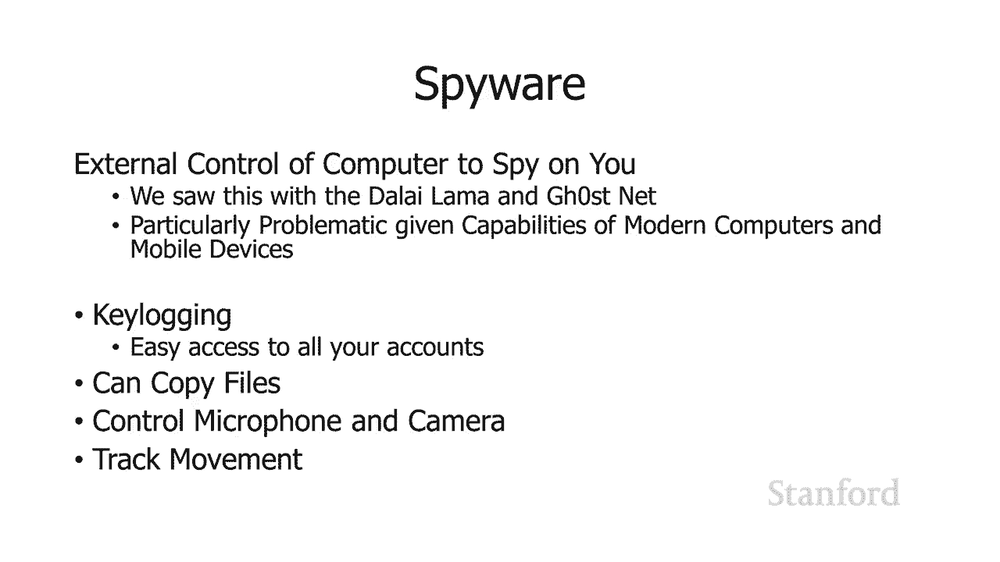

上一节我们介绍了计算机安全的整体概念，本节中我们来看看攻击者可能使用的一种主要手段——恶意软件。恶意软件是一个统称，指任何设计用来损害或未经授权访问计算机系统的软件。

## 恶意软件的主要类型

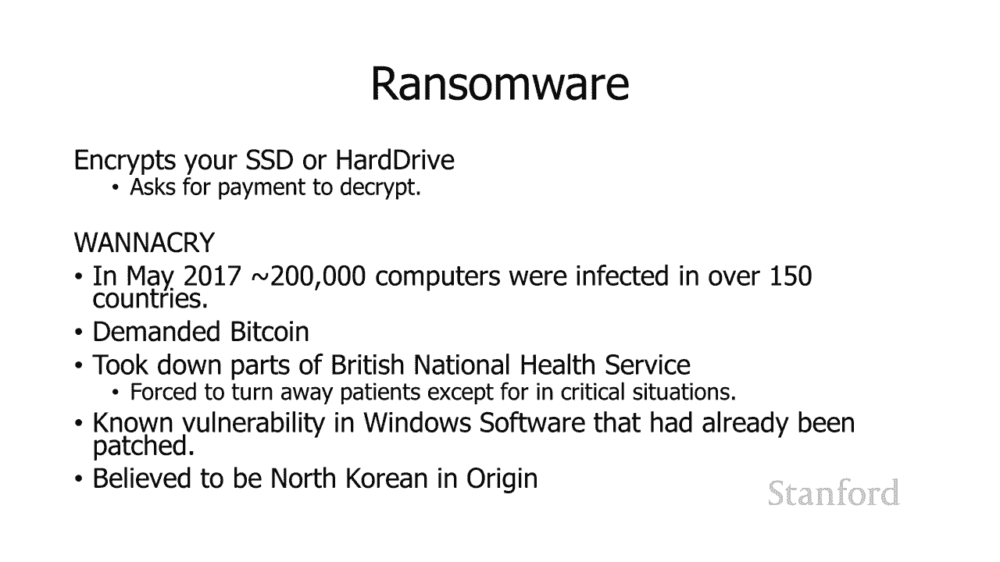

以下是几种常见的恶意软件类型及其运作方式。

### 间谍软件 👁️

间谍软件旨在秘密监视用户活动并收集信息。它在现代计算机和移动设备上尤其成问题，因为这些设备集成了多种敏感功能。

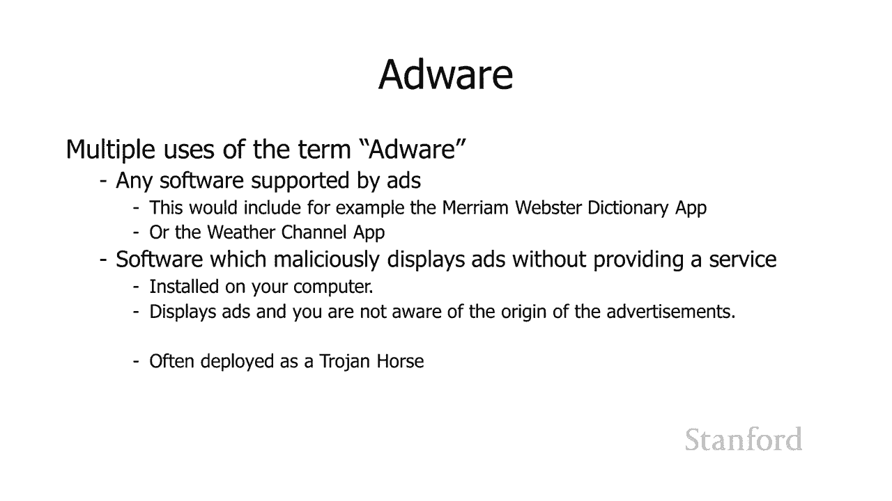

间谍软件可以执行多种恶意操作：
*   **键盘记录**：跟踪用户的所有击键。例如，当您访问网上银行时，它会记录您的用户名和密码。
    *   **代码示例**：一个简单的键盘记录器可能通过钩子（hook）函数捕获击键事件。
*   **复制文件**：窃取计算机上的文件，例如包含财务信息的文档，并将其发送给攻击者。
*   **启用麦克风和摄像头**：未经授权打开设备的麦克风进行窃听，或打开摄像头进行窥视。
*   **跟踪活动**：监控用户在设备上的行为和位置信息。

### 勒索软件 🔐

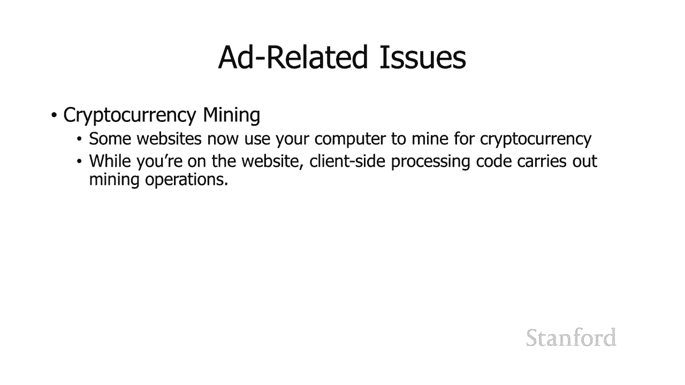

当勒索软件侵入计算机后，它会加密整个硬盘驱动器（HDD）或固态驱动器（SSD）上的数据，然后要求支付赎金（通常为比特币）以解密文件。

*   **公式/过程**：`感染 → 加密文件 → 索要赎金`
*   **著名案例**：WannaCry勒索软件在2017年爆发，感染了超过150个国家的20多万台计算机，严重扰乱了英国国家卫生服务等机构的运作。它利用了当时微软Windows中一个已知但未广泛修补的漏洞。

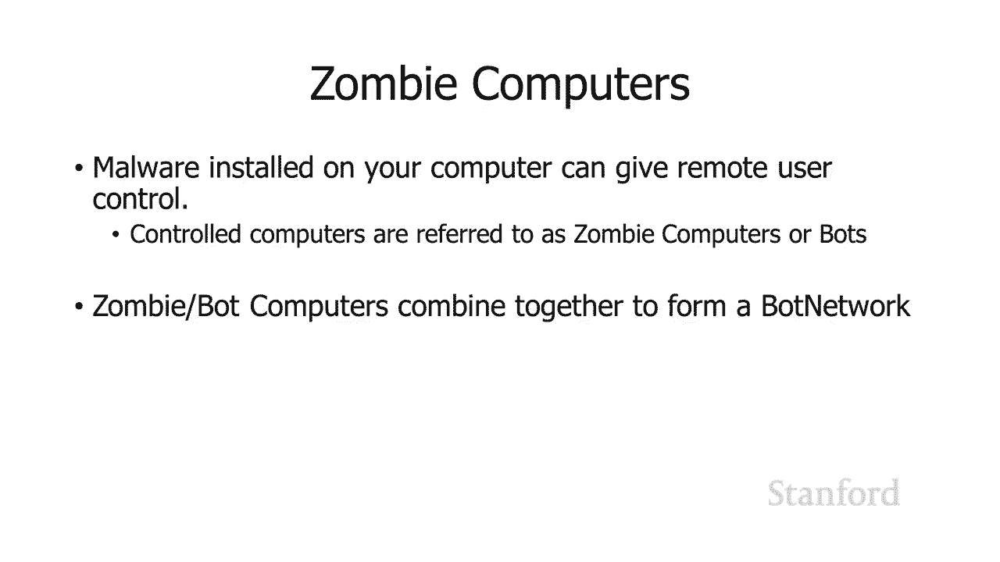

### 广告软件 📢

广告软件指在用户计算机上显示广告的软件。这个术语有两种用法：
1.  指任何显示广告的程序（如一些免费的词典、天气应用），这类通常被认为是合法的，通过广告支持免费服务。
2.  特指那些在用户不知情或未经完全同意的情况下，恶意安装并显示无关广告的软件。这类广告软件可能在任何时候弹出广告，甚至与用户当前浏览的网站无关。

一个相关的问题是“加密货币挖矿脚本”，即网站在用户访问时，未经明确同意就利用用户计算机的算力来挖掘加密货币。

### 僵尸网络与僵尸计算机 🤖

恶意软件可以将您的计算机变成“僵尸计算机”（或“机器人”），并将其纳入一个由许多受控计算机组成的“僵尸网络”。

*   **注意**：“机器人”一词并非总是恶意，例如谷歌用来索引网页的“爬虫机器人”就是合法的。
*   **僵尸网络的恶意用途**：
    *   **发送垃圾邮件**：从全球分布的大量计算机发送垃圾邮件，使其更难被屏蔽。
    *   **分布式拒绝服务攻击**：指令僵尸网络中的所有计算机同时向目标服务器发送海量请求，使其超载瘫痪，无法为合法用户服务。
        *   **公式**：`大量请求（来自分散IP） → 目标服务器过载 → 服务拒绝`
    *   **点击欺诈**：操纵僵尸计算机虚假点击在线广告，要么为自家网站骗取广告收入，要么消耗竞争对手的广告预算。
*   **实例**：Conficker蠕虫/病毒曾感染超过3000万台计算机，形成了一个庞大的僵尸网络，第三方甚至可租用它进行非法活动。

### 逻辑炸弹 💣

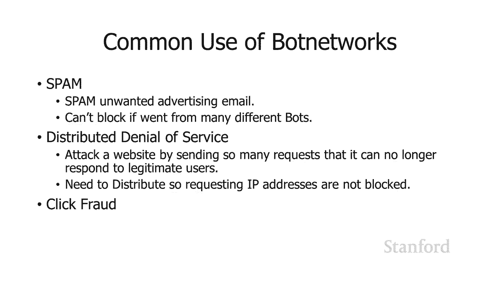

逻辑炸弹不是外部植入的恶意软件，而是由原始程序员隐藏在合法程序中的恶意代码片段。它会在特定条件触发时执行恶意操作。

*   **触发条件**：可能是特定日期、某个文件被读取、或某个特定事件（如程序员被从工资系统中删除）。
*   **恶意操作**：可能是发送通知、删除文件或造成其他破坏。

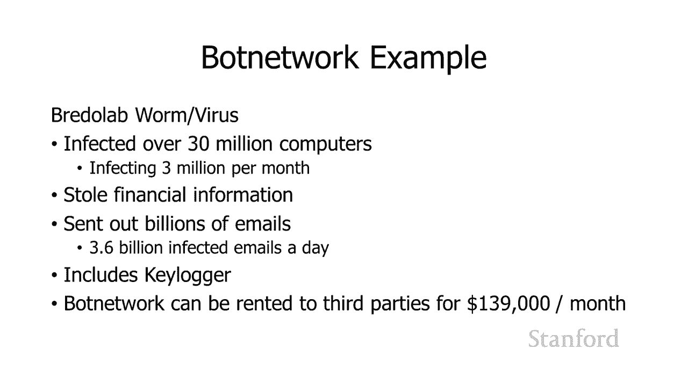

## 恶意软件的传播方式

了解了恶意软件的类型后，我们来看看它们是如何进入您的计算机的。以下是几种主要的传播机制，它们之间常有重叠。

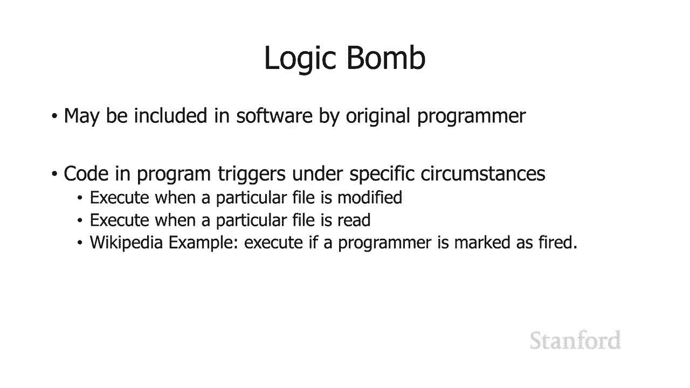

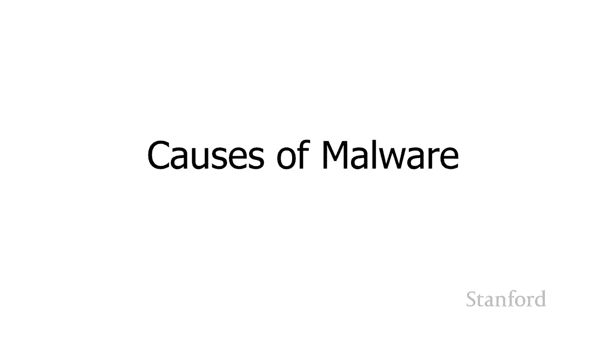

### 病毒 🦠

病毒是一种能够将自身附加到其他程序上的计算机程序，通过感染可执行文件进行自我复制和传播。

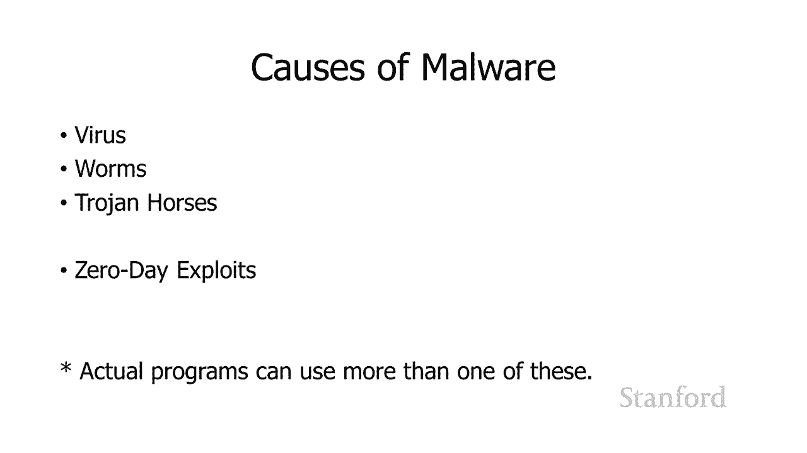

*   **运作方式**：病毒运行时，会寻找计算机上的其他可执行程序（甚至包括一些文档中的宏脚本），并将自身代码插入其中。当被感染的程序运行时，病毒代码也随之执行。
*   **防护示例**：现代办公软件（如Microsoft Office）默认在“保护模式”下打开外来文档，防止内嵌脚本自动运行，就是针对此类威胁的防护。

### 蠕虫 🐛

蠕虫是一种能够在网络上自我传播和复制的独立程序。

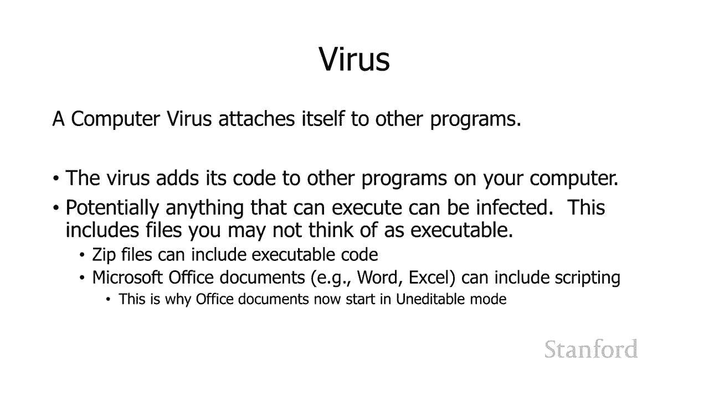

*   **运作方式**：它不依赖感染宿主文件，而是利用网络连接（如电子邮件、系统漏洞）将自己拷贝到其他计算机上。著名的“ILOVEYOU”蠕虫就是通过电子邮件附件和Outlook通讯录进行传播的。

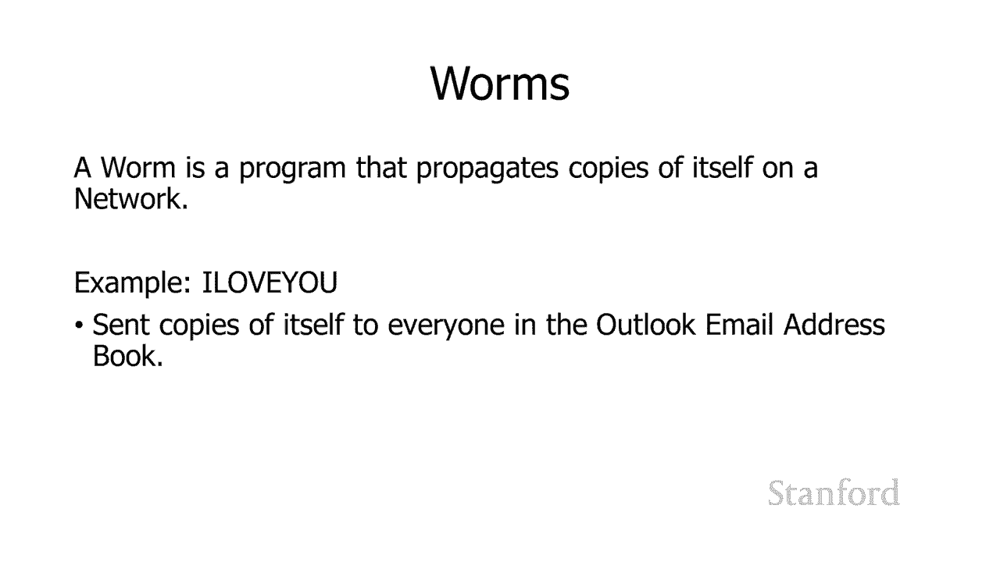

### 特洛伊木马 🎁

特洛伊木马伪装成合法或有用的软件，但在背后执行恶意操作。

*   **特点**：它要么完全不是其所声称的东西，要么在完成声称功能的同时，携带“恶意负载”。
*   **实例**：伪装成“西藏自由运动翻译”文档的间谍软件、声称是“天气程序”或“卡通伙伴”却暗中安装广告软件的应用程序，都是典型的特洛伊木马。

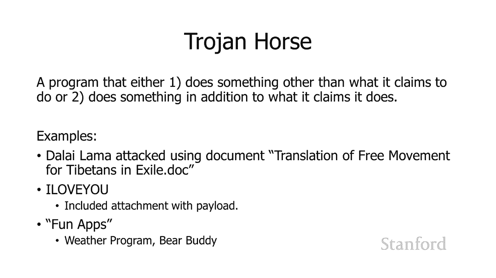

### 零日漏洞利用 0️⃣

零日漏洞利用是指利用软件中未被开发者知晓、因此也无补丁可修复的安全漏洞进行的攻击。

*   **特点**：由于漏洞未知，防御极其困难。震网病毒就使用了多个零日漏洞。
*   **对比**：与利用已知漏洞的“脚本小子”攻击不同，零日攻击更具威胁性，通常与高级持续性威胁相关。保持软件更新可以防范已知漏洞攻击，但对零日攻击效果有限。

---

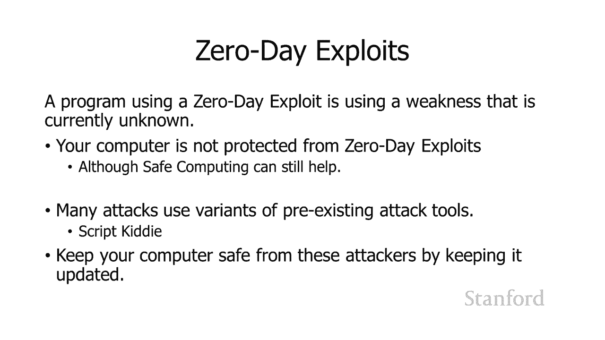

本节课中我们一起学习了恶意软件的世界。我们探讨了间谍软件、勒索软件、广告软件、僵尸网络和逻辑炸弹等多种恶意软件类型，并了解了它们通过病毒、蠕虫、特洛伊木马和零日漏洞利用等方式进行传播的机制。理解这些攻击方式是迈向有效防御的第一步。在下一讲中，我们将重点关注如何保护自己免受这些威胁。