# 计算机科学导论：L22.1：计算机安全防御技术 🛡️

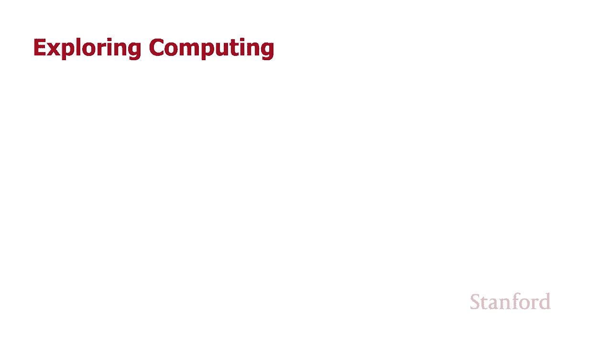

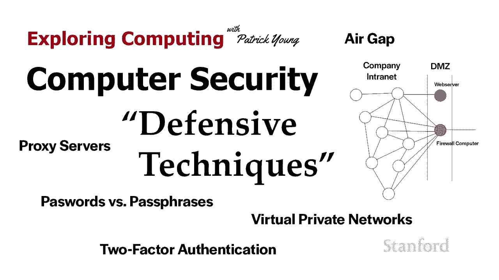

在本节课中，我们将学习如何保护计算机系统免受攻击。上一节我们探讨了计算机可能受到的各种攻击方式，本节中我们来看看我们可以采取哪些防御技术来保护自己。

## 防火墙技术 🔥

首先，我们来讨论防火墙。防火墙是保护网络边界的关键技术。

### 企业防火墙

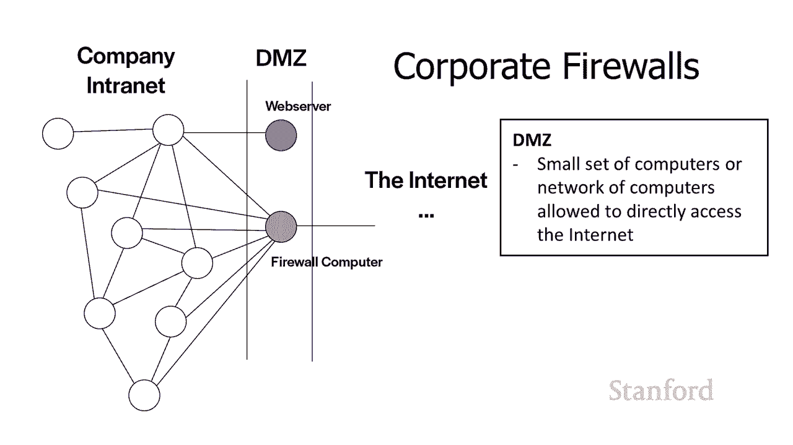

如果没有防火墙，公司内部网络（Intranet）中的每台计算机都可以直接访问互联网，这意味着所有计算机都容易受到外部攻击。同时，公司内部人员也可能在没有控制的情况下向外发送信息。这显然是一个糟糕的情况。

防火墙计算机是一台位于公司内部网和更广泛的互联网之间的计算机。它可以防止恶意流量进入公司，也可以防止恶意信息流出公司。

以下是防火墙可以执行的一些主要功能：
*   **阻止或白名单特定应用程序**：例如，它可以阻止外部对内部计算机的FTP访问请求。
*   **阻止或白名单特定IP地址**：可以限制员工可以访问的外部计算机，或限制外部人员可以访问的内部计算机。
*   **扫描流量信息**：可以检查传入或传出的数据流，查找特定关键词或模式。

更复杂的架构会设立一个称为“DMZ”（非军事区）的特殊子网络。DMZ中放置着需要被外部访问的服务器（如Web服务器、文件服务器），而内部网络则受到更严密的保护。

### 个人防火墙

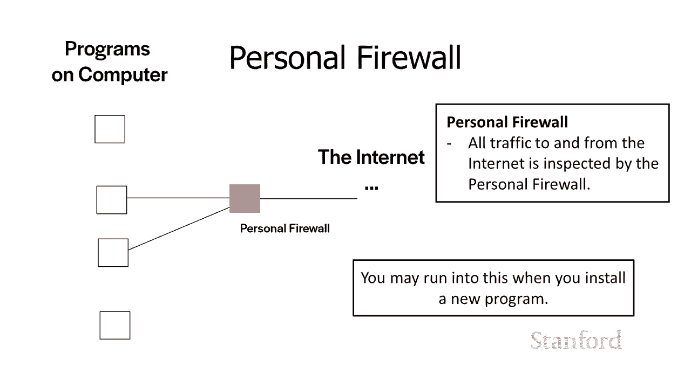

现代操作系统都内置了个人防火墙，其行为类似于企业防火墙。

在没有个人防火墙的情况下，计算机上的所有程序都直接与互联网通信。个人防火墙充当所有流量的中介，计算机上的程序需要通过它来发送或接收信息。防火墙会判断并决定是否允许该通信。

例如，如果计算机上被安装了键盘记录器，个人防火墙应能阻止该程序向黑客发送信息。同样，对于传入的流量，防火墙只允许访问那些你当前正在使用的服务。例如，如果你的计算机不充当FTP服务器，防火墙应阻止外部的FTP访问请求。

当你安装新程序时，很可能会触发防火墙提示，询问是否允许该程序访问互联网。你应该谨慎批准，如果不确定程序的来源或用途，最好先进行搜索确认。

## 代理服务器 🔄

接下来，我们看看代理服务器。代理服务器允许用户访问他们无法直接访问的资源。

我将用一个例子来说明：斯坦福大学付费订阅了Safari在线图书资源。在校园内（使用斯坦福IP地址）可以直接访问。但当我在家时，我的IP地址属于康卡斯特（Comcast），Safari在线会拒绝我的访问。

斯坦福为解决此问题运行了代理服务器。其工作方式是：我不直接访问Safari在线，而是将请求发送到斯坦福的代理服务器，由代理服务器代表我去访问Safari在线。Safari在线看到请求来自一个斯坦福IP地址（即代理服务器），就会允许访问并将数据返回给代理服务器，代理服务器再将其转发给我。

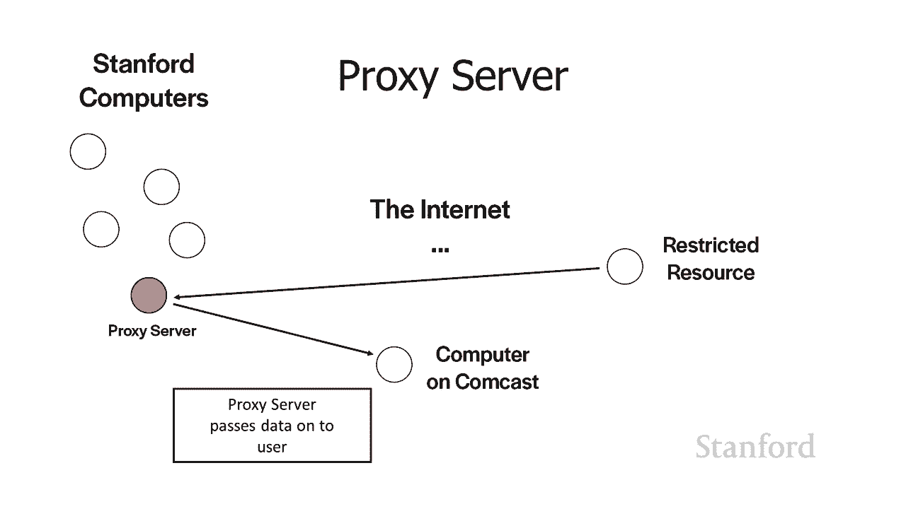

代理服务器还有其他用途，例如绕过某些网络限制（注意：这可能违反公司政策或当地法律）。早期，它曾被用来绕过中国的“防火长城”访问被屏蔽的网站。但这种方法的问题是流量通常没有加密，防火墙可以通过扫描请求内容来识别和阻止。

对于访问像斯坦福订阅资源这类合法目的，代理服务器在校外工作时非常有效。

## 虚拟专用网络 🌐

更复杂的技术是虚拟专用网络（VPN）。VPN可用于某些与代理服务器相同的目的，但也能用于其他场景。

假设一家公司在帕洛阿尔托和东京都有办公室，每个办公室都有自己的内部网络。最安全的连接方式是租用一条专用的物理线路，但这非常昂贵。通常，公司会通过互联网连接两个办公室。

问题在于，当数据包通过互联网传输时，路径上的计算机可以看到发送方和接收方的IP地址，甚至可能看到未加密的内容。这可能会泄露敏感信息，例如暗示公司正在进行收购谈判。

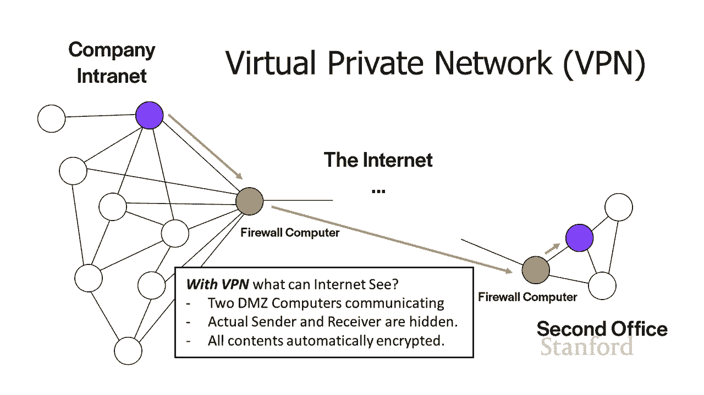

VPN可以解决这两个问题。其工作方式是：当从帕洛阿尔托办公室的计算机发送信息到东京时，信息首先被发送到本地的VPN网关（如DMZ中的计算机）。该网关会加密整个数据包，包括数据和原始的发送/接收IP地址，并用它自己的地址替换。然后，加密的数据包通过互联网发送到东京办公室的VPN网关。东京的网关解密数据包，还原出原始信息和IP地址，再将其传递给目标计算机。

这样，互联网上的旁观者只能看到两个VPN网关在通信，而不知道内部是哪些计算机在通信，也无法得知通信内容。

VPN也可用于单个计算机，例如让在家或旅行的员工安全地访问公司网络。

### 个人VPN

个人VPN目前是一个热门话题。人们使用个人VPN的主要原因之一是隐藏互联网活动，防止互联网服务提供商（ISP）或其他方跟踪。因为VPN会加密你所有的流量，ISP只能看到你连接到VPN服务器，而看不到你实际访问了哪些网站。

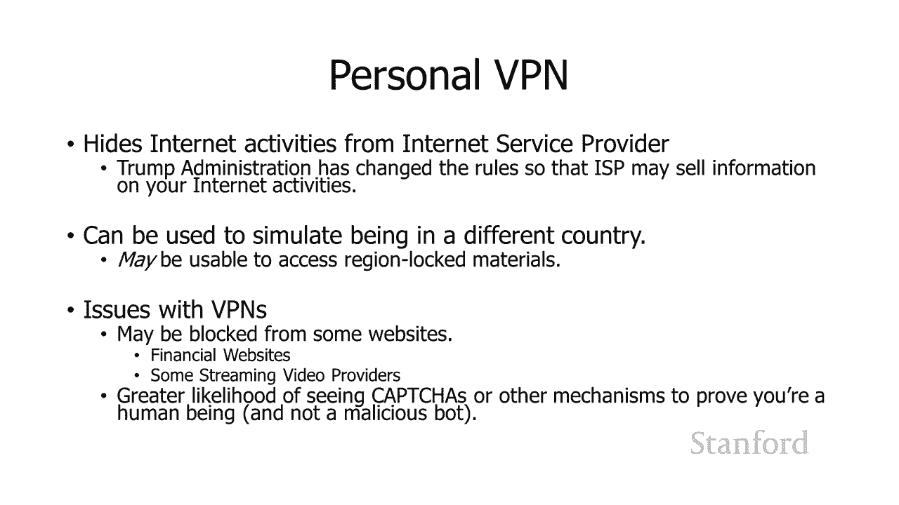

个人VPN的另一个用途是模拟位于不同国家。如果VPN提供商在意大利有服务器，你可以连接到该服务器，那么你访问的网站会认为你来自意大利。这可以用来访问某些地区限制的内容（如流媒体节目）。

但使用VPN也存在问题：一些网站（如流媒体服务、金融机构）会主动阻止已知的VPN IP地址；同时，来自VPN的流量更可能触发验证码（CAPTCHA）挑战。

## 物理隔离（气隙） 💻➡️🚫➡️🌐

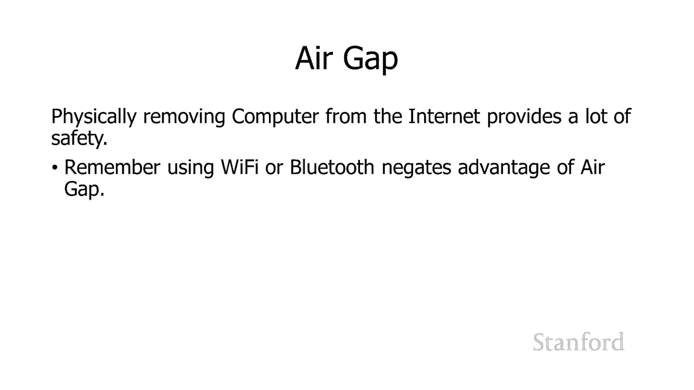

如果你希望为计算系统提供最大的安全性，应该只使用“气隙”系统。

“气隙”是指计算机与网络完全断开连接，与互联网之间存在物理间隙。这意味着也不应有Wi-Fi或蓝牙等无线连接。例如，斯坦福大学为了保护成绩数据库，可能会将其放置在一个与互联网完全隔离的内部网络中，访问该数据库的唯一方法是亲自到场并向警卫出示身份证。

这提供了极高的安全性，因为攻击者需要物理接触。但另一方面，完成任何工作都会非常麻烦和低效。

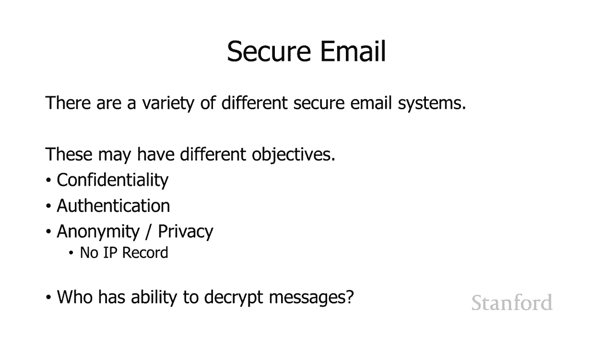

## 安全通信实践 📧

我们之前讨论过电子邮件安全问题。有许多安全的电子邮件系统，但并非大多数人都在使用。

选择安全电子邮件系统时，需要考虑不同的安全目标：
*   **机密性**：确保互联网上的其他人无法看到邮件内容。
*   **身份验证**：确保邮件的发送者身份真实可靠。
*   **匿名性**：在某些情况下（如人权活动家、举报人），发送者可能希望隐藏自己的身份。

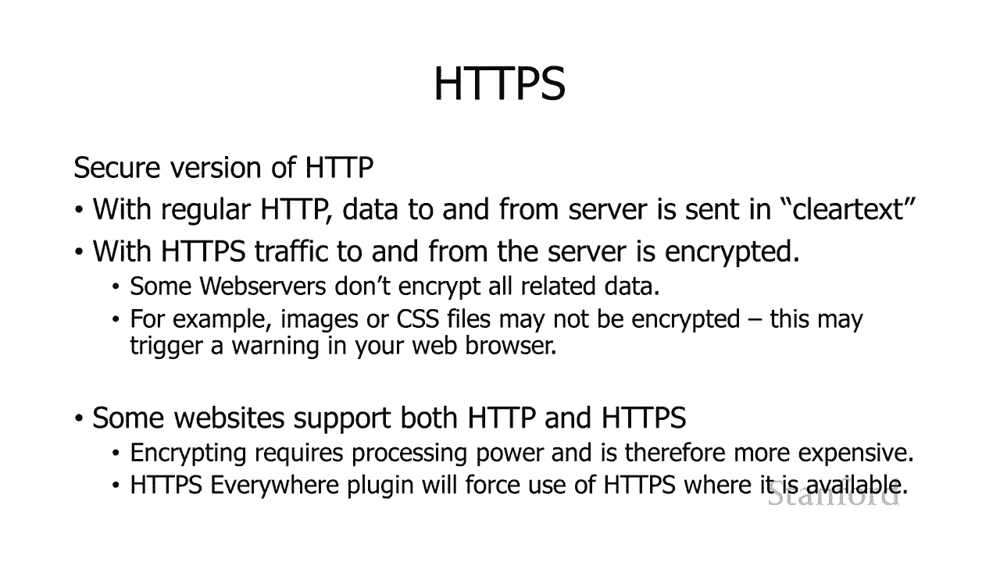

一些安全电子邮件系统承诺不记录发送者的IP地址。关键在于，谁有能力解密信息？是服务器解密，还是只有通信双方能解密？如果服务器持有密钥，在某些情况下可能成为安全隐患。

## 安全网络浏览 🌐

### HTTPS

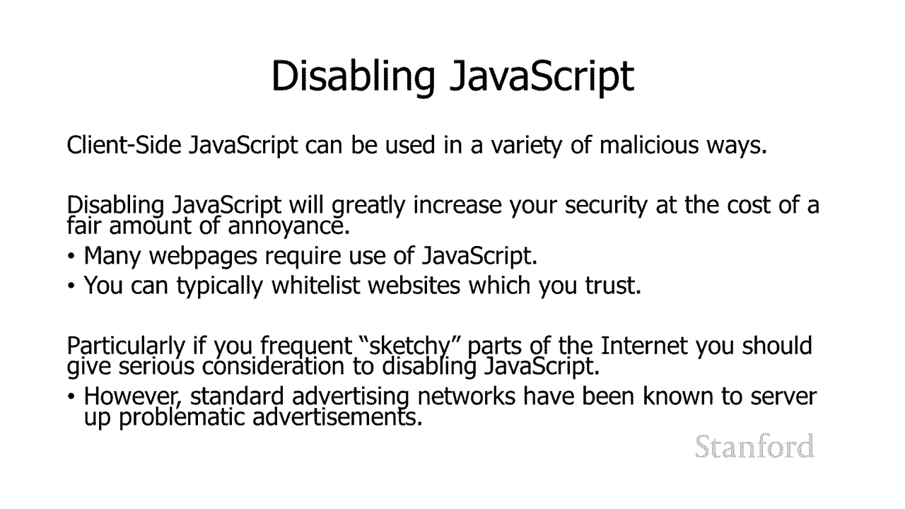

标准的HTTP协议以明文形式发送数据，而HTTPS是HTTP的安全版本，会对进出网络服务器的流量进行加密。

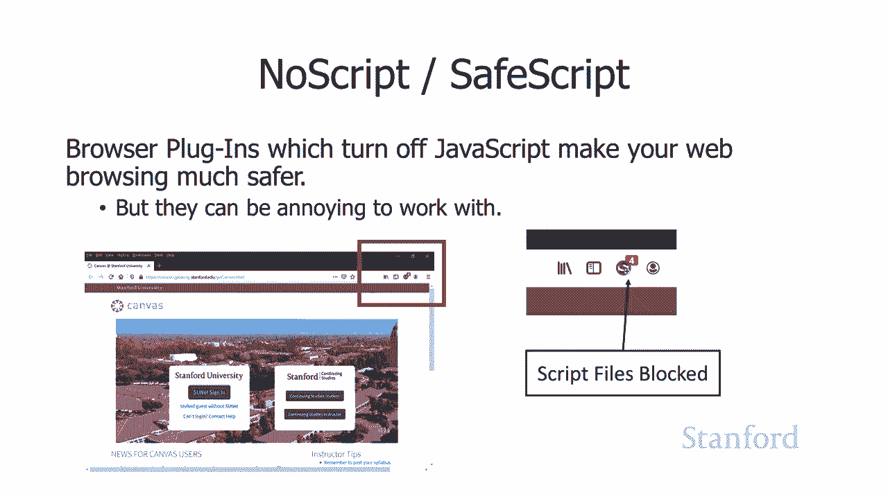

但需要注意，某些网页可能并未加密所有内容（如图像、CSS文件），这可能会触发浏览器的安全警告。理想情况下，所有内容都应被加密。

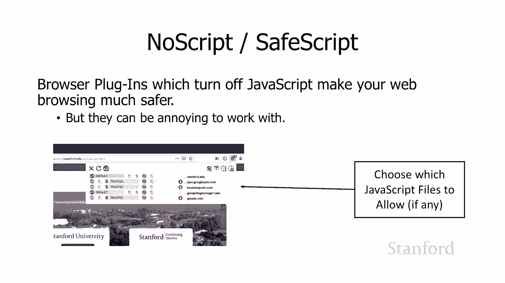

你可以安装电子前哨基金会（EFF）的“HTTPS Everywhere”插件，它会强制浏览器在网站支持的情况下使用HTTPS连接。

### 禁用JavaScript

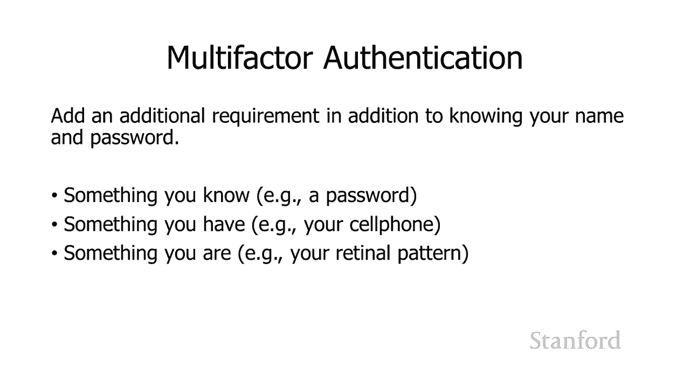

提高网络浏览安全性的一个重要建议是禁用JavaScript。因为客户端JavaScript可能被以各种恶意方式利用，例如触发“偷渡式下载”，或利用浏览器安全漏洞。

禁用JavaScript可以大大提高安全性，但也会使许多需要JavaScript才能正常工作的网页变得无法使用或体验很差。因此，一些安全工具（如Firefox的“NoScript”、Chrome的“SafeScript”）允许你将可信网站加入白名单，仅在这些网站上启用JavaScript。

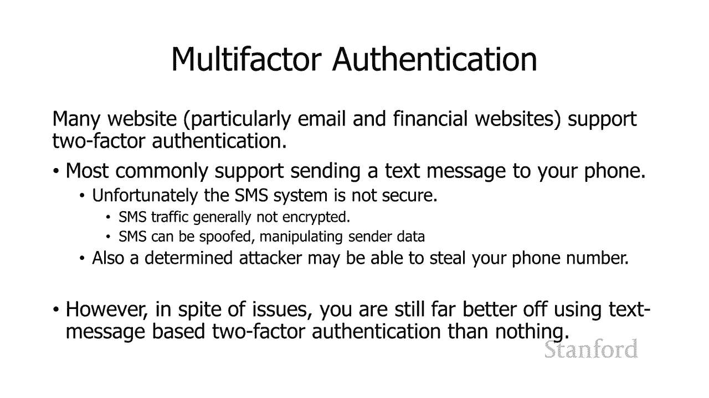

## 多因素身份验证 🔑

多因素身份验证是指在登录网站时，除了用户名和密码（你知道的东西）之外，还需要提供其他因素。

这些因素包括：
*   **你拥有的东西**：例如手机（接收短信）、安全令牌或身份验证器应用程序。
*   **你固有的特征**：例如指纹、视网膜图案。

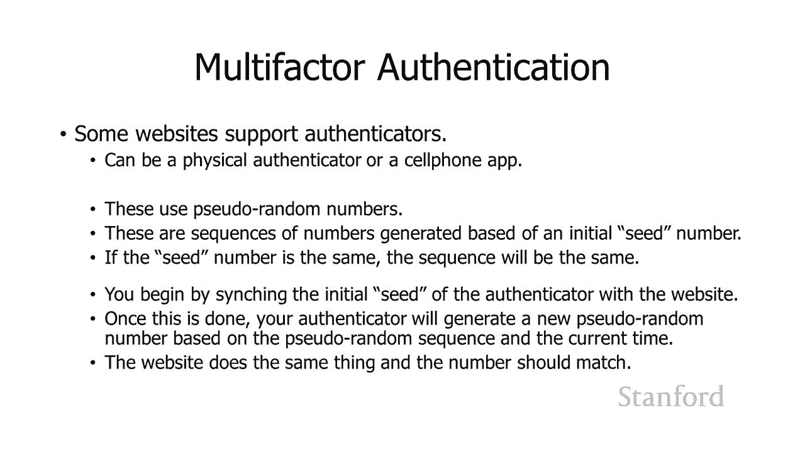

你应该在任何重要网站（尤其是电子邮件和金融网站）上启用多因素身份验证。因为电子邮件往往是重置其他账户密码的关键，必须保持超级安全。

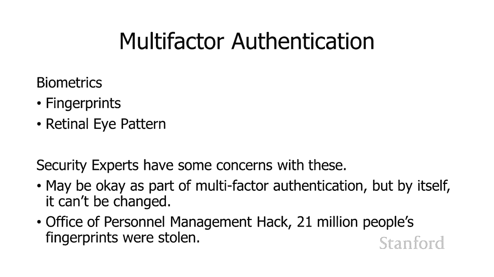

最常见的双因素身份验证是向手机发送短信。但这并非绝对安全，因为短信系统本身可能不安全，且存在“SIM卡劫持”诈骗。尽管如此，基于短信的双因素验证仍然比没有要好。

更好的替代方案是使用身份验证器应用程序（如Google Authenticator）或物理安全密钥。它们基于“伪随机数”算法，通过一个共享的“种子”和当前时间生成一次性的验证码，安全性更高。

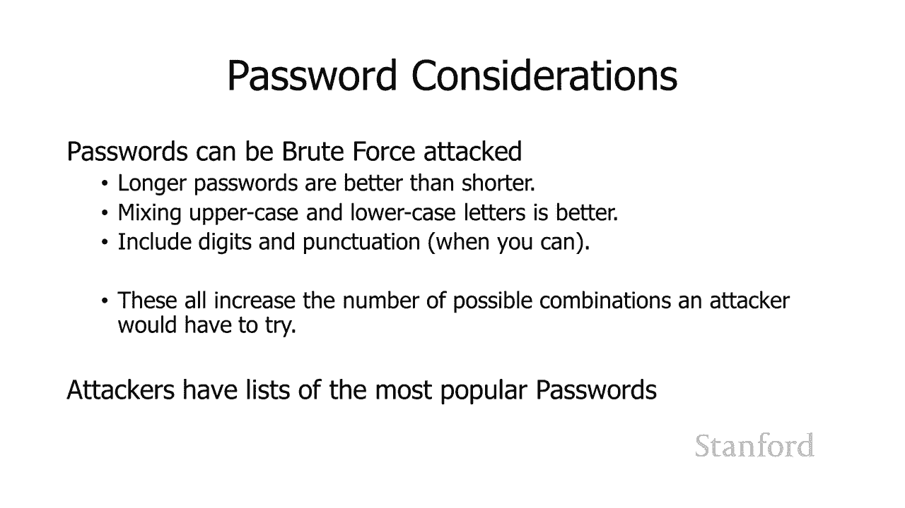

生物识别（如指纹）可以作为额外的因素，但安全专家通常不建议将其作为唯一因素，因为生物特征一旦泄露就无法更改。

## 密码安全 🔐

密码安全需要注意以下几点：

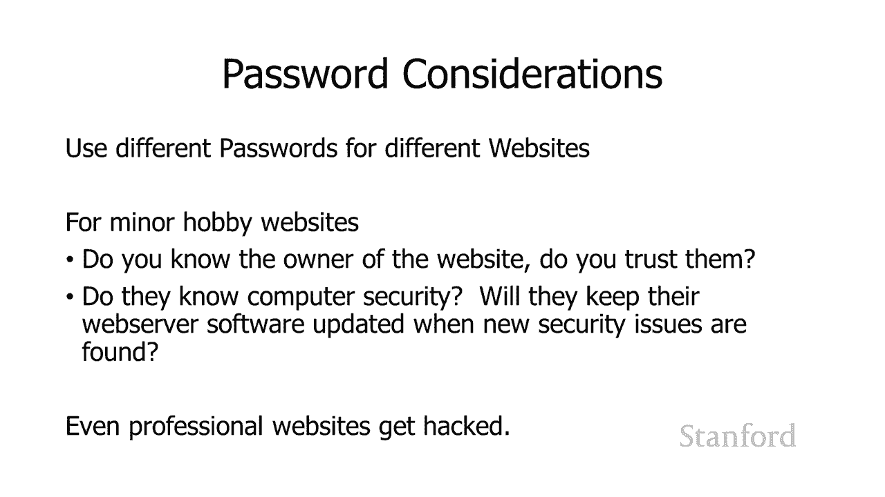

1.  **抵御暴力破解**：密码越长，可能的组合就越多，破解所需时间呈指数级增长。使用大写字母、小写字母、数字和标点符号可以大大增加组合数量。
2.  **避免常见密码**：不要使用“password123”等出现在常见密码列表中的密码。
3.  **使用唯一密码**：为不同的网站使用不同的密码。如果一个网站被黑客攻击导致密码泄露，你不会在其他网站面临风险。切勿在次要网站使用你的电子邮件或银行密码。
4.  **考虑使用密码短语**：密码短语是由多个单词组成的序列（例如“correct horse battery staple”）。它比随机字符更容易记忆，且长度更长。但要注意，人们倾向于选择符合语法规则的短语，这降低了随机性，应尽量选择看似不相关的单词组合。
5.  **使用密码管理器**：密码管理器可以为你生成并存储高强度、唯一的随机密码。你只需要记住一个主密码即可访问管理器。密码管理器还能帮助抵御网络钓鱼攻击，因为它不会在伪造的网站上自动填写密码。

密码管理器本身也可能成为攻击目标，但安全专家普遍认为，使用信誉良好的密码管理器仍然是提高整体密码安全性的好方法。

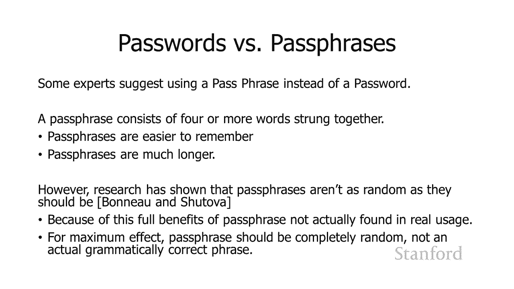

## 总结 📝

本节课中，我们一起学习了多种计算机安全防御技术。我们探讨了防火墙如何监控和过滤网络流量；代理服务器如何帮助访问受限资源；VPN如何创建加密隧道保护数据传输；以及物理隔离提供的终极安全。

在个人实践方面，我们强调了使用HTTPS、谨慎管理JavaScript、为重要账户启用多因素身份验证的重要性。最后，我们深入讨论了密码安全的最佳实践，包括创建强密码、使用唯一密码以及考虑借助密码管理器。

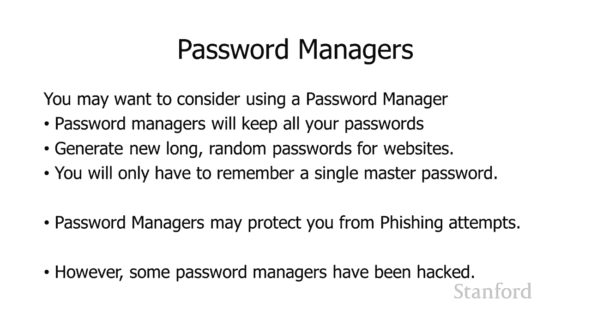

通过综合运用这些技术和良好的安全习惯，我们可以显著提升个人和组织的计算机安全水平。