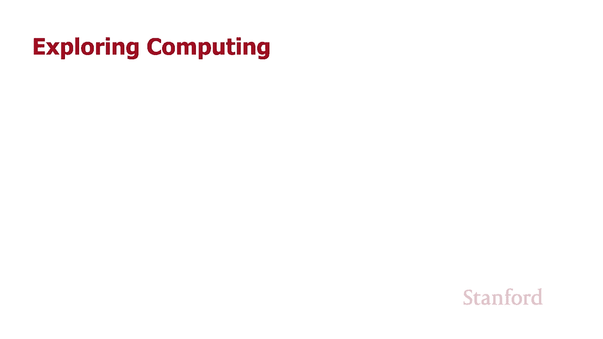
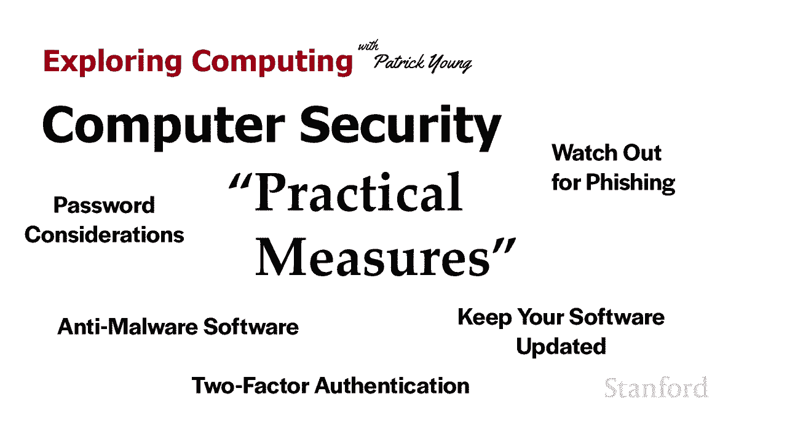
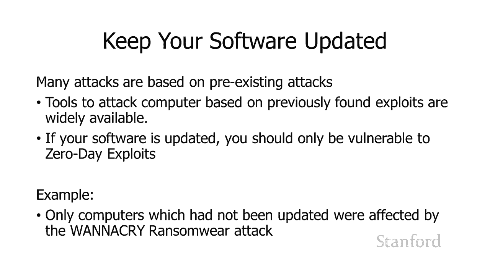
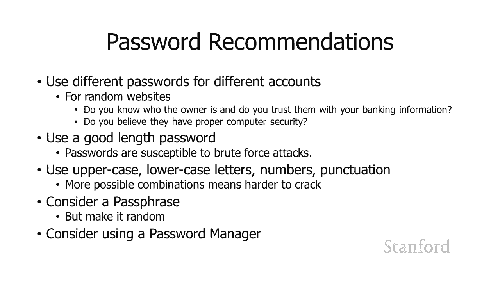
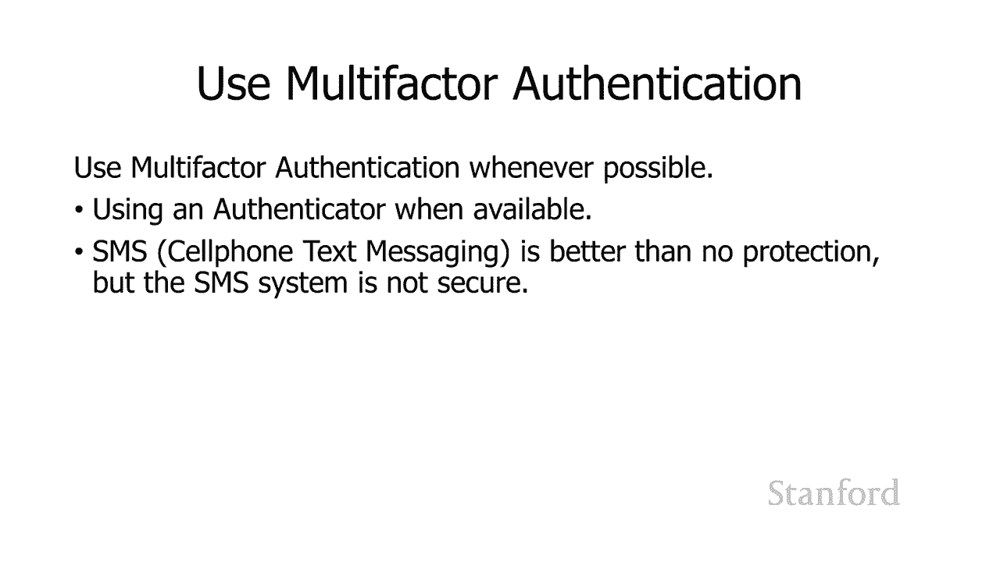
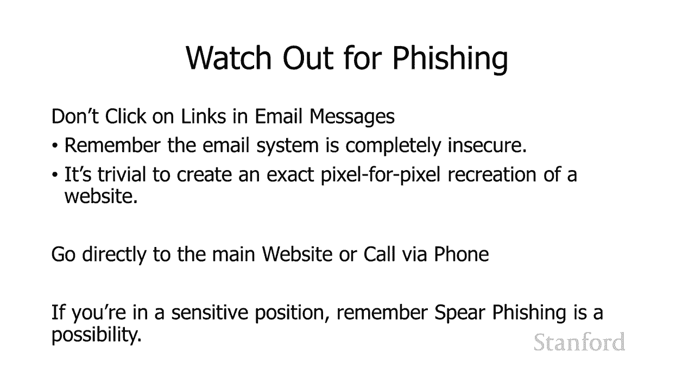

# 计算机科学导论：L22.2：计算机安全：实际措施 🔒

在本节课中，我们将探讨一系列实用的计算机安全措施。这些措施旨在帮助您保护个人数据和在线账户，抵御常见的网络威胁。我们将从软件更新、密码管理，一直讲到防范网络钓鱼和使用安全工具。

上一节我们介绍了计算机安全的基本概念和威胁类型，本节中我们来看看具体可以采取哪些行动来保护自己。

## 保持软件更新 🔄

最重要的事情是保持您的软件更新。这非常简单直接。请记住，许多攻击都是基于已知的、预先存在的攻击计算机的方式。因此，有许多现成的工具可供攻击者直接使用。如果您的软件保持更新，您将受到保护，免受除“零日漏洞”（即我们尚不知道的安全漏洞）之外的所有已知攻击。

## 创建强密码的建议 🔑

在创建密码时，请务必考虑以下建议。

以下是创建强密码的关键点：

*   **为不同的账户使用不同的密码。** 请记住，如果您在一个不知名的随机网站上创建账户，您可能不知道运营者是谁。即使对方是您认识的好心人，他们也可能没有良好的安全措施，您的密码信息可能会因此泄露。所以，不同账户的密码一定要不同。
*   **要非常小心您的电子邮件密码和金融账户密码。**
*   **使用长度合适的密码。** 密码越长，越难被破解。
*   **使用大写字母、小写字母、数字和标点符号的组合。**
*   **考虑使用密码短语而不是简单的密码。** 但请记住，为了达到最佳效果，密码短语应该包含随机的单词序列，而不是某种常见的短语或运动队的口号。最好甚至不是英语中的常见搭配，只是一堆随机组合在一起的单词。
*   **考虑使用密码管理器。**

## 使用多因素身份验证 ✅

如果可能，请使用多因素身份验证。

以下是关于多因素身份验证的说明：

*   选择身份验证器（手机应用程序或物理身份验证器）比接收短信更可取，因为短信系统本身并不安全。
*   但是，使用基于短信的双因素身份验证仍然比完全不使用双因素身份验证要好。

## 小心网络钓鱼攻击 🎣

小心网络钓鱼攻击。不要随意点击邮件中的链接。

以下是防范网络钓鱼的要点：

*   记住电子邮件系统是完全不安全的。
*   创建一个网站的逐像素精确再现非常容易。所以，仅仅因为它看起来和您银行的网站一模一样，并不意味着它就是您银行的真正网站。
*   欺骗电子邮件系统并假装成您不是的人也很容易。
*   不要点击邮件中的链接。直接通过浏览器输入主要网站的地址访问，不要从电子邮件中复制任何内容。
*   如果您处于敏感职位并且特别担心安全性，请直接通过电话致电公司核实。
*   不要忘记“鱼叉式网络钓鱼”，这是一种针对性攻击。攻击者会研究您的身份，弄清楚您应该收到什么样的电子邮件，然后精心设计一封专门用于诱骗您打开它的邮件。

## 使用安全工具 🛡️

使用反恶意软件。

以下是关于安全工具的建议：

*   操作系统通常已经内置了良好的反恶意软件。例如，Windows Defender 实际上被认为相当不错。
*   如果您需要，可以从 Stanford 的 ESS（Essential Stanford Software，斯坦福必备软件）网站获得免费的反恶意软件。
*   为了获得最大的安全性，您可以考虑在浏览器中阻止 JavaScript。这可能会使浏览网页的体验更烦人，但会显著增强您的安全性。

本节课中我们一起学习了保护在线安全的多种实际措施，包括及时更新软件、创建和管理强密码、启用多因素身份验证、警惕网络钓鱼攻击以及合理使用安全工具。将这些习惯融入日常数字生活，能有效提升您的安全防护水平。