# L23.1：隐私与大数据 🔒

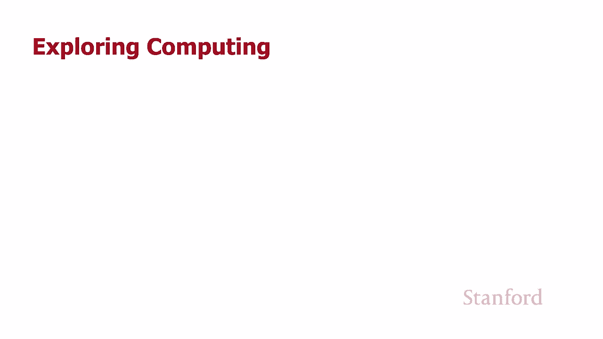

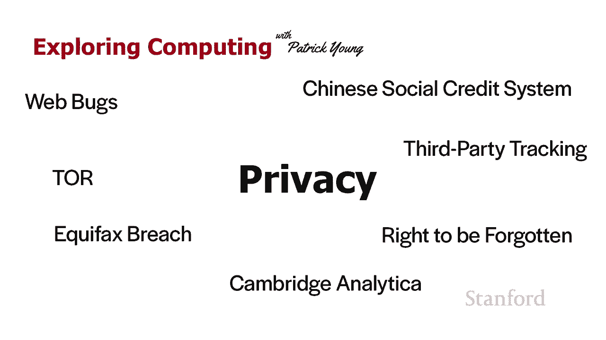

在本节课中，我们将要学习数字时代的隐私问题。我们将探讨为什么隐私在当今世界变得尤为独特和重要，了解数据如何被收集和利用，并审视商业与政府使用数据时带来的挑战。

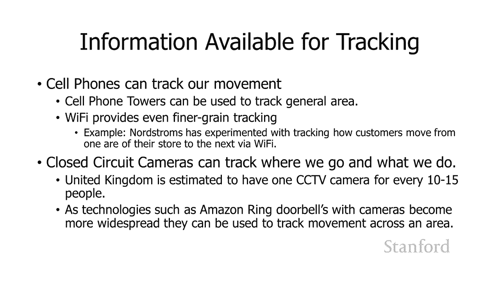

## 为什么数字时代的隐私不同？🤔

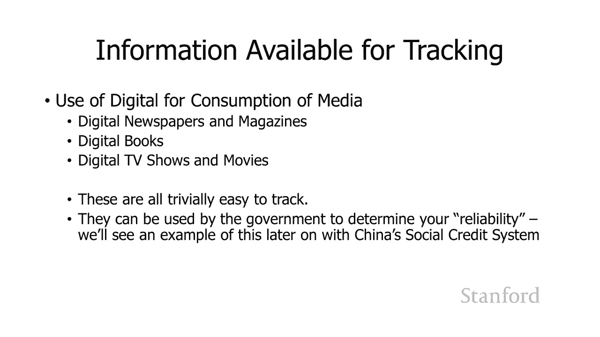

上一节我们介绍了课程概述，本节中我们来看看隐私在数字时代有何不同。数字世界中的隐私变得独特有趣，是因为最近发生了许多变化，这些变化严重影响了隐私。

## 数据追踪的演变 📍

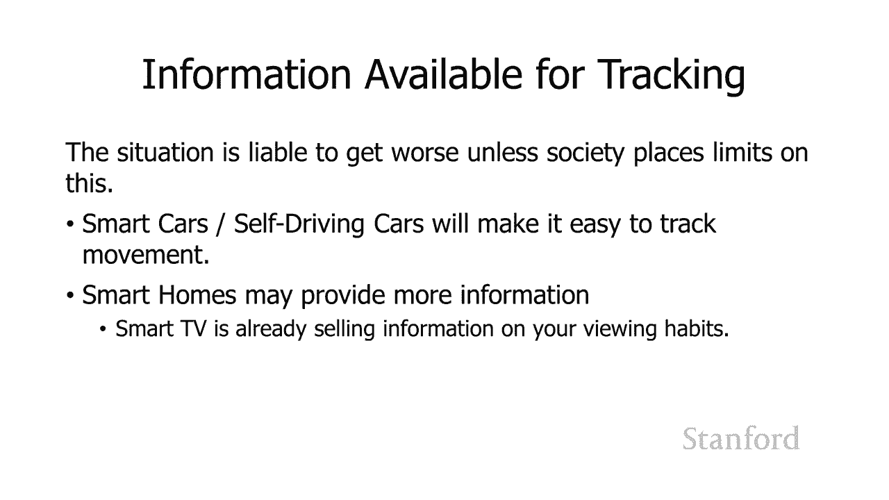

所以让我们谈谈其中的一些变化。现在有更多的信息可用于跟踪。几乎每个人都有手机，手机可以跟踪我们的运动。当你在城市里开车时，你的手机正在联系不同的手机信号塔，这可以用来跟踪你的动作。

但事实证明，在许多情况下，有比手机信号塔更精细的跟踪方式。当你在一个区域移动时，你的手机会尝试连接不同的 Wi-Fi 网络和不同的 Wi-Fi 路由器。事实证明，这些也可用于跟踪您的活动。

以下是几个具体的追踪例子：
*   **零售追踪**：例如，Nordstrom 通过观察手机在商店中移动时尝试连接不同网络的位置，可以尝试跟踪客户如何从商店的一个部分移动到另一个部分。
*   **视频监控**：现在也到处都是闭路电视摄像机，它们也可以用来跟踪我们去哪里了。英国估计每 10 到 15 人就有一台闭路电视。
*   **智能设备**：亚马逊的带摄像头的门铃等技术也可以用于跟踪运动。特别是一旦你在一个区域有相对大量的这些设备，那么你可以将来自每个不同门把手的视频放在一起，以跟踪运动。

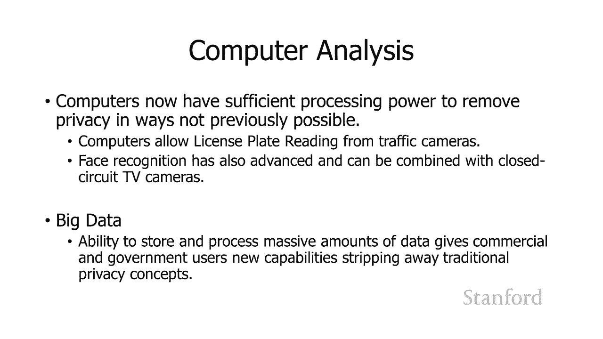

## 媒体消费的数字化 📺

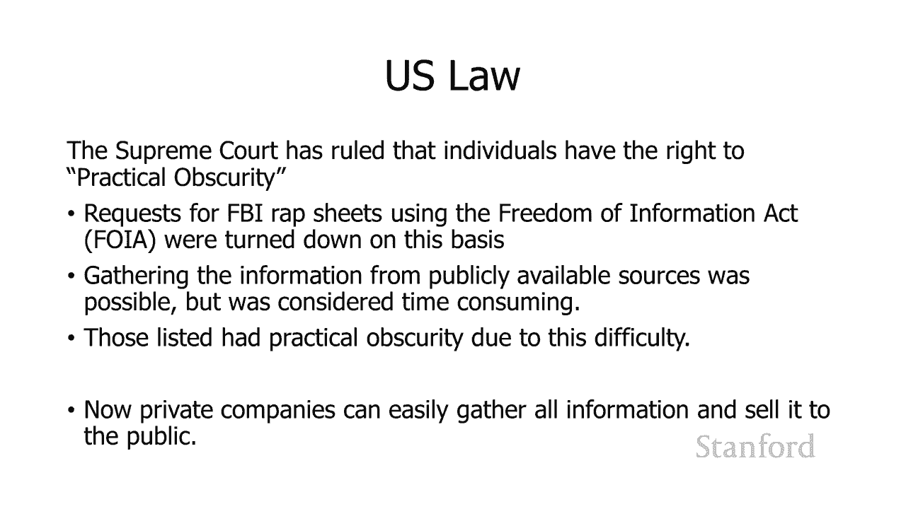

以及我们将媒体消费转移到数字设备上，这使得追踪我们的媒体消费习惯变得非常简单。数字报纸和杂志、数字图书、数字电视节目和电影，只要您不使用物理媒体，而是使用数字媒体，跟踪您正在查看的所有内容就非常简单。您阅读的所有内容，您看到的一切都可以被追踪。

## 数据的处理与利用 💾

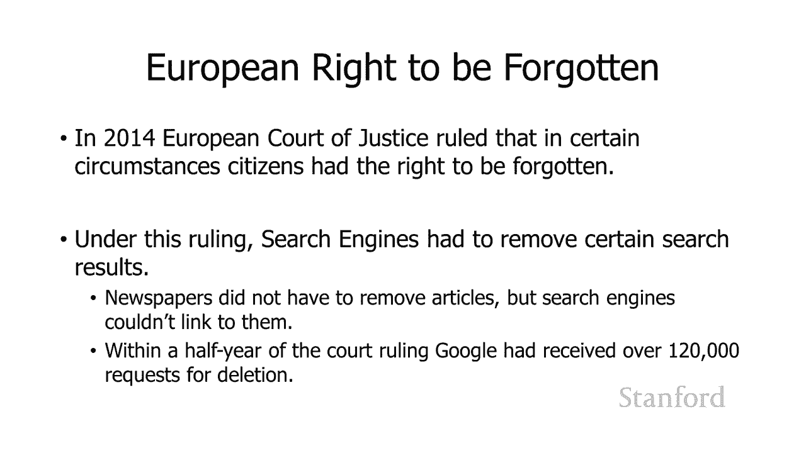

被政府用来确定您的可靠性。事实上，稍后我会看到一个例子，说明中国如何将它用于他们的社会信用体系，被用来确定公民的可靠性并在此基础上给予他们奖励或惩罚。

随着我们转向具有一些智能技术的智能汽车，情况可能会变得更糟而不是更好。然后，我们转向自动驾驶汽车，这将非常轻松地跟踪您的活动。智能家居可以向可以访问您的活动和家庭的任何人提供信息。实际上，智能电视几乎是您现在购买的具有某种 AI 功能的电视，假设我可以调用一个操作系统。我认为其中许多是基于 Android 的，内置于它们中，允许您选择将不同的应用程序放在上面并选择不同的电影观看。其中一些公司实际上在出售有关您的观看习惯的信息。

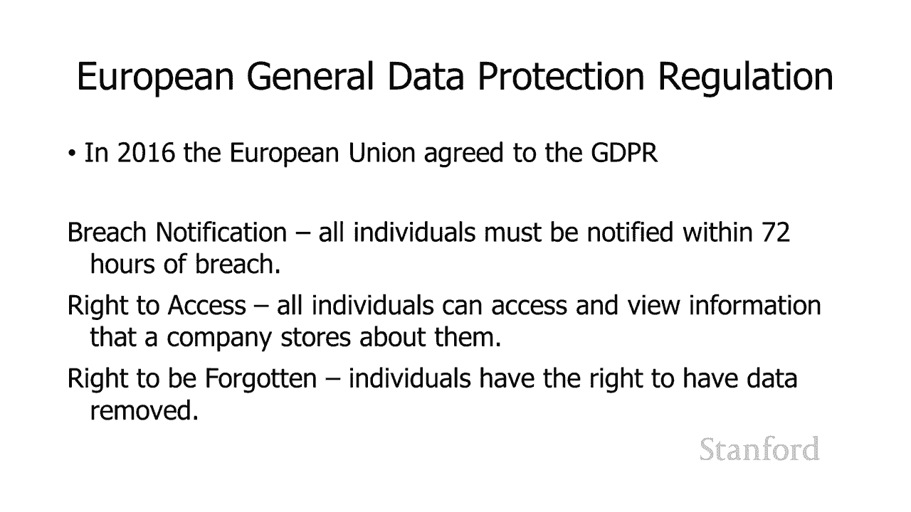

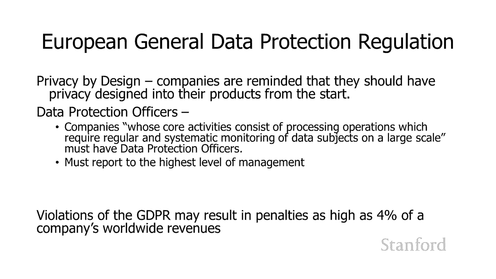

因此，除了拥有所有这些信息之外，我们现在还有足够的处理能力来真正利用它。这还可以与存储大量信息的能力相结合，然后在事实发生后运行处理。这使我们能够剥离传统上被认为是私人的东西。

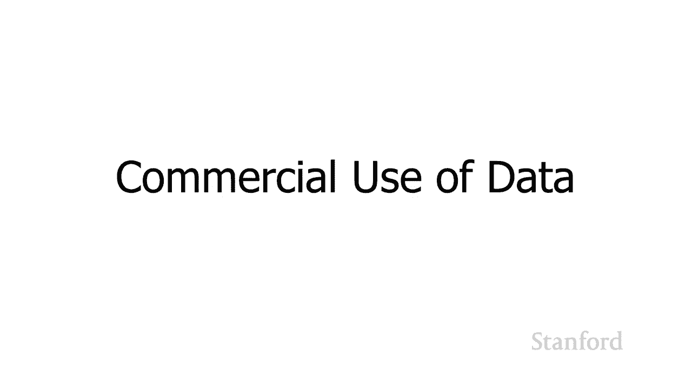

## 大数据与追溯分析 🔍

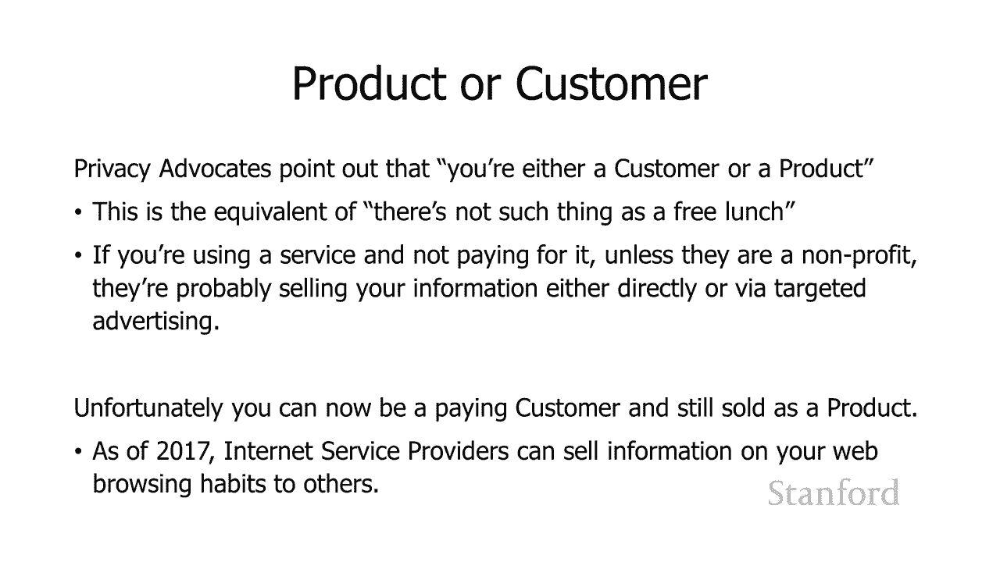

所以以前假设我们试图跟踪整个城市的特定车辆，也许有人被绑架了，我们有某种人质情况，警方可以使用某些街道上提供的闭路电视摄像机查看交通模式。他们可能会说，我们要继续观察人质车辆穿越城市，所以这是他们以前可以做的事情。

但我们现在可以做或随着存储变得越来越便宜，我们前进的方向是存储来自所有交通摄像头的所有信息，并在一段时间内开始处理。因此，我们能够存储的确切时间将取决于我们的存储容量以及存储的便宜程度。但您当然可以想象这样一种场景：您可以存储几天的流量，或者在某个时候您可以开始存储几个月的流量，然后再进行处理。也许现在什么都没有发生，但是你就像，某某有丑闻，让我们继续吧，把三个月前的录音带挖出来，这是他的车牌，我们看看我们是否可以搜索所有交通数据，看看我们是否可以找到他的车牌号码，然后看看他在做什么。

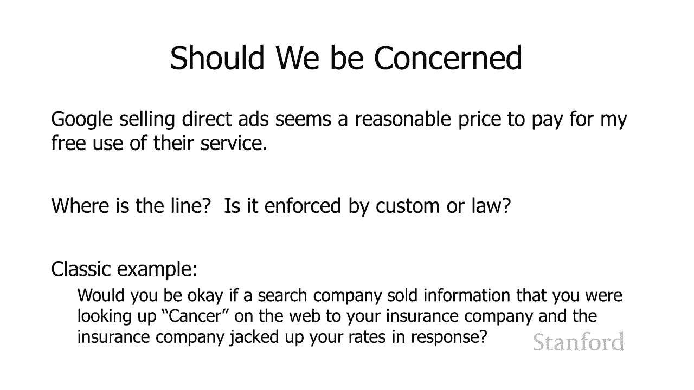

所以我认为，我们前进的方向可能会令人担忧。从隐私观点看，这种存储大量数据然后能够处理它的组合，就是有时被称为大数据的东西。它可供商业用户和政府用户使用，也是我们可能想要考虑的东西。我们想要规范这个，我们想要什么样的社会。我们稍后会在讲座中讨论这个问题。

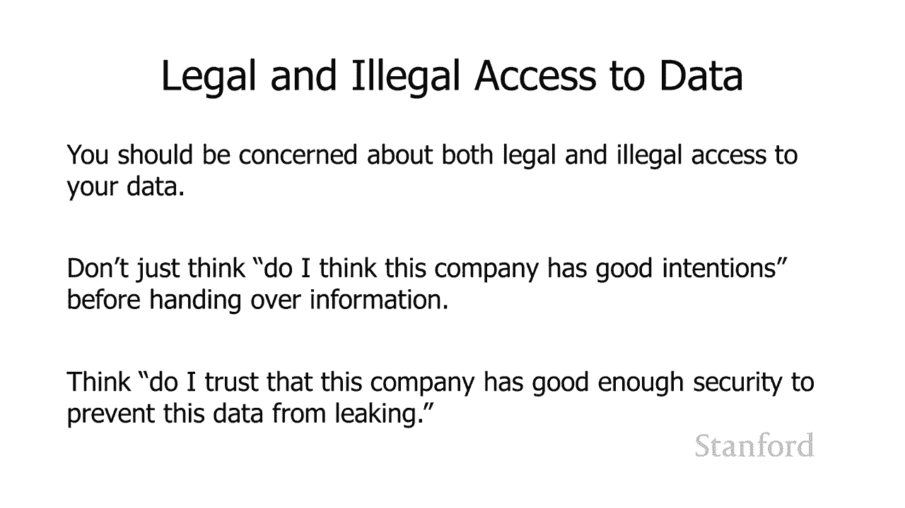

## 法律保护与“被遗忘权” ⚖️

当我们讨论隐私的商业问题和政府的隐私问题时，好吧，就我们的法律而言，所以事实证明，我们法律提供的一些保护正在被我们的计算能力侵蚀。

例如，最高法院裁定个人有权实践实际默默无闻。因此这种情况的发生方式或如何发生的一个例子是，使用信息自由法的联邦调查局 RAP 表的请求被拒绝了，这是基于实际隐蔽性的需要。虽然该信息是公开可用的，但想法是有人必须浏览并收集所有公开可用的信息，这是一件耗时的事情。因此由于难以追踪所有信息，因此列出的那些实际上默默无闻。

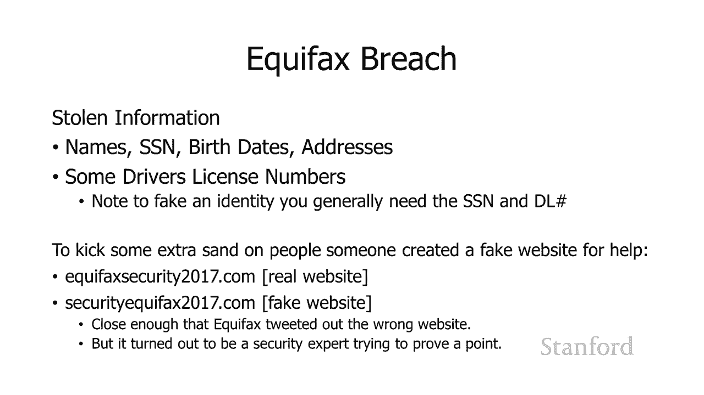

但当然，现在追踪信息非常容易。事实上，公司会收集这些信息。您可能已经在网络上看到了他们的广告，例如，您想查看您高中的另一半在做什么，查看他们现在住的地方，了解他们的收入，是否已经结婚了。所以，实际的默默无闻在很大程度上已经消失了。

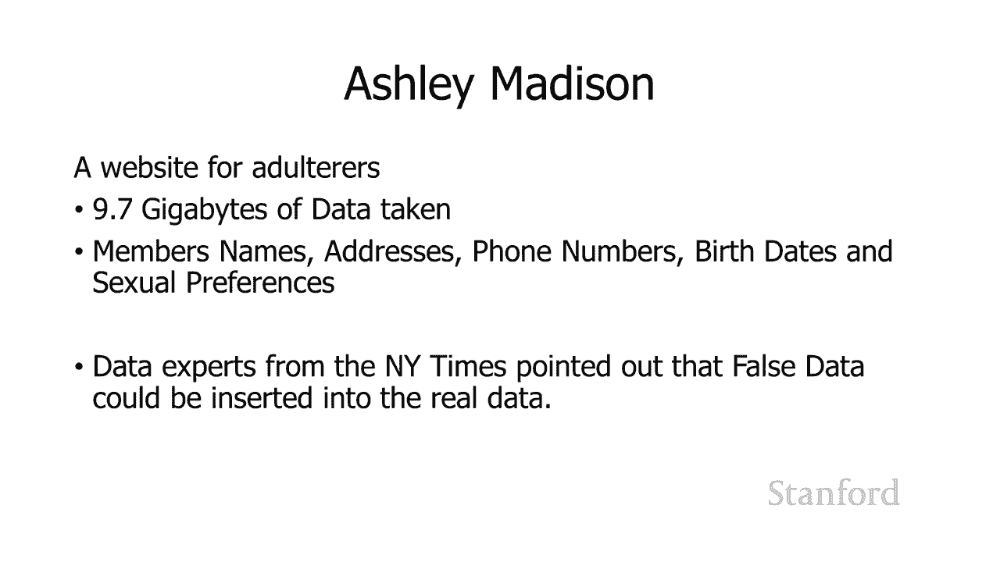

欧洲共同体可能正在做的计算能力方面，积极保护公民隐私的最重要工作。他们做过的一件事是 2014 年欧洲法院裁定，在某些情况下，其公民有权被遗忘。根据这项裁决，搜索引擎必须删除某些搜索结果。因此如果一家报纸有他们以前写过的文章，他们仍然可以将其留在他们的网站上，但搜索引擎无法直接链接到这些文章。关于被遗忘权的裁决半年后，谷歌收到了超过 120,000 项删除信息的请求。

## 通用数据保护条例（GDPR） 🛡️

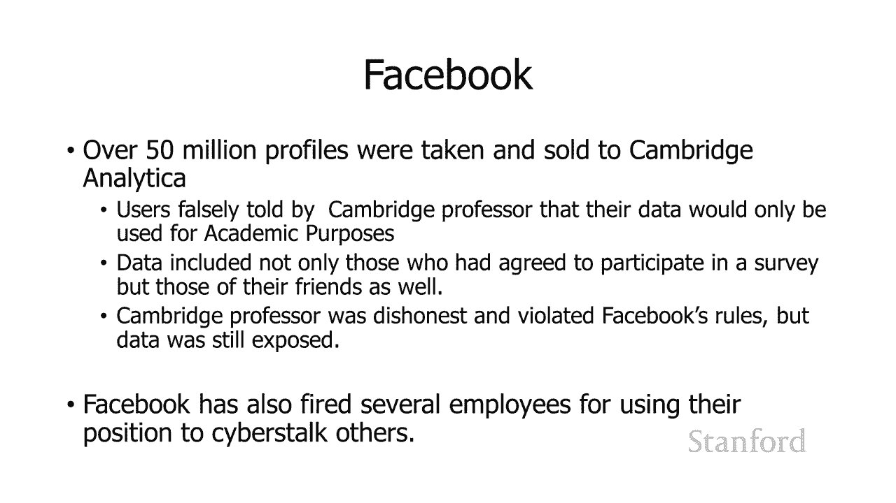

欧洲共同体采取的另一项举措是欧洲通用数据保护条例。这个于 2016 年达成一致，并实施两年后。您最会注意到这一点，因为您每次访问网站时都会不断收到烦人的弹出窗口，说“我们使用 Cookie”等信息。加利福尼亚州最近也采取了类似的行动，所以您可能会因为加利福尼亚州的新法律而获得一些额外的弹出窗口。

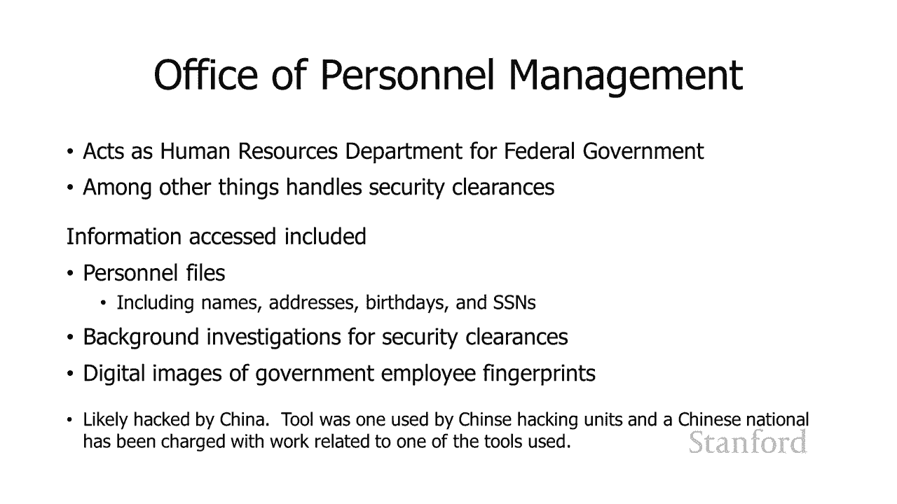

所以一般数据保护法规实际上做得很好。以下是 GDPR 要求的关键事项：
*   **数据泄露通知**：如果一家公司存储某人的信息被泄露，必须在泄露后 72 小时内通知个人。没有这项法律，公司甚至不告诉人们他们的数据在那里，或者尽管人们知道他们的数据在外面，但尽可能长时间等待，这对于这些人来说，保护自己可能是一件重要的事情。
*   **数据访问与删除权**：个人有访问公司存储的有关他们的信息的权利。他们有权删除有关他们和公司的数据。
*   **隐私设计**：提醒他们，他们应该从一开始就在他们的产品中设计隐私。
*   **数据保护官**：此外，符合某些特征的公司必须有数据保护官，这些数据保护官必须向最高管理层报告。他们有责任确保数据受到适当保护。
*   **高额罚款**：违反 GDPR 确实有一些问题，他们可能需要支付高达公司全球收入 4% 的罚款。

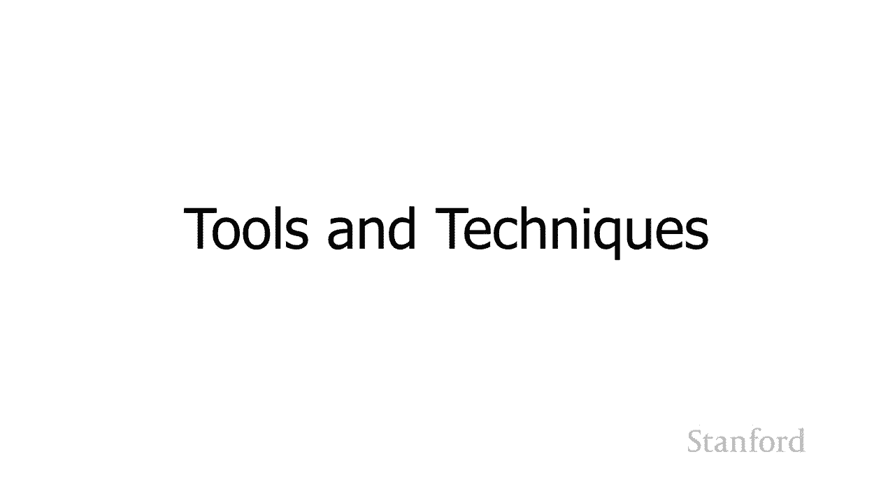

## 数据的商业用途：客户还是产品？ 💰

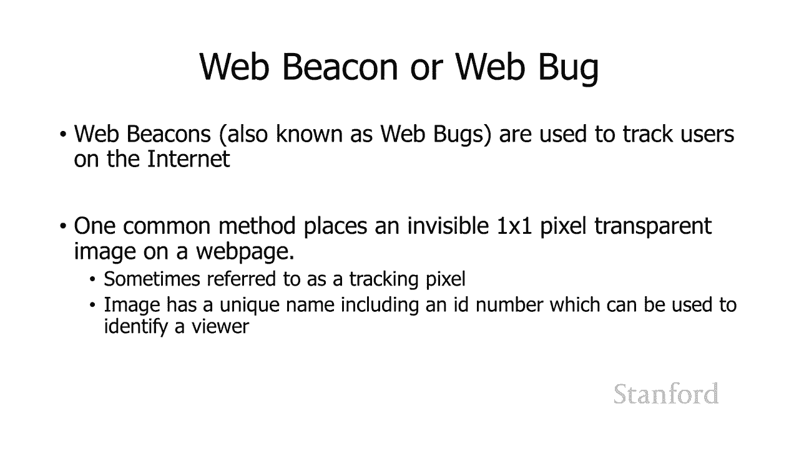

让我们来看看数据的商业用途。所以隐私倡导者有时会谈论一件事，这个概念是：你是客户还是产品？所以这基本上是说，如果你正在使用产品并且你没有为它付费，并且你不是从非营利组织或者政府获得服务，那么你从中获得服务的公司需要以某种方式赚钱。如果你付钱的话，很好，这就是他们赚钱的方式。如果你不付钱，那么他们可能是通过出售对你的访问权或有关你的信息来赚钱的。所以你知道他们要么直接获取有关您的信息并直接销售，或者他们正在向您展示有针对性的广告。

不幸的是，您现在既可以成为客户，又可以成为产品。因此，作为 2017 年的示例，互联网服务提供商现在可以在您的网页浏览中出售信息给他人的习惯，即使你实际上是付费客户。

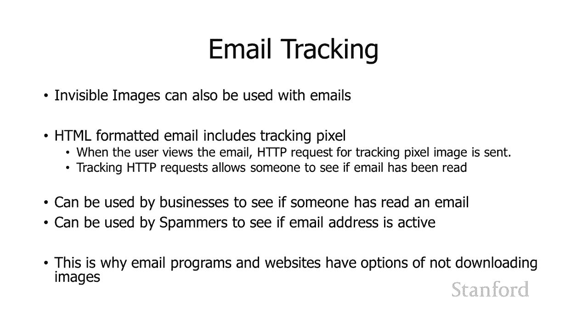

## 商业数据使用的风险与案例 🤨

所以我们应该担心。要考虑的一件事是，我使用谷歌或我使用必应，或我使用 DuckDuckGo 作为我的搜索引擎，显然他们必须支付账单，所以看到有针对性的广告因为我可以免费使用谷歌，这似乎是一件合理的事情。但是需要担心的是这条线在哪里，这条线是由习俗强制执行的，还是由法律强制执行的？

隐私倡导者已经提出的经典场景：如果我正在搜索有关癌症的网站，也许我有一个朋友患有癌症，或者父母患有癌症，或者我患有癌症，他们无法知道。但是，搜索引擎是否可以获取我正在搜索癌症的信息，然后将这些信息出售给我的保险公司，让我的保险公司根据我实际上可能患有癌症的理论来提高我的费率？我们对此是否满意？如果我们对此不满意，那如何执行呢？

另一件你应该做的事情：当您在网站上输入您认为是私人的信息或将其提供给公司时，您是否知道这两者是否合法，但他们与他人共享是合法的？那么是否有人可能非法获取这些信息？所以你知道除了思考“我认为这家公司有良好的意图”，你还应该考虑我是否相信这家公司有足够的安全性，这些信息不会被泄露，实际上泄露了，他们不会被黑客攻击，尽管他们可能有任何好意。

## 知名数据泄露案例 📉

所以让我们看几个例子，也许人们不应该信任这些公司保管我们的信息。

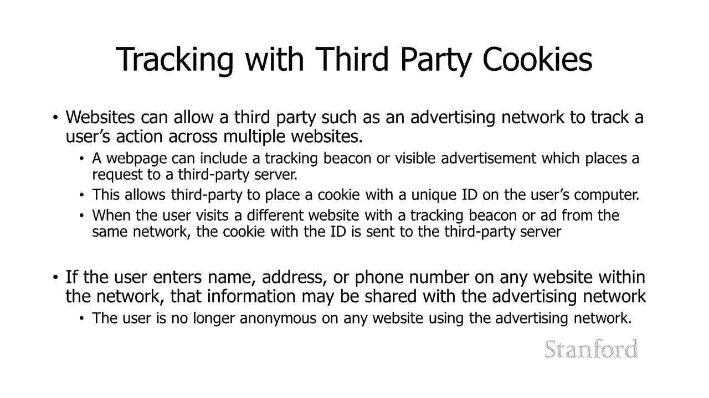

以下是几个重大的数据泄露案例：
*   **Equifax**：Equifax 是一家信用机构，它是那些跟踪我们在金融世界中的财务和信用卡所做的事情的公司之一，以及我们是否值得信用。所以他们被破坏了，许多人的姓名、社会安全号码、出生日期和地址在这次违规行为中被盗。此外，还有一些人的驾照号码被盗。事实证明，如果你有一个社会安全号码和一个驾照，你就可以创建假身份并为人们创建信用卡账户，这样组合就非常危险。只是为了给那些信息被泄露的人踢一些额外的沙子，破坏了，有人创建了一个虚假的帮助网站，并且有一个真正的帮助网站名为 equifaxsecurity2017.com，有人创建了一个名为 securityequifax2017.com 的网站，它足够接近，Equifax 不小心在他们的推特帐户上发布了错误的网站。但好消息是，在这种情况下，假网站是由安全专家创建的，目的是为了说明这一点。关于 Equifax 漏洞的另一件事有点奇怪：我们都不是 Equifax 的直接客户，我们真的不同意将我们的信息放在那里。我的意思是，我们注册的信用卡上可能有一些细则，或者我们工作的银行说他们是能够传递有关 Equifax 的信息，但我们都不是 Equifax 的直接客户，但他们拥有所有这些信息，而这些信息都丢失了。
*   **Ashley Madison**：Ashley Madison 是一个供通奸者使用的约会网站。他们被黑客入侵，窃取了 9.7 GB 的数据，包括会员姓名、地址、电话号码、出生日期和性取向。纽约时报指出的一件事是，当这个信息被发布时，黑客完全有可能在其中插入一些虚假数据。所以是的，无论如何，人们相信阿什利·麦迪逊的信息，他们不应该拥有。也许阿什利·麦迪逊的意图是好的，但他们没有良好的计算机安全性。
*   **Facebook 与剑桥分析**：Facebook 上有超过 5000 万份个人资料被盗用并出售给剑桥分析公司。一位教授告诉他们，他们的数据只会用于学术目的。嗯，不仅是那些认为它只会用于学术目的的人的数据被拿走了，而且事实证明，所涉及的教授能够访问他们朋友的信息。所以，这与之前的例子有点不同，因为这不是公司被黑客入侵，而是他们正在与某人合作，某人违反了协议条款并做了一些不诚实的事情。但尽管如此，所涉及的人的信息被盗取并出售给第三方。Facebook 并没有在技术上被黑客入侵，但人们有点被结果证明是一种骗局，那个人有意做一些不值得信赖的事情。您可能会争辩说这可以说是社会工程的一个案例。此外，Facebook 有几次不得不解雇员工，因为这些员工是利用他们在 Facebook 的职位进行网络跟踪的人。
*   **美国人事管理办公室（OPM）**：人事管理办公室充当联邦政府的人力资源部门，它处理安全许可。他们被黑客入侵，信息访问包括带有姓名、地址、出生日期和社会安全号码的人事档案。可能更麻烦的是，它包括安全许可的背景调查，其中包括诸如您是否吸毒之类的事情，你做过的事情可能会导致你被勒索了。所以这些都是可能进入背景调查的各种事情，它会被存储在他们的电脑上，这些电脑被黑了。此外，政府雇员的指纹数字图像现在也被盗了。至于是谁干的，黑客可能是中国，使用的工具与中国黑客有关。事实上，一名中国人被指控与人事管理办公室使用的工具之一相关。

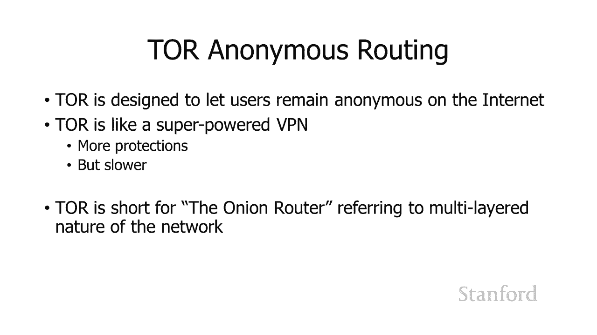

所以这些都提醒你，如果你把信息放在那里，即使公司有良好的意图，不以某种方式分享这些信息，有可能会发生不好的事情，并且信息无论如何都会泄漏。

## 网络追踪技术：网络信标与 Cookie 🕵️♂️

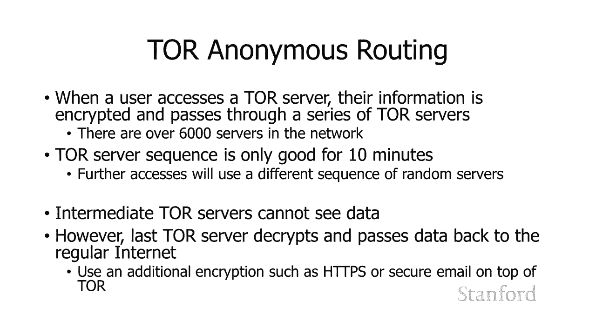

因此一种用于破坏隐私的技术称为网络信标或网络错误。它们用于跟踪互联网上的用户。你们可以弄清楚这些是如何工作的，因为您知道 HTML 是如何工作的，并且您知道 HTTP 的工作原理。

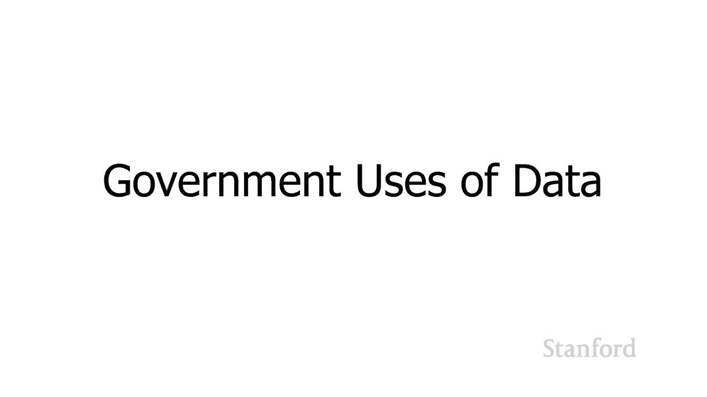

本质上，网络错误或网络信标是什么？它是一张显示在网页上的图像，它是透明的，因此人们实际上并不注意它就在那里。这有时被称为跟踪像素。这里的想法是这个跟踪像素有一个唯一的 ID 号，它标识了这个网页已被提供给的特定个人。

这可以用于几个不同的目的：
*   **电子邮件跟踪**：因此如果您在 HTML 邮件文件上有一个不可见的图像，那么当有人打开该邮件文件时，HTML 文件的 `img src` 等于它的名称有一个此特定电子邮件的唯一 ID 号。当服务器收到对该隐形跟踪像素图像的请求时，它说“哦，拥有该 ID 号的人刚刚打开了电子邮件消息”。这就是为什么我收到该特定跟踪请求的原因。企业可以使用它来查看某人是否阅读了特定的电子邮件。垃圾邮件发送者也可以使用它来查看该电子邮件地址是否处于活动状态。因此垃圾邮件发送者会发送一堆 HTML 中的电子邮件，所有电子邮件都完全相同，除了跟踪信标。所以，会有 `img src=`，然后会有一个唯一的 ID 号 .jpeg 或唯一的 ID 号 .png。现在会发生什么？当您继续接收该电子邮件时，如果您的电子邮件设置为显示图像，您的网络浏览器将要显示的图像，或者您的电子邮件程序将向跟踪信标来自的任何地方发送 HTTP 请求，并且它将发送请求具有只有您在电子邮件中收到的唯一 ID 号的特定图像文件。然后另一端的服务器将看到请求了该特定 ID 号，并且能够将其与原始已发送的消息匹配。您可能已经注意到，许多电子邮件程序都有不显示图像的选项，直到您明确说“我相信发件人，现在继续显示图像”。这是主要的，他们这样做的原因是为了防止这种跟踪。
*   **跨网站跟踪**：这些也可以用来跟踪人们在互联网上的活动，使用第三方 Cookie。当我们谈论第三方时，我们谈论的是前两个派对是你和你正在访问的网站。所以有一个是第一方，第二方，和第三方是其他方。所以这里的想法是网站可以允许第三方（例如广告网络）跟踪用户的跨多个网站的操作。这可以通过这些跟踪像素来完成，这些跟踪像素我们刚刚在这些不可见的像素图像之前讨论过，或者它们实际上可能是通过可见的广告来完成的。但是这里发生的是当您访问网页时，使用 Cookie 参与此第三方网络的情况是，除了该网页的常规内容之外，您还将 HTML 文件也将引用其中之一跟踪像素网络信标图像，或者它将引用显示在网页上的实际广告。无论是请求该网络信标还是该图像文件，不是来自他们的服务器，而是来自第三方服务器。第三方服务器发生的情况是，第三方向您发送该图像，无论它是跟踪信标还是实际广告。此外，它还在您的网络浏览器上放置一个 Cookie。因此 Cookie 存储是一种用于存储少量信息的技术，你的网络浏览器可以在你下次访问它时设置回网站。所以假设你去亚马逊，亚马逊会在你的网络浏览器中放一些信息，这样你下次访问亚马逊时，你的网络浏览器将把该信息发送回亚马逊，这就是亚马逊在您下次访问时实际上知道您是谁的方式。类似地，您知道您是否订阅了一些东西，所以就像你知道我订阅了纽约时报，纽约时报通过把这个小 Cookie 放在我的网络浏览器上来跟踪我，下次我访问纽约时报时，我的网络浏览器将那个 Cookie 发送回纽约时报，我访问并说“哦，那是帕特里克，他有纽约时报的学术访问权限，所以，嗯，他很好”。所以这里的想法是，这些第三方网络，因为 HTML 文件引用了来自这些第三方服务器的图像，服务器现在能够向您发送跟踪信息并将此 Cookie 信息放入您的网络浏览器。当您移动到另一个网站时，如果该网站也再次提供图像，无论它们是这些不可见的网络信标还是它们的可见广告，向第三方请求广告，服务器出现，他们之前放入的第三方 Cookie 也将发送给他们。所以，他们会像“哦，这是同一个用户，我在另一个网站上看到了这个用户，我现在在这个网站上看到了他们”。只要您访问该跟踪网络上的不同网站，他们就可以建立您访问的所有不同类型网站的图片，建立有关您的所有网络浏览习惯的所有信息，并根据他们想要做什么来为您创建个人资料。

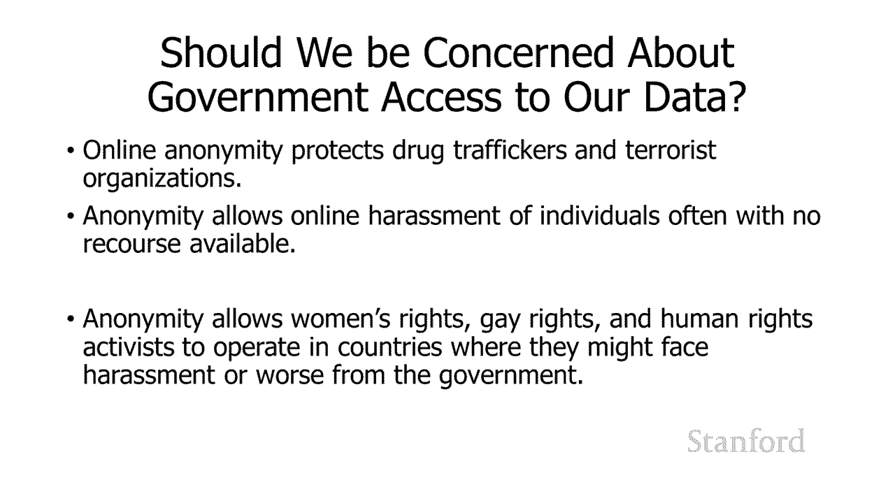

此外，如果我在商店网页上输入了我的姓名和电话号码以及其他信息，这些信息可以与广告网络结合使用。广告网络如果该网站选择将该信息传递给广告网络，则广告网络不仅可以了解我的网络浏览习惯，但他们可能有我的姓名、地址和电话号码，以及我输入的任何其他信息。

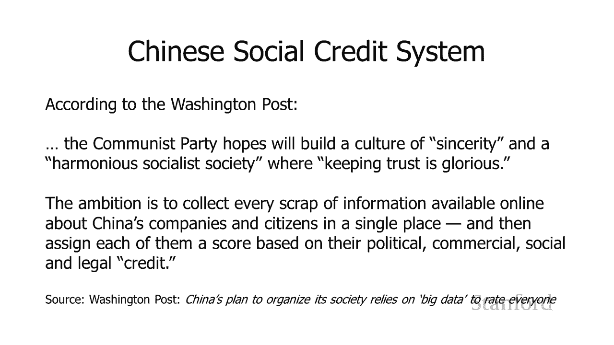

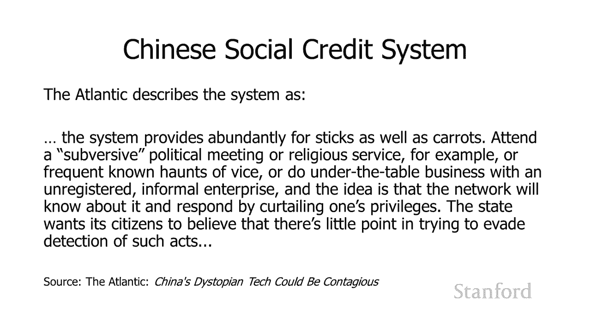

## 如何保护个人隐私？ 🛡️

与跟踪网站一起工作的主网站没问题，所以这听起来不太好。我们可以做些什么来保护我们的隐私？

上一课我们讨论了一些关于 VPN（虚拟专用网络）的内容，以及它们如何提供一些隐私。如果你想更进一步的话，有一种叫做 Tor 的东西。Tor 是一种特殊的路由系统，旨在让用户在互联网上保持匿名。你可以把它想象成一个具有更多保护的超级强大的 VPN，但它的速度要慢得多。Tor 实际上代表洋葱路由器，它指的是当用户访问 Tor 网络服务器时它使用的网络的多层性质。

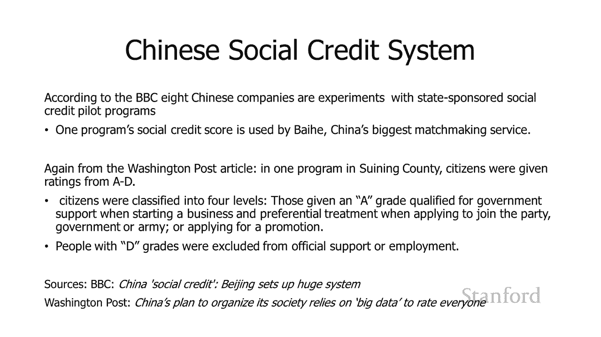

他们的信息被加密并通过一系列 Tor 服务器传递，网络中有 6,000 多台服务器。因此当您继续并通过 Tor 访问某些内容时，发生的情况是您将通过 Tor 网络获得一个特殊的序列，您的信息将从一台 Tor 服务器传递到另一台 Tor 服务器，然后再传递到另一台服务器。当信息返回时，它应该遵循与信息相同的路径。该路由信息仅适用于 10 分钟，如果您在 10 分钟后再次访问，您将获得不同序列的随机服务器。中间 Tor 服务器无法看到数据是什么，但最终是为了让您访问常规互联网服务器。在远端，信息将必须被解密，并且需要发现您请求的目的地。因此最后一个 Tor 服务器将能够对您设置的信息有所了解。因此，如果您希望您的信息完全隐藏在 Tor 服务器之外，您需要在仅使用 Tor 的基础上使用加密，这样您就可以使用 HTTPS 或安全电子邮件。请注意，通过使用 Tor 本身，你并没有完全加密你的数据。

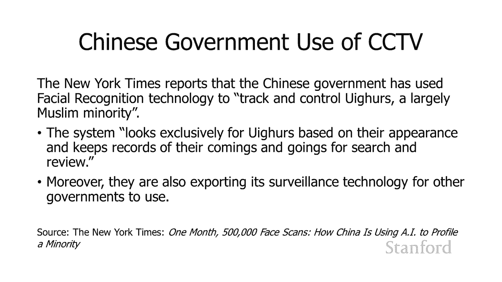

## 政府对数据的使用 🏛️

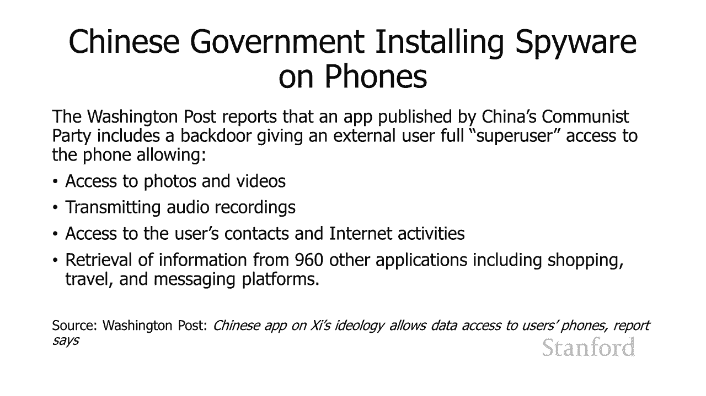

好吧，让我们谈谈政府对数据的使用以及政府对隐私的担忧。我经常在课堂上开玩笑的一件事是，我真的不在乎国家安全局是否可以阅读我的电子邮件。所以，你知道这里的基本思想是我确实想保护自己免受随机黑客的攻击，但是如果国家安全局想闯入我的帐户，我并没有声称国家安全局拥有如此良好的安全性，无法破坏我的东西并阅读我发送给我学生的电子邮件。所以请注意我发送给您的电子邮件以及您发送给我的电子邮件，我们应该对此担心吗？我是否应该担心美国政府？也许国家安全局实际上可以很好地闯入我的帐户，这是在线思考的一些事情。

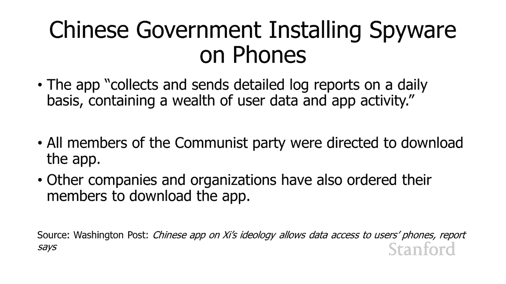

匿名可以保护毒贩和恐怖组织，并允许在线骚扰，很多人