# 计算机科学导论：L23.2：隐私与大数据：大数据 📊

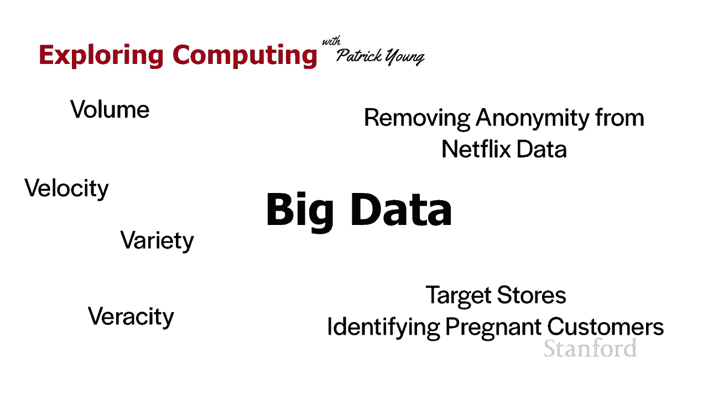

在本节课中，我们将要学习“大数据”这一核心概念。我们将了解大数据的定义、其关键特征（通常被称为“3V”），并通过实际案例探讨大数据技术如何被应用，以及它所带来的隐私挑战。

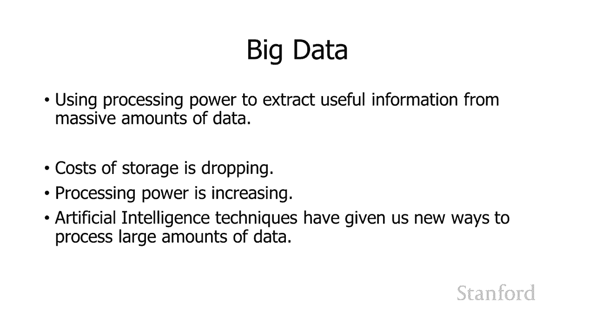

## 概述

大数据背后的基本思想是，我们可以利用不断增强的处理能力和不断降低的存储成本，从海量数据中提取有用的信息。随着处理能力的提高，我们能够收集越来越多的数据，并更轻松地处理它。人工智能领域的新技术，特别是机器学习，为我们提供了处理大数据的新方法。所以，大数据是指这种处理大量数据的能力。

## 大数据的“3V”特征

没有研究大数据的人有时会指大数据的“三个V”，这是描述其核心特征的常用框架。

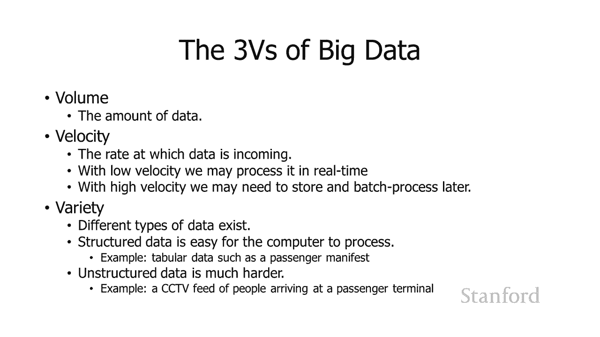

以下是“三个V”的具体内容：

*   **第一个V是信息量（Volume）**：指我们拥有多少数据。如果我们需要处理太多信息，我们将需要大型存储设施来存储该信息，然后在稍后的某个时间点对信息进行批处理。
*   **第二个V是速度（Velocity）**：指数据到达的速度。如果数据快速到达，我们通常可以实时处理它，因为这很紧迫。然而，如果数据没有那么快到达，我们则可以采用不同的处理策略。
*   **第三个V是多样性（Variety）**：指有多少不同类型的数据。我们是在处理结构化数据还是非结构化数据？一般来说，我们可以将数据分为两种类型：
    *   **结构化数据**：这是一种易于计算机处理的数据，例如信息表之类的内容（如过去的乘客清单列表）。计算机非常容易处理它，因为它已经是计算机可以理解的格式。
    *   **非结构化数据**：对于计算机来说更难处理，这可能类似于视频。例如，假设我们有一个人们到达和离开客运大楼的视频，显然需要花费大量的工作去处理它并从中获取一些有用的信息。

## 数据的真实性（第四个V？）

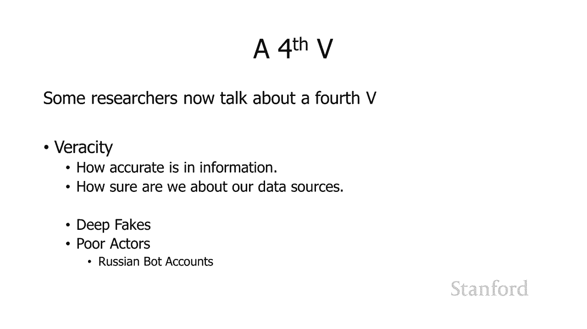

一些研究人员在先前三个V的基础上增加了第四个V，这就是**数据的真实性（Veracity）**。这指的是我们正在使用的信息有多准确，以及我们拥有数据源的确定性如何。不幸的是，我认为在我们当前的环境中考虑这一点很有意义。

我特别认为，像深度伪造和俄罗斯机器人账户这样的不良行为者在Twitter上散布信息，使得考虑我们的数据源在哪里，以及这些数据源可以告诉我们什么，现在变得越来越重要。实际上，使用大数据技术研究俄罗斯机器人帐户本身也可以为您提供一些信息，但您确实需要仔细考虑您的数据来源。

## 大数据的应用与隐私挑战

上一节我们介绍了大数据的特征，本节中我们来看看大数据的具体应用及其引发的隐私问题。大数据可以用来做的一件事是**消除匿名性**，即从被认为是匿名的数据中识别出个人身份。

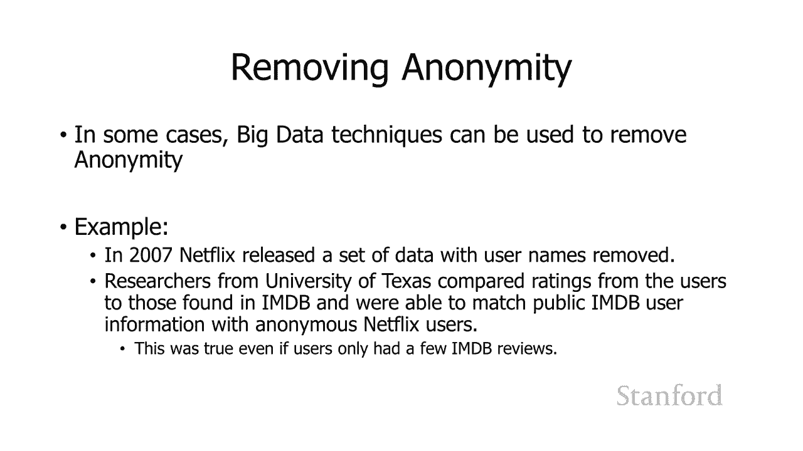

### 案例一：Netflix数据去匿名化

在一个示例中，Netflix发布了一组删除了用户名称的数据，并允许不同的数据研究人员使用那个数据并从中学习。结果是，德克萨斯大学奥斯汀分校的一个小组能够删除数据的匿名性。

他们所做的是，将Netflix提供的数据与不同人在其他平台（如IMDb）上观看或评分的数据进行比较。当时Netflix曾经能够让用户给电影评分。他们所做的是，将匿名数据中提供的评分，与各种用户在IMDb上提供的评分进行比较。即使有人在IMDb上只有几个评分，他们也能够将IMDb帐户与Netflix帐户相匹配，并在此基础上他们能够找出IMDb中哪些不同的用户实际观看了Netflix上的内容，即使那些IMDb用户没有打算在Netflix上公开他们的观看记录。

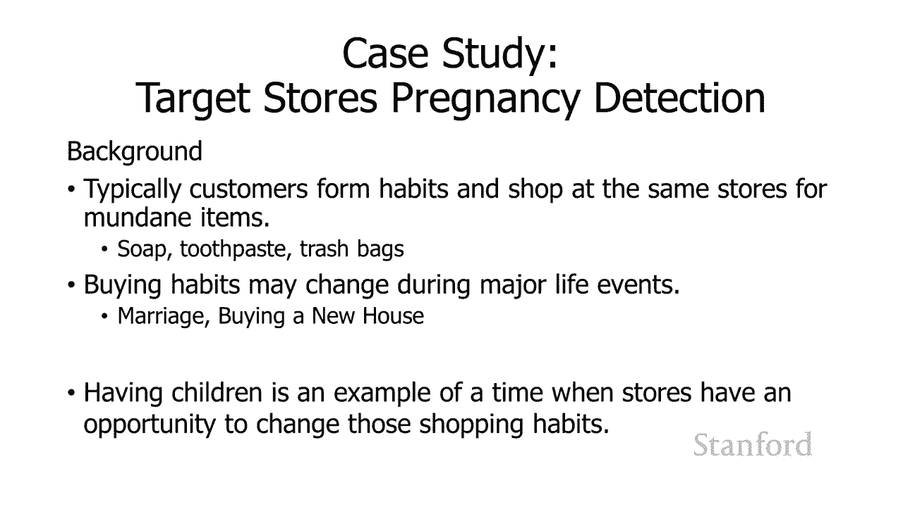

### 案例二：Target商店的怀孕预测

大数据的一个著名用途是Target商店的怀孕检测故事。这个故事来自《纽约时报》的一篇文章。

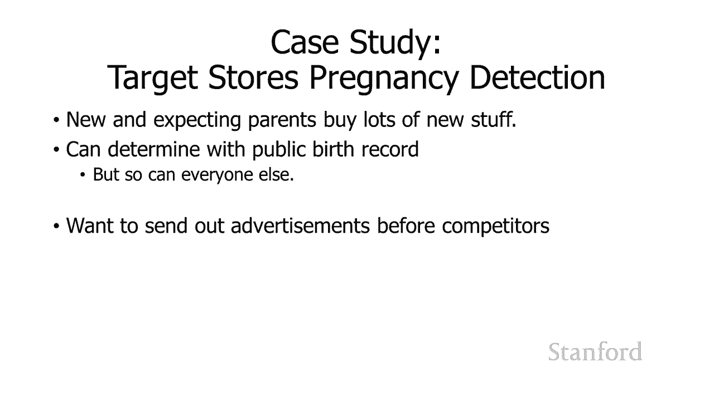

这个故事的背景通常基于加州大学洛杉矶分校的一些研究：客户会养成习惯并在同一家商店购买平凡的物品（如肥皂、牙膏、垃圾袋）。但是，那些购买习惯可能会在重大的生活事件中发生变化，例如结婚、购买新房子或生孩子。当有人生孩子时，这是一个很大的机会让商店介入并尝试改变不同人的购买习惯。此外，从商业角度看，怀孕的另一个好处是，新的准父母预期会购买很多东西。

然而，官方的公共出生记录每个人都可以访问。因此，如果您等待公共出生记录出来，您将在与其他竞争者用信息轰炸这些父母完全相同的时间投放广告。所以，Target想要一种方法来在他们的竞争对手之前发现人们怀孕。

为了做到这一点，Target实际上有一堆关键数据集真正帮助了他们：

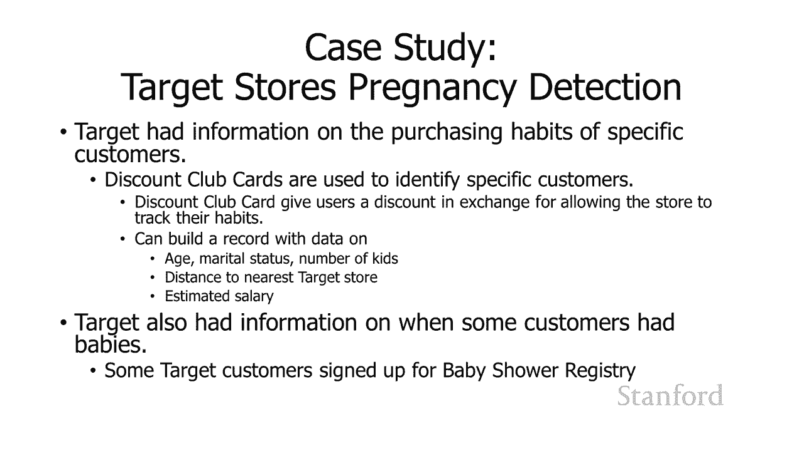

1.  **客户购买习惯数据**：如果客户有折扣卡，Target会了解一些客户的购买习惯。这些折扣卡用于跟踪您的信息，因此作为获得购买折扣的回报，商店将能够识别您的特定购买模式。此外，他们还有其他信息，例如可能知道您的年龄、婚姻状况、您拥有的孩子数量、您离最近的目标商店有多远，并估计了工资。
2.  **婴儿登记处数据**：Target拥有的第二个数据集是注册了Target婴儿洗澡登记处的人的信息。因此他们有一组关于购买习惯的信息，他们能够具体确定其中一些人何时怀孕，并对时间线有一些了解。

所以他们所做的是获取所有信息并使用大数据技术。他们能够发现孕妇在怀孕第二个三个月开始时，购买了大量无香味的乳液。她们在前20周购买了钙、镁和锌补充剂。她们还购买了无味肥皂和特大袋棉球。总共，Target能够识别25种不同的项目作为他们的怀孕指标。

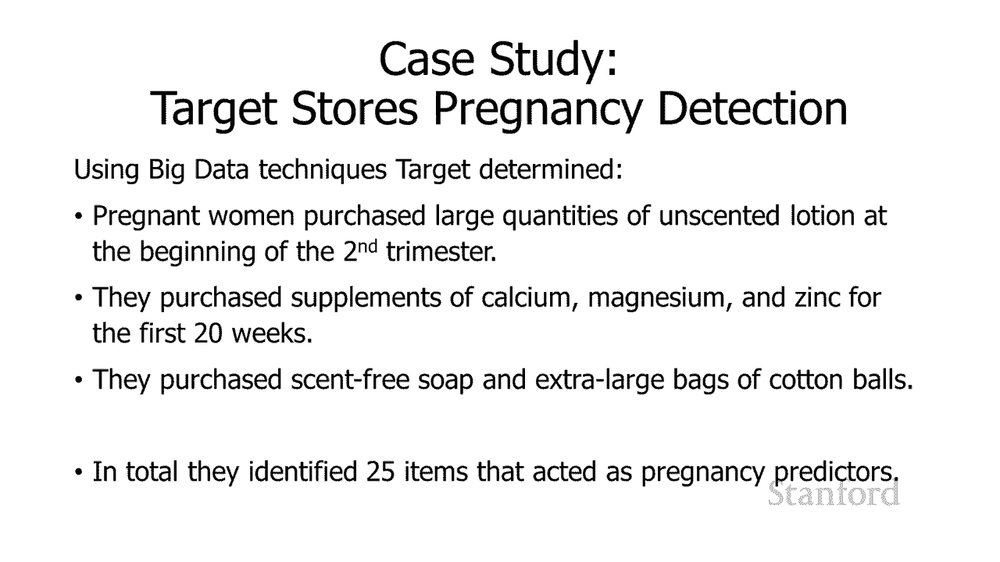

他们还学到了一个关于广告的教训：基本上他们了解到，如果你向人们发送装满婴儿用品的广告，他们会发现那种做法令人毛骨悚然。所以，他们决定最好混合广告。从文章中引用他们的话：“我们混合了所有这些广告，加入了一些我们知道孕妇永远不会购买的东西。所以婴儿广告看起来很随意。我们会在尿布旁边放一个割草机的广告。只要孕妇认为她没有被监视，她就会使用优惠券。”

### 一个有趣的轶事

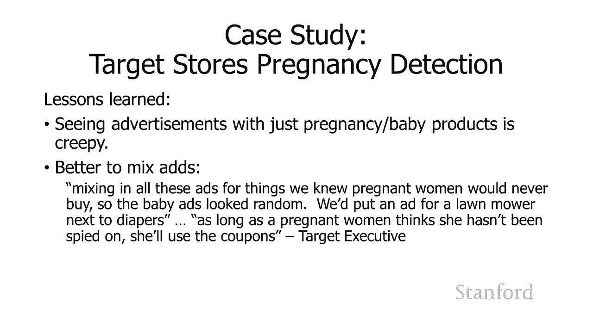

这个故事还有一个有趣的轶事：一个人走进明尼阿波利斯郊外的Target，要求见经理。据一位参与对话的员工说，他很生气。“我女儿在邮件中收到了这个，”他说，“她还在上高中，你要给她寄婴儿衣服和婴儿床的优惠券？你是想鼓励她怀孕吗？”经理不知道这个男人在说什么。他看了看邮件，果然是写给这个男人的女儿的，里面有孕妇装、育儿家具的广告和微笑婴儿的照片。经理道歉，然后几天后再次打电话道歉。这时父亲说：“我不得不和我女儿谈谈……我欠你一个道歉。”原来，他的女儿确实怀孕了，而Target的大数据预测比这位父亲更早知道了这件事。

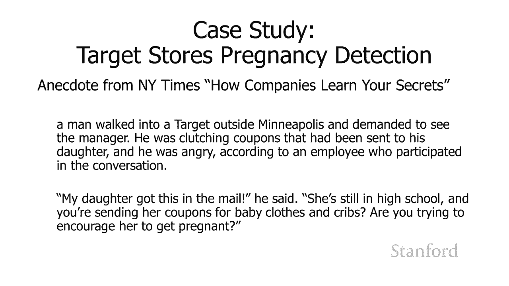

所以，这是另一个关于计算可以做什么的好故事。

## 总结

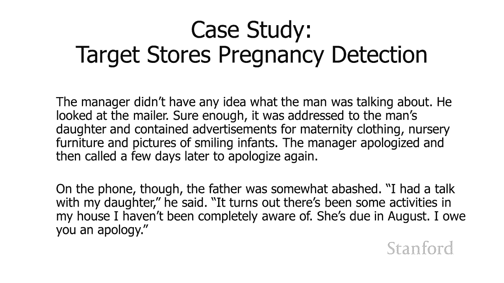

本节课中我们一起学习了“大数据”的概念。我们了解到，大数据是指利用强大计算能力处理海量、高速、多样（甚至可能真实性存疑）数据的技术。我们通过Netflix去匿名化和Target怀孕预测两个案例，看到了大数据强大的分析预测能力，同时也深刻认识到它对个人隐私构成的严峻挑战。这些技术能够在人们自己意识到之前揭示其敏感信息，这提醒我们需要在数据利用与隐私保护之间审慎权衡。