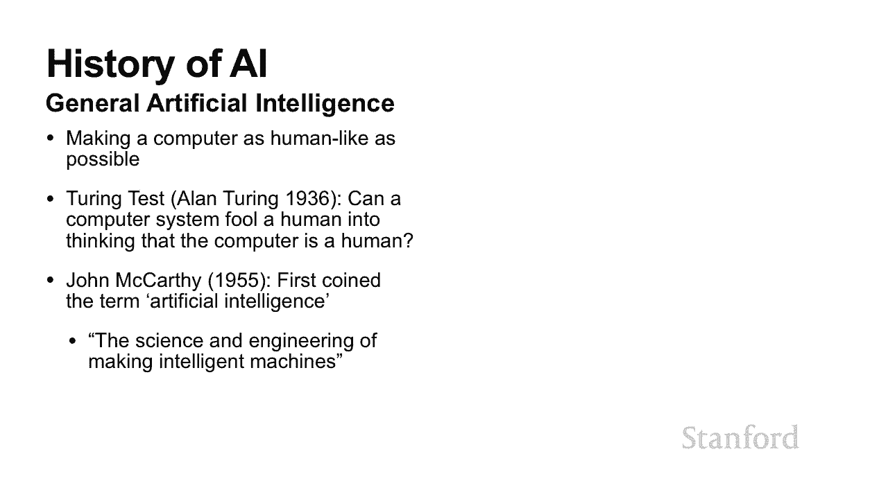
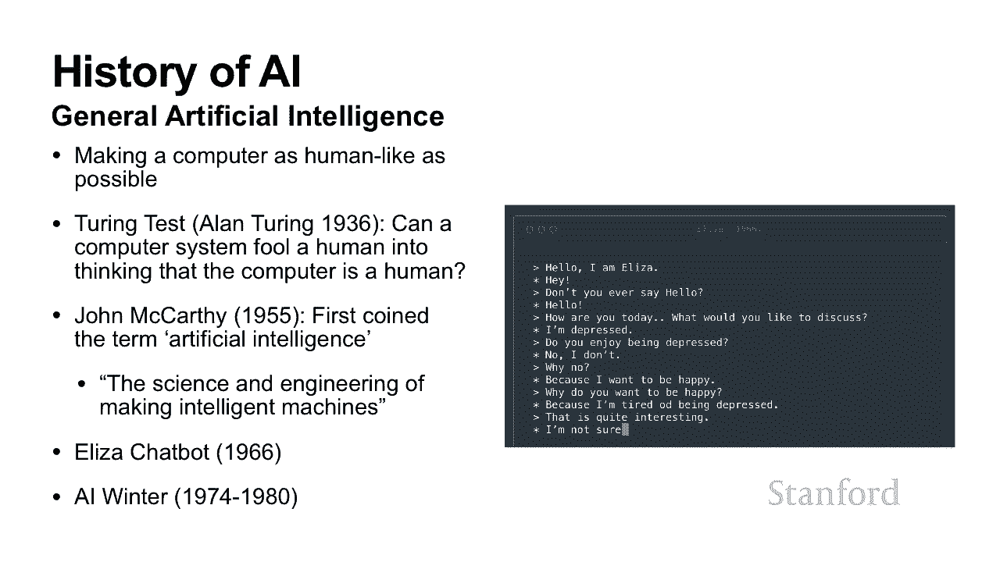

# 斯坦福CS105：计算机科学导论：L24.1：什么是人工智能 🤖

## 概述

在本节课中，我们将要学习人工智能的基本概念。我们将回顾人工智能的历史，探讨其定义，并了解推动其发展的关键因素。通过本课，你将能够理解人工智能在日常生活中的应用，并对其核心思想有一个初步的认识。

---

## 人工智能的历史与定义

上一节我们介绍了本课程的主题。本节中，我们来看看人工智能是什么以及它是如何被定义的。

### 人工智能的常见例子

以下是人们在日常生活中可能遇到的一些人工智能应用示例：

*   **自动驾驶汽车**：例如特斯拉的自动驾驶功能。
*   **游戏AI**：经过训练来玩游戏的程序，例如击败国际象棋世界冠军的Deep Blue。
*   **语音助手**：例如Siri、Google Assistant等能够理解和回应语音指令的系统。
*   **图像识别**：能够识别图片中物体或人物的系统。
*   **算法交易**：在股市中自动买卖股票的工具。
*   **推荐系统**：例如购物网站根据你的浏览和购买历史推荐商品。
*   **健康监测**：例如智能手表根据步数和心率等数据对你的活动进行分类。
*   **机器翻译**：例如谷歌翻译，将一种语言的文本转换为另一种语言。
*   **垃圾邮件过滤器**：自动将电子邮件分类为垃圾邮件或正常邮件。
*   **声音分离**：从包含多种声音的录音中分离出特定声源的技术。
*   **人脸识别**：例如社交媒体平台识别照片中的人物。

从以上例子可以看出，人工智能似乎涵盖了非常广泛的任务。那么，究竟什么是人工智能？

### 人工智能的定义

一个常见的定义是：**人工智能是让机器执行通常需要人类智能才能完成的任务**。

这个定义的优点是直观，涵盖了大多数例子。但它也存在缺点：过于宽泛。例如，计算器能执行`1 + 1`的运算，这也需要人类智能，但我们通常不认为计算器是人工智能。

另一个定义是：**人工智能是让机器执行没有明确编程指令的任务**。

这个定义引入了“没有明确编程”的概念，更贴近现代机器学习的思想。然而，这个定义也有些模糊，因为“明确编程”的界限并不清晰。所有程序最终都是由程序员编写的，区别在于指令的抽象层级。

虽然这两个定义都不完美，但它们帮助我们更好地理解人工智能的范畴。目前并没有一个唯一、完美的定义，因为人工智能领域本身在快速发展。

### 人工智能的演进：从AGI到ANI

早期的人工智能研究主要关注**通用人工智能**，即让计算机像人类一样思考和行动。**图灵测试**是衡量AGI的一个著名标准：如果一台机器能在对话中让人无法区分它是人还是机器，那么它就通过了测试。

然而，实现AGI极其困难。历史上曾出现过“人工智能冬天”，即因进展缓慢而导致的研究经费削减和兴趣衰退。

近年来，人工智能的复兴很大程度上得益于研究重点转向了**狭义人工智能**。ANI指的是在**特定任务**上达到或超越人类水平表现的AI系统，而不是追求全面的、人类般的智能。

这符合计算机科学的模块化思想。我们不再试图一次性构建一个完整的人类智能，而是将复杂能力分解为多个较小的、可管理的任务模块，并分别攻克它们。事实证明，这种方法非常成功。

---

## 推动现代人工智能发展的关键因素

上一节我们了解了人工智能定义的演变。本节中，我们来探讨是什么力量推动了现代人工智能，特别是机器学习的蓬勃发展。

现代人工智能的进步主要得益于三个方面的改进：**更强大的计算硬件**、**更先进的算法**和**更大量的数据**。

### 计算硬件与算法

我们训练AI模型，本质上是让机器从数据中学习模式。这个过程通常涉及大量的数学运算，特别是线性代数中的矩阵计算。

*   **更快的CPU和GPU**：图形处理器特别擅长并行处理这些运算，这大大加快了训练AI模型的迭代速度。
*   **更好的算法**：更高效的算法可以用更少的计算资源和数据达到更好的效果。

### 数据的重要性

然而，如果没有数据，再强的硬件和算法也无用武之地。数据是训练AI的“燃料”。

为了理解数据量的重要性，可以看一个简单的性能曲线图。假设模型的性能随训练数据量增加而提升：

*   一个简单的模型（如小型神经网络），其学习曲线可能较早达到平台期。
*   一个复杂的模型（如大型神经网络），拥有更强的学习能力，在数据量充足时，性能可以远超简单模型。

**关键点在于：拥有更好的算法和模型，只有在拥有足够数据来训练它们时，才能真正发挥优势。**

### 实例分析

以下是数据驱动成功的典型案例：

1.  **谷歌广告**：谷歌通过分析用户的海量搜索历史、邮件内容等数据，能够极其精准地预测用户兴趣并投放广告，这是其核心盈利模式。
2.  **特斯拉自动驾驶**：特斯拉相比其他公司的一大优势在于其庞大的真实车队数据。每一辆行驶在路上的特斯拉汽车都在收集数据，用于持续改进其自动驾驶算法。
3.  **政治广告定向**：类似Cambridge Analytica的公司，通过分析社交媒体数据来精准投放政治广告，影响选民。

这些例子都表明，**访问独特、大规模的数据集，是构建强大AI系统的关键竞争优势**。

---

## 总结

本节课中，我们一起学习了人工智能的基础知识。我们首先通过日常例子感受了AI的广泛应用，然后探讨了人工智能的定义及其历史演变——从追求通用人工智能转向专注于特定任务的狭义人工智能。最后，我们分析了推动现代AI发展的三大支柱：**计算硬件**、**算法**和**数据**，并理解了海量数据在训练高级AI模型中的决定性作用。

通过本课，你应该对“什么是人工智能”有了更清晰、更结构化的认识。