# L24.2：人工智能的子领域 🧠

## 概述

在本节课中，我们将要学习人工智能（AI）的各个子领域。我们经常听到机器学习、神经网络、深度学习等术语，但可能并不清楚它们的实际含义。本教程的目标是帮助你对这些常用的人工智能术语有一个大致的了解。

## 人工智能的广阔世界

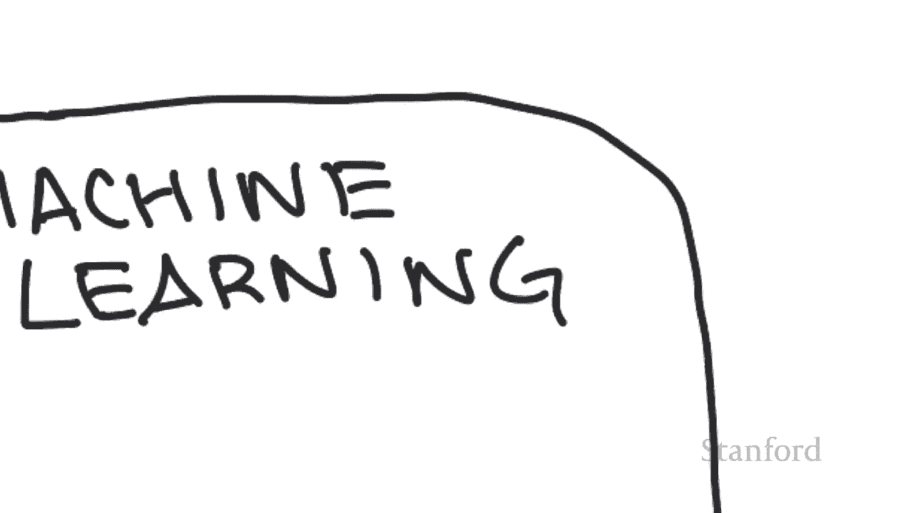

如果整个屏幕代表人工智能的整个世界，那么目前最大的子领域是**机器学习**。

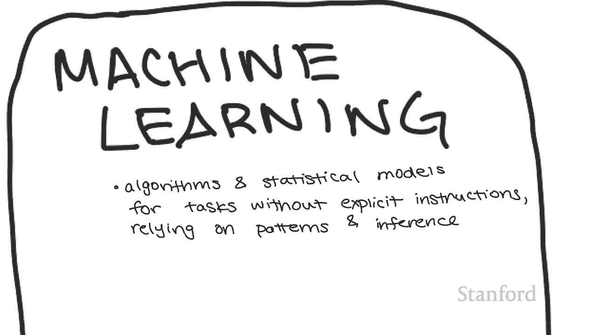

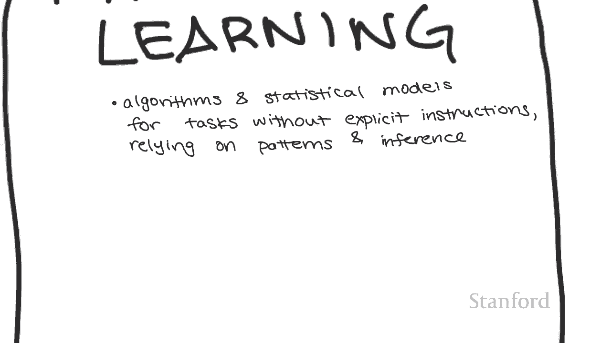

## 什么是机器学习？

机器学习可以理解为对计算机系统所用算法和统计模型的研究。这些系统能够有效执行任务，其特点在于**不使用依赖模式和推理的显式指令**来完成特定任务。

为了更好地理解，接下来我们进入机器学习的几个核心子领域。

## 机器学习的子领域

### 1. 监督学习

监督学习是指当我们拥有由**输入（x）** 和**预期输出（y）** 组成的训练数据来训练模型时。它之所以被称为“监督”，是因为我们知道正确答案是什么，所以我们在训练时告诉模型：如果给定输入 x，你应该输出 y。

请注意，输入 x 可以由多个特征组成，所以我们通常将 x 写为 **x₁, x₂, …, xₙ**。在这种情况下，有 n 个不同的输入，模型会给出一个特定的输出 y。

**一个例子是预测房价**：
*   输入（x）可能是：平方英尺、卧室数量、浴室数量。
*   输出（y）是：价格。
*   训练这个模型的数据就是这样一个表格，其中 x₁ 是平方英尺，x₂ 是卧室数量，x₃ 是浴室数量，y 是价格。

一旦模型使用所有数据进行训练，我们将能够根据新的输入（平方英尺、卧室数、浴室数）来预测该房产的价格。

在这个框架下，可以应用许多不同的算法。最广为人知的算法之一是**线性或逻辑回归**。你可以在某些数学或统计学课程中看到这种方法。

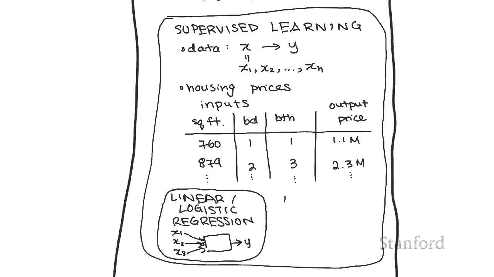

**基本思想是寻找最佳拟合线**。你有一堆数据点，试图拟合一条最合适的线。一旦得到这条线，你就可以插入新的数据点，找出它在线上的位置，从而进行预测。

我们可以用多种方式表示这个模型。一种方式是画一张图：我们有一堆输入 x₁, x₂, x₃，将它们全部传递到一个函数中，该函数代表由非线性函数组成的最佳拟合线，最后输出 y。

另一种方法是使用**神经网络**。

### 2. 神经网络

神经网络背后的想法是，我们不仅拥有一个函数，而是将多个函数链接在一起。我们称它们为神经网络的原因是，它借鉴了认知科学中关于神经元的想法。

如果你上过关于人脑的生物课，你就会知道它由一堆相互连接的神经元组成。一个神经元接收其他几个神经元的输出，并给出自己的输出。这里的图片就抓住了这个想法：它接受多个输入并给出一个输出。

因此，神经网络接收一些输入，并将它们传递给多个函数。图中的每一个方框都代表一个函数，每个函数可以接收所有可能的输入。我们可以进一步将更多的函数链接在一起。

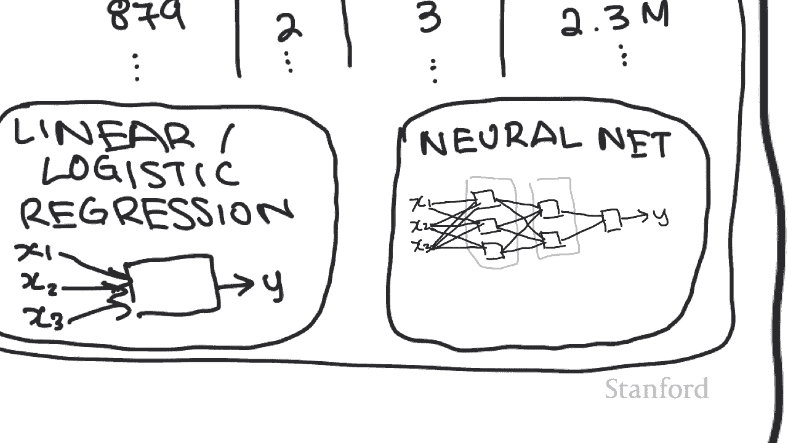

这些函数接收先前函数的输出。我们拥有的每一组函数称为一层，每一层内部都可以有任意数量的神经元，所以它是一个非常灵活的结构。

当然，事情可以变得更复杂。有一堆不同类型的神经网络，最常被提到的是**深度神经网络**。

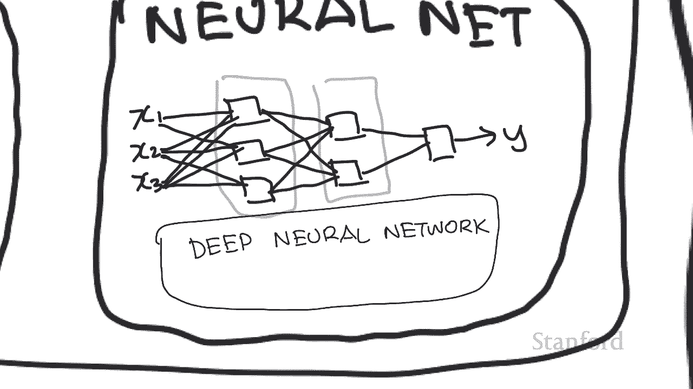

### 3. 深度学习

为了理解深度神经网络，它基本上就是一个拥有许多相互连接层的神经网络。

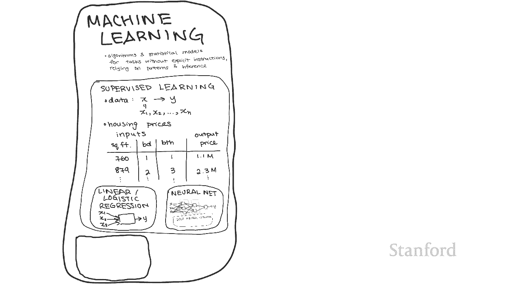

现在我们已经“深入”了解了神经网络（双关语），所以让我们回溯一点，看看机器学习的其他领域。

### 4. 无监督学习

在机器学习领域，我们有监督学习。与此相反，我们也有**无监督学习**。

回想一下，我们称监督学习为“监督”，是因为它接收的训练数据由输入 x 和预期输出 y 组成。在无监督学习中，我们将不再拥有预期输出 y。

无监督学习算法集对于当我们甚至不知道答案应该是什么时非常有用，我们只是试图找到所拥有数据中的内在趋势或结构。

因此，有许多不同的算法属于这一类别。一个可以解决的示例问题是**聚类**。

假设我们有一堆只有两个特征（x₁ 和 x₂）的数据点。每个点有不同的 x₁ 和 x₂，我们可以在这个图表上绘制它。虽然人类可以直观地看到有两个不同的组，但无监督学习算法允许计算机自动识别这些分组。

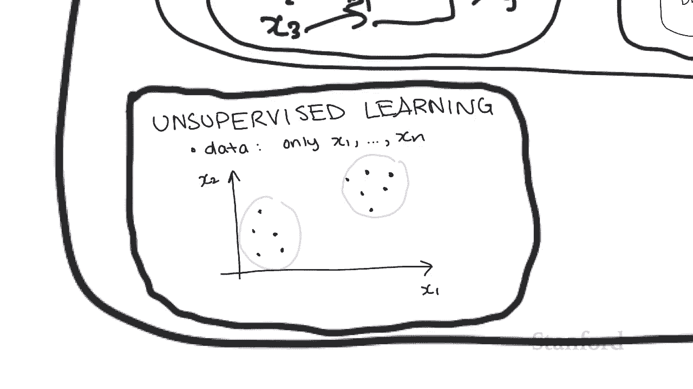

这对人类也非常有用，因为我们并不总是能够看到不同的数据组。注意，在这个例子中只有两个不同的输入（x₁ 和 x₂）。现在想象一下，如果有 17 个甚至数千个不同的可能输入，你如何将所有数据点组合在一起？无监督学习算法将能够非常有效地告诉我们。

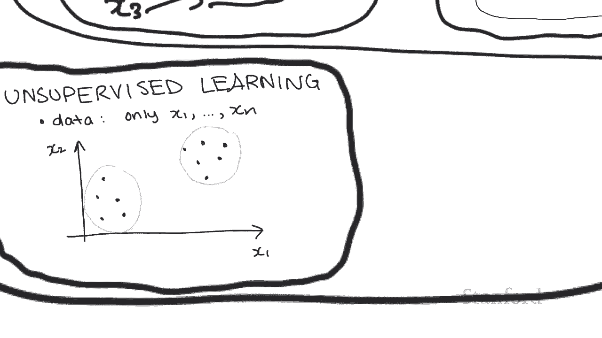

从应用的角度来看，像这样的技术可以用来找出消费者趋势，并更具体地针对人群定位广告。例如，在隐私和安全讲座中，我们看到一位女性成为怀孕相关广告的目标。最有可能发生的是，他们注意到她有特定的购物趋势。所以，像 x₁ 和 x₂ 这样的特征可能是她购买的不同类型的东西。算法把她放在一个主要由孕妇组成的小组里，所以他们才知道她有可能怀孕了，并开始给她推送怀孕广告。

### 5. 强化学习

除了监督学习和无监督学习，还有**强化学习**。

这与前两者有点不同，因为我们没有大量带标签的数据，我们可能根本没有任何初始数据。我们不是尝试从数据中学习一个模型，而是已经有一个预先存在的模型（环境），该模型定义了**代理可以在每个步骤中采取的不同行动**，以及与在特定状态下采取行动相关的**奖励**。

现在只需将其视为有“动作”和“奖励”。该模型的“奖励”方面正是“强化”发生的地方。算法的目标是**最大化它随着时间的推移可以获得的整体奖励**。

从一个实际应用观点来看，就是弄清楚当一个 Roomba（扫地机器人）在吸尘时应该如何穿过房间。

假设我们有一个在房间里的 Roomba，房间可以表示为一个网格。假设 Roomba 在这里，这里有垃圾，然后这里和这里也有。在这种情况下，模型将有一个与其中有垃圾的方格相关的**正奖励**，和一个在没有垃圾的方格中的**中性奖励**。我们还可以指定具有**负奖励**的网格空间来表示我们想要避免的区域（如障碍物）。

因此，强化学习算法的目标是找出 Roomba 应该走哪条路径，以便最大化它的奖励。在这种情况下，可能的动作是向上、下、左、右移动。

一个有效的路径是让 Roomba 向上移动，然后向右移动，然后向下，然后向右移动，收集所有垃圾碎片。但是，如果模型设置为使**更早获得的奖励更有价值**，那么也许最好的动作是让 Roomba 首先向上移动收集一个，然后向右移动，然后向下再向右移动。

我们还可以指定强化学习模型来考虑 Roomba 还剩下多少电量。假设 Roomba 只剩五步电量。在这种情况下，与其向上移动来收集一个奖励，不如让 Roomba 向下移动一、二、三步，然后向右移动两步，这样它会得到两个奖励，而不是只有一个奖励并且无法达到其他两个。

因此，一般而言，强化学习算法能够通过采取最佳行动来随着时间的推移最大化奖励量。

## 非机器学习的子领域

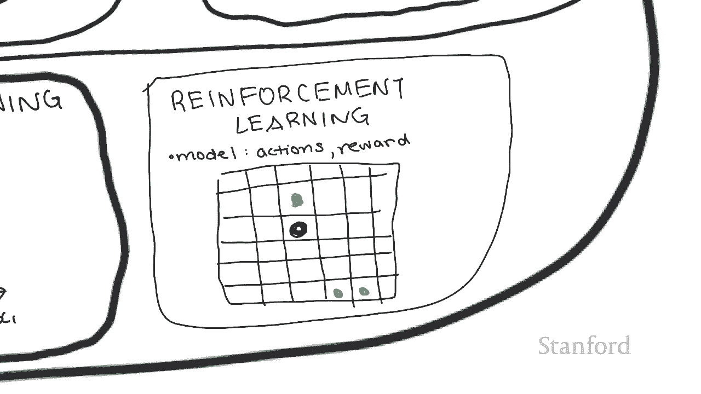

到目前为止，我们讨论过的所有示例和子领域都属于机器学习的范畴。

现在让我们看看一些**非机器学习**的人工智能子领域。这里变得有点复杂，因为有很多人工智能技术结合了机器学习与非机器学习技术。我要列出的所有内容很可能与机器学习有很大的重叠。

### 1. 人工语音

这包括**文本到语音**和**语音到文本**等技术。人工语音的目标是从音频翻译成文本，反之亦然。在这两种情况下，语音都侧重于“所说的话”，而不是其意义。

### 2. 自然语言处理

这通常被称为 **NLP**。它侧重于所讲单词背后的**含义**。因此，NLP 的示例包括：
*   **情感分析**：找出句子背后的情感。
*   **机器翻译**：在单词、句子甚至段落之间进行翻译。

请注意，有时人工语音和 NLP 之间的区别是模糊的。那是因为存在很多系统实际上同时使用两者。例如，当你告诉 Alexa “打开灯”时，它通过将你的语音转换为文本来使用语音识别，并使用一些 NLP（如意图识别）来弄清楚你实际上试图让 Alexa 做什么。

这两者不被严格视为“纯”机器学习的原因，是因为我们经常会**明确编程**这些系统的一些附加信息。这意味着我们违反了机器学习的“无显式指令”定义。我们可能会给 NLP 系统一个内置字典，或者在我们语言的语法结构中明确编程，以更好地帮助语音到文本的翻译。

但是，除了这些明确的指令之外，这些系统还经常使用额外的机器学习技术（例如深度神经网络）来完成其任务。顺便提一下，我们也将深度神经网络称为**深度学习**。所以，如果你听说过“深度学习”这个术语，它指的就是这个。

### 3. 规划、调度与优化

这个子领域与强化学习有很大的重叠，因为 Roomba 路径规划问题也属于规划、调度和优化，因为它试图找出最佳任务序列应该是什么。

另一个属于此类问题的任务示例是：如何在时间和教室资源限制的情况下最佳地安排课程表。

### 4. 计算机视觉

它接收视频和照片，并尝试确定这些媒体的主题是什么。这个领域和神经网络之间有巨大的重叠，但我们也添加了硬编码的东西，比如面部特征检测器等。

### 5. 专家系统

这些系统具有用于逻辑推论的硬编码规则。所以它包含一个**知识库**（一组已知为真的事实）和一个**推理引擎**。它使用推理引擎从已知事实中推导出新事实。

例如，如果我们已经知道“如果下雨，那么人们会使用雨伞”，并且我们也知道“正在下雨”，那么推理引擎可以用来推断“人们正在使用雨伞”。

### 6. 机器人学

也许这个领域与许多其他领域重叠，因为它太广泛了。例如：
*   我们有像 Roombas 这样的东西，它可以利用规划、调度和优化，以及强化学习和计算机视觉。
*   我们也有机器人，其主要任务是尝试模仿人类走路的方式，这是一个机器学习问题（我们试图弄清楚如何在走路时保持平衡）。
*   最后，我们也有自动化机器人之类的东西，所以这可能是一个关于如何以最佳方式自动化任务的人工智能问题，这可能属于优化类别。

## 总结

本节课中，我们一起学习了人工智能的各个子领域。最终，人工智能领域是非常跨学科的，所以人工智能的子领域也遵循这一趋势。这就是为什么我们今天看到的人工智能的各个子领域之间有如此多的重叠。

请注意，这些框图都不是按比例绘制的，真的没有办法测量每个子领域的大小，而且所有这些边缘都应该变得非常模糊，因为各个子领域之间有太多重叠。但我希望，通过走出这些框图，并在对每个子领域进行分类之间进行思考，我已经让你更好地了解这些子领域可能如何相互关联。

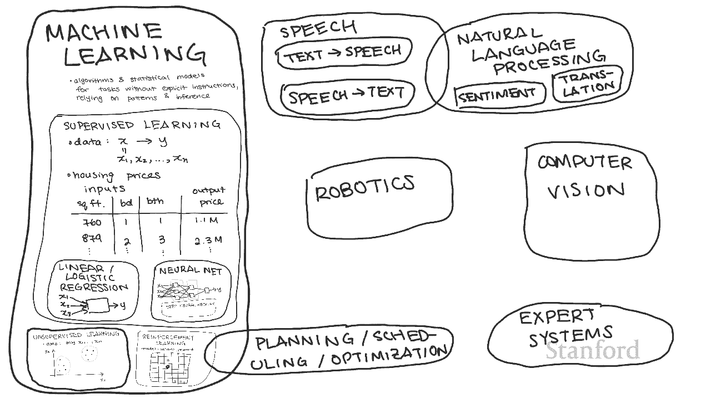

