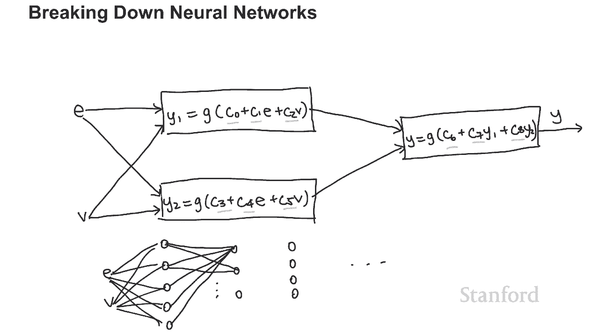
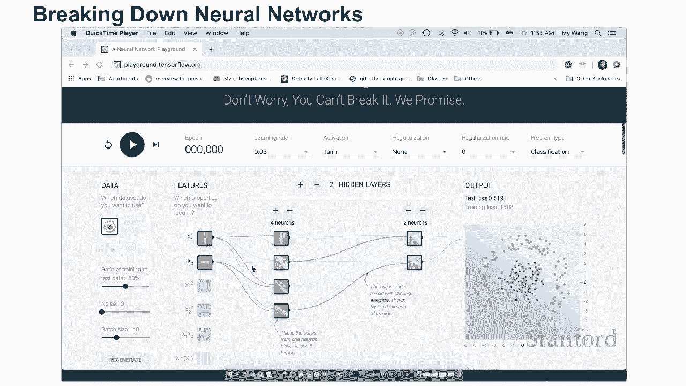
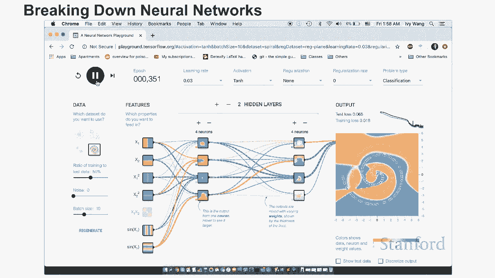

# L25：人工智能：它是如何完成的 🤖

在本节课中，我们将通过一个具体的例子来揭开人工智能（AI）的神秘面纱。我们将从构建一个垃圾邮件分类器开始，逐步深入到其背后的数学原理——逻辑回归，并最终将其推广到更强大的神经网络。我们的目标是让你理解AI是如何“实际完成”的，并了解AI工程师在其中扮演的角色。

## 垃圾邮件分类器示例 📧

上一节我们介绍了本课程的目标，本节中我们来看看一个具体的AI应用：垃圾邮件分类器。我们将以短信垃圾邮件分类为例。

分类器的目标是接收一条消息，并判断它是垃圾邮件（spam）还是正常邮件（ham，即非垃圾邮件）。为了训练这个AI，我们需要数据。

以下是训练数据的基本结构：
*   每个**训练样本**包含一条文本消息以及其正确的分类（spam或ham）。
*   例如，一条内容是“您的手机使用了11个月或更长时间……”的消息被标记为“spam”。
*   另一条内容是“我一直在寻找合适的词来感谢您的喘息……”的消息被标记为“ham”。

训练数据中需要有大量样本。对于这个相对简单的问题，我们使用了大约5000条已标记的消息。而对于更复杂的问题（如人脸识别），则需要数十万甚至数百万个训练样本。

我们可以将这个问题建模为：输入`x`是消息，输出`y`是分类（spam或ham）。接下来，我将展示一个已训练好的简单逻辑回归分类器的实际效果。

## 逻辑回归的工作原理 🧮

上一节我们看到了分类器的应用，本节中我们来看看其核心——逻辑回归是如何工作的。我们将通过一个更简单的例子来理解它。

假设你在一家汽车保险公司工作，需要根据驾驶员的经验年数（`e`）和事故数量（`a`）来预测其驾驶员得分（`y`）。得分正数表示好司机，负数表示坏司机。

我们拥有一些历史数据，每个数据点都对应一个`(e, a)`组合及其得分。将这些点画在图上，好司机（正分）和坏司机（负分）大致可以被一条直线分开。

**线性回归**的目标就是找到这条最佳分割线。一条直线的方程可以表示为：
`y = m*x + b`
在我们的例子中，有两个输入变量`e`和`a`，因此方程扩展为：
`y = c0 + c1*e + c2*a`
这里的`c0`， `c1`， `c2`就是我们需要寻找的常数（或称权重、参数）。

计算机通过以下方法找到这些常数：
1.  随机初始化`c0`， `c1`， `c2`的值。
2.  用这些值计算当前模型对所有训练数据的预测。
3.  评估预测结果的好坏（即与真实得分的差距）。
4.  根据评估结果，一点点地调整`c0`， `c1`， `c2`的值（例如，`c0`从200变为201）。
5.  重复步骤2-4，直到找到一组能很好拟合数据的常数。

例如，计算机可能最终找到`c0=0`， `c1=50`， `c2=-100`。那么模型就是：
`y = 0 + 50*e - 100*a`
我们可以用这个模型来预测新数据。例如，一个9年经验、2次事故的司机，得分`y = 50*9 - 100*2 = 250`（正分，好司机）。

这个模型可以推广到任意数量（`n`个）的输入变量`x1， x2， ...， xn`：
`y = c0 + c1*x1 + c2*x2 + ... + cn*xn`

**逻辑回归**在线性回归的基础上增加了一个`sigmoid`函数。sigmoid函数能将任何数值映射到0和1之间，其公式为：
`g(z) = 1 / (1 + e^{-z})`
其中`e`是自然常数（约2.718）。

因此，逻辑回归的预测公式是：
`y = g(c0 + c1*x1 + c2*x2 + ... + cn*xn)`
这个介于0和1之间的结果非常适合表示概率。例如，在垃圾邮件分类中，`y`可以表示一条消息是垃圾邮件的概率。

## 从逻辑回归到神经网络 🧠

上一节我们介绍了逻辑回归，它有时无法处理更复杂的数据模式。本节中我们来看看如何通过组合多个逻辑回归单元来构建更强大的模型——神经网络。

考虑一个新的司机评分问题，输入是经验年数（`e`）和车辆年龄（`v`）。我们希望有经验司机开新车得负分（维修贵），新司机开旧车也得负分（不安全）。数据点在图上形成两个分离的负分区，无法用一条直线完美分开。

单个逻辑回归单元（可视为一个“神经元”）的图示如下：输入`e`和`v`进入一个方框（执行`sigmoid(c0 + c1*e + c2*v)`计算），然后输出`y1`。

神经网络的思路是将多个这样的神经元连接起来。例如：
*   **第一层**：我们可以有三个神经元。每个神经元都接收`e`和`v`作为输入，但各自拥有独立的参数（`c0， c1， c2`； `c3， c4， c5`； `c6， c7， c8`），并产生三个不同的输出`y1`， `y2`， `y3`。
*   **第二层**：我们再设置一个神经元。它不直接接收`e`和`v`，而是接收第一层三个神经元的输出`y1`， `y2`， `y3`作为输入，并拥有自己的参数（`c9， c10， c11， c12`），最终输出预测结果`y`。

通过这种层级连接，模型获得了极大的灵活性，能够学习更复杂、非线性的数据边界。代价是需要调整的参数（`c0`到`c12`）更多，因此需要更多的数据和计算来训练。

神经网络的层数和每层的神经元数量可以自由设计，形成非常灵活的结构。例如，输入层 -> 5个神经元的第一层 -> 3个神经元的第二层 -> 输出层。

要直观感受神经网络的工作，强烈建议访问 **TensorFlow Playground** (`playground.tensorflow.org`)。你可以：
*   选择不同的数据集（如螺旋形数据）。
*   调整网络层数和神经元数量。
*   观察网络如何学习并形成决策边界。
*   理解当简单模型（如逻辑回归）失效时，更复杂的网络或添加更多特征（如`x1^2`， `sin(x1)`）如何帮助解决问题。

## AI工程师的角色 👨💻

上一节我们探讨了技术的核心，本节中我们来看看如何将这些技术应用于实际问题，以及AI工程师的角色。

回到我们的垃圾邮件分类器。在实现中，输入`x`通常是消息中单词的出现频率。例如，对于句子“goodnight room goodnight moon”，模型会为“goodnight”、“room”、“moon”等单词创建对应的特征`x1`， `x2`， `x3`...，并忽略单词的顺序和含义。

AI工程师的任务就是完善这个模型。他们需要考虑以下问题：

以下是AI工程师可能进行改进的一些方面：
*   **特征工程**：如何预处理和设计输入特征？例如，将同义词映射到同一特征，考虑单词组合（n-grams）而非单个单词，或者添加像“消息长度”、“是否包含数字”等新特征。
*   **数据**：收集的数据是否足够？数据是否真实反映了实际使用场景？（例如，用约会网站垃圾邮件训练的模型，可能不适用于推销短信）。
*   **模型选择**：是使用简单的逻辑回归，还是更复杂的神经网络或其他算法？
*   **调优**：如何设置模型参数？如何评估模型表现并迭代改进？

## 总结 📝

本节课中，我们一起学习了人工智能如何从概念走向实现。
1.  我们从一个具体的**垃圾邮件分类器**例子入手，理解了训练数据的重要性。
2.  我们深入剖析了**逻辑回归**的数学原理，明白了它如何通过调整权重来拟合数据，并用sigmoid函数输出概率。
3.  我们看到了单一模型的局限性，并通过连接多个逻辑单元引入了**神经网络**的概念，它通过增加模型的复杂度和灵活性来解决更困难的问题。
4.  最后，我们探讨了**AI工程师**的职责，他们通过特征工程、数据管理和模型选择与调优，将理论知识转化为有效的实际应用。

希望这节课帮助你揭开了AI的神秘面纱。AI并非魔法，而是建立在清晰的数学和工程原理之上的一套强大工具。