# L26.1：云计算 ☁️

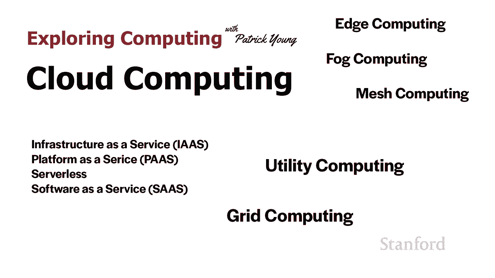

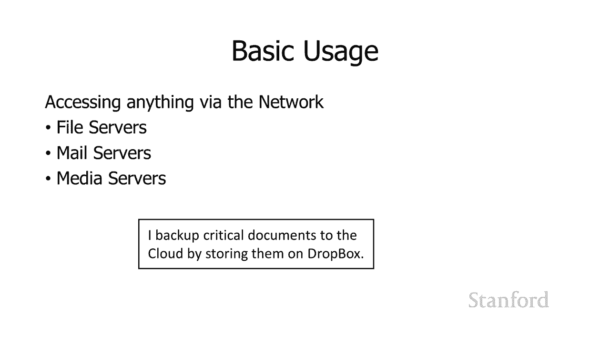

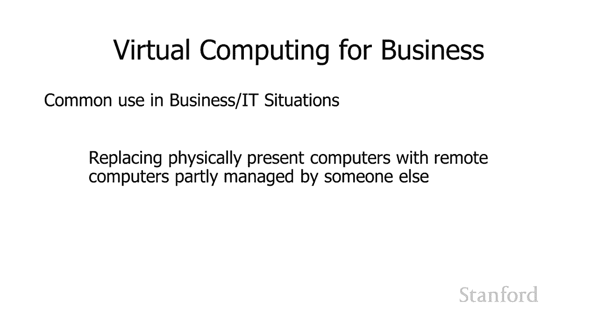

在本节课中，我们将要学习云计算的核心概念、不同模型及其与传统计算方式的区别。云计算是现代计算领域的重要基石，理解它有助于我们把握当今技术发展的脉络。

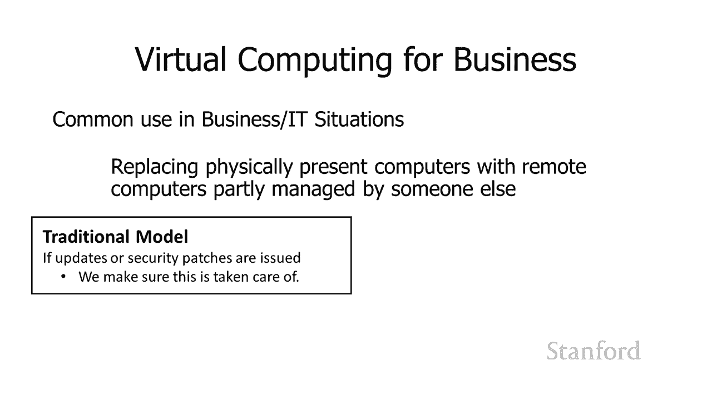

## 概述

术语“云计算”有多种用法，因此需要根据交谈对象和上下文来理解其具体含义。在其基本用途中，云计算可以指代网络上的任何内容，例如文件、服务器或媒体服务。然而，在商业和技术语境下，云计算通常意味着用远程管理的计算机资源替代本地物理服务器。

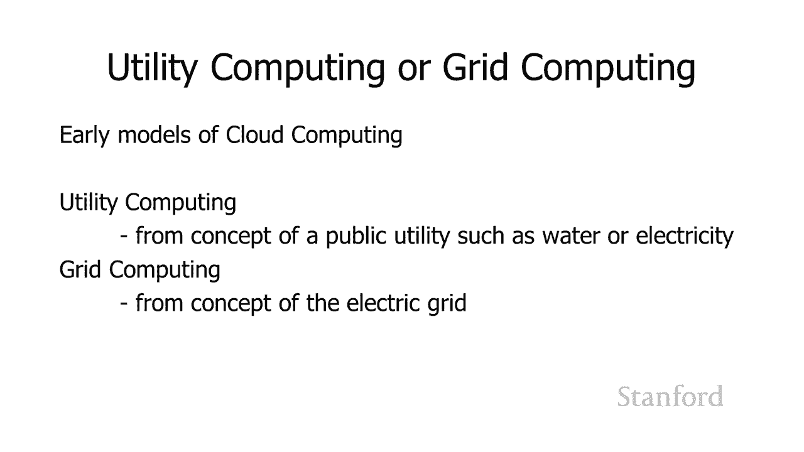

## 传统模型 vs. 云计算模型

上一节我们介绍了云计算的基本概念，本节中我们来看看它与传统计算模型的根本区别。

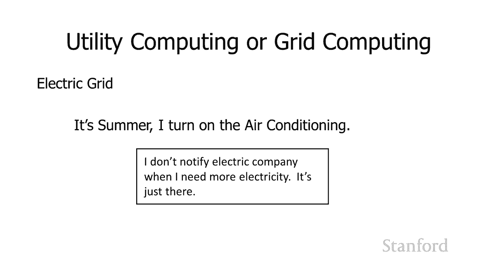

在传统计算模式下，企业需要在自有场所管理和存储计算机。这包括负责安全、供电、网络连接以及所有软硬件的维护和更新。如果需要更多计算能力，企业必须订购、接收并设置新的物理服务器。

云计算模型则旨在改变这一模式。它主要受到两种早期愿景的启发：效用计算和网格计算。

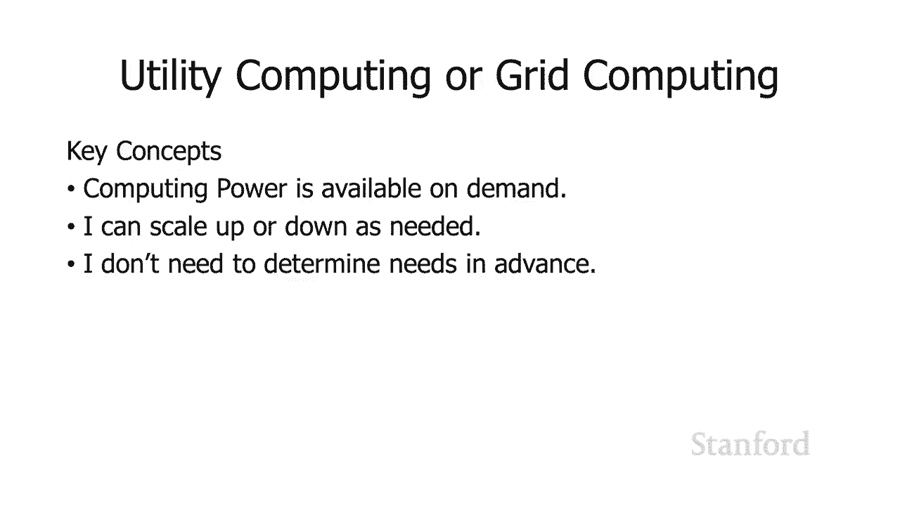

*   **效用计算**：类比于水电等公共事业。用户无需提前通知或购买发电机，只需“插入”即可按需使用计算资源，并按实际使用量付费。
*   **网格计算**：类比于电网。它强调计算能力应像电力一样成为一种广泛可用的商品，由外部服务商管理，用户可以随时按需伸缩。

这两种愿景的核心思想是相同的：**计算能力应成为一种按需提供、可弹性伸缩的实用资源**。

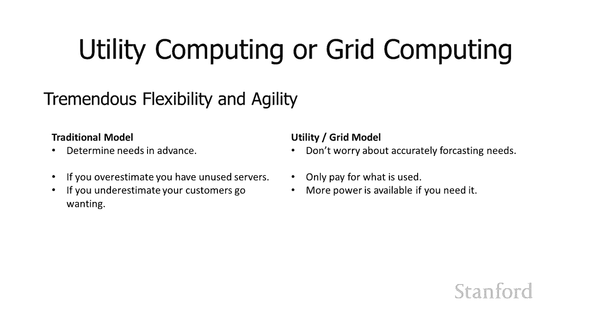

## 云计算的主要优势

与传统模型相比，云计算模型为企业带来了显著优势：

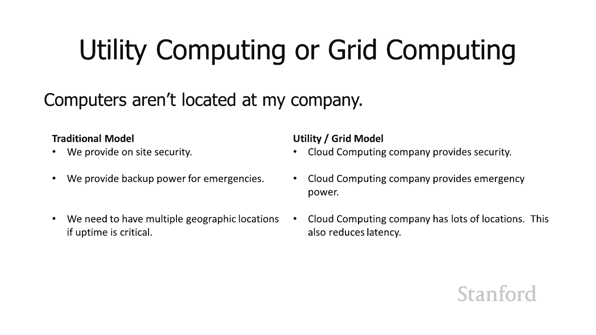

以下是云计算的核心优势列表：
*   **灵活性与敏捷性**：企业无需提前精确预测需求或经历漫长的采购部署周期，可以快速根据业务需求扩展或收缩资源。
*   **成本效益**：企业只为实际使用的资源付费，避免了资源闲置的浪费，也无需承担资源不足导致的业务损失。
*   **降低运维负担**：云服务提供商负责底层基础设施的安全性、电力可靠性、网络冗余和硬件维护，减轻了企业的IT运维压力。
*   **全球覆盖与低延迟**：大型云服务商在全球拥有多个数据中心，可以将服务部署在靠近用户的位置，从而降低访问延迟，提升用户体验。

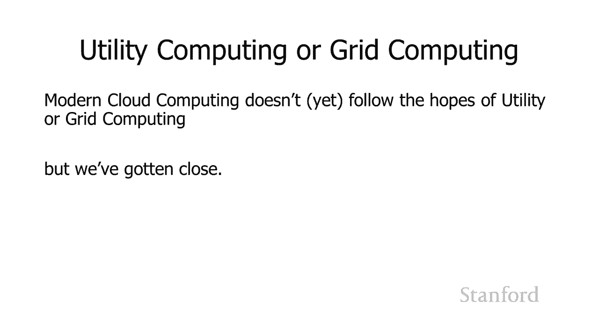

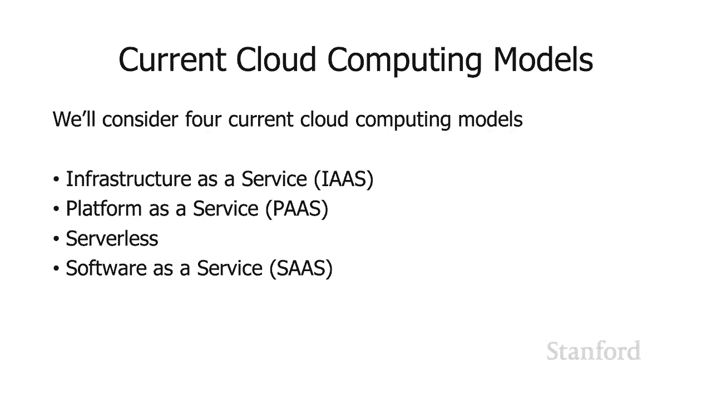

## 云计算的四种服务模型

随着技术发展，早期效用计算的愿景已接近实现，并演化出几种主流的服务模型。

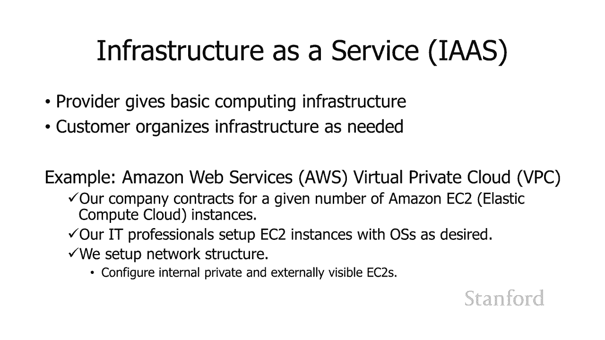

### 1. 基础设施即服务

**IaaS** 提供商提供基本的计算基础设施（如虚拟机、存储、网络）。客户需要自己配置操作系统、网络架构和应用软件。

**示例**：亚马逊AWS的EC2实例和虚拟私有云。
**工作方式**：客户在AWS管理控制台上创建和配置虚拟机实例，并自行建立这些实例之间的网络。客户拥有对操作系统的完全控制权，但也要负责其维护、更新和安全。

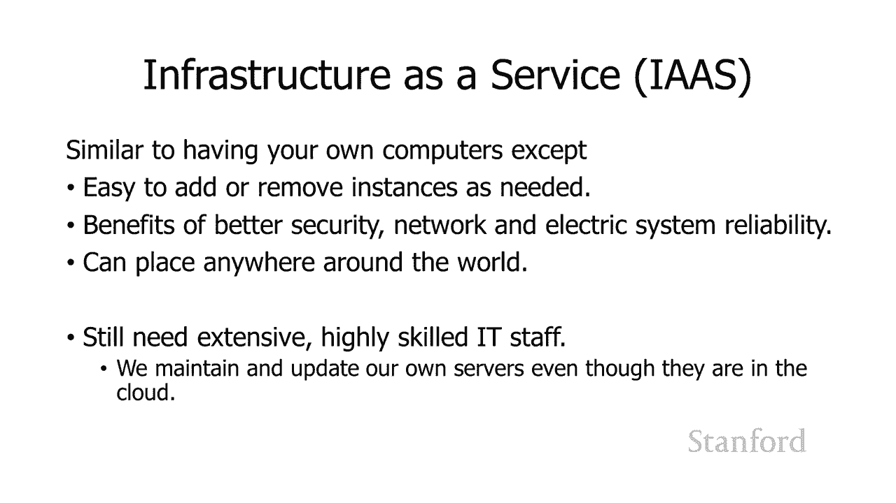

**优势**：它提供了类似本地服务器的完全控制权和灵活性，同时具备了云计算的弹性伸缩和免硬件维护的优点。

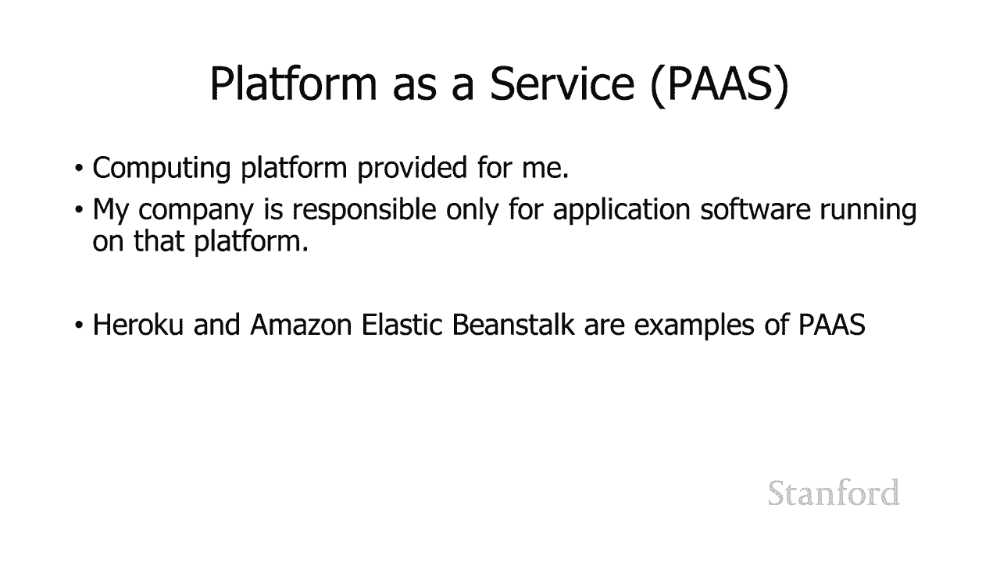

### 2. 平台即服务

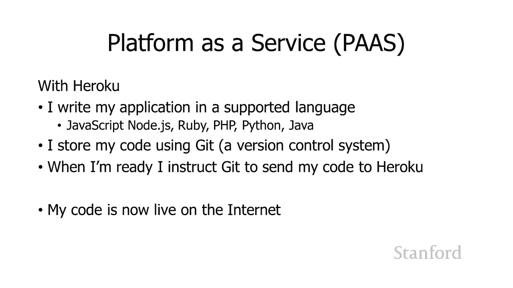

**PaaS** 提供商提供一个完整的计算平台（包括操作系统、运行时环境等）。客户只需专注于开发和部署自己的应用程序。

**示例**：Heroku， 亚马逊弹性Beanstalk。
**工作方式**：开发者使用Git等工具将应用程序代码推送到PaaS平台（如Heroku），平台会自动处理代码的部署、运行和扩展。开发者无需关心服务器、操作系统或网络的具体配置。

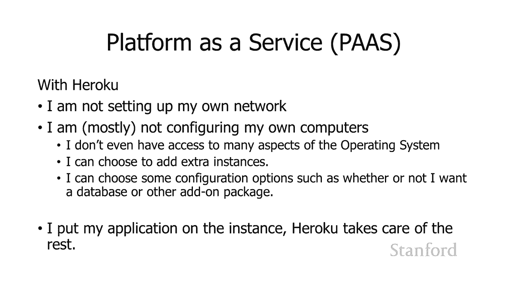

**优势**：极大简化了部署流程，让开发者能更专注于业务逻辑，减少了对底层基础设施的管理工作。

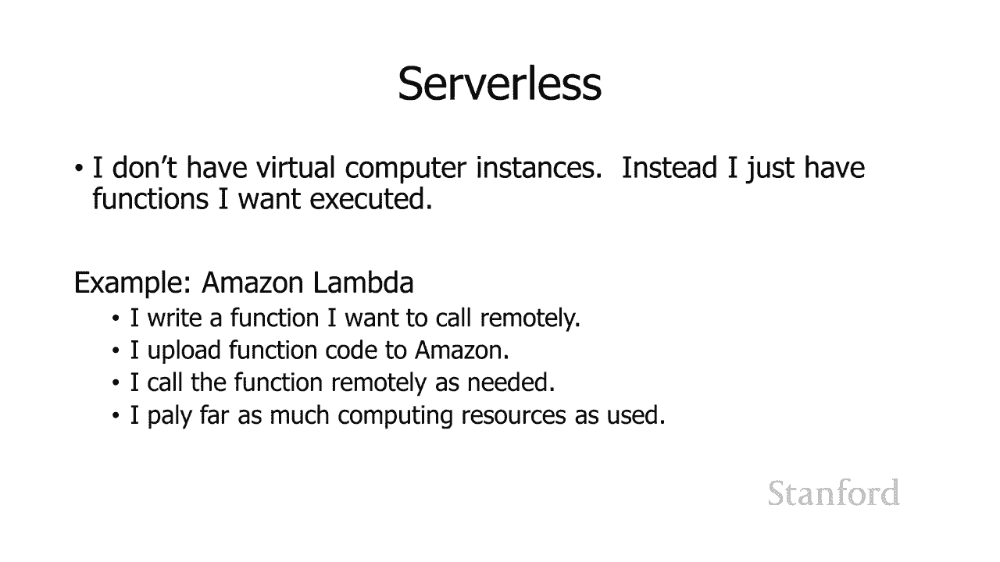

### 3. 无服务器计算

**无服务器计算** 更贴近效用计算的原始理念。开发者无需管理任何服务器实例，只需上传函数代码。

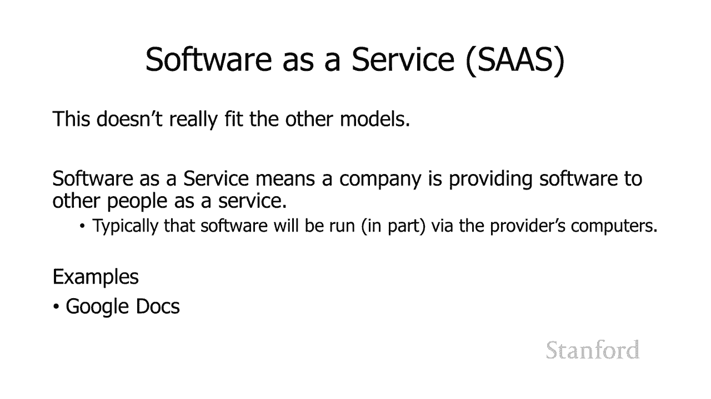

**示例**：AWS Lambda。
**工作方式**：开发者编写一个函数（例如，处理图像上传），并将其代码上传到云平台。当特定事件触发时（例如，新文件上传），云平台会自动运行该函数。开发者只需为函数执行所消耗的计算资源和时间付费。

**优势**：实现了极致的弹性伸缩和运维简化，真正做到按需付费，无需容量规划。

### 4. 软件即服务

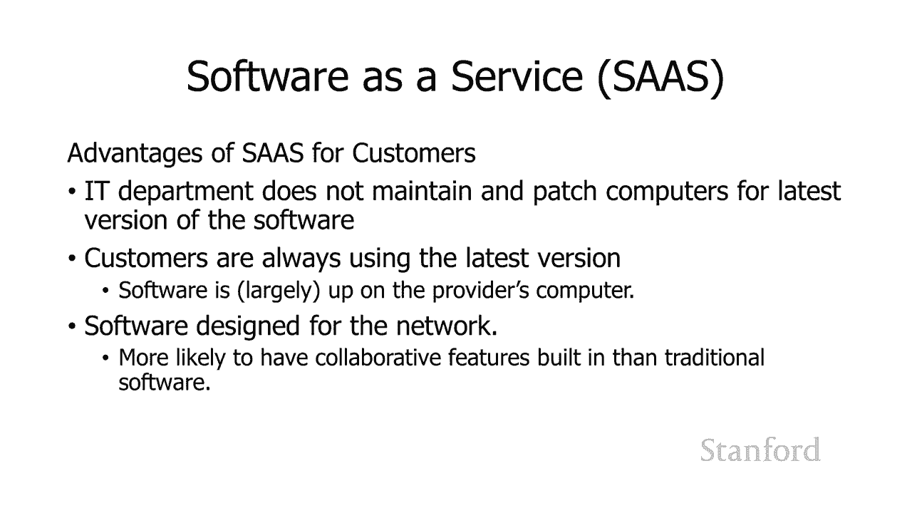

**SaaS** 与前三种模型不同，它直接向最终用户提供完整的软件应用。

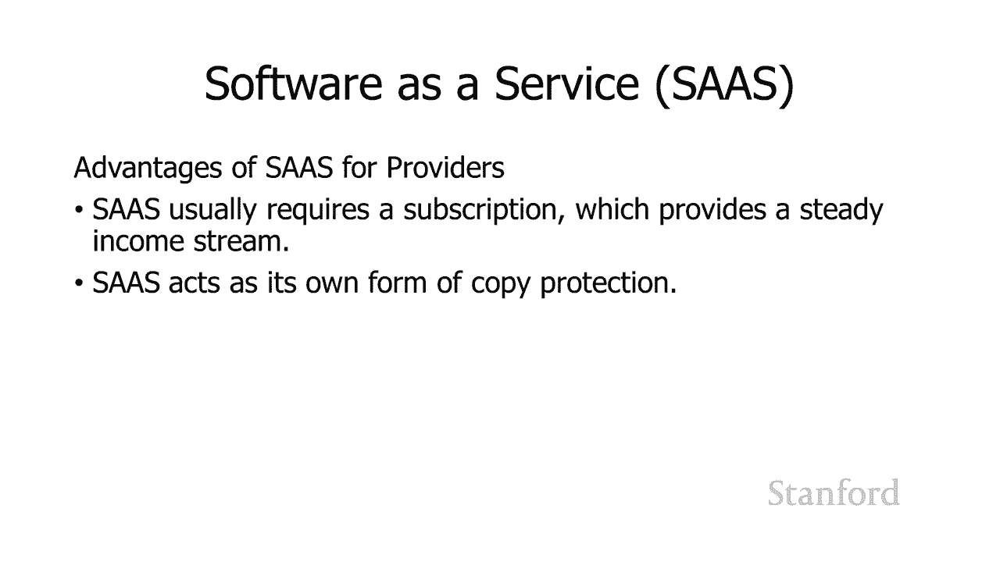

**示例**：Google Docs， Microsoft Office 365。
**工作方式**：用户通过浏览器或客户端访问提供商托管在云端的软件。所有软件运行、数据存储和维护工作都由提供商负责。

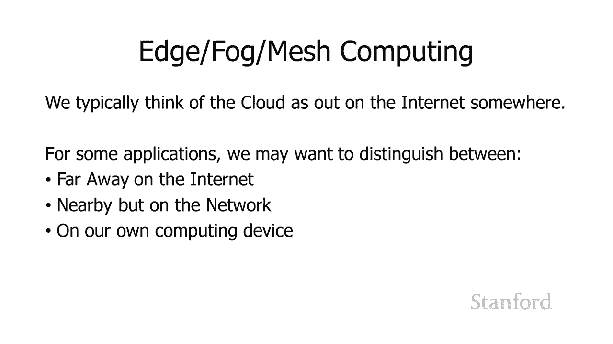

**优势**：
*   **对客户**：无需安装、更新或维护软件，IT部门负担轻；通常内置更好的协作功能。
*   **对提供商**：采用订阅制，拥有稳定收入流；软件在受控环境中运行，降低了盗版风险。

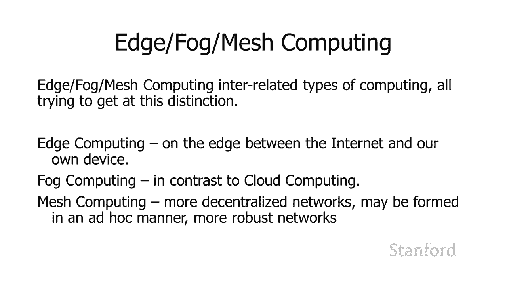

## 边缘计算、雾计算与网格计算

除了将计算集中在“云”端，还有一种趋势是将计算推向网络“边缘”。

*   **边缘/雾计算**：指在靠近数据源或用户的网络边缘处理数据，而不是全部传送到遥远的云端数据中心。这适用于带宽有限、延迟敏感或需要离线操作的场景（如海上钻井平台、太空任务）。
*   **网状计算**：专注于构建去中心化、自我修复的网络。在这种网络中，设备可以直接相互通信，即使部分节点失效，网络依然能运行，增强了鲁棒性，适用于军事或应急通信。

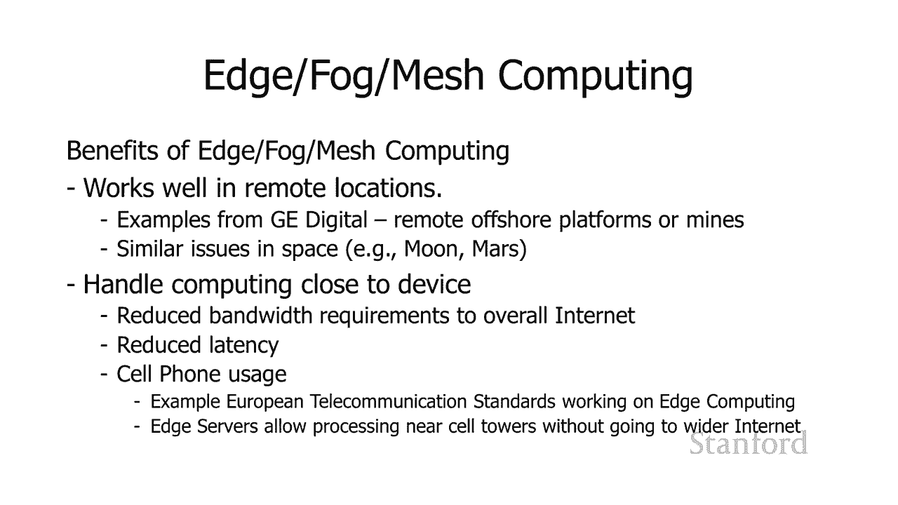

这些模型并非要取代云计算，而是与之协同，形成“云-边-端”协同的计算架构。

## 总结

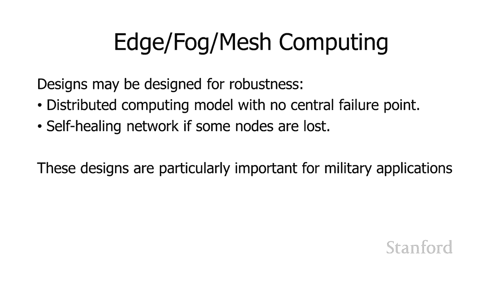

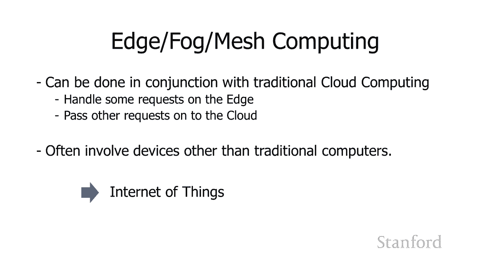

本节课中我们一起学习了云计算。我们首先明确了云计算在不同语境下的含义，然后对比了传统计算模型与云计算模型。接着，我们深入探讨了云计算的四大服务模型：**IaaS**、**PaaS**、**无服务器计算**和**SaaS**，了解了它们各自的特点和适用场景。最后，我们简要介绍了**边缘计算**、**雾计算**和**网格计算**的概念，它们代表了计算能力向网络边缘扩散的新趋势。理解这些模型，是把握现代计算基础设施的关键。