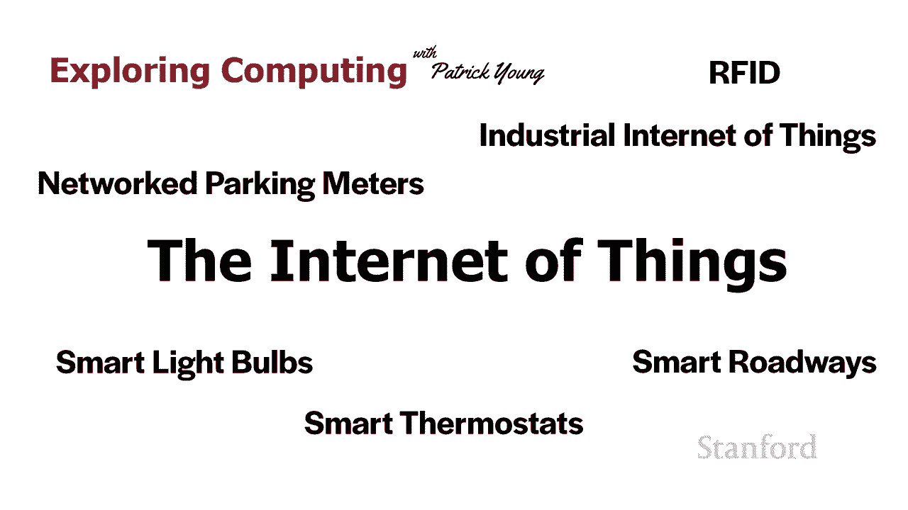
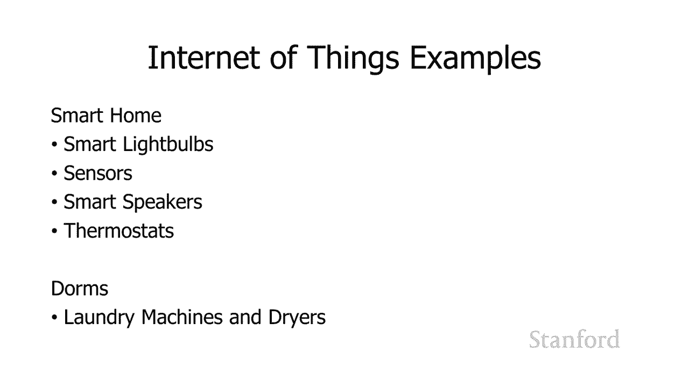
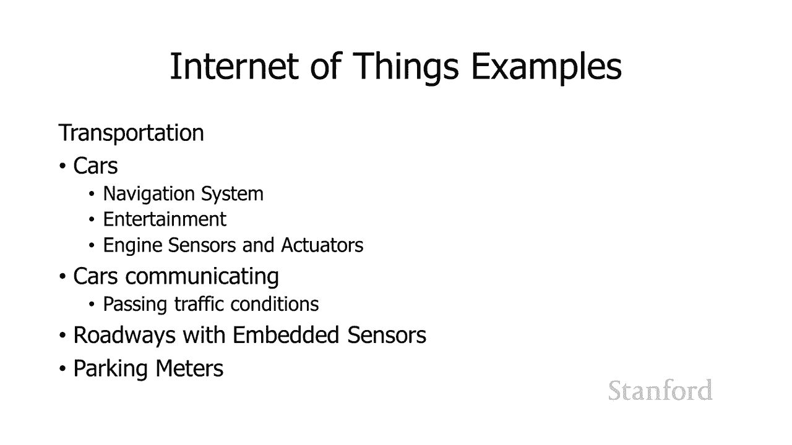
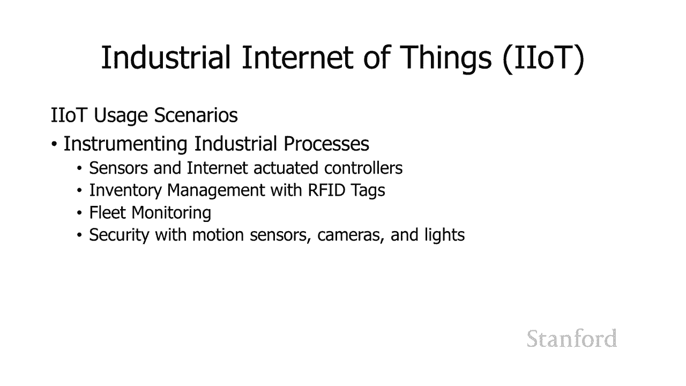
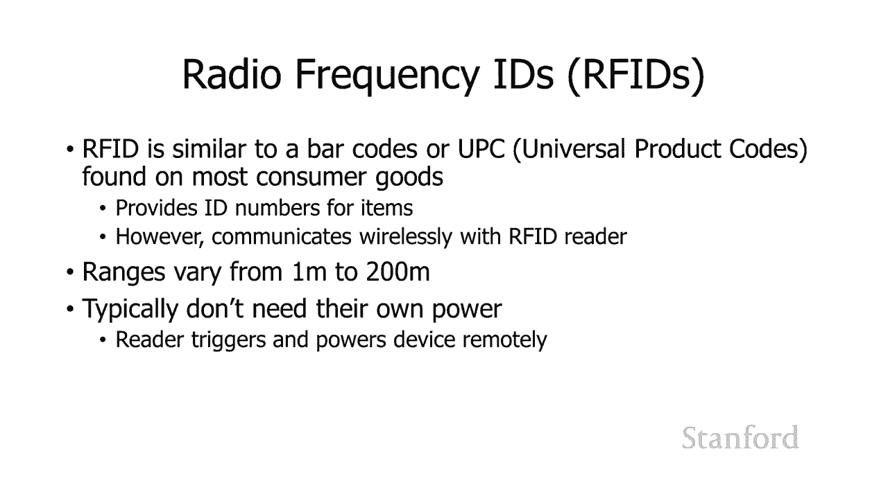
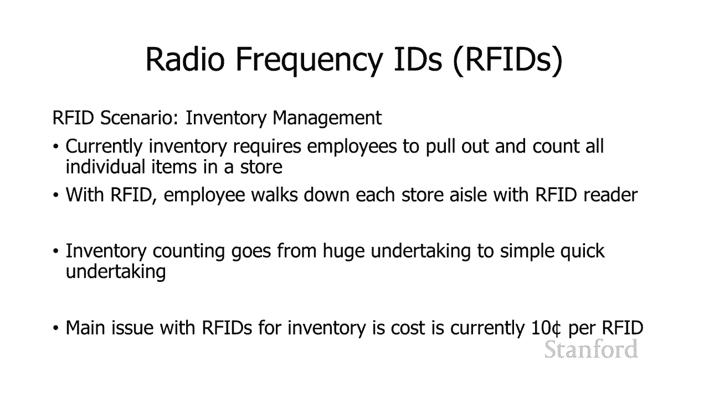
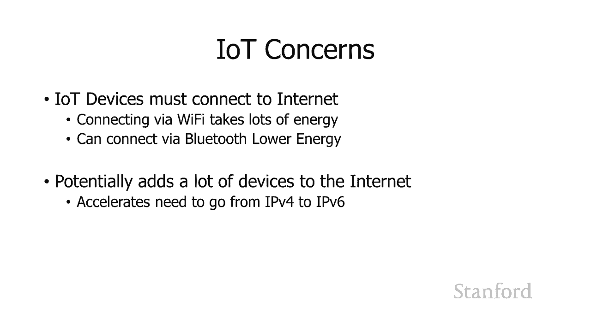
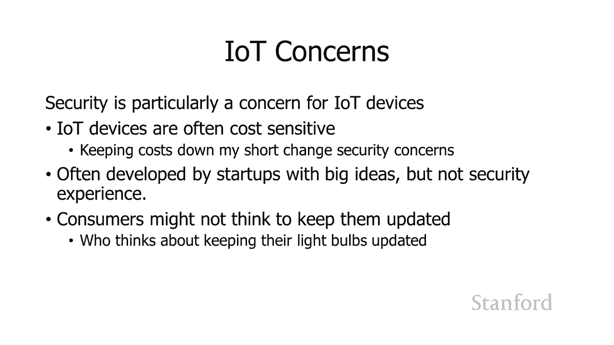
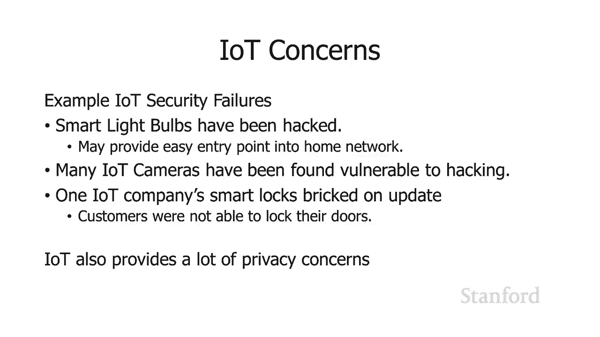

# 计算机科学导论：L26.2：物联网 🌐

在本节课中，我们将要学习物联网的概念。物联网指的是由各种非传统计算设备（如家用电器、传感器等）连接到互联网所形成的网络。我们将探讨物联网的应用实例、关键技术、潜在问题以及安全考量。

---

上一节我们介绍了物联网的基本概念，本节中我们来看看物联网设备的具体示例，以便更好地理解其应用范围。

以下是物联网设备的一些常见示例：

*   **智能家居设备**：例如智能灯泡，用户可以通过网络远程控制其开关、颜色和亮度。
*   **家用传感器与控制器**：如运动传感器、智能恒温器，它们可以联网收集数据并接受远程控制。
*   **联网家电**：例如连接到互联网的洗衣机和烘干机，用户可以通过网页或应用查看其使用状态和剩余时间。
*   **交通与车辆系统**：现代汽车的导航、娱乐系统，以及未来车与车之间的通信，都属于物联网范畴。
*   **智能城市设施**：例如联网的智能停车计时器，可以告知用户空闲车位并支持远程支付。

---

了解了物联网的广泛应用后，我们来看看其背后的一项关键技术：RFID。

**RFID** 是射频识别技术的缩写。它类似于条形码，能为每个物品提供唯一标识。其核心区别在于，RFID标签无需光学扫描，在一定距离内即可被RFID阅读器读取。RFID标签本身通常没有电源，由读取设备发出的射频信号激活。

RFID在**库存管理**等领域潜力巨大。员工只需手持阅读器走过货架，即可快速清点所有贴有RFID标签的商品，极大提升了效率。

---

在探讨了物联网的技术与应用后，我们需要关注其带来的挑战和问题。

以下是物联网面临的主要问题：

*   **连接与寻址**：大量设备接入互联网会加速**IPv4**地址的耗尽，推动向**IPv6**的过渡。IPv4地址格式如 `192.168.1.1`，而IPv6提供了远多于IPv4的地址数量。
*   **能耗**：许多物联网设备需要低功耗运行，因此常采用**蓝牙低能耗**等节能连接标准。
*   **安全风险**：制造商为降低成本可能牺牲安全性，且许多初创公司可能缺乏安全专业知识。设备固件若不及时更新，会留下漏洞。
*   **隐私担忧**：物联网设备收集的大量数据可能涉及用户隐私，需要谨慎对待。

---

物联网的安全问题值得深入探讨。设备被入侵可能导致严重后果。

以下是物联网设备安全漏洞的实例：

*   **智能灯泡被黑**：黑客通过入侵智能灯泡，可能以此为跳板进入家庭内部网络，访问其他更敏感的设备。
*   **物联网摄像头漏洞**：存在安全缺陷的家用监控摄像头可能被黑客控制，导致隐私泄露。
*   **智能锁故障**：有案例显示，智能锁在进行固件更新时“变砖”，导致用户无法锁门或进门。

一个安全建议是：将物联网设备放置在独立的**访客Wi-Fi网络**上，与主要个人设备隔离，以降低风险。

---

本节课中我们一起学习了物联网。我们了解了物联网是由各种日常设备连接互联网构成的网络，并看到了它在智能家居、工业、交通等领域的应用。我们介绍了RFID这项关键技术，也重点讨论了物联网在连接、安全与隐私方面面临的挑战。随着物联网设备越来越多，在享受便利的同时，也需对其安全性和数据隐私保持警惕。