# L27.1：理论：算法分析 🧮


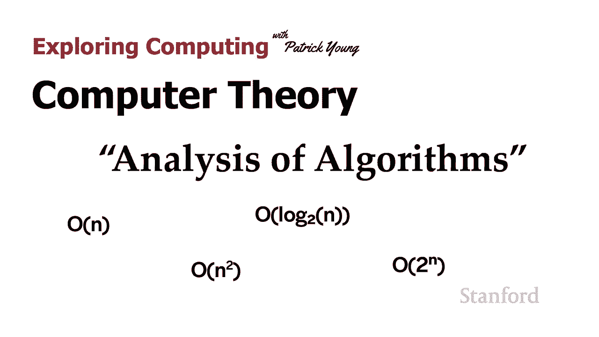

在本节课中，我们将要学习如何从理论角度分析和比较不同的算法。选择合适的算法，对于程序能否在合理时间内处理数据至关重要。我们将通过具体的搜索算法例子，理解算法效率的衡量方式。

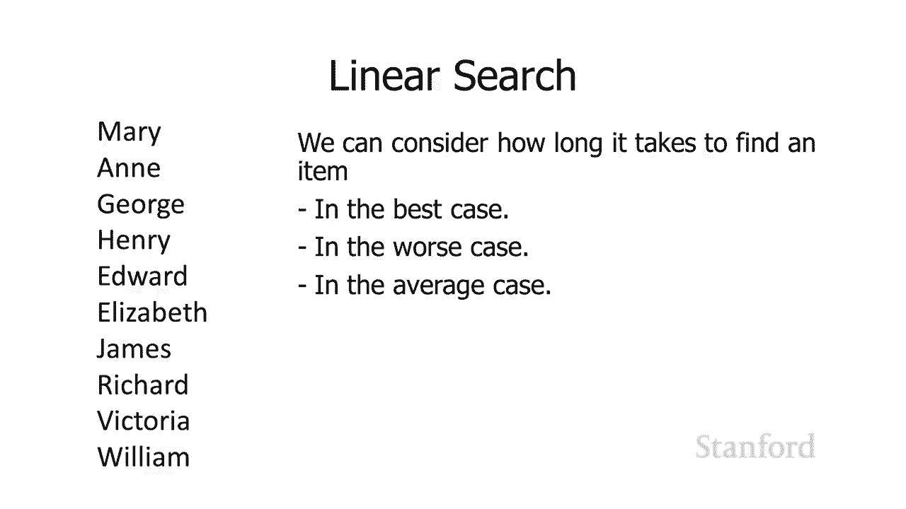

## 线性搜索 🔍

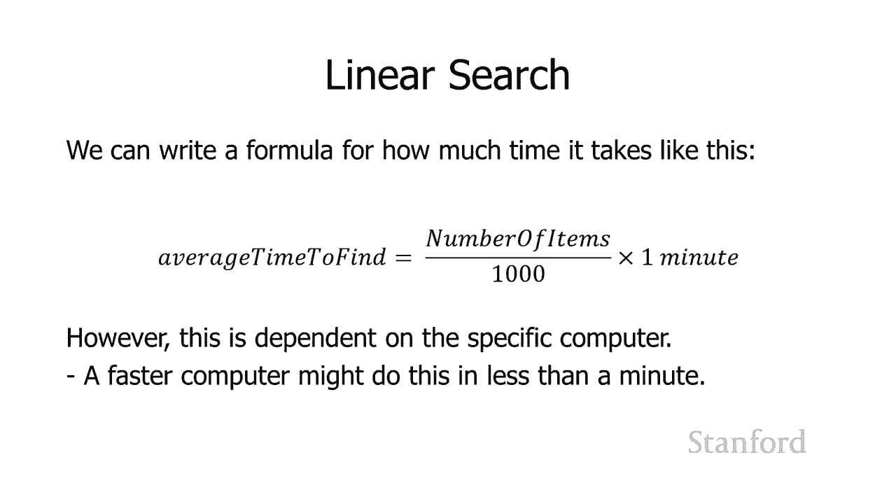

上一节我们介绍了算法分析的重要性，本节中我们来看看最简单的搜索方法：线性搜索。

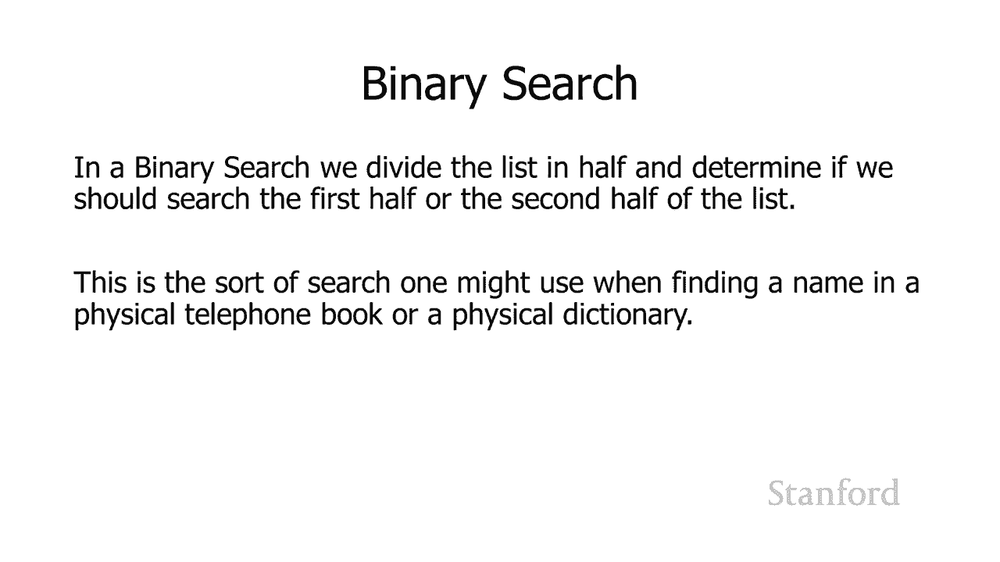

线性搜索从列表的第一个项目开始，逐个比较每个项目，直到找到目标或遍历完整个列表。例如，在一个英国君主列表中寻找“Henry”，我们会从“Mary”开始，依次与“Anne”、“George”等比较，直到找到“Henry”。

线性搜索的运行时间高度依赖于目标在列表中的位置。以下是三种典型情况：
*   **最佳情况**：目标项目位于列表开头，例如寻找“Mary”，只需一次比较。
*   **最坏情况**：目标项目不在列表中，例如寻找“Melanie”，需要比较列表中的所有项目。
*   **平均情况**：目标项目位于列表中间某个位置，平均需要比较约一半的项目。

当列表项目数量 `n` 增加时，线性搜索所需的时间也会线性增加。我们可以用一个通用公式来描述其平均时间：`T = c * n`，其中 `c` 是一个由计算机速度决定的常数。

## 二分搜索 ⚖️

上一节我们介绍了线性搜索，本节中我们来看看一种更快的搜索方法：二分搜索。但二分搜索要求列表中的项目是**有序**的。

二分搜索通过反复将有序列表对半分割来快速定位目标。其过程类似于在电话簿中查找名字：先翻到中间，判断目标名字在前半部分还是后半部分，然后对包含目标的那一半重复此过程，直到找到目标。

例如，在一个按字母顺序排列的君主列表中寻找“Edward”。首先，我们找到列表中间的项目“Henry”，由于“Edward”在字母顺序上位于“Henry”之前，我们丢弃后半部分。接着，在前半部分的中间找到“Elizabeth”，再次比较后，最终在剩余部分找到“Edward”。

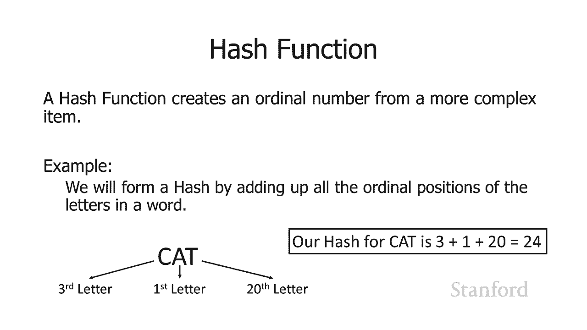

二分搜索的效率远高于线性搜索，因为它每次比较都能排除一半的候选项目。其运行时间与列表大小的对数成正比。平均时间公式可以表示为：`T = c * log₂(n)`。这意味着，当数据量 `n` 翻倍时，所需时间仅增加一个常数，而非翻倍。

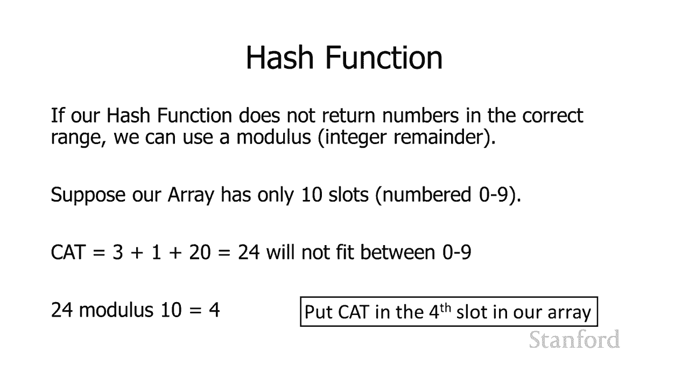

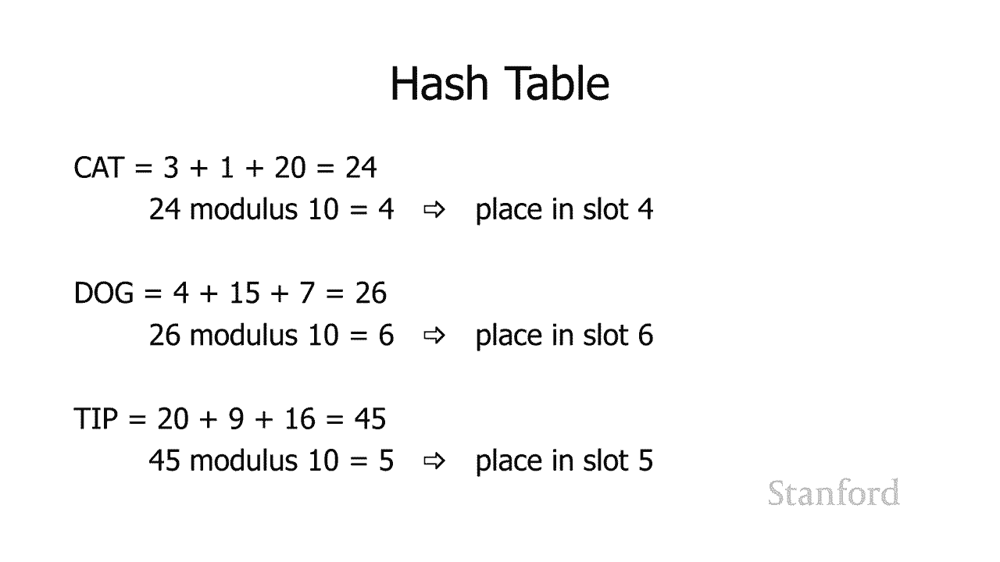

## 哈希表 🪄

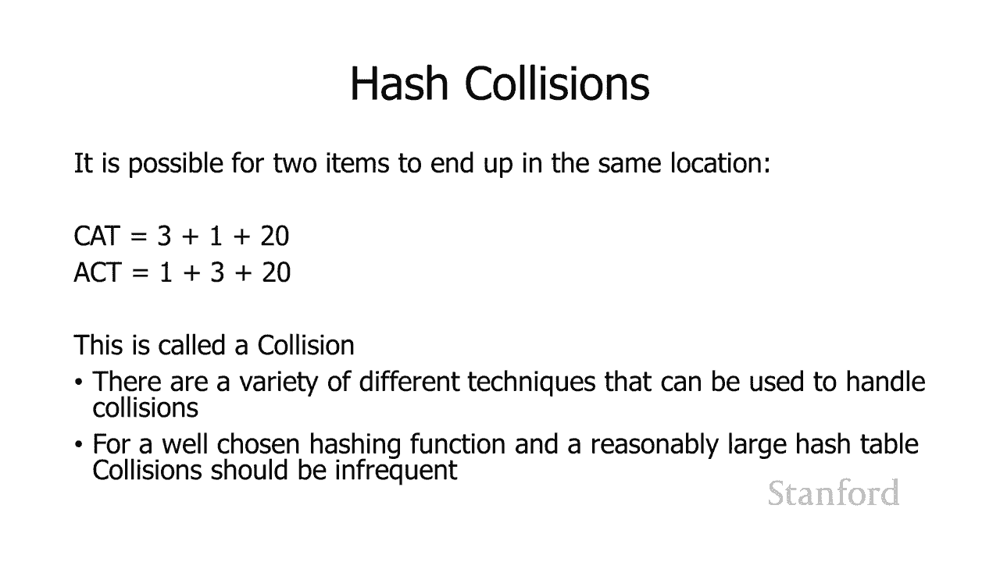

上一节我们介绍了基于比较的搜索算法，本节中我们来看看一种近乎“魔术”般高效的查找方法：哈希表。哈希表能提供接近即时的访问速度，无论数据量多大。

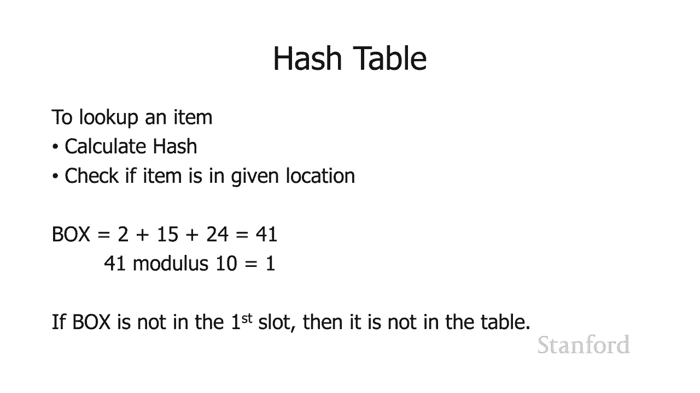

哈希表的核心思想是使用一个**哈希函数**，将复杂的数据项（如单词）转换成一个数字（哈希值），这个数字直接对应数组（哈希表）中的一个索引位置。存储时，将数据项放入该索引位置；查找时，用同样的哈希函数计算目标项的索引，然后直接访问该位置即可。

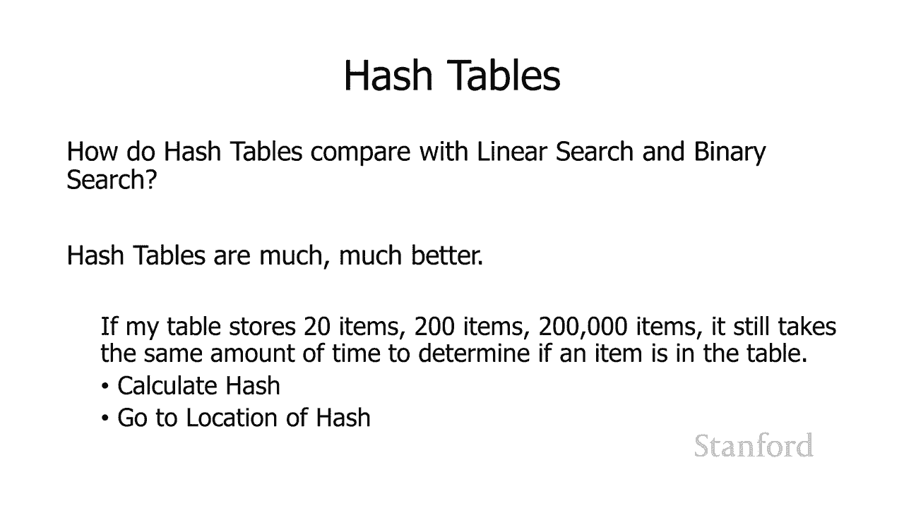

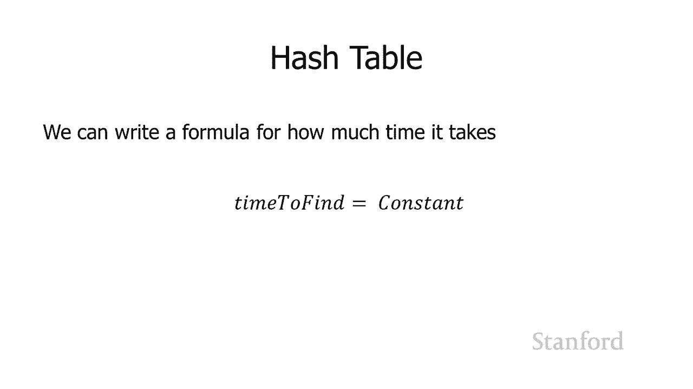

以下是一个简单的哈希函数示例，它将单词中每个字母在字母表中的位置相加：
```python
# 例如，单词 “cat”
# c=3, a=1, t=20
hash_value = 3 + 1 + 20 # 结果为 24
```
由于数组大小有限，我们通常用哈希值对数组大小取模，来确定最终位置。例如，数组有10个位置（索引0-9），那么 `24 % 10 = 4`，因此“cat”应放在索引4的位置。

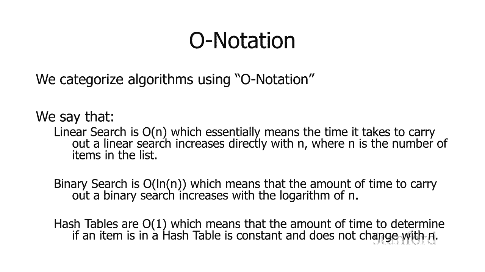

哈希表在理想情况下，查找时间是一个**常数**，与表中数据项的数量 `n` 无关，其时间公式为：`T = c`。但需要注意**哈希冲突**（即不同数据项计算出相同的哈希值），有专门的技术（如链地址法）来处理，这超出了本课范围。

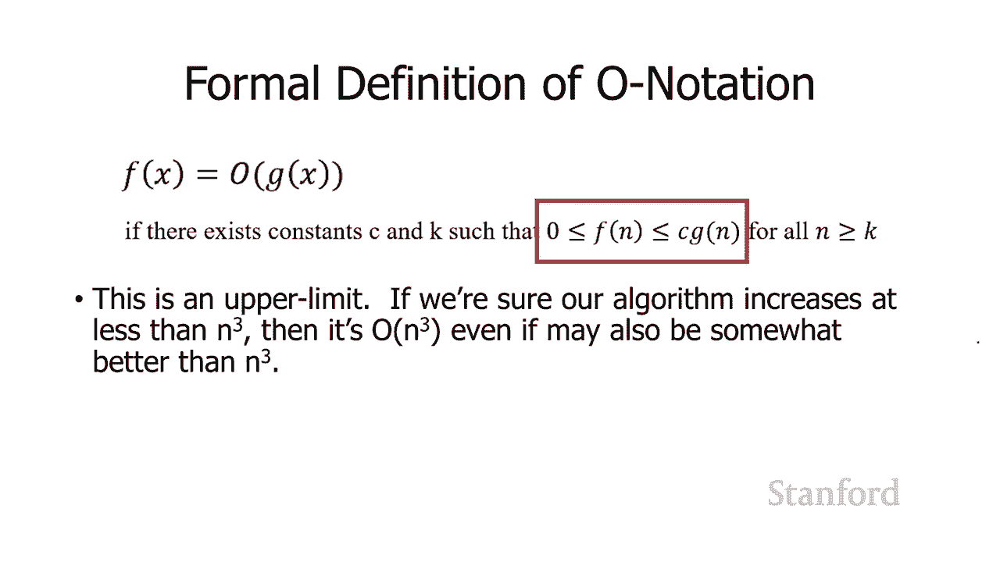

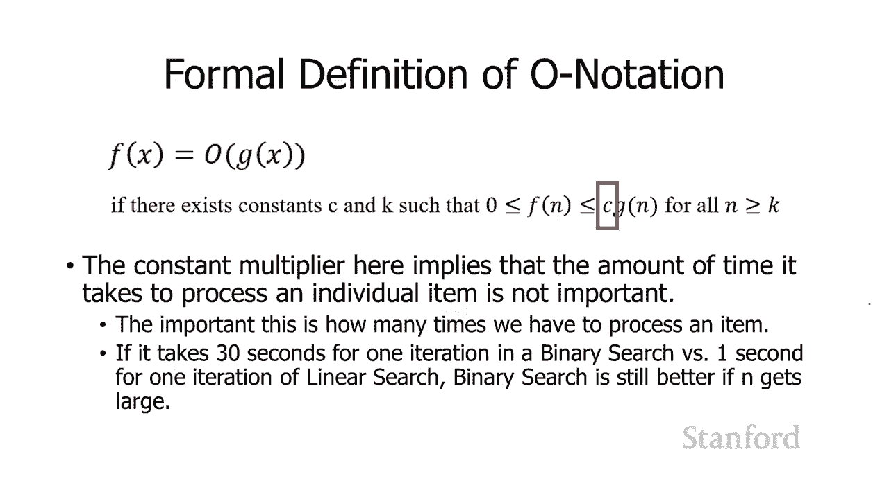

## 大O符号 📊

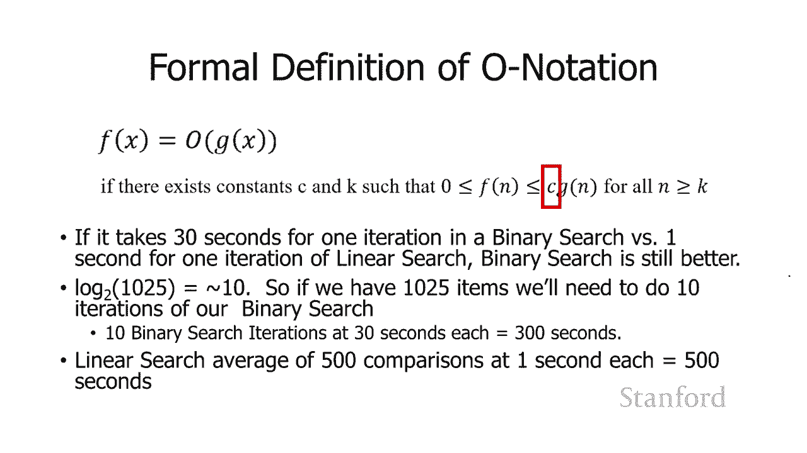

前面我们比较了不同算法的时间公式，本节中我们引入计算机科学中用于描述算法效率的标准工具：**大O符号**。它描述了算法运行时间或所需空间如何随输入规模 `n` 的增长而增长，并忽略常数因子和低阶项，专注于最重要的增长趋势。

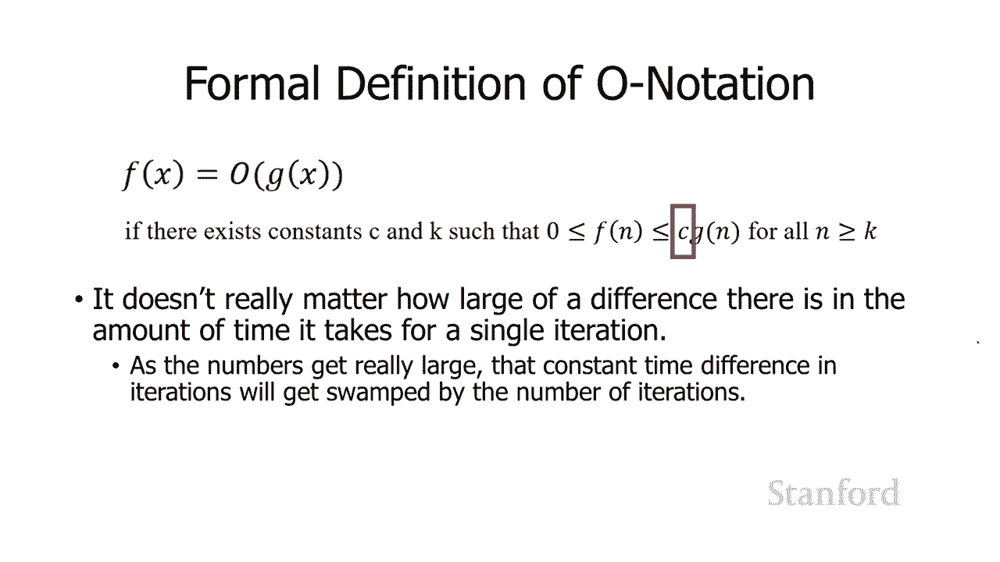

以下是常见的算法复杂度分类：
*   **O(1)**：常数时间。如哈希表查找，时间不随 `n` 变化。
*   **O(log n)**：对数时间。如二分搜索，时间随 `n` 对数增长，效率非常高。
*   **O(n)**：线性时间。如线性搜索，时间随 `n` 线性增长。
*   **O(n log n)**：线性对数时间。许多高效排序算法（如归并排序）属于此类。
*   **O(n²)**：平方时间。一些简单的排序算法（如冒泡排序）属于此类，当 `n` 增大时效率会显著下降。
*   **O(2ⁿ)**：指数时间。通常用于解决某些复杂问题，在 `n` 较大时几乎不可行。

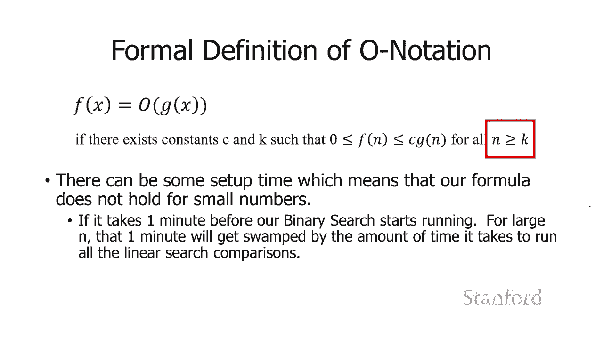

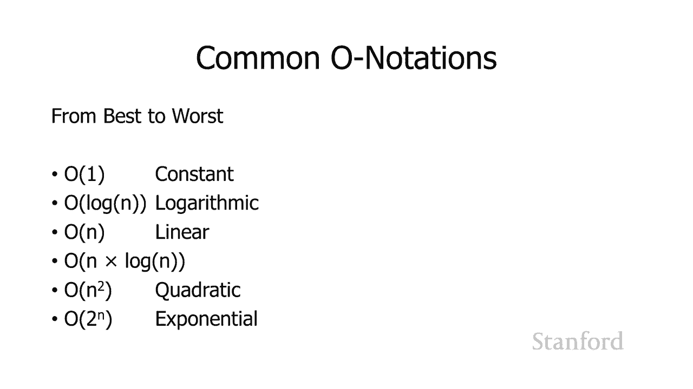

大O符号描述的是**渐近上界**，即算法运行时间不会超过该复杂度级别。与之相关的还有：
*   **大Ω符号**：描述渐近下界，即算法运行时间至少需要这么多。
*   **大Θ符号**：当上下界相同时使用，精确描述了算法的复杂度。

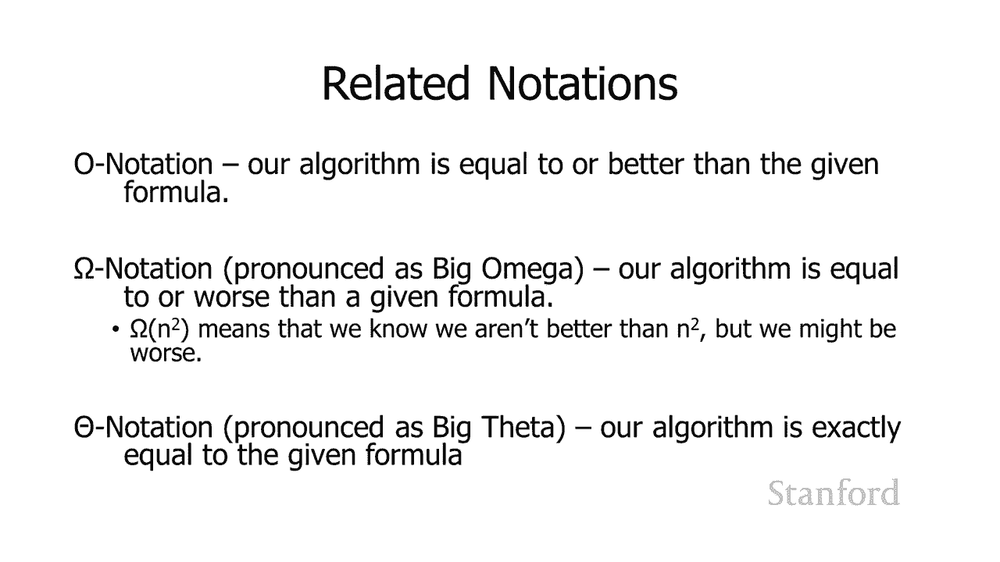

除了时间复杂度，算法还有**空间复杂度**，即所需内存空间随 `n` 的增长情况。通常需要在时间效率和空间效率之间进行权衡。

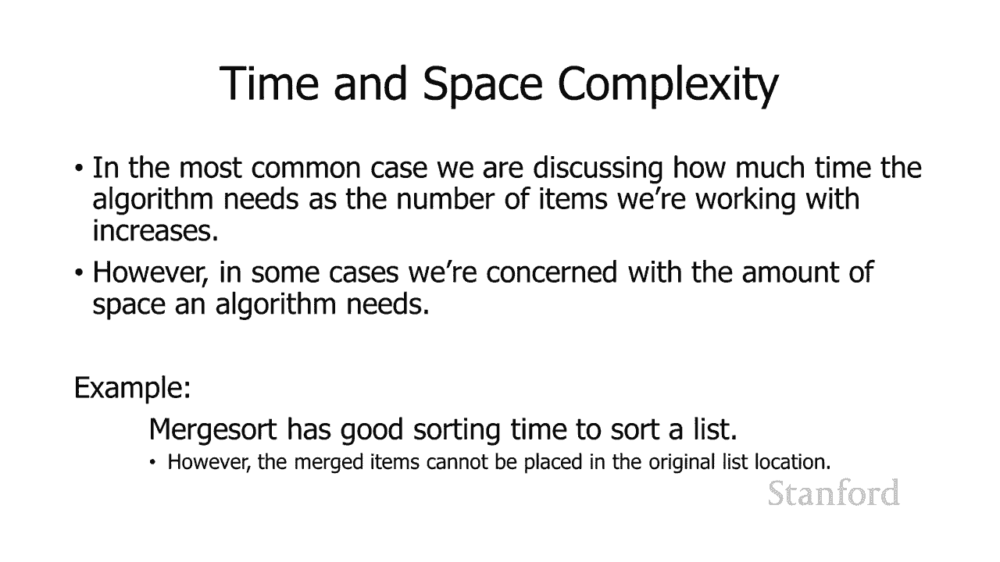

## 总结 🎯


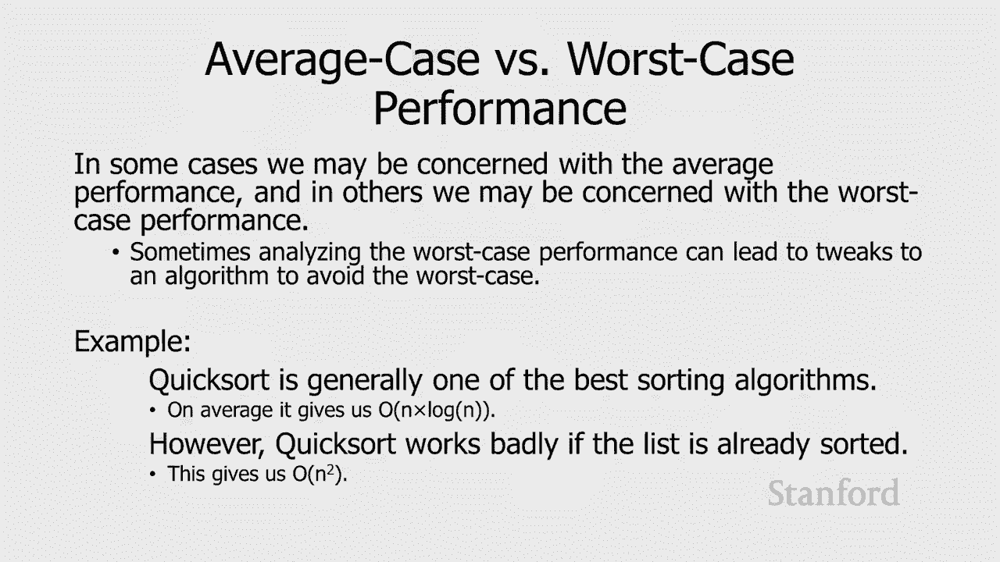


本节课中我们一起学习了算法分析的核心概念。我们比较了线性搜索、二分搜索和哈希表这三种查找算法，理解了它们的时间复杂度分别为 O(n)、O(log n) 和 O(1)。我们引入了大O符号这一重要工具，用于从理论层面抽象地描述和比较不同算法的效率，重点关注输入规模增长时算法性能的变化趋势。掌握算法分析，能帮助我们在编程时做出明智的选择，确保程序能够高效地处理大规模数据。