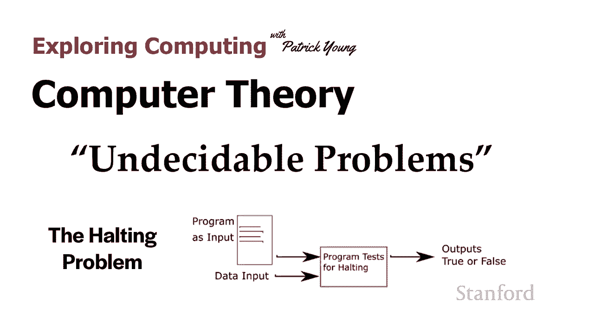
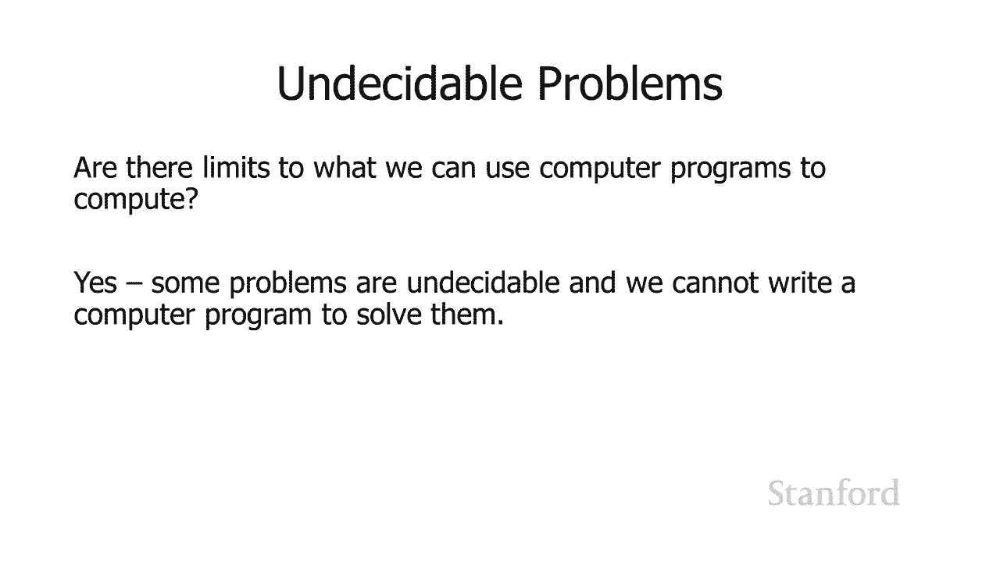
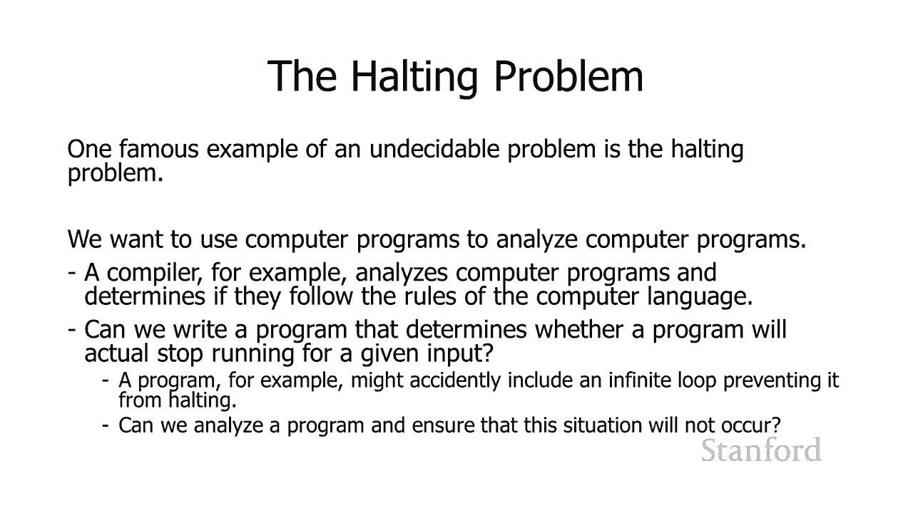
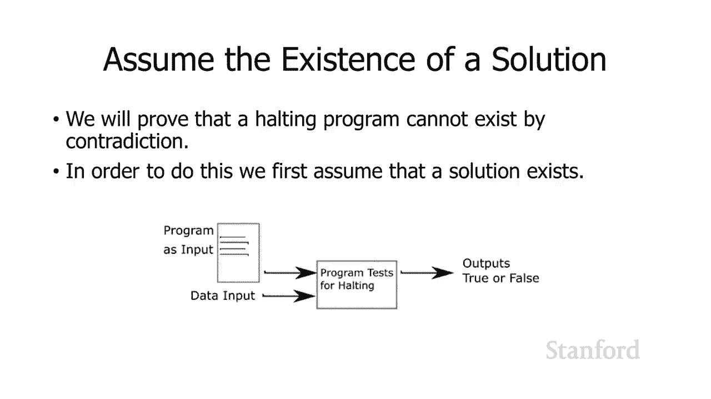
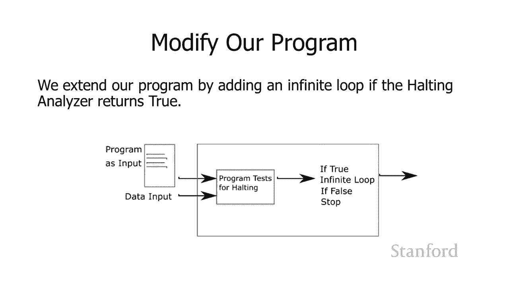
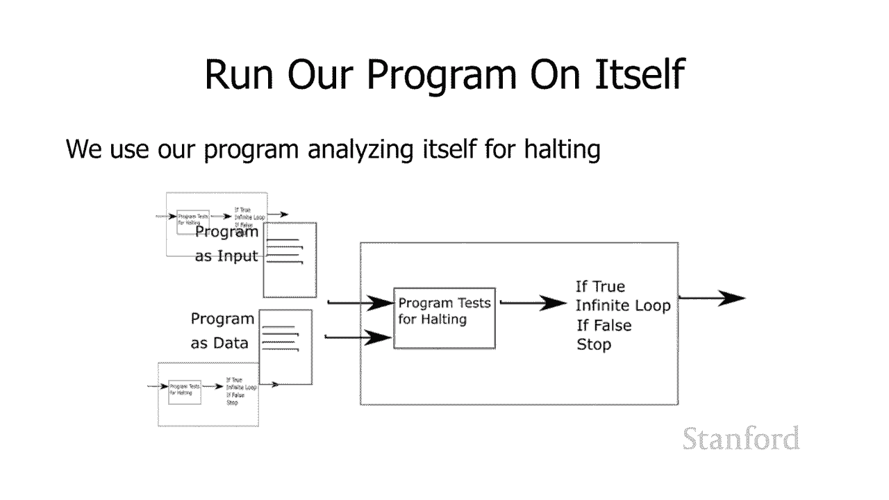
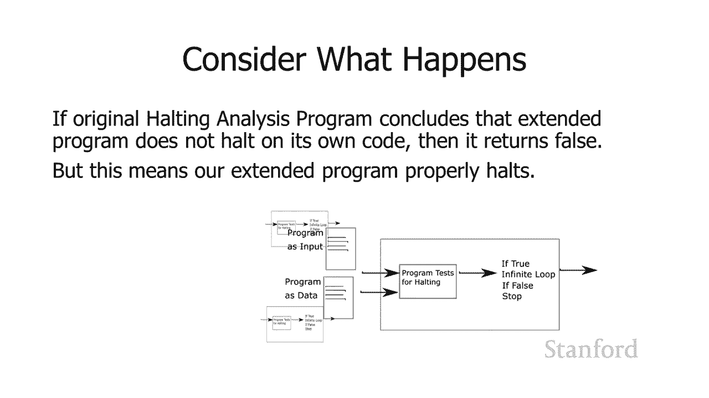
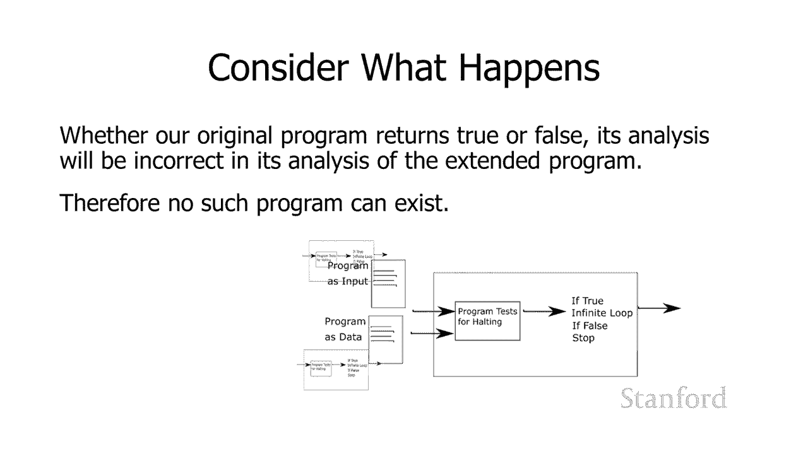

# 计算机科学导论：L27.2：理论：不可判定的问题 🧠




在本节课中，我们将要学习计算机理论中的一个核心概念：不可判定的问题。我们将探讨计算机程序的计算能力是否存在限制，并通过一个著名的例子——停机问题，来证明确实存在计算机程序无法解决的问题。



## 概述

计算机程序的功能非常强大，但它们并非无所不能。有些问题是计算机程序无法解决的，这类问题被称为“不可判定的问题”。本节我们将通过一个具体的例子来理解这个概念。

## 什么是不可判定的问题？

不可判定的问题是指，我们**无法**编写一个计算机程序来解决它。一个最著名的例子就是“停机问题”。

在开发计算机程序时，我们经常使用其他程序来辅助。例如，带有语法高亮显示的编辑器，它本身就是一个程序，用于分析你正在编写的代码。同样，编译器也是一个程序，用于分析代码是否符合编程语言的规则。



由此引出的一个问题是：我们能否编写一个程序，来判断另一个程序在给定特定输入后，是否会停止运行（即不会陷入无限循环）？如果能，那将非常有用，可以帮助我们避免程序中的无限循环错误。这个问题就是**停机问题**。

接下来，我们将证明，这样的程序实际上**不可能**被编写出来。

## 停机问题的矛盾证明

我们将采用“反证法”来证明停机问题不可解。首先，我们假设存在一个能解决停机问题的程序，然后通过逻辑推理得出矛盾，从而证明最初的假设是错误的。

### 假设存在“停机测试程序”



我们假设存在一个名为 `HaltTester` 的程序。它接受两个输入：
1.  一个待分析的程序 `P`。
2.  提供给程序 `P` 的输入数据 `I`。

`HaltTester(P, I)` 的功能是分析程序 `P` 在输入 `I` 下的行为。如果 `P` 会停止，则输出 `True`；如果 `P` 会无限循环，则输出 `False`。

```python
# 假设存在的程序 HaltTester
def HaltTester(program, input_data):
    # 神奇地分析 program(input_data) 是否会停止
    # 如果会停止，返回 True
    # 如果会无限循环，返回 False
    pass
```



### 构造一个矛盾程序

现在，我们利用这个假设存在的 `HaltTester` 来构造一个新程序 `Paradox`。`Paradox` 程序的行为如下：

1.  它以一个程序 `X` 作为输入。
2.  它调用 `HaltTester(X, X)`，即用程序 `X` 自身作为输入，来测试 `X` 是否会停止。
3.  根据 `HaltTester` 的结果：
    *   如果 `HaltTester(X, X)` 返回 `True`（认为 `X` 在输入 `X` 时会停止），那么 `Paradox` 就故意进入一个无限循环。
    *   如果 `HaltTester(X, X)` 返回 `False`（认为 `X` 在输入 `X` 时会无限循环），那么 `Paradox` 就立即停止。



```python
def Paradox(program_X):
    if HaltTester(program_X, program_X) == True:
        # 进入无限循环
        while True:
            pass
    else:
        # 立即停止
        return
```

### 推导矛盾

现在，让我们思考当 `Paradox` 程序以**它自身的代码**作为输入运行时，会发生什么。即，我们运行 `Paradox(Paradox)`。

我们来分析 `HaltTester(Paradox, Paradox)` 可能得出的两种结论：



*   **情况一**：`HaltTester` 认为 `Paradox(Paradox)` **会停止**，并返回 `True`。
    *   根据 `Paradox` 的代码逻辑，如果收到 `True`，它将进入**无限循环**。
    *   这与 `HaltTester` 的判断（“会停止”）相矛盾。

*   **情况二**：`HaltTester` 认为 `Paradox(Paradox)` **不会停止**（即无限循环），并返回 `False`。
    *   根据 `Paradox` 的代码逻辑，如果收到 `False`，它将**立即停止**。
    *   这又与 `HaltTester` 的判断（“不会停止”）相矛盾。

无论 `HaltTester` 如何判断，都会导致矛盾。因此，我们最初的假设——存在一个能正确判断任意程序是否会停机的 `HaltTester` 程序——是**错误**的。

## 总结




本节课我们一起学习了计算机理论中的“不可判定的问题”。我们通过著名的**停机问题**，证明了并非所有问题都能通过编写计算机程序来解决。我们使用反证法，假设存在一个能判断程序是否会停机的程序，并通过构造一个逻辑上自相矛盾的程序，证明了这样的程序不可能存在。这揭示了计算机计算能力的根本性限制。