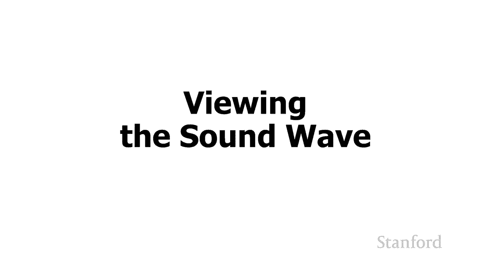
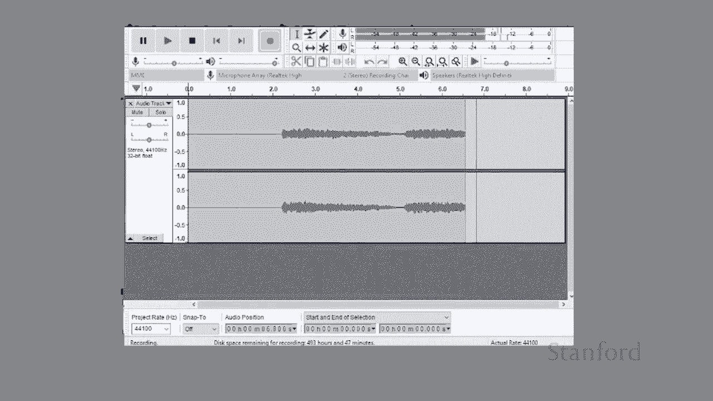
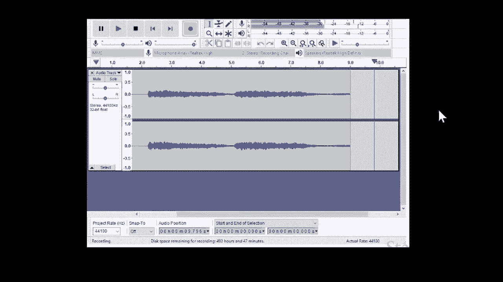
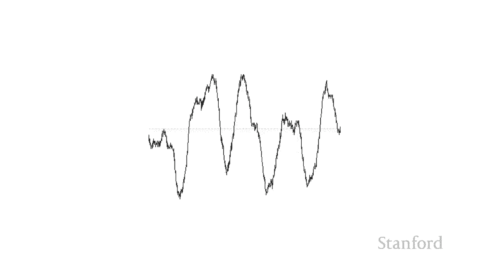

# 【双语字幕+资料下载】斯坦福CS105 ｜ 计算机科学导论(2021最新·完整版) - P10：L3.1- 数字音乐：影音录制背后的科学 - ShowMeAI - BV1eh411W72E

undefined，欢迎探索计算，欢迎探索计算，今天的视频是数字音乐的第一，今天的视频是数字音乐的第一，部分 声音，部分 声音，和录音的科学 在我们了解，和录音的科学 在我们了解，音乐和声音是如何。

音乐和声音是如何，存储在计算机上之前我们需要回顾，存储在计算机上之前我们需要回顾，一下，一下，声音是如何实际产生的以及，声音是如何实际产生的以及，录音是如何实际发生的，录音是如何实际发生的。

首先假设 我们在，首先假设 我们在，教室里 斯坦福，教室里 斯坦福，交响乐团正在全班，交响乐团正在全班，面前演奏贝多芬的第五交响曲，undefined，undefined，现在他们，现在他们。

演奏交响曲时，演奏交响曲时，会发生什么 正在发生的是各种，会发生什么 正在发生的是各种，乐器都在产生声波，乐器都在产生声波，并且这些声波在，并且这些声波在，空气中传播，空气中传播。

它们到达我们的耳膜 所以，它们到达我们的耳膜 所以，我们所感知，我们所感知，的音乐是声波击中我们的，的音乐是声波击中我们的，耳膜，耳膜，现在假设我们想把斯坦福交响乐团送，undefined。

undefined，回家 听他们的，回家 听他们的，录音 我们要做的是，录音 我们要做的是，开始和我们之前一样，开始和我们之前一样，undefined，undefined，斯坦福交响乐团。

斯坦福交响乐团，现场演奏，然后我们，undefined，undefined，要用一些米代替我们的耳朵 麦克风 我们有一个单独的，要用一些米代替我们的耳朵 麦克风 我们有一个单独的，麦克风 我们放置在。

麦克风 我们放置在，房间中间，房间中间，麦克风会在声波撞击麦克风时拾取声波，undefined，undefined，不知何故我们需要存储使用，不知何故我们需要存储使用，该麦克风产生的声波。

该麦克风产生的声波，我们可以从，我们可以从，磁带之类的东西开始，磁带之类的东西开始，例如，例如，我们可以从一个老式留声机开始，我们可以从一个老式留声机开始，你知道我们需要，你知道我们需要。

存储交响乐团现在正在播放的波的振幅和频率，存储交响乐团现在正在播放的波的振幅和频率，undefined，undefined，undefined，在立体声的情况下，在立体声的情况下，我们将设置两个麦克风。

我们将设置两个麦克风，一个在左边，一个在左边 一个在右边，一个在左边，一个在左边 一个在右边，我们将做同样的事情，我们将做同样的事情，声波将，声波将，在稍微不同的时间到达麦克风。

在稍微不同的时间到达麦克风，undefined，undefined，我们继续并再次获取声波的幅度，我们继续并再次获取声波的幅度，和频率，然后我们，和频率，然后我们，继续记录我们，继续记录我们。

现在的内容' 我们要做的是将，现在的内容' 我们要做的是将，斯坦福交响乐团送回家，斯坦福交响乐团送回家，我们得到一些扬声器并将它们连接，我们得到一些扬声器并将它们连接，到我们的录音，到我们的录音。

中 如果扬声器能够产生，undefined，undefined，与 stan 完全相同的声波，与 stan 完全相同的声波，最初创建的福特交响乐团，最初创建的福特交响乐团，我们基本上可以完整。

我们基本上可以完整，再现斯坦福，再现斯坦福，交响乐团的表演，交响乐团的表演，我们实际上可以，undefined，undefined，使用计算机上可用的一些工具来看看这些声波是。

使用计算机上可用的一些工具来看看这些声波是，什么样子 我们接下来要做的，什么样子 我们接下来要做的，是 我要看看一个，是 我要看看一个，叫做 audacity 的程序，叫做 audacity 的程序。

它将让我们，它将让我们，看看这些声波 我，看看这些声波 我，要演奏一个版本的，要演奏一个版本的，贝多芬第五交响曲 我，贝多芬第五交响曲 我，要用我电脑上的麦克风来，要用我电脑上的麦克风来，接，接。

交响乐团演奏的声音，交响乐团演奏的声音，我们将看到的是，undefined，undefined。

undefined，undefined，如果我们将我们一直在这里观看的声波，我们将，如果我们将我们一直在这里观看的声波，我们将。

在大胆中将其炸毁，那么大胆将向，在大胆中将其炸毁，那么大胆将向，undefined，undefined，我们展示音乐播放时的声波方式。 会看到这个 我们把它炸，我们展示音乐播放时的声波方式。

 会看到这个 我们把它炸，得更多，得更多，这就是它的样子 所以我们的，这就是它的样子 所以我们的，下一个任务是把，下一个任务是把，我们在这里看到的这个波，我们在这里看到的这个波，以某种方式把它转换成。

以某种方式把它转换成。

位和字节 这样我们就可以在，位和字节 这样我们就可以在。

