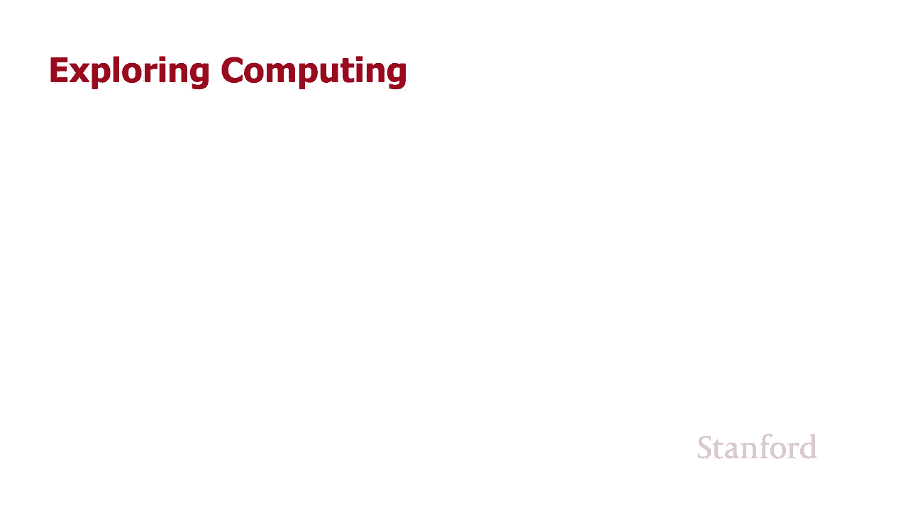
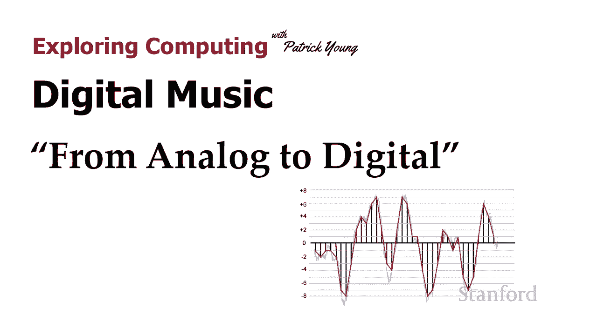
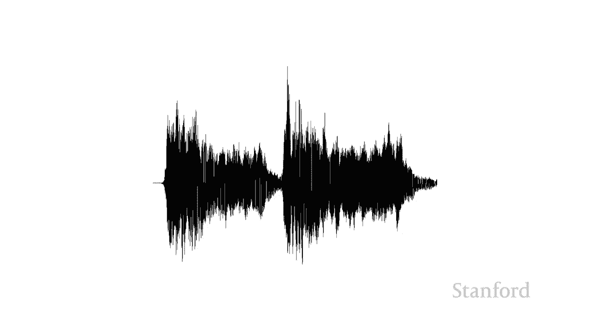

# 【双语字幕+资料下载】斯坦福CS105 ｜ 计算机科学导论(2021最新·完整版) - P11：L3.2- 数字音乐：模拟信号到数字信号 - ShowMeAI - BV1eh411W72E

undefined，欢迎探索计算，欢迎探索计算。

今天的视频是数字音乐的第二，今天的视频是数字音乐的第二，部分，从模拟到数字 所以，部分，从模拟到数字 所以，在上一堂课中我们看到，在上一堂课中我们看到，音乐实际上是一种声波，我们，音乐实际上是一种声波。

我们，实际上可以，实际上可以，看看该波是，看看该波是，什么样的 我们现在需要做什么 是弄清楚，什么样的 我们现在需要做什么 是弄清楚，我们如何利用该波并开始使用，我们如何利用该波并开始使用。

我们在上一课中看到的位和字节，我们在上一课中看到的位和字节。

所以现在让我们，所以现在让我们，仔细看看该波，仔细看看该波，并确保我们，并确保我们，了解这里发生了什么 所以这是一个，了解这里发生了什么 所以这是一个，非常特写 观察，非常特写 观察。

贝多芬第五交响曲的部分波，贝多芬第五交响曲的部分波，并沿 x 轴移动 这，并沿 x 轴移动 这，是时间的增加，所以随着时间的推移，是时间的增加，所以随着时间的推移，我们会看到不同时间点的波的大小。

undefined，undefined，以便将这些信息存储到 我们的，以便将这些信息存储到 我们的，计算机 我们需要做的是我们，计算机 我们需要做的是我们，undefined，undefined。

需要在特定的时间点进行测量，需要在特定的时间点进行测量，我们要做的是我们，我们要做的是我们，将存储一系列与不同点，将存储一系列与不同点，的波浪高度相对应的数字，undefined，undefined。

现在是其中之一 德，现在是其中之一 德，当我们这样做时，我们需要做出的决定是，当我们这样做时，我们需要做出的决定是，undefined，undefined，undefined，采样的频率。

undefined，undefined，undefined，这被称为采样，undefined，undefined，率 我正在采样，undefined，undefined，红线代表使用我采集的样本的线。

红线代表使用我采集的样本的线，你会注意到红线，你会注意到红线，不，不，遵循原始的浅灰线 如果我们要采集，遵循原始的浅灰线 如果我们要采集，浅灰线是原始声波，浅灰线是原始声波，undefined。

undefined，无限数量的，无限数量的，样本，那么我们的，样本，那么我们的，红线将匹配灰色的原始，红线将匹配灰色的原始，线，但我们不能采取无限，线，但我们不能采取无限，数量的样本，这将需要。

数量的样本，这将需要，无限量的存储，所以，无限量的存储，所以，这里发生的事情是，这里发生的事情是，我们沿线获取特定点，我们沿线获取特定点，我们 '正在尝试，我们 '正在尝试。

使用我们采集的样本重现原始声波，undefined，undefined，让我们看看如果我们，让我们看看如果我们，降低采样率会发生什么 下一张图像，降低采样率会发生什么 下一张图像。

再次显示了降低的采样率 我们，再次显示了降低的采样率 我们，看到随着时间的推移采集的样本 我们，看到随着时间的推移采集的样本 我们，看到采集的样本少了很多，看到采集的样本少了很多，你会注意到红线。

你会注意到红线，开始，开始，偏离原始灰线很远，偏离原始灰线很远，这个新的波浪看起来，这个新的波浪看起来，不像原始波浪，不像原始波浪，问题之一是，问题之一是，因为我们没有 没有，因为我们没有 没有。

足够频繁地采样 我们的样本，足够频繁地采样 我们的样本，完全错过，完全错过，了原始信号的一些峰值和谷值，了原始信号的一些峰值和谷值，我们可以控制的另一件事是，我们可以控制的另一件事是，我们，我们。

沿 y 轴的测量结果 这控制了我们的，沿 y 轴的测量结果 这控制了我们的，动态范围，动态范围，我们可以做的是 我们可以更改，我们可以做的是 我们可以更改，所谓的位深度，所谓的位深度，即，即。

我们留出的位数来表示，我们留出的位数来表示，沿 y 轴的数字 这里有两个，沿 y 轴的数字 这里有两个，示例，示例，在第一个示例中，我存储，在第一个示例中，我存储，了，了，正 8 和负 8 之间的数字。

正 8 和负 8 之间的数字，第二个例子我现在正在存储从，第二个例子我现在正在存储从，加二到负二的数字，加二到负二的数字，如果你仔细看看这些，如果你仔细看看这些，回想一下之前的讲座，回想一下之前的讲座。

你会意识到这些有点，你会意识到这些有点，偏离它真的应该从，偏离它真的应该从，pl 开始 我们 7 到负 8 加 1，pl 开始 我们 7 到负 8 加 1，到负 2 以便实际，到负 2 以便实际。

匹配位数，但我认为这，匹配位数，但我认为这，会使问题更加，会使问题更加，混乱，所以我们将继续，混乱，所以我们将继续，坚持偶数的，坚持偶数的，正数和负数 数字，正数和负数 数字，只是为了让示例保持简单。

只是为了让示例保持简单，所以让我们先看一下，所以让我们先看一下，正 8 到负 8 的示例，正 8 到负 8 的示例，您可以看到我正在采集，您可以看到我正在采集，一些样本，一些样本，所以这里要记住的是我。

所以这里要记住的是我，将一个给定的放在一边 位数，所以，将一个给定的放在一边 位数，所以，我不能存储无限数量的，我不能存储无限数量的，可能值，可能值，我不能存储 o 此时波的高度是，undefined。

undefined，7。2562 我需要将它存储，7。2562 我需要将它存储，在我已经给出的位数中，所以，在我已经给出的位数中，所以，在这个例子中 我假设我可以存储，在这个例子中 我假设我可以存储。

从正 8 到，从正 8 到，负 8 的整数值，就是这样，负 8 的整数值，就是这样，所以你可以看到我试图，所以你可以看到我试图，遵循原始的灰线，遵循原始的灰线，但我仅限于能够，但我仅限于能够。

沿着这些特定的离散整数存储值，undefined，undefined，现在让我们看看另一个，现在让我们看看另一个，例子 我只能存储，例子 我只能存储，负 2 和正 2 之间的值。

负 2 和正 2 之间的值，undefined，undefined，您可以立即看到，您可以立即看到，下一个示例进行得不是特别，下一个示例进行得不是特别，好，好，所以这里发生的事情是。

所以这里发生的事情是，位深度越大，位深度越大，我能够更准确地，我能够更准确地，表示波 所以我们已经看到我们可以，表示波 所以我们已经看到我们可以，控制采样率，即，undefined，undefined。

随着时间的推移采样的数量，我们可以控制位，随着时间的推移采样的数量，我们可以控制位，深度，这有助于确定动态，深度，这有助于确定动态，范围，范围，并告诉，并告诉，我们可以在每个采样点存储哪些特定值。

我们可以在每个采样点存储哪些特定值，undefined，undefined，所以 很明显，所以 很明显，我们采取，我们采取，的样本越多越好，我们的位深度越宽，的样本越多越好，我们的位深度越宽，越好。

所以问题是为什么，越好，所以问题是为什么，我们不只为这些中的每一个使用巨大的值，我们不只为这些中的每一个使用巨大的值，答案当然，答案当然，是采样率越高，是采样率越高，位深度越大，位深度越大。

我们的音乐占用的空间就越大，我们的音乐占用的空间就越大，所以这里的标准是 cd，所以这里的标准是 cd，每秒使用 44 100 个样本，通常，每秒使用 44 100 个样本，通常，只写为 44。

1 kHz 16 位，只写为 44。1 kHz 16 位，每个样本和两个通道，一个左声道和一个，每个样本和两个通道，一个左声道和一个，钻机 ht 频道，钻机 ht 频道，DVD，DVD。

在相同的位深度和非常相似，在相同的位深度和非常相似，的每秒样本数方面使用非常相似的东西，的每秒样本数方面使用非常相似的东西，蓝光实际上可以增加，蓝光实际上可以增加，每个样本的位数，每个样本的位数。

但这基本上是我们大多数人，但这基本上是我们大多数人，正在听的内容，但我们正在听 还，正在听的内容，但我们正在听 还，没有真正完成，因为事实证明，没有真正完成，因为事实证明，在您收听的大部分音乐。

在您收听的大部分音乐，真正，真正，进入您的计算机之前，会发生一个额外的步骤，这是因为，进入您的计算机之前，会发生一个额外的步骤，这是因为，该规范适用于实际的，该规范适用于实际的，物理 CD 磁盘，我猜。

物理 CD 磁盘，我猜，你们几乎没有 实际购买 cd 所以，你们几乎没有 实际购买 cd 所以，在下一个视频中我们将，在下一个视频中我们将，看到这个额外的步骤是什么样的以及。

