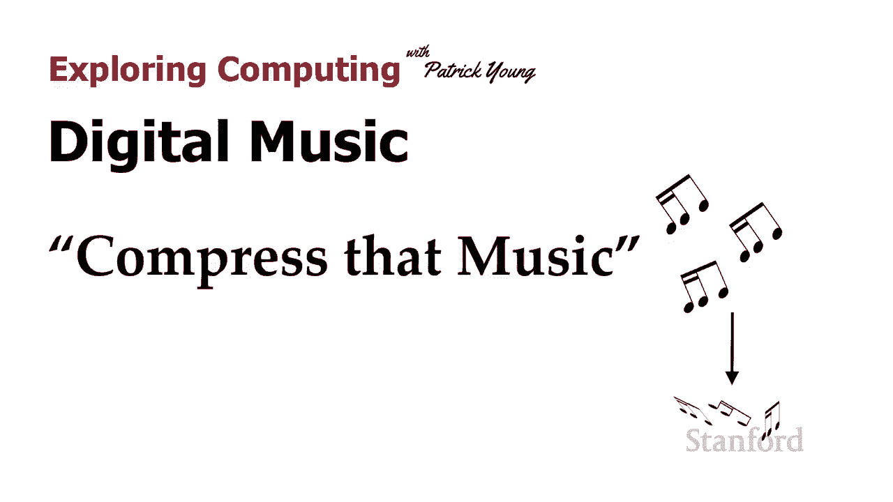
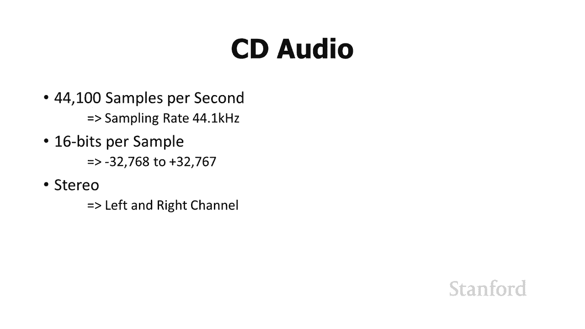
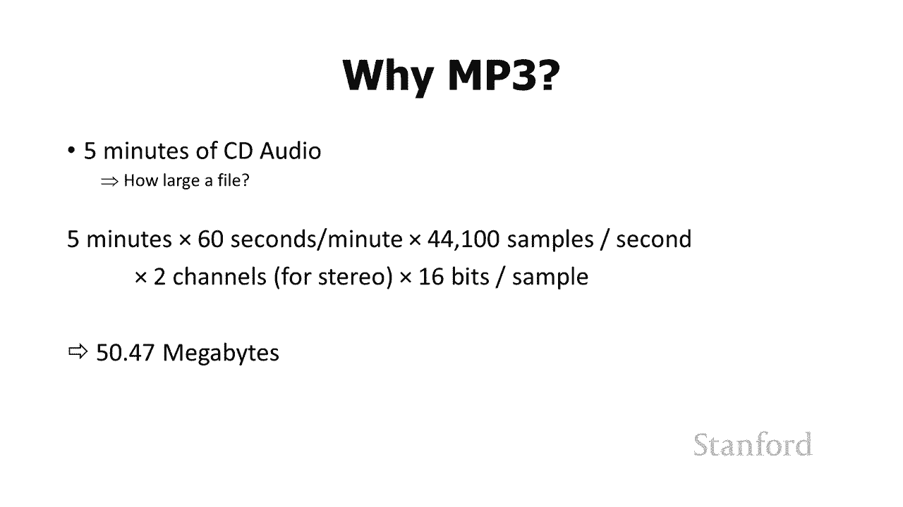
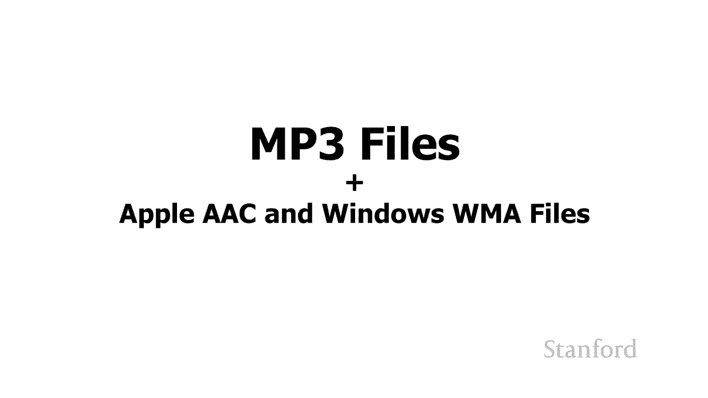
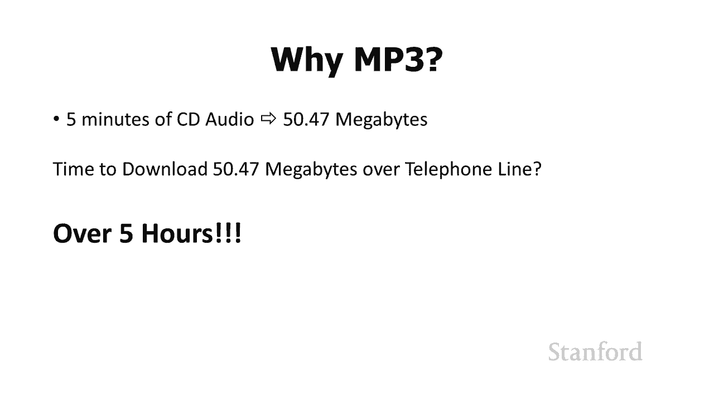
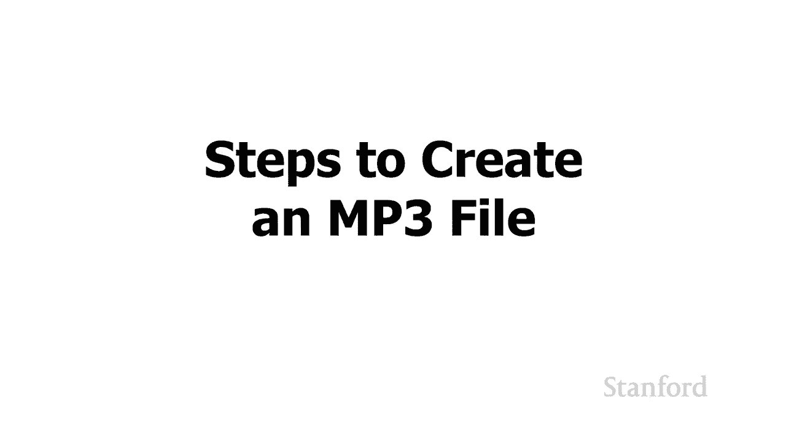
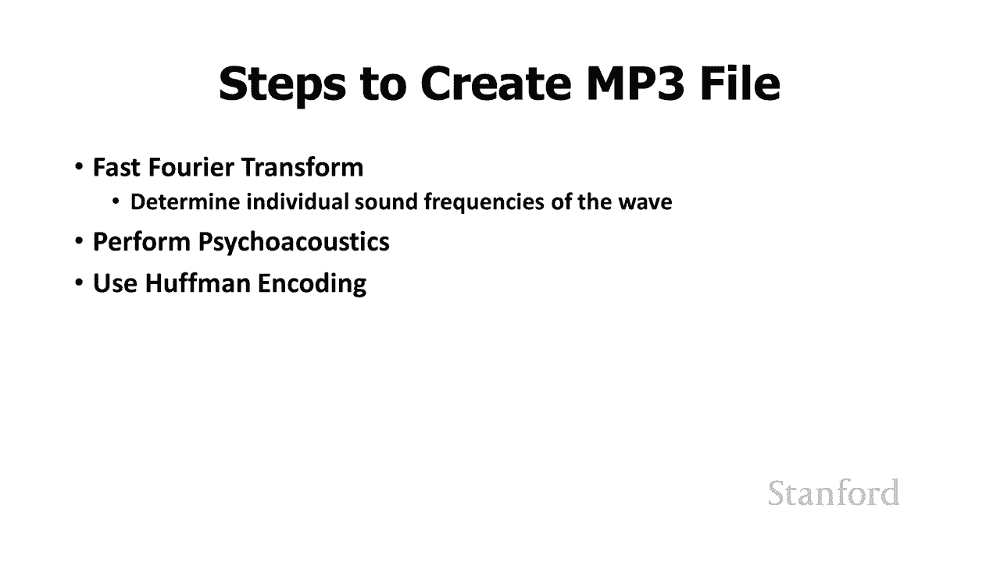
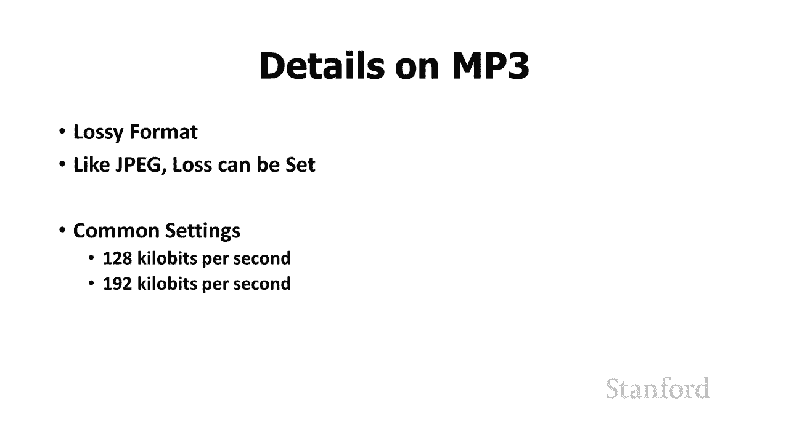
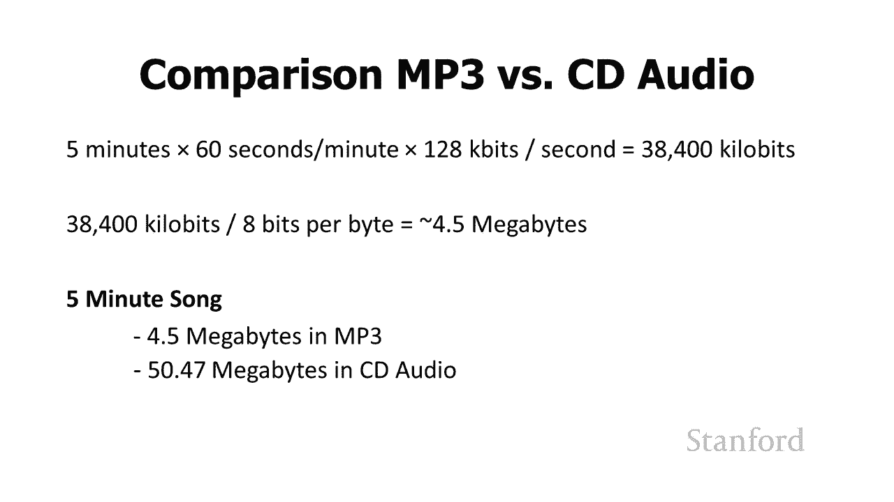

# 【双语字幕+资料下载】斯坦福CS105 ｜ 计算机科学导论(2021最新·完整版) - P12：L3.3- 数字音乐：压缩音乐 - ShowMeAI - BV1eh411W72E

undefined，欢迎探索计算，欢迎探索计算，今天的视频是数字音乐，今天的视频是数字音乐，第 3 部分压缩音乐，正如我，第 3 部分压缩音乐，正如我。

在上一个视频中建议的那样，在上一个视频中建议的那样，即使 cd 音频允许我们以，即使 cd 音频允许我们以，undefined，undefined，数字方式存储音乐，如果标准是现在制定的。

那实际上并不是你们大多数，数字方式存储音乐，如果标准是现在制定的，那实际上并不是你们大多数，人现在正在听，undefined，undefined，undefined，的音乐 可能我们只是坚持使用 cd。

的音乐 可能我们只是坚持使用 cd，音频，但，音频，但，因为互联网音乐，因为互联网音乐，标准实际上是在 20，标准实际上是在 20，年前你父母上大学，年前你父母上大学，时制定的，结果证明，时制定的。

结果证明，cd 音频存在一些问题 cd 音频，cd 音频存在一些问题 cd 音频，的问题是 cd，的问题是 cd，音频占用了很多，音频占用了很多，空间 它需要多少空间 让我们。

空间 它需要多少空间 让我们，来看看这里 假设我们有一，来看看这里 假设我们有一，首五分钟的歌曲，首五分钟的歌曲，并且我们正试图通过互联网发送它，undefined，undefined。

假设例如你的父母，假设例如你的父母，在一个乐队中有一种叫做朋克摇滚的新音乐，undefined，undefined，他们 创作这首伟大的朋克摇滚，他们 创作这首伟大的朋克摇滚，五分钟歌曲，他们想把。

五分钟歌曲，他们想把，它送回家给他们的弟弟或，它送回家给他们的弟弟或，妹妹，妹妹，所以他们要做的就是他们，所以他们要做的就是他们，要去啊 广告并录制那，要去啊 广告并录制那，首五分钟的歌曲。

首五分钟的歌曲，使用，使用，我们刚才谈到的。

undefined，undefined，技术将其转换为数字 问题是，技术将其转换为数字 问题是，该文件有多大 让我们继续在，该文件有多大 让我们继续在，这里做数学计算，这里做数学计算。

5 分钟乘以 60 秒每分钟，5 分钟乘以 60 秒每分钟，次，次，每秒 44 100 个样本乘以两个，每秒 44 100 个样本乘以两个，通道一个用于左右，通道一个用于左右，扬声器所以请记住。

扬声器所以请记住，如果我们有两个，如果我们有两个，两个通道 um 乘以每个样本 16 位，undefined，undefined，我们总是必须加倍 现在需要大约，我们总是必须加倍 现在需要大约。

50 兆字节，50 兆字节，按照今天的标准听起来并不可怕，按照今天的标准听起来并不可怕，但，但，再次回到 20 年前，当，再次回到 20 年前，当，你的父母上大学时，你的父母上大学时，他们会通过。

他们会通过，互联网将它发送给他们家里的弟弟或，互联网将它发送给他们家里的弟弟或，妹妹，妹妹，问题是你，问题是你。

的弟弟或妹妹需要多，的弟弟或妹妹需要多，长时间才能下载，长时间才能下载，那首全新的五分钟朋克摇滚，那首全新的五分钟朋克摇滚，歌曲，歌曲，结果证明它需要大约，结果证明它需要大约，五个小时，五个小时。

而另一首小曲子，而另一首小曲子，您可能会遗漏的信息之一，您可能会遗漏的信息之一，是，当时的电话，是，当时的电话，既用于互联网又用于，既用于互联网又用于，语音，语音，您必须选择您，您必须选择您。

使用的是哪一个，所以五个小时，使用的是哪一个，所以五个小时，内小弟弟或小妹妹，内小弟弟或小妹妹，正在下载那，正在下载那。

五分钟 歌曲 没有其他人可以使用，五分钟 歌曲 没有其他人可以使用，电话，电话，很明显这是一个问题，所以，很明显这是一个问题，所以，解决方案，解决方案，是 mp3 文件，我们实际上将。

undefined，undefined，在此视频中讨论 mp3 文件，但我想，在此视频中讨论 mp3 文件，但我想，提一下，提一下，还有其他几种格式，还有其他几种格式，非常 密切相关，因此。

非常 密切相关，因此，您知道如果您在，您知道如果您在，从 iTunes 购买的 Apple 设备上听音乐，从 iTunes 购买的 Apple 设备上听音乐，可能会使用 aac，可能会使用 aac。

如果您可能在 Windows 设备上收听，undefined，undefined，您可能会同时使用 wma aac，您可能会同时使用 wma aac，和 wma 标准 非常密切地。

和 wma 标准 非常密切地，关注 mp3，所以，关注 mp3，所以，我在这里谈论的几乎所有，我在这里谈论的几乎所有，mp3 就您可能使用，mp3 就您可能使用，的其他音频格式而言都非常相似。

undefined，undefined，但有一种较新的格式非常，但有一种较新的格式非常，不同，不同，这并不需要进行那么多，这并不需要进行那么多，压缩，我们将在，压缩，我们将在。

本系列的最后一个视频中讨论这个，本系列的最后一个视频中讨论这个，问题，undefined，undefined，undefined，需要多少空间，需要多少空间，以便我们可以，以便我们可以。

在合理的时间内在 Internet 上传输这些文件，在合理的时间内在 Internet 上传输这些文件，所以我们要，所以我们要，做得好我们要做的是我们，做得好我们要做的是我们，将，将。

执行许多不同的步骤来，执行许多不同的步骤来。

减少，减少，这个音频文件占用的空间量我们要做的第一件事，这个音频文件占用的空间量我们要做的第一件事，是我们要，是我们要，执行一个快速的傅立叶变换，执行一个快速的傅立叶变换，我不想，我不想。

讨论这个的数学细节，说实话，讨论这个的数学细节，说实话，我不喜欢，我不喜欢，在大学里做快速傅立叶变换，这，在大学里做快速傅立叶变换，这，就是我不再是，就是我不再是，电气工程师的原因之一。

我现在是一名计算机，电气工程师的原因之一，我现在是一名计算机，科学家，但，科学家，但，快速傅立叶变换背后的基本思想，快速傅立叶变换背后的基本思想，是，是，任何声波或，任何声波或，任何波都可以分解成。

任何波都可以分解成，成分 零件，其中每个，成分 零件，其中每个，零件都是，零件都是，一个 单频 所以你知道我们可能，一个 单频 所以你知道我们可能，有，有，一首歌在播放 我们也许可以把这。

undefined，undefined，首歌分解成 哦这里是 60 赫兹波，首歌分解成 哦这里是 60 赫兹波，这里是 80 赫兹波 这里是 120 赫兹波。

这里是 80 赫兹波 这里是 120 赫兹波，undefined，undefined，你知道它们都有不同的，你知道它们都有不同的，振幅 但是当它们全部结合在一起时，振幅 但是当它们全部结合在一起时。

undefined，undefined，这就是我们实际在听的内容，这就是我们实际在听的内容，所以我们将继续执行，所以我们将继续执行，这个快速傅立叶变换 并，这个快速傅立叶变换 并，确定，确定。

各个组成频率，各个组成频率，现在我们要做的是我们，现在我们要做的是我们，将使用一种叫做，将使用一种叫做，心理声学的东西 消除其中的，心理声学的东西 消除其中的，一些频率 所以心理声学是。

一些频率 所以心理声学是，人类如何实际，人类如何实际，聆听声音的科学 所以事实证明有，聆听声音的科学 所以事实证明有，一堆声音我们只是听不见，一堆声音我们只是听不见，最值得注意的是 我们可能都知道。

最值得注意的是 我们可能都知道，有些频率，有些频率，太高了 我们，太高了 我们，听到例如狗哨是有效的，听到例如狗哨是有效的，因为，因为，当你吹狗哨时会发出，当你吹狗哨时会发出，非常高的，非常高的。

高频声音，高频声音，狗都可以听到我，狗都可以听到我，但是人类不能，因为它太高以至于，但是人类不能，因为它太高以至于，人类听不到，人类听不到，我们还可以使用其他技巧，undefined。

undefined，来从我们的信息中消除某些声音，来从我们的信息中消除某些声音，例如，如果，例如，如果，声音很大，然后在附近的频率中有更，声音很大，然后在附近的频率中有更，柔和的声音，柔和的声音。

人类会完全，人类会完全，忽略更柔和的声音 所以，忽略更柔和的声音 所以，我们要做的是我们将，我们要做的是我们将，使用我们的心理声学 我们，使用我们的心理声学 我们，将开始丢弃部分音乐。

将开始丢弃部分音乐，现在需要注意的一件事是我们正在，现在需要注意的一件事是我们正在，丢失信息所以，丢失信息所以，之前，之前，我们谈到压缩图像时我们谈到了，我们谈到压缩图像时我们谈到了。

使用 jpeg 技术进行，使用 jpeg 技术进行，压缩 我们谈到了使用 png，压缩 我们谈到了使用 png，技术进行压缩 记住 png 技术是，技术进行压缩 记住 png 技术是，无损的，无损的。

没有信息丢失 我们能够，没有信息丢失 我们能够，减少这些文件占用的空间量，减少这些文件占用的空间量，undefined，undefined，但我们能够 完全重现，但我们能够 完全重现。

我们开始使用的位图图像，我们开始使用的位图图像，相比之下 jpeg 丢失信息，相比之下 jpeg 丢失信息，mp3 将类似地工作，mp3 将类似地工作，所以一种思考方式是，所以一种思考方式是。

s 假设我把贝多芬的第五个，s 假设我把贝多芬的第五个，原始 cd 音频声音和我，undefined，undefined，对它进行心理声学分析，对它进行心理声学分析，如果我表现得很好，希望。

如果我表现得很好，希望，音乐对我来说听起来完全一样，音乐对我来说听起来完全一样，但想想我可怜的狗，我的，但想想我可怜的狗，我的，狗正在听原始 cd，狗正在听原始 cd，质量的声音。质量的声音。

这些美妙的高频，这些美妙的高频，音调，音调，我听不见，所以我，我听不见，所以我，继续把它们扔掉，我，继续把它们扔掉，我，undefined，undefined，用新的 mp3 格式重播音乐，我的狗就像。

用新的 mp3 格式重播音乐，我的狗就像，你做了什么，所有，你做了什么，所有，那些美丽的高频音符发生了什么，那些美丽的高频音符发生了什么，他们 一切都好，他们 一切都好，所以我们在这里丢失了信息。

所以我们在这里丢失了信息，我们还没有完成，尽管，我们还没有完成，尽管，我们需要采取另一个步骤，我们需要采取另一个步骤，那就是执行霍夫曼，那就是执行霍夫曼，编码，编码，现在我不想详细，现在我不想详细。

介绍这个，但基本思想 这是，介绍这个，但基本思想 这是，连字符编码查找，连字符编码查找，undefined，undefined，频繁出现的序列和不经常出现的序列，undefined，undefined。

它要做的是将，它要做的是将，频繁出现的序列存储在，频繁出现的序列存储在，较小的空间中 与不经常出现的序列相比，undefined，undefined，我喜欢通过类比来说明这一点。

我喜欢通过类比来说明这一点，你们中的许多人可能，你们中的许多人可能，至少熟悉摩尔斯电码的概念，至少熟悉摩尔斯电码的概念，因此最著名的火星电码，因此最著名的火星电码，信息可能是拯救我们的船的 sos。

因此您，信息可能是拯救我们的船的 sos，因此您，可以想象泰坦尼克号就在那里，可以想象泰坦尼克号就在那里，泰坦尼克号撞上了冰山，它正在，泰坦尼克号撞上了冰山，它正在，下沉，他们正在，下沉，他们正在。

使用莫尔斯电码传输这条信息，使用莫尔斯电码传输这条信息，而玫瑰和杰克，而玫瑰和杰克，在水中结冰，所以信息是，在水中结冰，所以信息是，sos save our ship。

sos save our ship，莫尔斯电码中 sos 的著名符号是 dot dot dot，莫尔斯电码中 sos 的著名符号是 dot dot dot，代表 s，代表 s。

dash dash dash 代表 o 和，dash dash dash 代表 o 和，dot dot dot 代表 s 所以他们，dot dot dot 代表 s 所以他们。

会超越 dot dot dot，会超越 dot dot dot，dash dash dot dot 然后他们，dash dash dot dot 然后他们，会重复这一点，会重复这一点，所以这与我们的。

所以这与我们的，讨论有什么关系呢？ 在莫尔斯电，讨论有什么关系呢？ 在莫尔斯电，码中，码中，我们显然可以传输所有，我们显然可以传输所有，不同的字母，不同的字母，但是传输一个字母所需的空间。

但是传输一个字母所需的空间，量取决于字母的频率，量取决于字母的频率，所以字母 e，所以字母 e，是一个非常常见的字母和 s  o，是一个非常常见的字母和 s  o，我们将只用一个点来传输 e。

我们将只用一个点来传输 e，undefined，undefined，而 a 也很常见，所以，而 a 也很常见，所以，我们将通过点划线传输 a，我们将通过点划线传输 a，而 q，而 q，不经常出现。

所以我们要，不经常出现，所以我们要，以，以，破折号 破折号 点破折号传输，因此 aq 将，破折号 破折号 点破折号传输，因此 aq 将，占用四倍的空间或，占用四倍的空间或，传输为 e 的四倍时间。

传输为 e 的四倍时间，因此霍夫曼编码将对，因此霍夫曼编码将对，我们的音乐做一些非常相似的事情，我们的音乐做一些非常相似的事情，undefined，undefined。

所以我们执行了我们的音乐 心理声学，所以我们执行了我们的音乐 心理声学，分析 我们已经完成了半分钟的，分析 我们已经完成了半分钟的，编码，编码，我们有了我们歌曲的新版本 它。

我们有了我们歌曲的新版本 它，以这种 mp3 格式存储，以这种 mp3 格式存储，让我们快速看看，让我们快速看看，mp3。

undefined，undefined，与原始 cd 相比将占用多少空间 音频，与原始 cd 相比将占用多少空间 音频，我们需要记住的第一件事，我们需要记住的第一件事，是 mp3 是一种有损格式。

是 mp3 是一种有损格式，就像 jpeg 和 jpeg 一样，就像 jpeg 和 jpeg 一样，可以设置损失量，可以设置损失量，因此我可以决定我真的希望它，因此我可以决定我真的希望它。

听起来尽可能接近原始，听起来尽可能接近原始，或者我可以决定，或者我可以决定，我 我会在健身房听这个，我 我会在健身房听这个，所以我真的不知道，所以我真的不知道，关于质量有多好 无论如何它都会是。

关于质量有多好 无论如何它都会是，一个非常嘈杂的聆听环境，一个非常嘈杂的聆听环境，undefined，undefined，所以一些常见的设置是，所以一些常见的设置是。

每秒 128 KB 和每秒 192 KB，每秒 128 KB 和每秒 192 KB，还有一些，还有一些。

你可以使用的其他设置，你可以使用的其他设置，让我们假设我们正在使用我们的 128，让我们假设我们正在使用我们的 128，KB 每 秒我们有我们的五，KB 每 秒我们有我们的五，分钟歌曲，分钟歌曲。

每分钟 60 秒 千比特每秒，每分钟 60 秒 千比特每秒，undefined，undefined，undefined，一首五分钟歌曲总共有 38 400 千比特。

一首五分钟歌曲总共有 38 400 千比特，然后我需要把它除以，然后我需要把它除以，每字节八比特 这会给，每字节八比特 这会给，我们四个半 兆字节现在，我们四个半 兆字节现在，记住，记住。

我们原来的 cd 音频歌曲是 50。47，我们原来的 cd 音频歌曲是 50。47，兆字节，兆字节，我们可以通过将其转换为 mp3，我们可以通过将其转换为 mp3。

以 4 兆字节半的空间收听完全相同的音乐，以 4 兆字节半的空间收听完全相同的音乐，因此您可以，因此您可以，看到我们已经节省了，看到我们已经节省了，大量的潜在空间，大量的潜在空间，质量损失，质量损失。

我们至少可以，我们至少可以，控制，控制，下一个视频中的质量损失我想明确地，下一个视频中的质量损失我想明确地，看看模拟和数字之间的关系，看看模拟和数字之间的关系，这是我们，这是我们，一直在玩的东西。

一直在玩的东西，贯穿上一堂课和本，贯穿上一堂课和本，堂课，这是一个非常关键的话题，所以我，堂课，这是一个非常关键的话题，所以我，想花一些时间。

