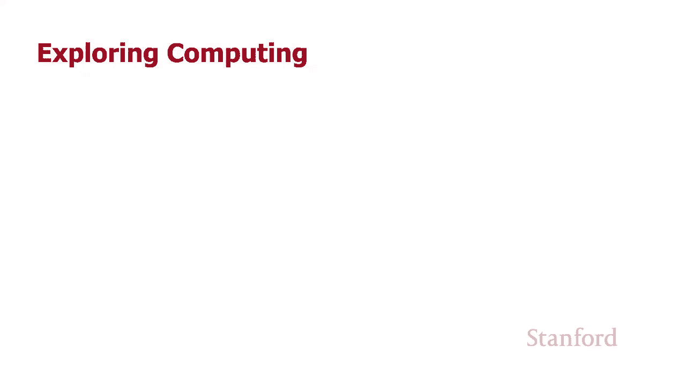
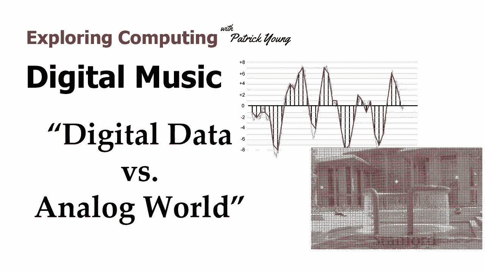
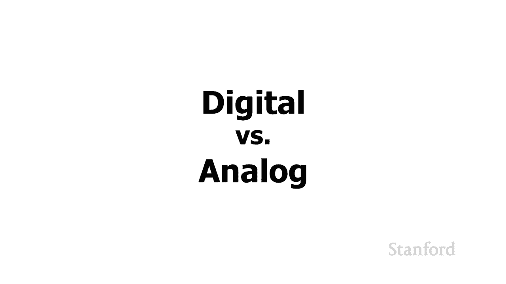
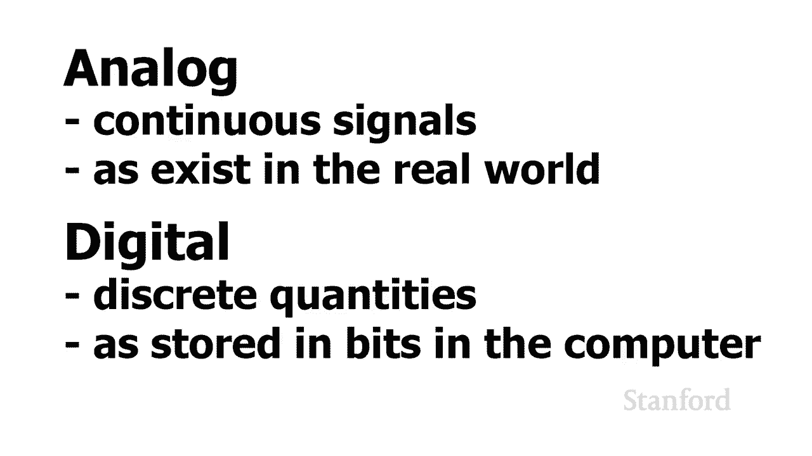

# 【双语字幕+资料下载】斯坦福CS105 ｜ 计算机科学导论(2021最新·完整版) - P13：L3.4- 数字音乐：数字信号vs模拟信号 - ShowMeAI - BV1eh411W72E

undefined，欢迎来到，欢迎来到，今天的视频是数字音乐，今天的视频是数字音乐，第四部分数字数据与模拟，第四部分数字数据与模拟，世界，世界，本周我们已经研究，本周我们已经研究，了计算机中发生的事情。

了计算机中发生的事情，undefined，undefined，与我们在现实生活中习惯的事情之间的许多，与我们在现实生活中习惯的事情之间的许多，差异所以我们看到的第一个差异 是。

差异所以我们看到的第一个差异 是，因为，因为，我们习惯使用十进制数，我们习惯使用十进制数，但计算机使用二进制数，但计算机使用二进制数，但第二个区别是，但第二个区别是。

模拟和数字之间的区别，模拟和数字之间的区别，现在我们首先讨论了，现在我们首先讨论了，二进制，二进制，undefined，undefined，和十进制之间的区别，我们看到二进制数的概念。

和十进制之间的区别，我们看到二进制数的概念，确实普遍存在于计算中，确实普遍存在于计算中，这是当我们出去尝试，这是当我们出去尝试，购买手机时，我们看到我们有，undefined，undefined。

64 128 256 或 512 的选择。64 128 256 或 512 的选择。我们已经看到了这一点，因为我们已经讨论了我们的，我们已经看到了这一点，因为我们已经讨论了我们的，数字图像。

其中我们看到，数字图像，其中我们看到，颜色为 24 位颜色 或，颜色为 24 位颜色 或，32 位颜色和我们的声音，其中，32 位颜色和我们的声音，其中，我们有 16 位，我们有 16 位，样本。

所以我首先介绍了它，样本，所以我首先介绍了它，因为，undefined，undefined，当我们谈论，当我们谈论，图像或声音时有必要更好地理解，但实际上第二个不同，图像或声音时有必要更好地理解。

但实际上第二个不同，因为，因为，数字和模拟之间的区别可能，数字和模拟之间的区别可能，是两者中更重要的，是两者中更重要的，我还没有明确谈论，我还没有明确谈论，数字模拟之间的区别，数字模拟之间的区别。

尽管这就是我们，尽管这就是我们，最近两堂课一直在做的事情，最近两堂课一直在做的事情，电子图像，电子图像，和电子声音等等 这个视频，和电子声音等等 这个视频，我真的很想，我真的很想，明确地谈论模拟与。

明确地谈论模拟与。

数字，数字，所以当我们看现实世界时，模拟指的是连续信号，undefined，undefined，现实世界充满了连续的，现实世界充满了连续的，量，量，相比之下，数字意味着我们，相比之下，数字意味着我们。

以离散量存储信息，以离散量存储信息，undefined，undefined，和 所以真正的数字图像，和 所以真正的数字图像，和数字音乐，和数字音乐，或数字声音的全部内容是，或数字声音的全部内容是。

将真实的模拟，将真实的模拟，世界转换成这些离散，世界转换成这些离散，量，我们可以将其存储在，量，我们可以将其存储在，计算机中，计算机中，因此当我们想要将某些东西移入时，总会有这个过程。

因此当我们想要将某些东西移入时，总会有这个过程，计算机，计算机，我们必须将真实世界的模拟，我们必须将真实世界的模拟，实体及其所有，实体及其所有，荣耀以某种方式将其转换为数字世界。

荣耀以某种方式将其转换为数字世界，undefined，undefined。

如果我们在看一张照片，如果我们在看一张照片，那么这是一张，那么这是一张，绿色图书馆前的红色箍喷泉的照片，绿色图书馆前的红色箍喷泉的照片，undefined，undefined，你知道吗，假设，你知道吗。

假设，我们实际上站在图书馆前，我们实际上站在图书馆前，世界及其所有的荣耀都在，世界及其所有的荣耀都在，undefined，undefined，所以我们可以问一些问题，比如，所以我们可以问一些问题，比如。

现实世界中有多少颜色现实，现实世界中有多少颜色现实，世界，世界，中有多少像素，中有多少像素，这些问题没有，这些问题没有，意义现实世界，意义现实世界，没有离散数量的，没有离散数量的，颜色它没有 离散。

颜色它没有 离散，像素 所以当我们拍摄数码照片时会发生什么，undefined，undefined，我们将它从现实世界，我们将它从现实世界，转换成这些离散单元 可以，转换成这些离散单元 可以。

存储在我们的计算机内部，存储在我们的计算机内部，我们将现实世界中的真实，我们将现实世界中的真实，undefined，undefined，转换为单个像素 在，转换为单个像素 在，这些单个像素中。

这些单个像素中，我们正在查看颜色，我们正在查看颜色，我们说嘿，你知道我需要，我们说嘿，你知道我需要，将该颜色，将该颜色，转换为 8 位（红色），转换为 8 位（红色），8 位（绿色）和 8 位（。

8 位（绿色）和 8 位（，蓝色）的序列，所以我正在数字化 r 真正的，蓝色）的序列，所以我正在数字化 r 真正的，世界，世界，这样它就可以将它作为离散量存储，这样它就可以将它作为离散量存储。

undefined，undefined，在计算机中，undefined，undefined，undefined，当斯坦福交响乐团，undefined，undefined，在教室前演奏贝多芬第五交响曲时。

我们可以从，在教室前演奏贝多芬第五交响曲时，我们可以从，这些单独的位和字节开始，类似地，undefined，undefined，undefined，undefined。

不生成每秒生成四万四千一百个数字的数字流，每个，不生成每秒生成四万四千一百个数字的数字流，每个，数字都在，数字都在，负三万二千，负三万二千，七百六十八和正三万，七百六十八和正三万，二千七百六十七之间。

二千七百六十七之间，这不是他们正在做的事情，这不是他们正在做的事情，他们正在生成 一个连续的模拟，他们正在生成 一个连续的模拟，信号，信号，当我们将，当我们将，它存储到我们的计算机中时，我们需要做的是。

它存储到我们的计算机中时，我们需要做的是，我们需要将该连续的，我们需要将该连续的，模拟信号，模拟信号，转换为离散的数字量，以便我们，转换为离散的数字量，以便我们，可以将它们实际存储，可以将它们实际存储。

