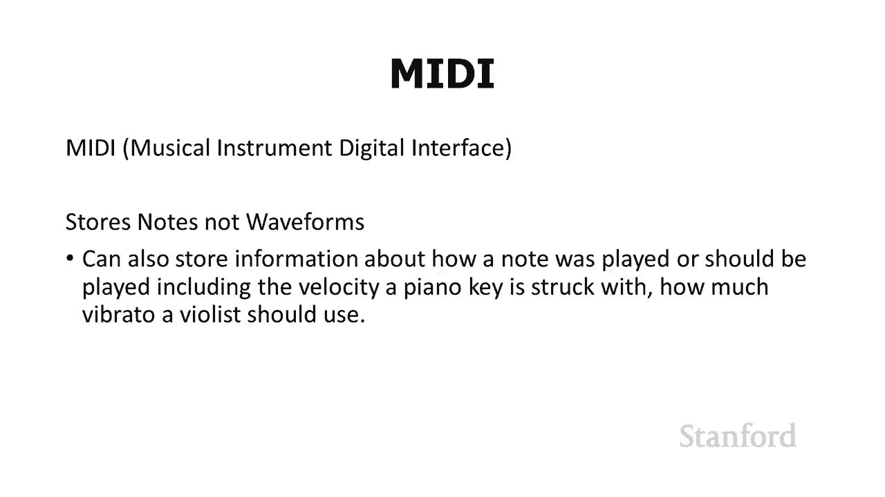
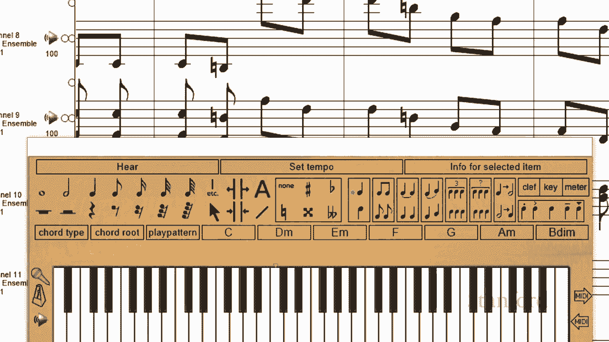
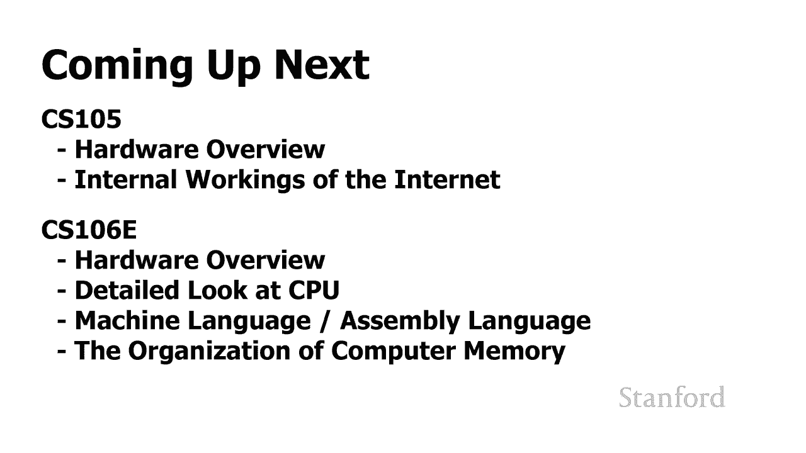
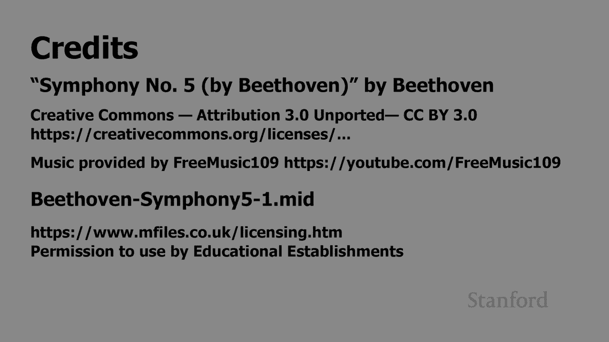

# 【双语字幕+资料下载】斯坦福CS105 ｜ 计算机科学导论(2021最新·完整版) - P14：L3.5- 数字音乐：音乐与制式(格式) - ShowMeAI - BV1eh411W72E

undefined，欢迎探索，欢迎探索，今天的计算视频是数字音乐，今天的计算视频是数字音乐，第 5 部分完美的音乐和替代，第 5 部分完美的音乐和替代，格式，格式，因此在此视频中，我们将。

因此在此视频中，我们将，看看一些存储音乐的替代方法，看看一些存储音乐的替代方法，我们已经看到 mp3 文件，我们已经看到 mp3 文件，及其相关表亲，如 aac 和，及其相关表亲，如 aac 和。

wma 丢失信息 有没有一种方法，wma 丢失信息 有没有一种方法，可以存储我们的音乐并拥有更好的，可以存储我们的音乐并拥有更好的，声音，声音，文件，并且这种特殊格式，文件，并且这种特殊格式。

已经越来越受欢迎，已经越来越受欢迎，它被称为flak 它代表免费的，它被称为flak 它代表免费的，无损音频编解码器，无损音频编解码器，苹果和微软有他们自己的，苹果和微软有他们自己的。

undefined，undefined，版本 类似的特征，版本 类似的特征，基本上，flack 所做的是它，基本上，flack 所做的是它，采用原始 cd 音频，采用原始 cd 音频，并对其进行压缩。

但类似于，并对其进行压缩，但类似于，我们在谈论图像时看到的 png 文件，undefined，undefined，平面压缩不会丢失任何，平面压缩不会丢失任何，信息，因此，信息，因此。

如果您使用 flac，您的 flac 文件，如果您使用 flac，您的 flac 文件，应该 听起来，应该 听起来，和原来的 CD 一样好，现在我应该，和原来的 CD 一样好，现在我应该，提醒你。

这就是为什么我，提醒你，这就是为什么我，在，在，这个视频的原始标题中有问号你，这个视频的原始标题中有问号你，还在，还在，将您的音乐数字化，以便您知道，将您的音乐数字化，以便您知道。

原始音乐已被数字化 有些，原始音乐已被数字化 有些，人，人，认为 44。1 kHz 的，认为 44。1 kHz 的，16 位声音不够好，16 位声音不够好，在您的作业中，您将，在您的作业中，您将。

尝试使用几种替代，尝试使用几种替代，格式，这些格式可以存储更多位和，格式，这些格式可以存储更多位和，有更高的采样率，但那些真的，有更高的采样率，但那些真的，没有起飞，没有起飞。

但就你今天可用的大多数数字录音所能做的而言，undefined，undefined，undefined，flac 可能是你最好的选择，所以，flac 可能是你最好的选择，所以，在这里我们可以。

在这里我们可以，看到五个空间的比较 -minute flag 歌曲，看到五个空间的比较 -minute flag 歌曲，undefined，undefined，与 5 分钟 mp3 歌曲与。

与 5 分钟 mp3 歌曲与，cd 音频歌曲的比较，我们可以看到，cd 音频歌曲的比较，我们可以看到，35。67 MB 的 flag 文件大小，undefined，undefined，实际上更接近。

实际上更接近，原始 cd 音频文件的 50。47 MB，而不是原始 cd 音频文件，原始 cd 音频文件的 50。47 MB，而不是原始 cd 音频文件，的大小。  mp3 有 4 兆半字节，的大小。

  mp3 有 4 兆半字节，所以我们并没有节省那么多空间，所以我们并没有节省那么多空间，我们节省了一些空间，但不是，我们节省了一些空间，但不是，很大的空间，但好消息是，很大的空间，但好消息是。

如果你的狗听你的音乐，如果你的狗听你的音乐，但它们错过了，但它们错过了，那些真正的高音 mp3 铜 ts off，那些真正的高音 mp3 铜 ts off，with flack 他们将能够听到他们。

with flack 他们将能够听到他们，一切，一切，好吧 我们的下一个格式实际上很，好吧 我们的下一个格式实际上很，有趣，有趣，我要给你播放我们的，我要给你播放我们的，贝多芬第五交响曲的原始副本。

贝多芬第五交响曲的原始副本，undefined，undefined，] 这里是贝多芬的第五交响曲，] 这里是贝多芬的第五交响曲，以不同的，以不同的，文件格式演奏让我们 看看你对。

文件格式演奏让我们 看看你对，这个，这个，[音乐]，[音乐]，的看法你觉得，的看法你觉得，你更喜欢哪一个，所以你们中的一些人，你更喜欢哪一个，所以你们中的一些人，undefined，undefined。

在想为什么我要，在想为什么我要，使用第二种文件格式，使用第二种文件格式，这实际上是一个非常好的，这实际上是一个非常好的，问题，这里是，问题，这里是，原著中的答案是我们听的，原著中的答案是我们听的。

贝多芬第五交响曲被，贝多芬第五交响曲被，存储为声波，存储为声波，我们一直在讨论您，我们一直在讨论您，可以，可以，通过整个视频序列对这些声波做什么，但是，通过整个视频序列对这些声波做什么，但是。

undefined，undefined，贝多芬第五交响曲的第二次录音，贝多芬第五交响曲的第二次录音，实际上是完全不同的，实际上是完全不同的，那是一个midi文件，midi文件的，那是一个midi文件。

midi文件的，作用，作用，是存储单个音符，是存储单个音符，而不是存储声波，因此，而不是存储声波，因此，首先具有许多优点，首先具有许多优点，从文件空间的，从文件空间的，角度来看，midi 文件。

角度来看，midi 文件，比声音文件占用的空间要少得多，比声音文件占用的空间要少得多，请记住，对于声音文件，请记住，对于声音文件，您知道我们每秒有 44 100 个样本。

您知道我们每秒有 44 100 个样本，所以如果一个文件只是一对，undefined，undefined，如果您将其与那几秒钟代表的音符数量进行比较，那么这是大量样本，undefined。

undefined，它们不代表那么多，它们不代表那么多，音符，因此您当然可以存储，音符，因此您当然可以存储，一个 MIDI 文件的空间要少得多，但这，一个 MIDI 文件的空间要少得多，但这。

不是 MIDI 文件的真正意义所在，不是 MIDI 文件的真正意义所在。

midi文件的真正意义在于，midi文件的真正意义在于，我们在这里看到的是这是一个，我们在这里看到的是这是一个，名为，名为，songworks的程序，它旨在处理，songworks的程序，它旨在处理。

和操作midi文件，因此您可以，和操作midi文件，因此您可以，看到我们何时处理我们正在考虑的midi文件，看到我们何时处理我们正在考虑的midi文件，将音乐作为，将音乐作为，单独的音符，我们能够。

单独的音符，我们能够，操纵单独的音符，操纵单独的音符，我们可以看到单独的音符，因此，我们可以看到单独的音符，因此，如果您是作曲家，如果您是作曲家，或音乐家，您可能会发现 MIDI 文件。

undefined，undefined。

比基于，比基于，声波 我们一直在，声波 我们一直在，研究 cd 音频 mp3，研究 cd 音频 mp3，甚至标志，所以这就是本周的，甚至标志，所以这就是本周的，下周我们将看看，下周我们将看看。

计算机硬件，计算机硬件，cs106e 将深入研究，cs106e 将深入研究，中央处理器的工作原理以及，中央处理器的工作原理以及，如何工作 计算机内存可以工作，如何工作 计算机内存可以工作。

cs105 将从查看计算机，cs105 将从查看计算机，硬件开始，然后继续，硬件开始，然后继续。

查看互联网的工作原理。

