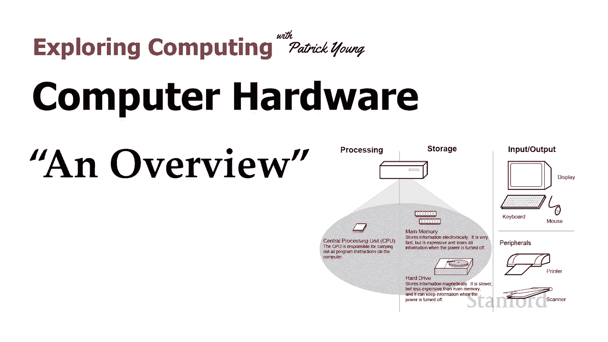
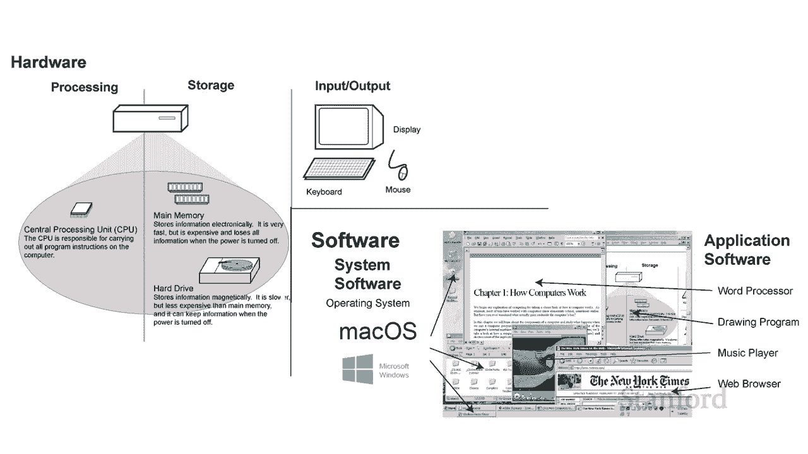
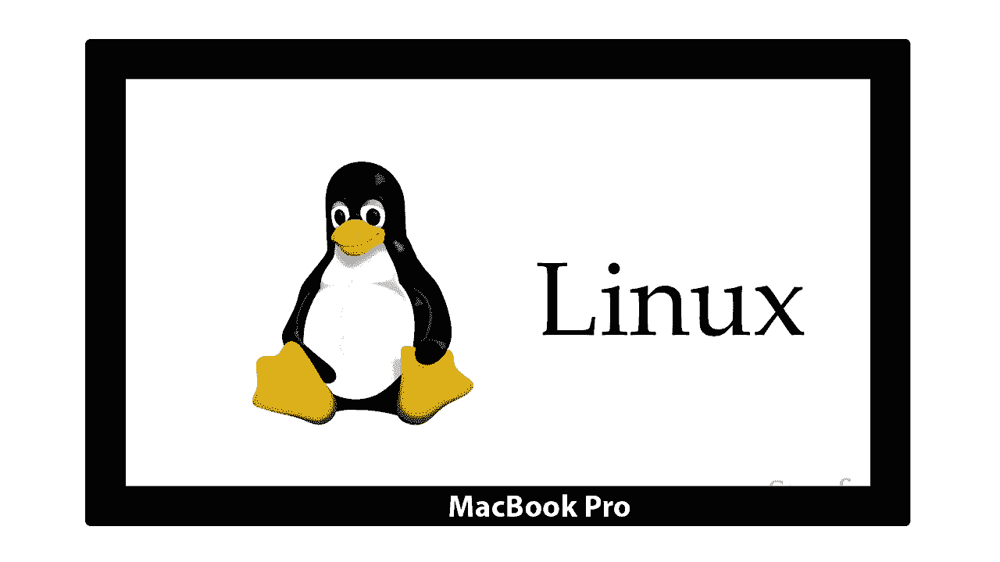

# 【双语字幕+资料下载】斯坦福CS105 ｜ 计算机科学导论(2021最新·完整版) - P15：L4.1- 电脑硬件：总览 - ShowMeAI - BV1eh411W72E

undefined，欢迎来到，欢迎来到，今天的视频是计算机硬件的第一部分，今天的视频是计算机硬件的第一部分，undefined，undefined，和本视频中的概述我们，和本视频中的概述我们。

将了解计算机硬件的基础知识，将了解计算机硬件的基础知识，undefined，undefined，我认为我们应该从一个自然的地方，我认为我们应该从一个自然的地方，开始确保我们都在，开始确保我们都在。

船上 计算机硬件到底是什么，船上 计算机硬件到底是什么，undefined，undefined。

所以我们在，undefined，undefined，计算硬件（物理，计算硬件（物理，设备和软件）之间有这种区别，设备和软件）之间有这种区别，我认为每个人都在，我认为每个人都在，某种本能层面上。

某种本能层面上，理解软件是我们添加到计算机中的这些程序，undefined，undefined，例如 我发现我，例如 我发现我，需要录制，需要录制，本季度的所有讲座，我，本季度的所有讲座，我。

可能会决定，可能会决定，哦，我听说 Premiere Pro 是一个，哦，我听说 Premiere Pro 是一个，非常棒的视频编辑程序，我应该，非常棒的视频编辑程序，我应该，继续获取它的。

继续获取它的，副本，这样我就可以继续，副本，这样我就可以继续，购买它了 将它安装在我的，购买它了 将它安装在我的，电脑上，电脑上，这样我想我们都明白这一点，这样我想我们都明白这一点，但实际上，但实际上。

有很多东西是我们电脑不可或缺的，有很多东西是我们电脑不可或缺的。

或者我们认为它是，或者我们认为它是，我们电脑不可或缺的一部分，但实际上并不属于 o 如果，我们电脑不可或缺的一部分，但实际上并不属于 o 如果，是计算机硬件，那么，是计算机硬件，那么。

我可以从商店购买 macbook pro，我可以从商店购买 macbook pro，我自然认为它，我自然认为它，是 macintosh 的事实，是 macintosh 的事实，自然是计算机的一部分，但。

自然是计算机的一部分，但，实际上我可以带上那台，实际上我可以带上那台，macbook pro，macbook pro，计算机，我实际上可以更换，计算机，我实际上可以更换，系统软件，系统软件。

使用 Windows 所以假设我开始，使用 Windows 所以假设我开始，在实验室工作，结果该实验室，在实验室工作，结果该实验室，需要我使用一些软件，我，需要我使用一些软件，我。

无法在我的 macintosh 上运行它，无法在我的 macintosh 上运行它，因为它不能在 mac os 上运行我实际上可以，undefined，undefined。

用 microsoft 替换 mac os  windows 在我的，用 microsoft 替换 mac os  windows 在我的，macbook pro 硬件上。

macbook pro 硬件上，那是因为操作系统，那是因为操作系统，undefined，undefined，实际上也是软件，所以这些是，实际上也是软件，所以这些是，我们，我们。

认为是计算机不可或缺的一部分的指令，认为是计算机不可或缺的一部分的指令，实际上，实际上，它们不是，它们只是类似地在硬件上运行的指令，undefined，undefined，如果我决定，如果我决定。

将我的笔记本电脑带到这里并将其变成，将我的笔记本电脑带到这里并将其变成，某种服务器，并且我想，某种服务器，并且我想，undefined，undefined，为它获得 linux 软件，我可以继续。

为它获得 linux 软件，我可以继续，用 linux 替换 mac os，用 linux 替换 mac os，再次那是因为，再次那是因为，系统软件，系统软件，是可替换的，这是一，是可替换的，这是一。

组，组，运行在硬件之上的指令，所以，运行在硬件之上的指令，所以，我们区分了软件和，我们区分了软件和，硬件，硬件，我们区分了，我们区分了，应用软件，应用软件，和系统软件，我们，和系统软件，我们。

将仔细研究，将仔细研究，系统软件和，系统软件和，操作系统在另一个讲座中 好吧，操作系统在另一个讲座中 好吧，让我们开始 让我们专注于硬件，让我们开始 让我们专注于硬件，本身，本身，我们区分三大。

我们区分三大，类硬件 我们有，类硬件 我们有，处理，处理，主要是，主要是，中央处理器，然后，中央处理器，然后，我们有内存，它由两种，我们有内存，它由两种，类型的，类型的，内存组成 有主存储器和。

内存组成 有主存储器和，辅助存储器，辅助存储器，其中主存储器通俗地，其中主存储器通俗地，被认为是 ram，被认为是 ram，尽管事实，尽管事实，证明它不仅仅是 ram，证明它不仅仅是 ram。

和辅助存储器是，和辅助存储器是，诸如固态驱动器，诸如固态驱动器，和硬盘驱动器闪存之类的东西，和硬盘驱动器闪存之类的东西，基本上是区别 在，基本上是区别 在，主内存和二级，主内存和二级。

内存之间是主内存是我们，内存之间是主内存是我们，参考的 因为易失所以断电，参考的 因为易失所以断电，undefined，undefined，我丢失了，我丢失了，主存储器中的所有信息辅助存储器是。

主存储器中的所有信息辅助存储器是，非易失性，非易失性，这意味着即使我完全，这意味着即使我完全，断电，断电，辅助存储器中的信息仍然很好，辅助存储器中的信息仍然很好，另一个主要区别是，另一个主要区别是。

主存储器很多 比，主存储器很多 比，辅助存储器快得多，因为您可能想知道，辅助存储器快得多，因为您可能想知道，为什么我们不很好地使用这种，为什么我们不很好地使用这种，非易失性存储器答案是。

非易失性存储器答案是，因为它现在要慢得多，因为它现在要慢得多，我还应该在此强调，我还应该在此强调，现在这种区分，现在这种区分，主存储器和辅助存储器或更，主存储器和辅助存储器或更，明确的是，明确的是。

易失性与非- 易失性内存，易失性与非- 易失性内存，有点隐藏，因为我们习惯于，undefined，undefined，让我们的笔记本电脑、手机或，让我们的笔记本电脑、手机或，平板电脑进入睡眠状态。

平板电脑进入睡眠状态，然后再打开它们，一切，然后再打开它们，一切，仍然和以前一样，仍然和以前一样，事实证明，当我们把电脑放在，undefined，undefined，undefined。

undefined，如果电池完全耗尽，如果电池完全耗尽，undefined，undefined，您将丢失所有信息，您将丢失所有信息，因此，除了处理，因此，除了处理，和内存之外，还有输入输出，和内存之外。

还有输入输出，其中，其中，包括明显的显示、，包括明显的显示、，键盘、鼠标（如果你有的话），还，键盘、鼠标（如果你有的话），还，包括打印机，包括打印机，和扫描仪等外部设备，和扫描仪等外部设备。

我还应该提到，虽然我，我还应该提到，虽然我，主要是 这里将重点放在，主要是 这里将重点放在，笔记本电脑和台式机上，笔记本电脑和台式机上，智能手机和平板电脑的工作方式，智能手机和平板电脑的工作方式。

几乎完全相同 它们，几乎完全相同 它们，在主内存和辅助内存之间具有完全相同的区别，undefined，undefined，他们拥有带有，他们拥有带有，中央处理单元的处理器，中央处理单元的处理器。

现代智能手机和平板电脑也，现代智能手机和平板电脑也，具有图形处理功能 单元，具有图形处理功能 单元，然后最后在输入输出方面有一些东西，undefined，undefined，我想从某种意义上说，显示器。

我想从某种意义上说，显示器，既充当，既充当，智能手机和平板电脑的输出又充当输入，智能手机和平板电脑的输出又充当输入，但除了这些，但除了这些，类型的计算机之外，还有，类型的计算机之外，还有，所谓的嵌入式。

所谓的嵌入式，计算机或 嵌入式系统和，计算机或 嵌入式系统和，嵌入式计算机是在，嵌入式计算机是在，undefined，undefined，我们的汽车之类的东西内部运行的，我们的汽车之类的东西内部运行的。

计算机 你知道我们的汽车有计算机，计算机 你知道我们的汽车有计算机，可以跟踪，可以跟踪，不同的输入，比如发动机有多热，undefined，undefined，你知道我有多少燃料我有多少。

你知道我有多少燃料我有多少，用户，用户，踩油门的力度，踩油门的力度，这些都是，这些都是，进入嵌入式计算机的输入，进入嵌入式计算机的输入，在你的车里面，输出，在你的车里面，输出，就像，就像，你知道。

你知道，我应该让多少汽油流入发动机这样，我应该让多少汽油流入发动机这样，的东西，所以，的东西，所以，除了，除了，台式机、笔记本电脑、智能手机，台式机、笔记本电脑、智能手机，undefined。

undefined，和我们的平板电脑之外，还有很多很多不同的电脑，所以我是什么，和我们的平板电脑之外，还有很多很多不同的电脑，所以我是什么，我现在要做的是，我现在要做的是，我们已经用，我们已经用。

中央处理单元和我们的图形，中央处理单元和我们的图形，处理单元处理了，处理单元处理了，我们已经用，我们已经用，主存储器和辅助存储器检查了我们的内存，主存储器和辅助存储器检查了我们的内存。

现在我想做的是看看，现在我想做的是看看，这些不同的组件是如何的，这些不同的组件是如何的，undefined，undefined，当我执行一些基本的，当我执行一些基本的，计算任务时播放所以让我们从。

计算任务时播放所以让我们从，我要安装一个应用程序开始所以我，我要安装一个应用程序开始所以我，之前提到嘿我需要，之前提到嘿我需要，掌握 Premiere Pro 那是。

掌握 Premiere Pro 那是，什么 所有将涉及到，什么 所有将涉及到，好的 Premiere Pro 包含一堆，好的 Premiere Pro 包含一堆，不同的说明，不同的说明。

所以我需要保留这些，所以我需要保留这些，说明并将它们放到我的，说明并将它们放到我的，计算机上，计算机上，所以我将继续下载，所以我将继续下载，这些说明的副本，这些说明的副本。

然后我要去 现在要在我的计算机上安装，然后我要去 现在要在我的计算机上安装，结果证明很多次当我，结果证明很多次当我，安装这些，安装这些，程序时，我实际上是，程序时，我实际上是。

通过 Internet 获取的程序，或者有时，通过 Internet 获取的程序，或者有时，当我购买 cd-rom 或 dvd 时，当我购买 cd-rom 或 dvd 时，它是一个程序的副本 实际上。

这些，它是一个程序的副本 实际上，这些，程序实际上是经过，程序实际上是经过，压缩的，所以我们上周讨论了，压缩的，所以我们上周讨论了，压缩，压缩，特别是如果您是通过互联网安装的。

特别是如果您是通过互联网安装的，但有时，但有时，当您从 dvd 或 cd 安装时，当您从 dvd 或 cd 安装时，文件也会被压缩以，文件也会被压缩以，允许它通过，允许它通过，互联网传输 呃。

互联网传输 呃，你知道占用更少的空间，这，你知道占用更少的空间，这，让那些付费提供这些文件的人更便宜，undefined，undefined，所以当他们来到你的电脑时，所以当他们来到你的电脑时。

他们确实需要解压缩，他们确实需要解压缩，有时有一个两步过程，有时有一个两步过程，它是 li  ke，它是 li  ke，实际上将所有文件解压缩到，实际上将所有文件解压缩到，您的硬盘驱动器上。

您的硬盘驱动器上，然后在它们被减少之后，然后在它们被减少之后，您必须运行一个额外的，您必须运行一个额外的，安装程序，这就是那个，undefined，undefined，um 的情况，所以，um 的情况。

所以，我需要获取我需要的文件，以便将安装文件，我需要获取我需要的文件，以便将安装文件，放到我的 计算机，我需要，放到我的 计算机，我需要，解压缩它们并将指令，解压缩它们并将指令，放到我的计算机上。

放到我的计算机上，这些指令因为它们是，这些指令因为它们是，我想要保留的东西，我想要保留的东西，即使我的计算机电源，即使我的计算机电源，关闭，因此这些指令需要继续，关闭，因此这些指令需要继续。

undefined，undefined，在我的辅助存储设备上，无论，在我的辅助存储设备上，无论，它是 固态驱动器或硬盘，它是 固态驱动器或硬盘，最终我完成安装后的指令，undefined。

undefined，undefined，将在我运行应用程序后的辅助存储设备上，将在我运行应用程序后的辅助存储设备上，发生的情况是，发生的情况是，需要将指令复制到，需要将指令复制到，主内存中，因为结果是。

主内存中，因为结果是，中央处理 单元，中央处理 单元，无法直接访问，无法直接访问，硬盘，硬盘，或固态驱动器上的内容，因此如果我的，或固态驱动器上的内容，因此如果我的，程序实际上要执行而。

程序实际上要执行而，不是程序 刚刚安装，不是程序 刚刚安装，在我的电脑上，我实际上并没有，在我的电脑上，我实际上并没有，运行它，运行它，如果它安装在我的电脑上，我，如果它安装在我的电脑上，我。

实际上并没有运行它，那么，undefined，undefined，undefined，当我实际双击它，当我实际双击它，或点击它时，说明就在硬盘或这个 ssd 上 在我的手机上，它，或点击它时。

说明就在硬盘或这个 ssd 上 在我的手机上，它，启动时，指令，启动时，指令，undefined，undefined，将从固态驱动器或，将从固态驱动器或，硬盘中复制，它们将复制，硬盘中复制，它们将复制。

到主内存中，现在就文档而言，它们实际上，到主内存中，现在就文档而言，它们实际上，可以通过 cpu 访问，可以通过 cpu 访问，假设，假设，undefined，undefined，我决定打开一个。

我决定打开一个，Microsoft Word 文档，Microsoft Word 文档，当我不直接从程序访问这些文档时，undefined，undefined，它们也将位于该辅助，它们也将位于该辅助。

存储设备中，因为，存储设备中，因为，我想保留对，我想保留对，人文科学的介绍 如果，人文科学的介绍 如果，undefined，undefined，undefined，计算机关闭并断电，计算机关闭并断电。

我想在计算机关闭后，undefined，undefined，undefined，undefined，保留它，保留它，在 cpu 中无法直接，在 cpu 中无法直接，undefined。

undefined，从辅助存储设备访问事物，因此，undefined，undefined，我的论文的所有内容都需要复制到主，我的论文的所有内容都需要复制到主，内存中，因此，内存中，因此。

当我与它进行交互时，当我继续，当我与它进行交互时，当我继续，操作时，它在主内存中，操作时，它在主内存中，并保存它 它将，并保存它 它将，所有内容从主内存，所有内容从主内存，复制到二级存储 所以我们确实。

复制到二级存储 所以我们确实，需要了解，需要了解，主内存，主内存，和二级存储之间的区别 现在出现的一个，和二级存储之间的区别 现在出现的一个，问题，问题，是我怎么知道你知道我的计算机。

是我怎么知道你知道我的计算机，没有，没有，像 我想，像 我想，我应该怎么做我需要，我应该怎么做我需要，更多的主内存还是我需要更多的，更多的主内存还是我需要更多的，二级，二级。

存储一般来说如果你存储大量数据你将需要更多的，存储一般来说如果你存储大量数据你将需要更多的，二级存储，undefined，undefined，所以让我们说例如嗯，所以让我们说例如嗯。

你决定你想成为 av logger 所以，你决定你想成为 av logger 所以，你会去做，你会去做，我猜他们被称为 vloggers 你想要，我猜他们被称为 vloggers 你想要。

让我们说你决定你可以成为，让我们说你决定你可以成为，一个 vlogger，一个 vlogger，你会有一大堆，你会有一大堆，视频 将采取，视频 将采取，现在有很多空间，现在有很多空间，如果你同时。

如果你同时，播放所有视频，那么你不会同时播放所有视频，播放所有视频，那么你不会同时播放所有视频，那么它们都需要在主内存中，那么它们都需要在主内存中，但你没有播放它 在，undefined。

undefined，您创建和编辑其中一个的同时，您创建和编辑其中一个的同时，您当然不想丢失它，因此，您当然不想丢失它，因此，您需要存储它，您创建并添加，您需要存储它，您创建并添加，另一个，另一个。

因此如果您有很多视频文件，因此如果您有很多视频文件，则需要更多的辅助存储，则需要更多的辅助存储，无论您是需要，无论您是需要，更大的 ssd 还是您有很多东西，更大的 ssd 还是您有很多东西。

结果证明购买，结果证明购买，存储和硬盘更便宜，因此您可以，存储和硬盘更便宜，因此您可以，继续购买硬盘并另一方面存储硬盘，继续购买硬盘并另一方面存储硬盘，undefined，undefined。

如果您愿意的话' 一次运行，如果您愿意的话' 一次运行，大量程序，大量程序，我看到很多学生这样，我看到很多学生这样，做，如果你，做，如果你，一次运行一大堆程序，一次运行一大堆程序。

那么你需要获得更多的主内存，那么你需要获得更多的主内存，这样你就知道是否可以将主内存加倍，这样你就知道是否可以将主内存加倍，undefined，undefined，你会发现你的，你会发现你的。

程序运行效率更高，程序运行效率更高，因为，因为，嗯 基本上，一次可以有多少程序作为主内存是有限制的，undefined，undefined，并且有一个，并且有一个，叫做虚拟内存的系统，我们稍后会讨论它。

undefined，undefined，你知道如果你有太多的，你知道如果你有太多的，程序无法放入主内存，它可以，程序无法放入主内存，它可以，计算机仍然可以运行，但，计算机仍然可以运行，但。

它正在使用虚拟内存，它正在使用虚拟内存，这真的会减慢速度，这真的会减慢速度，而且很多学生，而且很多学生，为他们拥有的主内存量运行了太多程序，undefined。

