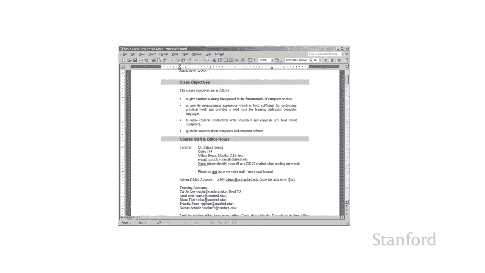
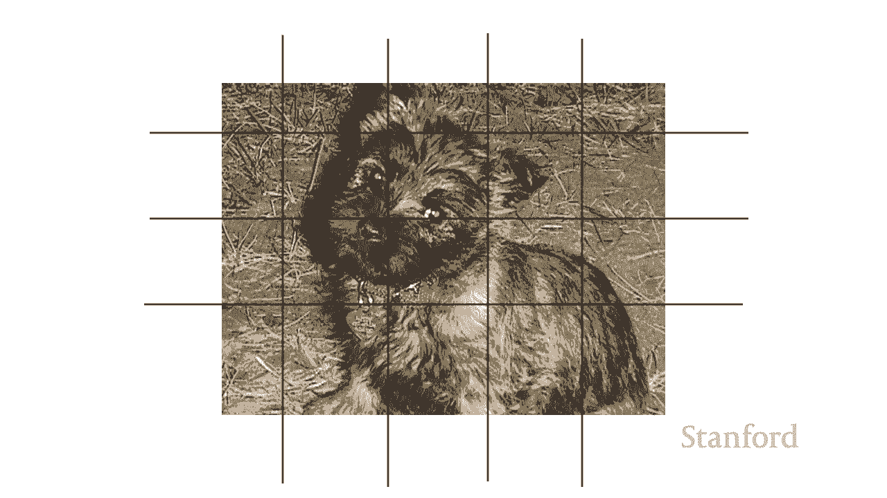

# 【双语字幕+资料下载】斯坦福CS105 ｜ 计算机科学导论(2021最新·完整版) - P16：L4.2- 电脑硬件：处理过程近观 - ShowMeAI - BV1eh411W72E

undefined，欢迎探索计算，欢迎探索计算，今天的视频是计算机硬件第二，今天的视频是计算机硬件第二，部分，部分，在这个视频中仔细看看处理 我想仔细，在这个视频中仔细看看处理 我想仔细，看看，看看。

我们计算机的处理组件，正如我们，我们计算机的处理组件，正如我们，在上一个视频中看到的那样，在上一个视频中看到的那样，处理是最重要的，处理是最重要的，组件之一，组件之一，您可能知道最重要的。

您可能知道最重要的，处理组件是，处理组件是，中央处理器或 cpu，中央处理器或 cpu，但实际上这里还有更多内容，但实际上这里还有更多内容，所以我想，所以我想，首先强调一些事情，首先强调一些事情，以便。

以便，每个人都清楚我们的内容。每个人都清楚我们的内容。如果你有一台电脑，如果你有一台电脑，这里是一些，这里是一些，你可能会遇到的处理器的常用名称，你可能会遇到的处理器的常用名称，如果你有，如果你有。

英特尔处理器，消费级计算机上最常见的英特尔处理器，英特尔处理器，消费级计算机上最常见的英特尔处理器，是，是，酷睿 i3 酷睿 i5 酷睿 i7 和酷睿 i9。

酷睿 i3 酷睿 i5 酷睿 i7 和酷睿 i9，如果你有一台配备 amd 处理器的电脑，那么，如果你有一台配备 amd 处理器的电脑，那么，undefined，undefined。

它们的普通消费级 CPU，它们的普通消费级 CPU，是 ryzen 和 athlon，是 ryzen 和 athlon，现在关于 CPU 的一个问题，现在关于 CPU 的一个问题。

是 CPU 往往是一个很大的瓶颈，是 CPU 往往是一个很大的瓶颈，正如我们所见 处理，正如我们所见 处理，通过 cpu 所以为了，通过 cpu 所以为了，真正做，真正做，任何 cpu 必须做的事情。

所有的工作，任何 cpu 必须做的事情，所有的工作，内存都可以记住事情，但，内存都可以记住事情，但，最终为了让我们的计算机，最终为了让我们的计算机，真正，真正，充当计算机设备，cpu 现在。

充当计算机设备，cpu 现在，需要执行，需要执行，有几种方法可以解决这个问题，有几种方法可以解决这个问题，其中之一是，其中之一是，我们已经开始，我们已经开始，在某些方面诚实地获得多核 CPU 这。

在某些方面诚实地获得多核 CPU 这，不是因为我们真的需要，不是因为我们真的需要，多核而是更多，多核而是更多，因为电气工程师，undefined，undefined。

很长一段时间都不擅长让 CPU 速度更快，很长一段时间都不擅长让 CPU 速度更快，undefined，undefined，越来越快越来越快，越来越快越来越快，现在我们开始，现在我们开始。

在速度上趋于稳定，在速度上趋于稳定，所以电气工程师就像嘿我们，所以电气工程师就像嘿我们，不能让处理器更快，不能让处理器更快，但是你想要更多的处理器我们可以，但是你想要更多的处理器我们可以。

给你两个核心 我们可以给你四个，给你两个核心 我们可以给你四个，核心我们可以给你六个，核心我们可以给你六个，核心 我们给你八个核心，核心 我们给你八个核心，这是关于多核处理器的事情。

这是关于多核处理器的事情，你知道拥有几个核心很有用，你知道拥有几个核心很有用，但实际上能够，但实际上能够，利用，利用，fou  r 或六核或八核，fou  r 或六核或八核，很大程度上取决于。

很大程度上取决于，undefined，undefined，您所做的，undefined，undefined，undefined，工作类型 这实际上，工作类型 这实际上，是程序员的一个问题，因为。

是程序员的一个问题，因为，程序员通常不知道如何利用，undefined，undefined，多核处理器中的多核，所以，多核处理器中的多核，所以，如果您希望应用程序，如果您希望应用程序，快速运行。

快速运行，并且您知道自己正在，并且您知道自己正在，计算机上运行，那么理想情况下 有多个内核，计算机上运行，那么理想情况下 有多个内核，您希望您的应用程序，您希望您的应用程序，利用尽可能多的内核。

利用尽可能多的内核，这是一个问题，我认为，这是一个问题，我认为，程序员在，程序员在，这方面做得更好了，但是，这方面做得更好了，但是，您知道我记得第一个，您知道我记得第一个，视频游戏机出现时的情况。

视频游戏机出现时的情况，多和弦 这，多和弦 这，对，对，游戏，undefined，undefined，程序员来说是一笔大买卖，undefined，undefined，按，按，顺序做 o 做这八个内核。

顺序做 o 做这八个内核，所以如果我有微软的话，我，所以如果我有微软的话，我。

将用一个以上的和弦做什么，将用一个以上的和弦做什么，并不总是很清楚，但是，并不总是很清楚，但是，有些应用程序肯定，有些应用程序肯定，可以利用多核处理器，可以利用多核处理器，所以有些东西是。

所以有些东西是，多核的，undefined，undefined，如果您进行照片处理，处理器可能非常擅长，如果您进行照片处理，处理器可能非常擅长，您基本上可以将照片，您基本上可以将照片，分成不同的部分。

分成不同的部分，因此您可以让一个核心处理一个，因此您可以让一个核心处理一个。

部分，另一个核心处理另一部分，部分，另一个核心处理另一部分，第三个核心处理，第三个核心处理，我有的第三部分 这里有一点演示，所以，我有的第三部分 这里有一点演示，所以，假设我们有一张照片。

假设我们有一张照片，这是我的老狗莫莉，流动的pep 之所以这样，这是我的老狗莫莉，流动的pep 之所以这样，命名是因为，命名是因为，我在弗洛莫当了 12 年的常驻研究员，undefined。

undefined，嗯，对于任何不是斯坦福毕业生的研究生，undefined，undefined，呃，这相当于非法的，呃，这相当于非法的，管家，管家，当我在西流的时候，莫莉是我的狗，当我在西流的时候。

莫莉是我的狗，所以我想我们想把，所以我想我们想把，她的这张照片转换成，她的这张照片转换成，彩色的，我们想转换成，彩色的，我们想转换成，黑白，黑白，所以我在这里得到的是我 我有。

所以我在这里得到的是我 我有，一点 演示，undefined，undefined，使用单核然后多条线可能会是什么样子，使用单核然后多条线可能会是什么样子，我特意增加，我特意增加，了此演示的像素大小。

了此演示的像素大小，以便更清楚到底发生了什么，以便更清楚到底发生了什么，所以我们的模拟将开始展示会，所以我们的模拟将开始展示会，发生什么 使用一个，发生什么 使用一个，处理器，您可以看到这是，处理器。

您可以看到这是，有效的，有效的，我们只是继续并一次处理，我们只是继续并一次处理，每个像素，每个像素，现在如果我们切换到两个处理器，现在如果我们切换到两个处理器，您可以看到将，您可以看到将。

其拆分并说嘿顶部真的很容易，其拆分并说嘿顶部真的很容易，图片的一半，图片的一半，一个处理器 下半秒，一个处理器 下半秒，处理器 你，处理器 你，又以更快的速度增加到 4 然后最后我们。

又以更快的速度增加到 4 然后最后我们，要做，要做，8 你可以看到这真的很，8 你可以看到这真的很。

容易分解这个过程以利用，undefined，undefined，额外的内核，因为有 一种，额外的内核，因为有 一种，划分工作的明确方法，划分工作的明确方法，因此如果我们再次执行诸如。

因此如果我们再次执行诸如，天气模拟之类的任务，真的很容易，天气模拟之类的任务，真的很容易，弄清楚如何使用多个，弄清楚如何使用多个，核心来将不同的课程分配给，核心来将不同的课程分配给，不同的部分 国家。

不同的部分 国家，和实际上的超级计算机有，和实际上的超级计算机有，许多核心，例如，许多核心，例如。

数万个核心，因此除了多核处理器之外，数万个核心，因此除了多核处理器之外，它们还经常用于模拟工作，它们还经常用于模拟工作，undefined，undefined，尽管我们可以通过另一种方式。

undefined，undefined，解决 CPU 瓶颈 这就是添加，解决 CPU 瓶颈 这就是添加，专用处理器，因此，专用处理器，因此，现代计算机通常，现代计算机通常，除了，除了。

可能是多核的主中央处理单元外，可能是多核的主中央处理单元外，还具有图形处理，还具有图形处理，单元，单元，图形处理单元可能，图形处理单元可能，因消费者，undefined，undefined。

创建 3d 图形的能力而广为人知 对于这里的游戏，创建 3d 图形的能力而广为人知 对于这里的游戏，我们有刺客信条奥德赛的截图，undefined，undefined，但 gpu 也可以用于其他。

但 gpu 也可以用于其他，目的，目的，也可以用于照片或视频，也可以用于照片或视频，编辑，编辑，也可以用于，也可以用于，人工智能和神经网络，人工智能和神经网络，嗯，他们已经臭名昭著了 被，嗯。

他们已经臭名昭著了 被，用于比特币，用于比特币，挖矿实际上比特币矿工使用，挖矿实际上比特币矿工使用，图形处理单元确实，图形处理单元确实，提高了价格和游戏玩家，提高了价格和游戏玩家，对此感到有些不安。

对此感到有些不安，而且事实证明比特币矿工正在，而且事实证明比特币矿工正在，使用大量，使用大量，电力，这对环境来说真的很糟糕，电力，这对环境来说真的很糟糕，undefined，undefined。

无论如何我只是想让你，无论如何我只是想让你，了解一下流程中发生的不同，了解一下流程中发生的不同。

undefined。