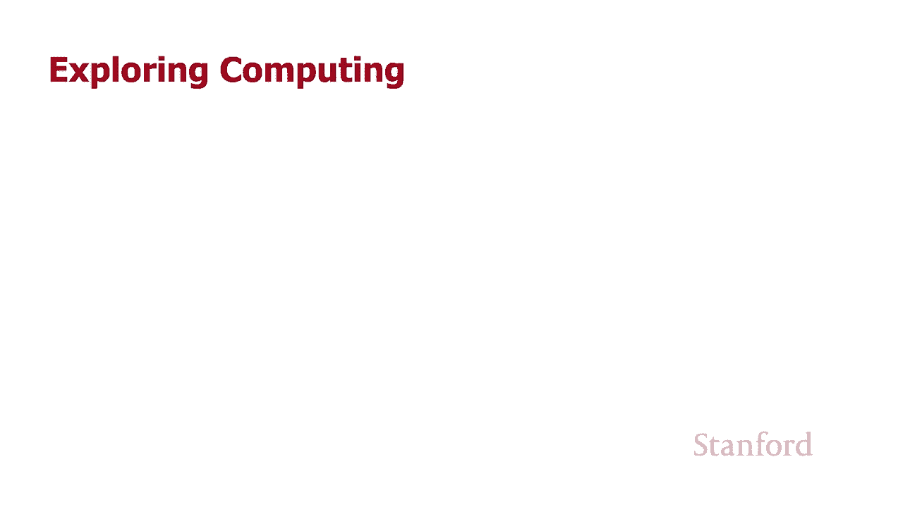
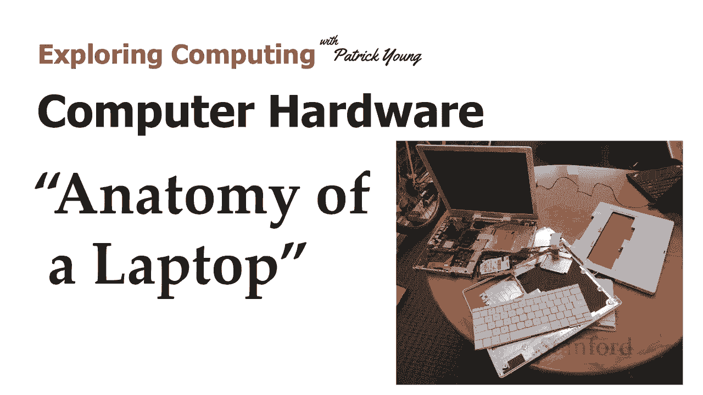

# 【双语字幕+资料下载】斯坦福CS105 ｜ 计算机科学导论(2021最新·完整版) - P17：L 4.3- 电脑硬件：笔记本电脑的剖析 - ShowMeAI - BV1eh411W72E

undefined，欢迎探索计算，欢迎探索计算，今天的视频是笔记本电脑的计算机硬件，今天的视频是笔记本电脑的计算机硬件，解剖，所以在这个视频中，解剖，所以在这个视频中，我们将拆开，undefined。

undefined，我以前的一位老师捐赠的 ibook，我以前的一位老师捐赠的 ibook，g4，undefined，undefined，undefined，当我们解剖它时，他们指向笔记本电脑的摄像机。

当我们解剖它时，他们指向笔记本电脑的摄像机，我们，我们，从该摄像机投射到教室的，从该摄像机投射到教室的，主屏幕上，这样每个人都，主屏幕上，这样每个人都，可以仔细查看实际发生，可以仔细查看实际发生。

的情况，的情况，不幸的是我绕过了那些不是一个选项的部分，不幸的是我绕过了那些不是一个选项的部分，我，我，实际上也无法访问笔记本电脑，实际上也无法访问笔记本电脑，本身，本身，所以这些都是旧照片。

所以这些都是旧照片，目前大门大楼已锁定，目前大门大楼已锁定，undefined，undefined。

，我们都不允许进入，所以让我们，我们都不允许进入，所以让我们，继续在这里看看我们的笔记本电脑，继续在这里看看我们的笔记本电脑，所以这是一部 ibook g4，它是，所以这是一部 ibook g4，它是。

关于 15 岁你也可以看到，关于 15 岁你也可以看到，它有一个严重的案例，它，它有一个严重的案例，它，有时被称为键盘斑块，有时被称为键盘斑块，我提到了这一点，因为你们中的一些人，我提到了这一点。

因为你们中的一些人，可能正在看这个思想，可能正在看这个思想，帕特里克，这有点恶心，它是，帕特里克，这有点恶心，它是，老实说，我可能应该使用，老实说，我可能应该使用，工业强度的溶剂并进行。

工业强度的溶剂并进行，一些清洁，因为，一些清洁，因为，正如我们稍后将看到的那样，这台笔记本电脑，正如我们稍后将看到的那样，这台笔记本电脑，显然永远不会被使用，因此，显然永远不会被使用，因此。

它可以进行一些严重的清洁，它可以进行一些严重的清洁，我不得不说这是，undefined，undefined，苹果的白色图案在这里可能对，苹果的白色图案在这里可能对，我们没有任何，我们没有任何，好处。

所以我们要做的，好处，所以我们要做的，就是取下键盘，就是取下键盘，取下总键盘，取下总键盘，结果证明这台特定的，结果证明这台特定的，笔记本电脑是可升级的，笔记本电脑是可升级的，这是一些，这是一些。

较大的笔记本电脑，较大的笔记本电脑，有能力更改和修改，有能力更改和修改，某些部件，某些部件，的东西，的东西，undefined，undefined，undefined，undefined。

undefined，重新设计得，重新设计得，尽可能紧凑，通常情况下，尽可能紧凑，通常情况下，它们不是它们无法维修，它们不是它们无法维修，所以这台笔记本电脑，所以这台笔记本电脑，已经足够老了。

所以它实际上最初并没有，undefined，undefined，配备 Wi-Fi，这是一个选择 所以你，配备 Wi-Fi，这是一个选择 所以你，可以取下键盘，可以取下键盘，有一个地方你可以插入。

有一个地方你可以插入，wi-fi 卡 那里的 wi-fi 卡，undefined，undefined，没有显示在这里 因为，没有显示在这里 因为，实际上有一个金属屏蔽罩在，实际上有一个金属屏蔽罩在。

上面 我们会谈谈 一秒钟之后，上面 我们会谈谈 一秒钟之后，然后在 wi-fi 所在的下方，然后在 wi-fi 所在的下方，你可以看到这个实际上，你可以看到这个实际上，确实有一个 wi-fi 卡。

确实有一个 wi-fi 卡，它就在那里，它就在那里，嗯，它已经被拉出，然后，嗯，它已经被拉出，然后，在它下面实际上是，在它下面实际上是，计算机内存，所以我可以 继续，计算机内存，所以我可以 继续。

为这台特定的笔记本电脑添加内存，为这台特定的笔记本电脑添加内存，注意金属板，注意金属板，覆盖除了，覆盖除了，机场极限 Wi-Fi，机场极限 Wi-Fi，卡和内存之外的所有东西，我们将继续把它。

卡和内存之外的所有东西，我们将继续把它，翻过来，翻过来，在角落里，在角落里，实际上是缺失的部分 电池在哪里，实际上是缺失的部分 电池在哪里，但我想在这里向您展示的主要内容。

但我想在这里向您展示的主要内容，是，如果我们再次拉开背面，是，如果我们再次拉开背面，您可以看到，undefined，undefined，笔记本电脑周围的金属板，所以这基本上，笔记本电脑周围的金属板。

所以这基本上，将完全包围笔记本电脑，将完全包围笔记本电脑，这，这，是de 标记为电磁屏蔽，是de 标记为电磁屏蔽，旨在减少，undefined，undefined。

来自笔记本电脑或进入笔记本电脑的电磁辐射量，undefined，undefined，因为我们不希望笔记本电脑，因为我们不希望笔记本电脑，干扰，干扰，该地区的其他电子设备，例如，该地区的其他电子设备。

例如，您可能已经看到 在各种电视，您可能已经看到 在各种电视，undefined，undefined，节目中，如果你，节目中，如果你，的电视上有那些兔耳天线，的电视上有那些兔耳天线，并且你试图让电视。

并且你试图让电视，正常工作，正常工作，如果你有某种，如果你有某种，电磁马达，电磁马达，或者有时是电子设备，它可以继续工作，或者有时是电子设备，它可以继续工作，并干扰它，所以，并干扰它，所以，这块，这块。

环绕整个笔记本电脑的金属板旨在减少从笔记本电脑，undefined，undefined，发出的电磁辐射量，发出的电磁辐射量，并防止出现类似，并防止出现类似，undefined，undefined。

undefined，undefined，问题 这就是，问题 这就是，它下面的内容，undefined，undefined，undefined，几分钟后我们将在左侧讨论这个绿色主板，但让我们。

几分钟后我们将在左侧讨论这个绿色主板，但让我们，先把它翻过来，先把它翻过来，好的 所以这是笔记本电脑的顶部，好的 所以这是笔记本电脑的顶部，undefined，undefined，你在插图上看到的是。

undefined，undefined，这是应该放在，这是应该放在，笔记本电脑顶部的电磁屏蔽 我，笔记本电脑顶部的电磁屏蔽 我，实际上已经在这里被移除 这是，实际上已经在这里被移除 这是，呃这个插图。

呃这个插图，显然来自 另一张照片好的，显然来自 另一张照片好的，所以这里是所有不同的部分，所以这里是所有不同的部分，嗯，我认为这里有几个部分，嗯，我认为这里有几个部分，值得一提，我们将，值得一提。

我们将，undefined，undefined，在概述中快速浏览一下，在概述中快速浏览一下，然后我们将，然后我们将，详细介绍 每个都，详细介绍 每个都，可以，所以这里有一个泰坦镜头 那个，可以。

所以这里有一个泰坦镜头 那个，小 U 形金属物体就在那里，小 U 形金属物体就在那里，它实际上是 wi-fi 防护罩，所以，它实际上是 wi-fi 防护罩，所以，这就是我们刚刚拍摄时应该。

这就是我们刚刚拍摄时应该，在上一张镜头中的 wi-fi 卡下的东西，在上一张镜头中的 wi-fi 卡下的东西，打开，打开，键盘，键盘，我不知道为什么它不在，我不知道为什么它不在，照片中，但它不在。

照片中，但它不在，照片中，但实际上是，照片中，但实际上是，在可访问的内存之间，在可访问的内存之间，因此您可以取下，因此您可以取下，键盘，键盘，那里将有 wi-fi 插槽 那么。

那里将有 wi-fi 插槽 那么，就会有这个 wi-fi，就会有这个 wi-fi，屏蔽 然后在 wi-fi，屏蔽 然后在 wi-fi，屏蔽下面是内存，屏蔽下面是内存，wi-fi 卡在屏蔽外面。

wi-fi 卡在屏蔽外面，因为它确实需要发送，因为它确实需要发送，信号，信号，旁边是一个叫做，旁边是一个叫做，散热器的东西，我们将详细，散热器的东西，我们将详细，讨论这个 一分钟后，讨论这个 一分钟后。

然后在照片下方或就，然后在照片下方或就，在散热器下方，在散热器下方，undefined，undefined，呃是硬盘驱动器或硬盘，呃是硬盘驱动器或硬盘，它实际上位于，它实际上位于，电池应该去的位置我。

电池应该去的位置我，不知道为什么它坐在，不知道为什么它坐在，那里 特别的照片，那里 特别的照片，它的正确位置在最左边，它的正确位置在最左边，橙色电缆，橙色电缆，undefined，undefined。

实际上是数据在，实际上是数据在，应该连接到，应该连接到，undefined，undefined，然后是左侧的整个区域，然后是左侧的整个区域，即主板，即主板，和 我们，和 我们，将更深入地查看每一个。

将更深入地查看每一个，还有背面视图，还有背面视图，undefined，undefined，我们在，我们在，主照片左侧看到的，主照片左侧看到的，主板与图 1 中所示的，主板与图 1 中所示的。

主板完全相同 笔记本电脑背面的插图，主板完全相同 笔记本电脑背面的插图，undefined，undefined，好的，所以这是硬盘驱动器或硬盘，好的，所以这是硬盘驱动器或硬盘，undefined。

undefined，驱动器和磁盘之间的区别，驱动器和磁盘之间的区别，在这种情况下并不是特别重要，在这种情况下并不是特别重要，但这里的区别，但这里的区别，是驱动器是包含磁盘的东西，undefined。

undefined，由于硬盘驱动器中永久有磁盘，由于硬盘驱动器中永久有磁盘，undefined，undefined，因此硬盘驱动器和硬盘在，因此硬盘驱动器和硬盘在，很大程度上是同义词，但您可以想到。

很大程度上是同义词，但您可以想到，例如，例如，我有一个蓝光驱动器，它是，我有一个蓝光驱动器，它是，我将蓝光光盘放入的设备，我将蓝光光盘放入的设备，因此在这种情况下驱动器 是，因此在这种情况下驱动器 是。

undefined，undefined，您将光盘放入的东西，并且，您将光盘放入的东西，并且，您有各种蓝光，您有各种蓝光，光盘 硬盘驱动器 磁盘永久，光盘 硬盘驱动器 磁盘永久，卡在其中，卡在其中。

因此您或多或少可以，因此您或多或少可以，在这里看到磁盘本身，在这里看到磁盘本身，它由许多 不同的，它由许多 不同的，盘片在这里查看顶部盘片，盘片在这里查看顶部盘片，undefined。

undefined，这些盘片以非常，这些盘片以非常，高，高，的速度旋转，盘片，的速度旋转，盘片，旋转的速度越快，我们访问数据的速度就越快，undefined，undefined，undefined。

undefined，这些是读写 h  eads，这些是读写 h  eads，它们应该是，它们应该是，你可以看到盘子下方的那种，你可以看到盘子下方的那种，V 形，V 形，标题，标题，实际上应该是。

实际上应该是，顶部的另一个，undefined，undefined，在我们的一次演示中弯曲并折断 所以，在我们的一次演示中弯曲并折断 所以，那不再是我们，而是，那不再是我们，而是，基本上没有显示的尖端。

它，基本上没有显示的尖端，它，在磁盘下方，在磁盘下方，那里是磁性读写头所在的地方，undefined，undefined，整个组件移入移出，整个组件移入移出，通过移入移出并，通过移入移出并。

围绕我们旋转磁盘，围绕我们旋转磁盘，” 重新能够访问，” 重新能够访问，盘片的每个单独部分，盘片的每个单独部分，我们可以磁化它，或者我们可以阅读，我们可以磁化它，或者我们可以阅读，该部分是如何磁化的。

该部分是如何磁化的，这就是我们如何，这就是我们如何，在这种特定类型的设备上开始我们的位，在这种特定类型的设备上开始我们的位，好吧，所以你们中的一些人可能会喜欢，好吧，所以你们中的一些人可能会喜欢。

为什么我们要看硬盘 这是，为什么我们要看硬盘 这是，旧技术实际上它，旧技术实际上它，取决于，取决于，您尝试做什么 硬盘可能，您尝试做什么 硬盘可能，仍然比，仍然比，ssd 驱动器更实用，因为它们。

ssd 驱动器更实用，因为它们，每字节更便宜，所以如果您有一个 lo  t 字节，每字节更便宜，所以如果您有一个 lo  t 字节，你可能更适合硬盘所以，你可能更适合硬盘所以，人们会使用，人们会使用。

硬盘，如果他们有很多，硬盘，如果他们有很多，视频，视频，嗯说他们正在远程录制很多，嗯说他们正在远程录制很多，讲座，讲座，或者一个更好的例子是他们将，或者一个更好的例子是他们将，它用于视频之类的东西。

它用于视频之类的东西，监控您有，监控您有，源源不断的视频输入 您，源源不断的视频输入 您，想要存储，想要存储，所有需要大量数据，所有需要大量数据，存储的东西，存储的东西，使用，使用，硬盘或硬盘驱动器比。

硬盘或硬盘驱动器比，使用固态驱动器便宜得多，使用固态驱动器便宜得多，现在这是一个固态驱动器，我，现在这是一个固态驱动器，我，实际上没有这些照片，实际上没有这些照片，我现在没有固态硬盘。

我现在没有固态硬盘，我准备为她的演示牺牲，我准备为她的演示牺牲，但结果是，但结果是，维基共享资源上有几张照片所以，维基共享资源上有几张照片所以，嗯学分 因为这些照片将，嗯学分 因为这些照片将。

在演示的最后，在演示的最后，呃，这就是，呃，这就是，固态硬盘的样子，你可以，固态硬盘的样子，你可以，看到，看到，呃，左上角的视图是外部，呃，左上角的视图是外部，视图，视图，右下角的视图是当你。

右下角的视图是当你，真正拉开盖子的时候，真正拉开盖子的时候，里面有什么 d 你可以看到它看起来，里面有什么 d 你可以看到它看起来，与主板非常相似，与主板非常相似，我们将在几分钟内讨论这个。

我们将在几分钟内讨论这个，但那是一块印刷电路，但那是一块印刷电路，板，上面有一堆，板，上面有一堆，电脑芯片，所以基本上，电脑芯片，所以基本上，ssd，ssd，很无聊，它只是一堆，很无聊，它只是一堆。

电脑 芯片，这就是，电脑 芯片，这就是，为什么在许多方面 ssd 比，undefined，undefined，硬盘好 芯片比，硬盘好 芯片比，机械设备快得多，机械设备快得多，而且它更不容易受到。

而且它更不容易受到，诸如振动之类的事情的影响，所以，undefined，undefined，如果我的笔记本电脑有硬盘驱动器，我总是会感到紧张 如果，undefined，undefined。

我在移动笔记本电脑时尝试使用它，但，我在移动笔记本电脑时尝试使用它，但，使用 ssd 时没有移动部件，因此，使用 ssd 时没有移动部件，因此，它更可靠，它更可靠，undefined。

undefined，好吧，让我们回到这里的概述，好吧，让我们回到这里的概述，undefined，undefined，和 这是上一个镜头中主板的近距离视图，undefined，undefined。

散热器未处于正确，散热器未处于正确，位置 现在散热器处于，位置 现在散热器处于，正确位置 中间的那个大金属，正确位置 中间的那个大金属，东西，东西，您可以 还可以看到它右侧的内存芯片。

undefined，undefined，我们将继续，我们将继续，在这里取下散热器，在这里取下散热器，所以让我们谈谈，所以让我们谈谈，散热器，散热器，呃，如果你看这里的图像，你可以，呃。

如果你看这里的图像，你可以，看到我们' 有散热器，看到我们' 有散热器，然后在，然后在，右上角，实际上是一个风扇，右上角，实际上是一个风扇，因此散热器的作用，因此散热器的作用，是它实际上位于。

是它实际上位于，主板上产生，主板上产生，最多热量的芯片顶部，而您需要一个散热片，最多热量的芯片顶部，而您需要一个散热片，导电，所以某种，导电，所以某种，金属可以很好地导热，金属可以很好地导热。

你希望它具有最大的，你希望它具有最大的，表面积，然后你想在上面吹，表面积，然后你想在上面吹，风扇来尝试，风扇来尝试，将热量传导出去，这样最大的表面积来，将热量传导出去，这样最大的表面积来。

最大化可以的热量，最大化可以的热量，取下它，取下它，然后是某种风扇系统，然后是某种风扇系统，所以我们在这里看到的，所以我们在这里看到的，是，您可以看到位于此图像，是，您可以看到位于此图像。

左侧的笔记本电脑的散热器，undefined，undefined，实际上确实连接到另一个，实际上确实连接到另一个，大金属部分 就，大金属部分 就，在风扇旁边 然后在，在风扇旁边 然后在，右侧 这是台式。

右侧 这是台式，计算机散热器，undefined，undefined，undefined，undefined，undefined，的示例 非常大 经常很重，的示例 非常大 经常很重，好吧，好吧，嗯。

但让我们先谈谈主板，嗯，但让我们先谈谈主板，本身，本身，所以主板本身就是，所以主板本身就是，undefined，undefined，印刷电路板，我们在一，印刷电路板，我们在一。

分钟前看到了带有 ssd 驱动，分钟前看到了带有 ssd 驱动，器的印刷电路板，所以印刷电路板，器的印刷电路板，所以印刷电路板，基本上有绿色，基本上有绿色，基板，一切都在 那是，基板，一切都在 那是。

不导电的，这意味着，不导电的，这意味着，电信号不能通过，电信号不能通过，绿色基板，然后我们要做的，绿色基板，然后我们要做的，是在绿色基板的顶部蚀刻或，是在绿色基板的顶部蚀刻或，层压，层压。

可以导电的细线，可以导电的细线，这就是我们发送，这就是我们发送，信号和电流的方式 我们的，信号和电流的方式 我们的，电脑，电脑，和我在这里得到的是这两个，和我在这里得到的是这两个，模块，模块。

下面的这两个插图实际上，下面的这两个插图实际上，显示了，显示了，内存模块的一部分，我正在使用，内存模块的一部分，我正在使用，因为我有照片，因为我有照片，通常我们实际上是拿，通常我们实际上是拿。

主板然后把它传来传去，这样人们，主板然后把它传来传去，这样人们，就可以看到它的真实，就可以看到它的真实，样子，样子，显然我们不能这样做，但我认为，显然我们不能这样做，但我认为，这两张照片做得。

这两张照片做得，很好，让人更接近 仔细，很好，让人更接近 仔细，观察印刷电路板的，观察印刷电路板的，实际外观，再次，实际外观，再次，是绿色基板，是绿色基板，然后我们将一些计算机芯片。

然后我们将一些计算机芯片，连接到印刷电路板上，连接到印刷电路板上，然后您可以看到我们已经将这些，然后您可以看到我们已经将这些，精细，精细，蚀刻或层压在金属上 线路，蚀刻或层压在金属上 线路，穿过。

这实际上是我们的，undefined，undefined，电信号正常的地方，所以回到，电信号正常的地方，所以回到，undefined，undefined，顶部的主板，我们有 CPU 或中央处理器。

undefined，undefined，然后在底部我们有，然后在底部我们有，图形芯片，图形芯片，它们都会产生大量，它们都会产生大量，的热量，的热量，所以 这就是为什么我们在上面安装了散热器。

undefined，undefined，这，这，是台式电脑中央处理器的照片，是台式电脑中央处理器的照片，我们实际上无法取出笔记本电脑的，我们实际上无法取出笔记本电脑的，CPU 所以，CPU 所以。

这是我的旧办公电脑之一，这是我的旧办公电脑之一，用于台式计算机的 ters cpus cpus，用于台式计算机的 ters cpus cpus，通常是可升级的，因此，通常是可升级的，因此，它们旨在实际。

它们旨在实际，拉出 拉出有一个插槽，您，拉出 拉出有一个插槽，您，实际上可以将 cpu 拉出并，实际上可以将 cpu 拉出并，更换为不同的 cpu，更换为不同的 cpu，笔记本电脑通常不是为此而设计的。

笔记本电脑通常不是为此而设计的，而 cpu 是 将直接焊接，而 cpu 是 将直接焊接，undefined，undefined，到主板上，但我真的很喜欢这些，到主板上，但我真的很喜欢这些，照片，照片。

它确实显示了信息是如何，它确实显示了信息是如何，打开和，打开和，关闭 cpu 的，所以我们在这里看到所有这些引脚，关闭 cpu 的，所以我们在这里看到所有这些引脚，并且这些引脚中的每。

并且这些引脚中的每，一个都首先用于多种目的，一个都首先用于多种目的，之一 那里有几个引脚，之一 那里有几个引脚，只是为了供电，所以，只是为了供电，所以，你知道我们的中央处理器，你知道我们的中央处理器。

确实需要供电，确实需要供电，我还应该提到，这，我还应该提到，这，实际上是，实际上是，实际计算机芯片周围的封装，实际计算机芯片周围的封装，所以我们实际上看不到，所以我们实际上看不到。

它在陶瓷封装内的计算机芯片，它在陶瓷封装内的计算机芯片，有细线连接，有细线连接，实际，实际，芯片，这又在，芯片，这又在，我们在这里看到的内部，有细线，我们在这里看到的内部，有细线，将它连接到。

将它连接到，我们实际看到的每个引脚上，我们实际看到的每个引脚上，但是这些引脚用于获取 CPU 上和下的电源，但是这些引脚用于获取 CPU 上和下的电源，数据和地址信息以及控制信。

数据和地址信息以及控制信，undefined，undefined，undefined，undefined，undefined，undefined，undefined，所以，所以，一大堆这些引脚将发送。

一大堆这些引脚将发送，地址信息，所以我将，地址信息，所以我将，设置地址引脚，说，设置地址引脚，说，嘿这个特定的位序列我，嘿这个特定的位序列我，将要发送这些地址引脚，将要发送这些地址引脚。

这是特定字节的地址，这是特定字节的地址，在我想要访问的内存中，在我想要访问的内存中，然后如果我正在执行读取，然后如果我正在执行读取，操作，操作，要么内存将，要么内存将，在该特定内存位置向下发送位。

在该特定内存位置向下发送位，并，并，通过数据引脚，我将，通过数据引脚，我将，将该信息存储在 cpu 中 我可以，将该信息存储在 cpu 中 我可以，访问它，访问它，或者我要走另一条路。

或者我要走另一条路，cpu 会说，cpu 会说，好的 我已经在 cpu，好的 我已经在 cpu，的内部，的内部，数据寄存器中存储了一些信息，我现在需要将其，数据寄存器中存储了一些信息，我现在需要将其。

存储在内存中，所以我 去，存储在内存中，所以我 去，设置地址 固定到，undefined，undefined，我想在其中存储此信息的内存中字节集的地址，undefined，undefined。

我将通过数据引脚发送数据，我将通过数据引脚发送数据，所以，undefined，undefined，当我们从 8 移到时，有一大堆引脚 um- 位，当我们从 8 移到时，有一大堆引脚 um- 位。

计算到 16 位计算到 32 到，计算到 16 位计算到 32 到，64 位，我们需要，64 位，我们需要，越来越多的引脚，所以，越来越多的引脚，所以，所有这些引脚都，所有这些引脚都，可以正常工作。

然后这里是我们的概述，可以正常工作，然后这里是我们的概述，我想提到的最后一件事，我想提到的最后一件事，就是内存，就是内存，所以在右边 我们看到，所以在右边 我们看到，了笔记本电脑的内存，在。

了笔记本电脑的内存，在，左上角我们看到，左上角我们看到，了台式电脑的内存，了台式电脑的内存，这些被称为内存，这些被称为内存，模块，它们是不同类型的，模块，它们是不同类型的，内存模块，内存模块。

我想在这里说明的要点是，我想在这里说明的要点是，注意如何 这里有很多计算机芯片，注意如何 这里有很多计算机芯片，所以在笔记本电脑上你可以数出，所以在笔记本电脑上你可以数出，有四个芯片，有四个芯片。

然后对于台式机，然后对于台式机，通常，通常，有八个芯片，下面还有另一组芯片，有八个芯片，下面还有另一组芯片，所以如果笔记本电脑，所以如果笔记本电脑，上面有四个芯片，下面可能还有另外四个芯片。

上面有四个芯片，下面可能还有另外四个芯片，undefined，undefined，并与 台式机我们有八个，并与 台式机我们有八个，可能还有另外八个，但再次，可能还有另外八个，但再次。

注意这些都是 2 的幂，注意这些都是 2 的幂，因为计算机内部的所有东西，因为计算机内部的所有东西，都是用强大的 2 完成的，事实上正如，都是用强大的 2 完成的，事实上正如，我们之前看到的，这些引脚。

我们之前看到的，这些引脚，从 CPU 中出来，从 CPU 中出来，这些引脚可能在 或关闭，这些引脚可能在 或关闭，地址引脚可以打开或关闭，地址引脚可以打开或关闭，所以它们将驱动我们的。

所以它们将驱动我们的，二进制数和，二进制数和，计算机，undefined，undefined，undefined，undefined。

