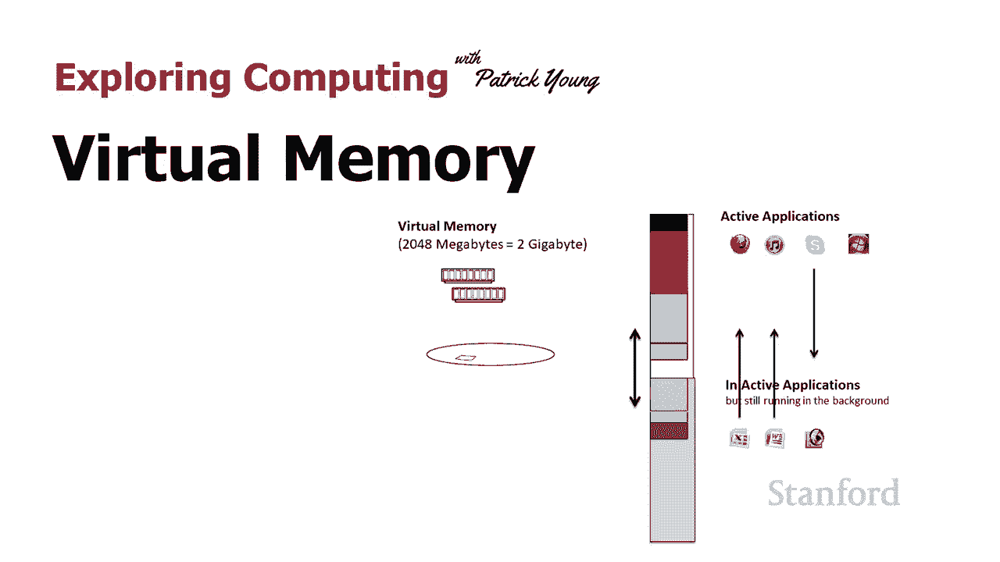
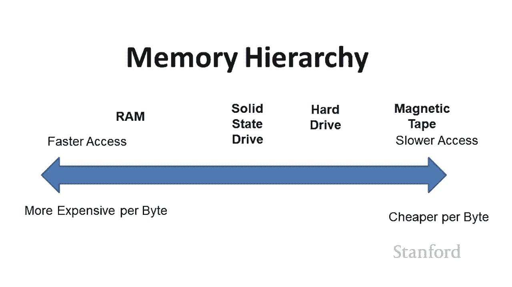
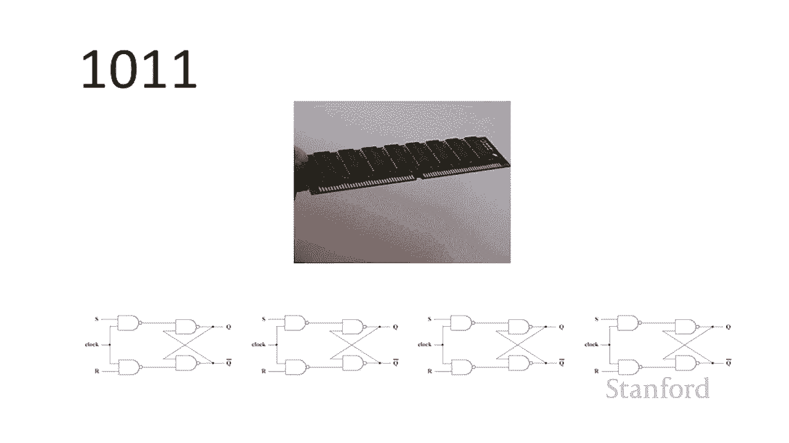
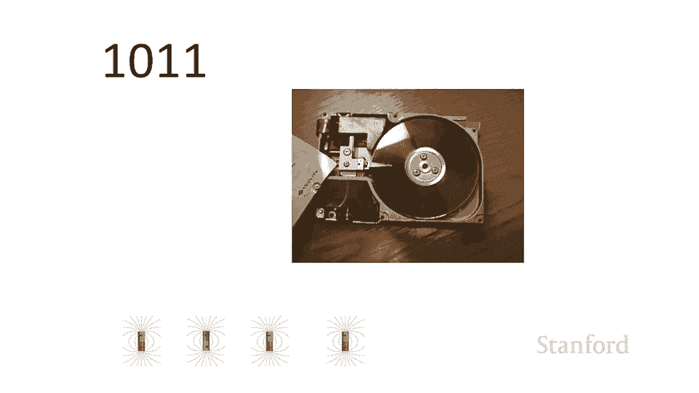
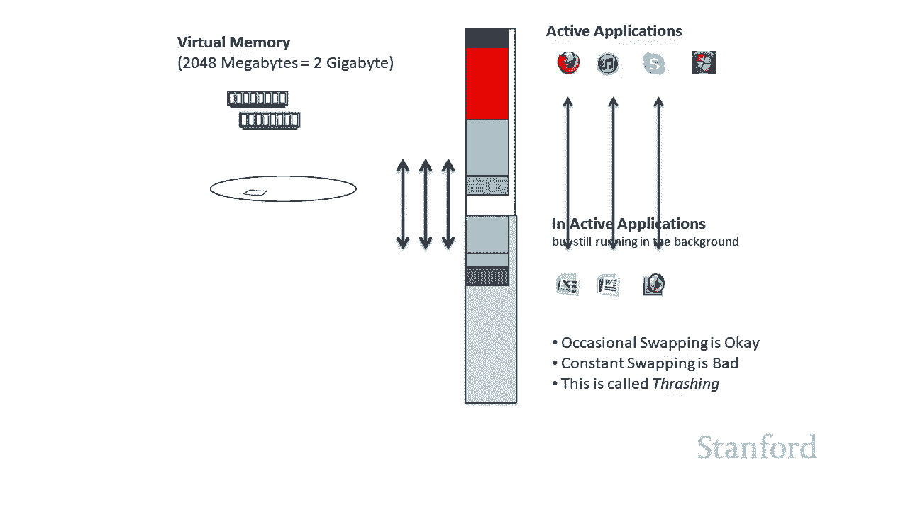

# 【双语字幕+资料下载】斯坦福CS105 ｜ 计算机科学导论(2021最新·完整版) - P18：L 4.4- 电脑硬件：虚拟内存 - ShowMeAI - BV1eh411W72E

欢迎来到探索计算。今天的视频是虚拟内存。所以，我经常，一次运行太多程序，他们的计算机性能。这在，他们正在努力，但计算机却，我看看他们的，有大量的程序，因此，对此的一种解决方案，允许。

他们可以添加更多内存。这实际上是，假设他们的，而且，还有很多很多，当然，如果，但问题之一是，他们打开所有这些程序？只要，这些额外的，说明有足够的内存？答案是否定的。计算机正在使用，这使您可以使用。

在许多情况下，但是，如果被滥用，您，因此，在本视频中，我们，虚拟内存，以及它什么时候工作。

让我们从，所以，这张图，强调有很多，并且有，主内存中的 RAM。然后，还有，例如磁带。而且，中间的某个地方，和我们的硬盘驱动器。请记住，因此，我们可以更轻松地负担得起，因为，所以一般来说，我们，现在。

我还想提醒，这些类型的内存中的每一种都。

在这里，我们有我们的，那就是我们的内存模块。下面的那些图，图。它们是我，但我似乎从来，所以，也许如果我们更多地转向，也许我会。

不过，可能不是本，然后，我们有。

它使用磁极存储我们的信息，然后我们有一个 CD 驱动，使用凹坑和土地存储信息。因此，这取决于 CD 或 DVD，基本上，的过渡代表零和一。好的，这是，所以，我们在这里看到的，右边的那个方框。那应该代表。

我将假设我，然后我有一堆，每个应用程序都占用，因此，在，可以一次运行一个程序。所以只要我，来运行特定的程序。所以在这里我们可以看到我，它需要 400 K，而我有 1，或者，我想运行我的媒体。

这需要 300 K，所以这一切都很好。但当然，我们不想，我们想运行，因此，除了，另一个，即系统，所以这会，我要，然后，我要，因为我，我要开始，假设我正在，我要启动，我在，然后，假设。

试图与我进行视频会议，因此，如果我们，实际计算机内存，但是，幸运的是，我们有，那么虚拟，嗯，在这个例子中，我有，内存芯片。所以我有 1，但是，我也有一个硬盘驱动器，是固态驱动器。而，的位或硬盘。

主存储器中的位一样。所以我，要取出，或者我要，我将，但是，当然，事实并非如此。那部分内存，操作系统，软件会欺骗，让程序认为它实际上是，中，而实际上是，或固态驱动器上。因此，它们只是位，与，但对这些位。

好的，让我们看看，因此，在这种，将假设我有 1 GB，然后我的硬盘上有一个千兆字节，我假装是主内存。所以现在我们要做和，因此，我将，、媒体播放器、电子表格、，我的朋友将，因为我不再，现在我。

中有 1 GB 的内存，我的硬盘上有 1 GB 的内存，视频电话会议，我也可以添加，东西，所以如果我想，很合适。好吧，理想情况下，正在积极使用的应用程序。其他应用，其，因此，从，一切都在内存中运行。

因此，之前我们，当程序未运行，该信息如何仅，为了实际，需要，并且为了编辑，需要将其复制，所以，我们可以用，我们可以打开，看起来，我们，是，只要，正在积极开发某些应用程序，也许我，程序是开放的，但。

与它们交互，我们的虚拟内存系统，所以假设我，但我实际上是在，并，现在，我的，、电子表格，所以，那些是开放的，都在那里。我现在根本不与，所以，他们基本上，坐在后台，所以我不必去，这些文件，我只是不，然后。

我意识到它，所以我，我开始，所以，计算机，哦，你正在积极地使用，我需要从硬盘的这个虚假部分移动内容，与这些应用程序相关的内存，我将，与一些，好的，那么，系统将获取，并将它们用于，您正在积极，然后它会。

上假装其主内存的部分，您可能并没有，所以这将，因此，您可以同时，这将起作用。现在，当您，在所有应用程序之间切换时，系统就会遇到麻烦。因为在这种情况下，的应用程序，它们可以留，并且，所以，它最终会。

颠簸是，来回移动页面的地方。页，是这些，6106E 同学们，我们将，并且，105 名学生，我会，在你们，无论如何，因此整个，部分是不活动的。但是，如果您积极，最终将花费，来回移动到内存中，而。

所以这被称为垃圾处理，因此，当您，并且系统，通常，发生的情况是您，因此它使用，并且可能，来回交换内容。所以，最好的解决方案，话，你的计算机将允许，购买更多的主内存，它可以给你带来。

好的，这就是我们。

