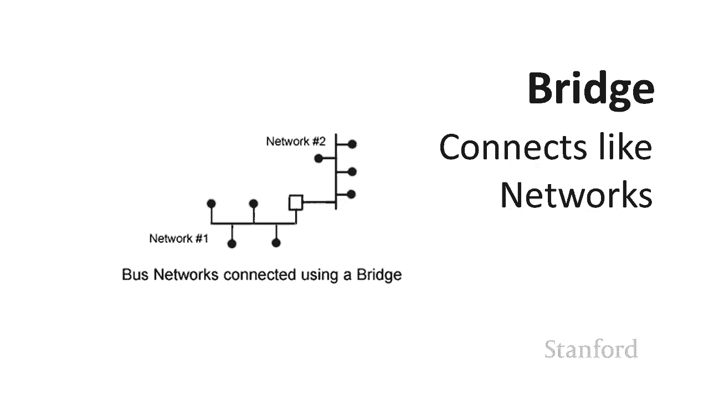
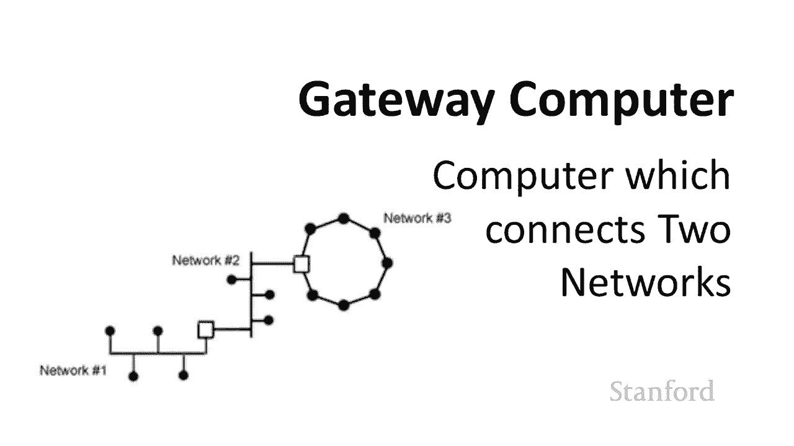

# 【双语字幕+资料下载】斯坦福CS105 ｜ 计算机科学导论(2021最新·完整版) - P19：L5.1- 电脑硬件：硬件 - ShowMeAI - BV1eh411W72E

undefined，欢迎探索，欢迎探索，今天的计算视频是计算机网络的一部分，今天的计算视频是计算机网络的一部分，undefined，undefined，硬件所以我们一直在研究，硬件所以我们一直在研究。

单个计算机，单个计算机，以及单个计算机的工作方式但是，以及单个计算机的工作方式但是，使计算机非常有用的事情之一，使计算机非常有用的事情之一，特别是考虑到她，特别是考虑到她，目前，目前。

的情况是它们都在工作，的情况是它们都在工作，一起在网络上，一起在网络上，所以我们将从，所以我们将从，查看计算机网络硬件开始，查看计算机网络硬件开始，然后我们将看看，然后我们将看看。

如何识别网络上的计算机，如何识别网络上的计算机，然后我们将，然后我们将，转向不同的规则 规范，转向不同的规则 规范，网络如何协同工作，网络如何协同工作，最后我们将，最后我们将，讨论万维网的。

讨论万维网的，工作原理，工作原理，因此这将需要几个，因此这将需要几个，不同的讲座，不同的讲座，但首先让我们看看计算机连接在一起的，但首先让我们看看计算机连接在一起的。

实际物理，undefined，undefined，方式 形成一个网络，所以当我，方式 形成一个网络，所以当我，要形成一个计算机网络时，我，要形成一个计算机网络时，我，需要担心两件不同的事情。

需要担心两件不同的事情，我需要担心我的网络，我需要担心我的网络，拓扑是什么 s 说，undefined，undefined，计算机的几何配置是什么，然后我需要担心，计算机的几何配置是什么。

然后我需要担心，我使用什么介质将，我使用什么介质将，计算机连接在一起，计算机连接在一起，所以这就是说，所以这就是说，计算机是否使用电磁波连接在一起，计算机是否使用电磁波连接在一起，我使用的是。

我使用的是，光缆我使用的是，光缆我使用的是。

铜纤维 我使用什么特定介质，铜纤维 我使用什么特定介质，将这些计算机连接，将这些计算机连接，undefined，undefined，这里是三种不同的经典，这里是三种不同的经典，拓扑结构 还有更多。

拓扑结构 还有更多，这些只是三个经典示例，这些只是三个经典示例，所以我有一个星型网络 环形，所以我有一个星型网络 环形，网络和总线网络，网络和总线网络，你可以看到 星型网络，你可以看到 星型网络。

在中间有一个节点，然后，在中间有一个节点，然后，在外面有一堆节点，在外面有一堆节点，实际上，实际上，你们都很熟悉这个，你们都很熟悉这个，网络，因为事实证明这个，网络，因为事实证明这个，特定，特定。

的网络是 wi-fi 使用的网络类型，的网络是 wi-fi 使用的网络类型，所以如果你 想想看，undefined，undefined，你家里有很多人，或者教室里有几个人，undefined。

undefined，他们都在互联网上，他们都在互联网上，在那个房间的某个地方，在那个房间的某个地方，或者 在附近的房间里有 wi-fi，或者 在附近的房间里有 wi-fi，路由器，路由器。

所以所有的电脑都与那个，所以所有的电脑都与那个，单独的 wi-fi 路由器通信，单独的 wi-fi 路由器通信，如果单独的 wi-fi 路由器，如果单独的 wi-fi 路由器，出现故障。

没有人可以相互通信，出现故障，没有人可以相互通信，所以这是一个星型网络，一个环形网络，所以这是一个星型网络，一个环形网络，你可以 看到这里，我们有一堆，你可以 看到这里，我们有一堆，计算机，它们都被。

计算机，它们都被，一个接一个接一个接一个接一个，一个接一个接一个接一个接一个，接一个接一个，接一个接一个，所以取决于你有多少节点，所以取决于你有多少节点，undefined，undefined。

这实际上，这实际上，比我们的星型网络需要更少的连接介质，比我们的星型网络需要更少的连接介质，环网是常用的，环网是常用的，例如，对于光缆，例如，对于光缆，环形网络的问题之一，环形网络的问题之一。

至少是它们，至少是它们，通常的工作方式，通常的工作方式，是，如果其中一个节点发生故障，则，是，如果其中一个节点发生故障，则，此消息将停止在，此消息将停止在，环中传播，您当然可以想象，环中传播。

您当然可以想象，有一个环，如果其中一个节点出现故障，有一个环，如果其中一个节点出现故障，消息开始，消息开始，向相反的方向传播，但这通常不是，向相反的方向传播，但这通常不是，它们的工作方式。

它们的工作方式，最后我们这里的最后一个例子，最后我们这里的最后一个例子，是总线网络，在总线网络上，是总线网络，在总线网络上，所有计算机都连接在一起 d 到，所有计算机都连接在一起 d 到。

公共电缆 这种网络，公共电缆 这种网络，曾经是很常见的将，曾经是很常见的将，计算机连接在一起 说在教室，计算机连接在一起 说在教室，总线网络中也有自己的，总线网络中也有自己的，问题，问题。

实际上这些网络中的每一个，实际上这些网络中的每一个，都必须有不同的规则，都必须有不同的规则，来管理和 它们是如何工作的，因此，来管理和 它们是如何工作的，因此，总线网络的问题之一，总线网络的问题之一。

是，是，如果网络上的多台计算机，如果网络上的多台计算机，尝试同时发送一个信号，尝试同时发送一个信号，您就会遇到问题，您就会遇到问题，即线路上存在争用，并且网络，即线路上存在争用，并且网络。

需要对发生的事情制定规则，需要对发生的事情制定规则。

当两台计算机，当两台计算机，同时尝试使用，同时尝试使用，那条总线 所以我们可以问自己一个问题，那条总线 所以我们可以问自己一个问题，是我们是，是我们是，哪种类型 所以我们在这里看到了三种。

哪种类型 所以我们在这里看到了三种，不同类型的网络，不同类型的网络，什么样的网络是，什么样的网络是，互联网 事实证明这是一次旅行，互联网 事实证明这是一次旅行，问题，问题，因为互联网不是一个单一的网络。

因为互联网不是一个单一的网络，它实际上是，它实际上是。

一个由不同网络组成的网络，一个由不同网络组成的网络，所以这就是我们所说的，所以这就是我们所说的，互联网络，互联网络，所以这里我有一张，所以这里我有一张，网络图 网络，网络图 网络，这是一种可以。

这是一种可以，连接校园里不同人的东西，连接校园里不同人的东西，所以你知道我们可能有一组，所以你知道我们可能有一组，光纤电缆连接，光纤电缆连接，undefined，undefined。

大学里的不同建筑物 所以，大学里的不同建筑物 所以，我们就像一个环连接每一个，我们就像一个环连接每一个，undefined，undefined，然后我们 可能从那里到，然后我们 可能从那里到，连接。

连接，特定建筑物不同楼层的总线网络，特定建筑物不同楼层的总线网络，undefined，undefined，然后这些单独的楼层可能，然后这些单独的楼层可能，有自己的总线网络，所以我们有一个。

有自己的总线网络，所以我们有一个，总线网络连接到总线网络，总线网络连接到总线网络，最终为了方便我们需要，最终为了方便我们需要，在该总线网络的某个地方，在该总线网络的某个地方。

拥有 我们的 wi-fi 路由器，拥有 我们的 wi-fi 路由器，然后我们有不同的人连接，然后我们有不同的人连接，到 wi-fi 路由器，到 wi-fi 路由器，所以这只是互联网的一个小例子。

所以这只是互联网的一个小例子，但，但，实际上互联网本身就是这样组成的，undefined，undefined。

，不同的网络连接到，不同的网络连接到，不同的网络，现在连接到不同的网络，不同的网络，现在连接到不同的网络，当我们使用我们的互联网络时，您可能会遇到不同类型的硬件，undefined，undefined。

undefined，undefined，因此其中一个设备是桥接器，因此其中一个设备是桥接器，和桥接器 e 用于连接，和桥接器 e 用于连接，两个，两个，相同类型的不同网络，因此您可以想象这。

相同类型的不同网络，因此您可以想象这，比连接，比连接，不同类型的不同网络更简单，不同类型的不同网络更简单，因此，因此，假设我们有一个总线网络，它，假设我们有一个总线网络，它，运行，运行。

在特定综合大楼的所有宿舍中，所以说，在特定综合大楼的所有宿舍中，所以说，我们有 连接，我们有 连接，船尾的所有宿舍或 flomo 的所有宿舍的总线，船尾的所有宿舍或 flomo 的所有宿舍的总线。

然后每个单独的房屋，然后每个单独的房屋，可能都有自己的网络，可能都有自己的网络。

，因此如果我们有两种不同类型的网络，我们将需要一个桥来将，因此如果我们有两种不同类型的网络，我们将需要一个桥来将，其中一个网络连接到另一个，其中一个网络连接到另一个，网络，undefined。

undefined，网络连接在一起我们需要更，网络连接在一起我们需要更，高级的设备，高级的设备，因此路由器连接两种不同，因此路由器连接两种不同，类型的网络，这可能是，类型的网络，这可能是。

最著名的无线路由器，所以如果您，最著名的无线路由器，所以如果您，听到人们谈论无线路由器，听到人们谈论无线路由器，它，它，是连接无线，是连接无线。

网络的设备 Wi-Fi 网络连接，网络的设备 Wi-Fi 网络连接，到其他类型的网络，您可能，到其他类型的网络，您可能，还会听到术语，还会听到术语，网关或网关计算机 网关，网关或网关计算机 网关。

计算机是一台，计算机是一台，基本上类似于路由器的计算机 ra，基本上类似于路由器的计算机 ra，网桥，它将，网桥，它将，不同的网络连接在一起，不同的网络连接在一起，不同之处，不同之处。

在于路由器或网桥是一个非常，在于路由器或网桥是一个非常，特殊的用途盒子，特殊的用途盒子，它在生活中的唯一目的是，它在生活中的唯一目的是，处理这些消息，处理这些消息，而网关计算机是一台通用。

而网关计算机是一台通用，计算机，计算机。

现在处理网络流量 我们，现在处理网络流量 我们，不会过多谈论，不会过多谈论，可，可，用于将我们的计算机连接在一起的不同介质，你，用于将我们的计算机连接在一起的不同介质，你，知道有很多种，从。

知道有很多种，从，普通的旧电话服务或用于电话服务，普通的旧电话服务或用于电话服务，的传统铜线到电缆的盆，undefined，undefined，网络到，网络到，光纤电缆到 Wi-Fi 到卫星。

光纤电缆到 Wi-Fi 到卫星。

这些都是不同的媒体，这些都是不同的媒体，我们可以通过不同的方式连接，我们可以通过不同的方式连接，网络中的计算机，undefined，undefined，但当我们谈论不同的，但当我们谈论不同的。

媒体时出现的问题之一是带宽等，媒体时出现的问题之一是带宽等，带宽是，带宽是，什么带宽最初指，什么带宽最初指，的是我认为技术上仍然可以，的是我认为技术上仍然可以。

尽管计算机科学 entists 倾向于不以，尽管计算机科学 entists 倾向于不以，这种方式谈论它，这种方式谈论它，是，是，为，为，进行特定通信而预留的频带，进行特定通信而预留的频带。

undefined，undefined，因此我们可用的频带越宽，因此我们可用的频带越宽，undefined，undefined，我们可以通过计算机科学家发送的消息就越多，undefined。

undefined，通常大多数人都，通常大多数人都，指的是带宽，指的是带宽，就像网络速度一样，所以如果我有，就像网络速度一样，所以如果我有，很多带宽，这意味着我可以快速发送，很多带宽。

这意味着我可以快速发送，很多信息，很多信息，如果我没有很多，如果我没有很多，带宽，那么，带宽，那么，我就不能很快发送消息，我就不能很快发送消息，您可能还会听到这些条款 宽带。

您可能还会听到这些条款 宽带，和窄带，和窄带，窄带基本上是普通的旧，窄带基本上是普通的旧，电话线，电话线，和普通的旧电话服务或锅，和普通的旧电话服务或锅，因为它在，因为它在，技术上被称为我实际上认为。

技术上被称为我实际上认为，这是一个可爱的名字，这是一个可爱的名字，豆荚嗯你知道它的，豆荚嗯你知道它的，带宽非常低，我们无法，带宽非常低，我们无法，通过它发送太多信息，通过它发送太多信息，事实上。

正如我们在，事实上，正如我们在，之前的一个视频中看到的，如果我们想，undefined，undefined，通过盆发送一首五分钟的 cd 歌曲，通过盆发送一首五分钟的 cd 歌曲，大约需要五个小时。

所以这个词非常糟糕，大约需要五个小时，所以这个词非常糟糕，你会更，你会更，频繁地听到宽带，频繁地听到宽带，这只是指那些，这只是指那些，不是窄带的东西，不是窄带的东西，通常这些术语，通常这些术语。

不再广泛使用，不再广泛使用，除非有相当多的，除非有相当多的，公司，公司，在其中使用宽带这个名称，在其中使用宽带这个名称，因为它曾经很酷 是，因为它曾经很酷 是，宽带而不是窄带，宽带而不是窄带。

但现在每个人都使用宽带，因此您，但现在每个人都使用宽带，因此您，仍然会听到“宽带，仍然会听到“宽带，带”这个词，带”这个词，主要是在那里的各种公司的名称中，主要是在那里的各种公司的名称中。

，但这就是他们所指的，但这就是他们所指的，这里还有一些您可能会遇到的术语，这里还有一些您可能会遇到的术语，undefined，undefined，lan 代表本地 局域网是，lan 代表本地 局域网是。

一个小型网络，一个小型网络，所以如果我们有一个教室，我们在那个教室里有，所以如果我们有一个教室，我们在那个教室里有，一堆电脑连接在一起，undefined，undefined，如果你，如果你。

玩电脑游戏，或者你有，玩电脑游戏，或者你有，玩电脑游戏的朋友，你可能会听到，玩电脑游戏的朋友，你可能会听到，他们提到一个局域网，他们提到一个局域网，聚会，我们可能有一个局域网 这是一个聚会，人们带着。

聚会，我们可能有一个局域网 这是一个聚会，人们带着，他们的电脑，他们的电脑，并让他们联网玩，并让他们联网玩，电脑游戏，电脑游戏，undefined，undefined，这样做 曾一度改变其饮酒。

这样做 曾一度改变其饮酒，政策，政策，我们试图为学生提供，我们试图为学生提供，除饮酒以外的其他，除饮酒以外的其他，活动，因此 rcc 开始，活动，因此 rcc 开始，为校园举办局域网派对的其中。

为校园举办局域网派对的其中，一项活动很酷，您可能，一项活动很酷，您可能，还听说过广域网这些，还听说过广域网这些，是，是，连接跨大洲甚至，连接跨大洲甚至，跨大洲的城市的网络，您可能还会听到“。

跨大洲的城市的网络，您可能还会听到“，undefined，undefined，人”这个词 城域网 这是，人”这个词 城域网 这是，一个城市内的网络，因此如果您有，一个城市内的网络，因此如果您有，朋友。

朋友，说我需要找一个好男人，他们，说我需要找一个好男人，他们，可能指的是，可能指的是，想要找到 一个好人或者，想要找到 一个好人或者，他们可能正在考虑毕业，他们可能正在考虑毕业，后他们想搬到哪个城市。

后他们想搬到哪个城市，并确保该，并确保该，城市拥有良好的城域网，城市拥有良好的城域网，undefined，undefined，我不得不承认我实际上从未，我不得不承认我实际上从未。

见过有人在这种用法中使用其他 比，见过有人在这种用法中使用其他 比，在网络教科书中，但我喜欢，在网络教科书中，但我喜欢，这个笑话，所以，这个笑话，所以。

你们将不得不忍受，你们将不得不忍受，另一个你可能遇到的术语是跳跃，另一个你可能遇到的术语是跳跃，正如我们之前谈到的那样，互联网，正如我们之前谈到的那样，互联网，不是一个单一的网络，它是 实际上是一个。

不是一个单一的网络，它是 实际上是一个，网络网络，网络网络，所以 hops 是指，所以 hops 是指，undefined，undefined，我的消息需要经过多少个网络，我的消息需要经过多少个网络。

才能到达这个目的地，才能到达这个目的地，所以如果我试图与朋友交流，请，所以如果我试图与朋友交流，请，说在哈佛，说在哈佛，我的消息将不得不通过，我的消息将不得不通过，从，从，斯坦福网络出去到。

斯坦福网络出去到，斯坦福与更广泛的互联网的连接，斯坦福与更广泛的互联网的连接，通过一堆，通过一堆，互联网骨干提供商它，互联网骨干提供商它，返回另一端，返回另一端，你知道要进入哈佛网络。

你知道要进入哈佛网络，它可能必须通过一个跳跃，它可能必须通过一个跳跃，在哈佛耦合不同的网络，在哈佛耦合不同的网络，所以这些都是，所以这些都是，消息为了到达，消息为了到达，这个目的地，这个目的地。

而必须做的所有不同的事情，这里将发生的事情是，而必须做的所有不同的事情，这里将发生的事情是，有许多不同，有许多不同，的事情将决定，的事情将决定，消息，消息，或数据通过网络的速度有多快。

或数据通过网络的速度有多快，互联网将成为连接，互联网将成为连接，媒介，所以如果我有光纤，媒介，所以如果我有光纤，电缆，它，电缆，它，会比普通的旧电话服务，会比普通的旧电话服务，吊舱快得多，吊舱快得多。

但 ot 她将要，但 ot 她将要，发生的问题是，每次，发生的问题是，每次，消息流量从一个网络传输，消息流量从一个网络传输，到下一个网络时，也会，到下一个网络时，也会，出现延迟，因为，出现延迟，因为。

无论我们使用什么将这，无论我们使用什么将这，两个网络连接在一起，都，两个网络连接在一起，都，需要花一些时间查看该，需要花一些时间查看该，消息，以确定是这样的 一条，消息，以确定是这样的 一条。

应该发送给我网络上某人的消息，undefined，undefined，是它被传递到另一个，是它被传递到另一个，网络这需要如何从，网络这需要如何从，这个网络到达另一个网络所以，这个网络到达另一个网络所以。

有一个延迟，有一个延迟，因为这个实际的处理必须，因为这个实际的处理必须，发生所以更多的跃点我们，发生所以更多的跃点我们，undefined，undefined。

undefined，undefined，在相关注释上查看消息需要花费的时间越长，您可能会听到人们，在相关注释上查看消息需要花费的时间越长，您可能会听到人们，提到延迟和延迟，提到延迟和延迟，一般而言。

延迟，一般而言，延迟，是指消息，是指消息，传递非常缓慢，传递非常缓慢，的感觉，例如我，的感觉，例如我，使用的其中一种方法 作为一名常驻研究员，当，使用的其中一种方法 作为一名常驻研究员，当。

我们为新 ras 面试时，我们为新 ras 面试时，我们有时会采访，我们有时会采访，斯坦福海外各种海外，斯坦福海外各种海外，项目的人，项目的人，而你 有时会注意到，undefined。

undefined，当您有人，当您有人，说话和您实际听到他们的，说话和您实际听到他们的，话之间会有很长的延迟，话之间会有很长的延迟，所以这是延迟，这，所以这是延迟，这，是网络表现，是网络表现，不佳的。

不佳的，另一个时间，您会听到延迟一词是，另一个时间，您会听到延迟一词是，嗯，你知道 你有一个玩，嗯，你知道 你有一个玩，第一人称射击游戏的朋友，他们说，第一人称射击游戏的朋友，他们说，那不是我的错。

那不是我的错，实际上是他们的错，他们很糟糕，实际上是他们的错，他们很糟糕，但这里的想法是你知道他们，但这里的想法是你知道他们，试图将他们的角色转向特定的，试图将他们的角色转向特定的，方向，方向。

并且 由于网络流量的延迟，并且 由于网络流量的延迟，undefined，undefined，他们最终被击中，这不是，他们最终被击中，这不是，因为他们移动得不够快，因为他们移动得不够快，而是因为消息。

而是因为消息，必须通过太多慢速，必须通过太多慢速，连接或太多跳数，连接或太多跳数，或者我们要说的太多了，或者我们要说的太多了，关于下一节课，有，关于下一节课，有，太多太多的其他数据包。

太多太多的其他数据包，通过同一个网络，通过同一个网络，嗯，所以最终结果是嗯，嗯，所以最终结果是嗯，他们移动的信息没有及时，他们移动的信息没有及时，到达服务器，到达服务器，术语延迟通常是一个sligh。

术语延迟通常是一个sligh，更多的技术术语指的，更多的技术术语指的，undefined，undefined，是传输中涉及的延迟量，是传输中涉及的延迟量。

但这两个通常，但这两个通常，或多或少地同义使用，或多或少地同义使用，我应该提到延迟和延迟，undefined，undefined，不一定与连接速度直接相关，不一定与连接速度直接相关，所以这里的想法。

所以这里的想法，是你可以 有很多，是你可以 有很多，带宽，带宽，你仍然可能有延迟和，你仍然可能有延迟和，延迟 所以这里有一个例子，延迟 所以这里有一个例子，假设我们从，假设我们从，地球，地球。

向一艘环绕火星旅行的宇宙飞船发送消息，undefined，undefined，undefined，我们有多少带宽，我们有多少带宽，假设我正在，假设我正在，发送最新电影的新副本，发送最新电影的新副本。

undefined，undefined，我不知道我想现在没有任何，我不知道我想现在没有任何，电影但是让我们，电影但是让我们，假设花木兰出去了，假设花木兰出去了，我有一个 宇航员在那里。

我有一个 宇航员在那里，她真的很喜欢花木兰，她真的很喜欢花木兰，嗯，她喜欢卡通版的花，嗯，她喜欢卡通版的花，木兰，新的真人，木兰，新的真人，版花木兰出来了，我们想，版花木兰出来了，我们想。

给她寄一份副本，她不在火星，给她寄一份副本，她不在火星，所以如果我们有，所以如果我们有，慢带宽 不管那个人有多远，整部电影都需要很，慢带宽 不管那个人有多远，整部电影都需要很，长时间才能到达。

长时间才能到达，这个目的地，这个目的地，所以，所以，假设我们两个人在同一个，假设我们两个人在同一个，网络上，我们之间没有跳跃，但，网络上，我们之间没有跳跃，但，我们由一个普通的老人连接 电话。

我们由一个普通的老人连接 电话，线，线，如果我们的，如果我们的，undefined，undefined，undefined，undefined，连接速度非常快 因为这个人，连接速度非常快 因为这个人。

离我们，离我们，很近 它会很快转移 现在，很近 它会很快转移 现在，让我们看看我们的情况，让我们看看我们的情况，将，将，数据重新发送到火星，数据重新发送到火星，无论我们有多少带宽，undefined。

undefined，undefined，这些第一位到达火星仍然需要很长时间，这些第一位到达火星仍然需要很长时间，如果我们有高带宽，如果我们有高带宽，一旦这些第一位到达火星，一旦这些第一位到达火星。

其余位将非常，其余位将非常，很快，很快，如果我们有低带宽，我们仍然，如果我们有低带宽，我们仍然，有相同的延迟，因为，有相同的延迟，因为，你知道光传播到火星只需要一定，你知道光传播到火星只需要一定。

的时间，的时间，但是，但是，如果我们的带宽很低，一旦这些，如果我们的带宽很低，一旦这些，位开始到达火星，它们就会，undefined，undefined，在第一个比特到达那里和，在第一个比特到达那里和。

最后一个比特到达那里之间，我将不得不等待很长时间，最后一个比特到达那里之间，我将不得不等待很长时间，所以重点是，所以重点是，这里涉及不同的问题，这里涉及不同的问题，这不仅仅是嘿，我有，这不仅仅是嘿。

我有，非常高的带宽连接，或者我，非常高的带宽连接，或者我，有 一个非常低的带宽连接，有 一个非常低的带宽连接，是的，这些很重要，但还有，是的，这些很重要，但还有，一个问题，一个问题，是这个人有多远。

是这个人有多远，这个人必须经过多少跳，这个人必须经过多少跳，等等，undefined，undefined，当你开始担心，当你开始担心，诸如网络之类的事情时，这实际上将成为一个问题 服务器 嗯。

诸如网络之类的事情时，这实际上将成为一个问题 服务器 嗯，我们通常不会涉足这个问题，但是，我们通常不会涉足这个问题，但是，你知道，因为我在这里有一群被俘虏的，你知道，因为我在这里有一群被俘虏的，观众。

观众，出现的问题之一是，如果，出现的问题之一是，如果，我有，我有，一个网络服务器，并且该网络服务器是，一个网络服务器，并且该网络服务器是，在加利福尼亚州，在加利福尼亚州，和我的客户说的 在澳大利亚。

和我的客户说的 在澳大利亚，有很长的延迟，有很长的延迟，消息需要从，消息需要从，undefined，undefined，我在加利福尼亚州的服务器通过，我在加利福尼亚州的服务器通过。

一大堆跃点传输到澳大利亚，一大堆跃点传输到澳大利亚，因此处理此问题的更好方法，因此处理此问题的更好方法，是使用称为 内容交付，是使用称为 内容交付，网络或 CDN，网络或 CDN，CDN 的作用是获取。

CDN 的作用是获取，通常，通常，位于我在加利福尼亚州的服务器中的文件，并将其，位于我在加利福尼亚州的服务器中的文件，并将其，分发到，分发到，世界各地的一大堆不同的服务器，世界各地的一大堆不同的服务器。

因此在澳大利亚，因此在澳大利亚，或大洋洲将有一个服务器 成为，或大洋洲将有一个服务器 成为，亚洲的服务器，欧洲将有服务器，亚洲的服务器，欧洲将有服务器，他们将在美国提供服务，他们将在美国提供服务。

非洲也将有服务器，非洲也将有服务器，无论该人试图从何处，无论该人试图从何处，访问，访问，我们的信息，他们都会，我们的信息，他们都会，从附近的服务器获取信息，从附近的服务器获取信息，因此 您知道。

因此 您知道，到达该服务器的跳，到达该服务器的跳，数会减少 延迟会，数会减少 延迟会，减少 延迟会减少 并且信息，减少 延迟会减少 并且信息，会以更快的速度到达它们，undefined。

undefined，undefined，将全球受众，将全球受众，外包给内容交付，外包给内容交付，网络可能是一个好主意，网络可能是一个好主意，好吧，到此为止，在，好吧，到此为止，在，下一讲中我们将讨论。

下一讲中我们将讨论，如何识别网络上的单个计算机，undefined，undefined，以及下一节 确定在星期五我们，以及下一节 确定在星期五我们，将讨论看看，将讨论看看，用于，用于。

管理信息如何通过互联网传播的不同协议，undefined。

