# 【双语字幕+资料下载】斯坦福CS105 ｜ 计算机科学导论(2021最新·完整版) - P20：L5.2- 电脑硬件：命名 - ShowMeAI - BV1eh411W72E

undefined，欢迎探索，欢迎探索。

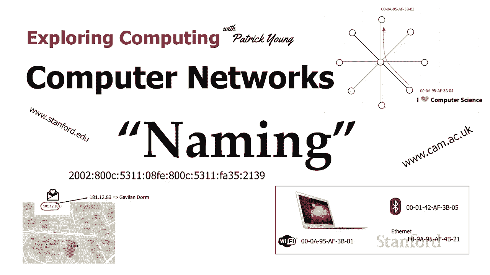

今天的视频是计算机网络的第二，今天的视频是计算机网络的第二，部分命名 所以在上一个视频中我们，部分命名 所以在上一个视频中我们，看到了如何将不同的计算机连接，undefined，undefined。

在一起 我们可以将网络组合成，在一起 我们可以将网络组合成，undefined，undefined，互联网 所以我们做得对 我们的，互联网 所以我们做得对 我们的，计算机连接在一起，计算机连接在一起。

我们可以连接网络 从，我们可以连接网络 从，这个国家的一侧到另一侧，这个国家的一侧到另一侧，我们都准备好了 不完全是，我们都准备好了 不完全是，让我们从我们的，让我们从我们的，小教室网络中举个例子。

小教室网络中举个例子，所以我们在上一个视频中看到教室中的 Wi-Fi，所以我们在上一个视频中看到教室中的 Wi-Fi，网络可以被，网络可以被，认为是一个星型，认为是一个星型，网络 无线路由器是中央。

网络 无线路由器是中央，集线器，现在每个学生的笔记本电脑，集线器，现在每个学生的笔记本电脑，都是外部节点之一，都是外部节点之一，当我在大学时，我实际上，当我在大学时，我实际上，在课堂上传递笔记时被破坏。

在课堂上传递笔记时被破坏，可悲的是我什至不在，可悲的是我什至不在，课堂上，课堂上，我去上课，因为一个 我，我去上课，因为一个 我，认为非常可爱的女孩，认为非常可爱的女孩，邀请我和她一起坐在她的班上。

邀请我和她一起坐在她的班上，undefined，undefined，我们的传球笔记被破坏了，但，我们的传球笔记被破坏了，但，好消息是，好消息是，30 年后我们仍然是最好的朋友。

30 年后我们仍然是最好的朋友，但这不会发生在你们身上，但这不会发生在你们身上，因为，因为，你们可以互相发短信，你们可以互相发短信，我什至不知道你在做什么，我什至不知道你在做什么，所以假设你在教室里。

所以假设你在教室里，你想输入一条消息，你想输入一条消息，这是我们的消息，注意，undefined，undefined，你现在使用的 unicode 心形表情符号 从第一堂课就知道它是。

你现在使用的 unicode 心形表情符号 从第一堂课就知道它是，如何在内部工作的，如何在内部工作的，所以假设我们，所以假设我们，想将此，想将此，消息发送给教室对面的朋友，消息发送给教室对面的朋友。

undefined，undefined，请继续输入消息，请继续输入消息，然后，然后，等待一分钟，这样我们的计算机都，等待一分钟，这样我们的计算机都，连接在一起了，但我们没有办法，连接在一起了。

但我们没有办法，识别每台单独的，识别每台单独的，计算机，计算机，以便我将此消息发送，以便我将此消息发送，到特定的计算机，而不是，到特定的计算机，而不是，教室中的每个人，尽管这对教室中的每个人来说。

教室中的每个人，尽管这对教室中的每个人来说，都是一条很好的消息，都是一条很好的消息，但，但，我需要一种方法来，我需要一种方法来，识别网络上的每台计算机 所以，识别网络上的每台计算机 所以。

这是今天视频的主要主题，这是今天视频的主要主题，我们将如何命名或识别，undefined，undefined。

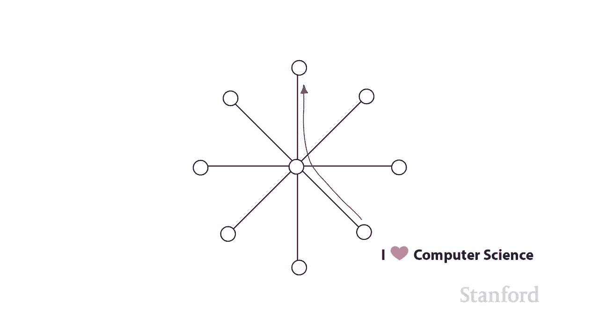

网络上的计算机 事实证明有，网络上的计算机 事实证明有，几种不同的命名，几种不同的命名，方案 第一个命名方案是某种，方案 第一个命名方案是某种，东西 在这种情况下，导致物理地址或 mac。

东西 在这种情况下，导致物理地址或 mac，地址，地址，mac 不代表，mac 不代表，macintosh 它实际上代表媒体，macintosh 它实际上代表媒体，访问控制，但，访问控制，但。

我用非常小的字体写了它，我用非常小的字体写了它，因为你真的不需要知道，因为你真的不需要知道，undefined，undefined，大多数人不嗯所以这个，大多数人不嗯所以这个。

是物理地址或 mac 地址的例子，是物理地址或 mac 地址的例子，这两个名称是，这两个名称是，同义词，同义词，你可以看到它由，undefined，undefined，一系列看起来像数字的序列组成，但。

一系列看起来像数字的序列组成，但，它们混合了字母，它们混合了字母，所以这些是十六进制数字，所以，所以这些是十六进制数字，所以，它们是基数 16，它们是基数 16，而不是基数 10 或基数 2 并且它们。

而不是基数 10 或基数 2 并且它们，很容易从，很容易从，十六进制转换为二进制这就是为什么，十六进制转换为二进制这就是为什么，计算机科学家喜欢使用它们的原因，undefined，undefined。

零零零一四十二 af 三，零零零一四十二 af 三，bo 5 这就是我们的 mac 地址 对于，bo 5 这就是我们的 mac 地址 对于，我们的计算机，我们的计算机，这些有时，这些有时。

在它们之间用破折号书写，偶尔，在它们之间用破折号书写，偶尔，您会看到它们之间用列书写，您会看到它们之间用列书写，这实际上，这实际上，是您在向 stanf 注册设备时提供给 stanford 的数字。

undefined，undefined，之一 ord network，之一 ord network，实际上是stanford 意识到，实际上是stanford 意识到，您的计算机，您的计算机。

可以在网络上使用的方式 好吧 首先，可以在网络上使用的方式 好吧 首先，有一些关于物理或mac，有一些关于物理或mac，地址的，地址的，事情 当然每台计算机都需要一个唯一的。

事情 当然每台计算机都需要一个唯一的，mac 地址 所以这些都是唯一的，mac 地址 所以这些都是唯一的，undefined，undefined，数字 第二件事是 第一组，数字 第二件事是 第一组。

六个十六进制数字，六个十六进制数字，实际上是，实际上是，一个制造前缀，所以，一个制造前缀，所以，这里是一些苹果的前缀 他们，这里是一些苹果的前缀 他们，实际上有很多他们有，实际上有很多他们有。

两打以上但，两打以上但，这里有一些例子所以如果你有一个，这里有一些例子所以如果你有一个，从零零零开始的 mac 地址，从零零零开始的 mac 地址，九五零零一六 cb，九五零零一六 cb。

零零二一 e9 我们知道你，零零二一 e9 我们知道你，有一台 Macintosh 电脑，有一台 Macintosh 电脑，这里有一些三星的地址，这里有一些三星的地址，所以你得到基本的。

所以你得到基本的，想法每个制造商都有，想法每个制造商都有，一大堆前缀，一大堆前缀，每当他们制造电脑或，每当他们制造电脑或。

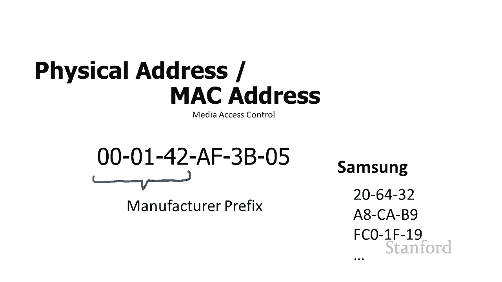

平板电脑或 智能手机，平板电脑或 智能手机，他们使用以前缀开头的 mac 地址，undefined，undefined，我还应该提到，大多数，我还应该提到，大多数，计算机实际上都有多个 mac。

计算机实际上都有多个 mac，地址，因此，地址，因此，您可能有一个 您的，您可能有一个 您的，wi-fi 的 mac 地址，您可能有一个不同，wi-fi 的 mac 地址，您可能有一个不同。

的蓝牙 mac 地址，的蓝牙 mac 地址。

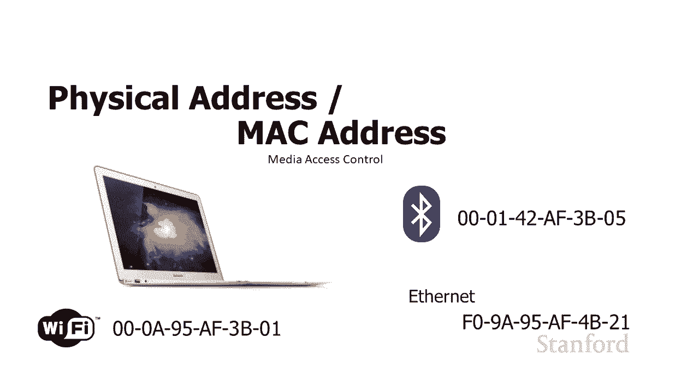

，如果您的计算机确实连接到，如果您的计算机确实连接到，以太网，您将有第三个 mac，以太网，您将有第三个 mac，地址，地址，我可以使用它来将我的消息，我可以使用它来将我的消息。

从我的计算机发送到我朋友的计算机，从我的计算机发送到我朋友的计算机，上 教室，这，上 教室，这，很好用，很好用。

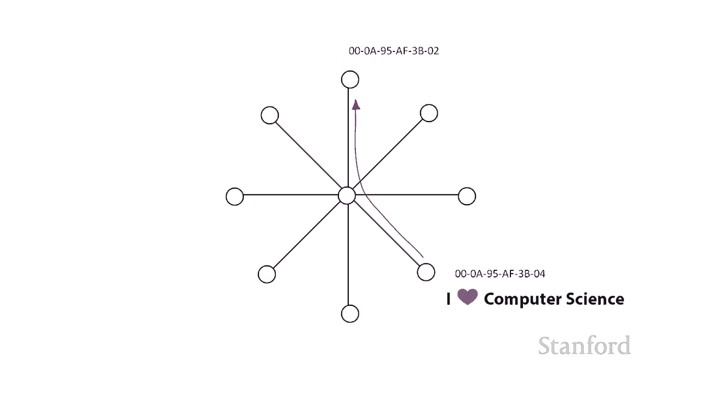

所以我们做得很好，所以我们做得很好，所以结果证明这有问题，所以结果证明这有问题，所以这里我们有一堆，所以这里我们有一堆，由苹果制造的计算机，它们，由苹果制造的计算机，它们，正在下线，正在下线。

你可以看到它们都共享 相同的一，你可以看到它们都共享 相同的一，组数字，除了最后一位数字正在，组数字，除了最后一位数字正在，改变，所以，改变，所以，基本上你想出了另一个，基本上你想出了另一个，设备。

你改变了，设备，你改变了，来自设备，来自设备，的数字的最后一位数字，你来了，你改变了最后一个，的数字的最后一位数字，你来了，你改变了最后一个，数字，这很好，undefined，undefined。

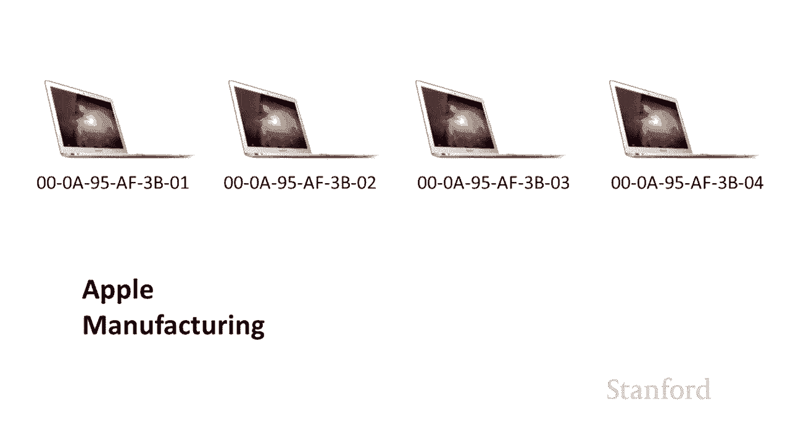

所有苹果计算机的一大堆唯一编号，所有苹果计算机的一大堆唯一编号，这正是您所需要的，这正是您所需要的，但这些计算机将，但这些计算机将，要去不同的地方，要去不同的地方，其中一个可能会去斯坦福，而我。

其中一个可能会去斯坦福，而我，可能会去 得克萨斯大学的，可能会去 得克萨斯大学的，一个人可能会去哈佛，其中一个人，一个人可能会去哈佛，其中一个人，可能会走运，然后去欧洲，可能会走运，然后去欧洲。

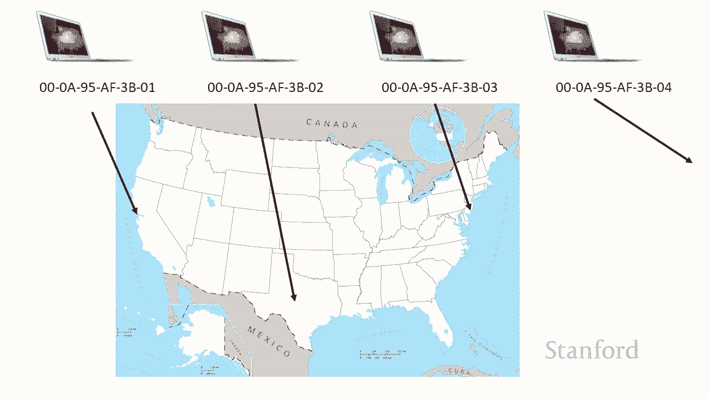

所以如果我们使用这些 mac 地址，所以如果我们使用这些 mac 地址，在互联网上发送消息，在互联网上发送消息，就像邮政服务，就像邮政服务，使用社会安全号码发送，使用社会安全号码发送，信件，信件。

社会安全号码一样 是独一无二的，所以如果，社会安全号码一样 是独一无二的，所以如果，我们用它们来写信，就，我们用它们来写信，就，不会含糊不清，我们确切地知道这，不会含糊不清，我们确切地知道这。

封信应该写给谁，封信应该写给谁，所以这里我有三封信，所以这里我有三封信，结果证明他们的情书不是，结果证明他们的情书不是，因为我很浪漫，而是因为，因为我很浪漫，而是因为，我认为 使用，我认为 使用。

表情符号比画字母更容易 事实证明，表情符号比画字母更容易 事实证明，我猜字母的唯一表情符号，我猜字母的唯一表情符号，是情书表情符号，是情书表情符号，所以如果我们把这三封信，所以如果我们把这三封信。

交给邮局 给他们，交给邮局 给他们，我们三个人的社会安全号码，我们三个人的社会安全号码，想把它们，想把它们，寄到邮局会看着我们说，寄到邮局会看着我们说，你疯了，你疯了，这么清楚系统不起作用。

这么清楚系统不起作用，同样的方式，undefined，undefined，使用mac地址在互联网上传递消息不起作用，因为，使用mac地址在互联网上传递消息不起作用，因为，使用 mac 地址与。

使用 mac 地址与，该计算机所在的位置无关 它是一个，该计算机所在的位置无关 它是一个，唯一编号，基于该，唯一编号，基于该，计算机的制造地点，计算机的制造地点，而不是现在的位置，而不是现在的位置。

因此它不能很好地，因此它不能很好地，工作，因此它适用于小型局域网，因此，工作，因此它适用于小型局域网，因此，它 可以在课堂效果中发挥作用，它 可以在课堂效果中发挥作用，嗯，很多小型网络，嗯。

很多小型网络，实际上确实为此直接使用 mac 地址，实际上确实为此直接使用 mac 地址，但我们需要另一个系统来，但我们需要另一个系统来，在更广泛的网络上获取消息，在更广泛的网络上获取消息，而不是。

而不是，undefined，undefined，所以我确实想做到这一点 很明显，使用了，所以我确实想做到这一点 很明显，使用了，mac 地址，mac 地址，它们只是在本地，它们只是在本地，网络中使用。

所以它们是一个重要的，网络中使用，所以它们是一个重要的，组成部分，组成部分，但，但。

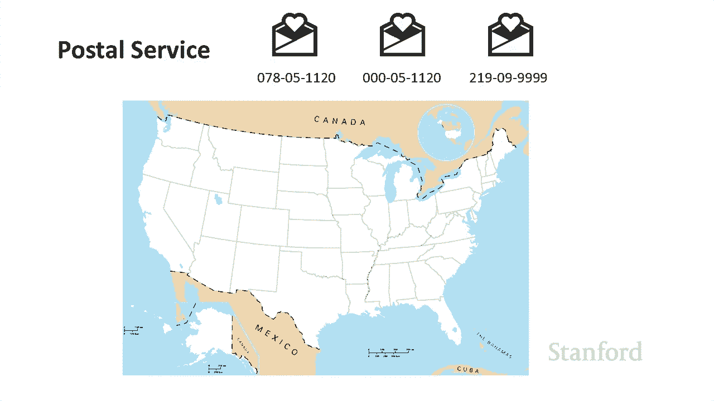

如果我们想在本地网络之外获取消息，它们本身是不够的，如果我们想在本地网络之外获取消息，它们本身是不够的，所以，所以，这是我们的下一个，这是我们的下一个，命名方案 被称为 ip，命名方案 被称为 ip。

地址，地址，或 ip 号码，ip 代表互联网，或 ip 号码，ip 代表互联网，协议，这实际上，协议，这实际上，很重要，所以，很重要，所以，我用稍大的字体写了它，我用稍大的字体写了它。

但我们将谈论互联网 t，但我们将谈论互联网 t，协议在下一讲中非常详细，undefined，undefined，所以传统的 ip 地址 ip 号码，所以传统的 ip 地址 ip 号码，看起来像这样。

看起来像这样，有四位数字用点分隔，有四位数字用点分隔，每个数字在 0 到 255 之间，undefined，undefined，如果你考虑一下，为什么我们，如果你考虑一下，为什么我们，从 0 到 55。

从 0 到 55，因为 这是我们，因为 这是我们，可以存储在一个字节上的值范围，所以这些，可以存储在一个字节上的值范围，所以这些，undefined，undefined，现在这个，现在这个。

传统的 ip，传统的 ip，地址有一个小问题，如果我有四个字节，地址有一个小问题，如果我有四个字节，我可以存储 2-32 种不同的组合，我可以存储 2-32 种不同的组合，这给了我超过 40 亿种。

这给了我超过 40 亿种，组合，组合，地球上有 78 亿人，地球上有 78 亿人，undefined，undefined，所以我们没有足够的 ip 地址供，所以我们没有足够的 ip 地址供，每个人使用。

每个人使用，而且包括我在内的许多人，而且包括我在内的许多人，都有多个 ip 地址，都有多个 ip 地址，因为我们所连接的一切，因为我们所连接的一切，互联网需要一个，所以如果你有，互联网需要一个。

所以如果你有，一部手机和一台笔记本电脑，一部手机和一台笔记本电脑，那就是两个你有一台智能电视，那就是两个你有一台智能电视，三个你有一台平板电脑，三个你有一台平板电脑，四个，四个，你有一个游戏机，五个。

你有一个游戏机，五个，然后还有一件事我，然后还有一件事我，这些数字并没有，这些数字并没有，公平地，公平地，分发，所以事实证明，当互联网最初开发时，斯坦福大学，分发，所以事实证明，当互联网最初开发时。

斯坦福大学，是，是，原始互联网上最早的四个站点之一，undefined，undefined，我们有大量的数字，我们有大量的数字，所以我们实际上放弃了一堆，所以我们实际上放弃了一堆，数字 前阵子因为我们。

数字 前阵子因为我们，不需要我们的全部数字，不需要我们的全部数字，但，但，最终这显然是一个问题，最终这显然是一个问题，这个方案不能忍受所以，这个方案不能忍受所以，有一个更新版本的 ip。

有一个更新版本的 ip，它使用看起来像，它使用看起来像，这样的地址，这样的地址，这些看起来有点吓人 所以如果，这些看起来有点吓人 所以如果，它们对你来说看起来很可怕，它们对我来说看起来很可怕。

undefined，undefined，这些由八组，这些由八组，16 位组成，每组 16 位每个单个十六进制，16 位组成，每组 16 位每个单个十六进制，数字对应四位，数字对应四位。

所以两组十六进制数字，所以两组十六进制数字，对应一个字节，对应一个字节，因为这些都是四组，因为这些都是四组，十六进制数字 它们每个是 16 位，十六进制数字 它们每个是 16 位，其中有 8 位。

其中有 8 位，所以结果这里总共有 128，所以结果这里总共有 128，位，位，如果我们用传统系统再次进行数学计算，undefined，undefined，我们有 32 位分布在 4 个。

我们有 32 位分布在 4 个，字节上 e 232 个组合所以我们有，字节上 e 232 个组合所以我们有，超过 42，超过 42，亿个组合，新方案，亿个组合，新方案，我们有 228 个组合。

如果你把它计算为，我们有 228 个组合，如果你把它计算为，10 到 38 的 3。4 乘以 38。10 到 38 的，10 到 38 的 3。4 乘以 38。10 到 38 的，井有多大是 1。

井有多大是 1，后跟 38 0。 所以这是一个，后跟 38 0。 所以这是一个，非常非常大的，非常非常大的，数字，所以我们应该没问题，即使，数字，所以我们应该没问题，即使，你们最终得到的。

你们最终得到的，ip 地址远远超过你现在需要的三个或四个 ip 地址，undefined，undefined，所以原始方案，所以原始方案，称为 ipv4，它仍然非常广泛，称为 ipv4，它仍然非常广泛。

已使用，已使用，但迟早我们确实需要，但迟早我们确实需要，将所有内容转移到这个新，将所有内容转移到这个新，版本 新版本称为 ipv6，版本 新版本称为 ipv6，现在这是，现在这是。

我们以前的方案 mac 地址也，我们以前的方案 mac 地址也，称为物理地址，称为物理地址，给了每台计算机一个唯一的编号，给了每台计算机一个唯一的编号，并且 ip 地址正在运行 做。

并且 ip 地址正在运行 做，同样的事情，同样的事情，但 mac 或物理，但 mac 或物理，地址，地址，是由计算机制造商分配的，是由计算机制造商分配的，undefined，undefined。

而 ip 地址，而 ip 地址。

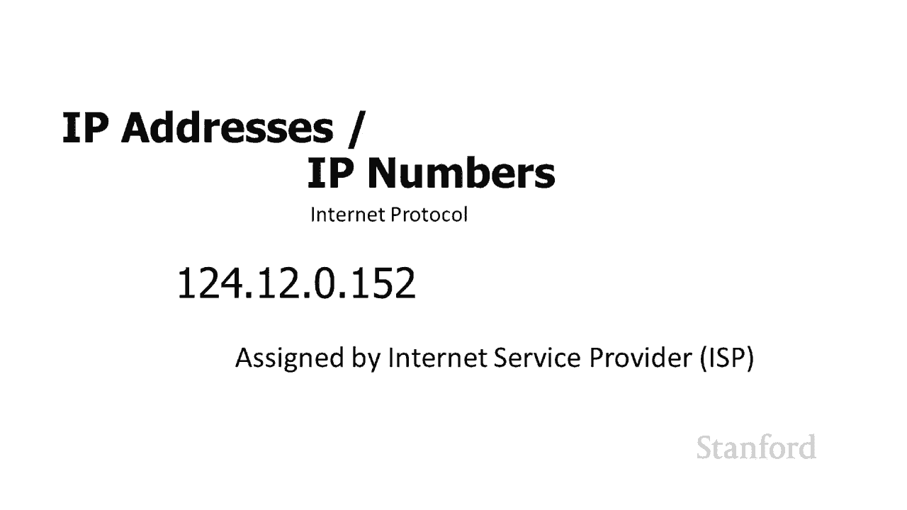

将由您的互联网服务提供商分配，将由您的互联网服务提供商分配，undefined，undefined，所以这不会像，所以这不会像，我们尝试的邮局一样 ng，我们尝试的邮局一样 ng。

使用社会安全号码发送东西，而，使用社会安全号码发送东西，而，不是我们要做的是，不是我们要做的是，获取我们的 ip 地址，我正在使用，获取我们的 ip 地址，我正在使用，传统的，传统的，ipv4。

因为我更容易，ipv4，因为我更容易，阅读它们，阅读它们，而且不使用更容易，而且不使用更容易，对于我们的例子，那些超级超级超级长的数字，对于我们的例子，那些超级超级超级长的数字，好的 所以这是。

好的 所以这是，我们试图在互联网上发送的一封信，我们试图在互联网上发送的一封信，undefined，undefined，181。12。83。0，181。12。83。0，我看着那里的前两位数字。

我看着那里的前两位数字，undefined，undefined，181。12 我立即知道那是，181。12 我立即知道那是，斯坦福大学的 ip，斯坦福大学的 ip，地址 记得我告诉过你，我们有。

地址 记得我告诉过你，我们有。

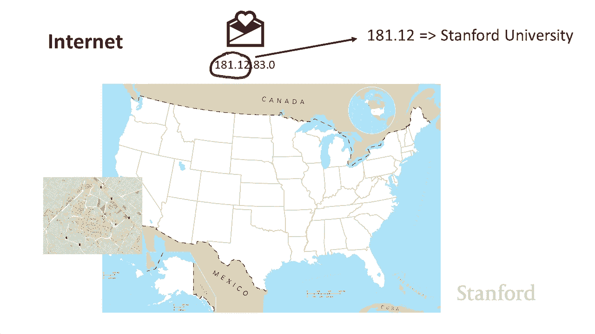

一大堆 ip 地址，一大堆 ip 地址，超出了我们的需要，所以这，超出了我们的需要，所以这，undefined，undefined，所以我知道，所以我知道，它在美国，我知道它是，它在美国，我知道它是。

斯坦福大学，但我实际上，undefined，undefined，如果我看 1812，如果我看 1812，undefined，undefined，然后再看 83，我知道更多，undefined。

undefined，undefined，undefined，特定的宿舍，特定的宿舍，所以你可以看到 e 我们，所以你可以看到 e 我们，不仅可以将它路由到互联网服务，不仅可以将它路由到互联网服务。

提供商，而且互联网服务，提供商，而且互联网服务，提供商可以设置他们的系统，以便，提供商可以设置他们的系统，以便，他们可以在系统内进一步路由它，他们可以在系统内进一步路由它，直到路由软件可以。

直到路由软件可以，跟踪这个特定的，跟踪这个特定的，这里的人是他们的 mac 地址，我实际上，这里的人是他们的 mac 地址，我实际上，知道该 mac 地址所在的位置，知道该 mac 地址所在的位置。

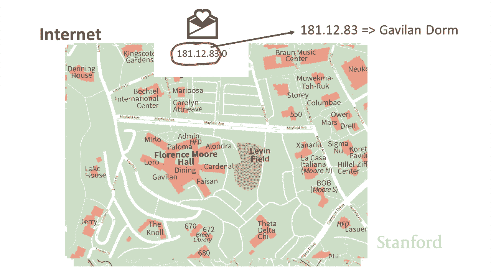

，因此该系统将可以在 Internet 内路由，因此该系统将可以在 Internet 内路由，任何内容，任何内容，现在请记住，现在请记住，因为如果您在此处有特定号码，这些，因为如果您在此处有特定号码。

这些，号码与您的 Internet 服务提供商有关，undefined，undefined，” 在斯坦福，” 在斯坦福，假设你飞回家，你，假设你飞回家，你。

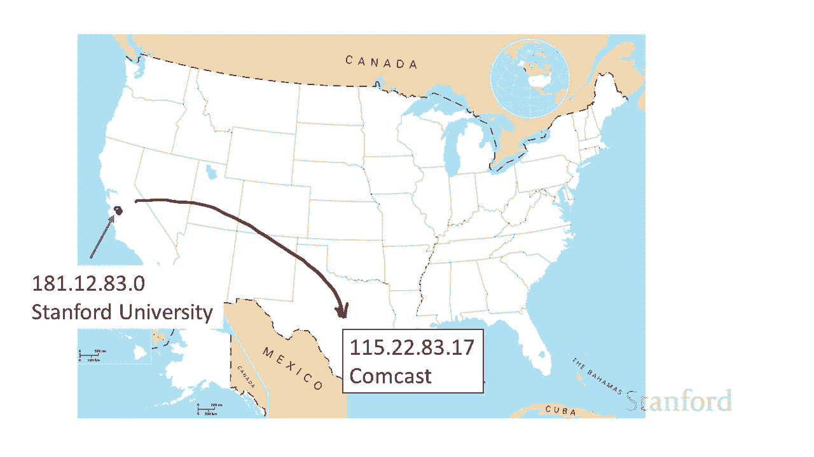

现在在康卡斯特，现在在康卡斯特，你会得到一个不同的 IP，你会得到一个不同的 IP，地址，地址，我们还没有完成问题是这些，我们还没有完成问题是这些，IP 地址，IP 地址，不是很容易记住。

不是很容易记住，有些人知道 一堆 ipv4，有些人知道 一堆 ipv4，地址，地址，主要是计算机技术人员，主要是计算机技术人员，他们需要知道校园里的某些 ipv4 地址，undefined。

undefined，但我很怀疑是否有人，但我很怀疑是否有人，记住了这些 ipv6 地址中的任何一个，记住了这些 ipv6 地址中的任何一个。

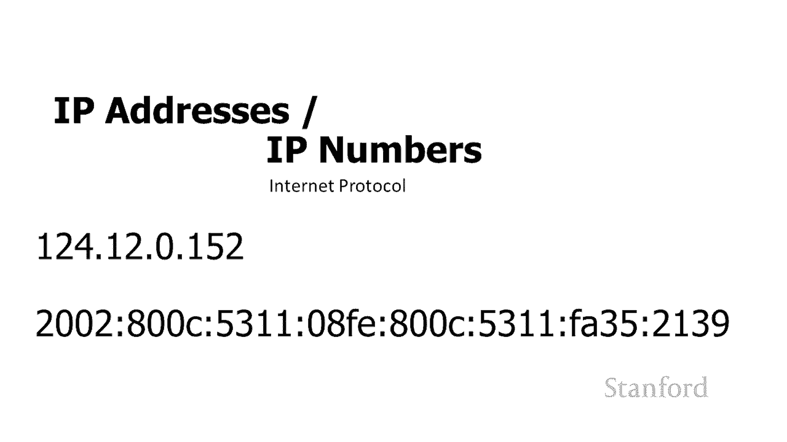

他是不够的，所以我们需要，他是不够的，所以我们需要，另一个方案，另一个方案，那就是主机名，这就是，那就是主机名，这就是，你们习惯的，你们习惯的，比如 www。stanford。edu，比如 www。

stanford。edu，www。nasa。gov，www。nasa。gov，所有那些你们习惯的地址，所有那些你们习惯的地址，被称为主机名，被称为主机名，和 有一个系统可以将，和 有一个系统可以将。

主机名转换为 ip 地址，主机名转换为 ip 地址，最终互联网上的所有流量都，最终互联网上的所有流量都。

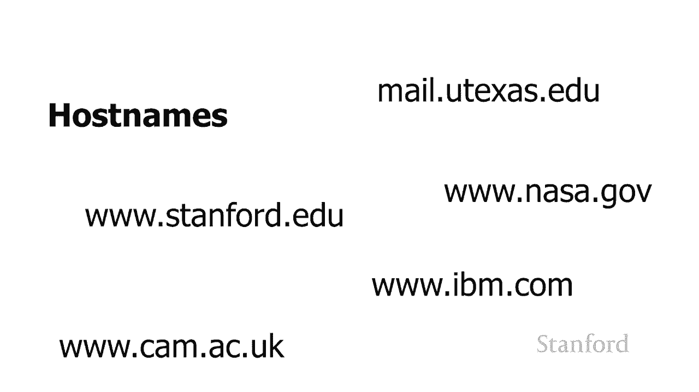

使用 ip 地址传输，使用 ip 地址传输，我们还有另一个主要的命名系统，我们还有另一个主要的命名系统，要讨论，要讨论，而以前的命名，而以前的命名，系统用于识别互联网上的计算机。

系统用于识别互联网上的计算机，undefined，undefined，这个特殊的命名系统用于，这个特殊的命名系统用于，识别在单台计算机上运行的程序，识别在单台计算机上运行的程序，undefined。

undefined，所以这里是我的计算机，我正在，所以这里是我的计算机，我正在，运行许多不同的程序，运行许多不同的程序，我正在运行网络浏览器我正在运行，我正在运行网络浏览器我正在运行。

电子邮件程序我正在运行消息传递，电子邮件程序我正在运行消息传递，系统 我正在播放音乐，系统 我正在播放音乐，因此我的计算机正在，undefined，undefined。

从互联网上的许多不同计算机接收信息，从互联网上的许多不同计算机接收信息，因此当我的计算机接收到该，因此当我的计算机接收到该，信息时，它需要找出，信息时，它需要找出，各种程序中的哪一个。

各种程序中的哪一个，我正在运行的信息应该，我正在运行的信息应该，被发送到，这就是这个，被发送到，这就是这个，端口号系统的用途，所以这里，端口号系统的用途，所以这里，有一些常见的端口号。

有一些常见的端口号，呃网络浏览使用端口 80。电子邮件使用，呃网络浏览使用端口 80。电子邮件使用，端口 143，端口 143，实际上电子邮件有几个，实际上电子邮件有几个。

与之关联的不同端口 facebook，与之关联的不同端口 facebook，消息传递 使用端口 522，消息传递 使用端口 522，等等，所以如果我的电脑接收到，等等，所以如果我的电脑接收到。

数据并且它标有端口 143，我的，数据并且它标有端口 143，我的，电脑，电脑，知道应该将其转发到电子邮件，知道应该将其转发到电子邮件，程序，程序，而如果我的电脑接收到，而如果我的电脑接收到。

标有端口 3689 的信息，它，标有端口 3689 的信息，它，知道那将，知道那将，转到音乐程序 如果它，转到音乐程序 如果它，通过端口 80 获取信息，它知道，通过端口 80 获取信息，它知道。

它应该转到 Web 浏览器，它应该转到 Web 浏览器，您可能会遇到这些端口号，您可能会遇到这些端口号，特别，特别，是与计算机安全相关，是与计算机安全相关，的防火墙会打开或关闭这些端口。

的防火墙会打开或关闭这些端口，当我们，当我们，得到 到安全讲座，但，得到 到安全讲座，但，基本上这里发生的事情是，undefined，undefined，防火墙控制什么信息，防火墙控制什么信息。

从计算机出来，什么信息，从计算机出来，什么信息，进来 根据端口号到计算机上，进来 根据端口号到计算机上，所以它说，所以它说，哦，你不使用这个特定的端口，哦，你不使用这个特定的端口。

也许这是用于特定程序的标准端口，也许这是用于特定程序的标准端口，但，但，你没有使用那个程序，所以如果我，你没有使用那个程序，所以如果我，开始接收到你的计算机的流量，开始接收到你的计算机的流量。

试图通过该，试图通过该，端口可能是有人试图破解，端口可能是有人试图破解，与该端口相关的程序或，与该端口相关的程序或，以某种方式使用，以某种方式使用，软件中的某种漏洞，软件中的某种漏洞。

进入您的计算机所以我将，进入您的计算机所以我将，继续阻止该端口，继续阻止该端口。

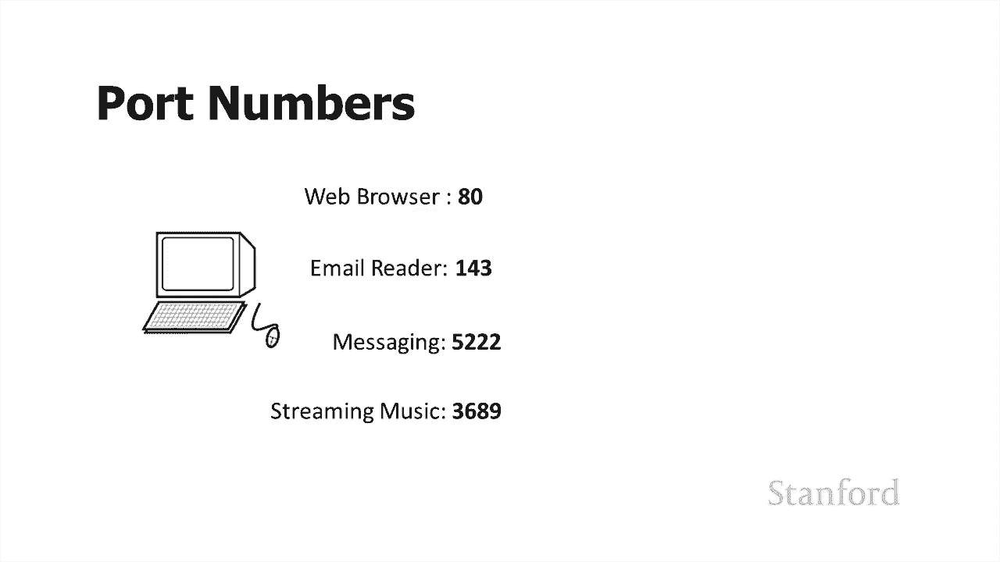

而您 只会打开您正在运行，而您 只会打开您正在运行，的程序实际需要的端口，undefined，undefined，您可能还会听到术语套接字 这，undefined，undefined。

本质上是相关的 套接字是，本质上是相关的 套接字是，两台计算机之间的连接，两台计算机之间的连接，嗯，所以您可以在这里看到我有一个网络，嗯，所以您可以在这里看到我有一个网络，服务器，服务器。

这个网络服务器有向三台不同计算机开放的套接字，undefined，undefined，我画了一条线，显示，我画了一条线，显示，这些套接字中的一个，这些套接字中的一个，undefined。

undefined，这是我的 IP 地址，这是我的 IP 地址，它在端口 80 上，它在端口 80 上，我会，我会，为这些其他计算机打开不同的套接字，为这些其他计算机打开不同的套接字。

我的网络服务器正在向所有计算机发送信息，我的网络服务器正在向所有计算机发送信息，今天就到此为止，但我们，今天就到此为止，但我们。

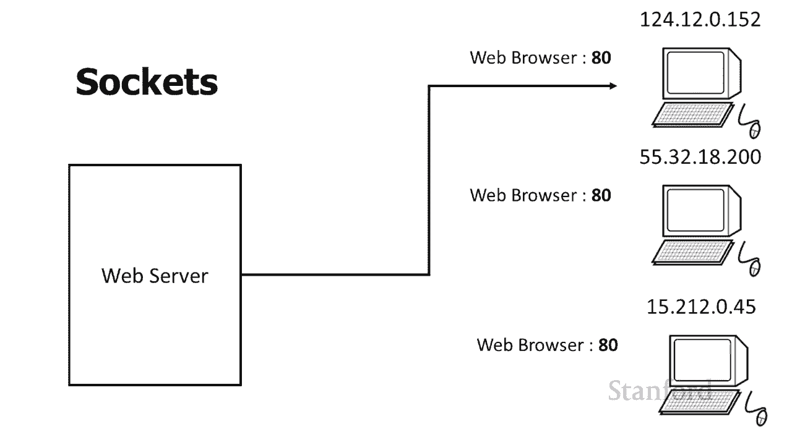

将，将，undefined，undefined。

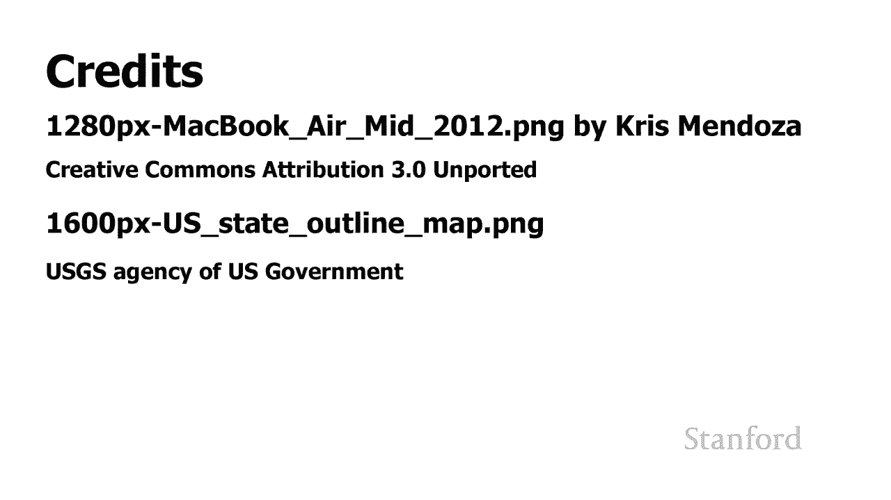

undefined。