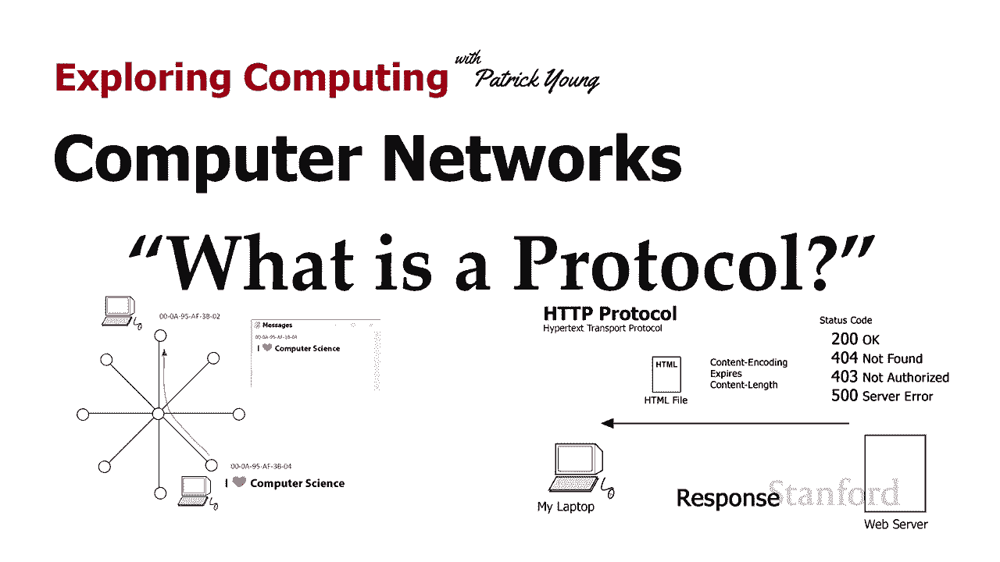
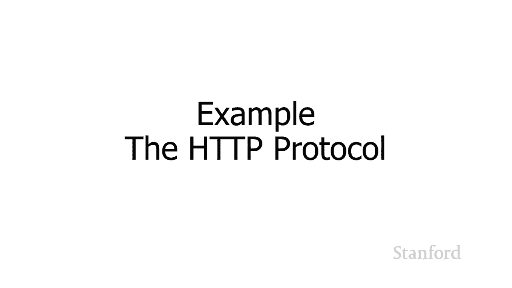
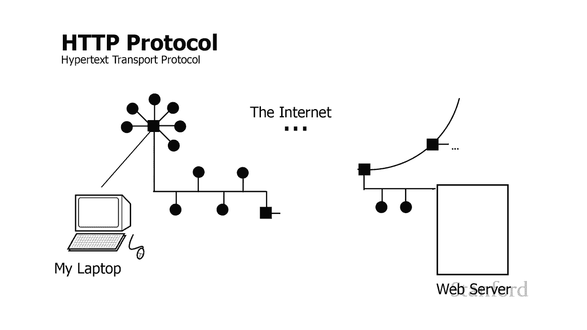
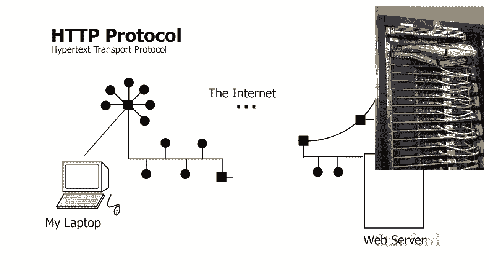
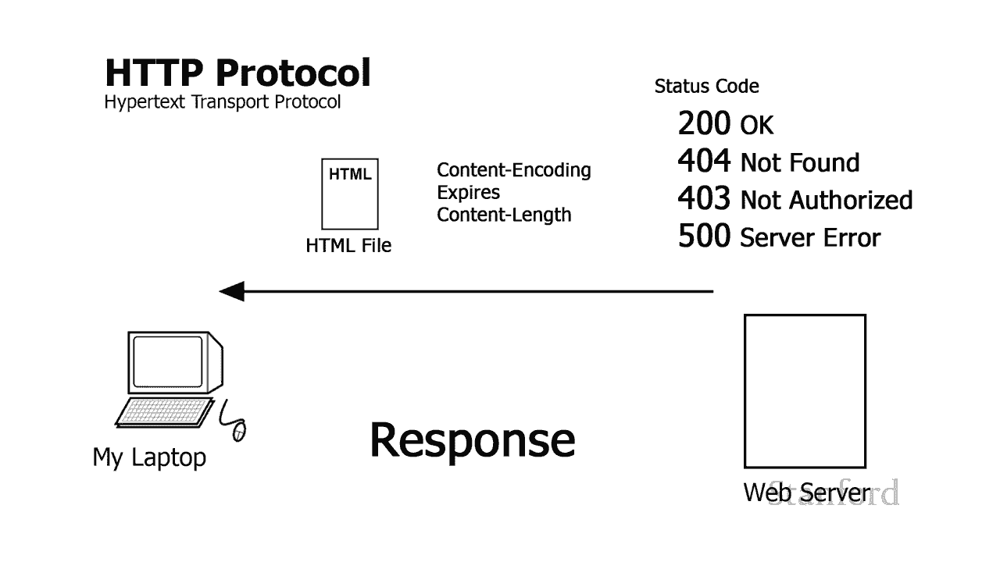
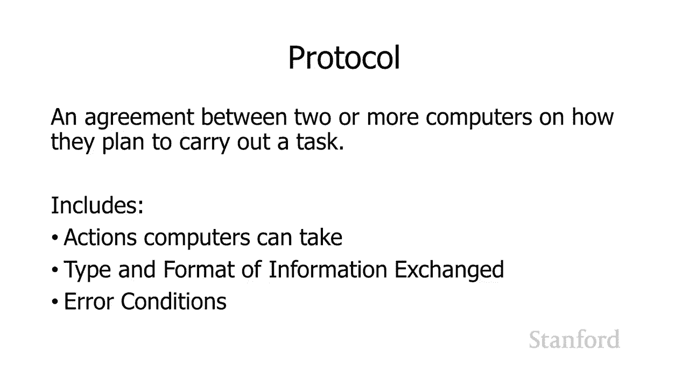
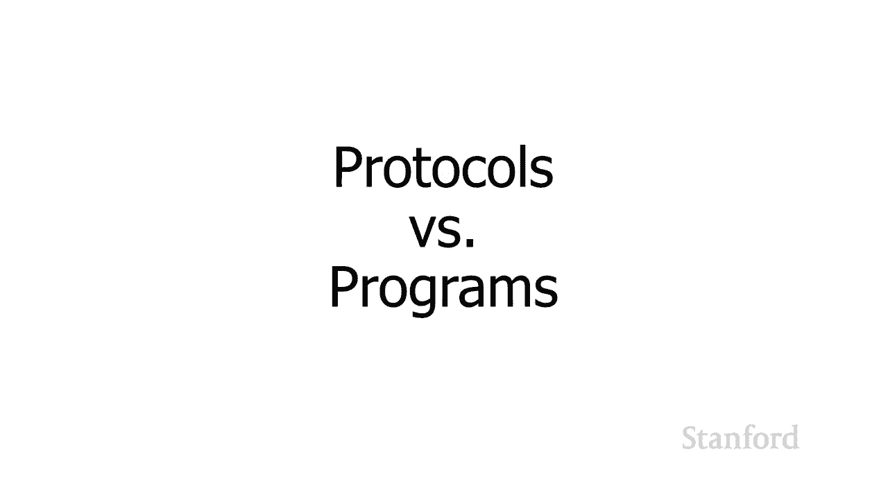
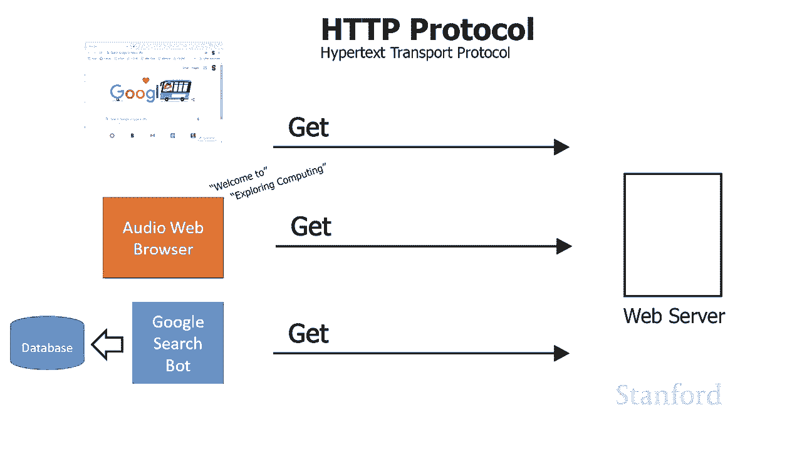
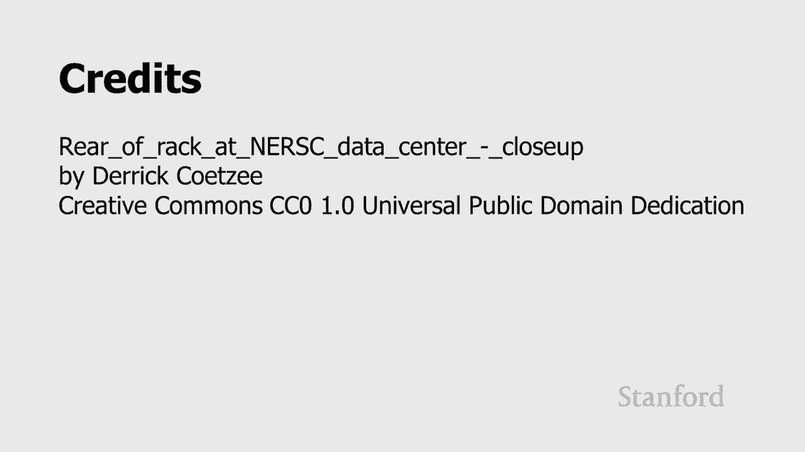

# 【双语字幕+资料下载】斯坦福CS105 ｜ 计算机科学导论(2021最新·完整版) - P21：L6.1- 网络协议：什么是协议 - ShowMeAI - BV1eh411W72E

undefined，欢迎探索，欢迎探索，今天的计算视频是计算机网络，今天的计算视频是计算机网络，今天的协议是什么 我们，今天的协议是什么 我们，将关注，将关注，协议 我们将详细研究。

协议 我们将详细研究，互联网的底层协议，互联网的底层协议，事实证明，事实证明，管理互联网的协议，undefined，undefined，与我们可以或不能对互联网做什么，与我们可以或不能对互联网做什么。

以及为什么互联网，以及为什么互联网。

会这样行事有，会这样行事有，很大关系让我们从回答这个，很大关系让我们从回答这个，问题，问题，开始，我想首先，开始，我想首先，讨论为什么 我们需要协议，讨论为什么 我们需要协议，我认为这会让你更好地。

undefined，undefined，了解协议实际上是什么，了解协议实际上是什么，undefined，undefined，让我们回到上一堂课的例子，让我们回到上一堂课的例子，我在教室里有一堆电脑在。

我在教室里有一堆电脑在，Wi-Fi 网络上， 我，Wi-Fi 网络上， 我，试图在上一堂课结束时向我的朋友发送一条消息，试图在上一堂课结束时向我的朋友发送一条消息，我们讨论，我们讨论。

了命名方案以及如何识别，了命名方案以及如何识别，网络上的单个计算机，因此，网络上的单个计算机，因此，此时，此时，我们有一种识别每台计算机的方法，undefined，undefined。

所以支持 我想发送这条消息 我，所以支持 我想发送这条消息 我，现在不必将它发送给，现在不必将它发送给，教室里的每个人 我可以，教室里的每个人 我可以，提供我朋友计算机的具体地址并。

提供我朋友计算机的具体地址并，确保它发送给她，确保它发送给她，但我实际上发送的，但我实际上发送的，是什么我只是发送消息和 她，是什么我只是发送消息和 她，只是会收到一条随机消息，说。

只是会收到一条随机消息，说，有人给她发了“我喜欢计算机，有人给她发了“我喜欢计算机，科学”，科学”，我们是否要用计算机的地址来识别它，undefined，undefined，undefined。

如果我们在这里，如果我们在这里，使用物理地址或 mac 地址，这，使用物理地址或 mac 地址，这，似乎有点令人毛骨悚然 如果我有主机名会更好，undefined，undefined。

尽管通常大多数计算机，尽管通常大多数计算机，实际上没有主机名主机名通常，实际上没有主机名主机名通常，undefined，undefined，保留给诸如 Web 服务器之类。

保留给诸如 Web 服务器之类，的东西，在这些服务器中很多人将不得不，的东西，在这些服务器中很多人将不得不，使用我可能想要的名称访问它，使用我可能想要的名称访问它，要做的是，要做的是。

在消息中包含某种信息，以，在消息中包含某种信息，以，识别谁发送了消息，识别谁发送了消息，以及该消息将发送给谁，所以，以及该消息将发送给谁，所以，也许像帕特里克的 tammy 这样的事情。

也许像帕特里克的 tammy 这样的事情，undefined，undefined，但我必须确切地决定这是怎么，但我必须确切地决定这是怎么，回事 发送，回事 发送，记住什么是真正从，记住什么是真正从。

一台计算机发送到另一台计算机只是一个组织为字节，一台计算机发送到另一台计算机只是一个组织为字节，的位序列，的位序列，所以你知道也许我，所以你知道也许我，把她的名字放在第一位，把她的名字放在第一位。

然后是一个 ascii null，然后是一个 ascii null，斜杠零是 ascii null，斜杠零是 ascii null，uh 对应于 整个，uh 对应于 整个，字节都被清零，然后是。

字节都被清零，然后是，我的名字，我的名字，或者我可以发送我的名字，然后是，或者我可以发送我的名字，然后是，你知道的问题，然后是她的名字，你知道的问题，然后是她的名字，或者我可以加上一个 from。

或者我可以加上一个 from，和一个两个，然后问题，和一个两个，然后问题，来了，从后面跟冒号，来了，从后面跟冒号，是吗 其次是 dash 这里的基本思想，是吗 其次是 dash 这里的基本思想，是，是。

可以通过多种不同的，可以通过多种不同的，方式发送此消息，但需要，方式发送此消息，但需要，发生的，发生的，是我的计算机和她的计算机都，是我的计算机和她的计算机都，需要完全同意，需要完全同意，此消息的确切。

此消息的确切，内容，而不仅仅是消息的内容，内容，而不仅仅是消息的内容，但是与消息相关的其他信息，但是与消息相关的其他信息，例如我，例如我，将使用什么格式来，将使用什么格式来，发送发件人和收件人是谁。

发送发件人和收件人是谁，undefined，undefined，所以这实际上是协议，所以这实际上是协议，是协议是协议赌注 在两台，是协议是协议赌注 在两台，或多台计算机，或多台计算机。

上他们计划如何执行任务，上他们计划如何执行任务，让我们来看看现实生活中的，让我们来看看现实生活中的，协议 我们将看看 http，协议 我们将看看 http，协议 这是万维网使用的协议。

undefined，undefined，正如您在此处看到的 http 代表，正如您在此处看到的 http 代表，超文本传输协议，超文本传输协议，我们实际上将讨论下一节课的，我们实际上将讨论下一节课的。

超文本到底是什么，undefined，undefined，这是我的笔记本电脑 它已，这是我的笔记本电脑 它已，连接到互联网 你还记得，undefined，undefined。

上一堂课的这些图表 代表某种，上一堂课的这些图表 代表某种，网络 而，网络 而，我已连接到 网络，我已连接到 网络，然后，然后，undefined，undefined。

在我的网络和 Web 服务器所在的位置之间还有一大堆其他网络，在我的网络和 Web 服务器所在的位置之间还有一大堆其他网络，这就是互联网上的，这就是互联网上的，点点滴滴，正如您，点点滴滴，正如您。

从上一堂课中所回忆的，互联网，从上一堂课中所回忆的，互联网，实际上是，实际上是，一个互联网作品，连接，一个互联网作品，连接，了一大堆不同的网络。了一大堆不同的网络。结合在一起，结合在一起。

，然后在另一边，我们有了，然后在另一边，我们有了，网络服务器，现在，网络服务器，现在，我只是用一个盒子代表网络服务器，我只是用一个盒子代表网络服务器，请不要告诉我的艺术老师，请不要告诉我的艺术老师。

我已经完全放弃了任何形式 f，我已经完全放弃了任何形式 f，透视图，透视图，但在此插图中，您，但在此插图中，您，实际上可以看到 Web 服务器的实际，实际上可以看到 Web 服务器的实际，外观。

而我们在这里看到的是，外观，而我们在这里看到的是，这是一个机架，里面有一大堆，这是一个机架，里面有一大堆，不同的计算机，机架，不同的计算机，机架，内的每个水平组件，内的每个水平组件，实际上代表一台。

实际上代表一台，不同的计算机，不同的计算机，这，这。

就是您与之交互的大多数网络计算机的，就是您与之交互的大多数网络计算机的，样子，尤其是当您，样子，尤其是当您，与商业安装交互时，与商业安装交互时，undefined，undefined。

但我们只是用那个方框来表示它，但我们只是用那个方框来表示它，所以这里是，所以这里是，简化的 图表 我正在摆脱，简化的 图表 我正在摆脱，所有互联网的东西，但请，所有互联网的东西，但请，记住互联网。

记住互联网，仍然存在，所以我有我的，仍然存在，所以我有我的，电脑，电脑，我需要联系我们，我需要联系我们，之前看到，之前看到，的网络服务器，网络服务器是由主机名标识的，的网络服务器。

网络服务器是由主机名标识的，undefined，undefined，这需要转换为一个 ip，这需要转换为一个 ip，地址，地址，也称为 ipnumber，然后我，也称为 ipnumber，然后我。

将继续通过互联网将请求发送，将继续通过互联网将请求发送，到网络服务器，到网络服务器，现在事实证明实际上有，现在事实证明实际上有，我可以向 Web 服务器发出几种类型的请求，undefined。

undefined，我可以发出一个 get 请求，表示嘿，我可以发出一个 get 请求，表示嘿，您有一些信息，可以，您有一些信息，可以，继续发送给我吗，继续发送给我吗，我可以使用 put 请求，表示嘿。

我可以使用 put 请求，表示嘿，我希望你为我做点什么 这，我希望你为我做点什么 这，将修改您的状态，undefined，undefined，这是您可能需要的一些信息，这用于诸如。

这是您可能需要的一些信息，这用于诸如，电子商务之类的事情，我，电子商务之类的事情，我，实际上正在下订单，实际上正在下订单，因此我将订单信息发送，因此我将订单信息发送，到服务器，服务器正在，到服务器。

服务器正在，更改其状态，以便 它记住了，更改其状态，以便 它记住了，我的订单，我的订单，有一个删除 通常，有一个删除 通常，只有在您获得授权的情况下才能执行，只有在您获得授权的情况下才能执行。

undefined，undefined，关键就在这里 有，关键就在这里 有，一大堆不同的请求 还有，一大堆不同的请求 还有，几个我没有，几个我没有，在这里介绍，在这里介绍，所以这只需要。

undefined，undefined，当笔记本电脑或其他，当笔记本电脑或其他，计算机连接，计算机连接，到 Web 服务器时，到 Web 服务器时，它可以成为 http 协议的一部分。

它可以成为 http 协议的一部分，除了请求类型（，除了请求类型（，例如获取、发布或删除）之外，它可以对该 Web 服务器发出什么样的请求，例如获取、发布或删除）之外。

它可以对该 Web 服务器发出什么样的请求，实际上还有一堆其他，实际上还有一堆其他，信息附加到，信息附加到，请求中，请求中，所以这些只是，所以这些只是，我们讨论过的几个例子，我们讨论过的几个例子。

实际上我们，实际上我们，在上课的第一天就讨论了字符编码，在上课的第一天就讨论了字符编码，当时你学会了如何存储你已经学习过的埃及，当时你学会了如何存储你已经学习过的埃及，象形文字 看到，象形文字 看到。

了 unicode utf-8 字符编码，所以，了 unicode utf-8 字符编码，所以，我可以，我可以，向网络服务器发送信息，说，向网络服务器发送信息，说，这些是我可以处理的字符编码类型。

undefined，undefined，您可以向服务器发送请求，您可以向服务器发送请求，说嘿，说嘿，我有这个文件的副本，但如果，我有这个文件的副本，但如果，文件在 服务器，文件在 服务器。

自特定日期起已被修改 然后我，自特定日期起已被修改 然后我，想要它的新副本，想要它的新副本，你可以告诉它你接受，你可以告诉它你接受，特定类型的编码 在这种，特定类型的编码 在这种，情况下我不是在谈论。

情况下我不是在谈论，字符编码 我实际上是在，字符编码 我实际上是在，谈论压缩技术，谈论压缩技术，我们已经讨论了，我们已经讨论了，图像压缩 我们讨论了，图像压缩 我们讨论了。

声音压缩 如果您曾经使用过 zip，声音压缩 如果您曾经使用过 zip，文件，文件，那么你们尝试过的文件也会发生，那么你们尝试过的文件也会发生，压缩，压缩，因此，服务器可以做的一件事，因此。

服务器可以做的一件事，是它可以，是它可以，将文件压缩在一起或使用，将文件压缩在一起或使用，其他一些压缩技术来，其他一些压缩技术来，减少这些文件在通过万维网发送之前占用的空间量，undefined。

undefined，这就是，这就是，接受编码所说的 说，接受编码所说的 说，嘿，如果您，嘿，如果您，想继续并以该格式将它们发送给我，我可以处理这些 zip 文件，undefined，undefined。

因此您可以看到，undefined，undefined，发送方或请求方可以使用，发送方或请求方可以使用，此特定协议执行许多不同的选择，此特定协议执行许多不同的选择，然后就 响应的，然后就 响应的。

主要部分是，主要部分是，我将要返回的文件，在这种情况下，我将要返回的文件，在这种情况下，我将表示为 html 文件，我们将在，我将表示为 html 文件，我们将在，下周再次讨论 html。

下周再次讨论 html，但除此之外，但除此之外，undefined，undefined，Web 服务器还有其他内容 可以发送给，Web 服务器还有其他内容 可以发送给，包含，包含。

此内容的请求者 嘿 这个内容被编码 这里是，此内容的请求者 嘿 这个内容被编码 这里是，undefined，undefined，它包含的编码 这里是这个，它包含的编码 这里是这个。

文件的有效期 这里是它什么时候到期，文件的有效期 这里是它什么时候到期，然后通常它还会包含，然后通常它还会包含，一个关于多长时间的想法 e 文件是为了让，一个关于多长时间的想法 e 文件是为了让。

undefined，undefined，接收者知道文件何时，接收者知道文件何时，完成传输，完成传输，协议的另一个重要部分，协议的另一个重要部分，是状态代码，是状态代码，您可能熟悉其中一些。

您可能熟悉其中一些，您从未见过的 200 代码，您从未见过的 200 代码，但是当您的计算机收到时，您的计算机确实会收到它，但是当您的计算机收到时，您的计算机确实会收到它，一个 200 代码，它。

一个 200 代码，它，知道哦，一切都很好，知道哦，一切都很好，然后当然我们有臭名昭著的，然后当然我们有臭名昭著的，404，这意味着，404，这意味着，您正在请求一个文件，但该文件，您正在请求一个文件。

但该文件，不，不，存在 403 在某些方面我认为，存在 403 在某些方面我认为，它有点苛刻，它说，它有点苛刻，它说，是的，那个文件在那里 但我不会，是的，那个文件在那里 但我不会，给你它，给你它。

你没有权限然后 500，你没有权限然后 500，这意味着有一个服务器错误，这意味着有一个服务器错误，实际上有，实际上有，很多这些不同的状态，很多这些不同的状态，代码，所以，代码，所以。

这只是对 http 的一个简单介绍，这只是对 http 的一个简单介绍，undefined，undefined。

但主要是我想 使用现实生活中的协议让您，但主要是我想 使用现实生活中的协议让您，了解协议是什么样的，了解协议是什么样的，undefined，undefined，因此我们可以看出，因此我们可以看出，是的。

是的，协议是两台或多，协议是两台或多，台计算机之间关于它们将如何，台计算机之间关于它们将如何，执行任务的协议 e 网络，执行任务的协议 e 网络，但我们也看到需要包含的信息类型，undefined。

undefined，因此协议应指定，undefined，undefined，一台计算机可以对另一请求发出，一台计算机可以对另一请求发出，哪些类型的请求，将发送哪些类型的信息，undefined。

undefined，该信息的格式是什么，该信息的格式是什么，然后还 重要的是，然后还 重要的是，当出现问题时该怎么做，这就是为什么，当出现问题时该怎么做，这就是为什么。

我们在那里看到了那些不同的错误代码。

undefined，undefined，学生经常感到困惑的一个主题，学生经常感到困惑的一个主题。

是协议和程序之间的关系是什么，undefined，undefined，所以让我们快速浏览一下我们，所以让我们快速浏览一下我们，看到的 http 协议的工作原理，看到的 http 协议的工作原理。

有许多不同的程序，有许多不同的程序，支持 http，支持 http，协议，例如 chrome firefox，协议，例如 chrome firefox，safari edge 这些都是。

safari edge 这些都是，undefined，undefined，在我们的个人计算机上运行的程序，它们，在我们的个人计算机上运行的程序，它们，了解，了解。

如何使用 http 协议与 web 服务器进行通信，undefined，undefined，只要我们的 web 浏览器程序，只要我们的 web 浏览器程序，理解并遵循相同的规则，理解并遵循相同的规则。

它们可以与任何 Web 服务器进行互操作，它们可以与任何 Web 服务器进行互操作，undefined，undefined，类似地，有许多，类似地，有许多，不同的，不同的，那里的网络服务器类型。

那里的网络服务器类型，只要这些网络服务器上的，只要这些网络服务器上的，程序遵循 http 规则，程序遵循 http 规则，它们就能够响应，它们就能够响应，来自不同网络浏览器的请求。

来自不同网络浏览器的请求，我还应该提到，虽然，我还应该提到，虽然，我们大多数人通常会想到正在制作的程序，undefined，undefined，像我们的传统 Web 浏览器一样向 Web 服务器。

像我们的传统 Web 浏览器一样向 Web 服务器，发出请求 还有其他程序可以，undefined，undefined，像我们的，像我们的。

传统 Web 浏览器那样向 Web 服务器发出完全相同的 http 请求，只是为了，传统 Web 浏览器那样向 Web 服务器发出完全相同的 http 请求，只是为了，提供一些示例，提供一些示例。

有音频 Web 浏览器，有音频 Web 浏览器，人们在视觉上 使用受损，人们在视觉上 使用受损，他们实际上能够，他们实际上能够，将网页读给某人，将网页读给某人，然后还有其他程序，然后还有其他程序。

例如谷歌搜索机器人，例如谷歌搜索机器人，它甚至不涉及人类，它，它甚至不涉及人类，它，只是向网页发出请求，只是向网页发出请求，并使用这些网页来构建 建立它的，并使用这些网页来构建 建立它的，数据库。

它可以用来，数据库，它可以用来，告诉我们如何找到特定的，告诉我们如何找到特定的，主题，底线是协议只是，主题，底线是协议只是，指定，指定，了一组不同程序需要遵循的规则。undefined。

undefined，如果他们想与，如果他们想与，undefined，undefined，网络上其他计划协同工作，网络上其他计划协同工作，以执行此任务的计算机进行交互，以执行此任务的计算机进行交互。

许多人可以按照这些协议编写不同的程序，undefined，undefined，事实上，正如我们在这里看到的 http，事实上，正如我们在这里看到的 http，他们，他们，在下一个系列中经常这样做 我们。

在下一个系列中经常这样做 我们，将查看互联网上的实际协议，undefined，undefined，事实证明，互联网上的协议，事实证明，互联网上的协议，就是所谓的，就是所谓的，分层 这是一个相对复杂的。

分层 这是一个相对复杂的，主题，但通过，主题，但通过，了解分层协议，了解分层协议，及其工作原理，您，及其工作原理，您，将对互联网的工作原理有更深入的了解，将对互联网的工作原理有更深入的了解，因此，因此。

我们将继续讨论这个问题，我们将继续讨论这个问题，下一个视频将讨论，下一个视频将讨论，分层协议实际上是什么，分层协议实际上是什么，undefined，undefined，然后我们将仔细，然后我们将仔细。

研究 互联网上使用的实际图层。

