# 【双语字幕+资料下载】斯坦福CS105 ｜ 计算机科学导论(2021最新·完整版) - P22：L6.2- 网络协议：互联网协议 - ShowMeAI - BV1eh411W72E

undefined，欢迎探索计算，欢迎探索计算，今天的视频，今天的视频，是互联网的计算机网络协议，所以正如我，是互联网的计算机网络协议，所以正如我，在上一堂课中提到的，在上一堂课中提到的。

互联网协议是分层的，互联网协议是分层的，这有时有点，这有时有点，难以理解，但，难以理解，但。

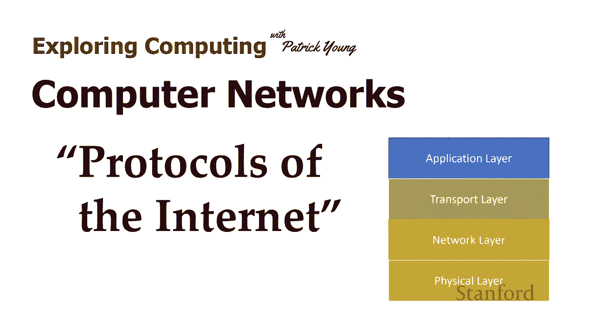

undefined，undefined，了解互联网的真正运作方式很重要，我喜欢，了解互联网的真正运作方式很重要，我喜欢，undefined，undefined，通过类比来教授分层协议，所以让我们。

通过类比来教授分层协议，所以让我们，从，从，一个假设开始，假设，一个假设开始，假设，我在斯坦福完成教学后，我在斯坦福完成教学后，退休，我搬到缅因州，退休，我搬到缅因州，我一直很好地用手工作。

我一直很好地用手工作，我曾经建立模型，所以我，我曾经建立模型，所以我，决定我要制作一些木制，决定我要制作一些木制，玩具，玩具，而这些木制玩具最终非常，而这些木制玩具最终非常，受欢迎，受欢迎。

因此世界各地的人们都问，因此世界各地的人们都问，他们是否可以购买我的玩具，他们是否可以购买我的玩具，斯坦福大学的某个人，斯坦福大学的某个人，加利福尼亚州的一位前学生想要购买我的。

加利福尼亚州的一位前学生想要购买我的，玩具 等等 我做得好吗，玩具 等等 我做得好吗，这里有一种可能性我雇了卡车，这里有一种可能性我雇了卡车，我的卡车把玩具，我的卡车把玩具，带到火车站，我们。

带到火车站，我们，把玩具转移到火车站，把玩具转移到火车站，火车开到芝加哥，火车开到芝加哥，然后它 转乘另一列火车，然后它 转乘另一列火车，最终到达洛杉矶的某个地方，最终到达洛杉矶的某个地方。

然后我租了另，然后我租了另，一辆卡车将玩具从，一辆卡车将玩具从，洛杉矶运到我以前的学生居住的任何地方，undefined，undefined，因此，因此，假设我可以管理，假设我可以管理，跑步的复杂性。

这会将玩具送到我以前的学生手中 一个完整的，跑步的复杂性，这会将玩具送到我以前的学生手中 一个完整的，交通网络，但这似乎不是，交通网络，但这似乎不是，一个很好的主意，一个很好的主意，不是吗。

我不想这样做，我想，不是吗，我不想这样做，我想，专注于制造玩具，我，专注于制造玩具，我，不想处理任何，不想处理任何，undefined，undefined，我想要的交通问题 要做的是我喜欢。

undefined，undefined，把玩具拿到联邦快递办公室，然后，把玩具拿到联邦快递办公室，然后，神奇地让它出现在我以前的，神奇地让它出现在我以前的，学生家里，学生家里，我以前尝试过的所有步骤。

undefined，undefined，比如租用卡车制定，比如租用卡车制定，火车时刻表给，火车时刻表给，卡车加满汽油，卡车加满汽油，一切都还在发生，但不同的是，一切都还在发生，但不同的是，我没有处理它。

我没有处理它，联邦快递是这样的，所以，联邦快递是这样的，所以，当我们为互联网开发软件时会发生同样的过程，当我们为互联网开发软件时会发生同样的过程，最终，最终，有人，有人，在那个地方工作 在这。

在那个地方工作 在这，一层，有人，一层，有人，试图弄清楚如何装满，试图弄清楚如何装满，卡车或制定火车，卡车或制定火车，时刻表，时刻表。

但大多数程序员，但大多数程序员，在互联网上编程应用程序并没有，在互联网上编程应用程序并没有，处理这种，处理这种，复杂程度，而是，复杂程度，而是，相当于，相当于，放弃了一些信息 在，放弃了一些信息 在。

联邦快递办公室，让它神奇地，联邦快递办公室，让它神奇地，出现，出现，在另一端，所以，在另一端，所以，我们要做的是看看，我们要做的是看看，undefined，undefined，有时被称为互联网。

有时被称为互联网，协议栈的东西，协议栈的东西，我们将从，undefined，undefined，用气体层填充卡车的底层，用气体层填充卡车的底层，橡胶真正接触道路的地方，橡胶真正接触道路的地方，我们将。

我们将，看到构建在顶部的不同层，直到我们，看到构建在顶部的不同层，直到我们，到达顶层，这，到达顶层，这，是应用程序发生的，是应用程序发生的，地方 相当于，地方 相当于，从联邦快递中删除信息，它。

从联邦快递中删除信息，它。

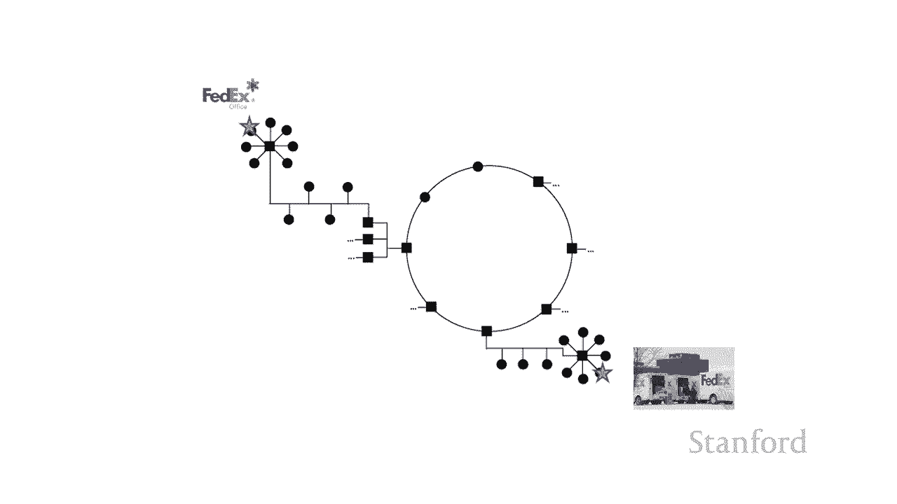

神奇地出现在另一端，神奇地出现在另一端，所以这是互联网，所以这是互联网，协议栈，协议栈，然后在底层我们有，然后在底层我们有，物理层，那就是 层，物理层，那就是 层，基本上是我们，基本上是我们。

给卡车装满汽油的库，给卡车装满汽油的库，然后我们在上面有很多层，然后我们在上面有很多层，然后在顶层我们，然后在顶层我们，有应用层，有应用层，那是人们，那是人们。

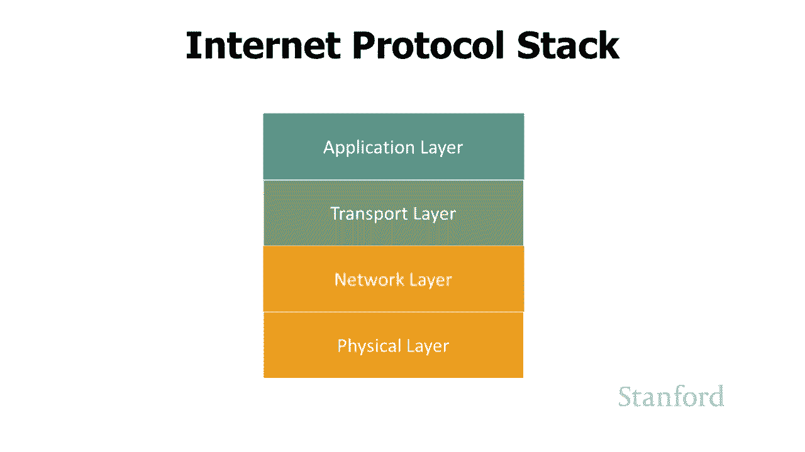

从联邦快递丢包裹的层，所以 让我们来，从联邦快递丢包裹的层，所以 让我们来，看看这些层中的每一层，看看，看看这些层中的每一层，看看，它们，它们，是如何工作的 第一层 底层是。

是如何工作的 第一层 底层是，物理层，物理层，当我们在物理层工作时，当我们在物理层工作时，我们需要确切地决定，我们需要确切地决定，我们如何，我们如何，使用 0 和 1 来传输信息。

使用 0 和 1 来传输信息，例如，当我们，例如，当我们，通过电话传输信息时，通过电话传输信息时，我们将有一个 1070 赫兹的，我们将有一个 1070 赫兹的，音调，我们将有一个，音调，我们将有一个。

20 25 赫兹的音调 e，其中哪，20 25 赫兹的音调 e，其中哪，一个代表，一个代表，零，哪一个代表，零，哪一个代表，一 我们需要弄清楚，一 我们需要弄清楚，物理连接是什么样的。

物理连接是什么样的，我们需要弄清楚一切，我们需要弄清楚一切，将如何组合在一起，将如何组合在一起，现在关于物理层的事情，现在关于物理层的事情，是任何时候你想出一个你将拥有的新。

是任何时候你想出一个你将拥有的新，网络，网络，定义一个新的，定义一个新的，物理层，物理层，我们将发现，我们将发现，并非所有层都是这种情况，而是，并非所有层都是这种情况，而是，较低的层，较低的层。

每次我们拥有一种新类型的网络时，我们都需要定义一个新副本，每次我们拥有一种新类型的网络时，我们都需要定义一个新副本，所以如果我决定，undefined，undefined。

在太平洋上获取信息的最佳方法是让一群，在太平洋上获取信息的最佳方法是让一群，鲨鱼头上有可怕的激光束，undefined，undefined，我需要弄清楚这些，我需要弄清楚这些，鲨鱼将如何。

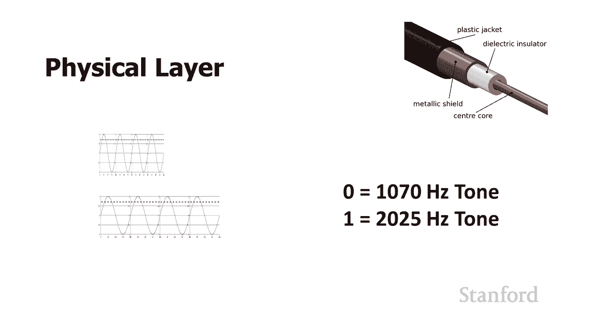

undefined，undefined，在网络的物理层顶部跨太平洋传输零和一，在网络的物理层顶部跨太平洋传输零和一，层，层，网络层的协议是互联网协议，网络层的协议是互联网协议，这与，这与。

我们看到 IP 地址时看到的互联网协议相同，undefined，undefined，而这一层，而这一层，建立在物理层之上，它，建立在物理层之上，它，仍然非常原始，仍然非常原始。

所有通过互联网协议发送的信息，所有通过互联网协议发送的信息，都，都，在进行 限制为 64 KB，在进行 限制为 64 KB，数据包，数据包，这些数据包将包括，这些数据包将包括。

发件人的 IP 地址收件人的 IP 地址，undefined，undefined，校验和，这是一种尝试，校验和，这是一种尝试，确定是否，确定是否，意外发生的方法 弄乱，意外发生的方法 弄乱。

了数据包中的一些位，了数据包中的一些位，然后是实际数据，然后是实际数据，特别使，特别使，这个网络层有点烦人的，这个网络层有点烦人的，事情之一是没有交付，事情之一是没有交付，保证互联网协议层。

保证互联网协议层，说它将尽最大努力，说它将尽最大努力，结束报价 把包裹送到，结束报价 把包裹送到，目的地，目的地，所以问题之一是为什么我们，所以问题之一是为什么我们，有这个非常原始的层。

有这个非常原始的层，答案是，答案是，因为无论何时我们有一种，因为无论何时我们有一种，我们想要定义的新型网络，我们想要定义的新型网络，我们需要定义物理层，我们需要定义物理层，我们需要 定义网络层，所以。

我们需要 定义网络层，所以，回到我的，回到我的，鲨鱼与可怕的激光束示例，鲨鱼与可怕的激光束示例，我需要让这些鲨鱼以某种方式，我需要让这些鲨鱼以某种方式，排队以将数据包从，排队以将数据包从。

太平洋的一侧发送到另一侧我，太平洋的一侧发送到另一侧我，不想处理更复杂的，不想处理更复杂的，协议 我想要最简单的协议，协议 我想要最简单的协议，因为我，因为我，在试图让这些鲨鱼对齐时遇到了足够的麻烦。

在试图让这些鲨鱼对齐时遇到了足够的麻烦，undefined，undefined，所以因为网络层，所以因为网络层，相对简单，所以，相对简单，所以，对某人来说相对容易，对某人来说相对容易。

想出一个新的网络类型，想出一个新的网络类型。

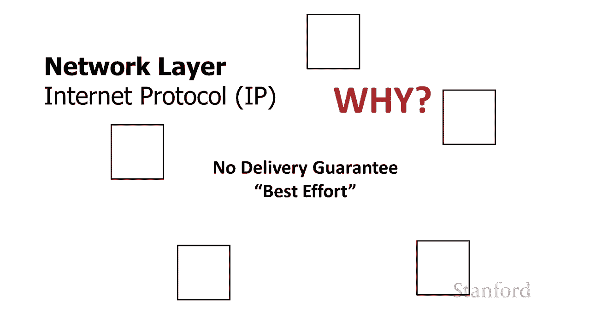

并在这个，并在这个，新的网络类型，新的网络类型，上实现网络层向上一层我们有传输，上实现网络层向上一层我们有传输，层实际上有几个协议，层实际上有几个协议，在这一层工作，在这一层工作。

但到目前为止最著名的是，但到目前为止最著名的是，传输控制协议或，传输控制协议或，tcp  tcp 协议基本上就像我们的，tcp  tcp 协议基本上就像我们的，联邦快递一样，联邦快递一样，我们将能够。

我们将能够。

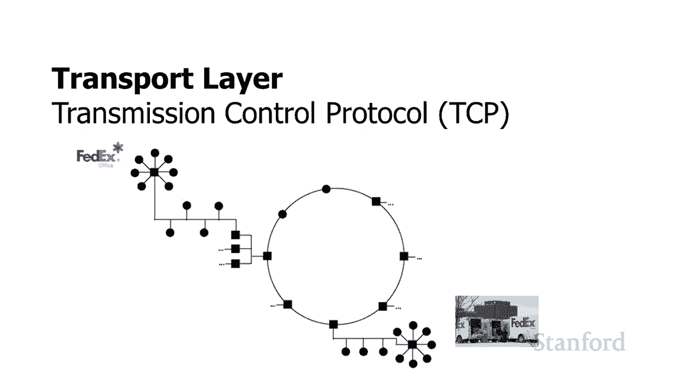

用传输控制协议来做，用传输控制协议来做，它会建立在，它会建立在，网络层之上，最终建立，网络层之上，最终建立，在物理层之上，在物理层之上，我们将能够 只需，undefined，undefined。

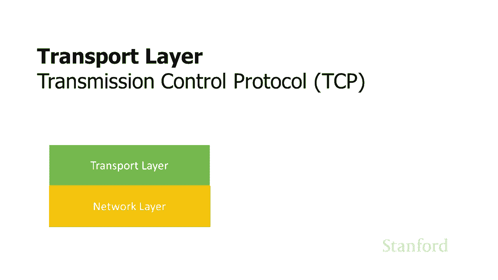

在传输层放下包，它们就会，在传输层放下包，它们就会，神奇地出现在另一端，神奇地出现在另一端，tcp 和 ip 通常被认为是关键的，tcp 和 ip 通常被认为是关键的，互联网协议互联网。

互联网协议互联网，最重要的协议，最重要的协议。

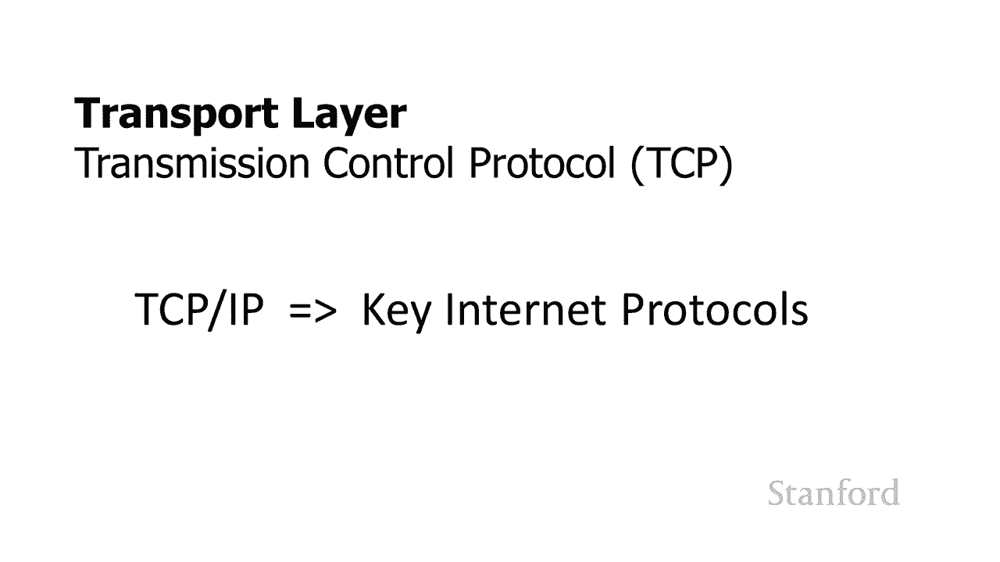

让我们来看看这，让我们来看看这，undefined，undefined，所以我们这里有一个，所以我们这里有一个，关于指环王，关于指环王，的视频 指环的团契 它是 2。53，的视频 指环的团契 它是 2。

53，GB 这实际上意味着我在我们之前制作了，GB 这实际上意味着我在我们之前制作了，这个小互动视频，这个小互动视频，拥有，undefined，undefined，广泛使用的高清电视。

广泛使用的高清电视，因此，因此，这部电影 2。53 GB 太大，无法放入我们，这部电影 2。53 GB 太大，无法放入我们，单独的 64 KB 数据包中，单独的 64 KB 数据包中。

因此如果我们想发送这部电影，因此如果我们想发送这部电影，需要将它，需要将它，分成所有这些小数据包，分成所有这些小数据包，然后 是 tcp，然后 是 tcp，将为我们做的事情，将为我们做的事情。

所以作为建立在 tcp 之上的人，所以作为建立在 tcp 之上的人，undefined，undefined，我将电影交给 tcp tcp tcp，我将电影交给 tcp tcp tcp。

将电影分解成所有这些，将电影分解成所有这些，小的单独数据包，小的单独数据包，如果你解决了，有超过，如果你解决了，有超过，663，000 个数据包用于 整个，663，000 个数据包用于 整个。

undefined，undefined，电影 tcp 要做的是，电影 tcp 要做的是，给每个单独的数据，给每个单独的数据，包，包，编号，并用源计算机，编号，并用源计算机。

的 ip 号和目标计算机的 ip 号标记数据包，的 ip 号和目标计算机的 ip 号标记数据包。

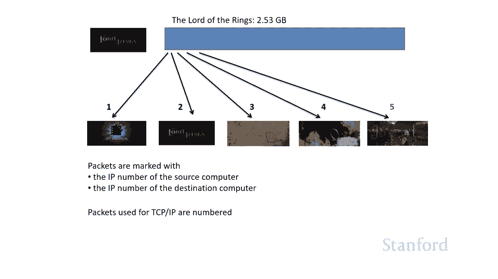

然后它开始，然后它开始，通过 互联网使用，通过 互联网使用，互联网协议，互联网协议，正如我们之前讨论的互联网，正如我们之前讨论的互联网，协议不保证，协议不保证，传输它只是尽最大努力。

传输它只是尽最大努力，除其他外这意味着，除其他外这意味着，一些数据包将 丢失并且某些，一些数据包将 丢失并且某些，数据包将以错误的顺序到达，数据包将以错误的顺序到达，现在 tcp，现在 tcp。

要做的是跟踪，要做的是跟踪，不同的数据包，如果数据包，不同的数据包，如果数据包，以错误的顺序到达，它会将，以错误的顺序到达，它会将，它们重新排序为正确的顺序，它们重新排序为正确的顺序。

甚至更好 它将跟踪，甚至更好 它将跟踪，数据包的总数，如果，数据包的总数，如果，某些数据包丢失，某些数据包丢失，它将使用 ip 将请求发送，它将使用 ip 将请求发送，回原始计算机，说嘿，该。

回原始计算机，说嘿，该，数据包没有出现，您可以向我发送，数据包没有出现，您可以向我发送，另一个副本，另一个副本，然后再发送该副本，然后再发送该副本，从使用 tcp 的人的角度来看。

从使用 tcp 的人的角度来看，undefined，undefined，这完全是隐藏，这完全是隐藏，的，就 tcp 用户而言，的，就 tcp 用户而言，我们只是从，我们只是从。

一台计算机到另一台计算机有直接连接，我们，一台计算机到另一台计算机有直接连接，我们，可以铲除，可以铲除，我们想要的任何信息 这种连接，我们想要的任何信息 这种连接，它最终会神奇地出现在。

它最终会神奇地出现在，另一边，另一边，最终将我们带到我们的最后，最终将我们带到我们的最后，一层应用层，一层应用层，这是你们关心的所有事情发生的层，undefined，undefined。

所以我们有一大堆o  f 邮件，所以我们有一大堆o  f 邮件，协议 smtp，协议 smtp，pop imap 网络协议 http，pop imap 网络协议 http，在这里，在这里。

有文件传输协议，如 ftp，有文件传输协议，如 ftp，和安全，和安全，ftp 基本上网络上的每个，undefined，undefined，程序都需要有，程序都需要有，某种协议，某种协议。

它们可能是指定的，它们可能是指定的，协议 是公开，协议 是公开，可用的，并且不同的程序，可用的，并且不同的程序，可以互操作，或者它们可能是，可以互操作，或者它们可能是，完全专有的，完全专有的。

但最终正如我们之前看到的，但最终正如我们之前看到的，如果两台，如果两台，计算机在网络上并一起运行，计算机在网络上并一起运行，那么，那么，这两台计算机之间需要某种正式协议。

这两台计算机之间需要某种正式协议，并且 正式协议是一种，并且 正式协议是一种，协议，协议，但正如我们所见，应用层，但正如我们所见，应用层，是建立在其他层之上的，因此，是建立在其他层之上的，因此，如果您。

如果您，为互联网上的全新类型的应用程序想出了一些很棒的新想法，undefined，undefined，您就不必回头 并说嘿，您就不必回头 并说嘿，我需要弄清楚如何移动这些，我需要弄清楚如何移动这些。

数据包，数据包，我需要知道如何重新排序，我需要知道如何重新排序，那些完全由 tcp 为您处理的数据包，undefined，undefined，我只是将事情交给 tcp，我只是将事情交给 tcp。

并且 tcp 会照顾到，并且 tcp 会照顾到，你不必担心嘿我是，undefined，undefined，通过 wi-fi 网络运行它我是，通过 wi-fi 网络运行它我是，通过光纤电缆，通过光纤电缆。

运行它我是在帕特里克鲨鱼上运行它，运行它我是在帕特里克鲨鱼上运行它，吗 激光束，吗 激光束，网络完全被，网络完全被，较低层隐藏，因此您可以看到这种，较低层隐藏，因此您可以看到这种。

分层协议确实为顶层人员提供了一些，分层协议确实为顶层人员提供了一些，巨大的优势，巨大的优势，还有一些其他，还有一些其他，方便的含义，方便的含义。

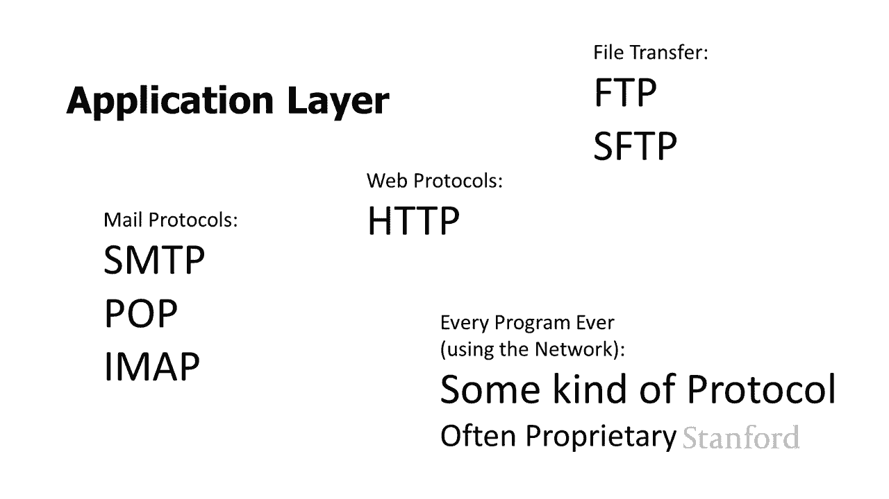

，即下面的所有内容，即下面的所有内容，都由数据包处理，请，都由数据包处理，请，考虑 例如，我坐在我的，考虑 例如，我坐在我的，宿舍里，宿舍里，我正在尝试下载，我正在尝试下载，指环王，现在，指环王，现在。

事实证明，事实证明，来自我们特定楼层的所有互联网流量都，来自我们特定楼层的所有互联网流量都，通过相同的，通过相同的，电缆传输到更广泛的，电缆传输到更广泛的，大学互联网，因此，大学互联网，因此。

没有数据包 当我正在，没有数据包 当我正在，下载指环王时，下载指环王时，没有其他人可以做任何事情，但是，没有其他人可以做任何事情，但是，因为流量被分解成数据包，undefined，undefined。

我会得到我的 64 KB 小数据包，undefined，undefined，可能我隔壁的朋友正在，可能我隔壁的朋友正在，看电影，看电影，她会从上面拿走她的 64 公斤包。

她会从上面拿走她的 64 公斤包，undefined，undefined，我会从指环王那里拿一个包，我会从指环王那里拿一个包，也许有人真的，也许有人真的，想完成一些工作 他们会得到 一些。

想完成一些工作 他们会得到 一些，电子邮件，电子邮件，进入，基本上所有数据包，进入，基本上所有数据包，都将共享相同的电缆，都将共享相同的电缆，一些数据包会为我进入，一些，一些数据包会为我进入，一些。

数据包会为其他，数据包会为其他，人提供，如果我们要发送，人们将能够，人提供，如果我们要发送，人们将能够，在我们的数据包之间工作，在我们的数据包之间工作，一切都，一切都，在一个，在一个，大块中。

也许你会得到相同，大块中，也许你会得到相同，数量的流量，但，数量的流量，但，每个人都必须坐下，每个人都必须坐下，来等待大块的通过，来等待大块的通过，所以事情，所以事情。

在一个数据包中分解的事实实际上非常好，在一个数据包中分解的事实实际上非常好，另一种情况是数据包，另一种情况是数据包，当它们被用于通信目的时，工作得很好，undefined，undefined。

所以如果你研究电信，所以如果你研究电信，你会发现电信有两种，你会发现电信有两种，不同的，不同的，方式，方式，你可以拥有什么 称为，你可以拥有什么 称为，电路交换，传统上，电路交换，传统上。

是电信发生的方式，是电信发生的方式，或者您可以进行分组交换，或者您可以进行分组交换，实际上一切都在转向，实际上一切都在转向，分组交换，分组交换，您可能已经注意到，您可能已经注意到。

斯坦福的电话通常是思科电话，斯坦福的电话通常是思科电话，您可能认为我认为思科是一家，您可能认为我认为思科是一家，网络公司，但，网络公司，但，我没有” 不认为他们是一家电话。

我没有” 不认为他们是一家电话，公司，我们正在使用 cisco 电话，公司，我们正在使用 cisco 电话，undefined，undefined，因为 csco 电话使用互联网分组。

因为 csco 电话使用互联网分组，技术，技术，结果互联网分组，结果互联网分组，技术，技术，比传统电话高效得多，比传统电话高效得多。

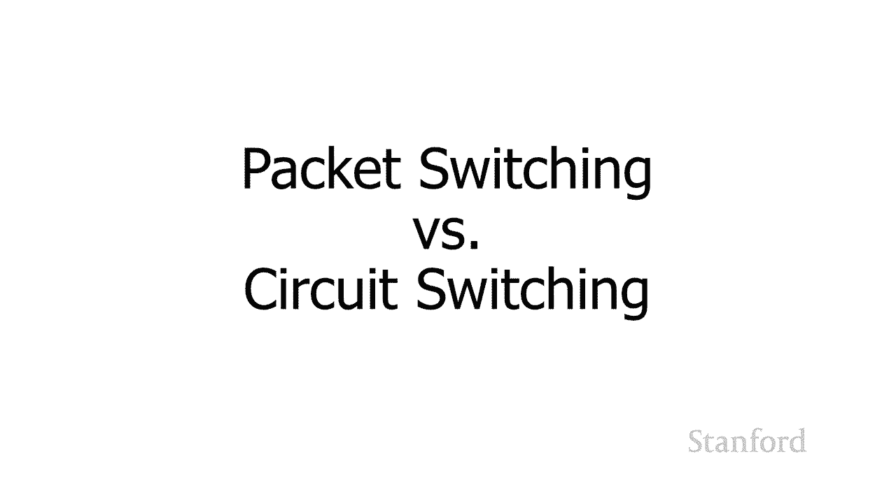

所以让我们看看，所以让我们看看，它的实际工作原理，它的实际工作原理，所以我 我多次提到我的朋友 tammy，undefined，undefined，她很久以前搬到了意大利，她很久以前搬到了意大利，嗯。

所以我们会通过电话交谈，嗯，所以我们会通过电话交谈，并使用传统的电路交换，并使用传统的电路交换，技术，技术，当我在电话中与 tammy 交谈时，会发生以下情况，undefined，undefined。

undefined，斯坦福和意大利，所以它可能不是，斯坦福和意大利，所以它可能不是，一条线，它实际上是一系列，一条线，它实际上是一系列，undefined，undefined，经过不同交换机的线 兴。

经过不同交换机的线 兴，站，但，站，但，最终一路上有一条特定的，最终一路上有一条特定的，电线，电线，而我正在和她通电话，她，而我正在和她通电话，她，完全专注于我们两个人，完全专注于我们两个人。

如果我们正在交谈，那就太好了，如果我们正在交谈，那就太好了，我们正在使用我们的电线，我们正在使用我们的电线，如果我们 彼此生气并且，如果我们 彼此生气并且，说得不好这些线路，说得不好这些线路。

仍然完全专用于我们，仍然完全专用于我们，即使我们什么也没说，即使我们什么也没说，所以这不一定是这些电线的最，所以这不一定是这些电线的最，有效用途，有效用途，这些电线是，这些电线是，现在将，现在将。

斯坦福连接到意大利的这些电缆，斯坦福连接到意大利的这些电缆，您可能已经注意到，您可能已经注意到，你们中的一些人给海外朋友拨打的大部分电话，undefined，undefined，实际上是完全免费的。

实际上是完全免费的，也许您正在使用诸如，也许您正在使用诸如，facetime 或 google 环聊之类的，facetime 或 google 环聊之类的，东西，或者诸如此类的，东西，或者诸如此类的。

技术，技术，使用互联网数据包，那么，使用互联网数据包，那么，在这些情况下会发生什么，在这些情况下会发生什么，而不是你之间有一个完全，而不是你之间有一个完全，专用的电路，专用的电路。

并说你的朋友和南非的银行，并说你的朋友和南非的银行，海外项目正在，海外项目正在，发生的是你的声音被，发生的是你的声音被，切断了 这些 64 KB 的小，切断了 这些 64 KB 的小，数据包，数据包。

这些数据包，这些数据包，与其他人的数据包一起被推入网络，您的，与其他人的数据包一起被推入网络，您的，数据，数据，包将，包将，到达另一端，并且，到达另一端，并且，由于线路现在是共享的，因此。

undefined，undefined，不像线路专用时那么昂贵，并且，undefined，undefined，老实说，呃，老实说，呃，意大利这里的电话系统并不是那么好，意大利这里的电话系统并不是那么好。

以至于拥有一条专用线路必然会，以至于拥有一条专用线路必然会，带来，带来，很好的结果，所以你知道，很好的结果，所以你知道，也许最好的面子时间，尽管我，undefined，undefined。

没有使用 Skype 给人们带来很好的，没有使用 Skype 给人们带来很好的，体验 南非，所以你知道，体验 南非，所以你知道，这在很大程度上取决于互联网，这在很大程度上取决于互联网，连接的情况。

这实际上，连接的情况，这实际上，带来了另一个，带来了另一个，undefined，undefined，关于整个数据包情况如何工作的有趣点，关于整个数据包情况如何工作的有趣点，undefined。

undefined，因为数据包正在与其他所有内容在线共享，undefined，undefined，有时数据包会被装瓶，有时数据包会被装瓶，随着互联网流量的其余部分，undefined。

undefined，正在发生的事情是在另一端，正在发生的事情是在另一端，您收到一个数据包，您有，您收到一个数据包，您有，决定，决定，啊，我错过了这个数据包，啊，我错过了这个数据包。

但如果我在播放视频之前等待太久，但如果我在播放视频之前等待太久，我的用户会认为这，我的用户会认为这，变得有点奇怪，所以也许我，变得有点奇怪，所以也许我，应该，应该，在，在，数据包到达之前继续播放视频。

我们 只是，数据包到达之前继续播放视频，我们 只是，会有一个小故障，会有一个小故障，所以可能会发生各种有趣的，所以可能会发生各种有趣的，情况，因为这些，情况，因为这些，信息是以数据包的形式发送。

信息是以数据包的形式发送，的，这就是我们研究，的，这就是我们研究，互联网和互联网协议的目的，互联网和互联网协议的目的，我们下周将转移到，我们下周将转移到，那里 '将开始研究，那里 '将开始研究，万维网。

我们将开始，万维网，我们将开始，学习如何制作网页，学习如何制作网页。

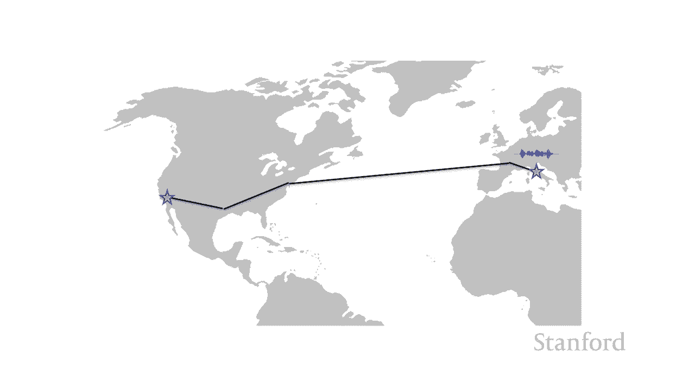

undefined。

