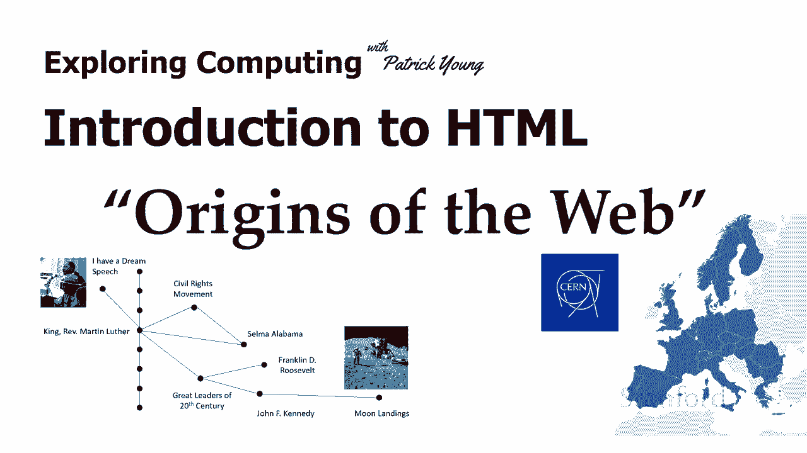
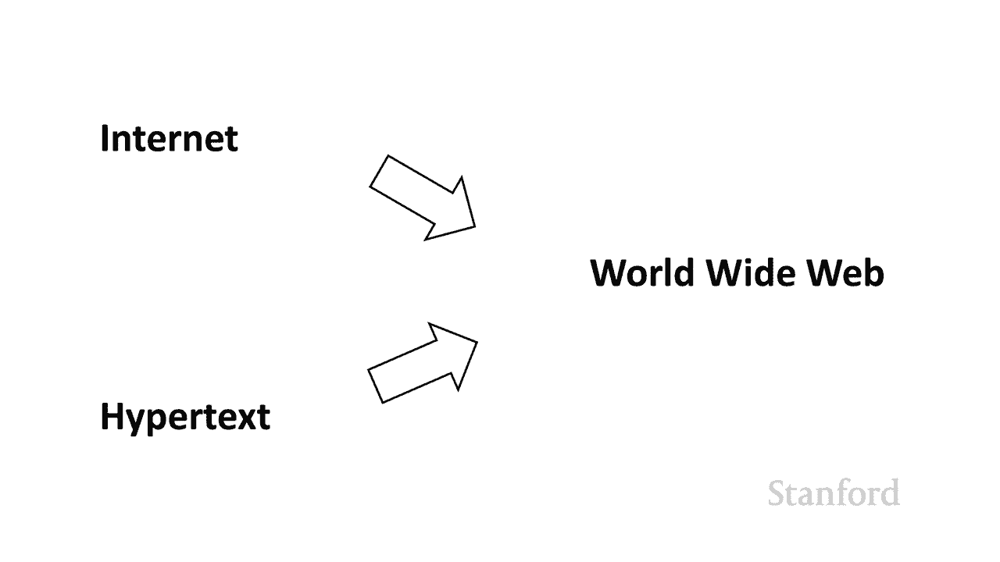
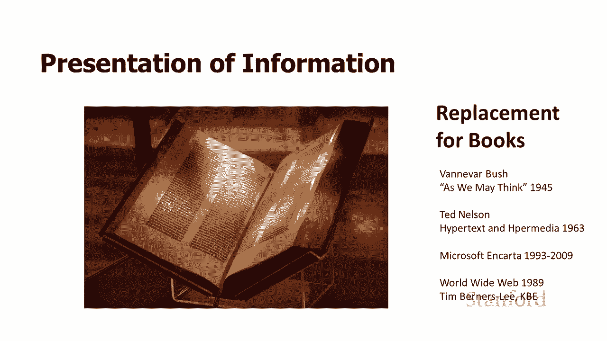
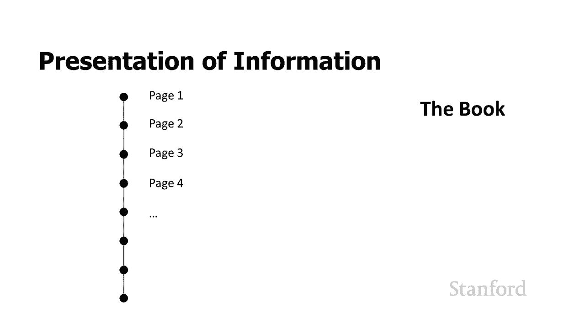
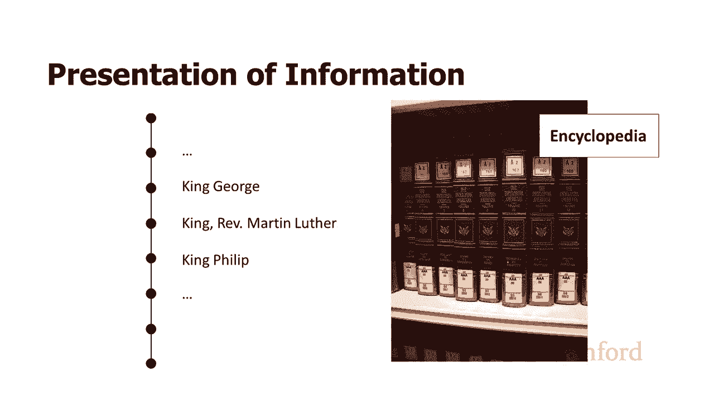
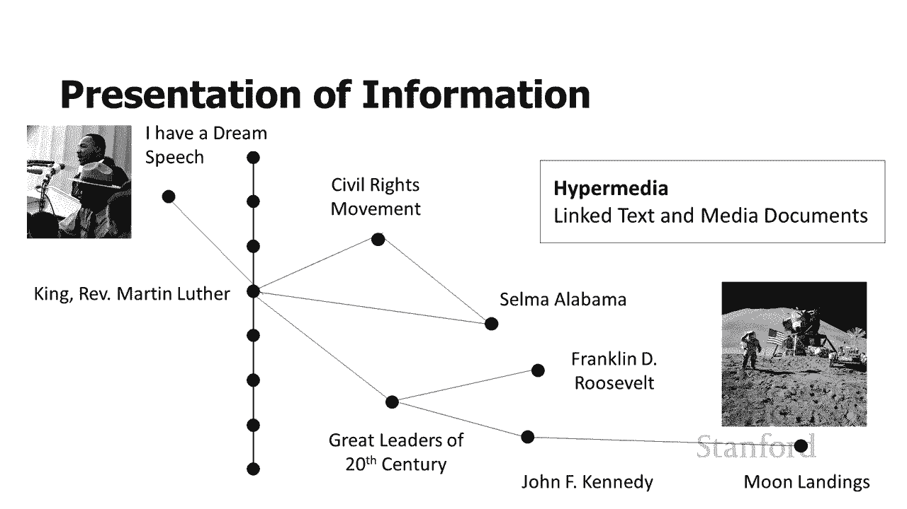
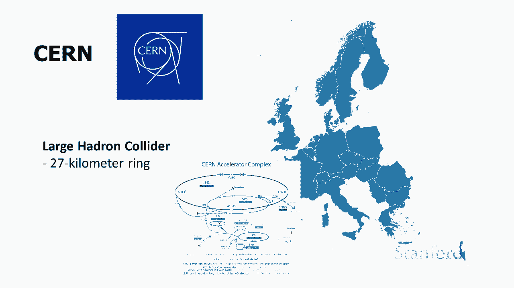
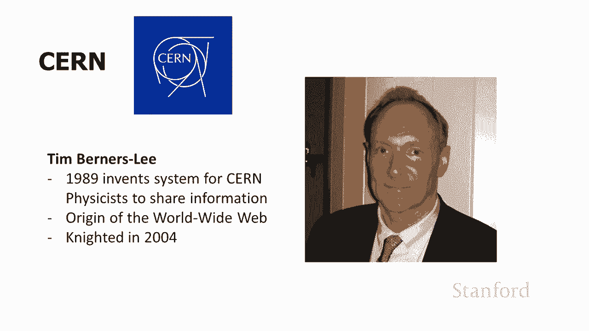

# 【双语字幕+资料下载】斯坦福CS105 ｜ 计算机科学导论(2021最新·完整版) - P23：L7.1- HTML 介绍：Web 的起源 - ShowMeAI - BV1eh411W72E

undefined，欢迎探索计算，欢迎探索计算，今天的视频介绍，今天的视频介绍，了网页的 html 起源，因此在此视频中，了网页的 html 起源，因此在此视频中，我们将了解，我们将了解，万维网的来源。

万维网的来源，我想了解，我想了解，undefined，undefined，万维网创建的背景以及，undefined，undefined，undefined，当我们看看网络是如何，当我们看看网络是如何。

工作的，工作的，当你看到一些，当你看到一些，限制是什么以及，限制是什么以及。

网络所涉及的一些奇怪之处时，它会让你更好地了解实际发生，网络所涉及的一些奇怪之处时，它会让你更好地了解实际发生，的事情，所以全世界 网络来自两种，的事情，所以全世界 网络来自两种，基本技术，第一个是。

基本技术，第一个是，互联网，互联网，我们，我们，在过去的几堂课中花了很多时间研究它，在过去的几堂课中花了很多时间研究它。

，第二个是一种，第二个是一种，称为超文本的技术，所以我们将，称为超文本的技术，所以我们将，开始看一看 在超文本中，超，开始看一看 在超文本中，超，文本背后的基本思想，文本背后的基本思想，是我们将如何。

是我们将如何，为人们呈现信息，我们一直在，为人们呈现信息，我们一直在，使用这本书，使用这本书，所以问题是这，所以问题是这，本书的局限性是，本书的局限性是，什么，我们可能想要什么 去取代，什么。

我们可能想要什么 去取代，它，这是，它，这是，信息科学家已经，信息科学家已经，考虑了很长一段时间的问题，考虑了很长一段时间的问题，事实上，我们开始思考，事实上，我们开始思考，信息技术如何，信息技术如何。

在二战结束前后为书籍提供良好的替代品，在二战结束前后为书籍提供良好的替代品，所以，所以，有一个著名的 van over，有一个著名的 van over，Bush，Bush，的文章正如我们所想的那样。

发表，的文章正如我们所想的那样，发表，于 1945 年。于 1945 年。现在正如我提到的，现在正如我提到的，网络背后的一项关键技术是，网络背后的一项关键技术是，超文本，超文本和，超文本，超文本和。

超媒体的起源实际上可以追溯到 1963 年。超媒体的起源实际上可以追溯到 1963 年。可能是超文本的第一次广泛使用，可能是超文本的第一次广泛使用，和超媒体是，和超媒体是。

在 cd-roms 上找到的电子百科全书，在 cd-roms 上找到的电子百科全书，microsoft 和 carta 从 1993 年开始，microsoft 和 carta 从 1993 年开始。

提供了一个很好的例子来说明这种，提供了一个很好的例子来说明这种，使用该技术和，使用该技术和，万维网于 1989 年首次出现，万维网于 1989 年首次出现，你会注意到它实际上先于。

你会注意到它实际上先于，微软和卡迪夫，但它只是，微软和卡迪夫，但它只是，在 由非常有限的人数使用，在 由非常有限的人数使用。

，我们将在几分钟内研究一下，我们将在几分钟内研究一下，好吧，好吧，这本书有什么问题，这本书有什么问题，为什么 我们是否想要很好地替换它，为什么 我们是否想要很好地替换它，关于一本书的一件事是。

关于一本书的一件事是，一本书由页面组成，每一，一本书由页面组成，每一，页都按顺序跟随前一页，页都按顺序跟随前一页，我的意思是相当，我的意思是相当，明显，明显，但事实证明这可能是一个非常大的。

但事实证明这可能是一个非常大的，限制，它实际上取决于哪种，限制，它实际上取决于哪种，类型，类型，我们正在看的书，所以我们，我们正在看的书，所以我们，有第一页，第二，有第一页，第二，页，第三页等等，页。

第三页等等，我们正在阅读小说，这，我们正在阅读小说，这，可能是一个不错的选择，可能是一个不错的选择，除非假设它是一部神秘小说，除非假设它是一部神秘小说，而你，而你，无法等待 直到最后，所以你。

无法等待 直到最后，所以你，翻到最后看看发生了什么，翻到最后看看发生了什么，undefined，undefined，或者你可能是文学批评，或者你可能是文学批评，专业的，你想跳过这，专业的，你想跳过这。

本书，但我们大多数人，本书，但我们大多数人，undefined，undefined。

对小说的线性性质非常满意，对小说的线性性质非常满意，相比之下，想想，相比之下，想想，像百科全书一样的东西，因为，像百科全书一样的东西，因为，百科全书，百科全书，是印刷的，它有单一的，是印刷的。

它有单一的，顺序，顺序，信息流，所以如果我们要找，信息流，所以如果我们要找，一篇，一篇，关于牧师马丁路德金的文章，我们很，关于牧师马丁路德金的文章，我们很，可能会发现他，可能会发现他。

夹在国王 g 之间，夹在国王 g 之间，英格兰的乔治和，英格兰的乔治和，西班牙的菲利普国王他与这两个人有什么关系？西班牙的菲利普国王他与这两个人有什么关系？百科全书，百科全书，只有一种信息排序。

只有一种信息排序，它使用信息的线性排序，它使用信息的线性排序，使查找文章变得容易，而，使查找文章变得容易，而。

undefined，undefined，不是找到不同文章之间的链接，不是找到不同文章之间的链接，undefined，undefined，和 因此，当我们转向计算机时，我们，和 因此，当我们转向计算机时。

我们，不再局限于，不再局限于，信息的单一排序，信息的单一排序，我们可以创建不同的，我们可以创建不同的，信息节点并将任何节点链接到任何，信息节点并将任何节点链接到任何，其他节点，其他节点。

因此如果我们愿意，我们仍然可以维护我们的信息序列以，因此如果我们愿意，我们仍然可以维护我们的信息序列以，供查找，供查找，但我们 还可以将，但我们 还可以将，导演马丁·路德·金与，导演马丁·路德·金与。

关于民权运动的文章联系起来，从阿拉巴马州塞尔玛，关于民权运动的文章联系起来，从阿拉巴马州塞尔玛，undefined，undefined，到 20 世纪的伟大领袖，到 20 世纪的伟大领袖，等等，等等。

我们现在有一个信息，我们现在有一个信息，网络，当然，万维网一词就是从这里来，网络，当然，万维网一词就是从这里来，的，的，还有这个超文本概念 基本上是，还有这个超文本概念 基本上是，说我们有这些不同的。

说我们有这些不同的，文本节点，我们将，文本节点，我们将，链接文本节点，链接文本节点，当然这正是，当然这正是，万维网的工作方式，万维网的工作方式，我们可以 在计算机上更进一步。

我们可以 在计算机上更进一步，因为我们不再，因为我们不再，局限于文字，局限于文字，我们可以有演讲，我们可以有演讲，我们可以有音频 这样我们就可以有，我们可以有音频 这样我们就可以有，马丁路德金牧师。

马丁路德金牧师，我有一个梦想演讲 我们可以有，我有一个梦想演讲 我们可以有，照片 我们可以有电影，照片 我们可以有电影，和 所以这被称为超媒体 好吧，这是超，和 所以这被称为超媒体 好吧，这是超。

文本和超媒体背后的基本思想，文本和超媒体背后的基本思想，但这仍然没有让我们成为，但这仍然没有让我们成为，万维网，但这只是，万维网，但这只是，我们看到的等式的一半，等式的另一半，我们看到的等式的一半。

等式的另一半，是互联网，但是，是互联网，但是。

如何 两个最终在一起很好 我们，如何 两个最终在一起很好 我们，需要搬到，需要搬到，欧洲 在欧洲有一个叫做cern的物理，欧洲 在欧洲有一个叫做cern的物理，联盟，联盟，它有23个，它有23个。

成员国 它的主要总部设在日内瓦，成员国 它的主要总部设在日内瓦，它最著名的是一个用于高能物理的大型对撞机，undefined，undefined，与我们的没有什么不同 自己的。

与我们的没有什么不同 自己的，stanford slack，stanford slack，在这种情况下，他们有一个 27，在这种情况下，他们有一个 27。

公里长的环，用于，公里长的环，用于，高能物理和粒子相互碰撞，undefined，undefined，现在在 80 年代后期，一位计算机，现在在 80 年代后期，一位计算机。

科学家 在欧洲核子研究中心工作时，有，科学家 在欧洲核子研究中心工作时，有，兴趣想出一种方法让，兴趣想出一种方法让，欧洲，欧洲，核子研究中心的物理学家分享研究论文，在欧洲核子研究中心。

核子研究中心的物理学家分享研究论文，在欧洲核子研究中心，发生的一件事，发生的一件事，是成员国将他们的，是成员国将他们的，物理学家送到欧洲核子研究中心，然后有时，物理学家送到欧洲核子研究中心，然后有时。

他们又回到，他们又回到，各自国家的机构，undefined，undefined，所以他正在寻找一种，所以他正在寻找一种，在所有物理学家之间共享论文的方法，在所有物理学家之间共享论文的方法，自然而然。

他认为我们应该，自然而然，他认为我们应该，使用互联网，但此外，使用互联网，但此外，他认为我们应该使用，他认为我们应该使用，人们一直在谈论的超文本技术，人们一直在谈论的超文本技术，undefined。

undefined，它一直在研究，它一直在研究，实验室 相当长的一段时间，实验室 相当长的一段时间，undefined，undefined，如果你在背景中听到一些叮当声，如果你在背景中听到一些叮当声。

实际上是，实际上是。

maddie 从她的，maddie 从她的，狗球里喝水，而且她的狗牌撞到，狗球里喝水，而且她的狗牌撞到，了狗碗，了狗碗，但实际上没有人在使用，所以 timberners-lee 在 1989 年。

但实际上没有人在使用，所以 timberners-lee 在 1989 年，提出了这个，提出了这个，结合互联网的想法 为了，结合互联网的想法 为了，在物理学家之间共享信息而使用超文本。

在物理学家之间共享信息而使用超文本，这就是万维网的起源，这就是万维网的起源，他因此在 2004 年被封为爵士。他因此在 2004 年被封为爵士。所以我 当您查看万维网时，您认为这很重要。

所以我 当您查看万维网时，您认为这很重要，并且您想知道为什么，并且您想知道为什么，有些，有些，事情会以万维网上的方式运作，事情会以万维网上的方式运作，它最初是为了让，它最初是为了让，物理学家共享。

物理学家共享，物理研究论文而发明的，因此它并没有，物理研究论文而发明的，因此它并没有，真正，真正，拥有 我们可能想要，拥有 我们可能想要，undefined，undefined。

广泛使用大众媒体的某种技术 我们会看到，广泛使用大众媒体的某种技术 我们会看到，其中一些技术已经被采用，其中一些技术已经被采用，但，但，我认为如果您，我认为如果您，专门，专门。

为大众市场和普通消费者设计系统，为大众市场和普通消费者设计系统，undefined，undefined，您可能已经来了 对地址的工作方式略有，您可能已经来了 对地址的工作方式略有，不同的形式主义。

不同的形式主义，我们将，undefined，undefined，看到必须添加很多东西，看到必须添加很多东西，以便，以便，提供比，undefined，undefined。

您在物理学中可能期望看到的更丰富多彩、更有趣的网页，您在物理学中可能期望看到的更丰富多彩、更有趣的网页，纸很好，所以在下一个视频中，纸很好，所以在下一个视频中，我们将看看，我们将看看，html。

它实际上是，html，它实际上是，用于创建网页的语言，用于创建网页的语言。

