# 【双语字幕+资料下载】斯坦福CS105 ｜ 计算机科学导论(2021最新·完整版) - P24：L7.2- HTML 介绍：超文本标记语言 - ShowMeAI - BV1eh411W72E

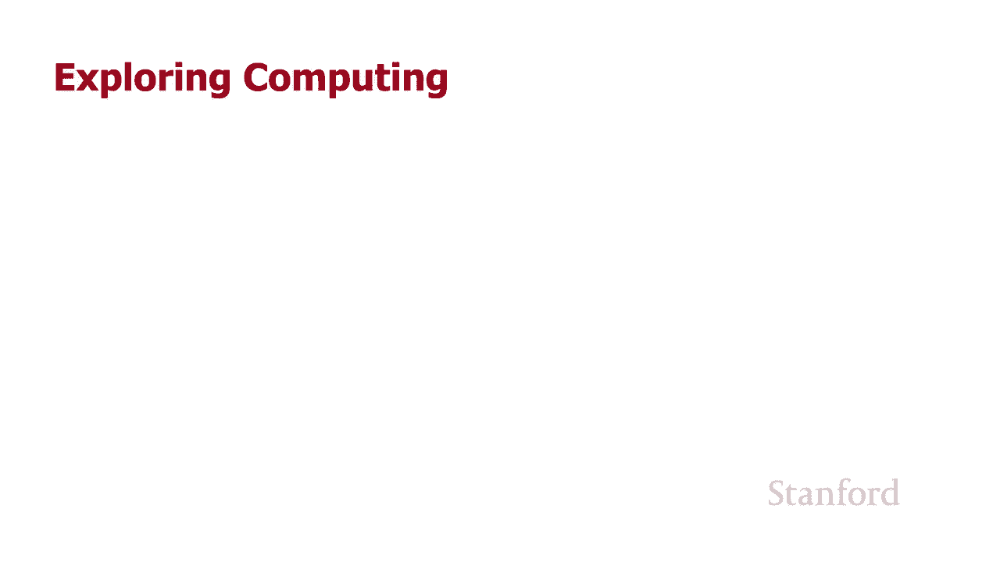

undefined，欢迎来到探索计算，欢迎来到探索计算，今天的视频是介绍 html，今天的视频是介绍 html，超文本标记语言，所以在，超文本标记语言，所以在，上一课中我们看到了万维网的起源。

undefined，undefined，我们花了一些时间，我们花了一些时间，了解超文本的含义，之前，了解超文本的含义，之前，在上一课中我们看了，在上一课中我们看了，http，它是 超文本传输，http。

它是 超文本传输，协议，协议，我们将通过，我们将通过，考虑，考虑，undefined，undefined，http 协议和 html 超文本，http 协议和 html 超文本。

标记语言之间的关系开始本讲座，标记语言之间的关系开始本讲座，然后我们将实际，然后我们将实际，研究 html 的实际工作方式，研究 html 的实际工作方式，在以下视频中我们，在以下视频中我们，将 在。

将 在。

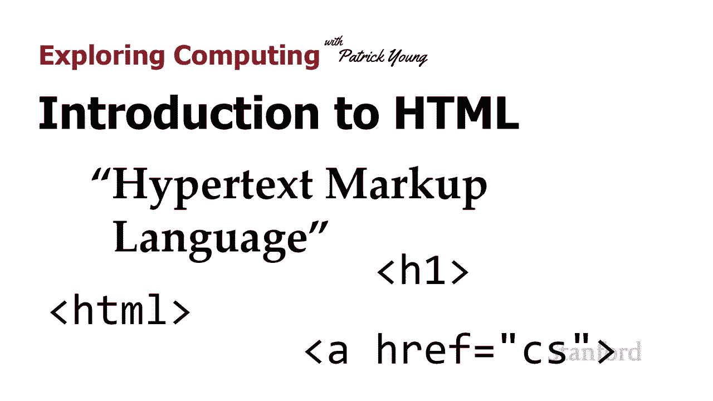

这两个视频结束时使用 html 进行一些实践练习 您，这两个视频结束时使用 html 进行一些实践练习 您，应该能够制作自己的网页，应该能够制作自己的网页，undefined，undefined。

让我们从上一堂课的快速回顾开始，让我们从上一堂课的快速回顾开始，这样您就可以记住 http，这样您就可以记住 http，代表超文本传输协议，代表超文本传输协议，这是一个协议 它控制。

这是一个协议 它控制，着万维网上的两台计算机如何，着万维网上的两台计算机如何，交互，交互，因此计算机可以，因此计算机可以，向网络服务器，向网络服务器，发出请求，请求特定文件和，发出请求，请求特定文件和。

网络 erver 将通过发送文件来响应，网络 erver 将通过发送文件来响应，这些文件实际上可以具有，这些文件实际上可以具有，多种格式中，多种格式中，的任何一种，最常见的可能是 html，的任何一种。

最常见的可能是 html，文件，这就是我们将，文件，这就是我们将，在本讲座中讨论的内容，但，在本讲座中讨论的内容，但，级联样式表文件或 css 文件，级联样式表文件或 css 文件，也是，也是，很常见。

我们将在，很常见，我们将在，下一讲中研究它，当然，下一讲中研究它，当然，我们在，我们在，本季度第二讲中讨论过的图像文件，本季度第二讲中讨论过的图像文件，也很，也很，常用，结果证明 http，常用。

结果证明 http，实际上并没有指定，实际上并没有指定，任何格式 这些文件，任何格式 这些文件，http 只是告诉网络上的两台计算机，http 只是告诉网络上的两台计算机，undefined。

undefined，一台计算机如何向另一台计算机发送请求，undefined，undefined，要求将文件发回它，要求将文件发回它，并没有指定，并没有指定，文件本身的格式，文件本身的格式。

因此还有许多其他类型的，因此还有许多其他类型的，文件可以 由万维网发送，文件可以 由万维网发送，例如，例如，视频文件，实际上您可以，视频文件，实际上您可以，提出新的文件类型，而 http。

提出新的文件类型，而 http，并不真正关心文件类型是什么，并不真正关心文件类型是什么，undefined，undefined，它只是设计为一台计算机，它只是设计为一台计算机，可以请求 pa。

可以请求 pa，其他计算机的特定文件，而，其他计算机的特定文件，而，不管该文件的内部格式，不管该文件的内部格式，现在是什么 html 代表超文本标记，现在是什么 html 代表超文本标记，语言。

正如我所，语言，正如我所，建议的那样，它是最常见的文件，建议的那样，它是最常见的文件，格式，所以这就是我们现在要，格式，所以这就是我们现在要，看看，看看，的 是一种关键文件格式，的 是一种关键文件格式。

万维网上的任何网页都需要，万维网上的任何网页都需要，一个 html 文件，以及，一个 html 文件，以及。

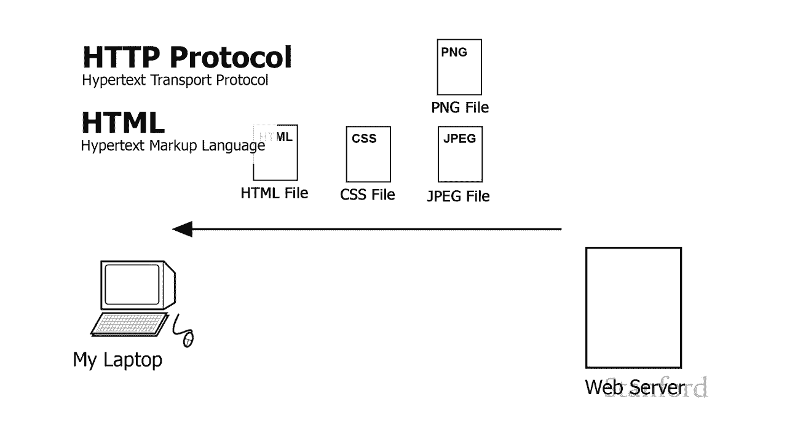

包含的任何其他文件，包含的任何其他文件，所以我建议的 html 代表，所以我建议的 html 代表，超文本标记语言，我们已经看到，超文本标记语言，我们已经看到，了超文本的含义 上一。

了超文本的含义 上一，堂课，堂课，和语言或多或少指的是，和语言或多或少指的是，你所期望的，你所期望的，事实证明，计算机语言，事实证明，计算机语言，与人类语言有很多相似之处，与人类语言有很多相似之处。

它们有自己的语法，它们有自己的语法，它们有自己的词汇，它们有自己的词汇，它们与法语，它们与法语，或日语或任何其他，或日语或任何其他，人类语言没有什么不同 你已经学过的语言，但，undefined。

undefined，我们还没有谈到标记的另一部分，所以，我们还没有谈到标记的另一部分，所以，让我们谈谈标记以及，让我们谈谈标记以及。

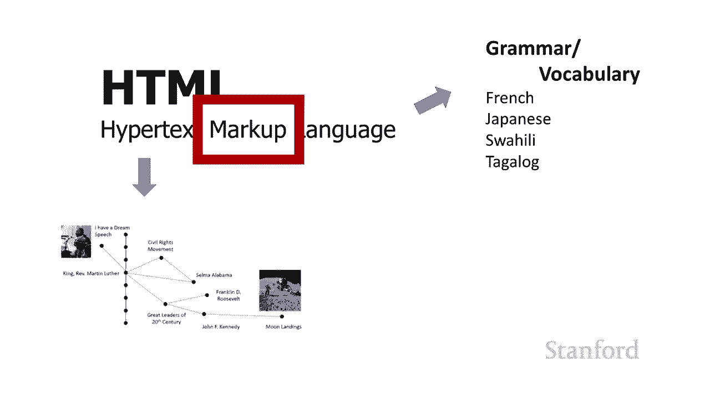

这一切意味着什么 所以术语标记，这一切意味着什么 所以术语标记，来自发布，来自发布，所以 我在这里有的是，我有一个，undefined，undefined，来自斯坦福日报的全球网页，所以。

来自斯坦福日报的全球网页，所以，要问的一个问题，要问的一个问题，是这篇特定文章的作者，是这篇特定文章的作者，undefined，undefined，是否做出了决定，例如是否，是否做出了决定，例如是否。

应在文章中出现特定照片，应在文章中出现特定照片，undefined，undefined，或者是否，或者是否，应将出现在照片下方的标题，应将出现在照片下方的标题，如果文章的日期，undefined。

undefined，应该以浅灰色的无衬线字体出现，应该以浅灰色的无衬线字体出现，或者如果文章中的第，或者如果文章中的第，一句话以粗体书写，则以浅灰色背景出现，一句话以粗体书写，则以浅灰色背景出现。

undefined，undefined，因此我没有与本文的特定作者交谈过，因此我没有与本文的特定作者交谈过，george chen，george chen，但我和其他斯坦福，但我和其他斯坦福。

日报的作家谈过，他们告诉我，日报的作家谈过，他们告诉我，这不是它的运作方式，事实上，这不是它的运作方式，事实上。

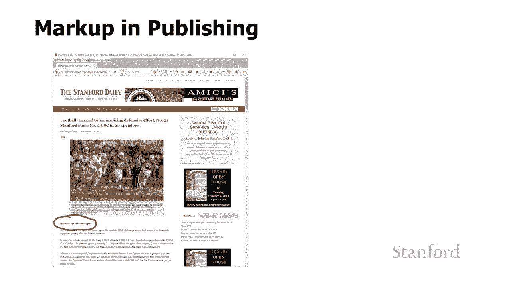

这不是传统上它，这不是传统上它，undefined，undefined，在出版中的运作方式，所以这并不是一个真正的，在出版中的运作方式，所以这并不是一个真正的，惊喜，惊喜，所以通常会发生的事情。

所以通常会发生的事情，是作者只是要 写下，是作者只是要 写下，文章的正文，文章的正文，然后其他人说编辑，然后其他人说编辑，会介入，会介入，并决定文章中应该出现什么样的，并决定文章中应该出现什么样的。

格式，格式，这样我们就可以，这样我们就可以，说哦，我 想要第一部分在这里，说哦，我 想要第一部分在这里，这个标题我想以粗体 24，这个标题我想以粗体 24，点，点，字体出现，也许我希望，字体出现。

也许我希望，它下面的署名以无，它下面的署名以无，衬线字体出现，undefined，undefined，如果您不熟悉，我们将在另一堂课中讨论无衬线字体的含义，undefined，undefined。

然后我想继续，然后我想继续，在那里插入一张照片，所以这些都是作者，在那里插入一张照片，所以这些都是作者，以外的人，以外的人，会做出的所有决定，会做出的所有决定，传统上，编辑实际上会，传统上。

编辑实际上会，undefined，undefined，使用所谓的标记来写下这些评论，使用所谓的标记来写下这些评论，所以我在这里所做的是，所以我在这里所做的是，我已经，我已经，标记了作者的原始文本。

标记了作者的原始文本，提供，提供，标记注释，供，undefined，undefined，任何进行类型设置的发布者使用，任何进行类型设置的发布者使用，所以这就是 html 的全部。

所以这就是 html 的全部，内容，内容，所以在 html 中我们将使用这种形式，所以在 html 中我们将使用这种形式，的标记，的标记，为了告诉计算机如何，为了告诉计算机如何，显示他们的网页。

显示他们的网页，让我们来看看 html，让我们来看看 html，我们已经看到了超文本是什么 我们刚刚，我们已经看到了超文本是什么 我们刚刚，了解了标记是什么，了解了标记是什么，这是一种语言 我将。

这是一种语言 我将，在另一堂课中稍作讨论，在另一堂课中稍作讨论，更仔细地了解，undefined，undefined，人类语言和计算机语言之间的异同，人类语言和计算机语言之间的异同。

结果证明 html 的驱动力是非常多的，结果证明 html 的驱动力是非常多的。

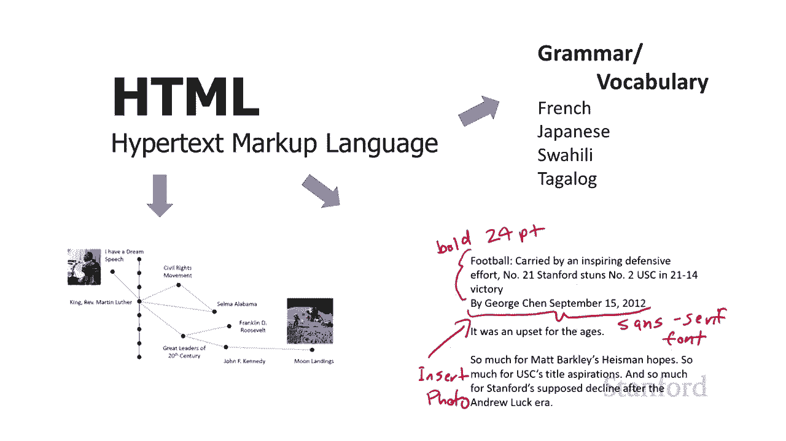

尽管，尽管，我们刚刚讨论了标记的概念，我们刚刚讨论了标记的概念，所以假设我们想创建一个，所以假设我们想创建一个，网页，上面写着 去 stanford，我们，网页，上面写着 去 stanford，我们。

希望 go 以斜体显示，stanford，希望 go 以斜体显示，stanford，以粗体显示，以粗体显示，如果我使用的是人类类型，如果我使用的是人类类型，设置器，我可以继续，设置器，我可以继续。

使用这样的笔进行潦草的标记，使用这样的笔进行潦草的标记，但这不适用于，但这不适用于，计算机 在阅读手写内容方面越来越好，计算机 在阅读手写内容方面越来越好，但我们，但我们，还没有真正，还没有真正。

做到这一点，所以这就是它在，做到这一点，所以这就是它在，html 中的样子基本上我提供的，html 中的样子基本上我提供的，信息与我，信息与我，提供给人类类型设置者的信息相同，但我。

提供给人类类型设置者的信息相同，但我，会这样做 以更正式的方式，会这样做 以更正式的方式，计算机更容易处理，计算机更容易处理，我们在这里看到的这些，我们在这里看到的这些，是所谓的标签，是所谓的标签。

这些标签通常成对工作，所以我有一个，这些标签通常成对工作，所以我有一个，开始标签，开始标签，和一个结束标签，其中结束标签，和一个结束标签，其中结束标签，与  一个开始标签除了，与  一个开始标签除了。

前面有一个斜杠，前面有一个斜杠，我们也把它们称为元素，我们也把它们称为元素，所以元素由开始，所以元素由开始，标签、结束标签以及，标签、结束标签以及，开始和结束标签之间的任何内容组成。

开始和结束标签之间的任何内容组成，这里我有一个代表斜体的 i 元素，这里我有一个代表斜体的 i 元素，element 和 ab，element 和 ab，元素代表粗体元素，元素代表粗体元素，实际上。

实际上。

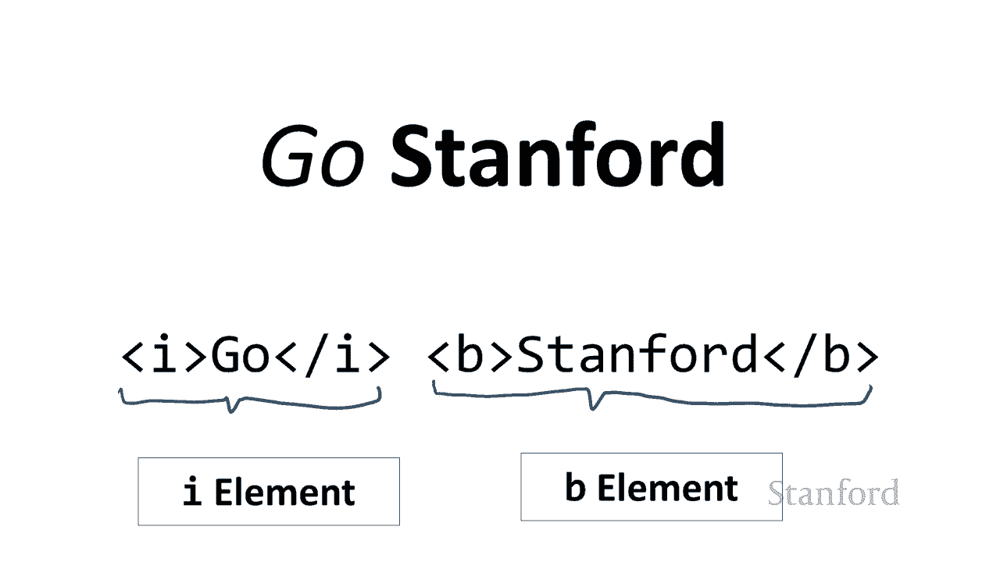

学习 html 工作原理的关键是，学习 html 工作原理的关键是，学习所有不同的标签，学习所有不同的标签，这实际上是标签的一个相当大的子集，undefined，undefined，我们将为您提供一个。

我们将为您提供一个，标签列表 可以看看，标签列表 可以看看，那里确实没有那么多标签，所以，那里确实没有那么多标签，所以，我建议你在某个时候，我建议你在某个时候，浏览，浏览，我们将提供给你的列表，这。

我们将提供给你的列表，这，可能，可能，是广泛使用的绝大多数标签，是广泛使用的绝大多数标签，或者你看看 在，或者你看看 在，比我将提供给您的列表稍大的官方列表中，undefined，undefined。

您只需了解现有的标签是什么，undefined，undefined，您就不需要记住这些标签，但，您就不需要记住这些标签，但，您确实想要一些，您确实想要一些，熟悉可用的东西 然后，熟悉可用的东西 然后。

当你需要一个特定的标签时，你，当你需要一个特定的标签时，你，就像哦，我想创建一个粗体，至少，就像哦，我想创建一个粗体，至少，你会记得哦，我，你会记得哦，我，似乎记得有一个，似乎记得有一个。

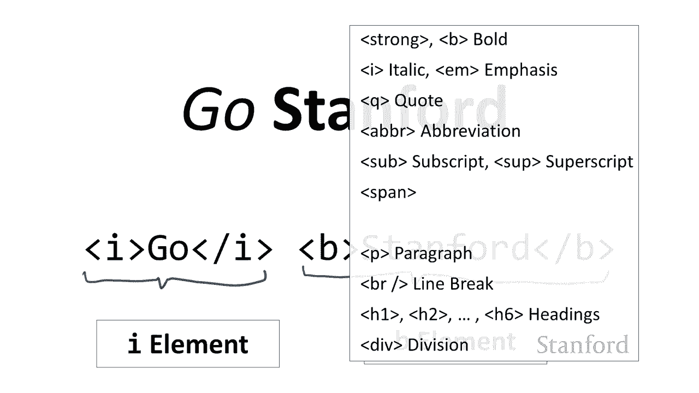

标签，你可以继续查找，undefined，undefined，我们有时会提到 元素作为，我们有时会提到 元素作为，容器，容器，在这种特殊情况下，我有，在这种特殊情况下，我有，斜体元素，斜体元素。

然后您可以看到粗体，然后您可以看到粗体，元素同时，元素同时，包含斜体元素和，包含斜体元素和，单词 stanford，单词 stanford，您确实需要保持这种包含，您确实需要保持这种包含。

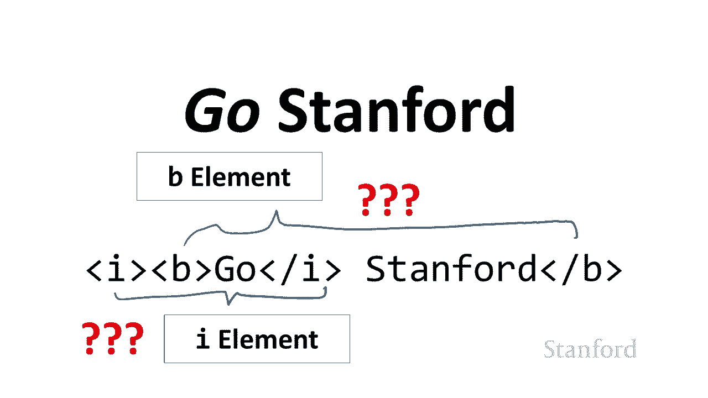

关系，因此如果我尝试将两者混合，关系，因此如果我尝试将两者混合，如这里所示，如这里所示，实际上结果是非法的，所以，实际上结果是非法的，所以，不要这样做，不要这样做，一个元素必须完全包含。

一个元素必须完全包含，在另一个元素中我们不能让一个，在另一个元素中我们不能让一个。

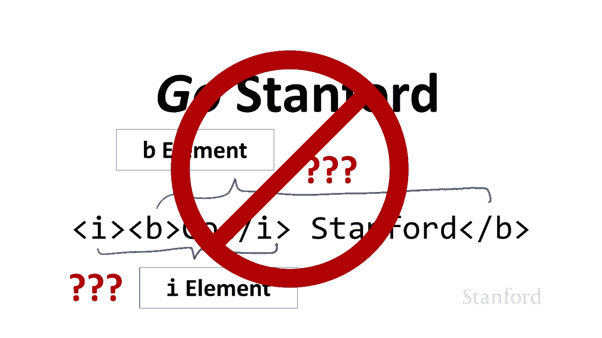

元素部分包含一个元素，元素部分包含一个元素，有时标签本身没有，有时标签本身没有，提供我们，提供我们，需要添加的足够信息 附加信息，需要添加的足够信息 附加信息，假设我想将，假设我想将。

此处的 stanford 一词链接到实际的 stanford，此处的 stanford 一词链接到实际的 stanford，网站，网站，结果证明用于，结果证明用于。

从一个网站链接到另一个网站的标签是 a 标签，从一个网站链接到另一个网站的标签是 a 标签，它代表锚，它代表锚，但在 需要提供附加，但在 需要提供附加，信息，告诉，信息，告诉，我链接到的网站是什么。

我链接到的网站是什么，所以，所以，在这里我添加了所谓的，在这里我添加了所谓的，属性值，属性值，对，ahrefs 代表超文本，对，ahrefs 代表超文本，引用，我向锚，引用，我向锚，标记提供了附加信息。

标记提供了附加信息。

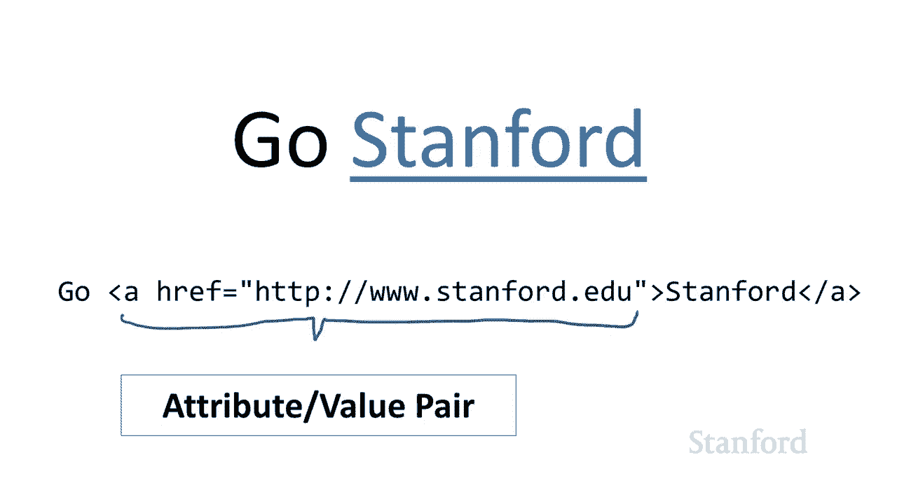

告诉它在哪里 锚链接到，告诉它在哪里 锚链接到，某些标签实际上并不成对工作，某些标签实际上并不成对工作，所以假设我想创建一个换行符，所以假设我想创建一个换行符，换行符将允许我，换行符将允许我。

基本上在一行中间有一个字符转弯，undefined，undefined，我可以有一个换行符开始技术 和，我可以有一个换行符开始技术 和，换行符结束标记，但这并没有，换行符结束标记，但这并没有，多大意义。

多大意义，因此可以在，因此可以在，没有开始和结束标记的情况下完成此特定标记，我，没有开始和结束标记的情况下完成此特定标记，我。

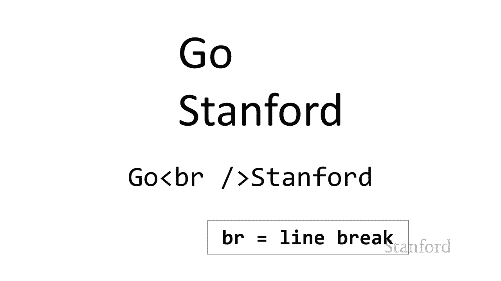

将指出使用，将指出使用，此处所示的结束斜杠，此处所示的结束斜杠，您需要做的一件事' 如果您开始尝试，您需要做的一件事' 如果您开始尝试，创建这些网页，创建这些网页，请注意，请注意。

如果您将字符转换或空格，如果您将字符转换或空格，或制表符放入文档中，或制表符放入文档中，这些实际上都会合并到，这些实际上都会合并到，一个空格中，一个空格中，因此基本上 html 要做的是。

因此基本上 html 要做的是，采取，采取，任何它被称为空白的东西，任何它被称为空白的东西，所以在计算机科学中，所以在计算机科学中，我们指的是空白，我们，我们指的是空白，我们，谈论的是，谈论的是。

可以在网页上创建空白的任何字符，其中，可以在网页上创建空白的任何字符，其中，包括该，包括该，字符会转换，字符会转换，制表符和它将占用所有空间，制表符和它将占用所有空间，你输入的空白区域。

你输入的空白区域，它只会把它当作一个单一的，它只会把它当作一个单一的，空间，所以在这里，空间，所以在这里，我已经说过在我的源代码中去斯坦福，在我的，我已经说过在我的源代码中去斯坦福，在我的，源代码中。

源代码中，我放了几个回车我放，我放了几个回车我放，了另一个 go 红衣主教放了几个，了另一个 go 红衣主教放了几个，字符转弯，字符转弯，然后当它实际，然后当它实际，显示时，就好像这些字符，显示时。

就好像这些字符，转动或我输入的任何选项卡或我输入的任何内容，转动或我输入的任何选项卡或我输入的任何内容，都将被，都将被，视为单个空格，视为单个空格，所以这里的解决方案是什么，所以这里的解决方案是什么。

结果证明有一个，结果证明有一个，我需要的特殊标签，我需要的特殊标签，为了让这些出现在，为了让这些出现在，段落中所以有一个段落，段落中所以有一个段落，标签所以我继续在这里创建两个。

标签所以我继续在这里创建两个，段落元素，段落元素，你可能想知道，你可能想知道，段落标签和换行符之间的关系是什么，段落标签和换行符之间的关系是什么，我们之前看到的标签，我们之前看到的标签，注意到，注意到。

如果我要使用换行符，则这些段落之间有一个空行，undefined，undefined，因为我在这里显示两行之间没有空行，因为我在这里显示两行之间没有空行，因此换行符，因此换行符。

确实在两行之间创建了回车，确实在两行之间创建了回车，但确实如此 不要创建一个，但确实如此 不要创建一个，空行，空行，而段落通常会，而段落通常会，undefined，undefined。

在两个段落之间创建一个空行，在两个段落之间创建一个空行，尽管我们将在下一节，尽管我们将在下一节，开始学习级联样式表时看到下一节，undefined，undefined，undefined，如果您希望。

如果您希望，段落标记创建，段落标记创建，两个，您实际上可以准确控制段落标记的作用 空行很棒，两个，您实际上可以准确控制段落标记的作用 空行很棒，如果您希望段落，如果您希望段落，标签不创建空行。

那么您也可以，标签不创建空行，那么您也可以，这样做，我们将了解，这样做，我们将了解，下一节课，下一节课，也请注意，因为，undefined，undefined，undefined，如果我有该行。

html 不关心额外的空白 break 标签后跟，如果我有该行，html 不关心额外的空白 break 标签后跟，一个回车，一个回车，它创建了我们在这里看到的网页，它创建了我们在这里看到的网页。

但如果我没有回车，但如果我没有回车，undefined，undefined。

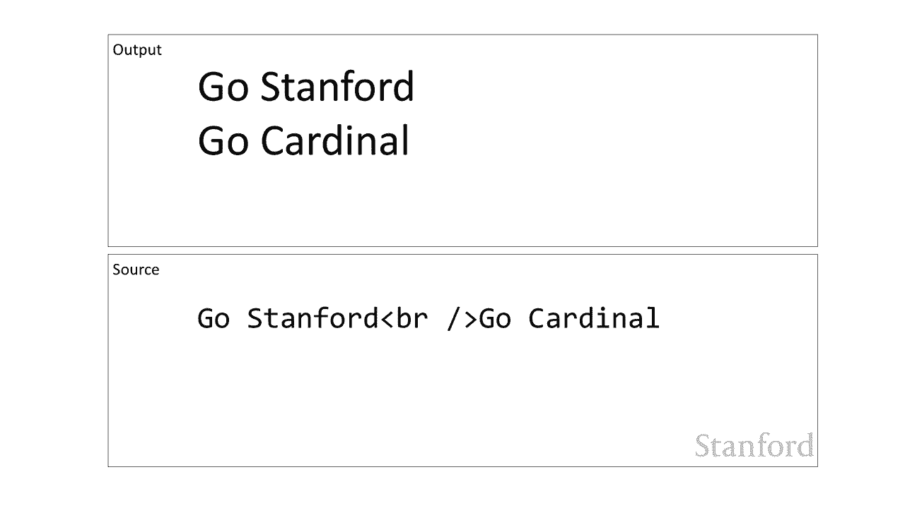

，我只是在一行中，我，我只是在一行中，我，得到完全相同的结果，得到完全相同的结果，另一个标签 t  hat 非常有用的是，另一个标签 t  hat 非常有用的是，undefined，undefined。

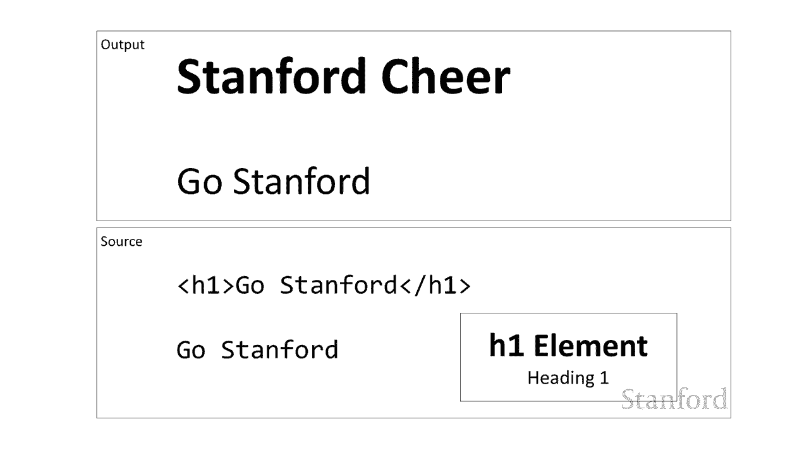

它用于创建标题的 h1 标签，因此，它用于创建标题的 h1 标签，因此，h1 是最重要的标题，h1 是最重要的标题，但实际上有，但实际上有，六种不同类型的标题，其中 h1，六种不同类型的标题。

其中 h1。

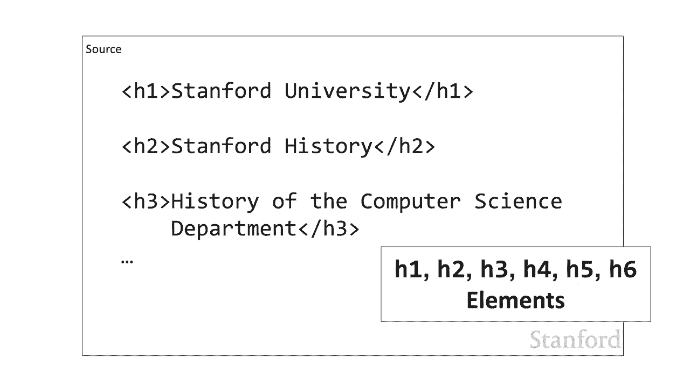

是最重要的，是最重要的，而 h6 是最不重要的，此时您，而 h6 是最不重要的，此时您，可能想知道如果 我，可能想知道如果 我，想设置我的文本的前景色或背景，想设置我的文本的前景色或背景，色，色。

或者如果我想更改字体或，或者如果我想更改字体或，如何控制对齐方式并使其，如何控制对齐方式并使其，右对齐或左对齐或居中，右对齐或左对齐或居中，对齐，对齐，结果是，结果是。

从前我们做到了 使用 html 执行此操作，从前我们做到了 使用 html 执行此操作，我们不再使用 html 执行此操作，我们，我们不再使用 html 执行此操作，我们，现在使用级联样式表执行此操作。

现在使用级联样式表执行此操作，这是我们过去物理学的遗产，这是我们过去物理学的遗产，因此请记住 html，因此请记住 html，最初是为，最初是为，物理论文创建的，它们确实，物理论文创建的，它们确实。

不需要那么多格式，不需要那么多格式，而是现代网络 页面是由，而是现代网络 页面是由，图形艺术家和其他媒体，图形艺术家和其他媒体，专业人士创建的，他们想要更多的，专业人士创建的，他们想要更多的，控制权。

控制权，因此我们采用，undefined，undefined，了原始 html 中用于物理论文和，了原始 html 中用于物理论文和，w 的许多简单格式 实际上，我们已经将它移到了。

w 的许多简单格式 实际上，我们已经将它移到了。

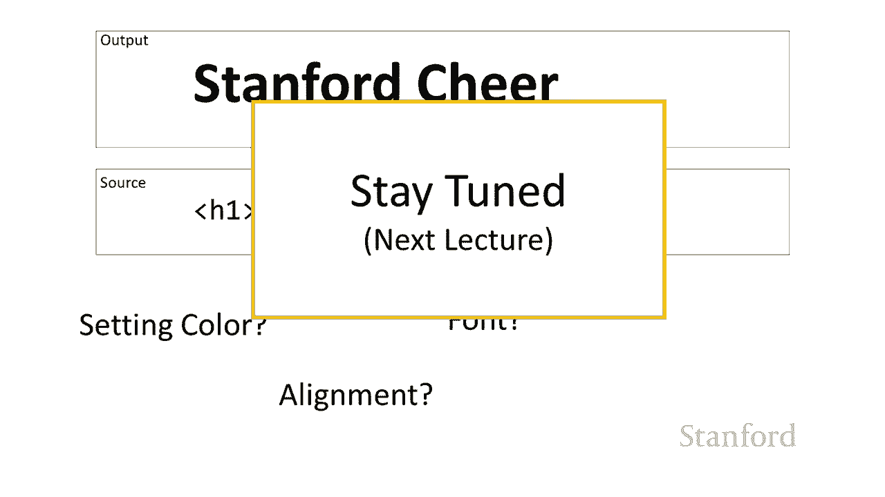

称为级联样式表的第二种语言，undefined，undefined，中，除了我们已经讨论，中，除了我们已经讨论，过，过，的网页本身的结构之外，我将在下一讲讨论标签 还有一些，undefined。

undefined，您需要为所有网页提供的附加标签，您需要为所有网页提供的附加标签，undefined，undefined，你在这里看到的是这里，你在这里看到的是这里，有一些额外的标签。

有一些额外的标签，需要在顶部有一个格式良好的 html，需要在顶部有一个格式良好的 html，undefined，undefined，文件我有 doctype，文件我有 doctype。

这是一个有点奇怪的标签，它，这是一个有点奇怪的标签，它，并没有真正，并没有真正，遵循语法规则 在其他标签中，您，遵循语法规则 在其他标签中，您，可以看到它以，可以看到它以，感叹号，感叹号，开头。

它有一个大写的文档类型，它是独立的，开头，它有一个大写的文档类型，它是独立的，但没有结尾斜杠，但没有结尾斜杠，您确实需要包含它，尽管正如，您确实需要包含它，尽管正如，您从我的小评论中看到的那样。

您从我的小评论中看到的那样，它大多不再使用了，它大多不再使用了，但是 您确实需要将它包含在内以，但是 您确实需要将它包含在内以，指定，指定，各种内容，例如嘿，这是，各种内容，例如嘿，这是，html4。

html4，这是 xhtml1，这是 xhtml1，我们稍后再谈，但网络，我们稍后再谈，但网络，浏览器制造商正试图，浏览器制造商正试图，摆脱所有版本号，摆脱所有版本号，但是如果您这样做了 根本没有版本。

但是如果您这样做了 根本没有版本，结果，结果，证明这会导致网络，证明这会导致网络，浏览器认为您有一个，浏览器认为您有一个，非常旧的网页，非常旧的网页，在包含 doctype 标签之前创建它。

在包含 doctype 标签之前创建它，这会使您的网络，这会使您的网络，浏览器进入一种奇怪的模式，称为，浏览器进入一种奇怪的模式，称为，quarks 模式，你不希望这种，quarks 模式。

你不希望这种，情况发生，情况发生，所以即使我只是将，所以即使我只是将，狗类型指定为 html 而不是，狗类型指定为 html 而不是，html4 html5 xhtml1。

html4 html5 xhtml1，你仍然需要提供 doctype，你仍然需要提供 doctype，所以不要忘记，否则你可能会，所以不要忘记，否则你可能会，得到一些，得到一些，非常奇怪的 查看网页。

非常奇怪的 查看网页，还可以，所以有一个 html 开始和结束，还可以，所以有一个 html 开始和结束，标记围绕所有内容，然后我，标记围绕所有内容，然后我，有这个头部部分和正文部分。

有这个头部部分和正文部分，所以让我们看看，所以让我们看看，那些头部部分提供，那些头部部分提供，有关网页的信息，而正文部分，有关网页的信息，而正文部分，提供的实际内容 网页，提供的实际内容 网页。

undefined，undefined，让我们仔细看看 head，让我们仔细看看 head，部分，你可以看到 head，部分，你可以看到 head，部分，部分，包括字符编码，这就是，包括字符编码。

这就是，我们在第一讲中，我们在第一讲中，谈到的 ascii，谈到的 ascii，we ta 了解iso 8859，它允许，we ta 了解iso 8859，它允许，我们做一些事情，比如西欧。

我们做一些事情，比如西欧，东欧西里尔文，东欧西里尔文，和其他一些东西都，和其他一些东西都，适合一个字节，适合一个字节，然后我们谈到了unicode，所以，然后我们谈到了unicode，所以。

这就是你要指定，这就是你要指定。

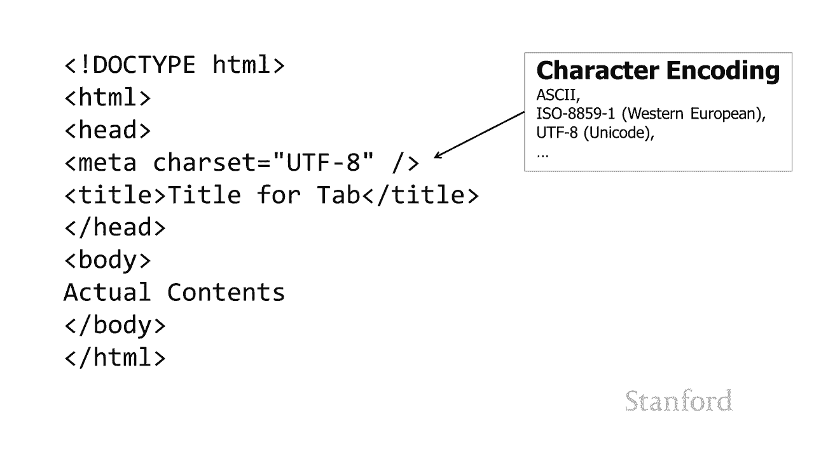

哪种编码你的html的地方 源，哪种编码你的html的地方 源，文件正在使用，文件正在使用，然后有一个标题，标题，然后有一个标题，标题，是出现在 Web 浏览器选项卡上的内容。

是出现在 Web 浏览器选项卡上的内容，请注意，请注意，这里的图像，标题实际上并未，这里的图像，标题实际上并未，出现在网页本身上，出现在网页本身上，因此在这种情况下，我使用了标题，因此在这种情况下。

我使用了标题，选项卡的，选项卡的，标题和通知选项卡的标题实际上并没有，标题和通知选项卡的标题实际上并没有，出现，出现，在网页的实际内容中，在网页的实际内容中，它只出现，它只出现，在网络浏览器的选项卡上。

所以，在网络浏览器的选项卡上，所以，这种强调我，这种强调我，之前提到，之前提到，的头部是关于网页的事情，的头部是关于网页的事情，它不是实际的 网页内容，它不是实际的 网页内容，我们将在整个。

我们将在整个，html 和 css 研究中看到，有各种，html 和 css 研究中看到，有各种，不同的信息进入，不同的信息进入，头部，所以现在看起来很简单，头部，所以现在看起来很简单。

但我们将添加一些额外的信息，但我们将添加一些额外的信息，信息进入本节，信息进入本节，然后正文是实际，然后正文是实际。

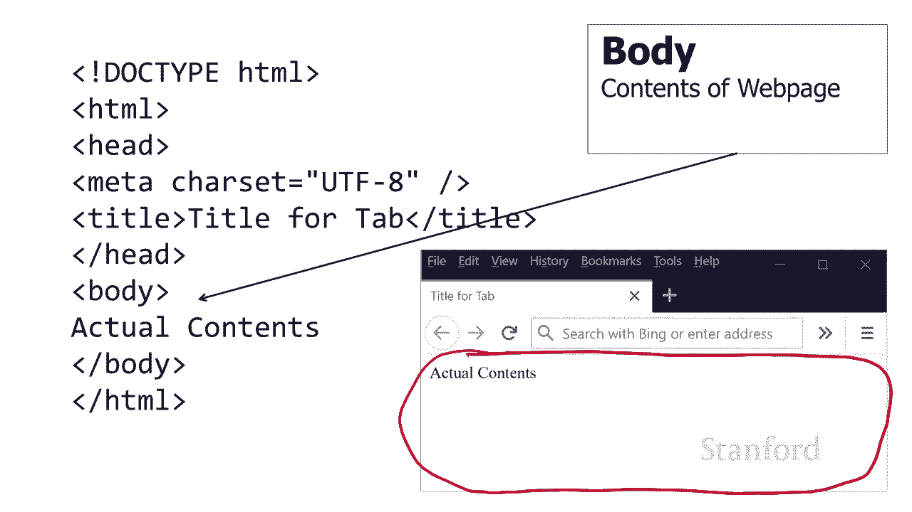

出现在网页本身上的任何内容，出现在网页本身上的任何内容，有许多不同版本，有许多不同版本，的 html 正如我早些时候提到的，的 html 正如我早些时候提到的，当前版本的，当前版本的。

html 是 html5，html 是 html5，但正如我所建议的，网络浏览器，但正如我所建议的，网络浏览器，制造，制造，商不是 对版本号非常满意，商不是 对版本号非常满意，我认为正在发生的事情。

我认为正在发生的事情，之一是他们不喜欢有特定的，之一是他们不喜欢有特定的，版本号然后人们，版本号然后人们，指着他们，指着他们，说嘿你不完全支持，说嘿你不完全支持，这个，这个。

版本所以这就是我们摆脱的原因，undefined，undefined，undefined，除了像 html 3。2 html4 html 4。1 xhtml1 这样的不同版本号之外。

doctype 中的，除了像 html 3。2 html4 html 4。1 xhtml1 这样的不同版本号之外，doctype 中的，版本号，undefined，undefined。

undefined，还有几种 html，还有几种 html，变体，我使用的变体称为 xhtml，变体，我使用的变体称为 xhtml，而 xhtml 有一组比标准 html 更正式的规则。

而 xhtml 有一组比标准 html 更正式的规则，undefined，undefined，因此，例如标准，因此，例如标准，html，如果我要为头部部分写头部，html，如果我要为头部部分写头部。

我可以用，我可以用，小写字母写它我可以用所有大写字母写它我，小写字母写它我可以用所有大写字母写它我，什，什，至可以混合带有大写字母的外壳 ha，至可以混合带有大写字母的外壳 ha，小写 e，小写 e。

和大写 a 和小写 d，和大写 a 和小写 d，这些在 xhtml 中都是合法的，这些在 xhtml 中都是合法的，它们就像等待等待等待，它们就像等待等待等待，这是无法控制的，这是无法控制的。

请用小写字母写下您的标签，请用小写字母写下您的标签，undefined，undefined，我在，我在，换行符，换行符，上的斜杠实际上不是 在 html 中是必需的。

上的斜杠实际上不是 在 html 中是必需的，但我使用它是因为，但我使用它是因为，我喜欢学生们看到，我喜欢学生们看到，我写的标签，我写的标签，只有一个标签而不是一对带有，只有一个标签而不是一对带有。

开始标签和结束标签的标签，开始标签和结束标签的标签，我喜欢他们看到结尾的斜线，我喜欢他们看到结尾的斜线，和 立即意识到，和 立即意识到，哦，这是一个独立的标签，这不是，哦，这是一个独立的标签，这不是。

一对的一部分，一对的一部分，最后是，最后是，xhtml 和标准 html 之间的另一个例子，xhtml 和标准 html 之间的另一个例子，xhtml 要求所有属性，xhtml 要求所有属性。

undefined，undefined，值对都有引号中的值，而，值对都有引号中的值，而，html 有一堆不同的规则来，html 有一堆不同的规则来，确定是否引号 是必要的，确定是否引号 是必要的。

所以基本上我使用的 xhtml 变，所以基本上我使用的 xhtml 变，体只会导致看起来更统一，体只会导致看起来更统一，的代码，的代码，我强烈建议您将，我强烈建议您将，它用于您的代码，它用于您的代码。

我认为它实际上很常见，我认为它实际上很常见，可能在专业人士中 ssional 网页，可能在专业人士中 ssional 网页，它的使用，它的使用，频率很高，所以这是我们，undefined。

undefined，在下一个视频中对 html 的小介绍 我们将带，在下一个视频中对 html 的小介绍 我们将带，您亲身体验，您亲身体验，如何创建，如何创建，html 文件以及，html 文件以及。

如何加载到 web 浏览以及如何测试。

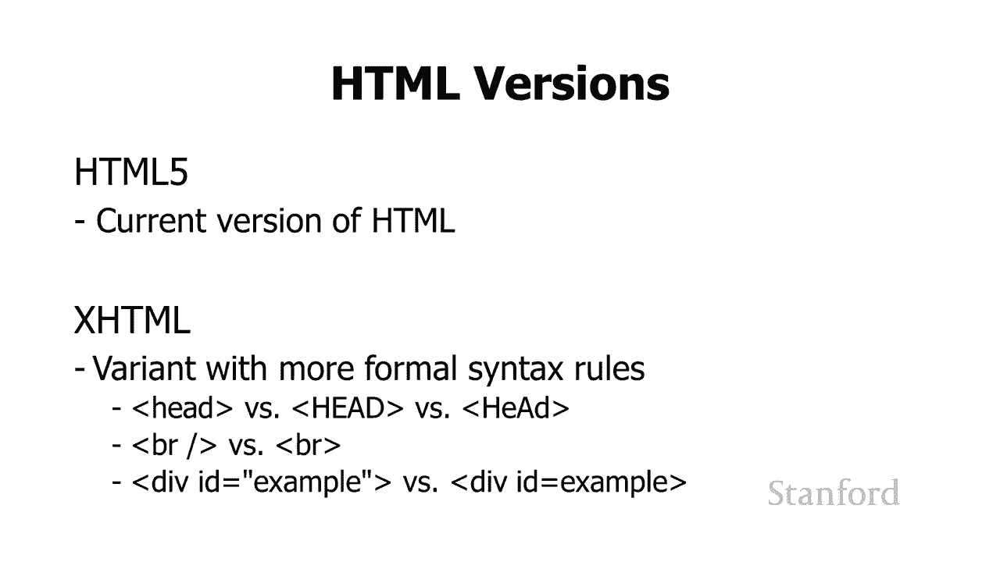

