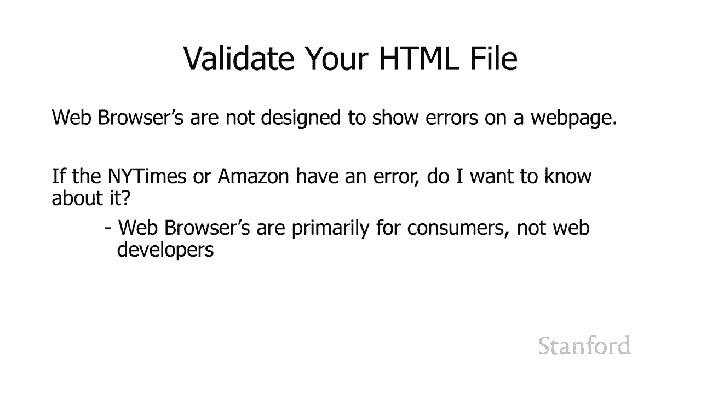
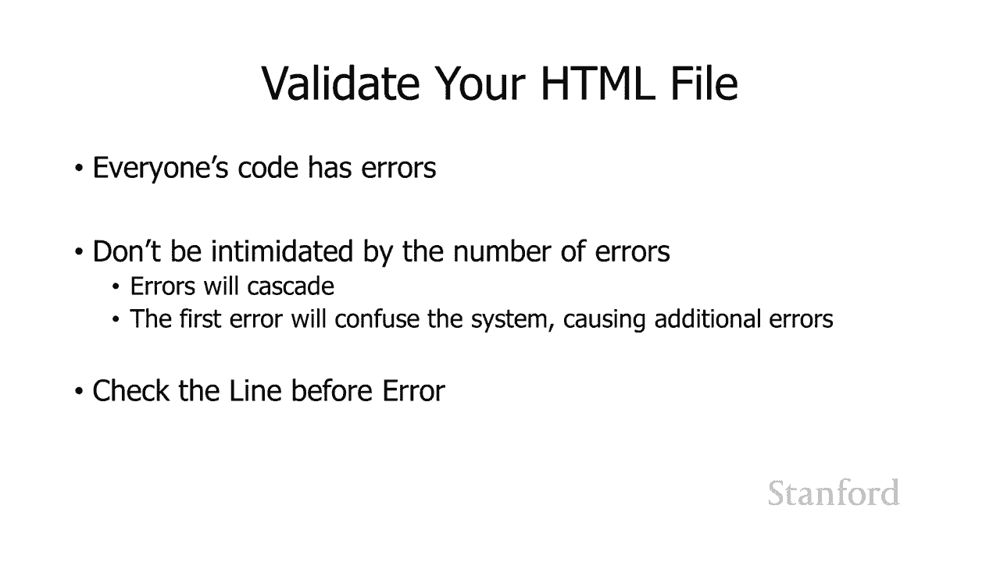

# 【双语字幕+资料下载】斯坦福CS105 ｜ 计算机科学导论(2021最新·完整版) - P25：L7.3- HTML 介绍：逐步创建网页 - ShowMeAI - BV1eh411W72E

undefined，欢迎来到，欢迎来到，今天的视频探索 html，今天的视频探索 html，一步一步创建网页，一步一步创建网页，现在我们在这里展示的这个示例网页，undefined，undefined。

我们不会完全达到，我们不会完全达到，今天的复杂程度，今天的复杂程度，但我们很快就会，因为那，但我们很快就会，因为那，实际上 在下周的家庭作业，实际上 在下周的家庭作业，undefined。

undefined，中，我们将从简单的开始，中，我们将从简单的开始，所以在之前的，所以在之前的，视频中，我们讨论了 html 是什么，视频中，我们讨论了 html 是什么，我们讨论了 html 的不同。

我们讨论了 html 的不同，角色，角色，我们现在要做的就是带你走，我们现在要做的就是带你走。

通过你需要做什么才能，通过你需要做什么才能，真正创建你自己的 html 网页，真正创建你自己的 html 网页，所以我们需要做的第一件事是我们，undefined，undefined。

现在需要一个文本编辑器 我需要澄清一个文本编辑，现在需要一个文本编辑器 我需要澄清一个文本编辑，器与文字处理器不同，器与文字处理器不同，所以 像 microsoft word 之类的东西。

所以 像 microsoft word 之类的东西。

旨在，旨在，使用称为所见即所得的过程创建格式化文档，undefined，undefined，在编辑它时，您，在编辑它时，您，实际上可以看到打印页面，实际上可以看到打印页面，的外观，的外观。

事实证明这不会，事实证明这不会，在网页上效果不佳，因为，在网页上效果不佳，因为，您看到的不是，您看到的不是，普通文本文档的内容 您实际上可以，普通文本文档的内容 您实际上可以，完全，完全。

控制此打印页面的，控制此打印页面的，外观 您可以控制，外观 您可以控制，要打印的设备，要打印的设备，您可以控制页面的大小，您可以控制页面的大小，undefined，undefined。

在 html 中没有发生任何事情 您正在，在 html 中没有发生任何事情 您正在，创建一个网页，该网页将在，创建一个网页，该网页将在，具有许多不同特征的许多不同设备上看到。

具有许多不同特征的许多不同设备上看到，因此，因此，您所看到的就是您所得到的，您所看到的就是您所得到的。

因为我们有时指的是计算机，因为我们有时指的是计算机，科学所见即所得不适，科学所见即所得不适，用于网页，因此我们想使用文本，用于网页，因此我们想使用文本，编辑器，编辑器，并且有各种不同的文本。

并且有各种不同的文本，编辑，编辑，器可供使用，undefined，undefined，undefined，undefined，Visual Studio 代码与，Visual Studio 代码与。

Visual Studio 不同，它们都是，Visual Studio 不同，它们都是，microsoft 的产品，microsoft 的产品。

它们在 macintosh windows 和 linux 上运行，并且，它们在 macintosh windows 和 linux 上运行，并且，undefined，undefined。

被专业人士使用，所以嗯，被专业人士使用，所以嗯，这是一个非常棒的，这是一个非常棒的，文本编辑器，它是 被很多，文本编辑器，它是 被很多，专业人士使用，它是免费的，所以是，专业人士使用，它是免费的。

所以是。

双赢的，但你可以使用其他文本，双赢的，但你可以使用其他文本，编辑器 sublime 和 adam 是，编辑器 sublime 和 adam 是，另外两个文本编辑器，它们可以在，另外两个文本编辑器。

它们可以在，你可能使用的任何不同平台，你可能使用的任何不同平台，上运行，并且被专业人士使用，上运行，并且被专业人士使用，如果你 在 Macintosh 上使用 text。

如果你 在 Macintosh 上使用 text，wrangler 或 bb edit 是完全，undefined，undefined，undefined，undefined，undefined。

undefined，没问题的 编辑富，没问题的 编辑富，文本意思是，文本意思是，粗体和斜体的文本，如果，粗体和斜体的文本，如果，您的文本编辑器显示的内容包含，您的文本编辑器显示的内容包含，粗体和斜体。

那么，粗体和斜体，那么，这不是您想要的那种文本编辑器，这不是您想要的那种文本编辑器，特别是 Macintosh 用户，特别是 Macintosh 用户，不应，不应，使用文本编辑，这是标准的。

使用文本编辑，这是标准的，内置文本 用于 Macintosh 文本编辑器的编辑器，内置文本 用于 Macintosh 文本编辑器的编辑器，直接支持富文本，undefined，undefined。

undefined，如果您知道自己在做什么，则可以使用文本编辑器来创建 html，但，undefined，undefined，实际操作方法有点令人困惑，我们发现许多，实际操作方法有点令人困惑。

我们发现许多，学生都遇到了问题 有了它，我们，学生都遇到了问题 有了它，我们，强烈不建议您使用，强烈不建议您使用，textedit，textedit，所以我再次推荐 Microsoft Visual。

所以我再次推荐 Microsoft Visual，Studio 代码，它可以在 Mac 和 PC 上运行，Studio 代码，它可以在 Mac 和 PC 上运行，undefined，undefined。

但您可以使用多种其他文本，但您可以使用多种其他文本，编辑器，编辑器，确保它是文本编辑器，不要，确保它是文本编辑器，不要。

使用 标准的 macintosh 文本编辑器，使用 标准的 macintosh 文本编辑器，您还应该考虑，undefined，undefined，在您的操作系统计算机设置中打开文件扩展名显示。

在您的操作系统计算机设置中打开文件扩展名显示，以便消费者不显示文件扩展名，以便消费者不显示文件扩展名，因此这些是诸如 txt dot，因此这些是诸如 txt dot，html，html。

dot doc dot pdf 之类的，dot doc dot pdf 之类的，内容，它们位于文件的末尾，它们 指明它是什么类型的，内容，它们位于文件的末尾，它们 指明它是什么类型的，文件，文件。

通常如果计算机是，通常如果计算机是，为消费者设置的，它就会被隐藏起来，为消费者设置的，它就会被隐藏起来，这会让人有点困惑，这会让人有点困惑，尽管当我们处理我们的，尽管当我们处理我们的，网页时，我们正在。

网页时，我们正在，为 接下来的几个月，为 接下来的几个月，你们将进行一些编程，你们将进行一些编程，工作，我建议您打开，工作，我建议您打开，文件扩展名，文件扩展名，您可以在我的图像中看到这里。

您可以在我的图像中看到这里，的左侧我，的左侧我，在钻机上和钻机上都有文件扩展名 ht 我关闭了文件，在钻机上和钻机上都有文件扩展名 ht 我关闭了文件，扩展名，扩展名，即使有几个文件，即使有几个文件。

似乎具有相同的名称，似乎具有相同的名称，但实际上它们不同，因为它们，但实际上它们不同，因为它们，具有不同的扩展名，因此，具有不同的扩展名，因此，更容易知道，更容易知道，文件扩展名是怎么回事我。

文件扩展名是怎么回事我。

建议你打开 他们打开，建议你打开 他们打开，我不打算实际上如何，我不打算实际上如何，打开它们，因为它，打开它们，因为它，从一个，从一个。

操作系统到另一个操作系统完全不同，我，操作系统到另一个操作系统完全不同，我，只是建议你继续谷歌搜索，只是建议你继续谷歌搜索，所以这里是我们，所以这里是我们，将要使用的基本步骤 要创建和编辑。

将要使用的基本步骤 要创建和编辑，网页，网页，我们将从一个初始文件开始，我们将从一个初始文件开始，因此我将向您提供一个，因此我将向您提供一个，初始文件，我建议，初始文件，我建议，undefined。

undefined，您从添加文本开始，您从添加文本开始，然后对其进行验证 语法，然后对其进行验证 语法，错误 所以这是我们在上一课中讨论过的标签中的错误，undefined，undefined。

一旦你完全摆脱了所有的，一旦你完全摆脱了所有的，语法错误，你就会尝试将，语法错误，你就会尝试将，它加载到你的网络浏览器中，你，它加载到你的网络浏览器中，你，会看到你是否喜欢 结果是什么。

会看到你是否喜欢 结果是什么，undefined，undefined，和 如果你喜欢结果很好，你就，和 如果你喜欢结果很好，你就，完成了，完成了，或者你可以继续扩展它，如果你，或者你可以继续扩展它。

如果你，认为它看起来有问题，认为它看起来有问题，undefined，undefined，你需要回到第二步并编辑，你需要回到第二步并编辑，你的文本，你的文本。

重新验证它在网络浏览器中重新加载它，undefined，undefined，等等 让我们回顾一下每个，等等 让我们回顾一下每个，单独的步骤，正如我提到的，单独的步骤，正如我提到的。

我建议您从一个初始文件开始，我建议您从一个初始文件开始，我们将为您提供一个，我们将为您提供一个，初始文件，undefined，undefined，undefined，undefined。

如果这是一个常规季度，则无需记住每个 html 文件中出现的所有结构信息 我们实际上会，undefined，undefined，在期中和期末为你提供结构信息，在期中和期末为你提供结构信息，但由于。

但由于，没有期中或期末你根本，没有期中或期末你根本，不必担心，不必担心，无论如何使用入门文件，一旦你有了，无论如何使用入门文件，一旦你有了。

这些东西就没有理由记住所有这些东西，这些东西就没有理由记住所有这些东西，你手头的起始文件，你手头的起始文件，undefined，undefined，你需要在你的文本编辑器中打开它。

你需要在你的文本编辑器中打开它，undefined，undefined，现在关于 html 文件的事情是如果你，现在关于 html 文件的事情是如果你，只是双击一个 html 文件它。

只是双击一个 html 文件它，会在网络浏览器中打开，会在网络浏览器中打开，它不会 o 在文本，它不会 o 在文本，编辑器中打开它，因此您需要在文本编辑器中，编辑器中打开它，因此您需要在文本编辑器中。

显式打开 html 文件，undefined，undefined，因此有多种方法可以执行此操作，因此有多种方法可以执行此操作，最直接的方法可能，最直接的方法可能，是转到文本编辑器的文件。

是转到文本编辑器的文件，菜单，菜单，并选择打开和 转到您的，并选择打开和 转到您的，起始文件所在的任何位置，我，起始文件所在的任何位置，我，通常实际上只是将文件，undefined，undefined。

从桌面查找器桌面拖过来，如果您使用的是，从桌面查找器桌面拖过来，如果您使用的是，pc finder 如果您使用的是 Macintosh，pc finder 如果您使用的是 Macintosh。

我只需拖动抓取该文件图标，然后，我只需拖动抓取该文件图标，然后，将其拖到文本编辑器中，将其拖到文本编辑器中，即可 欢迎以任何您想要的方式执行此操作，即可 欢迎以任何您想要的方式执行此操作，只要记住。

如果您双击，只要记住，如果您双击，该文件，它将在网络浏览器中打开它，该文件，它将在网络浏览器中打开它，这不是您，这不是您，想要的，想要的。

您希望它在文本编辑器中打开，您希望它在文本编辑器中打开，所以您有，所以您有，您在文本编辑器中获得的起始文件只需，您在文本编辑器中获得的起始文件只需，继续编辑它并添加一些文本，继续编辑它并添加一些文本。

所以这是我的示例，所以这是我的示例，我已经添加了它，现在，我已经添加了它，现在，看起来很棒，看起来很棒，一旦你完成了，你 可以，一旦你完成了，你 可以，打开您的网络浏览器，但我们不，打开您的网络浏览器。

但我们不，建议这样，建议这样，做 我推荐一个额外的步骤，这个，做 我推荐一个额外的步骤，这个，额外的步骤实际上会，undefined，undefined。

在你的家庭作业中为你节省大量的分数，所以一定，在你的家庭作业中为你节省大量的分数，所以一定，要采取，要采取，下一步下一步是验证你的 html，下一步下一步是验证你的 html，文件，文件。

所以验证器是一个，所以验证器是一个，程序 旨在查看您的，程序 旨在查看您的，html 文件，html 文件，并查找该 html 文件上的任何错误，并查找该 html 文件上的任何错误，要记住的是。

如果我正在访问某人的网页，则 Web，要记住的是，如果我正在访问某人的网页，则 Web，浏览器并非旨在，浏览器并非旨在，在网页上显示错误，在网页上显示错误，比如我去，比如我去，纽约时报，纽约时报。

如果那个网页有错误，我会去亚马逊，而且，如果那个网页有错误，我会去亚马逊，而且，有数量惊人的，有数量惊人的，专业网页有，专业网页有，可能被认为是错误的东西，它们经常出现在，可能被认为是错误的东西。

它们经常出现在，那里，因为有一些新的扩展，那里，因为有一些新的扩展，实际上并不是，undefined，undefined，语言的技术部分 然而，他们想要玩，语言的技术部分 然而，他们想要玩。

或者有旧的遗留东西，或者有旧的遗留东西，不应该再存在了，但，不应该再存在了，但，他们把它留在那里，他们把它留在那里，但无论如何你知道如果我访问，但无论如何你知道如果我访问，这些网页之一并且其中有错误。

这些网页之一并且其中有错误，undefined，undefined，我想知道它吗 不，这不是，我想知道它吗 不，这不是，我的网页，因此，我的网页，因此，Web 浏览器主要是为消费者设计的。

Web 浏览器主要是为消费者设计的，undefined，undefined，而不是为 Web 开发人员设计的，我们可以通过多种方法，undefined，undefined。

在 Web 浏览器中打开某些错误消息，在 Web 浏览器中打开某些错误消息，但，但，最简单的方法就是使用，最简单的方法就是使用，这个验证过程，这个验证过程，所以请记住，Web 浏览器，所以请记住。

Web 浏览器，不会告诉您，不会告诉您。

您的网页上是否有错误，您的网页上是否有错误，它只会高兴地忽略它们，它只会高兴地忽略它们，现在您可能想知道的一件事是，现在您可能想知道的一件事是，我的网页，我的网页，是否有错误而我不能。

是否有错误而我不能，实际上看到它们是否重要，实际上看到它们是否重要，这是不同的网络，这是不同的网络，浏览器会，浏览器会，以不同的方式解释错误代码的事情，以不同的方式解释错误代码的事情，因此可能是。

因此可能是，您正在查看错误的网络浏览器，您正在查看错误的网络浏览器，或多或少会弄清楚，或多或少会弄清楚，您正在尝试做什么以及您的 网页，您正在尝试做什么以及您的 网页，在该网络浏览器中看起来完全正常。

在该网络浏览器中看起来完全正常，但，但，如果我们是专业人士，我们，如果我们是专业人士，我们，需要在各种网络浏览器上进行检查 我们，需要在各种网络浏览器上进行检查 我们，不仅仅支持一种网络浏览器。

不仅仅支持一种网络浏览器，我们支持许多我们需要支持的网络浏览，我们支持许多我们需要支持的网络浏览，器 ort chrome，器 ort chrome。

safari firefox edge 然后我们需要，safari firefox edge 然后我们需要，支持不同数量的硬件，支持不同数量的硬件，平台，所以，平台，所以。

windows mac os ios android，windows mac os ios android，然后这些不同的设备中的每一个，然后这些不同的设备中的每一个，都可能会，undefined。

undefined，根据，根据，我正在使用的操作系统版本，我正在使用的操作系统版本，或 我使用的是什么版本的网络浏览器，或 我使用的是什么版本的网络浏览器，所以我们是专业人士，所以我们是专业人士。

我们会有，我们会有，不同硬件设备的房间，上面，不同硬件设备的房间，上面，安装了不同的软件，所以我们，安装了不同的软件，所以我们，可以根据，可以根据，所有这些不同的选项检查我们的网页，我们不。

所有这些不同的选项检查我们的网页，我们不，会这样做 我们的课程，但，会这样做 我们的课程，但，通过确保您的文件，通过确保您的文件，中没有，中没有，错误来验证您的文件，您可以大大，错误来验证您的文件。

您可以大大，减少您的文件，undefined，undefined，在这些网络浏览器中的一个中显示不同的可能性，在这些网络浏览器中的一个中显示不同的可能性，因此请务必验证您的文件，因此请务必验证您的文件。

我们将进行验证 您的文件，我们将进行验证 您的文件，如果您在我们验证文件时有错误，如果您在我们验证文件时有错误，您将失去，您将失去，积分，因此，积分，因此，如果没有其他原因，请验证您的。

如果没有其他原因，请验证您的，文件，文件，否则您 ' 将会失去家庭作业，否则您 ' 将会失去家庭作业。

分数 好吧，所以有多种，分数 好吧，所以有多种，不同的方法来验证您的文件，不同的方法来验证您的文件，我们将使用万维网联盟的在线服务，undefined，undefined，undefined。

这是负责网络标准的官方联盟，undefined，undefined，所以您可以看到 它在屏幕上的 url，所以您可以看到 它在屏幕上的 url，undefined，undefined，所以在右边。

所以在右边，这就是验证器服务的，这就是验证器服务的，样子，样子，在中间选项卡中有，在中间选项卡中有，一些标记为文件上传的内容，一些标记为文件上传的内容，您要选择它，这将，您要选择它，这将。

允许我们从我们的计算机上传文件，允许我们从我们的计算机上传文件，undefined，undefined，到万维网联盟，到万维网联盟，验证器服务，它可以检查，验证器服务，它可以检查，他们的计算机并查看。

他们的计算机并查看，undefined，undefined，我们的文件中是否有任何错误，因此请继续进行检查，我们的文件中是否有任何错误，因此请继续进行检查，然后单击它，您还会看到，然后单击它。

您还会看到，一系列复选框，我建议您这样做，一系列复选框，我建议您这样做，您选中，您选中，显示源代码的框，这将使您，显示源代码的框，这将使您，更轻松地了解正在发生，更轻松地了解正在发生。

undefined，undefined，的事情 显示，的事情 显示，源代码的好处之一是它确实向您显示，源代码的好处之一是它确实向您显示，了各个行号的位置，了各个行号的位置。

并且您可以将其与错误编号进行比较，并且您可以将其与错误编号进行比较，undefined，undefined，但是如果您使用的是，但是如果您使用的是。

像visual studio 代码这样的优秀文本编辑器，它也会向，像visual studio 代码这样的优秀文本编辑器，它也会向，您显示行号，您显示行号，无论如何这里的关键点只是转到。

无论如何这里的关键点只是转到，validator。w3。org 注意这是组织，validator。w3。org 注意这是组织，一个非营利组织，然后，一个非营利组织，然后，将您的文件上传到那里。

将您的文件上传到那里。

并检查它，并检查它，结果将如下所示，结果将如下所示，这是，这是，我几分钟前展示的 html 文件的修改版本 几分钟前，我几分钟前展示的 html 文件的修改版本 几分钟前，我向您展示的 html 文件。

undefined，undefined，没有 有任何错误，但嗯，我，没有 有任何错误，但嗯，我。

想转移一些错误，所以我修改了它，想转移一些错误，所以我修改了它，并输入了一堆错误，这就是，并输入了一堆错误，这就是，当你现在有错误时的样子，undefined，undefined，一些关于有错误的事情。

一些关于有错误的事情，首先每个人都有错误，undefined，undefined，undefined，当我们开始编程时，这些代码尤其适用，当我们开始编程时，这些代码尤其适用。

但对于您的 html 也适用，undefined，undefined，undefined，undefined，undefined，undefined，做 不要被大量，做 不要被大量，错误吓倒 通常。

错误吓倒 通常，只要，只要，在代码开头的某个地方出现一两个错误就会发生什么，在代码开头的某个地方出现一两个错误就会发生什么，它会导致，它会导致，验证器出现一系列问题，验证器出现一系列问题。

因此您知道是否看到 35 个错误，因此您知道是否看到 35 个错误，可能只有三个，可能只有三个，可能发生的事情是前，可能发生的事情是前，几个错误，几个错误，导致验证器不明白，导致验证器不明白。

发生了什么，现在，发生了什么，现在，它在实际上不是错误时将一堆东西标记为，它在实际上不是错误时将一堆东西标记为，错误所以，错误所以，你知道如果，你知道如果，有一个巨大的数字不要被吓倒。

有一个巨大的数字不要被吓倒，错误中的第一个错误你知道你，错误中的第一个错误你知道你，可以重新验证它然后看看有多少，undefined，undefined，错误从你的列表中删除它可能会在列表中。

错误从你的列表中删除它可能会在列表中，删除多个错误，删除多个错误，所以你知道如果有很多错误不要感到震惊，undefined，undefined，验证器列出的错误并不，验证器列出的错误并不。

意味着它们实际上都是，意味着它们实际上都是，真正的错误 从列表中的第一个错误开始，undefined，undefined，而且验证器通常会，而且验证器通常会，undefined，undefined。

在错误发生后注意到该行上的错误，在错误发生后注意到该行上的错误，这里发生的事情是验证，这里发生的事情是验证，器正在代码中寻找特定的东西，器正在代码中寻找特定的东西，undefined。

undefined，它期望它出现在，它期望它出现在，上一行，直到它，上一行，直到它，到达下一行时才意识到，到达下一行时才意识到，嘿，我没有看到那个东西，嘿，我没有看到那个东西。

例如你 知道我们已经讨论过如何，例如你 知道我们已经讨论过如何，将属性值对，将属性值对，值应该有引号，值应该有引号，所以可能发生的情况是，所以可能发生的情况是，你有一个起始引号 你忘记。

你有一个起始引号 你忘记，加上结束引号 它正在寻找，加上结束引号 它正在寻找，那个结束引号 它正在寻找，那个结束引号 它正在寻找，结束引号，结束引号，它直到，它直到，当它说嘿，当它说嘿。

我想我应该看到一个引用时它进入下一行我看到，我想我应该看到一个引用时它进入下一行我看到，你在这里开始一个新，你在这里开始一个新，标签我们不需要结束，标签我们不需要结束，前一个标签并且这就是它。

undefined，undefined，经常标记错误的地方 错误将发生在，undefined，undefined，验证器实际标记为，验证器实际标记为，正常的行号之前的行现在我们已经验证了我们的代码。

正常的行号之前的行现在我们已经验证了我们的代码，我们已经删除了所有错误并且您在，我们已经删除了所有错误并且您在，这里有一个，这里有一个，小循环，您将继续进行，undefined，undefined。

尝试验证你是 goi  ng 发现，尝试验证你是 goi  ng 发现，一些错误 你要添加你的，一些错误 你要添加你的，代码 你要重新验证 你，代码 你要重新验证 你，会发现一些错误，会发现一些错误。

你要改变你的代码，你要改变你的代码，你只需要循环，你只需要循环。

直到你' 已经删除了，直到你' 已经删除了，所有错误 假设我们删除了所有，所有错误 假设我们删除了所有，错误，错误，现在我们将把它加载到，现在我们将把它加载到，网络浏览器中，正如我之前提到的。

网络浏览器中，正如我之前提到的，undefined，undefined，undefined，undefined，对于我们正在制作的网页，网络浏览器的行为实际上都略有不同，对于我们正在制作的网页。

网络浏览器的行为实际上都略有不同，不太可能发生，但，不太可能发生，但，它可能会发生，所以如果我们是专业人士，它可能会发生，所以如果我们是专业人士，我们将，我们将。

在一大堆不同的硬件平台上测试一大堆不同的网络浏览器，在一大堆不同的硬件平台上测试一大堆不同的网络浏览器，我们，我们，不会为，不会为，我们的班级这样做，我们想使用一个，我们的班级这样做，我们想使用一个。

标准化的 网络浏览器，所以，标准化的 网络浏览器，所以，我们将使用 firefox 所以获取，我们将使用 firefox 所以获取，最新版本的 firefox，最新版本的 firefox。

这就是我们将要对它进行分级的内容，undefined，undefined，再次打开它 不要双击，再次打开它 不要双击，它 你知道，它 你知道，这取决于你的计算机是怎样的 设置。

这取决于你的计算机是怎样的 设置，有各种不同的网络，有各种不同的网络，浏览器，浏览器，这可能是您用于日常浏览的标准 Web，这可能是您用于日常浏览的标准 Web，浏览器，浏览器，这，这。

就是打开它的方式，就是打开它的方式，而不是从 firefox 开始 打开文件，而不是从 firefox 开始 打开文件，或将文件，或将文件，拖入 firefox，然后将，拖入 firefox，然后将。

其，其。

从桌面拖拽 finder，从桌面拖拽 finder，进入网络浏览器，它会，进入网络浏览器，它会，继续打开它，好吧，继续打开它，好吧，它看起来很棒，我们完成了或，它看起来很棒，我们完成了或。

很棒，我想向它添加更多内容，很棒，我想向它添加更多内容，我想以，我想以，任何一种方式增强它，有这个持续的，任何一种方式增强它，有这个持续的，过程，过程，我编辑 我重新验证的代码 我将它加载。

我编辑 我重新验证的代码 我将它加载，到 Web 浏览器中 我看到了他们的，到 Web 浏览器中 我看到了他们的，问题 或者如果我想增强，问题 或者如果我想增强，它 所以有这个周期它被。

它 所以有这个周期它被，称为编辑调试周期 这是，undefined，undefined，程序员实际上花费，程序员实际上花费，大部分时间工作的东西，大部分时间工作的东西，所以它，所以它。

当你开始在网页上工作时，你肯定会做一些事情，undefined，undefined，所以这就是我们关于，所以这就是我们关于，如何制作一些网页的基础知识，如何制作一些网页的基础知识，你将有机会。

你将有机会，在下一个家庭作业中练习这一点。

