# 【双语字幕+资料下载】斯坦福CS105 ｜ 计算机科学导论(2021最新·完整版) - P26：L7.4- HTML 介绍：语法和词汇规则 - ShowMeAI - BV1eh411W72E

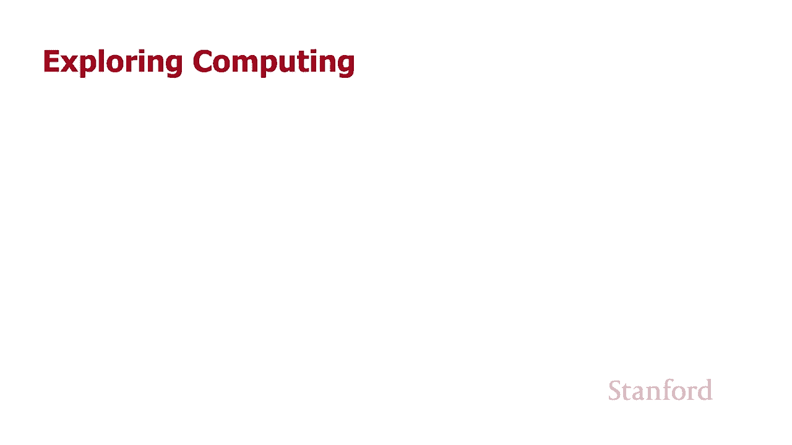

undefined，欢迎探索计算，欢迎探索计算，今天的视频介绍，今天的视频介绍，了人类和计算机语言中的 html 语法和词汇。

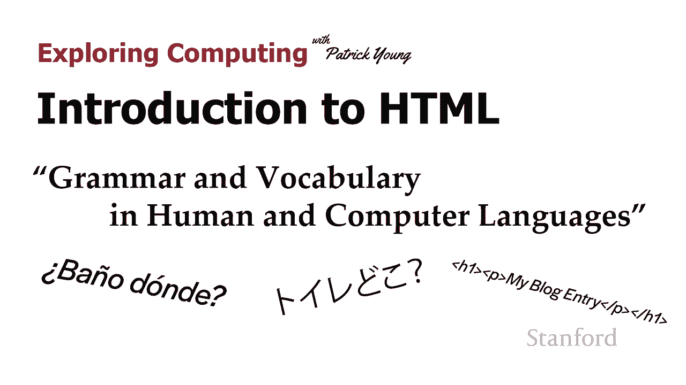

undefined，undefined，所以此时您知道 html，所以此时您知道 html，代表超文本，代表超文本，标记语言，我们花了一些时间，标记语言，我们花了一些时间，讨论什么是超文本。

讨论什么是超文本，我们也花了一些时间讨论，我们也花了一些时间讨论，undefined，undefined，现在市场对语言的看法当然我们，现在市场对语言的看法当然我们，都对语言是什么有一个直观的认识。

都对语言是什么有一个直观的认识，但，但，就像，就像，计算机语言和人类语言之间的关系，计算机语言和人类语言之间的关系，是一样的，是一样的，所以这就是我们，所以这就是我们，现在要讨论的内容。

 我还将学习一些，现在要讨论的内容。 我还将学习一些。

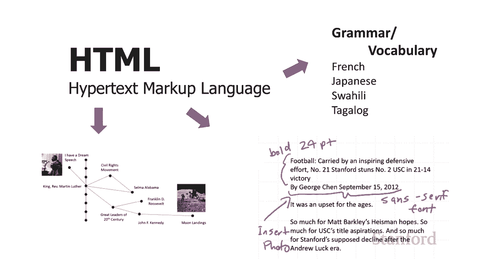

新的 html 语法规则，所以请，新的 html 语法规则，所以请，继续关注，所以，继续关注，所以，计算机语言和人类语言，计算机语言和人类语言，是相同的，它们都，是相同的，它们都，用于交流，但当然。

用于交流，但当然，其中之一我们正在与，其中之一我们正在与，人类交流 另一个我们正在，人类交流 另一个我们正在，与计算机进行通信，undefined，undefined。

那么当我们学习一种新的人类语言时它如何发挥作用 我们需要学习，那么当我们学习一种新的人类语言时它如何发挥作用 我们需要学习，undefined，undefined，两种不同的东西，两种不同的东西，需要。

需要，了解该语言的语法规则是什么，了解该语言的语法规则是什么，我们需要学习该，我们需要学习该，语言的词汇 计算机语言，语言的词汇 计算机语言，中也会发生同样的事情，undefined。

undefined，我们将语法规则称为，我们将语法规则称为。

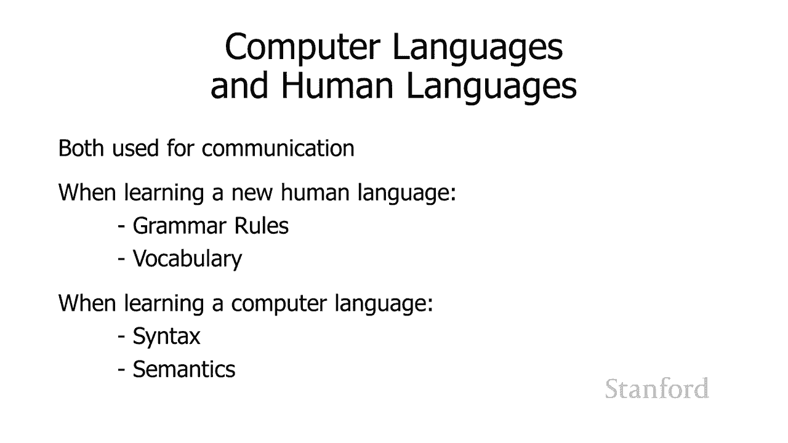

句法 我们认为，句法 我们认为，词汇类似于，词汇类似于，计算机科学 语义的概念，计算机科学 语义的概念，和人类语言的词汇，和人类语言的词汇，可以说是两者中更重要的，可以说是两者中更重要的。

所以你知道如果我被困在某个地方，所以你知道如果我被困在某个地方，我不会说西班牙语，我说，我不会说西班牙语，我说，banyo，banyo，donde 人们会弄清楚我，donde 人们会弄清楚我。

想说什么或 如果我，想说什么或 如果我，在日本的某个地方，我说 toire dokko，在日本的某个地方，我说 toire dokko，你知道我的语法可能有问题，但，你知道我的语法可能有问题，但。

人们会弄清楚我，人们会弄清楚我，想说什么，如果他们想提供帮助，想说什么，如果他们想提供帮助，他们会指出我现在需要去的地方，他们会指出我现在需要去的地方，不幸的是 对于计算机，不幸的是 对于计算机，语言。

语法必须是，语言，语法必须是，完美的，而对于 html 则不太正确，在，完美的，而对于 html 则不太正确，在，这种情况下，您可以为将要教您下一堂课，这种情况下，您可以为将要教您下一堂课。

的级联样式表提供一些东西，undefined，undefined，您的语法需要接近，您的语法需要接近，完美 并且当我们开始学习编程，完美 并且当我们开始学习编程，语言时，语言时，您的语法绝对必须。

您的语法绝对必须，完美，undefined，undefined，undefined，undefined，undefined，undefined，'我仍然会，'我仍然会，说，说，好我会无视你，因为。

好我会无视你，因为，你的语法并不完美 这，你的语法并不完美 这，就是电脑的样子，就是电脑的样子，电脑就像我知道你在，电脑就像我知道你在，找浴室 因为我，找浴室 因为我，完全明白你在说什么。

完全明白你在说什么，但喜欢，但喜欢，你的语法是错误的，所以我只是，你的语法是错误的，所以我只是，坐在这里不做任何，坐在这里不做任何，计算机会做的事情，计算机会做的事情，在，在，学习计算机语言与人类。

学习计算机语言与人类，语言时有一些好消息，语言时有一些好消息，那就是与，那就是与，计算机语言，计算机语言，相比，语法实际上非常简化 人类，相比，语法实际上非常简化 人类，语言可能有一些非常松散的。

语言可能有一些非常松散的，规则，规则，词汇量也更加有限，词汇量也更加有限，结果对于 html，结果对于 html，来说是多么有限，只有不到 120 个，来说是多么有限，只有不到 120 个。

html 元素 s 和其中一些，html 元素 s 和其中一些。

非常专业，所以，非常专业，所以，这里有一些元素的例子，这里有一些元素的例子，你们大多数人永远，你们大多数人永远，不需要知道，不需要知道，所以 bdi 和 bdo 元素用于。

所以 bdi 和 bdo 元素用于，反转文本方向，所以，反转文本方向，所以，当你使用某些语言时这很重要，undefined，undefined，特别是如果你有一个网页，特别是如果你有一个网页，的语言。

的语言，从左到右，然后你有，从左到右，然后你有，从右到左的语言的引述，但，从右到左的语言的引述，但，就像，就像，你要制作这些网页多远，你要制作这些网页多远，这样你就知道你是否是语言。

这样你就知道你是否是语言，专家，专家，你可能需要这些标签，但，你可能需要这些标签，但，我们其他人就像，我们其他人就像，不，我们不需要知道这些，不，我们不需要知道这些，标签或元素，标签或元素。

wbr 我什至不知道这存在所以我，wbr 我什至不知道这存在所以我，去网页上计算实际，去网页上计算实际，有多少标签，有多少标签，在积极使用中，这，在积极使用中，这，用于，用于，确定在哪里打断一个词。

所以，确定在哪里打断一个词，所以，假设你有一个非常长的词，假设你有一个非常长的词，比如 supercalifragilist be，比如 supercalifragilist be。

exialidocious，并且你试图，exialidocious，并且你试图，告诉计算机，告诉计算机，这是否不能全部放在一行，这是否不能全部放在一行，undefined，undefined。

中 ld 我把换行符很好，中 ld 我把换行符很好，这就是 wbr 的用途，这就是 wbr 的用途，是的，我从未使用过它，然后跟踪，是的，我从未使用过它，然后跟踪，它用于指示，它用于指示。

undefined，undefined，您可能会使用它的音频的字幕，但就像我从未，您可能会使用它的音频的字幕，但就像我从未，在 um 之前实际将音频放在网页上，在 um 之前实际将音频放在网页上。

一样 你知道这取决于，一样 你知道这取决于，你打算用你的，你打算用你的，网页做什么 是的，它实际上可能非常，网页做什么 是的，它实际上可能非常，有用，但对我们大多数人来说，有用，但对我们大多数人来说。

并不是那么重要，所以有一堆，并不是那么重要，所以有一堆，undefined，undefined，不是很重要的，然后有，不是很重要的，然后有，一堆 是非常明显的，所以，一堆 是非常明显的，所以，就像。

就像，段落的 p 好吧，这是非常，段落的 p 好吧，这是非常，明显的，明显的，文章，用于创建一篇文章，文章，用于创建一篇文章，例如，如果，例如，如果，undefined，undefined。

您的博客部分中有一堆文章，您的博客部分中有一堆文章，用于创建一个部分，用于创建一个部分，那么其中一些非常，那么其中一些非常，简单，并且，简单，并且，其中一些根本没有使用，所以，其中一些根本没有使用。

所以，结果证明有 120 个，结果证明有 120 个，数量适中，但数量并不，数量适中，但数量并不，多，多，而且其中很多非常容易或，而且其中很多非常容易或，不会使用，因此，不会使用，因此。

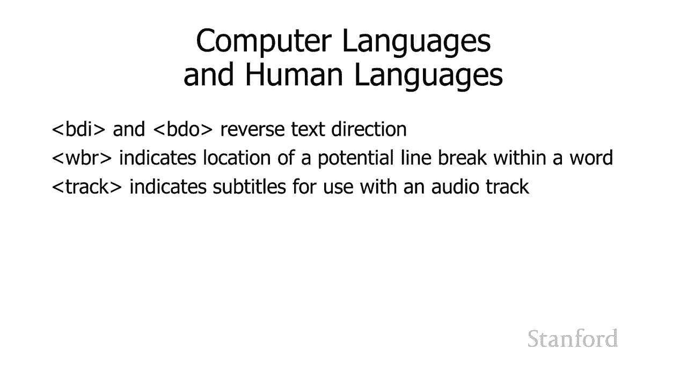

html 的总词汇量，html 的总词汇量，实际上非常小，实际上非常小，好的，我们已经 学习，好的，我们已经 学习，了 html 的一些语法规则，了 html 的一些语法规则，在计算机科学中。

我们将这些，在计算机科学中，我们将这些，规则称为语法，规则称为语法，规则，例如，我们了解到 html 使用，规则，例如，我们了解到 html 使用，undefined，undefined。

标记与开始文本进行比较的标记，标记与开始文本进行比较的标记，和，和，标记表示元素的标记，因此，标记表示元素的标记，因此。

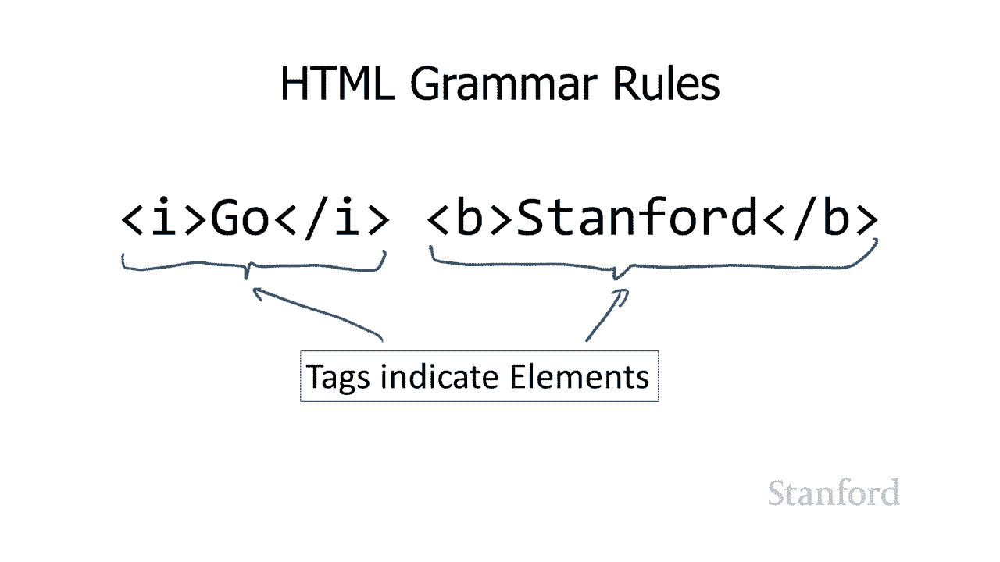

记住的元素，记住的元素，基本上是开始标记 结束标签，基本上是开始标记 结束标签，和内容，和内容，我们了解到组合标签有不同的规则，undefined，undefined，标签必须完全嵌套。

标签必须完全嵌套，这样斜体标签必须完全，这样斜体标签必须完全，包含在粗体标签中，包含在粗体标签中，或者粗体标签必须完全，或者粗体标签必须完全，包含在斜体标签中我们不能，包含在斜体标签中我们不能。

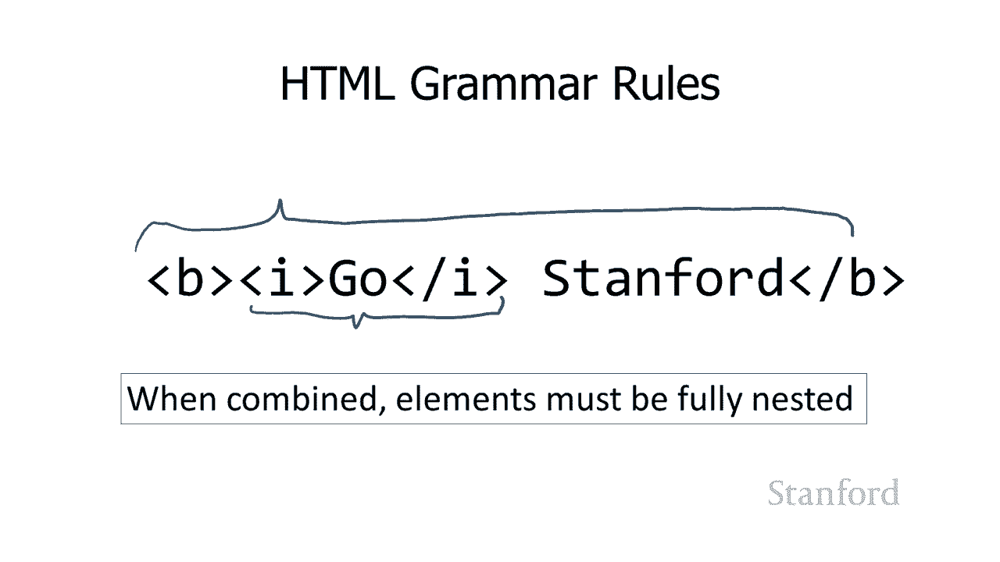

有点混合这两者，但是，有点混合这两者，但是，更多的，更多的，语法规则或更多的语法规则呢？嗯，语法规则或更多的语法规则呢？嗯，有关于如何嵌套元素的规则，undefined，undefined。

比如哪些元素可以放在里面，比如哪些元素可以放在里面，所以我们说斜体可以放在，所以我们说斜体可以放在，碗里，碗可以放在碗里，碗里，碗可以放在碗里，斜体如果我想结合一个 h1 记住。

斜体如果我想结合一个 h1 记住，这是最大尺寸的标题和，这是最大尺寸的标题和，斜体有关于它是如何，斜体有关于它是如何，工作的规则，工作的规则，和答案是肯定的不幸，和答案是肯定的不幸。

的是从 html5 他们v 变得更复杂，的是从 html5 他们v 变得更复杂，了 html4 规则要简单得多，所以，了 html4 规则要简单得多，所以，我将首先，我将首先，谈谈 html4 规则是。

谈谈 html4 规则是，怎样的，你可以认为这是一个，怎样的，你可以认为这是一个，很好的经验法则，很好的经验法则，和一个很好的思考方式 事情，和一个很好的思考方式 事情，所以可能有点相当于 e 之前的。

所以可能有点相当于 e 之前的，英语，英语，i 除了在 c 之后，这是，undefined，undefined，人们有时在这里学习英语的规则，人们有时在这里学习英语的规则，它通常有效，除非它。

它通常有效，除非它，没有，没有，所以这是一种思考事物的好方法，所以这是一种思考事物的好方法，而且主要是 这将引导，而且主要是 这将引导，您朝着正确的方向前进，您朝着正确的方向前进，所以一般来说。

有两种主要，所以一般来说，有两种主要，类型的标签，类型的标签，一种称为文本，一种称为文本，级标签，有时称为行，级标签，有时称为行，undefined，undefined，内标签，这些标签用于，内标签。

这些标签用于，指示有关一个词或，指示有关一个词或，几个词的信息，几个词的信息，较大的 say 段落中的单词，因此粗体标记，较大的 say 段落中的单词，因此粗体标记，和斜体标记是这种情况的示例，因此。

和斜体标记是这种情况的示例，因此，undefined，undefined，还有这个下标标记和，还有这个下标标记和，上标标记，undefined，undefined，如果您正在创建有关数学的文档。

如果您正在创建有关数学的文档，但您知道，您可能会使用它们，但您知道，您可能会使用它们，你们中的许多人不会使用这些，但，你们中的许多人不会使用这些，但，无论如何，有一堆这些，无论如何，有一堆这些。

标签旨在，标签旨在，获取几个单词和几个字母并，获取几个单词和几个字母并，用它们做一些事情，用它们做一些事情，这些被称为文本级别或内联，这些被称为文本级别或内联，标签，然后另一个块级别，标签。

然后另一个块级别，标记块 顾名思义，级别文本，标记块 顾名思义，级别文本，用于创建，用于创建，文本块，因此这就像，文本块，因此这就像，h1 记住这是我们最大大小的，h1 记住这是我们最大大小的。

标题 h2s，标题 h2s，h3s 所有标题段落标签，h3s 所有标题段落标签，和其他标签嗯我们会看到像，和其他标签嗯我们会看到像，表格标签创建 表格，表格标签创建 表格，有标签 创建项目列表。

有标签 创建项目列表，这些都是块级标签，这些都是块级标签，还有一组标签，还有一组标签，据我所知没有正式名称，据我所知没有正式名称，但我认为是结构标签，但我认为是结构标签。

那些是像 html 标签这样的标签，那些是像 html 标签这样的标签，head 标签和 body 标签，我们，head 标签和 body 标签，我们，不会为这个讨论担心这些，不会为这个讨论担心这些。

undefined，undefined，所以在文本级别，所以在文本级别，和块级别标签之间，和块级别标签之间，所以如果我有一堆文本并且，所以如果我有一堆文本并且，在文本中间我有 一堆。

在文本中间我有 一堆，文本级别的标签，用于前 充足，也许我，文本级别的标签，用于前 充足，也许我，有一些粗体标签和一些，有一些粗体标签和一些，混合的金属标签，混合的金属标签，如果我有，如果我有。

一堆文本并且我有块级，一堆文本并且我有块级，标签以及，标签以及，内联标签，我将其称为短语我将其称为，内联标签，我将其称为短语我将其称为，flow，flow，所以我们得到的是我们有。

所以我们得到的是我们有，某些标签，我们可以放置，某些标签，我们可以放置，短语，短语，这意味着我可以放置文本和文本级别的，这意味着我可以放置文本和文本级别的，标签，标签，或其他元素，我可以放置 flow。

或其他元素，我可以放置 flow，所以如果某些内容表明这，所以如果某些内容表明这，只能包含短语 这意味着它，只能包含短语 这意味着它，不能包含块级标记，不能包含块级标记。

因此您可以在其中包含粗体标记和标记，因此您可以在其中包含粗体标记和标记，但，undefined，undefined，如果某些内容可以包含短语，则不能在其中包含段落，这，如果某些内容可以包含短语。

则不能在其中包含段落，这，意味着您可以在其中包含粗体标记和，意味着您可以在其中包含粗体标记和，标记标记 在那里你也可以有，标记标记 在那里你也可以有，段落标签你可以有表格标签，段落标签你可以有表格标签。

基本上你可以有，基本上你可以有，任何在网页上实际创建内容的标签，任何在网页上实际创建内容的标签，undefined，undefined，这并不意味着你，这并不意味着你。

可以在那里有一个 html 标签或一个，可以在那里有一个 html 标签或一个，头标签，它们是一个 正文，头标签，它们是一个 正文，标签那些不重要的标签，但您可以，标签那些不重要的标签，但您可以。

拥有任何，拥有任何，内容标签，例如 b 旧标签，内容标签，例如 b 旧标签，斜体标签 段落标签，斜体标签 段落标签，undefined，undefined，标题 h1 到 h6 标签。

标题 h1 到 h6 标签，表标签，所有都算作流程，表标签，所有都算作流程，好的，所以阻止所有块表级标签，好的，所以阻止所有块表级标签，可能包含，可能包含，短语，所以如果你有一个，短语。

所以如果你有一个，段落，你可以完全有，段落，你可以完全有，斜体的粗体标签 文本，斜体的粗体标签 文本。

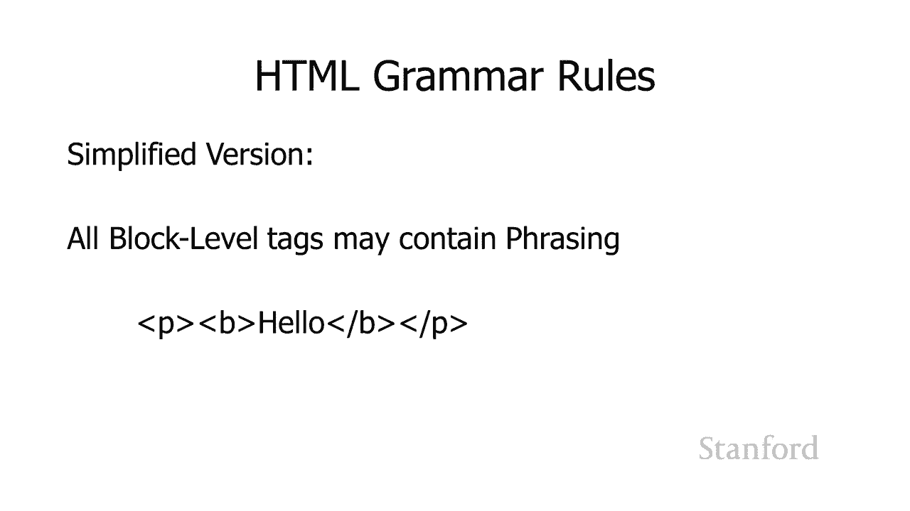

undefined，undefined，文本级别标签可能不包含灯泡，文本级别标签可能不包含灯泡，级别标签，因此，级别标签，因此，您有斜体元素它不能，您有斜体元素它不能，包含段落元素，包含段落元素。

我们有一个粗体标签，我们有一个粗体标签，它定义的粗体元素不能，它定义的粗体元素不能。

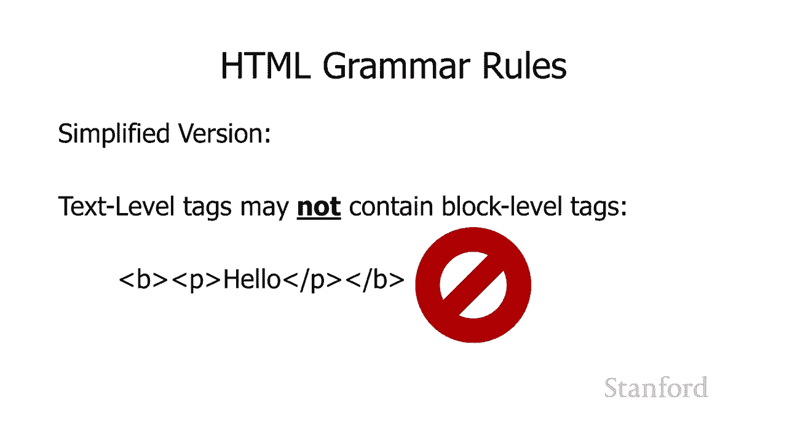

undefined，undefined，某些块级别 标签可能包含流，某些块级别 标签可能包含流，所以这里我有文章，所以这里我有文章，标签，正如我之前提到的文章，标签，正如我之前提到的文章，用于表明。

用于表明，它将用于，它将用于，可能有一堆不同文章的网页上，undefined，undefined，有一个博客，有一个博客，undefined，undefined，我的博客在同一页面上有一堆条目我。

我的博客在同一页面上有一堆条目我，可以将这些条目中的每一个标记为，可以将这些条目中的每一个标记为，文章，然后我可以，文章，然后我可以，undefined，undefined。

在这些文章中包含流意义我可以有，在这些文章中包含流意义我可以有，一堆标题 h1 到 h6，一堆标题 h1 到 h6，i 可以有表格 我可以有，i 可以有表格 我可以有，undefined。

undefined，你知道的段落 我基本上可以，你知道的段落 我基本上可以，undefined，undefined。

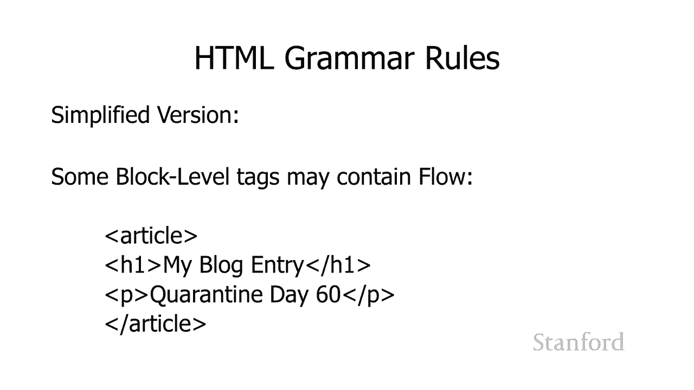

在文章中放任何东西 所以文章是，在文章中放任何东西 所以文章是，一个块级标签的例子，可以包含流，一个块级标签的例子，可以包含流，一些块级标签不能包含流，一些块级标签不能包含流，它们只能包含。

它们只能包含，短语，所以这个例子 是一个，短语，所以这个例子 是一个，h1 标签，h1 标签，所以记住 h1 用于创建，所以记住 h1 用于创建，一个标题来指示，一个标题来指示，网页上的标题 嗯。

如果我有一个 h1 是我，网页上的标题 嗯，如果我有一个 h1 是我，最大的标题，最大的标题，那么说哦，你知道的，那么说哦，你知道的，所以正常使用是没有意义的 标题，所以正常使用是没有意义的 标题。

会像，会像，h1 stanford history 这样表明我，h1 stanford history 这样表明我，应该在我的网页顶部有一个大标题，上面，应该在我的网页顶部有一个大标题，上面。

写着 stanford，写着 stanford，undefined，undefined，history 说 h1 嗯，history 说 h1 嗯，嘿，我的标题中有三个段落，嘿，我的标题中有三个段落。

我有 我的标题中有一个表格，我有 我的标题中有一个表格，undefined，undefined，你知道我的标题中有一个完全没有意义的块引用，undefined，undefined，undefined。

所以 h1 是一个块级标记的例子，所以 h1 是一个块级标记的例子，它可以包含短语，它可以包含短语，这意味着我可以有文本和，这意味着我可以有文本和，文本级标记，所以 我可以有斯坦福，文本级标记。

所以 我可以有斯坦福，然后我 ave，然后我 ave，history 历史以斜体显示，history 历史以斜体显示。

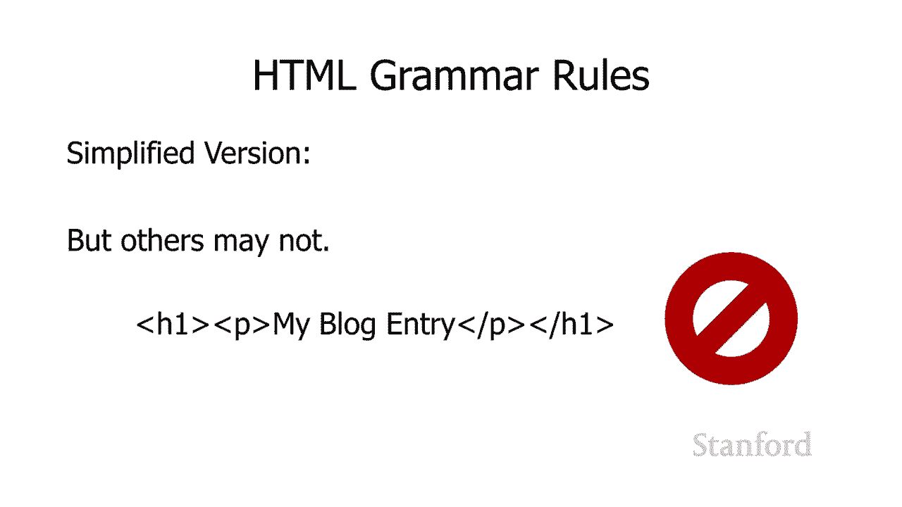

这完全是合法的，这完全是合法的，但同样我们不能在其中包含其他块，但同样我们不能在其中包含其他块，级标签，级标签，好吧，这里有一个更复杂的版本，好吧，这里有一个更复杂的版本，基本上，更复杂的版本是。

基本上，更复杂的版本是，查找它，所以我为您提供，查找它，所以我为您提供，了讲义附录 a 来自 cs105，了讲义附录 a 来自 cs105，课程阅读器，嗯，它里面没有，课程阅读器，嗯，它里面没有。

所有标签，我想我已经知道了，嗯，所有标签，我想我已经知道了，嗯，我还没数过，但我可能有，undefined，undefined，120 个标签中的 40 个，它们是一个，120 个标签中的 40 个。

它们是一个，好的开始，它们 无论如何都是最常用的那些，undefined，undefined，所以如果您查看该，所以如果您查看该，文档，您会发现，文档，您会发现，它实际上列出了，它实际上列出了。

特定元素适合的类别，因此我们可以，特定元素适合的类别，因此我们可以，在这里看到一个段落，在这里看到一个段落，算作流内容，所以请记住我们，算作流内容，所以请记住我们，之前说过有短语，之前说过有短语。

然后是流程，所以一个段落，然后是流程，所以一个段落，算作流程，算作流程，你可以看到一个段落可以，你可以看到一个段落可以，包含到目前为止的措辞内容，包含到目前为止的措辞内容，非常符合，非常符合。

我们刚刚告诉你的小规则，所以，我们刚刚告诉你的小规则，所以，这是一个，这是一个，在 e 之前的 i 的例子，除了 在 cengli 之后 sh，在 e 之前的 i 的例子。

除了 在 cengli 之后 sh，规则除了它实际上有效，规则除了它实际上有效，但我们即将看到有很多，但我们即将看到有很多，时候它不起作用，时候它不起作用，这是 html5 中的新内容。

这是 html5 中的新内容，有点不幸，但基本上，有点不幸，但基本上，html51 经常定义一大堆，html51 经常定义一大堆，新的类别类型，新的类别类型，等等 你可以看到从，等等 你可以看到从。

h1 到 a6 的八个标题，h1 到 a6 的八个标题，它们算作流内容，它们算作流内容，这就是我们之前看到的，这就是我们之前看到的，但实际上它们有自己的，但实际上它们有自己的，类别，即标题内容，所以。

类别，即标题内容，所以，有一些东西，比如嗯，有一些东西，比如嗯，有一个 h 组可以用来，有一个 h 组可以用来，创建，创建，呃 标题，你有一个大，呃 标题，你有一个大，标题，然后你有一个副标题，标题。

然后你有一个副标题，所以这，所以这，有点像如果你有一个小说的标题，有点像如果你有一个小说的标题，然后你有一个副标题，然后你有一个副标题，你会用 h，你会用 h，组和 h  group 只能。

组和 h  group 只能，包含标题内容，所以它可以，包含标题内容，所以它可以，包含 h1 或，包含 h1 或，a6 是的，它确实允许我们有更，a6 是的，它确实允许我们有更，有趣更复杂的东西，但。

undefined，undefined，它只是在这里增加了很多复杂性，它只是在这里增加了很多复杂性，基本上你现在必须查找，基本上你现在必须查找，所有内容，你可以看到 在这里，所有内容。

你可以看到 在这里，我不太适合这里的幻灯片，但是，我不太适合这里的幻灯片，但是，你知道文章，你知道文章，它算作流动内容，但它也，它算作流动内容，但它也，有一个称为部分内容的新类别。

有一个称为部分内容的新类别，undefined，undefined，没有简单的方法来学习新，没有简单的方法来学习新，规则，你必须查找它，规则，你必须查找它，你可以在，你可以在，附录 a 中查找很多。

然后如果你真的，附录 a 中查找很多，然后如果你真的，深入了解它，深入了解它。

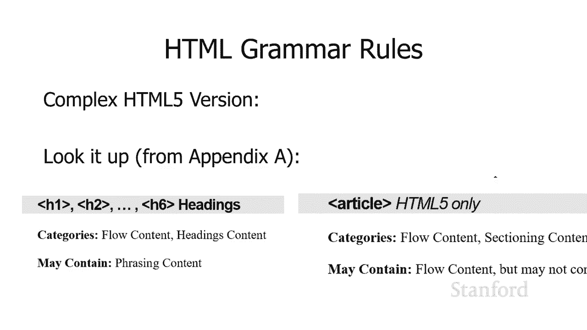

你当然可以查看官方标准，你当然可以查看官方标准，看看那里有哪些语法规则，看看那里有哪些语法规则，嗯，我确实想提到另一件，嗯，我确实想提到另一件，与我们的语法角色相关的事情，与我们的语法角色相关的事情。

和 我在这里将它们称为语法，和 我在这里将它们称为语法，规则，它们是语法规则，规则，它们是语法规则，但，但，在计算机科学中，我们通常将，在计算机科学中，我们通常将，它们称为语法规则，它们称为语法规则。

因此习惯了该名称语法规则，因此习惯了该名称语法规则，特别是如果您学习了编程，特别是如果您学习了编程，语言，语言，那么这里是另一种语法，那么这里是另一种语法，规则 的角度引号看看，规则 的角度引号看看。

我在这里的这两个引号，所以，我在这里的这两个引号，所以，在上和弦中我向大家问好，在上和弦中我向大家问好，在下和弦中我向所有人问好，在下和弦中我向所有人问好，undefined，undefined。

但是看看那些引号，但是看看那些引号，底部引号是直的，并且，底部引号是直的，并且，最上面的引号是有角度的，最上面的引号是有角度的，所以左引号和右，所以左引号和右，引号是不同的，引号是不同的。

这里的那些实际上是，这里的那些实际上是，不同的 unicode 字符，所以，不同的 unicode 字符，所以，嗯，我正在，嗯，我正在，使用实际使用十六进制的通用名称来显示 unicode。

使用实际使用十六进制的通用名称来显示 unicode，它只是，它只是，您拥有的五个学生之一 没有看到这个，您拥有的五个学生之一 没有看到这个，但你会在几天内看到这个，但你会在几天内看到这个，嗯。

所以现在你只需要相信我的，嗯，所以现在你只需要相信我的，话，但，话，但，那些是不同的代码，那些是，那些是不同的代码，那些是，不同的二进制序列，所以，undefined，undefined。

左角代码的二进制序列不同于，undefined，undefined，直角引号，直角引号，的，的，二进制序列与非角引号的二进制序列完全不同，二进制序列与非角引号的二进制序列完全不同，并且，并且。

只有非角引号，只有非角引号，对于 html 的语法目的是合法的，所以，对于 html 的语法目的是合法的，所以，要非常小心这个嗯，要非常小心这个嗯，undefined，undefined，如果你复制。

你也会发现 并从，如果你复制，你也会发现 并从，undefined，undefined，pdf 文件之类的东西中粘贴会发生奇怪的事情，pdf 文件之类的东西中粘贴会发生奇怪的事情，undefined。

undefined，一些不同的有趣字符，一些不同的有趣字符，这些字符，这些字符，可能是作者最初没有，可能是作者最初没有，创建的 o，创建的 o。

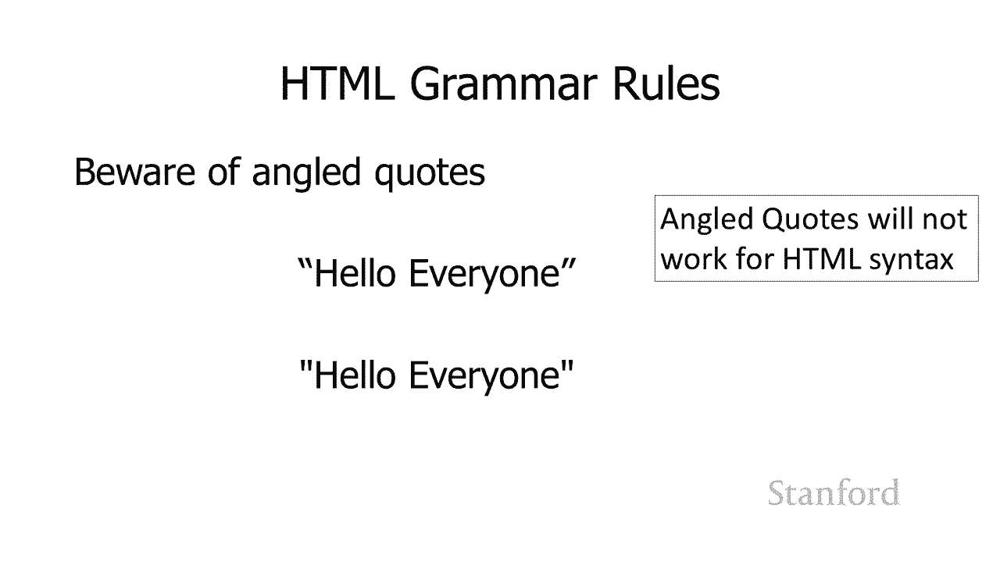

请注意这一点，所以在这里你看到我有，请注意这一点，所以在这里你看到我有，两个版本的 aahref um 将，两个版本的 aahref um 将，单词 stanford 链接到 stanford 主页。

单词 stanford 链接到 stanford 主页，注意顶部版本有，注意顶部版本有，非角引号，底部版本，非角引号，底部版本，有角，有角，引号 角引号版本将 根本不起作用，undefined。

undefined，这些引号通常会，这些引号通常会，由文字处理器自动生成，由文字处理器自动生成，这也是，这也是，我，我，强烈建议您在使用专为编程使用而设计的 html。

强烈建议您在使用专为编程使用而设计的 html，时使用文本编辑器的另一个原因，undefined，undefined，undefined，undefined，可能用于文本，可能用于文本，编辑但，编辑但。

也具有文字处理器的一些功能的东西，也具有文字处理器的一些功能的东西，因为那些文字处理器，因为那些文字处理器，文档会想哦，我你知道，文档会想哦，我你知道，这些角度引用看起来很酷，这些角度引用看起来很酷。

我认为你会我认为你，我认为你会我认为你，真的会喜欢 这些角度引用，真的会喜欢 这些角度引用，它会让你的文档看起来更好，它会让你的文档看起来更好，undefined，undefined。

然后如果你真的输入 html，然后如果你真的输入 html，你就搞砸了，你就搞砸了，所以它们看起来确实很酷，但不要，所以它们看起来确实很酷，但不要，使用它们，使用它们。

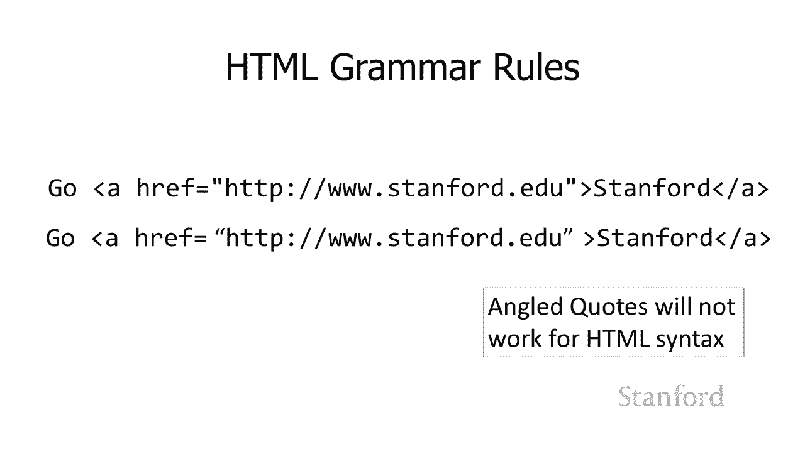

不好 铰链会发生，所以，不好 铰链会发生，所以，这似乎需要记住很多语法，这似乎需要记住很多语法，undefined，undefined，这是底线，这是底线，在通过验证器运行之前验证我们提到的所有内容。

undefined，undefined，验证器会告诉你是否，验证器会告诉你是否，有问题 如果你有，有问题 如果你有，那些角度 引号而不，那些角度 引号而不，是非角度引号，验证器，是非角度引号，验证器。

将告诉您是否以根据 html5 规则，将告诉您是否以根据 html5 规则，实际上非法的方式使用了某些 html 元素，实际上非法的方式使用了某些 html 元素，因为您，因为您，没有很好地查找它。

没有很好地查找它，验证器会告诉您，验证器会告诉您，所以一定要验证，所以一定要验证，一切正常，所以下一节课我们将，一切正常，所以下一节课我们将，看看级联样式表，看看级联样式表，一旦，一旦。

我们学会了级联样式表，我们真的能够为我们的，我们学会了级联样式表，我们真的能够为我们的，网页增添趣味并进行各种有趣的格式化，undefined。

