# 【双语字幕+资料下载】斯坦福CS105 ｜ 计算机科学导论(2021最新·完整版) - P27：L8.1- CSS 简介 - ShowMeAI - BV1eh411W72E

undefined，欢迎来探索计算，欢迎来探索计算，今天的视频是 css 介绍，今天的视频是 css 介绍，所以上一课我们学习了如何使用，所以上一课我们学习了如何使用，html，html。

你可能想知道我是否准备好，你可能想知道我是否准备好。

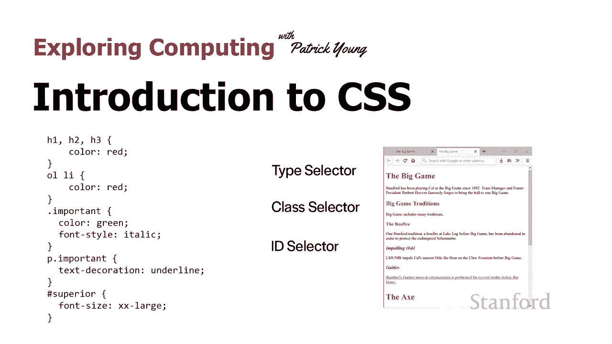

制作很酷的网页，制作很酷的网页，答案并不是真的 事实证明你，答案并不是真的 事实证明你，实际上需要，实际上需要，知道两种不同的 语言来制作网页，知道两种不同的 语言来制作网页，undefined。

undefined，你需要知道 html，你可以，你需要知道 html，你可以，只用 html 制作网页，但，只用 html 制作网页，但，如果你想要酷有趣的，如果你想要酷有趣的，网页，你需要学习第二。

网页，你需要学习第二，语言，语言，css 或级联样式表，css 或级联样式表，我们在这里所做的就是我们 已经将，我们在这里所做的就是我们 已经将，undefined，undefined。

我们的语义信息从我们的，我们的语义信息从我们的，表示信息中分离出来，所以 html 现在，表示信息中分离出来，所以 html 现在，仅用于提供语义，仅用于提供语义，信息，信息，级联样式表告诉我们。

级联样式表告诉我们，如何呈现该信息，如何呈现该信息，那么这里有什么区别，那么这里有什么区别，段落，段落，标签告诉我们，我们有一个段落，标签告诉我们，我们有一个段落，是语义信息，是语义信息。

如果我们想像我们说的那样设置该段落的样式，如果我们想像我们说的那样设置该段落的样式，哦，哦，我希望它有一个一，我希望它有一个一，英寸的缩进，或者我想，undefined，undefined。

用两个像素的锯围绕段落 红色边框，用两个像素的锯围绕段落 红色边框，是表示信息，是表示信息，类似地，类似地，如果我们有一个项目列表，语义，如果我们有一个项目列表，语义，信息是一个项目列表。

信息是一个项目列表，表示信息可能，表示信息可能，很好，很好，我真的不想在那里使用子弹，我真的不想在那里使用子弹，我想，我想，在每个项目前面使用小斯坦福树徽标，undefined，undefined。

列表中的项目，或者我希望每个项目，undefined，undefined，都由两个像素的红线分隔，因此这是，都由两个像素的红线分隔，因此这是，演示信息，演示信息，因此基本上 html 只会。

因此基本上 html 只会，提供，提供，信息告诉 Web 浏览器，信息告诉 Web 浏览器，这是元素的类型，但是，这是元素的类型，但是，不是这是如何呈现这个，不是这是如何呈现这个，特定元素 这是。

特定元素 这是。

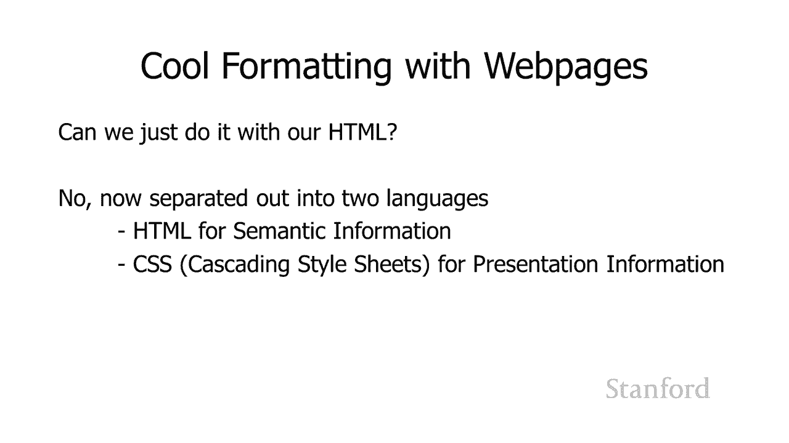

级联样式表的工作，级联样式表的工作，为什么我们要这样做 为什么我们，为什么我们要这样做 为什么我们，将它们很好地分开 最初我们只有，将它们很好地分开 最初我们只有，undefined。

undefined，html 并且它做了所有事情 但是，html 并且它做了所有事情 但是，通过将两者分开 我们实际上，通过将两者分开 我们实际上，有更多的灵活性，有更多的灵活性，对于更改，例如。

对于更改，例如，假设我们要，假设我们要，在 2005 年创建一篇新闻文章，在 2005 年创建一篇新闻文章，有人要，有人要，在我们的网站上搜索该新闻文章，但，在我们的网站上搜索该新闻文章，但。

我们的网站已经消失，我们的网站已经消失，从那时起经过几次设计更改，从那时起经过几次设计更改，问题是该文章是否应该，问题是该文章是否应该，看起来像 2005 年的，看起来像 2005 年的，网站。

或者我们应该以某种方式升级，网站，或者我们应该以某种方式升级，该，该，网页以匹配新的 2020 年网页，网页以匹配新的 2020 年网页，设计，因此通过分离出相同的，设计，因此通过分离出相同的。

语义信息，语义信息，无论文章是否 是，无论文章是否 是，在 2005 年或 2020 年写的，在 2005 年或 2020 年写的，你知道如果那是一个，你知道如果那是一个，主要大小的标题，如果。

主要大小的标题，如果，那是一个段落，那是一个段落，那么关于嘿的信息我们已经，那么关于嘿的信息我们已经，决定我们的 h1，决定我们的 h1，现在应该居中并以红色显示，而，现在应该居中并以红色显示，而。

15 年前我们认为它 应该出现，undefined，undefined，在左侧，您知道黑色是，在左侧，您知道黑色是，演示信息，演示信息，我认为今天更重要的是，我们，我认为今天更重要的是，我们，需要记住。

需要记住，我们的网站有不同的演示文稿，我们的网站有不同的演示文稿，具体取决于它，具体取决于它，出现的设备，因此，出现的设备，因此，我们仍然具有相同的语义，我们仍然具有相同的语义，信息，即段落，信息。

即段落，是 列表，这是一个表格，是 列表，这是一个表格，但它的确切显示方式，但它的确切显示方式，将取决于，将取决于，用户是否正在访问我们的网站 在，undefined，undefined。

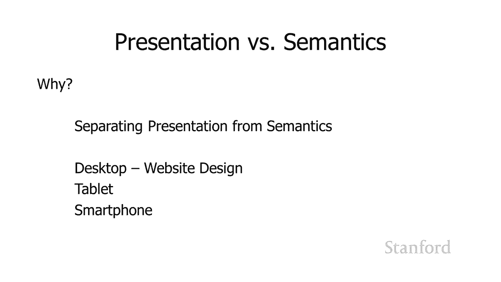

平板电脑或智能手机上的台式机上，平板电脑或智能手机上的台式机上，随着本季度的进行，我们会看到更多这样的内容，随着本季度的进行，我们会看到更多这样的内容，基本上层叠样式表，undefined。

undefined，提供了网页中的所有格式信息，提供了网页中的所有格式信息，不幸的是，那是，不幸的是，那是，maddie，她似乎非常兴奋，maddie，她似乎非常兴奋，关于一些，关于一些。

undefined，undefined，[音乐]，[音乐]，她很兴奋呃，她很兴奋呃，不幸的是级联样式表，不幸的是级联样式表，有自己的，有自己的，语言，在自己的语义中有自己的语法角色，语言。

在自己的语义中有自己的语法角色，坦率地说，它，坦率地说，它，看起来不像 html 团队和 css，看起来不像 html 团队和 css。

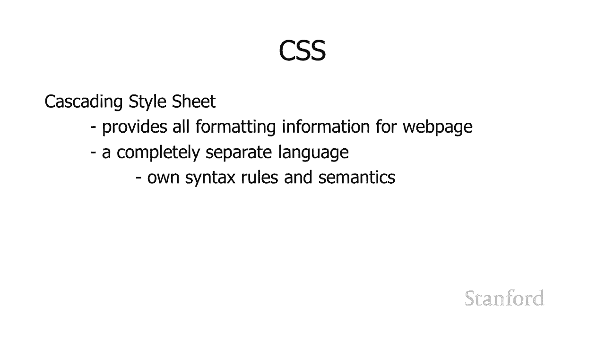

团队在说话，团队在说话，所以我们 在这里回顾一个，所以我们 在这里回顾一个，例子 这是我，例子 这是我，经常在我的课堂上经历的例子，经常在我的课堂上经历的例子，不幸的是，不幸的是。

以这种格式这样做会有点尴尬，但，以这种格式这样做会有点尴尬，但，我认为这是一个很好的例子，它，我认为这是一个很好的例子，它，基本上，基本上，可以让我向你展示所有，可以让我向你展示所有。

不同的事情我认为你应该，不同的事情我认为你应该，至少就基础知识而言需要了解级联样式表，至少就基础知识而言需要了解级联样式表，undefined，undefined，所以这是一个，所以这是一个。

关于斯坦福和加州之间的大型游戏的大型游戏示例，undefined，undefined，以及什么 你在这里看到的是这，以及什么 你在这里看到的是这，是文件的顶部，是文件的顶部。

你可以看到你知道我们有我们的，你可以看到你知道我们有我们的，h1 我们有，h1 我们有，h2 我们有一堆段落，h2 我们有一堆段落。

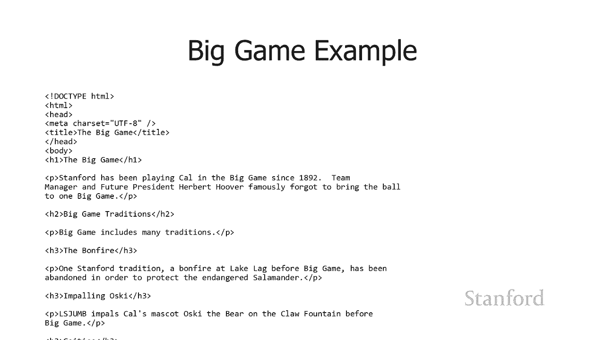

然后如果我们继续，然后如果我们继续，向下，向下，滚动 底部，这很重要，滚动 底部，这很重要，因为我确实在示例的一部分中使用了它，因为我确实在示例的一部分中使用了它，undefined。

undefined，您可以在底部看到有，您可以在底部看到有，一个有序列表，其中有一堆列表，一个有序列表，其中有一堆列表，项，项，显示了早期大型比赛的得分，显示了早期大型比赛的得分，然后是一个无序列表。

然后是一个无序列表，和一堆列表 项目呃，和一堆列表 项目呃，谈论的不仅仅是，谈论的不仅仅是，足球比赛，足球比赛，嗯 有序，嗯 有序，列表和无序列表之间的区别，列表和无序列表之间的区别。

是有序列表列出了不同的项目，是有序列表列出了不同的项目，并，并，在它们前面放了数字所以它，在它们前面放了数字所以它，就像项目一项目二项目三，就像项目一项目二项目三，虽然 使用级联样式表。

虽然 使用级联样式表，您实际上可以将第一个项目更改为第三个项目，您实际上可以将第一个项目更改为第三个项目，以，以，罗马数字 1 罗马数字 2 罗马，罗马数字 1 罗马数字 2 罗马，数字 3 或。

数字 3 或，字母 a 字母 b 字母 c 并且您，字母 a 字母 b 字母 c 并且您，也可以进行大写或小写，因此，也可以进行大写或小写，因此，大写 a 大写 b 大写 c 等等，undefined。

undefined，然后无序列表通常会，然后无序列表通常会，在项目前面显示项目符号，在项目前面显示项目符号，但再次使用级联样式，但再次使用级联样式，表，你可以说，表，你可以说。

我不想要项目符号在它们前面，我，我不想要项目符号在它们前面，我，想要它们前面的方块，想要它们前面的方块，或者正如我之前建议的那样，如果，或者正如我之前建议的那样，如果，你真的很想你可以。

你真的很想你可以。

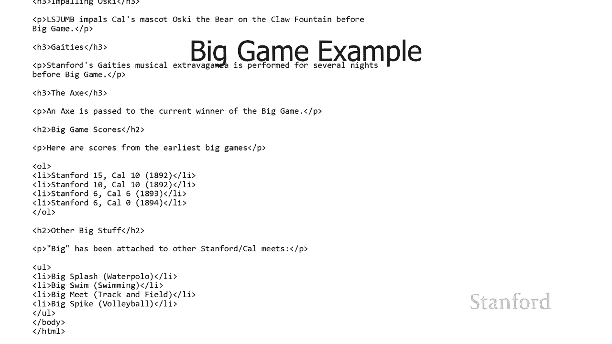

在每个项目的前面放一些小斯坦福标志，undefined，undefined，好吧，让我们继续前进，好吧，让我们继续前进，好吧，这是网站，好吧，这是网站，实际显示在网络浏览器上的样子。

实际显示在网络浏览器上的样子，这是网页的顶部，这是网页的顶部，这是底部，这是底部，你可以，你可以，在网页底部看到我们的，在网页底部看到我们的，有序列表和无序列表，undefined，undefined。

undefined，undefined，进入 html 文件，进入 html 文件，我们将在本讲座结束时看到，我们将在本讲座结束时看到，您实际上可以将，您实际上可以将，样式规则粘贴到外部。

样式规则粘贴到外部，文件中，我们稍后将讨论为什么您可能，文件中，我们稍后将讨论为什么您可能，想要这样做，想要这样做。

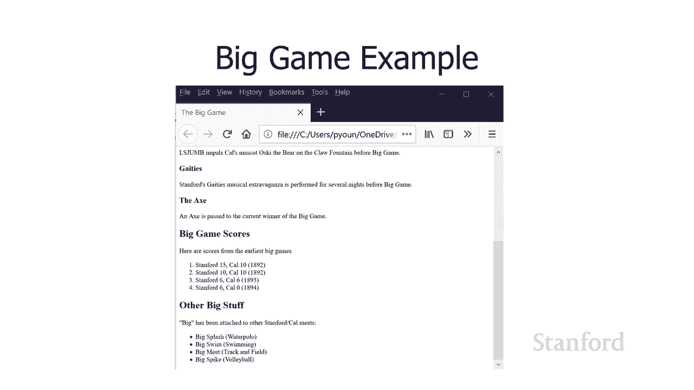

但现在我们只是去 将，但现在我们只是去 将，样式直接放置 tly 进入这个 html 文件，样式直接放置 tly 进入这个 html 文件，所以我所做的是在头脑中，所以我所做的是在头脑中，这在头脑中。

因为这，这在头脑中，因为这，undefined，undefined，不是直接出现在网页上的东西，不是直接出现在网页上的东西，这是，这是，关于网页的东西，所以让我们，关于网页的东西，所以让我们。

进入头脑我们' 将添加一个样式，进入头脑我们' 将添加一个样式，undefined，undefined。

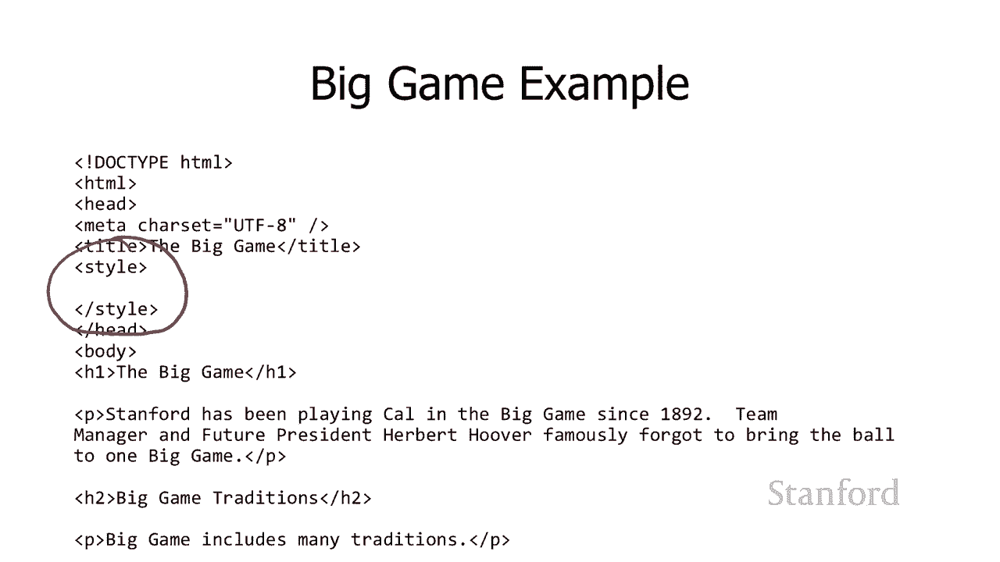

，然后我们将粘贴，然后我们将粘贴，一堆明星卷 这是样式卷的，一堆明星卷 这是样式卷的，样子，样子，这个特定的样式规则说我，这个特定的样式规则说我，想要我网页上的所有 h1 在。

想要我网页上的所有 h1 在。

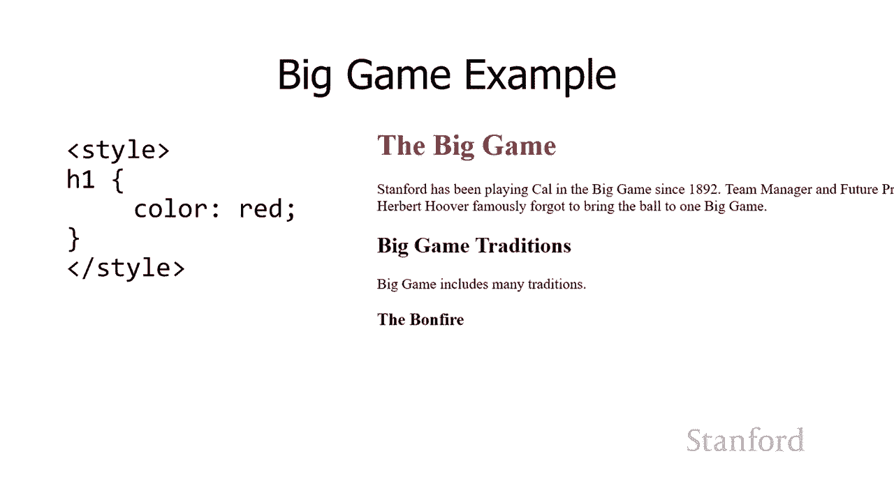

这种情况下，只有一个 h1，这种情况下，只有一个 h1，以红色出现，undefined，undefined，undefined，undefined，undefined，undefined。

undefined，'将会，'将会，看到很多不同的方式来选择，看到很多不同的方式来选择，网页上的项目，所以，网页上的项目，所以，你知道我们会说哦，我想在网页上，你知道我们会说哦，我想在网页上。

选择这些特定的，选择这些特定的，呃项目并将这个，呃项目并将这个，样式规则应用于它，样式规则应用于它，我们会看到 在本讲座的其余部分，我们会看到 在本讲座的其余部分，然后另一部分是，然后另一部分是。

所谓的声明块，所谓的声明块，它表示这是，它表示这是，与此特定选择器匹配的元素的呈现信息，与此特定选择器匹配的元素的呈现信息，在这种情况下，我，在这种情况下，我，希望此颜色显示为红色。

希望此颜色显示为红色，并且您可以在声明块中有一堆项目，并且您可以在声明块中有一堆项目，所以在这里我，所以在这里我，说哦，我想要 颜色为红色我，说哦，我想要 颜色为红色我，希望文本装饰有下划线。

希望文本装饰有下划线，我希望它居中对齐，并，我希望它居中对齐，并，注意，注意，你用分号分隔这些项目中的每一个，undefined，undefined，单独的声明，单独的声明，由一个样式属性组成。

由一个样式属性组成，并且有一大堆样式，并且有一大堆样式，我为您提供了，我为您提供了，来自 cs 105 课程阅读器的附录 b，其中，来自 cs 105 课程阅读器的附录 b，其中，列出了相当多的属性。

列出了相当多的属性，但，但，还有相当多的 um，还有相当多的 um，所以它说样式属性，所以它说样式属性，是颜色，然后样式值是，是颜色，然后样式值是，红色，所以这说，红色，所以这说，以红色出现。

以红色出现，好的 我们将在本讲座的大部分时间，好的 我们将在本讲座的大部分时间，讨论，讨论，我们可以在网页上选择项目的不同方式，我们可以在网页上选择项目的不同方式，我将简要介绍，我将简要介绍。

一下不同的样式属性，一下不同的样式属性，我们可以修改，我们可以修改，嗯，我会给你一个可以修改，嗯，我会给你一个可以修改，的不同样式属性的概述，的不同样式属性的概述，我们将，undefined。

undefined，在接下来的，在接下来的，几周内看到不同的停止属性，以及接下来的几周，undefined，undefined，cs105  sys106e 我们只讨论了。

cs105  sys106e 我们只讨论了，一个星期所以，一个星期所以。

undefined，undefined，我们看到的第一个选择器，我们看到的第一个选择器，就是所谓的类型，就是所谓的类型，选择器 它说，选择器 它说，这是我想要应用的特定类型的元素。

这是我想要应用的特定类型的元素，所以我想要，所以我想要，这个应用 对于 h1s，这个应用 对于 h1s，我们实际上可以列出一堆这些所以，我们实际上可以列出一堆这些所以，这也是类型选择器这说。

这也是类型选择器这说，我希望这适用于 h1s h2s 和，undefined，undefined，h3s 你可以看到 h1 和 h2 和 h3，h3s 你可以看到 h1 和 h2 和 h3。

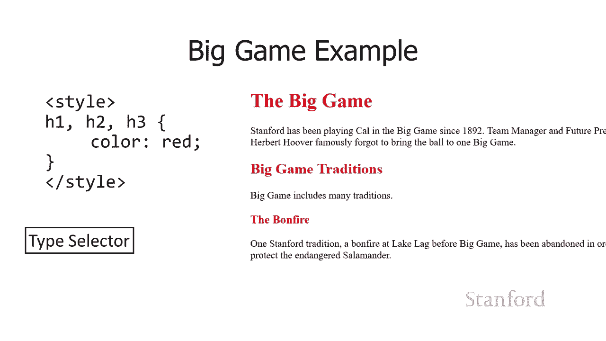

至少适合屏幕，undefined，undefined，现在显示为红色让我们回到我提到的最后部分，现在显示为红色让我们回到我提到的最后部分，我们将在示例的一部分中使用它，我们将在示例的一部分中使用它。

所以我们有那个，所以我们有那个，有序列表，有序列表，我们有那个无序列表，我们有那个无序列表，并且订单列表和无序列表都，并且订单列表和无序列表都，使用列表项，使用列表项。

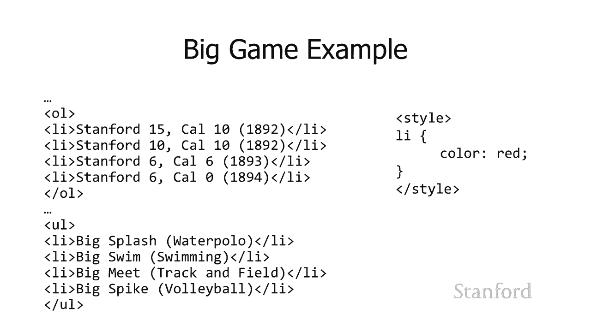

所以如果 我想给其中一个上色，所以如果 我想给其中一个上色，我可以继续这样，我可以继续这样，做我已经说过所有列表项都应该，做我已经说过所有列表项都应该，显示为红色，显示为红色。

并且它们都显示为红色如果我，并且它们都显示为红色如果我，undefined，undefined，只希望其中一些列表项显示，只希望其中一些列表项显示，为红色，如果我只想要，为红色，如果我只想要。

其中的项目怎么办 订单列表显示为，其中的项目怎么办 订单列表显示为，红色而不是，红色而不是。

无序列表中的那些，所以我可以使用，无序列表中的那些，所以我可以使用，后代选择器，后代选择器，所以我说这将，所以我说这将，undefined，undefined，适用于有序列表中的所有列表项，请。

适用于有序列表中的所有列表项，请，undefined，undefined，注意我们的后代选择器，注意我们的后代选择器，只需用空格分隔元素类型，只需用空格分隔元素类型，而类型选择器，而类型选择器，记住。

记住，h1、h2 和 h3 我说过我想，h1、h2 和 h3 我说过我想，应用所有这三个我，应用所有这三个我，用逗号分隔，用逗号分隔，所以当你说哦这里有，所以当你说哦这里有。

一堆我想要的项目时使用逗号 适用于，一堆我想要的项目时使用逗号 适用于，符合此条件的任何元素，符合此条件的任何元素，undefined，undefined，然后在您，然后在您。

尝试使用我们的后代选择器说此元素包含，尝试使用我们的后代选择器说此元素包含，在另一个元素中时使用空格，undefined，undefined，有一些更高级的选择器，有一些更高级的选择器，我不会去说。

我不会去说，德 cided 选择器说这将，德 cided 选择器说这将，适用于这个元素，适用于这个元素，如果它嵌套在任何级别，所以如果我，如果它嵌套在任何级别，所以如果我，有一个有序列表。

有一个有序列表，其中有一个无序列表，其中，其中有一个无序列表，其中，有一个，有一个，无序列表，其中有一个有序，无序列表，其中有一个有序，列表，这将适用于，列表，这将适用于，任何一个 因为所有这些列表。

任何一个 因为所有这些列表，项，项，最终都在有序列表中，最终都在有序列表中，还有另一个列表项，您可以说它，还有另一个列表项，您可以说它，必须是直系后代，但我们，必须是直系后代，但我们，不会再讨论。

不会再讨论。

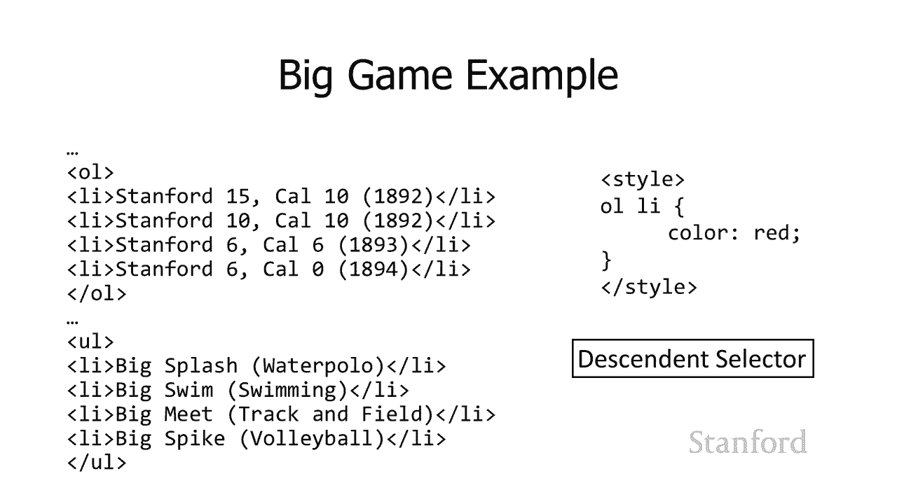

，如果您愿意，可以查看它，让我们，如果您愿意，可以查看它，让我们，回到中间 在我们的示例中，所以，回到中间 在我们的示例中，所以，我在这里有这些 嗯，undefined，undefined，h3。

所以篝火刺穿 oski gadeys 和斧头这些都是，h3，所以篝火刺穿 oski gadeys 和斧头这些都是，与大型游戏相关的不同事物，与大型游戏相关的不同事物，假设我想，假设我想。

对这些 h3 中的一个应用规则，但我可以不做其他两个，undefined，undefined，是的，您实际上可以我们可以做的是，是的，您实际上可以我们可以做的是，我们可以将，我们可以将。

一个类属性值对添加，一个类属性值对添加，到 h3 中的一个，所以在这里我添加了，到 h3 中的一个，所以在这里我添加了，假设班级中的某个人在，假设班级中的某个人在，gadey's 并且他们认为门。

gadey's 并且他们认为门，比 另外两个所以，比 另外两个所以，我们要添加，我们要添加，h3 类 s 在 h3 的 html，h3 类 s 在 h3 的 html，标签，标签，中是重要的。

然后我们将，中是重要的，然后我们将，创建一个样式规则，创建一个样式规则，专门说明它只适用，专门说明它只适用，于重要的事情，所以这被，于重要的事情，所以这被，称为类选择器，称为类选择器，在 html 中。

在 html 中，我只是说类等于引用重要，我只是说类等于引用重要，结束引用，然后，结束引用，然后，是样式选择器，是样式选择器，本身，我在它前面放了一个点，因此该，本身，我在它前面放了一个点，因此该。

点在样式规则中，它不会出现在，undefined，undefined，类的 html 标记中，类的 html 标记中，因此您可以看到这，因此您可以看到这，已将门 h3，已将门 h3，标题 3 变为 嗯。

标题 3 变为 嗯。

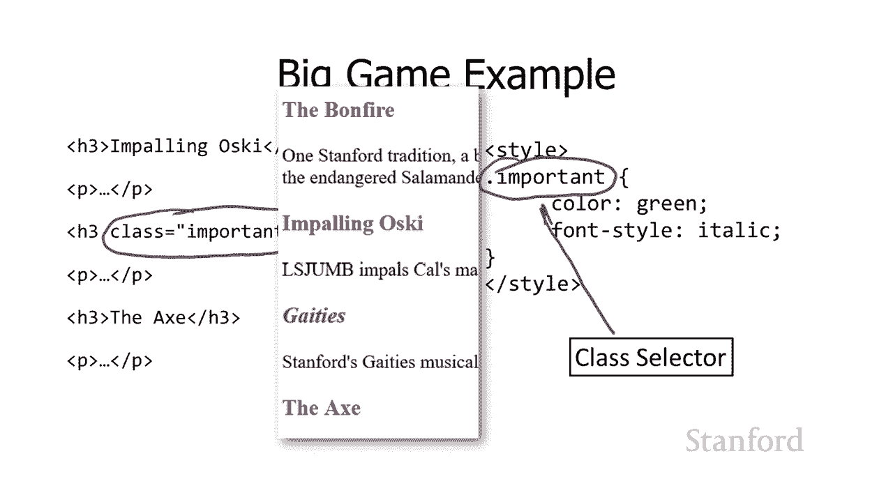

到绿色，它，到绿色，它，现在在课堂上用斜体表示我实际上可以将，现在在课堂上用斜体表示我实际上可以将，它应用于多个，它应用于多个，项目所以让我们说呃，项目所以让我们说呃，如此刺穿 oski 这是由。

如此刺穿 oski 这是由，leland stanford 初级大学，leland stanford 初级大学，军乐队完成的，军乐队完成的，所以假设班上，所以假设班上，有人在乐队中，有人在乐队中。

 他们就像嘿盖茨很棒， 他们就像嘿盖茨很棒，但乐队也很重要，所以，但乐队也很重要，所以，我可以继续将这两个标记为，我可以继续将这两个标记为，经典很重要，经典很重要，undefined。

undefined，事实上我不仅限于 h3s，事实上我不仅限于 h3s，所以，所以，你 知道也许门 p，你 知道也许门 p，undefined，undefined，erson 很好。

我们把推动 oski 放到 uh，erson 很好，我们把推动 oski 放到 uh，classic 中很重要，我不仅，classic 中很重要，我不仅，要让我的标题很重要，要让我的标题很重要。

我还要让我的整个段落，我还要让我的整个段落，都很重要，都很重要，所以我们可以继续这样做，这条，所以我们可以继续这样做，这条，规则适用于，规则适用于。

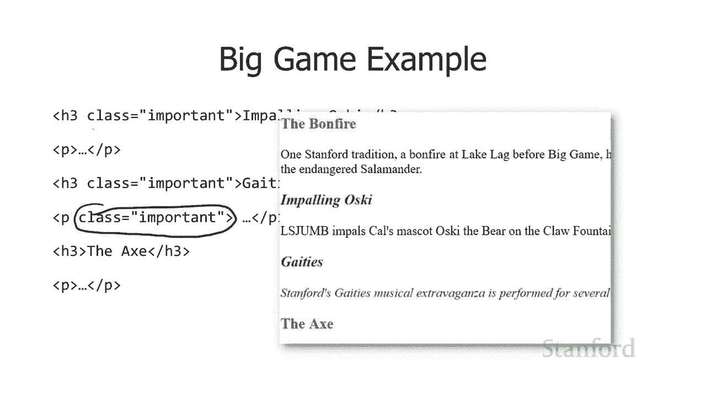

你 知道所有这三个元素，你 知道所有这三个元素，即使一个是段落，即使一个是段落，另外两个是 h3s，另外两个是 h3s，你实际上可以组合不同的，你实际上可以组合不同的，选择器，所以，选择器，所以。

我在这里所做的是我说好的，我在这里所做的是我说好的，这很好，所有重要的元素，这很好，所有重要的元素，都将显示为红色，都将显示为红色，它们将 出现呃字体样式，它们将 出现呃字体样式，斜体，斜体。

但重要的段落，但重要的段落，也会有下划线其他，也会有下划线其他，没有，没有，标记为重要的段落他们不会，标记为重要的段落他们不会，有下划线但是任何，有下划线但是任何。

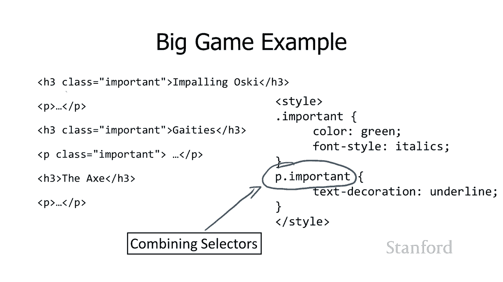

具有类等于重要的段落我希望，具有类等于重要的段落我希望，它有下划线，它有下划线，undefined，undefined，现在还有另一个选择器，我们可以使用，现在还有另一个选择器，我们可以使用，它，它。

与类选择器非常相似，但它，与类选择器非常相似，但它。

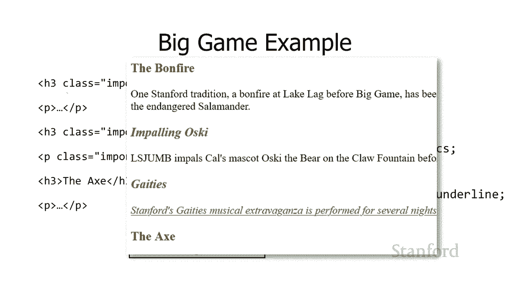

有点不同，有点不同，它的用途略有不同，它的用途略有不同，这就是 id s 选举人，这就是 id s 选举人，所以嗯，假设有人在斧头，所以嗯，假设有人在斧头，委员会，他们就像，委员会，他们就像，嘿，我呢。

他们认为我，嘿，我呢，他们认为我，会想要那些人，会想要那些人，他们的，他们的，课程很重要，任何人都可以上课，课程很重要，任何人都可以上课，很重要 打算，很重要 打算，用一个 id 标记我的等于上级。

用一个 id 标记我的等于上级，呃，这就是 id 选择器的工作方式，呃，这就是 id 选择器的工作方式，它使用数字符号，它使用数字符号。

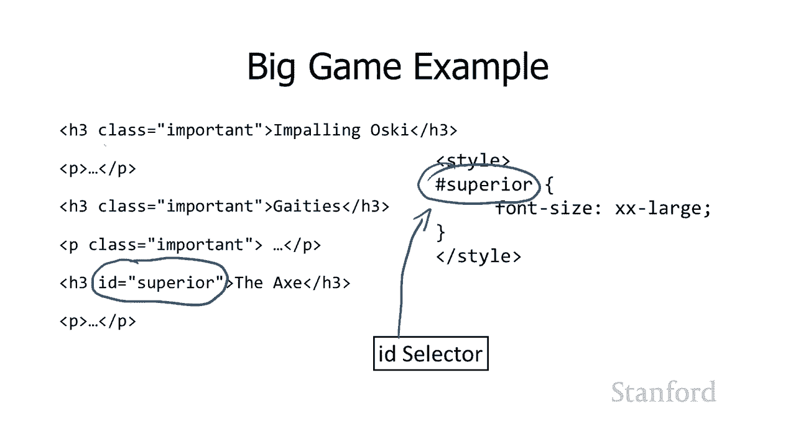

而不是点，而不是点，关于 id 的关键是，关于 id 的关键是，网页上只有一个元素可能，网页上只有一个元素可能，有一个给定的 id，有一个给定的 id，所以你 知道网页上的其他元素。

所以你 知道网页上的其他元素，我们可以在网页上标记任意数量的元素，我们可以在网页上标记任意数量的元素， class equals， class equals，important，undefined。

undefined，网页，网页，上只能有一个元素，id 等于高级，这，上只能有一个元素，id 等于高级，这，确实是它的目的，所以有，确实是它的目的，所以有，几次 当，几次 当，你知道你正在尝试。

你知道你正在尝试，在网页上创建一个元素并且你只想要，在网页上创建一个元素并且你只想要，一个可能的元素在那里并且，undefined，undefined，如果有人，如果有人，创建网页设计并且其他人。

创建网页设计并且其他人，试图维护该网页，试图维护该网页，时它也可用作文档设备 他们 看到他们正在使用 id，时它也可用作文档设备 他们 看到他们正在使用 id，选择器，这告诉他们嘿，选择器。

这告诉他们嘿，我真的只想要这些元素中的一个，我真的只想要这些元素中的一个，作为这个 id 而如果有一个类，作为这个 id 而如果有一个类。

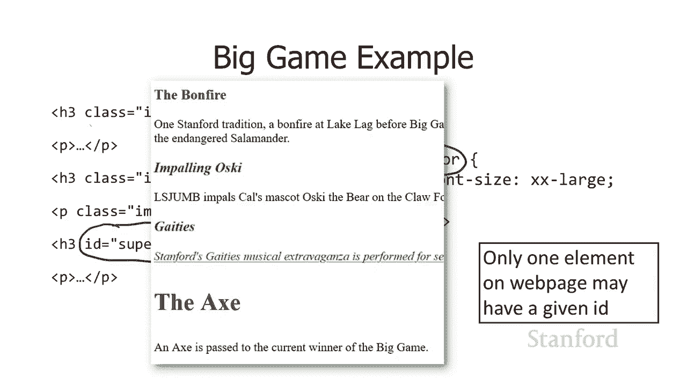

他们可以继续修改，他们可以继续修改，设计并将类添加到一堆，设计并将类添加到一堆，项目，项目，undefined，undefined，这个大型游戏网页的一件事是它在网页上的很多。

这个大型游戏网页的一件事是它在网页上的很多，地方都有 stanford 这个词，这，undefined，undefined，并不奇怪，如果我只想做，并不奇怪，如果我只想做，一些关于，一些关于。

stanford 这个词的样式信息，我能做得，stanford 这个词的样式信息，我能做得，很好，如果这个词，很好，如果这个词，例如，stanford 是斜体的，我想把，例如。

stanford 是斜体的，我想把，stanford 变成红色，我可以继续这样做，我，stanford 变成红色，我可以继续这样做，我，可以说，可以说，嘿，stanford 是斜体的，我，嘿。

stanford 是斜体的，我，要继续添加一个新类，要继续添加一个新类，说 class 等于 stanford，然后我可以，说 class 等于 stanford，然后我可以，写一个，写一个。

对于具有经典 stanford 的事物的规则，对于具有经典 stanford 的事物的规则，我只是说 dot stanford，我只是说 dot stanford，但只有当 stanford 这个词。

但只有当 stanford 这个词，undefined，undefined，位于某种呃标签集内时才有效，位于某种呃标签集内时才有效，例如斜体标签或粗体，例如斜体标签或粗体，标签。

如果我在一个集合中没有 stanford，undefined，undefined，我还能写一个标签吗 类，我还能写一个标签吗 类，实际上答案是，实际上答案是，肯定的，您需要添加一个标签，但是有一个。

肯定的，您需要添加一个标签，但是有一个，特殊的标签，它在生活中的唯一目的，特殊的标签，它在生活中的唯一目的，是，是，允许您在其上放置类或 ID，允许您在其上放置类或 ID，这是 span 标签。

这是 span 标签，所以在这里我添加了 span 在单词 stanford 周围标记，undefined，undefined，如果我没有在上面放一个类或一个 id。

如果我没有在上面放一个类或一个 id，这将毫无用处，它本身就没有任何作用，这将毫无用处，它本身就没有任何作用，span 标签，span 标签，完全没有作用，完全没有作用。

但是因为 stanford 这个词现在有一个，但是因为 stanford 这个词现在有一个，标签，标签，我可以去 提前给它一个 id 我给，我可以去 提前给它一个 id 我给，它一个类，你知道我可以。

它一个类，你知道我可以，在上面放一些其他的东西，在上面放一些其他的东西，好吧，好吧，嗯，实际上有一对这样的，嗯，实际上有一对这样的，有 span 标签，然后有一个，有 span 标签，然后有一个。

div，div，标签，我没有例子 对于，标签，我没有例子 对于，此处的 div 标签，此处的 div 标签，span 标签和 diff 标签之间有什么，span 标签和 diff 标签之间有什么。

请记住在上一课的最后一个视频，请记住在上一课的最后一个视频，中我谈到了，undefined，undefined，文本级别之间的差异，也称为内联标签，文本级别之间的差异，也称为内联标签，这些标签应该。

这些标签应该，将样式放在一个，将样式放在一个，几个词或几个词，甚至可能是几个，几个词或几个词，甚至可能是几个，乐 在一个单词中添加文字，乐 在一个单词中添加文字，然后有块级，然后有块级，标签创建信息块。

标签创建信息块，因此内联或文本级文本将，因此内联或文本级文本将，类似于粗体标签或斜体标签，类似于粗体标签或斜体标签，块级标签将类似于，块级标签将类似于，段落标签，段落标签。

或 h1 h2h3 和其他标题标签或，或 h1 h2h3 和其他标题标签或，就像有一个表格标签一样，就像有一个表格标签一样，它们都在创建，它们都在创建，信息块，我们讨论了，信息块，我们讨论了。

如何不能在块标签周围放置内联标签，但可以在内联标签，如何不能在块标签周围放置内联标签，但可以在内联标签，周围放置一个块，undefined，undefined，结果是跨度是内联标签，所以。

结果是跨度是内联标签，所以，如果 你想完全包围，如果 你想完全包围，一堆块，一堆块，你不能在一堆块周围放置一个跨度，你不能在一堆块周围放置一个跨度，因为在一堆块，因为在一堆块。

标签周围放置内联标签是非法，undefined，undefined，的另一方面 div 是一个块级，的另一方面 div 是一个块级，标签，标签，它可以 包含流，这意味着，它可以 包含流，这意味着。

你可以在一大堆项目周围放置一个 div，undefined，undefined，如果这些项目是块标签，那么，undefined，undefined，除了 div 标签之外，它是完全合法的，它的工作原理。

除了 div 标签之外，它是完全合法的，它的工作原理，与 span 标签基本相同，它，与 span 标签基本相同，它，的主要目的是，的主要目的是，让你 你来风格化，让你 你来风格化。

东西 div 标签也可以，东西 div 标签也可以，用作段落的替代品，所以，用作段落的替代品，所以，可以说它，可以说它，比跨度，比跨度，默认 div 标签更有用一点，它本身会创建一个。

默认 div 标签更有用一点，它本身会创建一个，小块，小块，但与我们看到的段落相反，undefined，undefined，它和其他元素之间的空行 div，它和其他元素之间的空行 div。

undefined，undefined，好吧，正如我提到的，好吧，正如我提到的，你知道我们一直，你知道我们一直，在讨论如何在网页上选择不同的项目，在讨论如何在网页上选择不同的项目，并为它们提供。

并为它们提供。

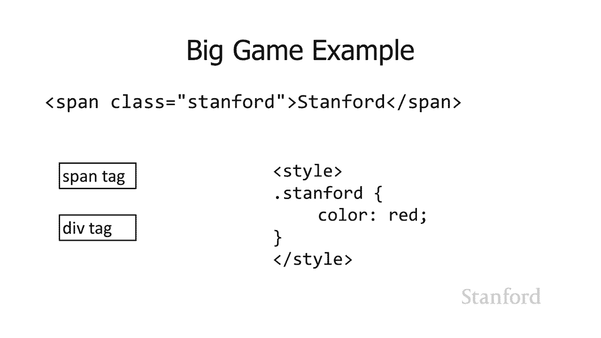

我想要的样式规则 现在要讨论的，我想要的样式规则 现在要讨论的，是那里有什么样的属性，是那里有什么样的属性，我将很快完成这个过程，我将很快完成这个过程，undefined，undefined。

我不会详细介绍，我不会详细介绍，这些属性的来源还有很多，这些属性的来源还有很多，但我只是想给你，undefined，undefined，很好地了解我们可以做什么样的事情，然后。

很好地了解我们可以做什么样的事情，然后，undefined，undefined，再次检查附录 附录 b 讲义，再次检查附录 附录 b 讲义，中有一大堆它们的列表，中有一大堆它们的列表，好的。

所以我可以更改字体属性，好的，所以我可以更改字体属性，因此这些包括诸如，因此这些包括诸如，字体系列之类的东西 就像，字体系列之类的东西 就像，我在使用 ti  mes new roman 我用的是。

我在使用 ti  mes new roman 我用的是，helvetica，helvetica，你知道我用的是什么字体嗯我可以，你知道我用的是什么字体嗯我可以，改变字体样式这将允许。

改变字体样式这将允许，我做斜体，我做斜体，我可以改变字体粗细这是，我可以改变字体粗细这是，哦，哦，伙计他又来了 嗯，伙计他又来了 嗯，有一个臭鼬 早些时候，undefined，undefined。

当我们可以从里面闻到臭鼬的味道时，她，undefined，undefined，undefined，undefined，undefined，绝对，绝对，是疯了 有点高级它允许，是疯了 有点高级它允许。

我们从，我们从，100 到 900 所以像 700 是粗体，100 到 900 所以像 700 是粗体，我认为 400 是普通的 300 是轻，我认为 400 是普通的 300 是轻。

的所以像 900 是超级粗体，的所以像 900 是超级粗体，大多数字体实际上并不支持这个，大多数字体实际上并不支持这个，不一定每个网络浏览器都会，不一定每个网络浏览器都会，支持它但是 呃。

支持它但是 呃，但那个选项是存在的，嗯，作为，但那个选项是存在的，嗯，作为，一个旁注，我正在玩，一个旁注，我正在玩，photoshop，photoshop，试图获得一个标题呃，试图获得一个标题呃。

那些小呃艺术，那些小呃艺术，一个叫做艺术的小画我，一个叫做艺术的小画我，有，有，这些视频中的每一个的标题，这些视频中的每一个的标题，我做到了 遇到一个字体 at 有，我做到了 遇到一个字体 at 有。

各种不同的选项，包括，各种不同的选项，包括，半粗体、粗体、浅色和，半粗体、粗体、浅色和，常规，常规，字体，所以有一些字体，字体，所以有一些字体，绝对支持这个，绝对支持这个，undefined。

undefined，嗯，然后还有文本属性，嗯，然后还有文本属性，嗯，所以如果你，嗯，所以如果你，曾经工作过 在课堂论文上，曾经工作过 在课堂论文上，呃 cs106e 学生，我知道你们中的一些人。

呃 cs106e 学生，我知道你们中的一些人，可能正在使用四个单元，也许在四个单元中使用，可能正在使用四个单元，也许在四个单元中使用，cs106e，可能需要，cs106e，可能需要，undefined。

undefined，写一些论文，不要听这，写一些论文，不要听这，部分讲座，我不想让你，部分讲座，我不想让你，做 这，做 这，没关系，所以对于你们其他人来说，如果，没关系，所以对于你们其他人来说，如果。

你曾经上过课，他们，你曾经上过课，他们，就像嘿，就像嘿，我们需要让你，呃，我们需要让，我们需要让你，呃，我们需要让，你打印，你打印，你需要写一篇四页的文章，然后，你需要写一篇四页的文章，然后，你，你。

开始，你 不完全在那里，开始，你 不完全在那里，你就像哦，我要增加，你就像哦，我要增加，行的大小，行的大小，你可以用文本属性来做，你可以用文本属性来做，你可以增加，你可以增加，行之间的间距。

但实际上你可以，行之间的间距，但实际上你可以，更进一步，更进一步，你可以增加间距，你可以增加间距，只是稍微之间的话，只是稍微之间的话，如果那仍然不是 这样做你，如果那仍然不是 这样做你。

实际上可以增加字母之间的间距，实际上可以增加字母之间的间距，让自己，让自己，多一点空间，多一点空间，它也有文本装饰，它也有文本装饰，允许下划线，实际上，undefined，undefined。

你可以在某物上划一条线，或者你可以，undefined，undefined，在控制垂直对齐的东西上方划一条线， 文本，在控制垂直对齐的东西上方划一条线， 文本，对齐，这是水平对齐，对齐，这是水平对齐。

我应该匹配，我应该匹配，关于，关于，级联样式表的一项有趣的事情，我们，级联样式表的一项有趣的事情，我们，过去没有，过去没有，使用 html 级联样式表，使用 html 级联样式表。

实际上允许我们使用各种，实际上允许我们使用各种，不同的测量类型，因此，不同的测量类型，因此，当您进行测量时，当您进行测量时，通常，您可以输入百分比，通常，您可以输入百分比，但并非总是如此。

但您也可以输入，但并非总是如此，但您也可以输入，以像素为，以像素为，单位的测量值 毫米 嗯英寸，单位的测量值 毫米 嗯英寸，嗯 微微 嗯，嗯 微微 嗯，您可以使用一大堆不同的，您可以使用一大堆不同的。

测量类型，测量类型，所以这很酷，所以这很酷，嗯，颜色和背景属性，因此，嗯，颜色和背景属性，因此，您可以 设置，您可以 设置，前景色的颜色，前景色的颜色，你可以设置背景色嗯，你可以设置背景色嗯，我们将在。

我们将在，讲座中讨论如何实际创建 吃，讲座中讨论如何实际创建 吃，这些颜色 呃 你可以，这些颜色 呃 你可以，在任何元素后面放一个背景图片 你，在任何元素后面放一个背景图片 你，可以在，可以在，整个。

整个，网页正文后面放一个背景图片 也可以，网页正文后面放一个背景图片 也可以，undefined，undefined，在特定元素后面放一个背景图片 还有一堆，在特定元素后面放一个背景图片 还有一堆。

undefined，undefined，其他属性我没有在这里列出，其他属性我没有在这里列出，那种控件，那种控件，这些背景图像如何正常工作，这些背景图像如何正常工作，另一组属性是，另一组属性是，框属性。

这些属性用于，框属性，这些属性用于，在元素周围创建边框，在元素周围创建边框，因此您可以创建边框，因此您可以创建边框，本身 您还可以控制，本身 您还可以控制，元素，元素，和边框之间的间距并控制。

和边框之间的间距并控制，undefined，undefined，边框和边框之间的间距 周围的元素，undefined，undefined，当我向您展示如何，当我向您展示如何，创建图像并将图像放置在您的。

创建图像并将图像放置在您的，网页上时，我们将更详细地讨论这个问题 您还可以，网页上时，我们将更详细地讨论这个问题 您还可以，将元素移动到网页的左侧或，将元素移动到网页的左侧或，右侧，并在，右侧，并在。

旁边放置文本流，旁边放置文本流，页面，页面，的另一侧称为浮动，再次，的另一侧称为浮动，再次，我们将在查看，我们将在查看，图像时详细，图像时详细，了解，了解，这一点 在现有的属性中。

这一点 在现有的属性中，有一些更，有一些更，专业的属性，专业的属性，例如，有一些属性，例如，有一些属性，允许您将元素放置，允许您将元素放置，在网页上的特定点，这些，在网页上的特定点，这些。

属性称为定位属性 嗯 105，属性称为定位属性 嗯 105，名学生将看看这，名学生将看看这，106 名学生我 我将，undefined，undefined。

在 106e canvas 网站上发布额外的 105 个讲座，因此，在 106e canvas 网站上发布额外的 105 个讲座，因此，您知道如果您有兴趣，您也，您知道如果您有兴趣，您也。

可以观看这些讲座，可以观看这些讲座，但它们不会成为标准的，但它们不会成为标准的，uh cs1060 讲座，uh cs1060 讲座。

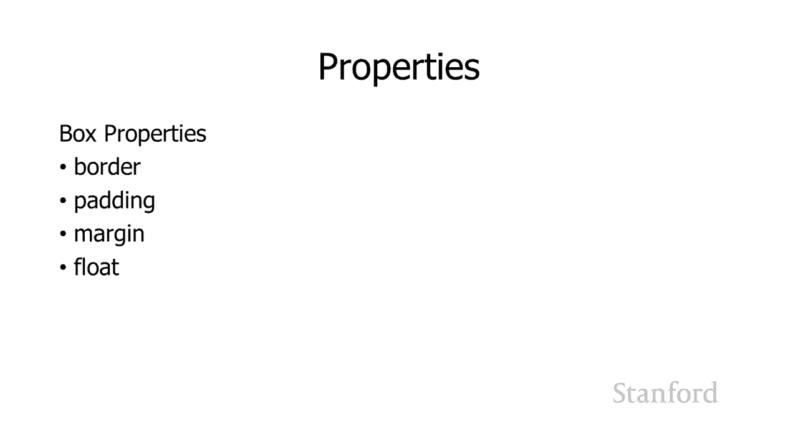

的一部分 开始这，的一部分 开始这，一切，一切，我们将把样式标签，我们将把样式标签，直接放入 html 文件，直接放入 html 文件，现在嗯，我这样做了，因为，现在嗯，我这样做了，因为。

我认为最容易理解，我认为最容易理解，发生了什么，发生了什么，但这并不总是最好的，但这并不总是最好的，方法，嗯，方法，嗯，假设我有 另一个网页，所以，假设我有 另一个网页，所以，我一直在，我一直在。

设计我们的大型游戏网页，我，undefined，undefined，在斯坦福大学毕业时有一个不同的网页，它有自己的，在斯坦福大学毕业时有一个不同的网页，它有自己的，一套传统，一套传统。

在这里你可以看到我有我的大型，在这里你可以看到我有我的大型，游戏，游戏，网页 现在已经风格化了 然后，网页 现在已经风格化了 然后，我有了我的毕业网页，我有了我的毕业网页，现在毕业网页看起来。

现在毕业网页看起来，有点无聊，因为它没有任何样式，有点无聊，因为它没有任何样式，信息，信息，所以假设我想，所以假设我想，从大型游戏网页中获取样式规则并将，从大型游戏网页中获取样式规则并将。

它们粘贴到毕业网页，它们粘贴到毕业网页，中 我做得，中 我做得，很好，根据你现在所知道的，最简单的事情，undefined，undefined，undefined，undefined，标签和，标签和。

样式开始标签和样式和文本之间的所有样式规则，你，样式开始标签和样式和文本之间的所有样式规则，你，复制它并粘贴到，复制它并粘贴到，毕业，毕业，html 文件，这完全可以工作，但，html 文件。

这完全可以工作，但，现在它们不同步，所以如果您，现在它们不同步，所以如果您，要更改，要更改，其中一个样式表，它不会，其中一个样式表，它不会，undefined，undefined，在另一个样式表上更新。

因此这，在另一个样式表上更新，因此这，实际上不是，实际上不是，您真正想要的最佳方法 您需要一个，您真正想要的最佳方法 您需要一个，适用，适用，于您网站上所有 html 文件的单个样式表。

于您网站上所有 html 文件的单个样式表。

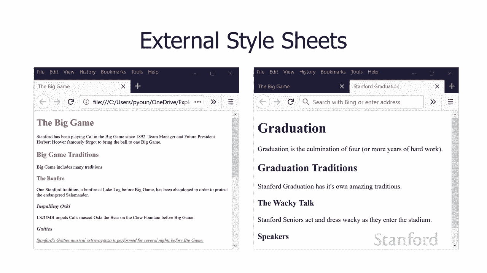

这样我们就可以使用外部样式表来完成此操作，这样我们就可以使用外部样式表来完成此操作，undefined，undefined，因此我们要做的是，因此我们要做的是，将所有样式角色，将所有样式角色。

放在 我们要去的风格标签，放在 我们要去的风格标签，扔掉样式标签本身，所以，扔掉样式标签本身，所以，我看到很多学生复制它，我看到很多学生复制它，他们复制样式标签以及，他们复制样式标签以及。

所有样式规则不这样做，所有样式规则不这样做。

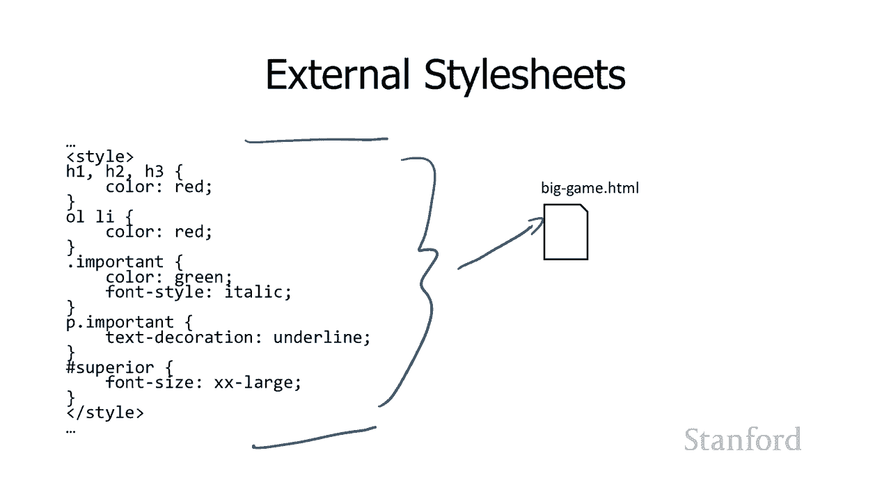

只复制样式规则，我们，只复制样式规则，我们，将放入，将放入，我们将命名为，我们将命名为，example。css 的另一个文件，所以这是一个 css 文件，example。css 的另一个文件。

所以这是一个 css 文件。

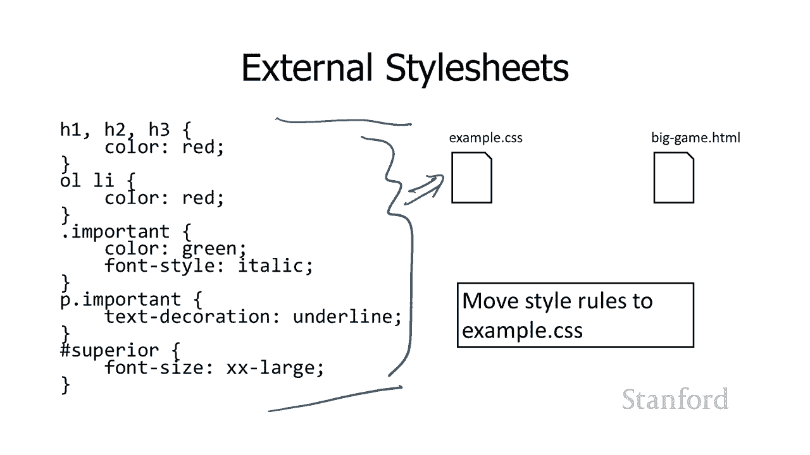

undefined，undefined。

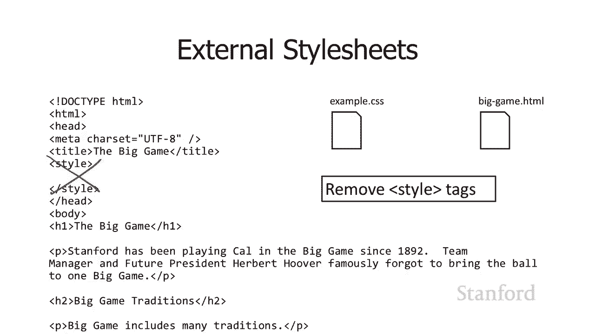

从原始 html 中删除样式标签，从原始 html 中删除样式标签，我将替换，我将替换，它们 带有，它们 带有。

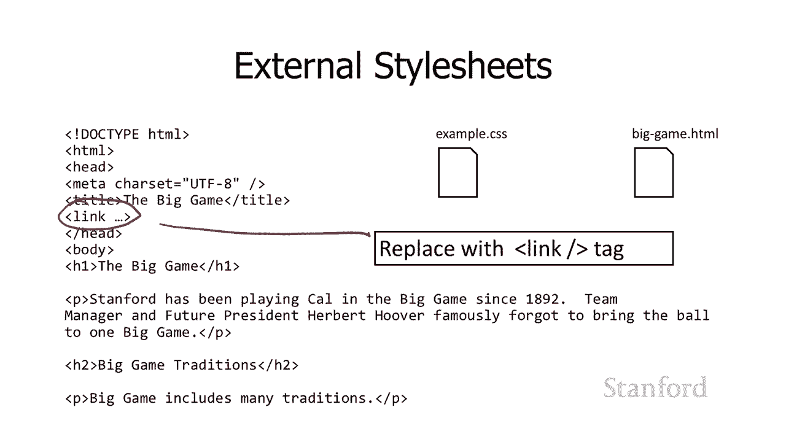

链接标签的链接标签看起来，链接标签的链接标签看起来，像，像，链接关系等于样式表，链接关系等于样式表，然后href，然后href，然后，然后，引用我在，引用我在，这里使用这种关系的样式表有点。

这里使用这种关系的样式表有点，有趣因为这个链接标签，有趣因为这个链接标签，他们有很多理论 关于，他们有很多理论 关于，这个链接标签，这个链接标签，除了样式表之外还可以用于什么。

除了样式表之外还可以用于什么，但据我所知它仍然几乎，但据我所知它仍然几乎，只用于样式表，只用于样式表，它还能用于什么，嗯，它还能用于什么，嗯，所以这是一个例子，所以这是一个例子，所以如果你已经使用。

所以如果你已经使用，过 你有一台 Windows 电脑，你可能，过 你有一台 Windows 电脑，你可能，熟悉这样的想法，熟悉这样的想法，如果你点击，undefined，undefined。

如果您正在运行，如果您正在运行，Web 浏览器，并且按下了 f1 键，Web 浏览器，并且按下了 f1 键，但它不会显示有关当前网站的信息，那么现在实际上会提供有关该应用程序的帮助的 f1 键。

但它不会显示有关当前网站的信息，那么现在实际上会提供有关该应用程序的帮助的 f1 键，所以假设我无法，所以假设我无法，弄清楚该网站的全部内容，弄清楚该网站的全部内容。

我按了 f1 键我得到了什么 我得到了，我按了 f1 键我得到了什么 我得到了，关于 chrome，关于 chrome，或 firefox 的帮助 我没有得到关于。

或 firefox 的帮助 我没有得到关于，网站的帮助 所以这里的想法是，网站的帮助 所以这里的想法是，你说链接关系等于帮助，你说链接关系等于帮助，然后你可以列出一个 html 文件。

然后你可以列出一个 html 文件，来告诉 网络浏览器 如果，来告诉 网络浏览器 如果，有人，有人，就这个网页寻求帮助，你，就这个网页寻求帮助，你，应该告诉他们你应该把他们带到。

应该告诉他们你应该把他们带到，这个特定的网页，这个特定的网页，另一个被提议的网页，另一个被提议的网页，嗯，这些已经在标准中，嗯，这些已经在标准中，尽管他们已经把，尽管他们已经把，它们进进出出 标准是。

它们进进出出 标准是，你知道他们喜欢这是一个好，你知道他们喜欢这是一个好，主意然后没有一个网络浏览器，主意然后没有一个网络浏览器，最终支持它，最终支持它，我真的很喜欢这个，我真的很喜欢这个。

想法有一个与词汇表建立关系的想法，想法有一个与词汇表建立关系的想法，undefined，undefined，所以如果你在一个网站上 有，所以如果你在一个网站上 有，关系 术语表，关系 术语表。

和网络浏览器理解的是什么，和网络浏览器理解的是什么，关系等于术语表的意思，关系等于术语表的意思，并且该网站上有一些词，并且该网站上有一些词，你不理解你选择那个，你不理解你选择那个，词你点击了网络。

词你点击了网络，浏览器，浏览器，理解的某个键，就像哦，我知道，理解的某个键，就像哦，我知道，这是词汇表文件，这是词汇表文件，让我在这个网站的词汇表文件中查找它，让我在这个网站的词汇表文件中查找它。

我可以告诉你，我可以告诉你，这个词实际上意味着什么，这个词实际上意味着什么，他们也有向前和向后的，他们也有向前和向后的，关系，如果，关系，如果，你试图，你试图，浏览网站，但，浏览网站，但。

由于某种原因你 不想，由于某种原因你 不想，点击链接 你只想，点击链接 你只想，在你的网络浏览器上点击某个键，在你的网络浏览器上点击某个键，或者你知道你可能在使用，或者你知道你可能在使用。

手机而你只想浏览，手机而你只想浏览，它，它，所以无论如何他们对什么关系有很多不同的，所以无论如何他们对什么关系有很多不同的，想法 可能意味着，想法 可能意味着，但据我所知，样式表，但据我所知，样式表。

是唯一一个真正广泛，是唯一一个真正广泛，使用的，使用的，样式表，所以这就是为什么你需要在，样式表，所以这就是为什么你需要在，那里建立关系，所以在，那里建立关系，所以在，那里使用链接标签只是一般。

那里使用链接标签只是一般，用途 ose 标签，用途 ose 标签，你需要特别说明这，你需要特别说明这，是我使用的链接技术的特殊用途，是我使用的链接技术的特殊用途，undefined，undefined。

这两个文件相互关联，它们，这两个文件相互关联，它们，之间的关系，之间的关系，undefined，undefined，是另一个文件 example。css，它，是另一个文件 example。css，它。

undefined，undefined，是 html 文件的样式表 链接标签，是 html 文件的样式表 链接标签，显示，显示，正常，所以我可以在两个 big game。htmlgraduate。

html 中使用相同的链接标签，正常，所以我可以在两个 big game。htmlgraduate。html 中使用相同的链接标签，然后，然后，将样式复制，将样式复制，到它们两个，然后如果我。

到它们两个，然后如果我。

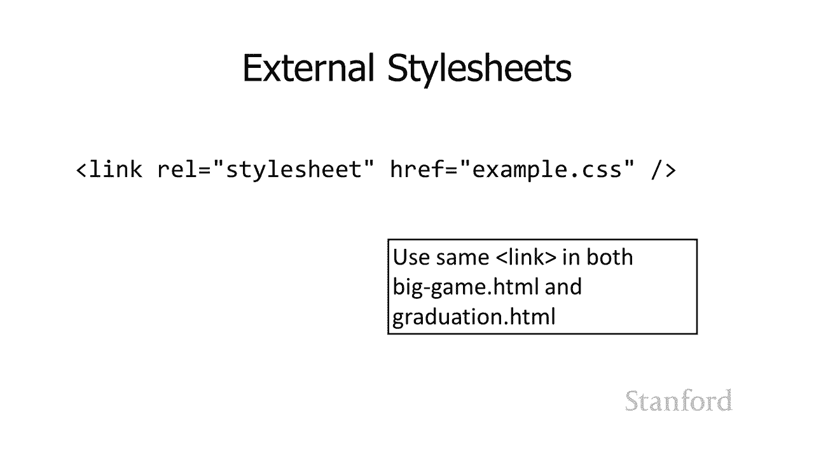

对 example。css 进行进一步更改，对 example。css 进行进一步更改，它将影响 这两个网页中的样式，它将影响 这两个网页中的样式，undefined，undefined，所以一般来说。

所以一般来说，你需要一个外部样式表，你需要一个外部样式表，因为它允许你，因为它允许你，在一个位置进行更改，让它们，在一个位置进行更改，让它们，在，在。

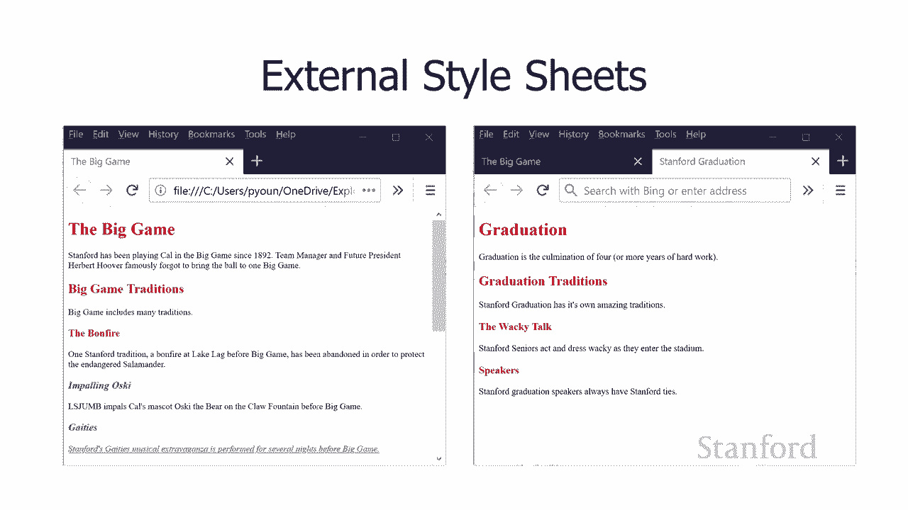

你网站上的所有网页上产生涟漪效果，你网站上的所有网页上产生涟漪效果，好吧，我今天想介绍的最后一件事，好吧，我今天想介绍的最后一件事，或者 至少对于这个视频，或者 至少对于这个视频，是级联，所以你知道。

是级联，所以你知道，这被称为级联样式表，这被称为级联样式表，所以你可能会，所以你可能会，明白为什么它被称为样式表 为什么，明白为什么它被称为样式表 为什么，它被称为级联样式表，它被称为级联样式表。

这个词级联是什么所以这里是，这个词级联是什么所以这里是，关于级联的想法，关于级联的想法，你可以有多个，你可以有多个，相互冲突的规则，所以在这里我，相互冲突的规则，所以在这里我，说，说。

所有的 h3 应该显示为蓝色，所有的 h3 应该显示为蓝色，重要的应该显示为，重要的应该显示为，黄色，黄色，重要的 h3 应该显示，重要的 h3 应该显示，为红色，所以问题是，为红色，所以问题是。

你是否 有一个很重要的 h3，你是否 有一个很重要的 h3，它是否以蓝色，它是否以蓝色，黄色或红色出现并且答案是红色所以，黄色或红色出现并且答案是红色所以，undefined，undefined。

方便的规则，方便的规则，是更具体的元素将，是更具体的元素将，获胜所以，获胜所以，点重要比，点重要比，h3，h3，和 h3 和点重要更具体，和 h3 和点重要更具体，比点重要更具体，比点重要更具体。

所以最具体的规则会获胜，所以最具体的规则会获胜，实际上这些，实际上这些，不同的，不同的，选择器类型中的每一个都有一个点值，选择器类型中的每一个都有一个点值，系统加起来就是点值，所以，系统加起来就是点值。

所以，我实际上不知道点，我实际上不知道点，值是什么我必须 查找它们，以便 h3，值是什么我必须 查找它们，以便 h3，具有此特定的点值，具有此特定的点值，类别，而 dot important 将，类别。

而 dot important 将，具有更高的点值，然后，具有更高的点值，然后，h3 dot important 将，h3 dot important 将，两者相加，从而获得更高的，两者相加。

从而获得更高的，点值，点值，但是然后像 id 选择器之类的东西，但是然后像 id 选择器之类的东西，比类选择器具有更高的点值，比类选择器具有更高的点值，我认为 h3，我认为 h3，点，点。

重要仍然会击败，重要仍然会击败，id 选择器，但这，id 选择器，但这，基本上是级联的工作方式，基本上是级联的工作方式，所以这就是，所以这就是，级联 我们将继续，undefined，undefined。

在我们关于网页的其余讨论中寻求 css 用法，在我们关于网页的其余讨论中寻求 css 用法，所以，所以，你知道如果你想知道，你知道如果你想知道，我还能用这个做什么，我们将，我还能用这个做什么，我们将。

看一些例子，看一些例子，你想 更好地了解它是，你想 更好地了解它是，如何工作的 这如何适合，如何工作的 这如何适合，我何时使用外部样式表还是，我何时使用外部样式表还是，内部样式表，内部样式表。

我们将讨论更多，我们将讨论更多。

undefined。