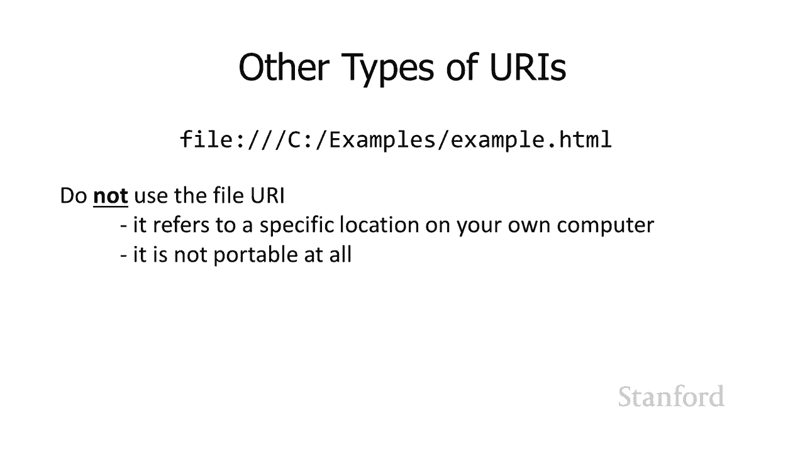

# 【双语字幕+资料下载】斯坦福CS105 ｜ 计算机科学导论(2021最新·完整版) - P28：L8.2- 链接网页：制作链接 - ShowMeAI - BV1eh411W72E

undefined，欢迎探索计算，欢迎探索计算，今天的视频是链接网页，今天的视频是链接网页，第 1 部分 制作链接 所以这将，第 1 部分 制作链接 所以这将，是一系列视频中的第一个。

是一系列视频中的第一个，我们，我们，将在其中了解，将在其中了解，创建，创建，结合 html 和，结合 html 和，级联的网页的不同方面 样式表，级联的网页的不同方面 样式表，当然，当然，使网络真正。

使网络真正，有趣的事情之一是我们可以将一个网页链接，有趣的事情之一是我们可以将一个网页链接，到另一个网页 请记住这，undefined，undefined，是超文本标记和语言的关键部分之一 超。

是超文本标记和语言的关键部分之一 超，文本组件 所以我们要去，文本组件 所以我们要去，继续并开始，继续并开始，现在我们已经讨论了一些，现在我们已经讨论了一些，关于如何在网页之间建立链接的问题。

关于如何在网页之间建立链接的问题，但事实证明，undefined，undefined，严格意义上的 html 方面以及，严格意义上的 html 方面以及，将其与级联结合时，还有很多其他内容 样式。

将其与级联结合时，还有很多其他内容 样式，表，表，所以让我们继续开始吧 所以，所以让我们继续开始吧 所以，这里我有一个图表表示，这里我有一个图表表示，undefined，undefined。

我们有一台电脑，我们有一台电脑，www。stanford。edu 里面有一堆文件，www。stanford。edu 里面有一堆文件，我们将假设这些文件 s，我们将假设这些文件 s，都在同一个文件夹中。

并且，都在同一个文件夹中，并且，它们位于 www。stanford。edu 用于提供网页，它们位于 www。stanford。edu 用于提供网页，的任何内容的顶级目录中，undefined。

undefined，稍后我将，稍后我将，详细讨论它是，详细讨论它是，如何工作的，但是，如何工作的，但是，现在只是呃，现在只是呃，我们正在努力保持简单，所以，我们正在努力保持简单，所以，我们有这两个文件。

我们有这两个文件，它们位于，它们位于，www。stanford。edu 服务器，www。stanford。edu 服务器，将提供文件的主要位置，将提供文件的主要位置，所以我有一台笔记本电脑我 我将。

所以我有一台笔记本电脑我 我将，继续访问，继续访问，我将把 example。html 文件，我将把 example。html 文件，发送给我，发送给我，所以请记住我们在，所以请记住我们在。

这里看到的是如何，这里看到的是如何，在页面之间创建链接，所以我们，在页面之间创建链接，所以我们，要看看，要看看，比方说，呃，我目前正在查看，undefined，undefined。

与我的笔记本电脑上下载的 example。html 文件相关联的网页，undefined，undefined，现在那个网页 example。html，现在那个网页 example。html。

有对另一个网页的引用，有对另一个网页的引用，它有一个引用 到，它有一个引用 到，another。html 网页，another。html 网页，这就是链接的，这就是链接的，样子，我们以前见过这个，样子。

我们以前见过这个，所以你知道 哦，这说哦，我有一个针对 Web 服务器 www。stanford。edu 的，所以你知道 哦，这说哦，我有一个针对 Web 服务器 www。stanford。edu 的。

超文本传输协议请求，undefined，undefined，我想访问文件，我想访问文件，another。html，another。html，然后访问，然后访问。

位于 a 开始和 an 标记之间的另一个网页的文本，位于 a 开始和 an 标记之间的另一个网页的文本，这是将要链接的文本，这是将要链接的文本，我们稍后会，我们稍后会，讨论它的外观以及我们。

讨论它的外观以及我们，undefined，undefined，好吧 结果我们实际上可以，好吧 结果我们实际上可以，缩短它而不是说，缩短它而不是说，www。stanford。edu，www。

stanford。edu，another。html 我们可以说，another。html 我们可以说，another。html，another。html，这就是所谓的，这就是所谓的，相对引用，相对引用。

我们之前拥有完整的，我们之前拥有完整的，东西，包括 Web，东西，包括 Web，服务器和协议 http，这就是，服务器和协议 http，这就是，我们所说的绝对引用，当你，我们所说的绝对引用，当你。

有这个，有这个，选择时 您要从一个网页链接，选择时 您要从一个网页链接，到另一个网页，到另一个网页，您需要决定我是要，undefined，undefined，使用完整的 http 和服务器的绝对引用。

还是，使用完整的 http 和服务器的绝对引用，还是，要使用相对引用，要使用相对引用，因为您只需要文件名，因为您只需要文件名，和 假设 相对，和 假设 相对，引用是，引用是，您所指的那个文件。

您所指的那个文件，因为请记住，这是，因为请记住，这是，对文件 example。html 中的 another。html 的引用，该文件，对文件 example。html 中的 another。

html 的引用，该文件，当前驻留，当前驻留，在服务器上的副本和，在服务器上的副本和，已发送到我的笔记本电脑的副本，已发送到我的笔记本电脑的副本，假设是我指的，假设是我指的，是，是。

与我当前正在查看的 example。html 文件位于同一服务器上的 another。html 文件，undefined，undefined，并且它也在同一文件夹中，并且它也在同一文件夹中，现在可能有。

现在可能有，不同的文件夹，所以如果我是 查看，不同的文件夹，所以如果我是 查看，example。html 并在服务器上它，example。html 并在服务器上它，undefined。

undefined，位于一个目录或文件夹中，该目录或文件夹具有，位于一个目录或文件夹中，该目录或文件夹具有，第二个文件夹或目录，第二个文件夹或目录，文件夹和目录是同义词，文件夹和目录是同义词。

该文件夹的名称是文章，该文件夹的名称是文章，文章，文章，文件夹上有一个名为 another。html 的，文件夹上有一个名为 another。html 的，文件，文件。

然后您可以看到 我可以在这里使用这个相对，然后您可以看到 我可以在这里使用这个相对，参考，所以我可以说文章，参考，所以我可以说文章，斜杠 another。html 所以文章，斜杠 another。

html 所以文章，斜杠后面紧跟斜杠，斜杠后面紧跟斜杠，表明这是一个导演或，表明这是一个导演或，文件夹，文件夹，我应该提到有，我应该提到有，操作 使用，操作 使用，其他分隔符来指示文件夹。

其他分隔符来指示文件夹，的系统，例如 windows 最显着地使用，undefined，undefined，反斜杠 Macintosh 在，反斜杠 Macintosh 在，它们到达 os x 并切换到。

它们到达 os x 并切换到，底层，底层，操作系统之前使用冒号，操作系统之前使用冒号，但不管底层，但不管底层，操作系统，操作系统，是什么 客户端 Web 客户端意味着我的。

是什么 客户端 Web 客户端意味着我的，笔记本电脑或 Web 服务器，笔记本电脑或 Web 服务器，意味着 www。stanford。edu，无论它们中，意味着 www。stanford。edu。

无论它们中，的任何一个的操作系统如何，的任何一个的操作系统如何，当我们谈论 Web 内容时，我们，当我们谈论 Web 内容时，我们，总是会使用，总是会使用，标准斜杠，所以，标准斜杠，所以，嗯。

所以我 我要继续说，嘿，嗯，所以我 我要继续说，嘿，你知道这链接到，你知道这链接到，与我正在查看的当前文件位于同一台服务器上的同一台计算机上的，undefined，undefined，文件，但，文件。

但，它位于，它位于，子目录中，它位于文章，子目录中，它位于文章，子目录中，这，子目录中，这，实际上将 无论我们有相对，实际上将 无论我们有相对，引用还是绝对引用都可以工作，但在这里。

引用还是绝对引用都可以工作，但在这里，我用相对引用来做，我用相对引用来做，所以出现的，所以出现的，一个问题是我，一个问题是我，想使用绝对引用还是，想使用绝对引用还是，相对引用，相对引用，如果我想。

如果我想，链接到另一台 Web 服务器，那么这里是事情，所以在这里我，链接到另一台 Web 服务器，那么这里是事情，所以在这里我，试图链接到，试图链接到，纽约时报，纽约时报，服务器上的一篇文章。

实际上需要，服务器上的一篇文章，实际上需要，使用绝对引用来完成，没有，使用绝对引用来完成，没有，办法从，办法从，一台服务器到另一台服务器就在那里，一台服务器到另一台服务器就在那里，这是一个明显的区别。

这是一个明显的区别，所以我可以用绝对引用做我想做的一切，所以我可以用绝对引用做我想做的一切，为什么我，为什么我，想要很好地使用相对，想要很好地使用相对，引用，结果证明，引用，结果证明。

使用相对引用实际上有很多好处，undefined，undefined，所以其中之一 使用相对引用的好处，undefined，undefined，是它们更便于携带，是它们更便于携带。

所以我的意思是如果我有，所以我的意思是如果我有，一个网站，一个网站，并且，并且，网站上不同网页之间的所有引用都，网站上不同网页之间的所有引用都，使用，使用，相对引用，我可以获取所有这些，相对引用。

我可以获取所有这些，文件和 这些文件夹并将它们移动到，文件和 这些文件夹并将它们移动到，另一台计算机，另一台计算机，所以这里有一个例子说明为什么这，所以这里有一个例子说明为什么这，可能有用，可能有用。

所以前一段时间卡内基梅隆，undefined，undefined，大学实际上所有大学都遇到了经济困难 嗯，大学实际上所有大学都遇到了经济困难 嗯，我认为这是在 2008 年，我认为这是在 2008 年。

股市崩盘时，股市崩盘时，他们最终让所有，他们最终让所有，讲师离开，讲师离开，现在假设同样的事情发生在，现在假设同样的事情发生在，斯坦福，斯坦福，我有一个很棒的网站，我有一个很棒的网站。

它位于斯坦福服务器上，它位于斯坦福服务器上，我有所有这些不同的文件和，我有所有这些不同的文件和，他们都联系在一起，他们都联系在一起，我最终不得不去哈佛，我最终不得不去哈佛，因为，因为，斯坦福没钱了。

如果我在这个网站上有绝对的参考，让我走得很好，undefined，undefined，我把它带到哈佛，我把它带到哈佛，这是，这是，非常标准的做法，大学，非常标准的做法，大学，undefined。

undefined，通常会让你 带着你的材料，通常会让你 带着你的材料，所以我带着我的材料我把，所以我带着我的材料我把，它带到哈佛，它带到哈佛，你知道我是否，你知道我是否，在我的材料中使用绝对引用。

这意味着，在我的材料中使用绝对引用，这意味着，每次我在我的网站上有一个从一个网页到另一个网页的链接时，undefined，undefined，它说，它说，http  web。stanford。edu。

我将，http  web。stanford。edu，我将，不得不去，不得不去，那里擦除斯坦福大学并，那里擦除斯坦福大学并，用哈佛替换它，你知道我，用哈佛替换它，你知道我，会哭出我的眼睛，因为。

会哭出我的眼睛，因为，你知道哈佛很好，但事实并非如此，你知道哈佛很好，但事实并非如此，stanford 等通过使用这些绝对，stanford 等通过使用这些绝对，引用将其从一台服务器移动到另一台服务器。

undefined，undefined，undefined，相比之下，如果，相比之下，如果，undefined，undefined，我每次从一个网页引用到，我每次从一个网页引用到。

另一个网页时都使用相对引用，我已经完全破坏了每一个引用，另一个网页时都使用相对引用，我已经完全破坏了每一个引用，这不是它没有 完整的 url 它，这不是它没有 完整的 url 它，没有 web。

stanford。edu，没有 web。stanford。edu，它只是说嘿还有另一个文件，它只是说嘿还有另一个文件，它在同一个文件夹中，或者它可能在，它在同一个文件夹中，或者它可能在，一个子文件夹中。

一个子文件夹中，但这些链接仍然有效，所以，但这些链接仍然有效，所以，我可以使用我的整个网站，我可以移动，我可以使用我的整个网站，我可以移动，它 到哈佛服务器，它 到哈佛服务器，所有内部链接仍然。

所有内部链接仍然，有效，当然我仍然很伤心，有效，当然我仍然很伤心，但你知道至少我不必，但你知道至少我不必，去删除所有，去删除所有，对斯坦福的引用并替换它们，对斯坦福的引用并替换它们，undefined。

undefined，相对引用的另一个优点，相对引用的另一个优点，是 相对引用更短，是 相对引用更短，从打字的角度来看很好，您，从打字的角度来看很好，您，不必键入，不必键入。

服务器斜杠的 http 冒号斜杠名称，服务器斜杠的 http 冒号斜杠名称，嗯，它也会便宜一点，嗯，它也会便宜一点，而且随着时间的推移，这可能会增加，因为，而且随着时间的推移，这可能会增加，因为。

您提供的 b 更少 正确，您提供的 b 更少 正确，的 http 的额外位，的 http 的额外位，和服务器的名称那些，和服务器的名称那些，不在文件中的，不在文件中的，您的 html 文件只是稍微。

您的 html 文件只是稍微，短，短，了一点他们是您，了一点他们是您，将为您的带宽支付更少的钱，嗯，将为您的带宽支付更少的钱，嗯，你知道 它会稍微快一点，你知道 它会稍微快一点，很好。

这不是一个巨大的胜利，很好，这不是一个巨大的胜利，但它是一场胜利，而且没有成本，但它是一场胜利，而且没有成本，所以一切都好，所以一般来说，所以一切都好，所以一般来说，undefined。

undefined，使用相对引用有很多优势，使用相对引用有很多优势，这是我们，这是我们，使用绝对引用的主要原因 正如我们刚刚，使用绝对引用的主要原因 正如我们刚刚，看到的，如果您尝试链接到另一台。

看到的，如果您尝试链接到另一台，Web 服务器，Web 服务器，就像我从我的斯坦福网站获得了一个链接，就像我从我的斯坦福网站获得了一个链接，到纽约时报，到纽约时报，dot com 网站的链接。

那么我真的没有，dot com 网站的链接，那么我真的没有，任何选择，我无法创建一个，任何选择，我无法创建一个，从一台服务器到另一台，从一台服务器到另一台，相对引用的相对引用只能在一个服务器内工作。

相对引用的相对引用只能在一个服务器内工作，所以，所以，使用绝对引用，那么，使用绝对引用，那么，好吧，你可能会注意到相当多的，好吧，你可能会注意到相当多的，url，它们实际上没有，url，它们实际上没有。

指定文件名，指定文件名，所以 www。stanford。edu 你知道它说，所以 www。stanford。edu 你知道它说，的是 在 www。stanford 服务器上它，的是 在 www。

stanford 服务器上它，没有说 文件是什么，没有说 文件是什么，你知道你可以去 w 这，你知道你可以去 w 这，实际上不是一个，实际上不是一个，真正的 url 所以不要尝试这个五个。

真正的 url 所以不要尝试这个五个，学生中的一个，实际上还有几个，学生中的一个，实际上还有几个，子目录，但，子目录，但，我想我会缩短它以保留，我想我会缩短它以保留，示例 简单，示例 简单，呃 www。

stanford。edu cs105，呃 www。stanford。edu cs105，嗯，它没有指定文件的名称，嗯，它没有指定文件的名称，undefined，undefined。

所以所有的网络服务器都有一个特定的，所以所有的网络服务器都有一个特定的，默认文件，它们将服务于，默认文件，它们将服务于，大多数，大多数，服务器使用文件 index。html 所以。

服务器使用文件 index。html 所以，目录中有一个文件 称为，目录中有一个文件 称为，index。html 并且有人没有，index。html 并且有人没有，指定文件名他们指定了文件夹名称但。

指定文件名他们指定了文件夹名称但，他们没有指定文件，他们没有指定文件，名 index。html 将被提供，名 index。html 将被提供，所以这是您的默认名称，所以这是您的默认名称。

还有一些其他名称用于此，还有一些其他名称用于此，但是 index。html 是最常见的，你，但是 index。html 是最常见的，你，也可以看到它，也可以看到它，是一个 web 服务器。

一些使用 home。html，是一个 web 服务器，一些使用 home。html，或其中一些使用，然后实际上，或其中一些使用，然后实际上，其中一些，其中一些，实际上不使用 html 他们只是使用。

实际上不使用 html 他们只是使用，dot htm，dot htm，你实际上可以为此责怪微软，你实际上可以为此责怪微软，undefined，undefined，回到过去，微软系统上的所有文件。

undefined，undefined，都有 d 被命名，但被称为 8。38 个，都有 d 被命名，但被称为 8。38 个，字母，字母，和点后的三个字母我只是，和点后的三个字母我只是，让我感到非常震惊。

它似乎，让我感到非常震惊，它似乎，非常有限，只有八个，非常有限，只有八个，字符，但这，字符，但这，就是它的方式，但是嘿，一切都，就是它的方式，但是嘿，一切都，很好，很好，比尔盖茨似乎在做一些好事。

比尔盖茨似乎在做一些好事，undefined，undefined，再加上我不能再去的那栋大楼，再加上我不能再去的那栋大楼，是以他的名字命名的，因为他们也，是以他的名字命名的，因为他们也。

为此捐赠了很多钱，为此捐赠了很多钱，但是，但是，嗯，是的，很高兴，嗯，是的，很高兴，为他在，为他在，呃慈善事业上的工作收费，以达到医疗目的，呃慈善事业上的工作收费，以达到医疗目的，干得好。

迪伦·梅琳达 好的，干得好，迪伦·梅琳达 好的，现在我们在这里输入的这个东西，现在我们在这里输入的这个东西，http，http，stanford。edu another。html，stanford。

edu another。html，这就是所谓的 url 或，这就是所谓的 url 或，统一资源定位，统一资源定位，器，结果证明有第二个，器，结果证明有第二个，版本，版本，而不是使用 http，而是使用。

而不是使用 http，而是使用，https 是 http 的安全版本，undefined，undefined，undefined，当我们花一周时间讨论计算机安全性时，我们将更详细地讨论它的全部内容。

undefined，undefined，稍后我们会发现，稍后我们会发现，我们的 url 是统一的 资源定位器，我们的 url 是统一的 资源定位器，实际上是一个更大的标准的子集。

实际上是一个更大的标准的子集，称为，称为，统一资源标识符的 uri，统一资源标识符的 uri，有一大堆 uri，有一大堆 uri，其中一些实际上，其中一些实际上，很方便，可能其中最方便，很方便。

可能其中最方便，的是 mailto，的是 mailto，uri，您可以使用它来创建，uri，您可以使用它来创建，您网页上的一个链接，您网页上的一个链接，有人点击该链接，他们会，有人点击该链接，他们会。

向您，undefined，undefined，undefined，undefined，undefined，发送消息 您，发送消息 您，可以指定其他内容，例如，可以指定其他内容，例如，主题，主题。

您可以抄送某些人 您可以，您可以抄送某些人 您可以，在那里放置一个身体，在那里放置一个身体，我确实想提醒您，在互联网上，我确实想提醒您，在互联网上，放置电子邮件地址时要小心，undefined。

undefined，您会注意到我们，您会注意到我们，和 ri 的意思都不是 cs105 或，和 ri 的意思都不是 cs105 或，cs106e 教学人员，cs106e 教学人员，地址在那里，这。

地址在那里，这，实际上是因为有些程序可以，实际上是因为有些程序可以，在网上冲浪寻找电子邮件地址，在网上冲浪寻找电子邮件地址，并将它们置于无，并将它们置于无，垃圾邮件中，这对我来说太晚了。

我收到了大量垃圾邮件，垃圾邮件中，这对我来说太晚了，我收到了大量垃圾邮件，尽管从那以后 计算机科学，尽管从那以后 计算机科学，系将其移至，系将其移至，google 的 g 套件 google 似乎。

google 的 g 套件 google 似乎，已经处理了大部分问题，他们，已经处理了大部分问题，他们，偶尔，偶尔，也会将学生发送的真实电子邮件，也会将学生发送的真实电子邮件，转储到垃圾邮件文件夹中。

因此这，转储到垃圾邮件文件夹中，因此这，部分不太好，但，部分不太好，但，他们大多摆脱了所有 垃圾邮件，他们大多摆脱了所有 垃圾邮件，我习惯了总是，我习惯了总是，undefined，undefined。

undefined，收到大量垃圾邮件，偶尔我会进入列表，在那里我会收到垃圾邮件，就像，收到大量垃圾邮件，偶尔我会进入列表，在那里我会收到垃圾邮件，就像，每五分钟一样，这，每五分钟一样，这，太可怕了。

所以如果你把你的电子邮件，太可怕了，所以如果你把你的电子邮件，地址放在网页上，这显然，地址放在网页上，这显然，很明显，undefined，undefined，undefined，undefined。

undefined，undefined，undefined，undefined，undefined，电子邮件地址 与公司相关联，电子邮件地址 与公司相关联，你只是要继续，你只是要继续，把它贴在那里。

把它贴在那里，使用这个 mailto uri 你可以让，使用这个 mailto uri 你可以让，undefined，undefined，嗯，还有很多其他类型的，嗯，还有很多其他类型的。

uri 等等 有一个 ftp 它是治疗 ftp，uri 等等 有一个 ftp 它是治疗 ftp，有 facetime 所以你点击一个链接，有 facetime 所以你点击一个链接。

它从 facetime 开始然后你，它从 facetime 开始然后你，点击链接，点击链接，从 sub skype 开始 嗯游戏玩家，从 sub skype 开始 嗯游戏玩家。

甚至有一个启动 Steam，甚至有一个启动 Steam，所以有各种不同的 uris，所以有各种不同的 uris，那里有，那里有，一个 uris 你可能看到的是这个，一个 uris 你可能看到的是这个。

文件uri，事实上，文件uri，事实上，如果你正在将一个文件加载到网络，如果你正在将一个文件加载到网络，浏览器中并且该文件在你当前的，浏览器中并且该文件在你当前的，计算机上，这，计算机上，这。

基本上就是你将看到的，基本上就是你将看到的，文件冒号斜杠斜杠然后是c，文件冒号斜杠斜杠然后是c，冒号 那是，冒号 那是，当前 uh，当前 uh，域主硬盘的 windows，域主硬盘的 windows。

这在您的计算机上工作时可以，这在您的计算机上工作时可以，undefined，undefined，使用但不要使用它嗯，使用但不要使用它嗯，它特定于您计算机上的特定位置，undefined。

undefined，它完全不可移植所以我们，它完全不可移植所以我们，讨论了相对链接如何可，讨论了相对链接如何可，移植，移植，这完全是 不可移植，这完全是 不可移植，它完全，它完全，不可移植的其中一件事。

不可移植的其中一件事，是，当，是，当，您将文件压缩并，您将文件压缩并，提交，提交，给您的家庭作业时，它会导致您出现问题，给您的家庭作业时，它会导致您出现问题，然后ta 将它们解压缩 eir 计算机上的。

然后ta 将它们解压缩 eir 计算机上的，这些文件不再位于这些文件，这些文件不再位于这些文件，中的位置不再与，中的位置不再与，您压缩它们时的位置相同，因此，您压缩它们时的位置相同，因此，这将完全破坏。

这将完全破坏，您的所有内容，您的所有内容，以进行评分，因此您知道，以进行评分，因此您知道，通常不要使用它 坏主意，通常不要使用它 坏主意，这对我们班级来说尤其是个坏主意，这对我们班级来说尤其是个坏主意。

因为你会在评分时失去分数，因为你会在评分时失去分数，undefined，undefined，就是这个视频在下一个，就是这个视频在下一个，视频中我们将看看，视频中我们将看看。

如何设计我们的，如何设计我们的，链接，呃改变颜色和，链接，呃改变颜色和，改变外观。

