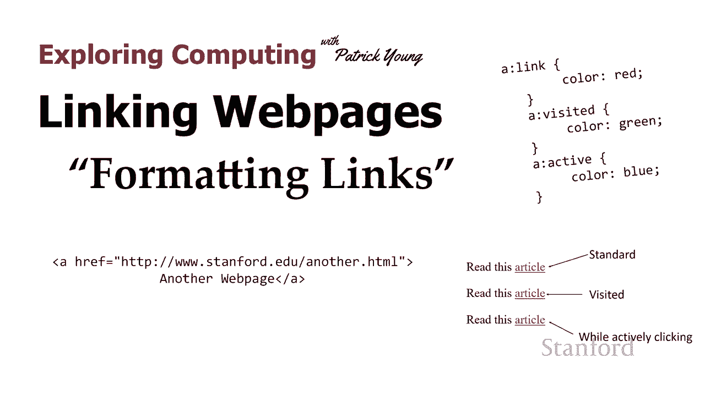
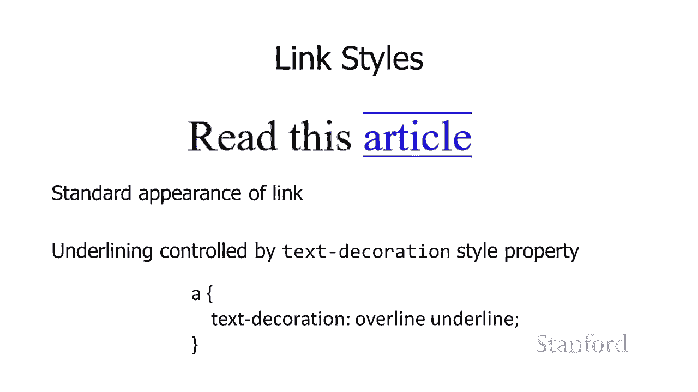
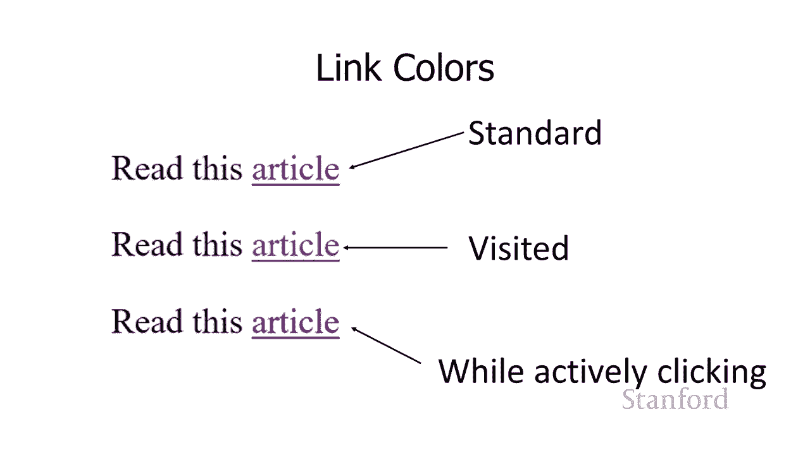
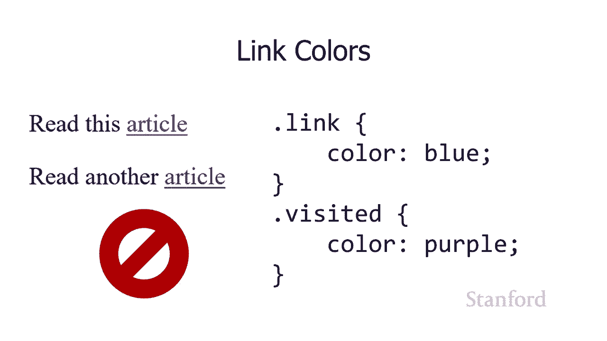
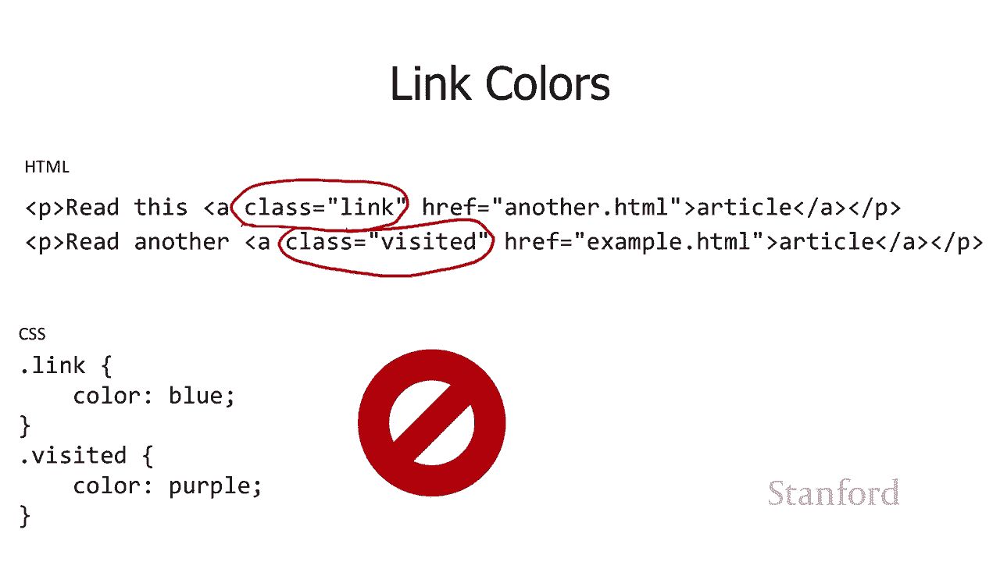
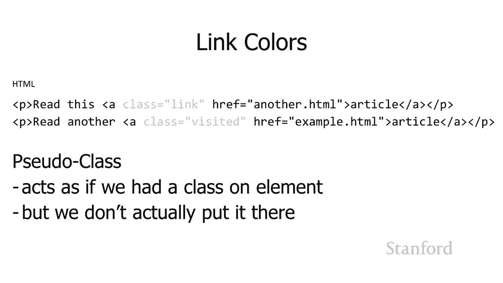
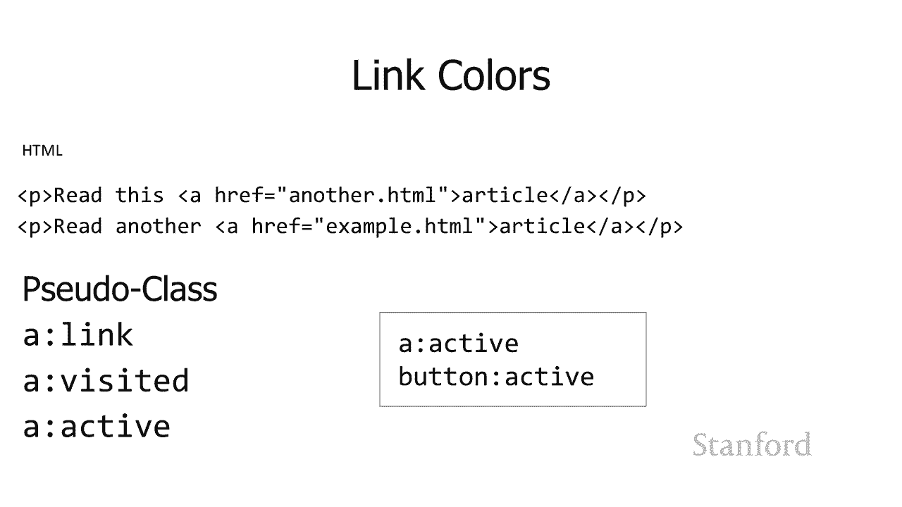
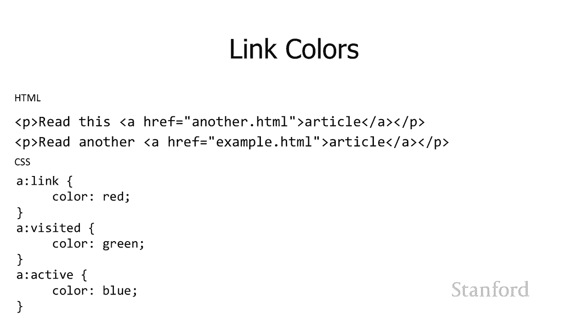
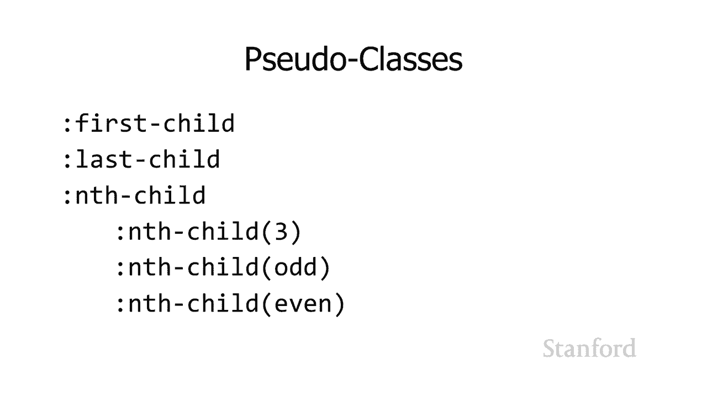

# 【双语字幕+资料下载】斯坦福CS105 ｜ 计算机科学导论(2021最新·完整版) - P29：L8.3- 链接网页：格式化链接 - ShowMeAI - BV1eh411W72E

undefined，欢迎探索，欢迎探索，今天的视频是链接网页的第二，今天的视频是链接网页的第二，部分格式链接，因此在上一个，部分格式链接，因此在上一个，视频中，我们了解了链接，视频中，我们了解了链接。

不同的网页以及在此视频中，不同的网页以及在此视频中，使用链接时的选项，使用链接时的选项，我们将，我们将，看看您如何 可以格式化您的链接，看看您如何 可以格式化您的链接，在此过程中，我们将学习伪。

在此过程中，我们将学习伪。

类，除了链接之外，它还可用于，类，除了链接之外，它还可用于，许多其他格式化目的，undefined，undefined，因此您可能已经看到了一个，因此您可能已经看到了一个，看起来像这样的链接，这。

看起来像这样的链接，这，是 一个带有，是 一个带有，下划线且为蓝色的链接，所以，下划线且为蓝色的链接，所以，让我们首先处理，让我们首先处理，下划线，因此如果您想，下划线，因此如果您想，使用实际。

使用实际，由文本装饰样式属性控制的下划线，由文本装饰样式属性控制的下划线，undefined，undefined，您可以通过将，您可以通过将，文本装饰设置为无来摆脱它，所以在这里 我有。

文本装饰设置为无来摆脱它，所以在这里 我有，一个规则说嘿所有的锚点，一个规则说嘿所有的锚点，记住你知道这些是，记住你知道这些是，由 ahrefs 创建的，所以，由 ahrefs 创建的，所以。

这是一个锚点标签 所有锚点都，这是一个锚点标签 所有锚点都，关闭文本装饰，关闭文本装饰，你应该小心这个 thoug  h，你应该小心这个 thoug  h，因为，因为，人们看到下划线并且他们认为。

人们看到下划线并且他们认为，这是一个链接，这是一个链接，嗯也作为一个旁注 相关的注释，嗯也作为一个旁注 相关的注释，对不是链接的东西加下划线要谨慎，对不是链接的东西加下划线要谨慎，因为人们，因为人们。

习惯于被加下划线的东西被，习惯于被加下划线的东西被，链接所以他们会尝试和 点击，链接所以他们会尝试和 点击，undefined，undefined，喜欢为什么这个东西不起作用这个。

喜欢为什么这个东西不起作用这个，网站已经被破坏，网站已经被破坏，了所以如果你现在决定不，了所以如果你现在决定不，喜欢链接的下划线，那么，喜欢链接的下划线，那么，你就会遇到一个问题，你有。

你就会遇到一个问题，你有，一堆，一堆，你知道是链接的东西 你的，你知道是链接的东西 你的，网页，但像，网页，但像，用户如何知道他们被，用户如何知道他们被，链接所以这里我有一堆，链接所以这里我有一堆。

彩色的，彩色的，单词，这些链接，单词，这些链接，是不是链接，其中哪些是，是不是链接，其中哪些是，链接，真的很难说，所以，链接，真的很难说，所以，160 名学生 我们将，160 名学生 我们将。

在本季度晚些时候讨论这个问题，呃，我们有一个，在本季度晚些时候讨论这个问题，呃，我们有一个，关于，关于，人机交互的讲座，人机交互的讲座，undefined，undefined，有时被称为可供性。

有时被称为可供性，这是一种说明，这是一种说明，您的用户界面应该，您的用户界面应该，向用户明确表示存在，向用户明确表示存在，某种形式的方式 互动的 这可能会发生，某种形式的方式 互动的 这可能会发生。

理想情况下，它应该让您，理想情况下，它应该让您，了解可能会发生什么交互，了解可能会发生什么交互，所以一个常见的例子是嗯，所以一个常见的例子是嗯，你知道我们都曾经有过，你知道我们都曾经有过，那些，那些。

玻璃门，你知道是否有，玻璃门，你知道是否有，推动 很明显，推动 很明显，你应该推动它，你应该推动它，如果有一个把手，你知道它，如果有一个把手，你知道它，很容易抓住，很容易抓住，这通常表明你应该。

这通常表明你应该，拉动它，所以这些被称为可供性，拉动它，所以这些被称为可供性，它们，它们，是人类大脑看到的，是人类大脑看到的，东西 说哦，我知道我应该如何，东西 说哦，我知道我应该如何，与它进行交互。

与它进行交互，通过删除这里的下划线，通过删除这里的下划线，你基本上已经删除了告诉，undefined，undefined，人们哦，这是一个链接我应该，人们哦，这是一个链接我应该，继续点击它的。

继续点击它的，可供性，所以要小心，好吧，你可以，可供性，所以要小心，好吧，你可以，你也知道，如果你想猜出它们，你也知道，如果你想猜出它们，你可以往另一个方向走，就像，你可以往另一个方向走，就像，嘿。

我不想要一个下划线，嘿，我不想要一个下划线，我想给一个下划线加上下划线，所以，我想给一个下划线加上下划线，所以，事实证明，你可以，事实证明，你可以，通过设置文本装饰并，通过设置文本装饰并。

同时加上两个上划线来做到这一点 并，同时加上两个上划线来做到这一点 并，用空格在 uh 下划线，用空格在 uh 下划线，两者之间会产生这种效果，两者之间会产生这种效果。

你在这里看到的，你在这里看到的，链接的另一件事是链接的颜色不同，链接的另一件事是链接的颜色不同，所以，所以，你知道我们已经看到了标准链接，你知道我们已经看到了标准链接，嗯，嗯，它们很无聊，所以你知道。

它们很无聊，所以你知道，不想使用标准喜欢我，不想使用标准喜欢我，认为这完全有道理，但，认为这完全有道理，但，我们以前都看过这些，所以我，我们以前都看过这些，所以我，现在要从这些开始，现在要从这些开始。

我们已经有了这些标准链接，呃，我们已经有了这些标准链接，呃，你知道你是否玩过，你知道你是否玩过，在网上闲逛一段时间后，您可能会，在网上闲逛一段时间后，您可能会，意识到第一，意识到第一。

篇文章是指向另一个网页的链接，篇文章是指向另一个网页的链接，而第二篇文章，而第二篇文章，是指向另一个网页的链接，但我，是指向另一个网页的链接，但我，已经访问过那个网页，已经访问过那个网页，嗯。

结果证明有一个，undefined，undefined，undefined，undefined，我不知道有多少人真正，我不知道有多少人真正，意识到这一点，呃，我不认为我做到了，意识到这一点，呃。

我不认为我做到了，直到我，直到我，开始玩这些你，开始玩这些你，知道后端学习如何，知道后端学习如何，实际制作网页，但，实际制作网页，但，还有第三种 你，还有第三种 你，实际cl的颜色，实际cl的颜色。

当您当前，当您当前，像鼠标一样按下该链接时，请点击该链接，并且，像鼠标一样按下该链接时，请点击该链接，并且，我假设手指会发生同样的事情，我假设手指会发生同样的事情，我还没有真正用手指注意到它。

我还没有真正用手指注意到它，但是，但是，如果您在释放鼠标之前主动按下，undefined，undefined，并且大概 在你抬起你的手指之前，并且大概 在你抬起你的手指之前，它实际上变成了第三种。

它实际上变成了第三种，颜色，颜色，所以有一个标准颜色，一个，所以有一个标准颜色，一个，访问过的颜色，然后有一个，访问过的颜色，然后有一个。

颜色，同时主动点击，颜色，同时主动点击，undefined，undefined，嗯，所以，嗯，所以，这有问题，这有问题，问题是我们将如何做，问题是我们将如何做，这，这，我们将如何创建这些颜色。

我们将如何创建这些颜色，所以你可以想象的一件事是，所以你可以想象的一件事是，你知道我可以，你知道我可以，为我没有访问过的链接设置一个类，在我，为我没有访问过的链接设置一个类，在我。

访问过的链接的第二个类中，访问过的链接的第二个类中。

，所以点链接，所以点链接，嘿颜色的蓝，嘿颜色的蓝，点 访问它，颜色是紫色，点 访问它，颜色是紫色，但问题是这里的，但问题是这里的，html，因为，html，因为，我有两个链接，我的一个，我有两个链接。

我的一个，标记是类等于链接，我的一个，标记是类等于链接，我的一个，标记是类等于访问，标记是类等于访问，但事实是有人哈 s 访问的，但事实是有人哈 s 访问的，页面，页面，实际上因人而异，实际上因人而异。

所以除非我根据他们是否访问过链接，所以除非我根据他们是否访问过链接，向不同的人提供不同版本的 html 文件，undefined，undefined，undefined，这不起作用我不能。

undefined，undefined，让某些人访问类等于 之前访问过，让某些人访问类等于 之前访问过，该页面，该页面，而其他人没有访问过该页面，而其他人没有访问过该页面，undefined。

undefined，我只能提供单个版本的，我只能提供单个版本的，html 文件，html 文件，因此无法区分，因此无法区分，个人是否访问过，个人是否访问过，该页面，该页面，因此这似乎是一个。

因此这似乎是一个，问题，问题，我的意思是，如果我，我的意思是，如果我，能做到这一点，那就太好了，所以实际上结果，能做到这一点，那就太好了，所以实际上结果，undefined，undefined。

证明解决方案基本上看起来像，证明解决方案基本上看起来像，这样，但它有点不同，这样，但它有点不同，undefined，undefined，因为计算机会自动添加，因为计算机会自动添加，这种它所指的伪。

这种它所指的伪，类，所以 它，类，所以 它，就像在这些锚元素上有一个类，就像在这些锚元素上有一个类，undefined，undefined，链接或访问它，链接或访问它，取决于该人是否访问过该网页。

undefined，undefined，但它是由网络浏览器在内部添加的，但它是由网络浏览器在内部添加的，所以我就，所以我就，在我提供服务时提供服务，当我的网络服务器，在我提供服务时提供服务。

当我的网络服务器，将 html 文件复制给它，将 html 文件复制给它，没有标记它是否已访问，没有标记它是否已访问，或常规链接的人时，因为它不知道，或常规链接的人时，因为它不知道，然后，然后。

当人们获取该文件时，他们的网络，当人们获取该文件时，他们的网络，浏览器 有点像哦，浏览器 有点像哦，我看到这是一个链接，我看到这是一个链接，呃，你实际访问过的链接，所以，呃，你实际访问过的链接，所以。

它会适合这个，它会适合这个，访问过的伪类我会假装，访问过的伪类我会假装，它好像有一个类等于，它好像有一个类等于，访问过它，即使，访问过它，即使，它不是 实际上，在原始 html，它不是 实际上。

在原始 html，源代码中，源代码中，您还没有访问过这个源，所以我只是，您还没有访问过这个源，所以我只是，假设我将表现得好像这，假设我将表现得好像这，是类，是类，等于链接而不是类等于。

等于链接而不是类等于，访问了它，访问了它，即使这些，即使这些，实际上都不是 现在就好像上面有一个，实际上都不是 现在就好像上面有一个，类，类，但该类实际上并不在元素上，但该类实际上并不在元素上，它是。

它是。

Web 浏览器自行动态处理的东西，undefined，undefined，我们将区分，我们将区分，真实类和伪类，真实类和伪类，因为伪类是 即将 ，因为伪类是 即将 ，在它们前面有冒号而不是。

在它们前面有冒号而不是，我们的样式表中的点，所以在这里我有，我们的样式表中的点，所以在这里我有，三个伪类调用链接，三个伪类调用链接，调用并访问它并调用非活动所以，调用并访问它并调用非活动所以，冒号。

冒号，链接将成为伪类，链接将成为伪类，当我在我的网站上有链接时 页面，当我在我的网站上有链接时 页面，并且用户在调用之前没有访问过该链接，并且用户在调用之前没有访问过该链接，undefined。

undefined，并访问它，undefined，undefined，如果那里有一个链接，如果那里有一个链接，并且用户实际访问了它，那么这将是与 a 标签关联的伪类，然后，并且用户实际访问了它。

那么这将是与 a 标签关联的伪类，然后，冒号激活，冒号激活，这将成为关联的伪类，这将成为关联的伪类，带有 a 标签，当有人，带有 a 标签，当有人，实际，实际，主动点击它时，当您，主动点击它时，当您。

实际为样式表写下这些标签时，实际为样式表写下这些标签时，您实际上想将 a，您实际上想将 a，放在我们前面，因此冒号链接冒号，放在我们前面，因此冒号链接冒号，访问了 con 活动，因此我们将事实结合起来。

undefined，undefined，嘿，我希望这适用于锚标签，嘿，我希望这适用于锚标签，我，我，不想只适用于任何，不想只适用于任何，锚标签，undefined，undefined。

undefined，undefined，活动伪类 col 在 active 上，活动伪类 col 在 active 上，为什么我们需要将 acorn 放在那里，为什么我们需要将 acorn 放在那里。

结果发现有一堆伪，结果发现有一堆伪，类，其中一些实际上适用，类，其中一些实际上适用，于不同的元素，所以，于不同的元素，所以，仅使用我们在此处提供的示例，仅使用我们在此处提供的示例。

acorn active，acorn active，即有人单击时的颜色，即有人单击时的颜色，链接，链接，还有一个按钮冒号处于活动状态，还有一个按钮冒号处于活动状态，有人单击按钮，并且您，有人单击按钮。

并且您，希望按钮更改颜色，希望按钮更改颜色，如果我们只是说冒号处于活动状态，如果我们只是说冒号处于活动状态，那么 Web 浏览器将，那么 Web 浏览器将，不清楚这是否适用于链接颜色。

不清楚这是否适用于链接颜色，或按钮颜色或 两者，我，或按钮颜色或 两者，我，认为它实际上只是将它用于，认为它实际上只是将它用于，两者，但这，两者，但这。

可能不是你想要的，所以，可能不是你想要的，所以，肯定把 a 列放在前面，肯定把 a 列放在前面，所以这里的例子再次我，所以这里的例子再次我，改变了颜色，因为谁想，改变了颜色，因为谁想。

使用标准的蓝色和紫色，使用标准的蓝色和紫色，嗯，所以我们可以看到，所以我有我的链接，嗯，所以我们可以看到，所以我有我的链接，你可以说，你可以说，我是说如果我有一个链接，我是说如果我有一个链接。

正常链接应该显示为红色，正常链接应该显示为红色，访问链接应该显示为，访问链接应该显示为。

绿色，活动链接应该显示，绿色，活动链接应该显示，为蓝色，为蓝色，有 一堆ot 她的伪，有 一堆ot 她的伪，类实际上有很多，类实际上有很多，这里，这里，有一些更高级的更方便的它说。

有一些更高级的更方便的它说，最后一个孩子有第一个孩子，最后一个孩子有第一个孩子，所以假设你有一个项目列表，所以假设你有一个项目列表，并且你想，并且你想，对列表中的第一次做一些不同的事情，就像。

对列表中的第一次做一些不同的事情，就像，也许 你希望，也许 你希望，列表中的第一个项目在它前面有，列表中的第一个项目在它前面有，一点额外的边距，一点额外的边距，或者你知道也许，或者你知道也许。

你想要的最后一个孩子 呃把它放在，你想要的最后一个孩子 呃把它放在，最后一个项目下面，最后一个项目下面，所以这些都是，所以这些都是，你要去的 能够在您的元素上使用这些。

你要去的 能够在您的元素上使用这些，嗯，所以您将，嗯，所以您将，能够在样式表中使用这些，能够在样式表中使用这些，来选择特定元素，并且，来选择特定元素，并且，有第 n 个，有第 n 个，孩子，嗯。

所以蚂蚁孩子 3 说，孩子，嗯，所以蚂蚁孩子 3 说，嘿，这是一个样式规则，但我只想要，嘿，这是一个样式规则，但我只想要，它，它，适用于这个元素列表的第三个元素，适用于这个元素列表的第三个元素。

或者假设你，或者假设你，试图在一张桌子上做斑马条纹，试图在一张桌子上做斑马条纹，你有，你有，某种表格，其他每一行，某种表格，其他每一行，都是，都是，不同的颜色，所以你有 就像，不同的颜色。

所以你有 就像，一堆深灰色的线条和一堆，一堆深灰色的线条和一堆，浅灰色线条，浅灰色线条，它看起来更好，它看起来更好，一点 人们更容易知道，一点 人们更容易知道，桌子上发生了什么，桌子上发生了什么。

你可以使用第 n 个孩子奇数来做到这一点，你可以使用第 n 个孩子奇数来做到这一点，并添加到孩子偶数，所以这将，并添加到孩子偶数，所以这将，是你说嘿每一个的规则，是你说嘿每一个的规则。

此表中的奇数元素 我，此表中的奇数元素 我，想使用此特定样式，想使用此特定样式，和此表中的每个偶数元素 我，和此表中的每个偶数元素 我，将使用此其他样式，将使用此其他样式，所以这些是伪类 所以这就是。

所以这些是伪类 所以这就是，我们对链接的讨论，我们对链接的讨论，我们已经学到了更多关于，我们已经学到了更多关于，来自 html 方面的链接，来自 html 方面的链接，我们还学习了一些关于样式化。

我们还学习了一些关于样式化，它们的知识，它们的知识，这种伪类的想法可以，这种伪类的想法可以，在其他很多地方派上用场，在其他很多地方派上用场，undefined。

