# 【双语字幕+资料下载】斯坦福CS105 ｜ 计算机科学导论(2021最新·完整版) - P2：L1.1- 比特、字节与二进制：0和1的世界 - ShowMeAI - BV1eh411W72E

Welcome to exploring Computing。Today's video is bit， Bte and binary， part one。

 or it's all about zero and1。

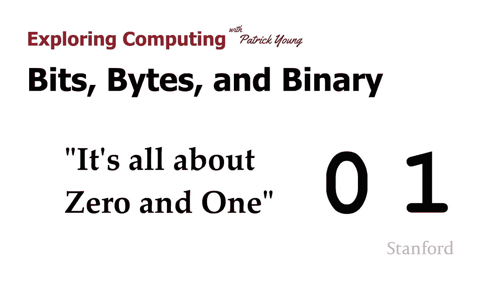

Computers use the binary number system。So let's take a look at what binary numbers look like We'll begin by comparing decimal numbers。

 which are the numbers we're used to to binary numbers Decimal numbers are based on the decimal number system。

 which is the number system that you are used to in the decimal number system there are 10 different digits。

0 through 9 all the numbers that you're used to seeing contain these 10 different digits。

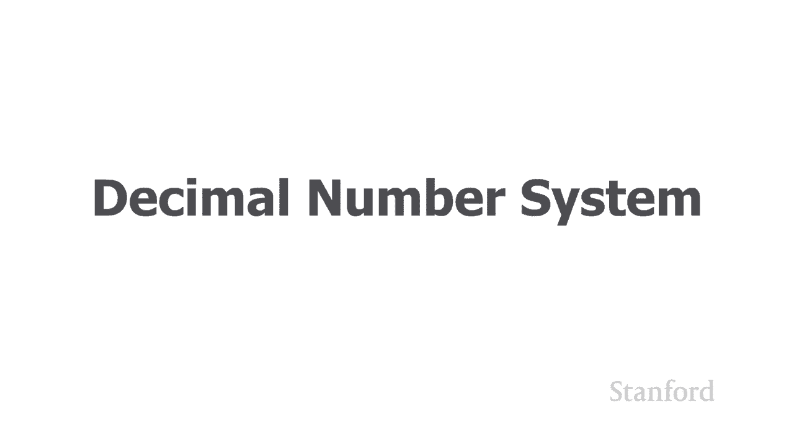

We also sometimes refer to this number system as base 10。

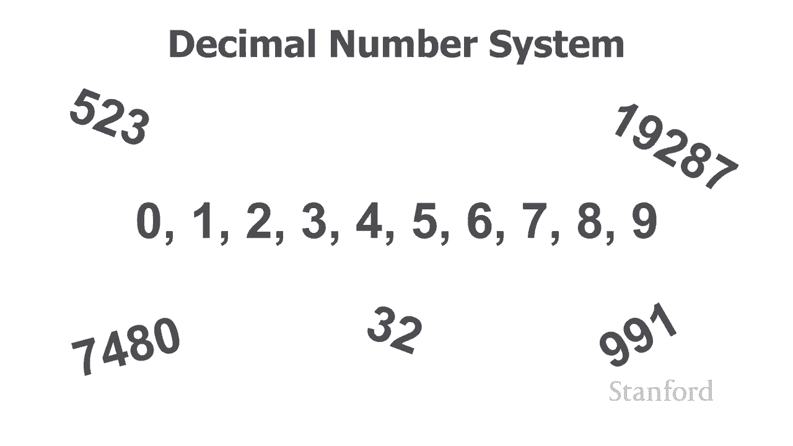

In contrast， the computer uses a binary number system in the binary number system。

 there are only two digits，0 and1 here are some examples of the different types of numbers that you can make with the binary number system。

We'll take a look at another video on exactly how these work and what they might mean， but for now。

 just realized that all numbers in the binary number system consists of only two digits0 and1 and because of this because they' are only two digits we sometimes refer to numbers using this number system as being base2 What I want to look at next is why computers use the binary number system If we were to open up the computer and look at computer memory。

 what we would discover is that computer memory actually consists of a whole bunch of different individual electronic switches we can think of these electronic switches as being not that different than your light switch and just as a light switch on the wall can either be on or off our switches inside the computer can be on or off when the switches off。

 we think of that as representing the number zero and when the switches on we think of that as representing a one so each of our switches corresponds to single digit and since these digits can only be zero or one。

 their binary digits and we shorten binary digit2。

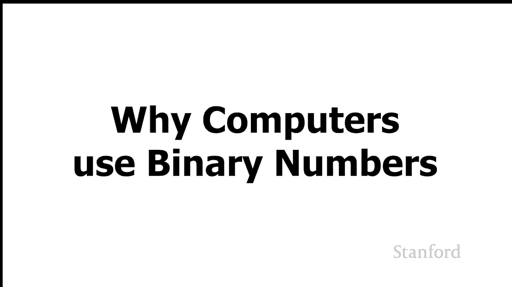

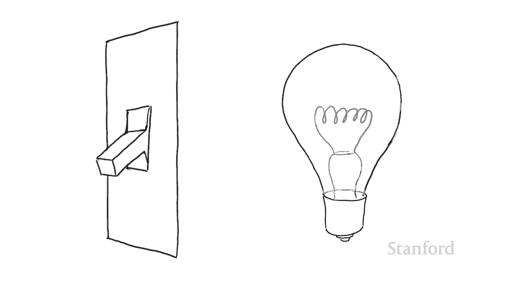

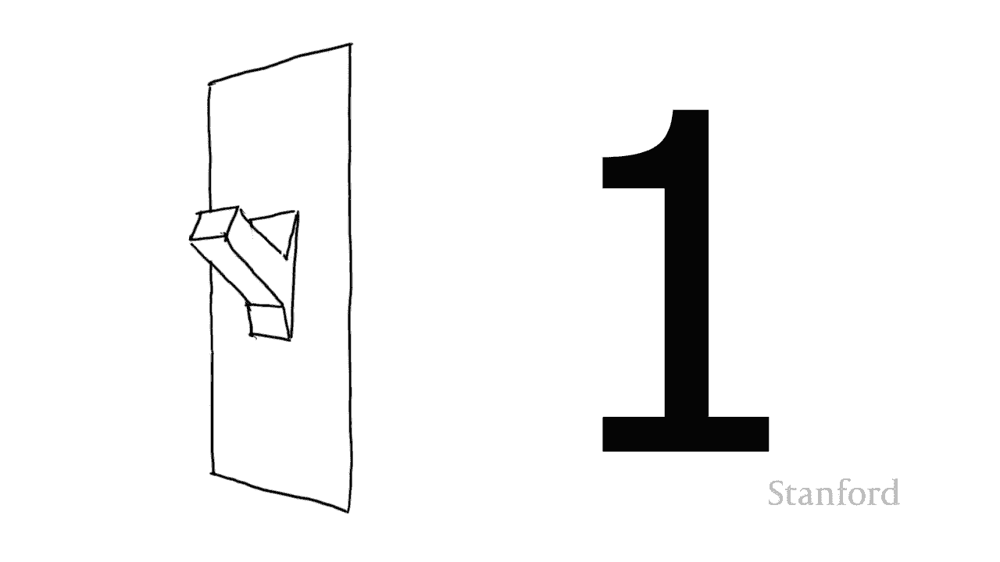

BitSo when you hear somebody talking about a bit， what they're talking about is a0 or1 or the memory inside the computer。

 which is being used to store that0 or1。 Now， we can't really do a whole lot with a single bit。

 So we combine the bits together into groups and the main grouping for bits， is a set of 8 bits。

 which is referred to as a byte。 The byte is a primary measure of computer storage。

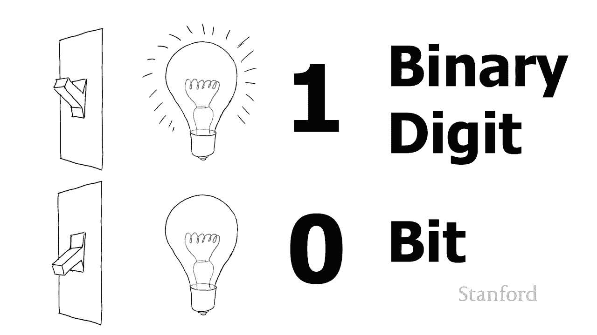

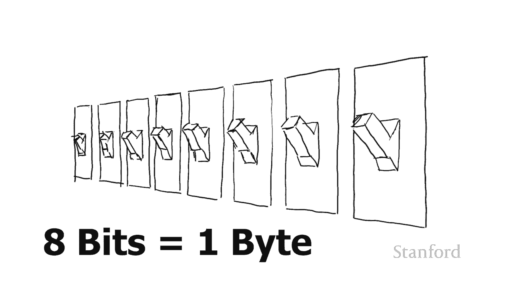

While I've been describing what happens inside the main computer memory。

 all computer data is ultimately stored as bits and bytes。

 So there are a variety of different mediums that we use to store digital information。

And in each case， that digital media needs to be set up to store zeros and ones or bits and bytes。

So an SSD drive， which is what's inside most of your laptops， stores， information。

 basically using electronic which is very similar to the ones we've described here。

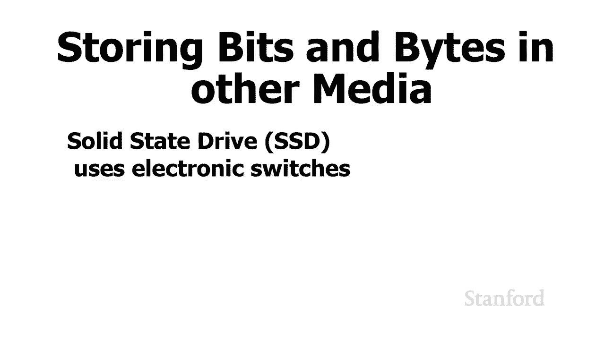

However， if you've got a hard disk。If you open up the hard disk。

 what you're going to discover is that there are individual sections on the disk itself that are magneticly polarized and depending on the polarity。

 if the polarity is in one direction， it will be considered a0。

 if the polarities in the opposite direction will be considered a one。

 If we take a close look at a C， a DVD or blue rate。

 what we're going to is that the disk consists of a number of different sections which are either what referred to as pits or lands。

 depending upon whether there's a pit in that section of the disk or a land in the section of the disk。

 ultimately what we representing with these pits and lands as zeros and ones。 So again。

 ultimately all information used by the computer is going to be storing these zeros and ones or these bits and they'll be organized into groups of eight called bytes。

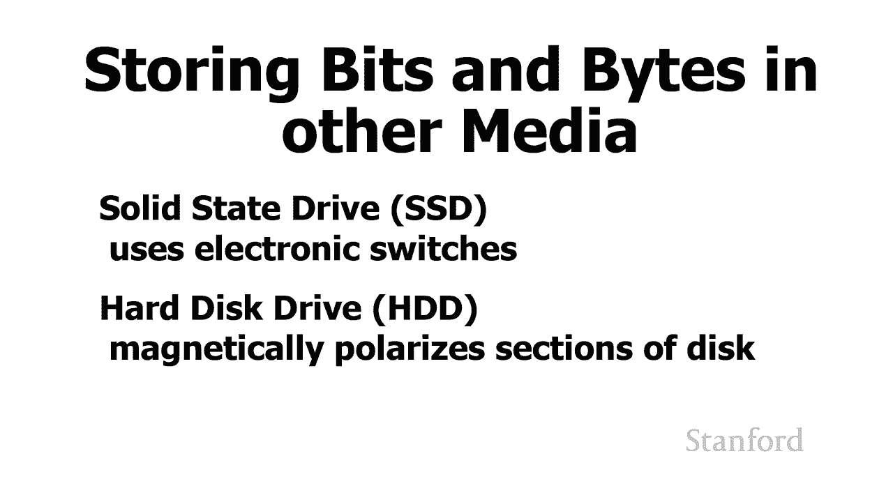

While our first video has been rather short， the other videos in this lecture are much longer in the next video。

 we're going to take a look at how binary numbers actually work。

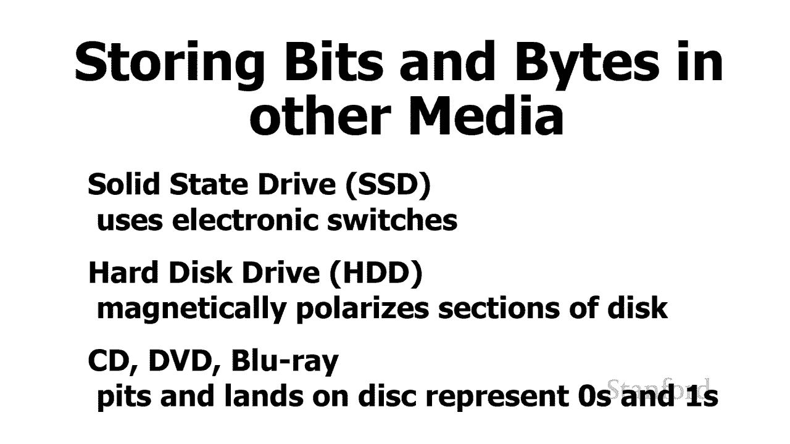

