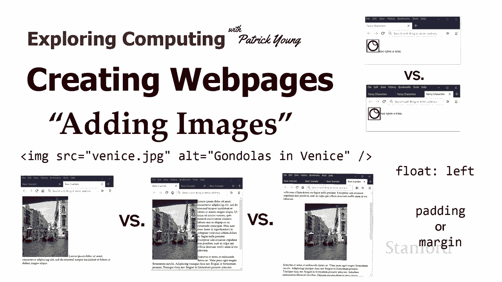
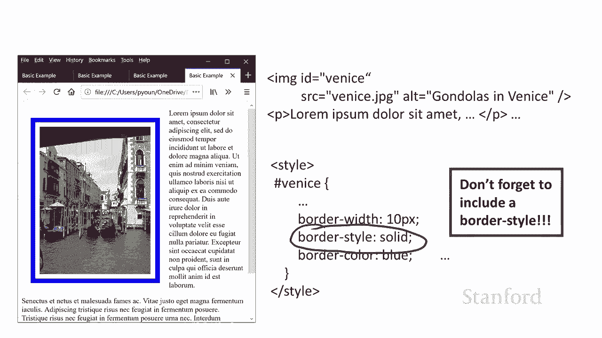
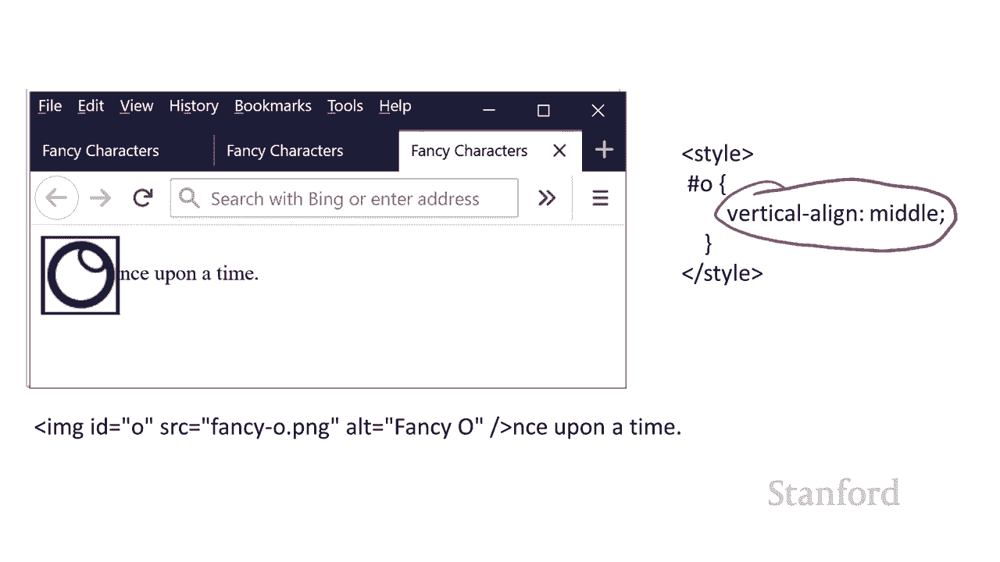

# 【双语字幕+资料下载】斯坦福CS105 ｜ 计算机科学导论(2021最新·完整版) - P30：L9.1- 创建网页：图像 - ShowMeAI - BV1eh411W72E

undefined，欢迎探索计算，欢迎探索计算，今天的视频是创建网页，今天的视频是创建网页，添加图像 所以这将，添加图像 所以这将，是一个连续系列的一部分，我们，是一个连续系列的一部分，我们。

将看看如何，将看看如何，向我们的网页添加不同的元素，向我们的网页添加不同的元素，之前我们看到了如何，之前我们看到了如何，在我们的网页和，在我们的网页和，这当然很重要，因为正如，这当然很重要，因为正如。

我们所讨论的，真正，我们所讨论的，真正，使网络成为网络的是超文本，使网络成为网络的是超文本，所以，所以，如果你看过那些视频，你现在就，如果你看过那些视频，你现在就，知道如何做到这一点，但。

知道如何做到这一点，但，虽然这些链接很棒，但如果我们所有，虽然这些链接很棒，但如果我们所有，的网页 将它们作为，的网页 将它们作为，文本添加会很无聊 所以在，文本添加会很无聊 所以在，这个，这个。

视频中我们将讨论如何，视频中我们将讨论如何，将图像添加到我们的网页，将图像添加到我们的网页，事实证明这里有相当多，事实证明这里有相当多，的选项和一些细微之，的选项和一些细微之，处可能并不明显。

处可能并不明显。

所以 我们将经历，所以 我们将经历，不同的选择，以及如何将，不同的选择，以及如何将，所有东西组合在一起，所有东西组合在一起，我将从威尼斯的这张照片开始，我将从威尼斯的这张照片开始，你，你。

从第一周开始就看到了，从第一周开始就看到了，这主要是我们的，这主要是我们的，前任 充足的图片，虽然，前任 充足的图片，虽然，我们会一路看到几张图片，我们会一路看到几张图片，所以这里是您，所以这里是您。

将图片添加到网页的方法，将图片添加到网页的方法，有一个 img 标签，请注意，有一个 img 标签，请注意，img 标签末尾的斜杠，img 标签末尾的斜杠，表示这是 一个独立的标签。

表示这是 一个独立的标签，没有开始和结束标签，没有开始和结束标签，有一个 src 属性或源，有一个 src 属性或源，属性，属性，这是一个 url，它可以是，这是一个 url，它可以是。

一个相对或绝对引用，undefined，undefined，undefined，undefined，这个 venis。jpg 图像文件与引用它，这个 venis。jpg 图像文件与引用它。

的 html 文件，的 html 文件，位于同一位置，然后你，位于同一位置，然后你，应该有一个，应该有一个，alt 标签 alt 标签是，alt 标签 alt 标签是，用于各种不同目的的信息，最。

用于各种不同目的的信息，最，显着的，显着的，是增加那些人的可访问性 谁，是增加那些人的可访问性 谁，可能无法看到您的网页并且，可能无法看到您的网页并且，正在使用屏幕阅读器，正在使用屏幕阅读器。

将网页读给他们而不是，将网页读给他们而不是，查看网页，查看网页，如果您没有 alt，如果您没有 alt，标签，标签，您将拥有非法的 html 文件，您将拥有非法的 html 文件。

所以只需使用 img 标签 如此处所示，所以只需使用 img 标签 如此处所示，这会将图像放在，这会将图像放在，网页上，网页上，但下一个问题是该图像，但下一个问题是该图像，如何与周围的文本相关联，这。

如何与周围的文本相关联，这，就是事情变得有点混乱的地方，就是事情变得有点混乱的地方，所以我在这里所做的是我添加了，所以我在这里所做的是我添加了，一些 这里有额外的文本，所以这个 img 标签。

一些 这里有额外的文本，所以这个 img 标签，和我的 html 源文件中的所有 um 的文本，undefined，undefined，就 lorem ipsum 而言。

就 lorem ipsum 而言，这是来自西塞罗在善恶两端的随机文本，undefined，undefined，它通常，undefined，undefined，用作设计的占位符文本 工作，所以。

用作设计的占位符文本 工作，所以，如果你开始，如果你开始，尝试学习如何进行设计，尝试学习如何进行设计，你会在相当多的地方看到这一点，所以我们将继续使用，你会在相当多的地方看到这一点，所以我们将继续使用。

这种传统的传统，这种传统的传统，随机文本好吧，让，随机文本好吧，让，我们在这里仔细看看我们的网页 如果您，我们在这里仔细看看我们的网页 如果您，undefined，undefined。

在我们这里的放大视图中向下看并查看，在我们这里的放大视图中向下看并查看，图像和文本之间的关系，undefined，undefined，您会发现文本不是，您会发现文本不是，在图像下方，在图像下方。

而是在图像旁边，所以这，而是在图像旁边，所以这，看起来有点奇怪，我认为，看起来有点奇怪，我认为，我，我，喜欢描述它的方式就像我一样 如果，喜欢描述它的方式就像我一样 如果，图像是一个巨大的。

图像是一个巨大的，字母，所以假设你，字母，所以假设你，想要一个巨大的 l，想要一个巨大的 l，这就是图像所做的所以，这就是图像所做的所以，我们将使用字母，我们将使用字母，o 呃这是一个图表，我。

o 呃这是一个图表，我，在其中创建了一个巨大的 o，在其中创建了一个巨大的 o，和你' 我可能都看过那些童话，和你' 我可能都看过那些童话，故事，他们从前有过，故事，他们从前有过，那个 o 真的很大。

那个 o 真的很大，所以这里是我的大 o，所以这里是我的大 o，然后如果我继续使用 img，然后如果我继续使用 img，标签，标签，然后是从前，然后是从前，你可以看到 这个图像就像一个。

你可以看到 这个图像就像一个，巨大的 o，巨大的 o，所以我认为它，所以我认为它，就像一个巨大的角色，就像一个巨大的角色，只是为了强调这不是，只是为了强调这不是，仅仅发生在行首的东西。

undefined，undefined，我在两个地方使用了我的图像，我在两个地方使用了我的图像， 你可以看到， 你可以看到，每次我的图像，每次我的图像，在我们的文本行中间看起来像一个巨大的 o。

undefined，undefined，所以这可能不是你想要的，所以这可能不是你想要的，所以让我们回到我们的威尼斯图像，所以让我们回到我们的威尼斯图像，这里我们将尝试更正，这里我们将尝试更正，这，这。

有几个不同的选择，我，有几个不同的选择，我，认为，认为，其中一个更有趣，其中一个更有趣，如果你有一个，如果你有一个，任何复杂的网页，任何复杂的网页，你可能需要的东西叫做 float。

你可能需要的东西叫做 float，undefined，undefined，undefined，undefined，undefined，威尼斯或威尼斯图像出现在，威尼斯或威尼斯图像出现在。

网页上我需要做的第一件事，网页上我需要做的第一件事，是让这个工作正常，是让这个工作正常，我需要向威尼斯添加一个 id 所以让我们，我需要向威尼斯添加一个 id 所以让我们，继续这样做，继续这样做。

我也可以使用一个我想我可以的类，我也可以使用一个我想我可以的类，编写一个适用于所有，编写一个适用于所有，图像标签的规则 记住我们有那些，图像标签的规则 记住我们有那些，类型选择器，所以我可以编写一个。

类型选择器，所以我可以编写一个，适用于所有图像的类型选择器，适用于所有图像的类型选择器，但这可能不是最好的选择 呃，但这可能不是最好的选择 呃，我们将有一个单独的视频，我，我们将有一个单独的视频，我。

会在其中详细介绍一个广泛的例子 我们现在可以，会在其中详细介绍一个广泛的例子 我们现在可以，讨论这些不同的选项，讨论这些不同的选项，undefined，undefined，我只是继续给我的。

我只是继续给我的，img 标签一个 id 我还要增加，img 标签一个 id 我还要增加，ipsom 诱饵的段落数，ipsom 诱饵的段落数，这样我们就更，这样我们就更，有趣了 文本可以正常工作。

有趣了 文本可以正常工作，所以我要继续，所以我要继续，在此处为 venice id 添加星号规则，在此处为 venice id 添加星号规则，因此请记住这是，因此请记住这是。

使用 id 选择器的数字符号 venice 而它，使用 id 选择器的数字符号 venice 而它，是一个类选择器，我将使用一个点，是一个类选择器，我将使用一个点，然后我将使用这个，然后我将使用这个。

我们以前从未见过的新样式属性 称为，我们以前从未见过的新样式属性 称为，浮动，浮动，正如您在此处看到的，浮动将，正如您在此处看到的，浮动将，图像浮动到网页的左侧，图像浮动到网页的左侧，文本在其旁边流动。

文本在其旁边流动，这与我们，这与我们，在一分钟前看到的图像，在一分钟前看到的图像，大不相同，大不相同，现在很明显 一个图像浮动到，现在很明显 一个图像浮动到，我们网页的左侧，所以，我们网页的左侧，所以。

正如我之前提到的，这是，正如我之前提到的，这是，一个很棒的技术，一个很棒的技术，您可以在许多不同的网页上使用它，undefined，undefined，当然还有一个浮动右侧，当然还有一个浮动右侧。

可以将图像向右移动，可以将图像向右移动，所以出现的一个问题是，所以出现的一个问题是，图像实际出现在哪里，你，图像实际出现在哪里，你，需要在这里做的是你需要，需要在这里做的是你需要，undefined。

undefined，在你想要与它一起流动的文本，undefined，undefined，之前列出图像之前我先列出图像，之前列出图像之前我先列出图像，然后是段落，然后是段落，然后放 第一段旁边的图像。

然后放 第一段旁边的图像，再次，再次，第一段在实际html源中的图像下方列出，undefined，undefined，现在我要移动段落，现在我要移动段落，所以我在图像之前有第一段。

所以我在图像之前有第一段，然后，然后，在图像标签之后有第二段等等 你可以，在图像标签之后有第二段等等 你可以，看到我已经在这里完成了，当我们，看到我已经在这里完成了，当我们，查看，查看，结果时。

你可以看到，结果时，你可以看到，图像确实漂浮，图像确实漂浮，在第二段旁边，因为图像，在第二段旁边，因为图像，出现，出现，在第二段之前，所以记住图像，在第二段之前，所以记住图像，需要，需要。

在文本之前列出 漂浮，在文本之前列出 漂浮，在旁边，然后我们实际上也可以，在旁边，然后我们实际上也可以，将图像粘贴在，将图像粘贴在，段落中间，所以这，段落中间，所以这，就是我在这里所做的事情。

您可以看到我已经得到，就是我在这里所做的事情，您可以看到我已经得到，了段落，并且我已经，了段落，并且我已经，突出显示了段落开始的位置，突出显示了段落开始的位置，和 结束，和 结束，嗯，让我们看看那个词。

嗯，让我们看看那个词，我不知道拉丁语如何发音，我不知道拉丁语如何发音，但我要声称它，但我要声称它，看起来说 dewis 出现，看起来说 dewis 出现，在 img 标签之后，如果我们。

在 img 标签之后，如果我们，看看我们的图片，你会 看到这个词确实，undefined，undefined，在图像开始后大致出现，所以，在图像开始后大致出现，所以，基本上网络浏览器试图。

基本上网络浏览器试图，让它，让它，尽可能接近图像而，尽可能接近图像而，没有巨大的空白空间，没有巨大的空白空间，所以，所以，你可以玩弄它，但是，你可以玩弄它，但是，它确实看起来像嗯，它确实看起来像嗯。

我知道很多学生觉得这种，我知道很多学生觉得这种，行为有点奇怪，只要记住，行为有点奇怪，只要记住，你想要，你想要，在图像旁边的任何你想要的东西之前，在图像旁边的任何你想要的东西之前。

都有那个 img 标签好吧，让我们继续，都有那个 img 标签好吧，让我们继续，回到我们的第一个，回到我们的第一个，例子，我们 如果，undefined，undefined，我们查看此处留下的浮点数。

然后查看，我们查看此处留下的浮点数，然后查看，网页的实际外观，您会，网页的实际外观，您会，注意到，undefined，undefined，照片和，照片和。

那些明显看起来不像的警报 ipsum 字样之间有非常多的拥挤 对，我们，那些明显看起来不像的警报 ipsum 字样之间有非常多的拥挤 对，我们，真的想要一些空间，真的想要一些空间。

我们可以继续通过添加边距来做到这一点，我们可以继续通过添加边距来做到这一点，所以在这里我添加，所以在这里我添加，了 15 像素的边距，了 15 像素的边距，这实际上给了我们，这实际上给了我们。

右边的空间，我们真正注意到我们，右边的空间，我们真正注意到我们，有问题，有问题，我 有点难以看清，但，我 有点难以看清，但，照片左侧以及照片的顶部和底部也有空间，undefined，undefined。

所以当我们说边距 15 像素时，我们说的，所以当我们说边距 15 像素时，我们说的，是，是，在左上角的整个图像周围放置一个边距，undefined，undefined，undefined，如果我们愿意。

我们也可以单独控制它，所以我将，如果我们愿意，我们也可以单独控制它，所以我将，继续将右侧的边距设置为 30 像素，继续将右侧的边距设置为 30 像素，我正在摆脱整体边距，因此，我正在摆脱整体边距，因此。

我的顶部底部和左侧的 15 个像素，我的顶部底部和左侧的 15 个像素，是，是，消失了，很难说，消失了，很难说，顶部和底部消失了我想如果你，顶部和底部消失了我想如果你，仔细观察，仔细观察。

你可以看出左边的 15 个，你可以看出左边的 15 个，像素消失了，undefined，undefined，网络浏览器还留下了一点点空间，网络浏览器还留下了一点点空间，嗯 所以这里的基本点是我可以。

嗯 所以这里的基本点是我可以，undefined，undefined，单独控制四个边距中的每一个，单独控制四个边距中的每一个，注意它的工作方式是，注意它的工作方式是，边距破折号后跟特定。

边距破折号后跟特定，边距，边距，而不是左边距右边距，而不是左边距右边距，它的边距右边，它的边距右边，undefined，undefined，好吧结果 利润率刚刚好，好吧结果 利润率刚刚好。

undefined，undefined，与所谓的框属性相关的几个不同属性中的 e，undefined，undefined，框属性允许我在元素周围放置框，undefined，undefined。

因此框属性是，因此框属性是，我们将在一分钟内查看的边距边界，我们将在一分钟内查看的边距边界，然后这些填充，然后这些填充，不仅起作用 在图像上，不仅起作用 在图像上，但在任何块级元素上，因此如果您。

但在任何块级元素上，因此如果您，想在段落周围放置边距、边框和，想在段落周围放置边距、边框和，填充，填充，您完全可以这样做，实际上这，您完全可以这样做，实际上这，可以给您一些不错的效果。

可以给您一些不错的效果，例如，如果您有块引用，例如，如果您有块引用，你想浮动它并，你想浮动它并，在它周围放置一个边距，这是完全可行，在它周围放置一个边距，这是完全可行，的所以让我们仔细看看。

的所以让我们仔细看看，我们的边框，我们的填充和我们在，我们的边框，我们的填充和我们在，这个例子中的边距我设置了边框填充和，这个例子中的边距我设置了边框填充和，边距，边距，我设置了10像素 纯蓝色边框。

我设置了10像素 纯蓝色边框，10 像素内边距和 20 像素，undefined，undefined，外边，undefined，undefined，undefined，距，undefined。

undefined，undefined，你在，你在，图像和边框之间使用框属性，图像和边框之间使用框属性，然后边距是边框和图像周围的空间之间的空间，undefined，undefined。

undefined，让我们仔细，让我们仔细，看看边框，正如我提到的，看看边框，正如我提到的，这有一点微妙之处，这有一点微妙之处，没关系，我在，没关系，我在，这里将三个不同的属性组合。

这里将三个不同的属性组合，成一行，成一行，但我们实际上可以将边框 10，但我们实际上可以将边框 10，像素纯蓝色，像素纯蓝色，分成三个单独的属性边框，分成三个单独的属性边框，宽度，宽度。

10 像素边框样式纯，10 像素边框样式纯，边框颜色蓝色顺序宽度和边框，边框颜色蓝色顺序宽度和边框，颜色，颜色，非常明显嗯纯色，非常明显嗯纯色，你可以像，你可以像，那是一个实心边框一样工作，当然。

那是一个实心边框一样工作，当然，嗯，所以实际上有一大堆，嗯，所以实际上有一大堆，边框样式设置让我也，边框样式设置让我也，简单地提一下你可以有，简单地提一下你可以有，一条虚线，你可以有一条虚线，一条虚线。

你可以有一条虚线，主要是我想要的 在这里强调一下，undefined，undefined，undefined，奇怪的是你需要有一个边框样式默认的边框样式是，奇怪的是你需要有一个边框样式默认的边框样式是。

none 所以如果你说嘿我想要，none 所以如果你说嘿我想要，一个 10 像素的，一个 10 像素的，蓝色边框 web 浏览器是 g 很抱歉，蓝色边框 web 浏览器是 g 很抱歉。

undefined，undefined，这很好，您希望我不，这很好，您希望我不，显示边框，显示边框，因为默认边框样式为无，所以您，因为默认边框样式为无，所以您，有，有，一个不存在的 10 像素蓝色边框。

一个不存在的 10 像素蓝色边框，玩得开心，玩得开心，所以请记住使边框样式为，所以请记住使边框样式为，实心，实心，或者更高级的选项，比如虚线或，或者更高级的选项，比如虚线或，虚线，虚线。

但你确实需要有边框样式，但你确实需要有边框样式，如果你只，如果你只，提供颜色和宽度，你将一无所获，提供颜色和宽度，你将一无所获。

这太烦人，这太烦人，了，好吧，让我们看看我们的其他，了，好吧，让我们看看我们的其他，选项，所以我一直在浮动，选项，所以我一直在浮动，undefined，undefined，图像适用于很多目的。

图像适用于很多目的，但也许您不希望那样，但也许您不希望那样，也许您希望图像自己显示出来，也许您希望图像自己显示出来，上面和下面都有段落，上面和下面都有段落，undefined，undefined。

首先要记住的是，首先要记住的是，让我们回到我们最初的尝试，让我们回到我们最初的尝试，只是坚持，只是坚持，在我们进行浮动之前，undefined，undefined，undefined。

undefined，undefined，undefined，将图像显示在我们的，将图像显示在我们的，网页上 字符，因为，网页上 字符，因为，图像后面的文本不在块，图像后面的文本不在块，标记中，所以。

标记中，所以，如果我们继续将段落，如果我们继续将段落，放入段落块标记中，放入段落块标记中，那么我们可以继续并在此处获得此效果，那么我们可以继续并在此处获得此效果，我，我，在图像之前有一个段落，我有一个。

在图像之前有一个段落，我有一个，图像后，图像后，的段落是明确的块，的段落是明确的块，然后在两个块之间我得到，然后在两个块之间我得到，图像，图像，这似乎是我想要的，这似乎是我想要的，但有几个问题，但。

但有几个问题，但，在我离开那个通知之前，在我离开那个通知之前，我已经摆脱了这里的风格，我已经摆脱了这里的风格，我有那个斜线，我有那个斜线，星号没有样式使用斜线星号，星号没有样式使用斜线星号。

这到底是什么鬼，这到底是什么鬼，显然是第一部分我想，显然是第一部分我想，告诉你，告诉你，是的我没有忘记样式表，是的我没有忘记样式表，那里有一个样式表并且，那里有一个样式表并且，undefined。

undefined，没有使用任何样式 但问题，没有使用任何样式 但问题，是这个明星的东西是什么 这是，是这个明星的东西是什么 这是，它被称为，它被称为，评论 它将显示在 html 中 它会。

评论 它将显示在 html 中 它会，显示在，显示在，我们的样式表中 特别是，undefined，undefined，当我们实际编码时会显示在我们的编码中，当我们实际编码时会显示在我们的编码中。

经常想点，经常想点，赞 那里只有人类可读，赞 那里只有人类可读，实际上并没有被计算机处理，实际上并没有被计算机处理，所以，所以，这个斜线星号没有使用，这个斜线星号没有使用，严格适用于你作为人类。

严格适用于你作为人类，的样式，就好像这实际上是一个，的样式，就好像这实际上是一个，级联样式表，计算机，级联样式表，计算机，会像 eh，会像 eh，i 我没有注意那是，i 我没有注意那是，给人类，给人类。

undefined，undefined，undefined，undefined，undefined，的 看看我们，的 看看我们，左边的截图，这似乎，左边的截图，这似乎，工作得很好，工作得很好。

这里有一个问题，事实，这里有一个问题，事实，证明，如果你像这样单独放置图像，undefined，undefined，你将失去一些，你将失去一些，选择，最显着的是你的主要内容，选择。

最显着的是你的主要内容，想要，想要，处理这个图像是你可能想要将，处理这个图像是你可能想要将，它居中，结果如果 img，它居中，结果如果 img，标签本身就不能居中，标签本身就不能居中。

所以你需要做的是你实际上，所以你需要做的是你实际上，需要在图像周围放置一个 div 所以，需要在图像周围放置一个 div 所以，在这里我 我已经添加，在这里我 我已经添加。

了一个 div 我已经给了不同的 id venice，了一个 div 我已经给了不同的 id venice，div，div，让我们继续做广告 da 样式，让我们继续做广告 da 样式。

我已经添加了这种样式文本对齐中心，我已经添加了这种样式文本对齐中心，现在图像与中心对齐，现在图像与中心对齐，undefined，undefined，请记住，如果您尝试单独水平，请记住。

如果您尝试单独水平，对齐图像，对齐图像，它将行不通，它将行不通，结果我们可以垂直对齐，结果我们可以垂直对齐，图像我 稍后会告诉你，但，图像我 稍后会告诉你，但，我们不能水平对齐图像。

我们不能水平对齐图像，这是一个限制，因为事实，这是一个限制，因为事实，证明 img 标签本身，证明 img 标签本身，不是块级标签，不是块级标签，水平对齐只适用于，水平对齐只适用于，块级标签，块级标签。

好吧，让我们来看看，好吧，让我们来看看，垂直对齐 现在让我们，垂直对齐 现在让我们，回到从前我有那个巨大角色的地方，undefined，undefined，所以它就在这里 这是我们。

所以它就在这里 这是我们，上次看到的 我要继续并，上次看到的 我要继续并，给它一个 id，给它一个 id，因为我希望能够 给它一个，因为我希望能够 给它一个，样式规则，样式规则。

我已经为它写了一个样式规则，我已经为它写了一个样式规则，以前 o 的基础，以前 o 的基础，是巨大的，是巨大的，o 与文本的基线对齐，o 与文本的基线对齐，undefined，undefined。

这是一种默认设置，这是一种默认设置，现在我告诉它垂直，现在我告诉它垂直，对齐 中间，你可以 看到，对齐 中间，你可以 看到，我实际上是在中间对齐，我实际上是在中间对齐，还有一个顶部，还有一个顶部。

和底部的垂直对齐你可以，和底部的垂直对齐你可以，玩，玩，这样你就可以知道你所有，这样你就可以知道你所有，的图像选项是什么所以，的图像选项是什么所以。

出去制作有很多丰富多彩的，出去制作有很多丰富多彩的，乐趣的网页。

