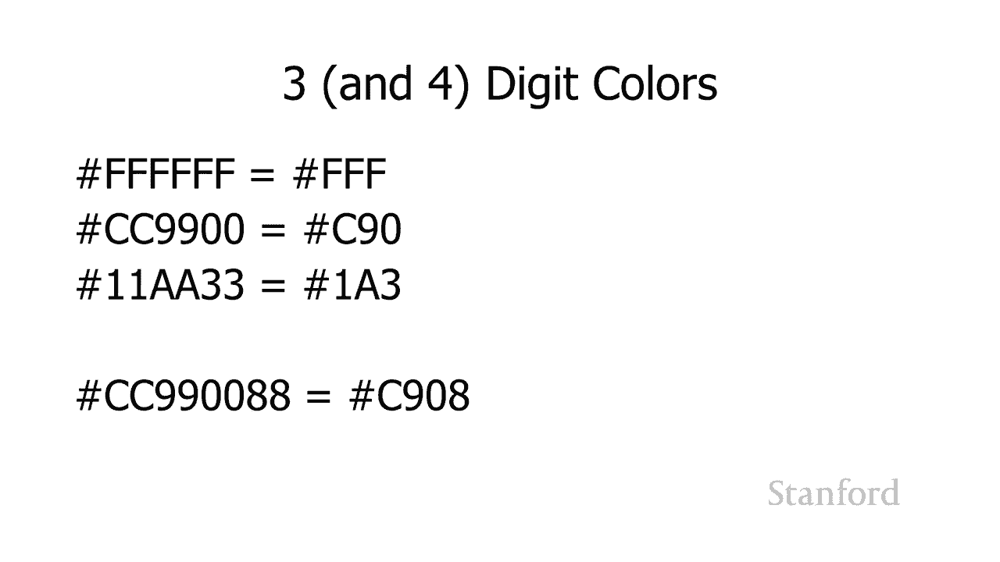

# 【双语字幕+资料下载】斯坦福CS105 ｜ 计算机科学导论(2021最新·完整版) - P31：L9.2- 创建网页：指定颜色 - ShowMeAI - BV1eh411W72E

undefined，欢迎探索计算，欢迎探索计算。

今天的视频正在创建，今天的视频正在创建，指定颜色的网页，所以如果您还，指定颜色的网页，所以如果您还，没有观看十六进制，没有观看十六进制，数字视频观看第一个，数字视频观看第一个，十六进制数字对于。

undefined，undefined，在网页上使用颜色至关重要 cs 105 学生，在网页上使用颜色至关重要 cs 105 学生，该视频与该视频，该视频与该视频，位于同一文件夹中 这段。

位于同一文件夹中 这段，针对 cs106e 学生的视频我们，针对 cs106e 学生的视频我们，上周，上周，在 lo6 内存系列讲座中介绍了十六进制数，在 lo6 内存系列讲座中介绍了十六进制数。

同时也提醒人们计算机如何，同时也提醒人们计算机如何，实际生成颜色，实际生成颜色，它在，它在，构成，构成，每个单独像素的每个子像素上混合了红绿蓝的数量 在。

每个单独像素的每个子像素上混合了红绿蓝的数量 在，屏幕上，屏幕上，所以记住当我们指定颜色时，所以记住当我们指定颜色时，我们指定红，我们指定红，绿色和蓝色的强度，绿色和蓝色的强度。

我们了解到图像讲座的第一周，undefined，undefined，没问题所以让我们从，没问题所以让我们从，一点历史课开始，一点历史课开始，这将再次联系起来 有一次，这将再次联系起来 有一次。

我们只有 16 种已命名的颜色，我们只有 16 种已命名的颜色，现在它们就在这里，所以我们将在一，现在它们就在这里，所以我们将在一，分钟内看到你们的情况要好得多，分钟内看到你们的情况要好得多。

但还有另一个大问题是，但还有另一个大问题是，我认为电脑，我认为电脑，显示器只显示 256 种颜色，显示器只显示 256 种颜色，结果电脑制造商无法，结果电脑制造商无法，就这 256 种颜色。

undefined，undefined，达成一致，因此所有电脑，达成一致，因此所有电脑，制造商都同意的只有 211 种颜色，这些被称为，undefined，undefined，网络安全颜色，所以如果你。

undefined，undefined，看到他们所指的网络安全颜色这个词，它，看到他们所指的网络安全颜色这个词，它，应该不再是一个问题，应该不再是一个问题，因为，因为，任何现代计算机显示器或移动。

任何现代计算机显示器或移动，设备，设备，都应该显示 1670 万种颜色或，都应该显示 1670 万种颜色或，更多，我认为你不会” 将遇到，更多，我认为你不会” 将遇到，undefined。

undefined，只有 256 种颜色的设备，但，只有 256 种颜色的设备，但，您会遇到术语 Web 安全，您会遇到术语 Web 安全，颜色，颜色，undefined，undefined，好的。

就命名颜色而言，我们现在拥有什么，好的，就命名颜色而言，我们现在拥有什么，有 148 种命名，有 148 种命名，颜色，颜色，正如我们所言 之前谈到，正如我们所言 之前谈到，有 1670 万种颜色。

有 1670 万种颜色，正如您在第一周，正如您在第一周，了解的计算机如何存储和显示图像，了解的计算机如何存储和显示图像，除了 1670 万种，除了 1670 万种，颜色外，我们还有 256，颜色外。

我们还有 256，级透明度 计算机，级透明度 计算机，科学我们通常将其称为，科学我们通常将其称为，alpha，alpha，但它对应于，但它对应于，透明度或其相反的，透明度或其相反的，不透明度 名称颜色。

不透明度 名称颜色，有时被称为，有时被称为，css3，它是级联样式表 3，css3，它是级联样式表 3，有多个版本的级联，有多个版本的级联，样式表，它们开始工作 在，样式表，它们开始工作 在。

级联样式表上但他们，级联样式表上但他们，还没有真正完成级联样式，还没有真正完成级联样式，表 3，表 3，但级联样式表 3 有一个，但级联样式表 3 有一个，扩展的颜色标准，扩展的颜色标准。

这些被称为 css3，这些被称为 css3，扩展颜色关键字或，undefined，undefined，我们简要讨论过的标量矢量图形 svg 在我们，我们简要讨论过的标量矢量图形 svg 在我们。

关于图像表示的讲座中，undefined，undefined，它是存储图像信息的对象版本，可，它是存储图像信息的对象版本，可，在网络上使用，undefined，undefined，undefined。

undefined，undefined，undefined，颜色，颜色，虽然这在技术上不正确，但，虽然这在技术上不正确，但，您也可能会听到它们，您也可能会听到它们，仅指 css 颜色。

我不会去 g 列出，仅指 css 颜色，我不会去 g 列出，所有 148 个，但，所有 148 个，但，这种让您了解您有哪些，undefined，undefined，可用的，可用的，选项 有很多选项。

选项 有很多选项，那里有很多，但，那里有很多，但，它们远不及完整的调色板，它们远不及完整的调色板，请记住我们可以代表 1670 万，请记住我们可以代表 1670 万，颜色，颜色，和扩展颜色关键字只。

和扩展颜色关键字只，给我们 148。给我们 148。所以我认为它们很有趣，所以我认为它们很有趣，如果没有别的，它们可能会给你，如果没有别的，它们可能会给你，一些关于颜色的想法，一些关于颜色的想法。

但它们不是它们现在相当，但它们不是它们现在相当，有限，有限，我们在这里查看这些示例，我们在这里查看这些示例，列表，列表，我们有一个很明显的名称，我们有一个很明显的名称，它是什么，它是什么，然后我们有。

然后我们有，颜色的表示，很明显，颜色的表示，很明显，那是什么，那是什么，然后在这两者之间有什么，然后在这两者之间有什么，以a开头的东西，以a开头的东西，如果你看过十六进制，如果你看过十六进制，视频。

你就会知道这，视频，你就会知道这，是十六进制颜色规范，是十六进制颜色规范，如果你还，如果你还，没有看过十六进制视频，那么看看，没有看过十六进制视频，那么看看，undefined，undefined。

就可以了，就像我们在，就可以了，就像我们在，十六进制视频中看到的那样，十六进制视频中看到的那样， 你还记得我们， 你还记得我们，对第一周计算机显示器和图像的讨论，undefined，undefined。

计算机使用 24 位颜色或 32 位，计算机使用 24 位颜色或 32 位，颜色，颜色，在这两种方案中的任何一种中，在这两种方案中的任何一种中，颜色都是通过混合红绿光和蓝光来表示的，undefined。

undefined，红色对应于 单字节，红色对应于 单字节，绿色对应单字节，绿色对应单字节，蓝色对应单字节，蓝色对应单字节，它为我们提供 0 到 255 之间的十进制数。

它为我们提供 0 到 255 之间的十进制数，但它为我们提供了，undefined，undefined，0 0 到 ff 之间的十六进制数，对于网络，0 0 到 ff 之间的十六进制数，对于网络。

它们传统上表示为十六进制，它们传统上表示为十六进制，十进制数，所以在这里我们 有，十进制数，所以在这里我们 有，基数红色，基数红色，它将由，它将由，序列 8 c，序列 8 c，一五一五所以六个十六。

一五一五所以六个十六，进制数字表示红色的，进制数字表示红色的，两个十六进制数字绿色的两个，两个十六进制数字绿色的两个，十六进制数字蓝色的两个十六进制数字，十六进制数字蓝色的两个十六进制数字，正如您从。

正如您从，十六进制讨论中回忆的，十六进制讨论中回忆的，每个十六进制 数字对应，每个十六进制 数字对应，四位，四位，所以两个十六进制数字对应，所以两个十六进制数字对应，八位，这是一个字节，这，八位。

这是一个字节，这，就是，就是，我们获得成功和十进制数字的地方，我们获得成功和十进制数字的地方，24 位颜色 我认为，undefined，undefined，就十六进制而言，当我们，就十六进制而言。

当我们，处理 html，处理 html，和网页以及级联样式表，和网页以及级联样式表，和颜色，和颜色，时，最重要的是要理解如何进行调整，所以这里我，时，最重要的是要理解如何进行调整，所以这里我，有，有。

一个深红色，我们正在使用，一个深红色，我们正在使用，undefined，undefined，深红色虽然我们刚才看到了红衣主教，深红色虽然我们刚才看到了红衣主教，因为红衣主教是完美的我们。

因为红衣主教是完美的我们，不想修改红衣主教但我们，不想修改红衣主教但我们，可能想玩我们的深红色，可能想玩我们的深红色，所以这是深红色的，所以这是深红色的，dc143c所以当你看到这种颜色时你。

dc143c所以当你看到这种颜色时你，可能会，可能会，我想我觉得红色有点太多了，我想我觉得红色有点太多了，所以，所以，你想要做的是你希望，你想要做的是你希望，能够看到这个并说，能够看到这个并说。

好第一对十六进制，好第一对十六进制，数字 dc，数字 dc，是红色的数量，所以我可以，是红色的数量，所以我可以，移动数量 红色向上或，移动数量 红色向上或，向下 就像如果我想向上移动它 如果我。

向下 就像如果我想向上移动它 如果我，想稍微向上移动它，想稍微向上移动它，你知道它高于 dc 好，你知道它高于 dc 好，dd 高于 dc，dd 高于 dc，然后是 de 然后是 df 然后是。

然后是 de 然后是 df 然后是，e0 或者我们可以进入另一个，e0 或者我们可以进入另一个，方向并说好的 dc 太多了，方向并说好的 dc 太多了，让我减少 它非常轻微 db。

让我减少 它非常轻微 db，um da d9，um da d9，d8 所以现在能够上下移动，d8 所以现在能够上下移动，你可能不会以，undefined，undefined，增量的方式向上移动。

这是真的，增量的方式向上移动，这是真的，但也许你的视力和艺术，但也许你的视力和艺术，能力是这样的，能力是这样的，你可能会注意到差异，你可能会注意到差异，我无法知道它的不同，我无法知道它的不同。

所以我会把它向上移动，所以我会把它向上移动，更多或向下移动更多，所以在这里，更多或向下移动更多，所以在这里，我将它向下移动到，我将它向下移动到，ac，你可以看到，ac，你可以看到。

这是一个比我们开始时更深的红色，undefined，undefined，嗯，所以你又知道说我们想要，嗯，所以你又知道说我们想要，调整蓝色的数量，调整蓝色的数量，也许我们想要更多一点的蓝色。

也许我们想要更多一点的蓝色，所以我记得好吧，所以我记得好吧，ac 现在是我们的红色 1-4 是我们的绿色，ac 现在是我们的红色 1-4 是我们的绿色，三个 c 是我们的蓝色，三个 c 是我们的蓝色。

和 因此，如果我想将蓝色向上移动，和 因此，如果我想将蓝色向上移动，3c 3c，3c 3c，e 3 f 4 0 之后的内容，或者如果我想从 3，e 3 f 4 0 之后的内容，或者如果我想从 3，c。

c，3 b 3 a，3 b 3 a，3 9 向下移动等等，这些都是小，3 9 向下移动等等，这些都是小，调整，我将进行大量调整，调整，我将进行大量调整，在这里进行更大的调整，我将，在这里进行更大的调整。

我将，采用 3c 并提高到 5c，采用 3c 并提高到 5c，您可以在这里看到结果，所以，您可以在这里看到结果，所以，基本上 您希望能够采用，基本上 您希望能够采用，这些颜色规范，这些颜色规范。

并对十六进制有足够的了解，并对十六进制有足够的了解，以便能够，以便能够，向上或向下进行调整，向上或向下进行调整，因此请专注于了解如何，因此请专注于了解如何，增加和减少十六进制，增加和减少十六进制，数字。

而不是担心现在，数字，而不是担心现在，如何转换为十进制，如何转换为十进制，如果 你看看，如果 你看看，我这里的这个小叠加层，你可能会注意到，我这里的这个小叠加层，你可能会注意到，你可以看到，你可以看到。

它后面的颜色方块，所以这，它后面的颜色方块，所以这，是一个再次使用 alpha 到 alpha 控件的例子，undefined，undefined，不透明度，不透明度，或透明度两者，或透明度两者。

基本上是相反的 不透明度，基本上是相反的 不透明度，表示我们，表示我们，阻止光线通过的程度，阻止光线通过的程度，透明度表示我们，透明度表示我们，允许光线通过的程度，允许光线通过的程度，因此除了能够指定。

undefined，undefined，我们拥有的红绿色和蓝色的数量之外，我们还可以添加第四，我们拥有的红绿色和蓝色的数量之外，我们还可以添加第四，对 十六进制数字来，对 十六进制数字来。

控制 alpha 所以这里 8 c 一五一，控制 alpha 所以这里 8 c 一五一，五是我们的深红色，五是我们的深红色，但嗯那实际上是 8 c，但嗯那实际上是 8 c。

一五一五的三叶草 那是 rgb，一五一五的三叶草 那是 rgb，an  d 然后 ff 那是最后一，an  d 然后 ff 那是最后一，组十六进制数字是 alpha，组十六进制数字是 alpha。

并且 ff 是，并且 ff 是，我们允许指定的最大值，我们允许指定的最大值，所以这是完全不透明的，这意味着，所以这是完全不透明的，这意味着，我们根本看不到它，所以，我们根本看不到它，所以。

你可以看到 示例覆盖标题，你可以看到 示例覆盖标题，然后使用，然后使用，我在此处指定的颜色的深红色背景，您根本，我在此处指定的颜色的深红色背景，您根本，看不透那个，看不透那个，呃深红色，所以我们将。

呃深红色，所以我们将，稍微减少它，稍微减少它，这里是 75 我已经从 ff 到 bf，这里是 75 我已经从 ff 到 bf，如果你看 覆盖，如果你看 覆盖，在我们的消失图像上的示例您可以看到。

在我们的消失图像上的示例您可以看到，您开始能够，您开始能够，通过那里的深红色背景看到威尼斯，通过那里的深红色背景看到威尼斯，undefined，undefined，那是因为它不是完全。

那是因为它不是完全，不透明度，现在只有 75，不透明度，现在只有 75，不透明度，我们可以进一步降低它，这，不透明度，我们可以进一步降低它，这，是一个关于 50，是一个关于 50。

不透明度 嗯我指定了最后一对，不透明度 嗯我指定了最后一对，呃第四对十六进制，呃第四对十六进制，数字再次，数字再次，代表不透明度我已经将，代表不透明度我已经将，它从 ff 一直减少到八个。

它从 ff 一直减少到八个，零 这基本上是，零 这基本上是，一半你可以看到你可以，一半你可以看到你可以，看到，看到，更多 背景显示 t 通过这样的方式，更多 背景显示 t 通过这样的方式，您可以了解。

您可以了解，如何使用 alpha 如果您想这样做，如何使用 alpha 如果您想这样做，undefined，undefined，您也可以使用三或四位数的，您也可以使用三或四位数的，颜色而不是。

颜色而不是，六位数或八位数的颜色，所以，六位数或八位数的颜色，所以，这里发生的事情是我们采取，这里发生的事情是我们采取，呃，让我们从三位数的例子开始，呃，让我们从三位数的例子开始。

我们采用我们原来的 rgb，我们采用我们原来的 rgb，我们只是摆脱了你知道有，我们只是摆脱了你知道有，多少个，多少个，字母，所以只要我们的配对是，字母，所以只要我们的配对是，你知道十位的。

你知道十位的，他们不是真的十位，我想，他们不是真的十位，我想，他们' 只要十六进制，他们' 只要十六进制，和十六进制，和十六进制，相同，如果我们使用十进制，那，相同，如果我们使用十进制，那，就是十进制。

就是十进制，我们可以立即将其转换为三个，我们可以立即将其转换为三个，十六进制数字，十六进制数字，我已经把它们写下来了，因为它们是，我已经把它们写下来了，因为它们是，相等的，这不是真的 真的，相等的。

这不是真的 真的，更多的是将 ffff 转换为，更多的是将 ffff 转换为，fff 呃，你不知道我们是否，fff 呃，你不知道我们是否，要，要，在基数 16 中进行实际转换，这些当然不相等。

在基数 16 中进行实际转换，这些当然不相等，但就它们，但就它们，在这三位三位数字方案中的指定方式而言，在这三位三位数字方案中的指定方式而言，呃 对于颜色，它的工作方式如此，呃 对于颜色。

它的工作方式如此，简单 ilarly cc，简单 ilarly cc，9900 可以只写成，9900 可以只写成，c90 一个 aa33 可以写成 1a3，c90 一个 aa33 可以写成 1a3。

如果你解决这个问题 最终，如果你解决这个问题 最终，发生的是，发生的是，我们失去了我们可以，我们失去了我们可以，undefined，undefined，用我们原来的 8 个十六进制数字。

用我们原来的 8 个十六进制数字，方案指定的颜色数量 记住对应 到 24，方案指定的颜色数量 记住对应 到 24，位，所以 2 到 24 给了我们 1670，位，所以 2 到 24 给了我们 1670。

万种颜色，万种颜色，三个十六进制数字方案，三个十六进制数字方案，我们只有 12 位，因为这给了我们，我们只有 12 位，因为这给了我们，2 到 12 位，这意味着我们有 4096，2 到 12 位。

这意味着我们有 4096，种颜色，所以基本上你失去了，种颜色，所以基本上你失去了，能力 指定很多颜色，能力 指定很多颜色，但您知道，除非您进行微调，否则，但您知道，除非您进行微调，否则。

您可能不会注意到，您可能不会注意到，它实际上取决于您在，它实际上取决于您在，做什么，您还可以，做什么，您还可以，使用，使用，四个十六进制数字指定这些颜色，其中第四个，四个十六进制数字指定这些颜色。

其中第四个，十六进制数字对应于，十六进制数字对应于。

数量 alpha，数量 alpha，所以我们如何采用这些规范，所以我们如何采用这些规范，并在网页上实际使用它们所以，并在网页上实际使用它们所以，这里有一个简短的小例子，这里有一个简短的小例子。

展示我如何使用一些颜色所以，展示我如何使用一些颜色所以，我创建了一个样式表我正在，我创建了一个样式表我正在，undefined，undefined，为正文指定一个样式规则，你可以。

为正文指定一个样式规则，你可以，看到，看到，我正在提供颜色和背景，我正在提供颜色和背景，颜色属性，颜色属性，对于颜色，我只是使用，对于颜色，我只是使用，那些预定义的，那些预定义的，颜色名称之一小麦。

然后对于，颜色名称之一小麦，然后对于，背景颜色，我使用的是我的，背景颜色，我使用的是我的，十六进制规格，采用，十六进制规格，采用，我们在这里向您展示的规格，我们在这里向您展示的规格。

和 现在，如果您遇到十六进制挑战，可以在样式表中的，和 现在，如果您遇到十六进制挑战，可以在样式表中的，任何地方将它们打上颜色，任何地方将它们打上颜色，那么可以在没有十六进制的。

那么可以在没有十六进制的，情况下，情况下，做到这一点，做到这一点，传统上它是由十六进制完成的，十六，传统上它是由十六进制完成的，十六，进制，进制，颜色将出现在很多，颜色将出现在很多，地方，所以，地方。

所以，你知道我 确实认为你应该，你知道我 确实认为你应该，尝试至少对它们有一些熟悉，尝试至少对它们有一些熟悉，undefined，undefined，你应该对它们足够熟悉，你应该对它们足够熟悉。

当你看到它们时，你就像，当你看到它们时，你就像，哦，那是一种颜色，我可以，哦，那是一种颜色，我可以，通过查看，通过查看，r g 和 b 或多或少，r g 和 b 或多或少，看起来像什么，但如果你。

看起来像什么，但如果你，真的不想以，真的不想以，十六进制指定数量，你可以将它们指定，十六进制指定数量，你可以将它们指定，为，为，百分比或直接十进制，百分比或直接十进制，数，所以这，数，所以这。

就是 t  o 不是将数字指定为，undefined，undefined，数字符号十六进制对十六进制，数字符号十六进制对十六进制，对十六进制对，对十六进制对，您可以指定它使用振动 rgb。

您可以指定它使用振动 rgb，然后为红绿色和蓝色提供一组百分比，undefined，undefined，或者您可以提供 000 和 255 之间的数字。或者您可以提供 000 和 255 之间的数字。

undefined，undefined，这也适用于 alpha 您将，这也适用于 alpha 您将，alpha 指定为百分比，alpha 指定为百分比，最后我们将，最后我们将，在本季度晚些时候。

在本季度晚些时候，讨论呃网站设计时讨论这个问题，讨论呃网站设计时讨论这个问题，但根据您在做什么，您，但根据您在做什么，您，可能想要，可能想要，指定而不是 rgb，您可以，指定而不是 rgb，您可以。

使用色调饱和度指定，使用色调饱和度指定，当您尝试选择配色方案时，这将很有用，undefined，undefined，嗯，我们稍后会再次，嗯，我们稍后会再次，讨论这个，讨论这个，这是实际网页上的样子。

undefined，undefined，嗯，在这个样式表中，嗯，在这个样式表中，好吧，这有点给我一个，好吧，这有点给我一个，了解如何在网页上指定颜色，了解如何在网页上指定颜色，以及现在在，以及现在在。

我们之前讨论的图像和，我们之前讨论的图像和，我们在此处指定的颜色之间，我们在此处指定的颜色之间。

您应该能够制作更，您应该能够制作更，有趣和有趣的。

