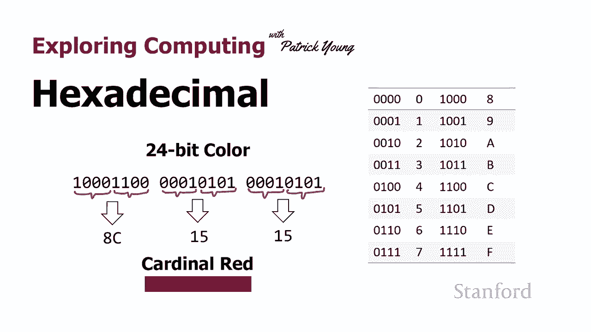
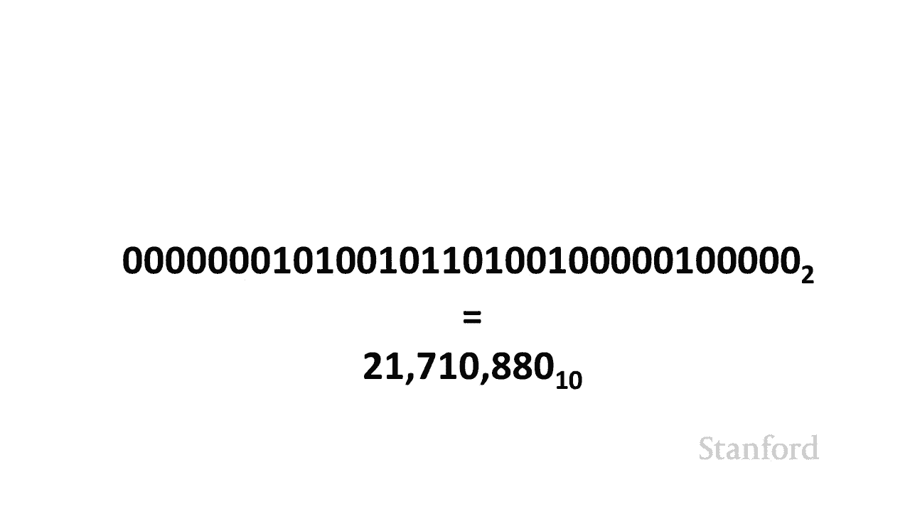
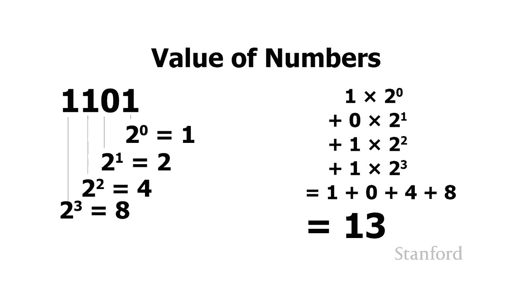
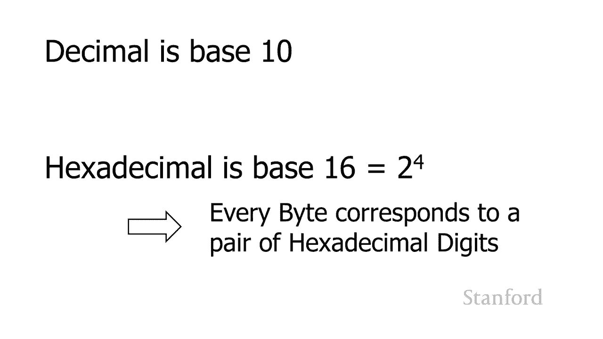
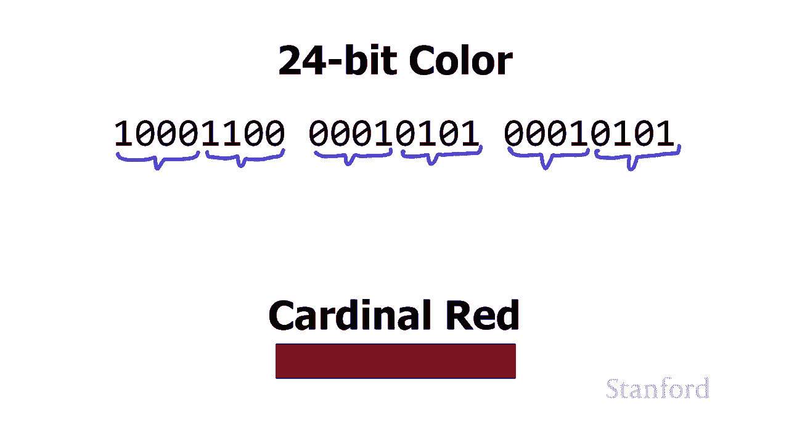
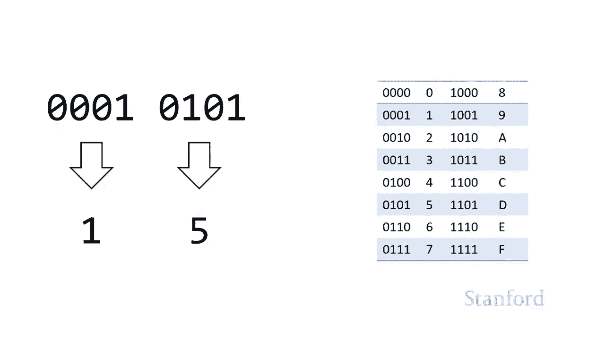
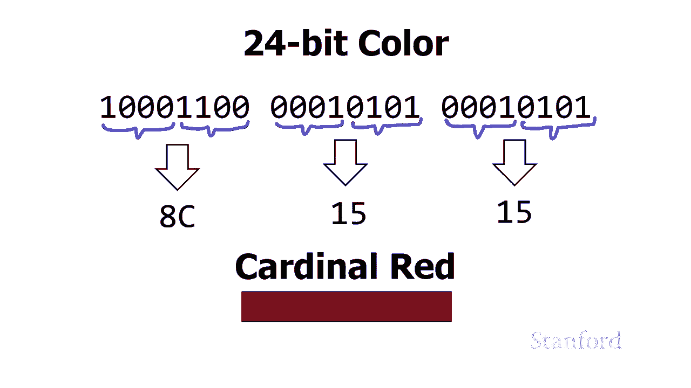
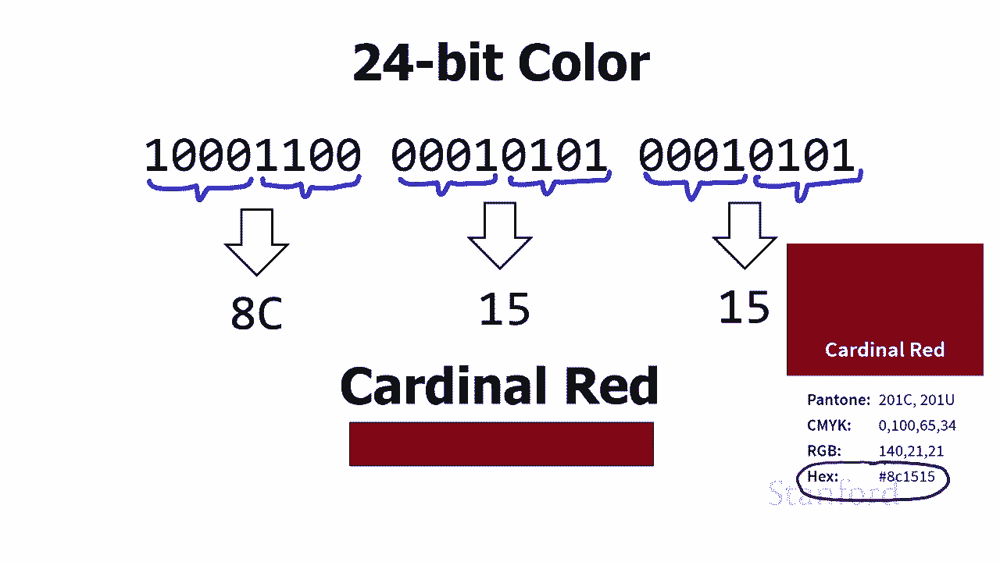
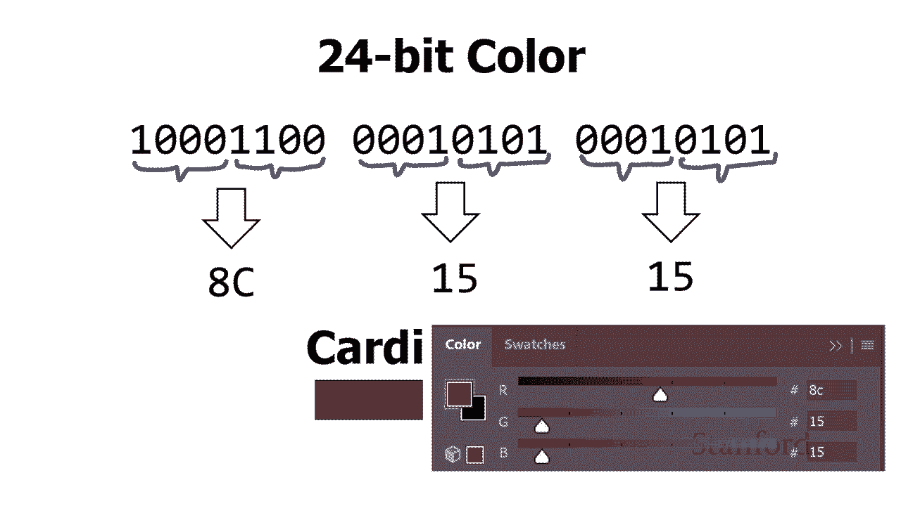

# 【双语字幕+资料下载】斯坦福CS105 ｜ 计算机科学导论(2021最新·完整版) - P32：L9.3- 十六进制 - ShowMeAI - BV1eh411W72E

undefined，欢迎探索计算，欢迎探索计算，今天的视频是十六进制的，今天的视频是十六进制的，所以我们在计算机内部看到，所以我们在计算机内部看到，一切都是用二进制完成的，但，一切都是用二进制完成的。

但，事实证明二进制有点笨拙，事实证明二进制有点笨拙，所以除了二进制数字系统之外，所以除了二进制数字系统之外，当然我们自己的，当然我们自己的，十进制数字系统计算机经常，十进制数字系统计算机经常。

使用十六进制 数字系统实际上，使用十六进制 数字系统实际上，我会说，undefined，undefined，在使用计算机时你更可能看到十六进制而不是二进制。

在使用计算机时你更可能看到十六进制而不是二进制，只是因为，只是因为，二进制真的很难，二进制真的很难，使用，使用。

所以在这个视频中我们将，所以在这个视频中我们将，看看十六进制数字，看看十六进制数字，系统，系统，十六进制是基数 16。我们之前已经，十六进制是基数 16。我们之前已经，看到，看到，二进制是基数 2。

因此我们，二进制是基数 2，因此我们，只有 2 个数字 0 和 1，只有 2 个数字 0 和 1，当然十进制是基数 10，所以，当然十进制是基数 10，所以，我们有，我们有。

0 到 9 的 10 个数字，所以，0 到 9 的 10 个数字，所以，十六进制是十进制的 有 16，十六进制是十进制的 有 16，位数字，位数字，但当然我们没有 16 位数字，所以。

但当然我们没有 16 位数字，所以，我们要做的是，我们要做的是，undefined，undefined，借用字母 abcde，借用字母 abcde，和 f，当您将其添加到 0 到 9 时，和 f。

当您将其添加到 0 到 9 时，您最终会得到 16 位数字，您最终会得到 16 位数字，为什么 做  我们使用十六进制很好地考虑，为什么 做  我们使用十六进制很好地考虑，这里的二进制，这里的二进制。

数字序列这个特定的，数字序列这个特定的，位序列实际上是，位序列实际上是，mips cpu 的一条广告指令，mips cpu 的一条广告指令，并将其视为二进制有点问题将其视为二进制，undefined。

undefined，有很多问题，有很多问题，它真的很长，它真的很长，因此，它非常，因此，它非常，笨拙，我个人觉得，笨拙，我个人觉得，看着这些长长，看着这些长长，的 0 和 1 序列有点吓人，但更。

的 0 和 1 序列有点吓人，但更，重要的是，重要的是，使用所有这些，使用所有这些，0 和 1 很容易出错，很容易，0 和 1 很容易出错，很容易，意外地将其中一个零和一个混在一起。

意外地将其中一个零和一个混在一起，或者 只是完全跳过其中一个，或者 只是完全跳过其中一个，并意识到当你完成，并意识到当你完成，时我应该有 32 位，我，时我应该有 32 位，我。

只得到了 29 我想知道，只得到了 29 我想知道，我跳过了哪一个，我跳过了哪一个，所以我们想要一些，所以我们想要一些，更紧凑的东西，更紧凑的东西，现在我们可以使用 十进制数字系统。

现在我们可以使用 十进制数字系统，所以如果要计算出，所以如果要计算出，等价物，等价物，结果表明这相当于以，结果表明这相当于以。

undefined，undefined，10 为基数的 21 710 880，这相当，10 为基数的 21 710 880，这相当，紧凑，紧凑，但从 b 移动 inary 到十进制是。

但从 b 移动 inary 到十进制是，一种痛苦，一种痛苦，我们在我来之前已经看到了如何做到这一点，我们在我来之前已经看到了如何做到这一点，我们只用四位来做，但，我们只用四位来做，但。

你可以想象用上一页上的 32 位做，你可以想象用上一页上的 32 位做，将是一团糟，undefined，undefined，我还没有向你展示如何从十进制到二进制，我还没有向你展示如何从十进制到二进制。

以相反的方向移动，以相反的方向移动，因为事实，因为事实，证明这是一个真正的痛苦，证明这是一个真正的痛苦。

所以我个人尽可能避免它，undefined，undefined，undefined，undefined，与两个有关，与两个有关，有许多不同的数字，有许多不同的数字，系统，系统，在二进制方面比十进制。

在二进制方面比十进制，数字系统工作得更好，数字系统工作得更好，其中一个是八进制，另一个，其中一个是八进制，另一个，是十六进制，是十六进制，这些工作得更好，因为，这些工作得更好，因为，八进制的基数是 8。

八进制的基数是 8，和 2 到第三 幂是 8，和 2 到第三 幂是 8，十六进制，十六进制，是基数 16 和，是基数 16 和，2 的四次幂是 16，所以，undefined，undefined。

基数 8 和 2 和基数 2 的基数 16 之间存在自然关系，而基数 10 和，基数 8 和 2 和基数 2 的基数 16 之间存在自然关系，而基数 10 和，2 则不，2 则不，存在。存在。事实证明。

因为 16 是，undefined，undefined，每 4 位的 2 的四次方 对应于十六进制，每 4 位的 2 的四次方 对应于十六进制，数字，数字，所以有一个自然的断点，所以有一个自然的断点。

你可以查看每，你可以查看每，四位并说好的这是一个，四位并说好的这是一个，十六进制数字是十六进制，十六进制数字是十六进制，数字是十六进制，数字是十六进制，你根本不能用十进制来做，你根本不能用十进制来做。

因为，因为，我们通常不使用 一次四位，我们通常不使用 一次四位，我们实际上，我们实际上，一次八位工作 事实，一次八位工作 事实，证明，证明，每个字节都对应一对，每个字节都对应一对，十六进制数字。

所以很多时候，十六进制数字，所以很多时候，当你使用十六进制时，当你使用十六进制时，你会看到，你会看到。

很多对 十六进制数字，很多对 十六进制数字，我们将在一分钟内看到这样的例子，我们将在一分钟内看到这样的例子，所以，所以，这是我们之前讲座中的一个 24 位颜色 这种。

这是我们之前讲座中的一个 24 位颜色 这种，特殊颜色是基数红色 这是，特殊颜色是基数红色 这是，斯坦福用于基数红色的官方颜色，undefined，undefined。

你可以看到我们' 已经把我们的二进制，你可以看到我们' 已经把我们的二进制，数放在了上面，数放在了上面，我们在它下面得到了十进制等价物，我们在它下面得到了十进制等价物，虽然，虽然，从二进制转换为。

从二进制转换为，十进制数再次有点痛苦，十进制数再次有点痛苦，所以我要告诉你的是，所以我要告诉你的是，如何转换 从二进制，如何转换 从二进制，到十六进制，这，到十六进制，这，会变得更容易，会变得更容易。

所以我们可以立即将，所以我们可以立即将，这些，这些，数字中的每一个分解为四，数字中的每一个分解为四，组，这里的每组四组都将，组，这里的每组四组都将。

对应一个十六进制数字，对应一个十六进制数字，然后 一开始你可以只，然后 一开始你可以只，使用一个表格，所以这里有一个，undefined，undefined，四位及其十六进制等价物的所有可能组合的表格。

四位及其十六进制等价物的所有可能组合的表格，但随着你继续变得更好，但随着你继续变得更好，你将能够，你将能够，很容易地在两者之间进行转换，很容易地在两者之间进行转换，你可以 将四位转换为。

你可以 将四位转换为，十进制没有，十进制没有，太多麻烦，尽管，太多麻烦，尽管，如果我在，如果我在，讲课中，讲课中，我确实会拖延并且我需要进行转换，你会看到，我确实会拖延并且我需要进行转换，你会看到。

我对这个问题感到困惑大约，我对这个问题感到困惑大约，一两秒钟， 只是在讲座上拖延，一两秒钟， 只是在讲座上拖延，但如果我需要进行四位以上，但如果我需要进行四位以上，的十进制转换，的十进制转换。

我只需要拿出，我只需要拿出，一张纸我不会在所有人都盯着我看的，undefined，undefined，时候在我的脑海中进行八位转换，时候在我的脑海中进行八位转换，讲座，讲座，那是ju，那是ju。

我敢肯定还有其他人，我敢肯定还有其他人，undefined，undefined，所以我们要在这里拿我们的，所以我们要在这里拿我们的，小桌子，或者我们可以用，小桌子，或者我们可以用，undefined。

undefined，右手数字是我们的数字，右手数字是我们的数字，下一个是我们的 2 下一个是 4，下一个是我们的 2 下一个是 4，最后一个是 8，最后一个是 8，所以如果我们按照 2 4 8。

所以如果我们按照 2 4 8，你可以看到这里的这个数字一，你可以看到这里的这个数字一，undefined，undefined，零零零这实际上是一个 8 或者我，零零零这实际上是一个 8 或者我。

可以在我的桌子上查一下 在，可以在我的桌子上查一下 在，undefined，undefined，右边可以，所以 1 0 0 0 base 2，右边可以，所以 1 0 0 0 base 2。

是 8 base，是 8 base，16。现在让我们做一个完整的字节，所以这，16。现在让我们做一个完整的字节，所以这，是我们颜色 1 0 0 0，是我们颜色 1 0 0 0。

1 1 0 0 中的一个字节，这就是，1 1 0 0 中的一个字节，这就是，它派上用场的地方 到十进制，如果，它派上用场的地方 到十进制，如果，我要进行十进制，我要进行十进制，转换，我必须去哦，那是。

转换，我必须去哦，那是，那些是 2 是 4，那些是 2 是 4，是 8，是 8，是 16 是 32 是 64。所以这是，是 16 是 32 是 64。所以这是，undefined，undefined。

128。如果数字变得更大，你，128。如果数字变得更大，你，知道 256，知道 256，512 1024 你试图记住哪个，512 1024 你试图记住哪个，地方与什么一起变得非常混乱。

地方与什么一起变得非常混乱，但带有十六进制id 不要那样做，但带有十六进制id 不要那样做，我只是把这东西一，undefined，undefined，分为二，undefined，undefined。

做了但是，做了但是，你可以在你的头脑中很容易地做到，你可以在你的头脑中很容易地做到，一二四八记住每个，一二四八记住每个，地方都是一个，地方都是一个，二四和八所以，二四和八所以。

我们可以看到我的意思是我们在左边有八个，我们可以看到我的意思是我们在左边有八个，undefined，undefined，我们有一个 2 4，我们有一个 2 4，8 和，8 和，12 十进制，这似乎很。

12 十进制，这似乎很，简单，你想为什么我们不只使用，简单，你想为什么我们不只使用，十进制问题，十进制问题，是只有十进制转换，是只有十进制转换，才能，才能，快速如果我们有少量的，快速如果我们有少量的。

位十六进制转换，位十六进制转换，总是有效 很快，因为我们永远，总是有效 很快，因为我们永远，不会超过四位，因为我们，不会超过四位，因为我们，总是可以将二进制数分解，总是可以将二进制数分解，为四位一组。

为四位一组，这样我们就可以在我们的表中查找它，这样我们就可以在我们的表中查找它，或者我们可以在我们的头脑中进行查找，我们，或者我们可以在我们的头脑中进行查找，我们，可以看到这对应于，可以看到这对应于。

ac 和 所以我们可以看到这个特定的，ac 和 所以我们可以看到这个特定的，位序列我们已经转换了 前，位序列我们已经转换了 前，四位到 8，四位到 8，后四位到 c 等，后四位到 c 等，组合在一起。

组合在一起，我们可以看到整个序列是，我们可以看到整个序列是，8c，让我们，8c，让我们，再做一个，所以这是，再做一个，所以这是，我们红衣主教的另一个组成部分，我们红衣主教的另一个组成部分，我取这些位。

我取这些位，然后我 立即将它们分成，然后我 立即将它们分成，四组，我可以看到我有两组四组，四组，我可以看到我有两组四组，左边的七组，左边的七组，非常容易，非常容易，因为这显然是一组，右边是一组。

因为这显然是一组，右边是一组，我们有我们的两腿，我们有我们的两腿，和四腿，所以我可以 看到这是一个，和四腿，所以我可以 看到这是一个，五，五。

，所以我可以看到这转换，所以我可以看到这转换，为五，为五，实际上这是全彩色，实际上这是全彩色，序列，这里，序列，这里，红色的数量是 8c，绿色的数量，红色的数量是 8c，绿色的数量，是 1 5。

蓝色的数量是 1，是 1 5，蓝色的数量是 1，5。这实际上是 它，5。这实际上是 它。

通常是如何表示的，通常是如何表示的，所以我们在这里看到的是，所以我们在这里看到的是，来自斯坦福的官方颜色指南，来自斯坦福的官方颜色指南，你可以看到他们有很多，你可以看到他们有很多，不同的可能表示。

不同的可能表示，包括，包括，记住我们有 rgb，这是我们的，记住我们有 rgb，这是我们的，添加剂颜色红绿 蓝色，添加剂颜色红绿 蓝色，然后我们有 我们，然后我们有 我们。

用于打印的减色颜色是我们的 cmyk，用于打印的减色颜色是我们的 cmyk，青色洋红色和键或黑色，青色洋红色和键或黑色，您可以在底部看到它们，您可以在底部看到它们，有十六进制，它们有十六进制。

有十六进制，它们有十六进制，列表，列表，这就是我们最初将其转换为的，这就是我们最初将其转换为的，十六进制列表，因为，十六进制列表，因为。

那是 万维网使用什么，那是 万维网使用什么，然后这是 photoshop 中的颜色选择器，然后这是 photoshop 中的颜色选择器，undefined，undefined。

photoshop 有一个网络颜色设置，photoshop 有一个网络颜色设置，你可以看到网络颜色设置，你可以看到网络颜色设置，再次，再次，使用这些十六进制数字，使用这些十六进制数字。

所以关键是如果你打算，所以关键是如果你打算，做艺术，特别是艺术 对于网络，做艺术，特别是艺术 对于网络，您应该熟悉十六，您应该熟悉十六，进制数 当我们查看网络上的地址时，这些十六进制数。

进制数 当我们查看网络上的地址时，这些十六进制数，也会出现在，也会出现在，许多其他地方，undefined，undefined，我们会看到十六进制数字，我们会看到十六进制数字，出现在网络物理地址上。

出现在网络物理地址上，这些是 与您的设备相关联的地址，这些是 与您的设备相关联的地址，您必须在继续向 stanford，您必须在继续向 stanford，注册您的计算机，注册您的计算机。

时告诉 stanford，以便它可以让您在，时告诉 stanford，以便它可以让您在，网络上使用十六进制 l 数字，网络上使用十六进制 l 数字，通常用于识别，undefined，undefined。

计算机内存中的单个位，而，计算机内存中的单个位，而，您可能会看到十六进制，您可能会看到十六进制，数字的另一个地方是，数字的另一个地方是，当您在计算机崩溃时看到错误消息时。

当您在计算机崩溃时看到错误消息时，您经常会看到，您经常会看到，十六进制不是，十六进制不是，很有用，但您知道，很有用，但您知道，您会认出自己就像哦 太好了，我的，您会认出自己就像哦 太好了，我的。

电脑在我身上崩溃了哦，嘿，看，我，电脑在我身上崩溃了哦，嘿，看，我，有一个特殊的数字，我在我的，有一个特殊的数字，我在我的，计算机科学课上了解到，undefined，undefined，当你在看。

当你在看，一些看起来像数字的东西时，你可以告诉你正在看十六进制，一些看起来像数字的东西时，你可以告诉你正在看十六进制，undefined，undefined，但除了 数字 0 到，但除了 数字 0 到。

9 你有，9 你有，abcde 和 f 混合在一起，所以你可以，abcde 和 f 混合在一起，所以你可以，在右下角看到，在右下角看到，我有一些看起来像，我有一些看起来像，一堆数字的东西。

但我也有那些 fs 和，一堆数字的东西，但我也有那些 fs 和，a's 在那里，所以，a's 在那里，所以，一旦你接受了这方面的培训 你会，一旦你接受了这方面的培训 你会，立即看到那个说哦那。

立即看到那个说哦那，必须是十六进制，必须是十六进制，的，尽管事实证明，的，尽管事实证明，有一个约定有时，有一个约定有时，并不总是使用，但是，并不总是使用，但是，当我们经常使用计算机时。

当我们经常使用计算机时，如果一个数字是 前面有一个，如果一个数字是 前面有一个，零，表示我们实际上，零，表示我们实际上，正在查看一个，正在查看一个，八进制数，并且使用了八，八进制数，并且使用了八。

进制八进制，因为八进制是八进制，进制八进制，因为八进制是八进制，而八是 2 的幂，而八是 2 的幂，所以我认为它已经使用，所以我认为它已经使用，了一段时间，但，了一段时间，但。

我们 我主要将文本移动为十进制，但是如果，我们 我主要将文本移动为十进制，但是如果，您看到一些带有 0 后跟，您看到一些带有 0 后跟，一串八进制数字的数字，一串八进制数字的数字，并且如果您看到一些以。

并且如果您看到一些以，0x 开头的内容，0x 开头的内容，正如我们在我们的计算机内存中看到的那样，正如我们在我们的计算机内存中看到的那样，它代表，它代表，一个十六进制数，所以如果你看，一个十六进制数。

所以如果你看，这个小，这个小，序列，如果我们只看到一个 12，序列，如果我们只看到一个 12，本身，它可能是 10 基数。本身，它可能是 10 基数。如果我们看到 0 1 2 那是 1。

如果我们看到 0 1 2 那是 1，2 和 8 基数，我们看到 0 x，2 和 8 基数，我们看到 0 x，undefined，undefined，1 2 是 16 基数的 1 2。好吧。

1 2 是 16 基数的 1 2。好吧，就是这样 对于我们的小介绍，就是这样 对于我们的小介绍，十六进制，但您将在。

