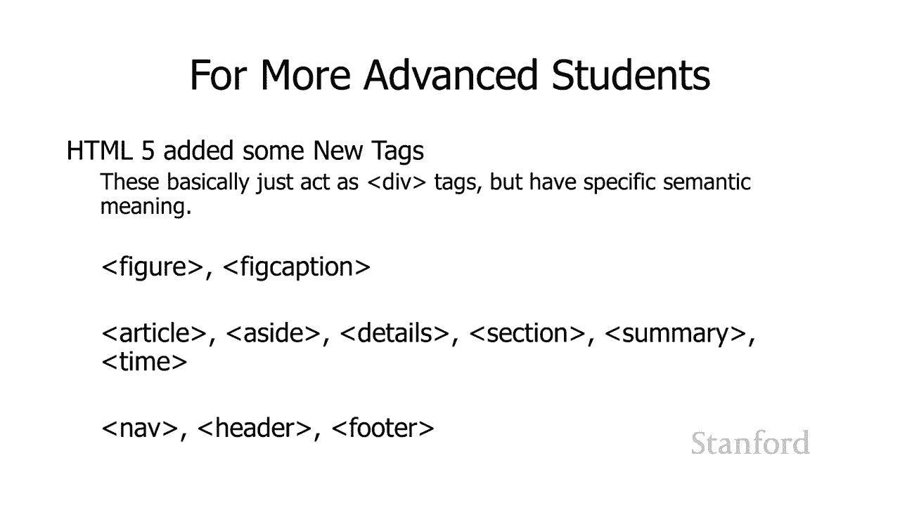

# 【双语字幕+资料下载】斯坦福CS105 ｜ 计算机科学导论(2021最新·完整版) - P33：L9.4- 网页示例：字幕 - ShowMeAI - BV1eh411W72E

undefined，欢迎探索，欢迎探索，今天的计算视频是网页示例，今天的计算视频是网页示例，标题，因此在此视频中，我们将，标题，因此在此视频中，我们将，尝试将您，尝试将您。

迄今为止学到的所有内容与一个广泛的示例结合在一起，迄今为止学到的所有内容与一个广泛的示例结合在一起，您可以在此处看到我们的网页有一些，您可以在此处看到我们的网页有一些，相当标准的，相当标准的，格式。

特别是在 标题，格式，特别是在 标题，undefined，undefined，然后我们有这两张图片，然后我们有这两张图片，下面有一些标题，这就是，下面有一些标题，这就是，本示例的核心所在。

本示例的核心所在，我们将首先介绍，我们将首先介绍，许多不同的，许多不同的，关键主题，关键主题，您可能想知道 如何，您可能想知道 如何，决定是使用类型选择还是类，决定是使用类型选择还是类。

选择或 id 选择器，因此我们将看看，undefined，undefined，您可能还想知道，您可能还想知道，应该使用外部样式表还是内部，应该使用外部样式表还是内部，样式表，样式表。

我们将看到两者的一些示例，我们将看到两者的一些示例，在实际操作中，我们还将了解如何，在实际操作中，我们还将了解如何，以各种不同的方式使用 div，以各种不同的方式使用 div，undefined。

undefined，您还会注意到此，您还会注意到此，特定网页位于，特定网页位于，Web 浏览器的中心，我们将向您展示，Web 浏览器的中心，我们将向您展示，如何正确使用 这 本视频结束 好的。

如何正确使用 这 本视频结束 好的，所以，所以，我们要做的第一件事是将，我们要做的第一件事是将，所有标题设置为 sans serif，所有标题设置为 sans serif，我们将，undefined。

undefined，在本季度晚些时候讨论网页设计时讨论 sans serif 但，在本季度晚些时候讨论网页设计时讨论 sans serif 但，就目前而言，就目前而言，您可以看到，undefined。

undefined，顶部有衬线的标准外观，顶部有衬线的标准外观，和没有衬线的底部外观之间的区别，和没有衬线的底部外观之间的区别，你会，你会，看到底部又干净了一点，看到底部又干净了一点。

我们将更详细地讨论它，我们将更详细地讨论它，现在另一个讲座这个特别，现在另一个讲座这个特别，我们想要应用到所有标题的设计选择，undefined，undefined，这意味着我们想要使用某种。

这意味着我们想要使用某种，类型选择器，类型选择器，这是我们的类型选择器，我，这是我们的类型选择器，我，将字体系列发送到 sans serif，将字体系列发送到 sans serif，然后下一个问题是。

然后下一个问题是，这是否应该进入内部 或，这是否应该进入内部 或，外部样式表，考虑，外部样式表，考虑，内部与外部的方式，内部与外部的方式，是这是一种您，是这是一种您，可能希望在整个，可能希望在整个。

网站中为您网站上的所有网页使用的，网站中为您网站上的所有网页使用的，特定样式，还是仅针对，特定样式，还是仅针对，t 的特定样式 他的网页现在可能，t 的特定样式 他的网页现在可能。

我们希望我们网站上的所有标题，undefined，undefined，看起来都一样，所以这应该放在一个，undefined，undefined，外部样式表中，另外如果你看，外部样式表中，另外如果你看。

那个 h1，你会注意到，那个 h1，你会注意到，h1 是，h1 是，页面顶部的最大尺寸标题，页面顶部的最大尺寸标题，通常位于页面顶部，您会，通常位于页面顶部，您会，看到它居中，我已经更改，看到它居中。

我已经更改，了颜色它很无聊它是灰色，了颜色它很无聊它是灰色，但，但，我已经更改了颜色它们都是，我已经更改了颜色它们都是，灰色，灰色，的 对，这就是我的做法，的 对，这就是我的做法。

我将背景颜色设置为灰色，我将背景颜色设置为灰色，将前景色设置为白色，将前景色设置为白色，我还将文本对齐设置为居中，我还将文本对齐设置为居中，这就是居中的方式，这就是居中的方式，我已将字体大小设置为。

我已将字体大小设置为，我选择的特定设置，而不是使用，我选择的特定设置，而不是使用，Web 浏览器的默认设置，Web 浏览器的默认设置，我还将填充设置为 10 像素，我还将填充设置为 10 像素。

因此让我们仔细看看，因此让我们仔细看看，此处的 10 像素，此处的 10 像素，将填充设置为 10 像素与，将填充设置为 10 像素与，设置边距有什么区别 到 10 像素。

设置边距有什么区别 到 10 像素，这里我们只对，这里我们只对，该，该，标题的中心我们可以看到差异，所以请，标题的中心我们可以看到差异，所以请，注意顶部，这就是我们，注意顶部，这就是我们，实际，实际。

注意到的文字上方和下方有很多灰色，undefined，undefined，而底部，而底部，设置只是将，设置只是将，边距设置为 10 像素而不是，边距设置为 10 像素而不是，10 像素，10 像素。

的填充有一个更薄的灰色边框，的填充有一个更薄的灰色边框，所以这里发生的事情是，所以这里发生的事情是，背景颜色基于填充，背景颜色基于填充，所以当我们将填充设置为 10 像素时。

所以当我们将填充设置为 10 像素时，背景颜色包含并覆盖了，背景颜色包含并覆盖了，10 个像素，10 个像素，如果我们 将边距设置为 10 像素，这是，如果我们 将边距设置为 10 像素，这是。

边框外的内容，我们，边框外的内容，我们，实际上并没有在这里绘制边框，但，实际上并没有在这里绘制边框，但，基本上背景颜色不会，基本上背景颜色不会，覆盖，覆盖，边框外的任何内容，边框外的任何内容，包括边距。

这就是为什么它，包括边距，这就是为什么它，undefined，undefined，好吧，假设我们希望这个 h1 应用于，undefined，undefined，我们网站上的所有网页，我们。

我们网站上的所有网页，我们，可能会这样做，我们会将它放在一个，可能会这样做，我们会将它放在一个，外部样式表中，外部样式表中，我们已经，我们已经，完成了这里的标题 他们就，完成了这里的标题 他们就。

在这里 h2s 在它们的上方和下方都有线条，在这里 h2s 在它们的上方和下方都有线条，所以我们，所以我们，用文本装饰来设置它 嗯我们已经，用文本装饰来设置它 嗯我们已经，将 h3s 设置为。

将 h3s 设置为，斜体 我们再次希望在我们所有的，斜体 我们再次希望在我们所有的，网页上都这样 外部样式表，undefined，undefined，如果你看，如果你看，左下角，你会看到一个，左下角。

你会看到一个，很小的文本，很小的文本，在实际的网页上有点难以阅读，在实际的网页上有点难以阅读，它仍然很小但是，它仍然很小但是，如果我们放大它是可读的 我们会看到，如果我们放大它是可读的 我们会看到。

undefined，undefined，这归功于我实际，这归功于我实际，得到文本的地方照片是，得到文本的地方照片是，你可能不会感到惊讶这里，你可能不会感到惊讶这里，是我的但是，是我的但是。

该文本是从维基百科中获取的，该文本是从维基百科中获取的，所以首先有几个问题要问，所以首先有几个问题要问，我应该为此使用 div，我应该为此使用 div，还是我应该 使用一个段落还是我应该。

还是我应该 使用一个段落还是我应该，使用其他东西，使用其他东西，我应该为此使用一个类还是一个，我应该为此使用一个类还是一个，id，id，在这种特殊情况下，我，在这种特殊情况下，我，认为没有正确的答案。

认为没有正确的答案，我使用了一个段落，但是如果你，我使用了一个段落，但是如果你，想使用一个 div，undefined，undefined，我给它一个id，我给它一个id，因为我假设网页上只有一个署名。

因为我假设网页上只有一个署名，但你知道如果你认为，但你知道如果你认为，你可能，你可能，想在其他地方也使用这个署名设置，想在其他地方也使用这个署名设置，也许你想，也许你想，在照片上加上，在照片上加上。

署名，设置这个可能是有意义的，署名，设置这个可能是有意义的，作为一个类，您可以看到，作为一个类，您可以看到，对于这个特定的 id，我将字体，对于这个特定的 id，我将字体，大小设置为超小。

大小设置为超小，并且我还将字体系列设置为 sans，并且我还将字体系列设置为 sans，serif，serif，因此正文的文本，因此正文的文本，除了标题和其他一些，除了标题和其他一些，地方是，地方是。

serif 但特别是标题和，serif 但特别是标题和，此信用部分是无衬线字体，此信用部分是无衬线字体，好吧让我们回到，好吧让我们回到，这里，这里，的大局，正如我提到的主要，的大局，正如我提到的主要。

内容，我们将要讨论的主要主题，内容，我们将要讨论的主要主题，是这些，是这些，图像，所以让我们仔细看看 在，图像，所以让我们仔细看看 在，这些图像中，这些图像中，所以如果您查看图像，您会。

所以如果您查看图像，您会，注意到实际上有图像，注意到实际上有图像，并且在其下方有一个标题，并且在其下方有一个标题，呃图像和标题周围有一个边框，呃图像和标题周围有一个边框，标题，标题，居中且为斜体。

居中且为斜体，所以我们想要 f 弄清楚如何做，所以我们想要 f 弄清楚如何做，所有这些，所有这些，我要做的第一件事是，我要做的第一件事是，我想将图像和，我想将图像和，标题视为一个组，标题视为一个组。

所以我将继续创建一个，所以我将继续创建一个，div 并，div 并，放置 img 标签和 该 div 中的标题，undefined，undefined，我希望这些样式元素，我希望这些样式元素。

对于所有图像都是相同的，对于所有图像都是相同的，所以我将继续创建，所以我将继续创建，一个类，如果我们只希望样式，一个类，如果我们只希望样式，应用于单个图像，我们可以给它，应用于单个图像，我们可以给它。

一个 id，一个 id，但是 如果我们认为这将，但是 如果我们认为这将，是我们想要的多张图像的东西，请，是我们想要的多张图像的东西，请，继续并给它一个课程，继续并给它一个课程，这是我在这里的初步拍摄。

您可以，这是我在这里的初步拍摄，您可以，看到我已经创建了一个 div，看到我已经创建了一个 div，我已经给了一张课堂照片，然后，我已经给了一张课堂照片，然后，我也想做，我也想做，标题上的一些额外样式。

所以我给，标题上的一些额外样式，所以我给，了一个类以及，了一个类以及，类标题我想我，undefined，undefined，将对所有不同的标题使用相同的样式信息，所以我想。

将对所有不同的标题使用相同的样式信息，所以我想，给它一个，给它一个，我也放的类 每个图像，我也放的类 每个图像，的 img 标签，的 img 标签，中的高度和宽度，中的高度和宽度，实际上是这样，当网页。

实际上是这样，当网页，加载什么时 这里将要发生的是，加载什么时 这里将要发生的是，html 文件将首先被接收，html 文件将首先被接收，呃 html 文件可能会，呃 html 文件可能会。

很好地引用在这种情况下我们肯定会，很好地引用在这种情况下我们肯定会，引用外部样式表它也会，undefined，undefined，在 Web 浏览器等待时引用一堆 imgs 对于。

在 Web 浏览器等待时引用一堆 imgs 对于，要下载的样式表，要下载的样式表，特别是在等待，特别是在等待，这些图像下载时，它，这些图像下载时，它，不一定知道图像有多大，不一定知道图像有多大。

因此会发生什么是您会得到一个，因此会发生什么是您会得到一个，小邮票大小的，小邮票大小的，图标，显示图像，图标，显示图像，应该出现的位置和 然后当它，应该出现的位置和 然后当它。

弄清楚这些图像实际上有多大时，弄清楚这些图像实际上有多大时，它会调整网页的大小，所以通过，undefined，undefined，在 img 标签上放置一个特定的连字符宽度，我。

在 img 标签上放置一个特定的连字符宽度，我，告诉网络浏览器继续并，告诉网络浏览器继续并，undefined，undefined，为该图像保留空间，所以我们会去 提前，为该图像保留空间。

所以我们会去 提前，并，并，为图像创建一个与我指定的空间一样大的空白区域，undefined，undefined，当图像最终下载时，当图像最终下载时，它将继续并将其填充到该，它将继续并将其填充到该。

空间中，空间中，您不必，您不必，在 img 上指定您可以 j 必须，在 img 上指定您可以 j 必须，在获取样式表的演员表上指定它，在获取样式表的演员表上指定它，undefined。

undefined，即在下载级联样式表之前，即在下载级联样式表之前，无论如何它不会知道，无论如何它不会知道，如何布置网页，我们将，undefined，undefined，在讲座中广泛讨论如何布置网页。

在讲座中广泛讨论如何布置网页，还有，还有，你可以，你可以，undefined，undefined，在图像上使用不同像素密度的一些技巧，在图像上使用不同像素密度的一些技巧，undefined。

undefined，呃，我们可能会在，呃，我们可能会在，另一堂课中讨论这个，另一堂课中讨论这个，问题，如果你想拥有它实际上会变得相当复杂，问题，如果你想拥有它实际上会变得相当复杂，哦。

这是我想要使用的图像，哦，这是我想要使用的图像，如果这是在一个 在低密度情况，如果这是在一个 在低密度情况，下，下，您知道它可能是中档显示器，您知道它可能是中档显示器，或中档电视，或中档电视。

正在显示的高清电视与，undefined，undefined，ipad 或类似设备上的超高品质视网膜显示器，undefined，undefined，我想要两个不同的，我想要两个不同的。

图像 占据了很多空间，并且，图像 占据了很多空间，并且，有很多像素用于视网膜，有很多像素用于视网膜，显示器，然后也许另一个，显示器，然后也许另一个，用于标准质量显示器，用于标准质量显示器。

我们可以在另一，我们可以在另一，堂课中讨论，堂课中讨论，所有 这是我，所有 这是我，将用于照片和，将用于照片和，标题的规则，标题的规则，您可以看到我，您可以看到我，undefined。

undefined，在照片周围放置了边框并添加了一些，在照片周围放置了边框并添加了一些，填充，填充，然后我告诉标题它应该，然后我告诉标题它应该，是 线中心和字体样式应该，是 线中心和字体样式应该。

是斜体，是斜体，这适用于我们这里的小图像，这适用于我们这里的小图像，呃这是我的老 karen terry，呃这是我的老 karen terry，molly 流动的，molly 流动的，鼓励 这是在宿舍。

鼓励 这是在宿舍，员工会议的中间 呃没人，员工会议的中间 呃没人，注意她正试图偷偷摸摸，注意她正试图偷偷摸摸，我们都在说话时把零食放在桌子上，我们都在说话时把零食放在桌子上，undefined。

undefined，所以这对那个完全没问题，但是，所以这对那个完全没问题，但是，在另一个图像上，在另一个图像上，呃，这是我们希望另一个，呃，这是我们希望另一个，图像显示的样子，但事实证明它。

图像显示的样子，但事实证明它，实际上不起作用，实际上不起作用，这就是发生的事情，所以 发生，这就是发生的事情，所以 发生，在这里 为什么它在一个而不是另一个上起作用，undefined。

undefined，这里发生的是图像具有，这里发生的是图像具有，特定的宽度，特定的宽度，但文本没有，发生的事情，但文本没有，发生的事情，是，是，因为文本没有自然宽度，除了，因为文本没有自然宽度，除了。

undefined，undefined，你知道你的句子或，你知道你的句子或，段落有多长 将扩大以占据，段落有多长 将扩大以占据，尽可能多的 可用空间，尽可能多的 可用空间，所以两个月的凯伦特里小狗。

所以两个月的凯伦特里小狗，从刚刚展开的外壳中逃脱，从刚刚展开的外壳中逃脱，它说我，它说我，将占用尽可能多的空间，将占用尽可能多的空间，直到我可以出现在一行上，直到我可以出现在一行上。

或直到我填满整个网络浏览器，或直到我填满整个网络浏览器，窗口 这是一个问题，窗口 这是一个问题，所以我们的解决方案是我们将，undefined，undefined，在该标题上提供特定的宽度。

在该标题上提供特定的宽度，所以让我们回到我们的问题，所以让我们回到我们的问题，这里是否应该将其，这里是否应该将其，指定为类或 id 事物，指定为类或 id 事物，以及这应该是内部还是。

以及这应该是内部还是，外部，我的 认为这里，外部，我的 认为这里，的每个图像，的每个图像，可能有不同的宽度，所以这，undefined，undefined，undefined，不是我所有图像的共同点。

现在您可能，不是我所有图像的共同点，现在您可能，正在运行，正在运行，某种报纸，并且您，某种报纸，并且您，只有几个标准宽度 你的，只有几个标准宽度 你的，图像，所以在这种情况下，你可能会使用一个，图像。

所以在这种情况下，你可能会使用一个，类，但在这种特殊情况下，我，类，但在这种特殊情况下，我，认为，认为，我的所有图像可能是一个随机宽度，我的所有图像可能是一个随机宽度，所以，所以，我将继续，我将继续。

为这个，为这个，图像创建一个规则，所以这意味着我 去吧 o，图像创建一个规则，所以这意味着我 去吧 o，给它一个 id，给它一个 id，然后就内部与，然后就内部与，外部而言，如果这是。

undefined，undefined，undefined，在这种情况下在外部的多个网页中的共同点，正如我所说的，我假设我的，在这种情况下在外部的多个网页中的共同点，正如我所说的，我假设我的，宽度将与。

宽度将与，一个图像不同 到另一个，一个图像不同 到另一个，并且仅针对此图像，并且仅针对此图像，因此没有理由将其放在外部样式表中，因此没有理由将其放在外部样式表中，该样式表将，该样式表将。

被我网站上的所有其他网页下载，被我网站上的所有其他网页下载，这是特定，这是特定，于该图像的，所以，于该图像的，所以，我要 继续并提供一个，我要 继续并提供一个，宽度，宽度，我将把它放在内部。

我将把它放在内部，样式表中，所以你知道有我的样式，样式表中，所以你知道有我的样式，开始停止标签，这是在内部，开始停止标签，这是在内部，样式表中，样式表中，你可以看到我实际上，你可以看到我实际上。

将把宽度放在 标题，将把宽度放在 标题，但我将把 id 放在，但我将把 id 放在，周围的 div 上，这里的想法是，周围的 div 上，这里的想法是，你知道可能会有，你知道可能会有，其他一些。

其他一些，特定于这个的东西，这个，特定于这个的东西，这个，特定的图像标题，特定的图像标题，设置所以通过把，设置所以通过把，整个 div 上的 id i 获得更多的。

整个 div 上的 id i 获得更多的，灵活性，灵活性，呃，所以这个特殊的规则结合，呃，所以这个特殊的规则结合，了，了，它需要在转义照片中的 id，它需要在转义照片中的 id，然后是空格，然后。

然后是空格，然后，是点标题，所以你记得这，是点标题，所以你记得这，实际上是一个后代选择器，它说，实际上是一个后代选择器，它说，这将适用于任何，这将适用于任何，包含在，包含在。

带有 id 转义照片的元素中以及，带有 id 转义照片的元素中以及，该转义照片 div 中的某个位置，如果该转义照片 div，该转义照片 div 中的某个位置，如果该转义照片 div。

中还有其他一些元素，中还有其他一些元素，该元素具有，该元素具有，类标题，这将适用于它，类标题，这将适用于它，所以我继续，所以我继续，说好适合它的标题 或者如果，说好适合它的标题 或者如果。

有任何其他符合此，有任何其他符合此，特定，特定，规则的标题，在这种情况下没有，嗯，规则的标题，在这种情况下没有，嗯，宽度为 200，宽度为 200，然后我想你知道我们可能，然后我想你知道我们可能，想。

想，在某个时候更改另一张照片上的标题，所以我也可以，在某个时候更改另一张照片上的标题，所以我也可以，继续并为此指定宽度，继续并为此指定宽度，这是很常见的做法，这是很常见的做法，因为，因为。

您是网站设计师，您是，您是网站设计师，您是，网页设计师，网页设计师，其他人可能会更改，其他人可能会更改，网页的内容 在另一个时间，所以，网页的内容 在另一个时间，所以，你现在应该考虑更长远的想法。

你现在应该考虑更长远的想法，现在下面的图像，现在下面的图像，另一，另一，张照片下面的标题不够白，不足以引起，张照片下面的标题不够白，不足以引起，问题，但稍后可以由，问题，但稍后可以由，文本编辑器更改。

文本编辑器更改，他们可能不明白如何 修复，他们可能不明白如何 修复，html css 问题，以便更好，html css 问题，以便更好，地继续并立即指定两个，地继续并立即指定两个，undefined。

undefined，好吧，我们在左侧和右侧都有照片，好吧，我们在左侧和右侧都有照片，嗯，嗯，这似乎是我们，这似乎是我们，希望在所有网页上都有的东西，希望在所有网页上都有的东西，因此建议它 应该是一个类。

因此建议它 应该是一个类，所以我已经继续并，所以我已经继续并，在我的 div 上指定它在，在我的 div 上指定它在，这里我有一张右照片和一张，这里我有一张右照片和一张，左照片类，左照片类。

注意该类实际上，注意该类实际上，指定它既是，指定它既是，我们之前看到的规则的照片，也是，我们之前看到的规则的照片，也是，右图 照片或左侧照片，所以，右图 照片或左侧照片，所以。

我之前并没有真正提到这一点，我之前并没有真正提到这一点，但是您可以，但是您可以，在标签中的类属性值对中列出多个类，undefined，undefined，所以我认为这有点奇怪，我认为。

所以我认为这有点奇怪，我认为，它们应该用，它们应该用，逗号分隔，但是 你没有列出，逗号分隔，但是 你没有列出，你想要的尽可能多的类，只是，你想要的尽可能多的类，只是，用空格分隔它们，用空格分隔它们。

然后这里是左右照片的规则，undefined，undefined，基本上我向左浮动或，基本上我向左浮动或，向右浮动然后我，向右浮动然后我，专门设置，专门设置，左边或右边，左边或右边。

的边距基本上边距位于，的边距基本上边距位于，它浮动位置的另一侧，它浮动位置的另一侧，所以这里的想法是它会向左齐平，undefined，undefined，然后在文本旁边流动的右侧，undefined。

undefined，我想要一点 照片和文字之间的边距，我想要一点 照片和文字之间的边距，或者，或者，如果照片向右调情，我，如果照片向右调情，我，希望它在网页的右侧齐平，undefined。

undefined，在左侧文字与文字并排流动的地方之间有一点，在左侧文字与文字并排流动的地方之间有一点，undefined，undefined，边距，你会的 还要注意，边距，你会的 还要注意。

网页在网络浏览器中居中，这，网页在网络浏览器中居中，这，是很常见的，是很常见的，通常你要做的是添加一个，通常你要做的是添加一个，额外的，额外的，div div 将绝对包围，div div 将绝对包围。

undefined，undefined，正文中的所有内容 所以你可以看到我有，正文中的所有内容 所以你可以看到我有，外 body 标签，外 body 标签，然后在 body 标签里面我有一个。

然后在 body 标签里面我有一个，div 我已经给了它 id，div 我已经给了它 id，网页中的所有内容都在，网页中的所有内容都在，那个内部，那个内部，div 然后我要做的是。

div 然后我要做的是，我要写一个规则 对于那个内部，我要写一个规则 对于那个内部，div，div，这里是我说哦，这是所有人，这里是我说哦，这是所有人，我给了它一个特定的宽度我说。

我给了它一个特定的宽度我说，整个内容应该，整个内容应该，填充一千像素，然后我将，填充一千像素，然后我将，边距设置为自动，边距设置为自动，边距自动允许网络浏览器，边距自动允许网络浏览器。

选择边距 就其本身而言，选择边距 就其本身而言，通常对左边，通常对左边，距和右边距所做的，距和右边距所做的，就是将左右边距平均化，就是将左右边距平均化，并将项目放在中心，这样就可以，并将项目放在中心。

这样就可以，给我们这个很好的效果，给我们这个很好的效果，另一个有时，另一个有时，用于，用于，这些外部 div 的东西 有时用于，这些外部 div 的东西 有时用于，是如果你想在整个网页周围放一个框。

是如果你想在整个网页周围放一个框，undefined，undefined，你可以继续并，你可以继续并，在它周围放一个边框，你会，在它周围放一个边框，你会，得到一个漂亮的小，得到一个漂亮的小。

undefined，undefined，好，嗯，这就是最后一个，好，嗯，这就是最后一个，我想提的是，我想提的是，这种 div 的使用是 超级灵活，这种 div 的使用是 超级灵活，我们将在下一。

我们将在下一，节课再看一遍，你可以，节课再看一遍，你可以，在下一个家庭作业中玩一点儿，在下一个家庭作业中玩一点儿，undefined，undefined，呃，但我确实想为，呃，但我确实想为。

更高级的学生提一下，更高级的学生提一下，那些计划真正，那些计划真正，开始创造真实的学生 网站，开始创造真实的学生 网站，特别是如果您打算，特别是如果您打算，在专业环境中执行此操作。

在专业环境中执行此操作，您应该知道 html5 添加了，您应该知道 html5 添加了，一些新标签，一些新标签，可以用来代替这些 div 这些，可以用来代替这些 div 这些，几乎与，几乎与。

我在这里创建的 div 做同样的事情，我在这里创建的 div 做同样的事情，div 用于标题 用于，div 用于标题 用于，uh 图像和标题的 div，uh 图像和标题的 div。

它们本身通常没有任何样式，它们本身通常没有任何样式，信息，但它们，信息，但它们，用于告诉 Web 浏览器，用于告诉 Web 浏览器，有关，有关，此标签应该是什么的语义信息以及。

此标签应该是什么的语义信息以及，这些对于，这些对于，支持有可访问性，支持有可访问性，问题的观众非常有帮助，问题的观众非常有帮助，特别是如果有人看不到，特别是如果有人看不到，undefined。

undefined，他们正在使用的称为 aa 阅读器的屏幕时，他们正在使用的称为 aa 阅读器的屏幕时，网络浏览器正在阅读，网络浏览器正在阅读，内容 其中的 ts 这些，内容 其中的 ts 这些。

对于让那些，对于让那些，读者知道发生了什么非常有帮助，所以在这种，读者知道发生了什么非常有帮助，所以在这种，特殊情况下有一个数字，特殊情况下有一个数字，和一个无花果标题 um 标签。

和一个无花果标题 um 标签，所以这些可以替换我的两个，所以这些可以替换我的两个，div 标题的 div，div 标题的 div，显然我说类等于标题，显然我说类等于标题，可以用无花果标题替换。

可以用无花果标题替换，然后用图片替换外面的照片，然后用图片替换外面的照片，可以用图形替换，可以用图形替换，然后这里是呃，然后这里是呃，其他一些语义元素的列表，我之前提到过，其他一些语义元素的列表。

我之前提到过，一些我认为，一些我认为，所以有一篇文章呃 一个方面，所以有一篇文章呃 一个方面，有点像嗯，如果你看过那些，有点像嗯，如果你看过那些，教科书，那里有一种，教科书，那里有一种，蓝色盒子。

蓝色盒子，你可以，你可以，在，在，cs105 课程阅读器的一些章节中看到我的蹩脚版本，我只是，cs105 课程阅读器的一些章节中看到我的蹩脚版本，我只是，标记嘿这是 应该去网站，但我。

标记嘿这是 应该去网站，但我，实际上并没有将它放在外部，实际上并没有将它放在外部，框，框，详细信息部分摘要和时间，详细信息部分摘要和时间，然后这些实际上可能会，然后这些实际上可能会，undefined。

undefined，为呃这里导航底部的网络浏览器做一些事情，为呃这里导航底部的网络浏览器做一些事情，undefined，undefined，这对那些无法执行的人来说非常有。

这对那些无法执行的人来说非常有，帮助 ly 阅读，帮助 ly 阅读，您的网页，您的网页，或让网页阅读给他们，因此，或让网页阅读给他们，因此，nav 指示一个部分实际上是，nav 指示一个部分实际上是。

一个导航部分，因此如果，一个导航部分，因此如果，您了解那些我们稍后会讨论，您了解那些我们稍后会讨论，但如果您有通用，但如果您有通用，设计 在您有侧边栏，设计 在您有侧边栏，或顶部导航栏的地方，您可以说。

或顶部导航栏的地方，您可以说，嘿，嘿，这里有一些其他元素 这里是我网站上的其他一些，这里有一些其他元素 这里是我网站上的其他一些，网页，您可以，网页，您可以，通过将导航放在那里点击您可以。

通过将导航放在那里点击您可以，让网络浏览器知道嘿，让网络浏览器知道嘿，undefined，undefined，在访问我的网页的人之前，不要向，在访问我的网页的人之前，不要向，访问我的网页的人阅读此部分。

直到他们，访问我的网页的人阅读此部分，直到他们，明确说好的我已经听完，明确说好的我已经听完，了网页的内容是，了网页的内容是，什么我的导航选项，什么我的导航选项，然后网络浏览器可以像哦。

然后网络浏览器可以像哦，我看到你有那个 导航部分现在，我看到你有那个 导航部分现在，是我要继续向我的观众阅读，是我要继续向我的观众阅读，导航部分的地方，导航部分的地方，然后有一个页眉和。

然后有一个页眉和，一个页脚，一个页脚，由于，由于，顶部和底部的某些特殊内容，我可能不会使用这些页眉和页脚 认为它，顶部和底部的某些特殊内容，我可能不会使用这些页眉和页脚 认为它。

实际上用于任何事情 现在，实际上用于任何事情 现在，它只是一个，它只是一个，你可以使用的另一个标签，你可以用，undefined，undefined，同样的方式给样式规则，我给我的。

同样的方式给样式规则，我给我的，div 加上，div 加上，class equals photo 和我的 div 加上，class equals photo 和我的 div 加上，标题，标题。

所以这些都是不同的选项，所以这些都是不同的选项，再次通过提供 多一点，再次通过提供 多一点，语义信息，语义信息，你会让，你会让，网络浏览器更容易告诉，网络浏览器更容易告诉，你你想要做什么 你也。

你你想要做什么 你也，可能让人们更容易，可能让人们更容易，就像你创建一个网页设计让我们，就像你创建一个网页设计让我们，说你 这实际上发生在，说你 这实际上发生在，呃我的一些学生你去，呃我的一些学生你去。

一些公司让我们看看你，一些公司让我们看看你，和一群朋友开始一个新的非营利组织，和一群朋友开始一个新的非营利组织，没有人知道如何制作网页，没有人知道如何制作网页，你就是，你就是，这样所以你去制作 网页。

但，这样所以你去制作 网页，但，您可能希望其他人，您可能希望其他人，能够修改该网页，因此通过使用，能够修改该网页，因此通过使用，这些特殊标签，您可以让人们，这些特殊标签，您可以让人们。

undefined，undefined，知道您的 html 文件的不同部分，知道您的 html 文件的不同部分，将用于您为，将用于您为，他们，他们，提供的更多内容 指导，提供的更多内容 指导。

呃个别教派，呃个别教派，不仅仅是有一堆 div，不仅仅是有一堆 div，好吧，嗯，我很快就会和你们谈谈，好吧，嗯，我很快就会和你们谈谈，undefined，undefined，我们有更多很酷的网络内容。

我们有更多很酷的网络内容，即将推出我们，即将推出我们，对布局进行了广泛的讨论，所以你，对布局进行了广泛的讨论，所以你，知道我认为这，知道我认为这，已经是一个 非常有趣的网页，已经是一个 非常有趣的网页。

但是我们实际上，但是我们实际上，已经就布局进行了广泛的讨论，已经就布局进行了广泛的讨论，然后是，然后是，如何使用我，如何使用我，将教您重新创建，undefined，undefined。

纽约时报网页和，纽约时报网页和，华盛顿邮报网页的部分技术，以便您 可以，华盛顿邮报网页的部分技术，以便您 可以，期待。

