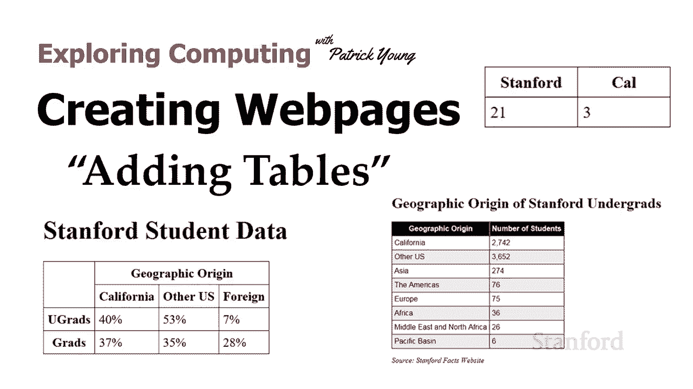
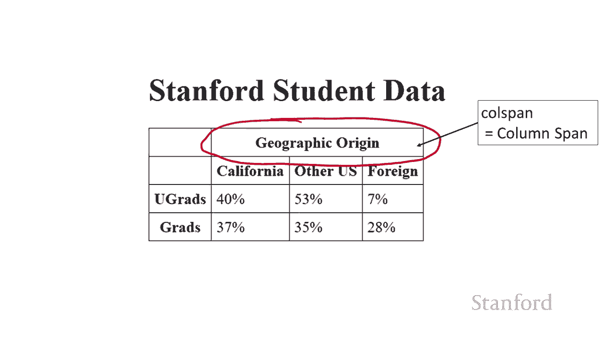
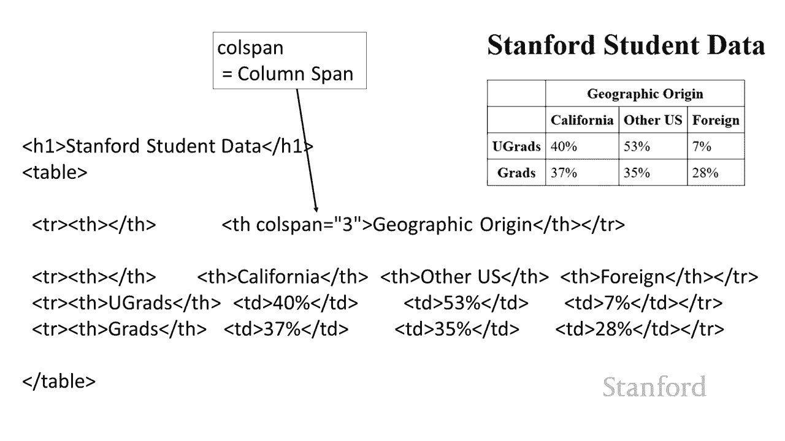
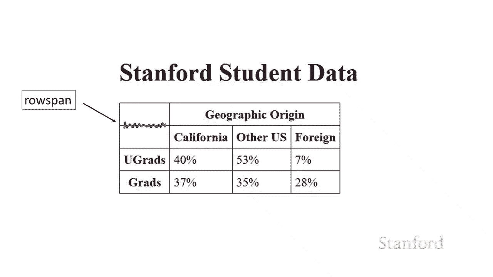
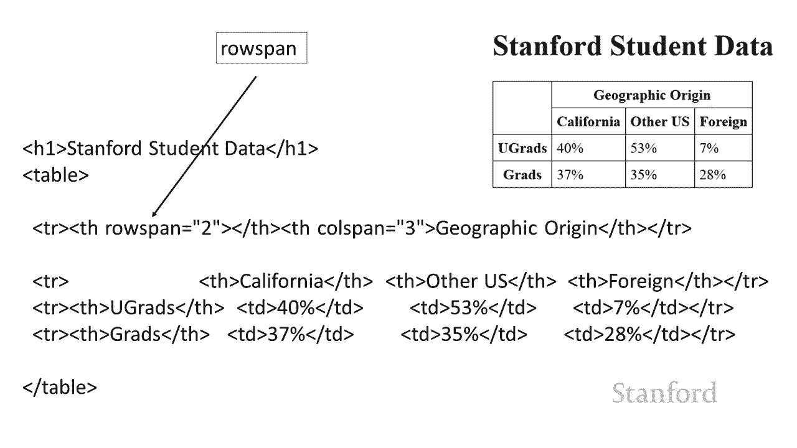
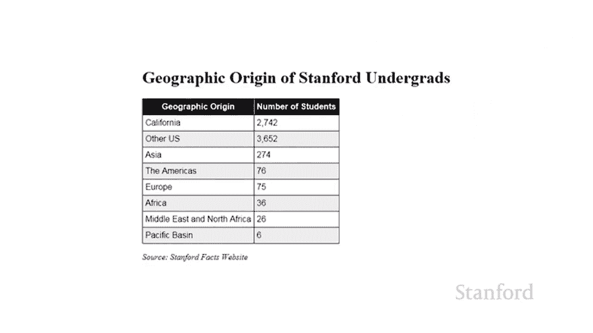
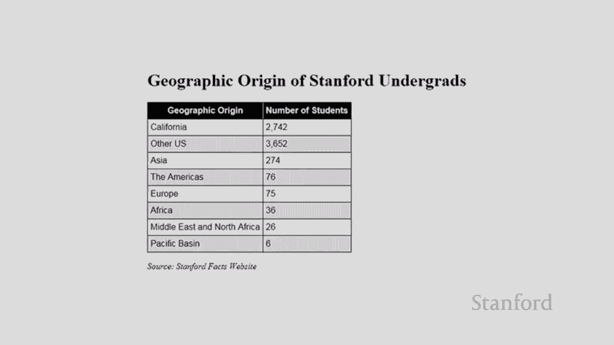

# 【双语字幕+资料下载】斯坦福CS105 ｜ 计算机科学导论(2021最新·完整版) - P34：L10.1- 创建网页：添加表格 - ShowMeAI - BV1eh411W72E

undefined，欢迎探索计算，欢迎探索计算，今天的视频正在创建网页，今天的视频正在创建网页，添加表格，以便表格显示在，添加表格，以便表格显示在，广泛的地方，undefined，undefined。

undefined，undefined，undefined，如果您从事美术工作，并且正在，如果您从事美术工作，并且正在，为，为，正在上演的新剧目创建一个新网页，您可能，正在上演的新剧目创建一个新网页。

您可能，想要张贴表演表，想要张贴表演表，或者如果您刚刚创建了一个新，或者如果您刚刚创建了一个新，的非营利组织， 您想制定一个，的非营利组织， 您想制定一个，时间表，时间表，或志愿者目录 您。

或志愿者目录 您。

将需要一张桌子，因此在此视频中，我们，将需要一张桌子，因此在此视频中，我们，将教您如何，将教您如何，在网页上放置桌子，因此我们将，在网页上放置桌子，因此我们将，以此为例 表格，以此为例 表格，它是呃。

正如你可能会猜到，它是呃，正如你可能会猜到，它是 uh 一场，它是 uh 一场，大型比赛，大型比赛，stanford 21 cal 3 的得分。stanford 21 cal 3 的得分。

现在因为这是 html 并且所有内容，现在因为这是 html 并且所有内容，都是用标签完成的，都是用标签完成的，因为你可能猜到还有一个表格，因为你可能猜到还有一个表格，标签，标签，除了表格 标记有一个。

除了表格 标记有一个，表格行标记，表格行标记，所以我们将通过 ro 输入我们的，所以我们将通过 ro 输入我们的，信息 ws，信息 ws，并且在每一行中，我们将，并且在每一行中，我们将，创建表格数据。

创建表格数据，项或 tds 有一个，项或 tds 有一个，表格列标记，但您不能，表格列标记，但您不能，按列输入数据您只能，按列输入数据您只能，按行输入数据，按行输入数据，列标记仅用于，列标记仅用于。

格式化，我们 不打算，格式化，我们 不打算，在本次讲座中介绍它，在本次讲座中介绍它，好吧 所以我有我的表格 我有，好吧 所以我有我的表格 我有，几个表格行，几个表格行。

我已经将我的数据输入到我的单元格中，我已经将我的数据输入到我的单元格中，undefined，undefined，我做得很好 如果我们要，我做得很好 如果我们要，接受，接受。

html 我们已经在这里显示了，html 我们已经在这里显示了，我们要把它放在我们的网页上，我们要把它放在我们的网页上，而不是把这个漂亮的表格放在，而不是把这个漂亮的表格放在，我们的左边。

这是我们的目标，我们，我们的左边，这是我们的目标，我们，实际上要得到右边的表格，实际上要得到右边的表格，它，它，看起来并不完全像 表格，看起来并不完全像 表格，因此您可能会猜到我们需要做的是。

因此您可能会猜到我们需要做的是，我们需要进入并，我们需要进入并，添加一些级联样式表，添加一些级联样式表，信息，信息，所以我需要做的第一件事是，所以我需要做的第一件事是，我需要说我的表格。

我需要说我的表格，数据项应该有边框，数据项应该有边框，等等 我要给它一个 1 像素的，等等 我要给它一个 1 像素的，纯黑色边框，纯黑色边框，只是在你使用边框时提醒，只是在你使用边框时提醒。

你不要 得到那个，你不要 得到那个，实心，如果你只说一个像素黑色，实心，如果你只说一个像素黑色，那是不够的，你必须，那是不够的，你必须，说它是实心的，说它是实心的，我已经给了一个 5 像素的填充。

我已经给了一个 5 像素的填充，这给了我在，这给了我在，undefined，undefined，stanford 或 california 和，stanford 或 california 和，周围。

周围，边界之间的一些空间，但，边界之间的一些空间，但，正如你 可以从右上角看到这，正如你 可以从右上角看到这，就是我们使用这种特殊风格得到的结果，就是我们使用这种特殊风格得到的结果，我们还没有完全。

我们还没有完全，到位 这看起来有点奇怪 事实，到位 这看起来有点奇怪 事实，证明我不知道他们为什么这样做，证明我不知道他们为什么这样做，但事实证明解决方案 这，但事实证明解决方案 这。

是你需要在表格上专门添加第二条规则，是你需要在表格上专门添加第二条规则，我们需要说边框，我们需要说边框，折叠设置为折叠，折叠设置为折叠，基本上只是按照这里写的复制它，基本上只是按照这里写的复制它。

并注意这是在表格上，并注意这是在表格上，undefined，undefined，可以，所以通常出现，可以，所以通常出现，在表格上的一件事，在表格上的一件事，是你有表格标题，是你有表格标题。

然后你有标准表格条目，然后你有标准表格条目，标题和表格条目之间的区别，标题和表格条目之间的区别，是标题，是标题，是粗体的，是粗体的，在 html 中它们也居中，在 html 中它们也居中。

所以这样做 我们使用 th 标签而，所以这样做 我们使用 th 标签而，不是 td 标签，你可以看到我，不是 td 标签，你可以看到我，undefined，undefined。

在样式表中都使用了 th 不要，在样式表中都使用了 th 不要，忘记你需要为 th 设置样式规则，忘记你需要为 th 设置样式规则，就像你对 td，就像你对 td，和在 html，和在 html。

td 和 th 之间的唯一区别，td 和 th 之间的唯一区别，是 th 有一个预定义的，是 th 有一个预定义的，设置，粗体和居中，设置，粗体和居中，除了这两者基本上工作，除了这两者基本上工作，相同。

相同，可以说 th 也很重要，可以说 th 也很重要，因为它确实具有语义，因为它确实具有语义，undefined，undefined，信息，用于在 Web 浏览器中 这，信息。

用于在 Web 浏览器中 这，就是标题，就是标题，嗯，你知道它可以，嗯，你知道它可以，用于各种不同的目的，用于各种不同的目的，包括为，包括为，undefined，undefined。

视障人士阅读的网络浏览器和，undefined，undefined，处理网页的潜在计算机程序，比如谷歌，处理网页的潜在计算机程序，比如谷歌，搜索机器人可能能够 做一些，搜索机器人可能能够 做一些。

知道某事现在是电视而，知道某事现在是电视而，不是电视的，不是电视的，事情你可能已经注意到我，事情你可能已经注意到我，一直在使用，一直在使用，斯坦福和加利福尼亚而不是，斯坦福和加利福尼亚而不是，斯坦福和。

斯坦福和，加州那是因为我们使用斯坦福和，加州那是因为我们使用斯坦福和，加州这是什么 我们得到，加州这是什么 我们得到，并且有人可以争辩说这是，并且有人可以争辩说这是，正确的比例，正确的比例。

stanford nice and big and cal，stanford nice and big and cal，is small 但，is small 但，它确实导致了一张相当奇怪的桌子，所以。

它确实导致了一张相当奇怪的桌子，所以，我更喜欢这样的东西，我更喜欢这样的东西，我可以通过增加宽度来做到这一点，我可以通过增加宽度来做到这一点，到不同的项目，到不同的项目，上，实际上，上，实际上。

你可以用单元格做很多不同的事情，你可以用单元格做很多不同的事情，意思是 th 和 tds，意思是 th 和 tds，所以这里有一些，所以这里有一些，我所做的一些更改的例子，所以我设置了垂直。

我所做的一些更改的例子，所以我设置了垂直，对齐，对齐，顶部和文本 在 stanford 上向左对齐，undefined，undefined，我已经将 cal 与文本行设置为向右。

我已经将 cal 与文本行设置为向右，覆盖 th 的中心对齐，覆盖 th 的中心对齐，然后你可以看到我，然后你可以看到我，在所有单元格上都设置了高度和宽度，在所有单元格上都设置了高度和宽度。

如果我们想变得更漂亮，如果我们想变得更漂亮，我们有一些 我们，我们有一些 我们，可能会遇到的其他事情，所以在这里我有，可能会遇到的其他事情，所以在这里我有，一些关于，一些关于。

本科生和研究生的斯坦福地理起源的数据，undefined，undefined，如果您查看该地理，如果您查看该地理，起源，请注意地理起源，起源，请注意地理起源，实际上跨越多个列，实际上跨越多个列。

所以我如何处理好呢？ 这是 html 的一个，所以我如何处理好呢？ 这是 html 的一个，属性值对，称为，属性值对，称为，列跨度，列跨度。

或调用跨度，基本上我只，或调用跨度，基本上我只，需要使用它，需要使用它，所以这里是源代码here，您可以看到，所以这里是源代码here，您可以看到，该地理原点不是三个，该地理原点不是三个，我有一个。

我有一个。

我说的是列跨度 等于三，我说的是列跨度 等于三，它只穿过所有三，它只穿过所有三，列，列，您可能还会注意到，如果我们回到，您可能还会注意到，如果我们回到，这里的输出，您会注意到，undefined。

undefined，在左上角，在左上角，undefined，undefined，的空单元格和它正下方的空单元格之间有一条线，的空单元格和它正下方的空单元格之间有一条线，我们 可能想要摆脱它。

我们 可能想要摆脱它，我们可以通过使用行跨度来做到这一点，我们可以通过使用行跨度来做到这一点，因此您可以将其视为，因此您可以将其视为，问题在于，问题在于，我们有两个空单元格，一个在，我们有两个空单元格。

一个在，左上角，一个在左侧第二行，左上角，一个在左侧第二行，undefined，undefined，所以如果我 可以将这两个单元格组合，所以如果我 可以将这两个单元格组合，成一个单元格，成一个单元格。

然后我可以摆脱那条线，所以我，然后我可以摆脱那条线，所以我，可以使用这个行跨度来做到这一点，可以使用这个行跨度来做到这一点，这里是源代码，你可以看到我，这里是源代码，你可以看到我，有第 th。

有第 th，行跨度等于 2。注意，行跨度等于 2。注意，它在下面的 下一行，它在下面的 下一行，我从加利福尼亚开始，所以，我从加利福尼亚开始，所以，从 t  h 行跨度等于第一行中的 2。

从 t  h 行跨度等于第一行中的 2，我完全跳过，我完全跳过，了第二行，了第二行，中的那个单元格 th 行跨度等于 2 延伸到，中的那个单元格 th 行跨度等于 2 延伸到，两行我没有在。

两行我没有在，第二行中列出它，第二行中列出它，我从加利福尼亚开始，如果，我从加利福尼亚开始，如果，你看 右上角的图像，你看 右上角的图像，你可以看到我，你可以看到我，确实看起来好多了，确实看起来好多了。

这样你就可以了解如何。

undefined，undefined，在家庭作业中使用网页上的表格，你，在家庭作业中使用网页上的表格，你。

将有机会使用斑马，将有机会使用斑马，条纹来制作你的，条纹来制作你的，表格 看起来好多了，这是。

