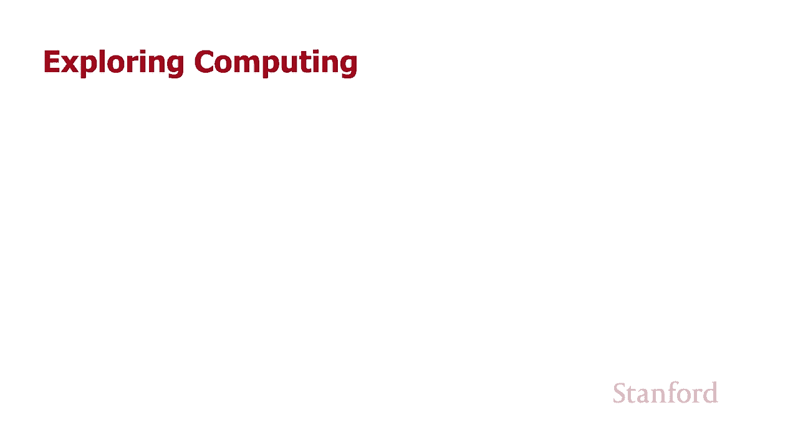
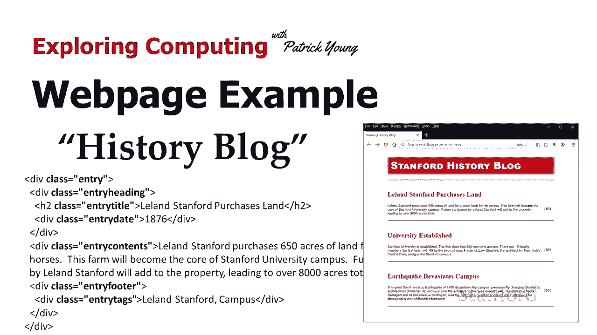
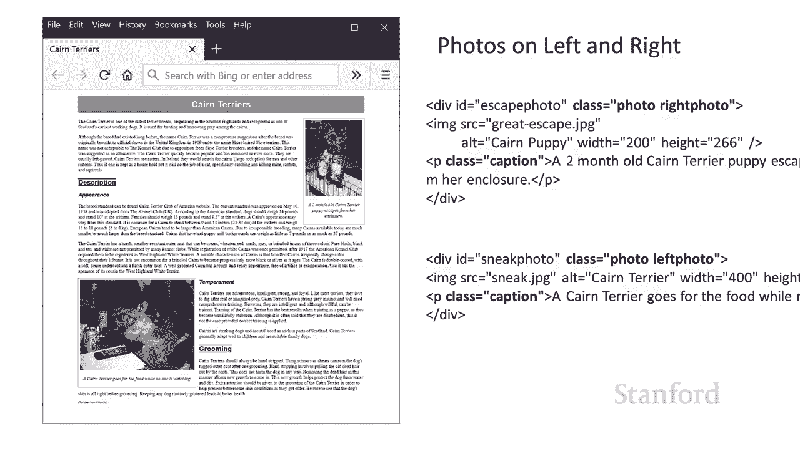
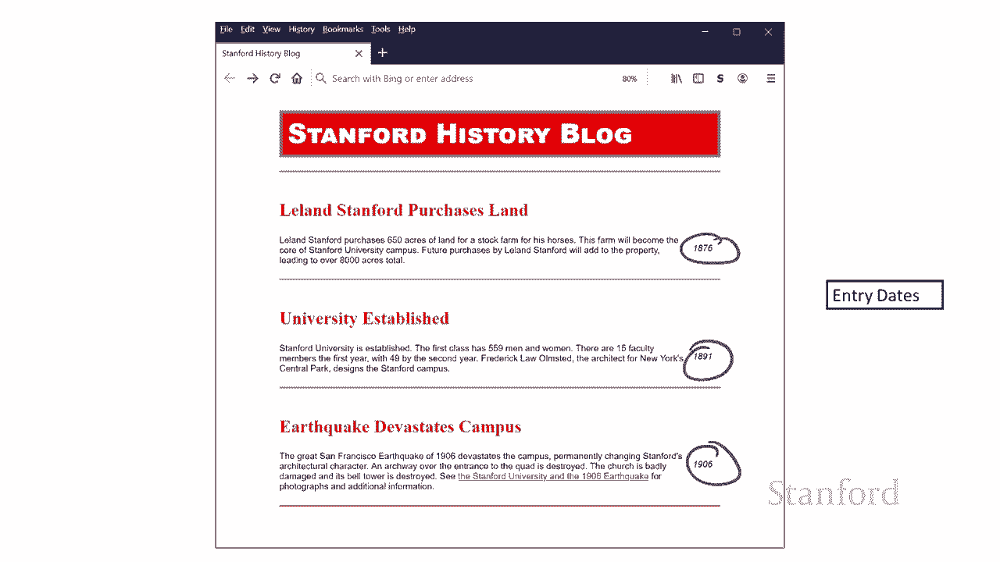
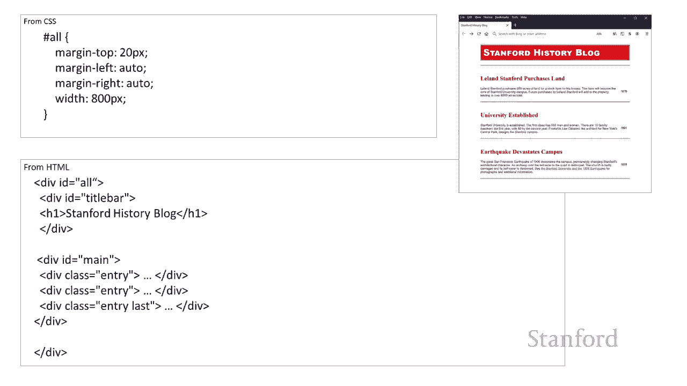
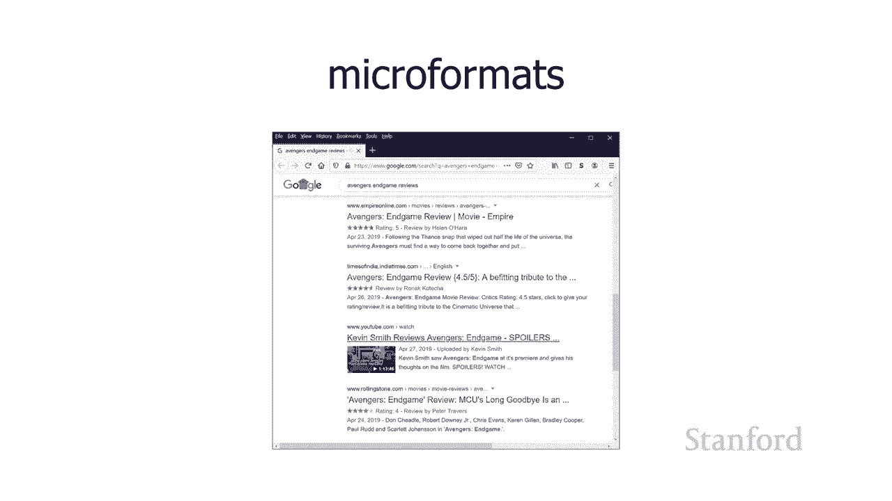
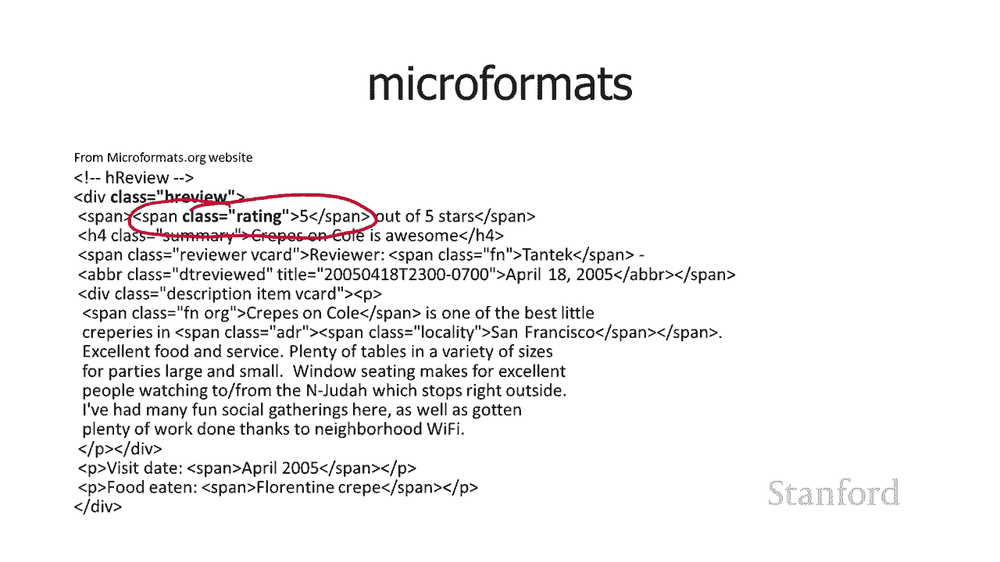

# 【双语字幕+资料下载】斯坦福CS105 ｜ 计算机科学导论(2021最新·完整版) - P35：L10.2- 网页示例：博客 - ShowMeAI - BV1eh411W72E

undefined，欢迎探索计算，欢迎探索计算，今天的视频是网页示例，今天的视频是网页示例。

历史博客 所以在我们的上一个示例中，我们，undefined，undefined，在许多地方看到了类的使用，我们看到我们，在许多地方看到了类的使用，我们看到我们，创建了一个用于标题，创建了一个用于标题。

的类和一个用于照片的类以及一个，的类和一个用于照片的类以及一个，用于写照片的单独的类，用于写照片的单独的类，与 喜欢照片，与 喜欢照片，这种拍摄 div，这种拍摄 div，或我们一直在提供的其他元素并。

或我们一直在提供的其他元素并，为他们提供课程的想法可能非常，为他们提供课程的想法可能非常。

undefined，undefined，强大，这经常，强大，这经常，出现在博客中，出现在博客中，所以在这里我有一个关于斯坦福，所以在这里我有一个关于斯坦福，历史，历史。

和你的博客 可以看到我已经对其进行了一些，和你的博客 可以看到我已经对其进行了一些，格式化，格式化，事实上，您将有机会，undefined，undefined，在下一次家庭作业中对此进行一些格式化。

因此，在下一次家庭作业中对此进行一些格式化，因此，我们将为您提供此文件的 html，undefined，undefined，而不是 css，因此我们 确实希望您，而不是 css，因此我们 确实希望您。

从头开始创建 css，从头开始创建 css，但让我们回顾一下我使用的 css，但让我们回顾一下我使用的 css，以便获得，以便获得，我们在，undefined，undefined，undefined。

此处查看的当前外观 s，此处查看的当前外观 s，在博客上，所以博客中，在博客上，所以博客中，有一堆条目，有一堆条目，每个条目都有一个带有，每个条目都有一个带有，标题，标题，的标题，然后有一些，的标题。

然后有一些，日期，日期，我这里没有显示页脚，但，我这里没有显示页脚，但，我们会在源代码中看到，我们会在源代码中看到，实际上有 一个页脚，然后，实际上有 一个页脚，然后，undefined。

undefined，是您可以为，是您可以为，博客上的每个条目显示的标签数量，博客上的每个条目显示的标签数量，因此这些都是现在，因此这些都是现在，通常出现在博客中的不同元素，通常出现在博客中的不同元素。

如果您经常查看博客的来源，如果您经常查看博客的来源，您会看到，您会看到，什么 他们已经完成了，什么 他们已经完成了，一些这样的，一些这样的，项目，其中一些可能是，项目，其中一些可能是。

段落，其中一些可能是 div，段落，其中一些可能是 div，其中一些实际上可能是标题，其中一些实际上可能是标题，他们会继续给他们，他们会继续给他们，类，所以这就是我的源代码，类，所以这就是我的源代码。

看起来像博客中的每个条目，undefined，undefined，你可以看到我已经，你可以看到我已经，为标题的条目类提供了一个类，为标题的条目类提供了一个类，其中有一个标题和日期，一个。

undefined，undefined，内容类，一个页脚类和一个类，内容类，一个页脚类和一个类，undefined，undefined，正如我，正如我，undefined，undefined。

在 t 中提到的，在页脚上的标签 在标题示例的结尾，在 t 中提到的，在页脚上的标签 在标题示例的结尾，有一些新的 html5，有一些新的 html5，元素实际上并没有提供任何。

元素实际上并没有提供任何，格式，格式，但可能用于提供一些，但可能用于提供一些，语义信息，因此与，语义信息，因此与，该特定示例相关的，该特定示例相关的，示例是有一个数字和 一个，示例是有一个数字和 一个。

图标题，图标题，嗯条目，所以你可以，嗯条目，所以你可以，用文章 html5 元素替换这里的 class equals 条目，undefined，undefined，但是当我去查看，但是当我去查看。

一些实际上在网络上的博客时，我，一些实际上在网络上的博客时，我，没有看到它们中的任何一个使用这些，没有看到它们中的任何一个使用这些，技术 可能是，技术 可能是，这些只是较旧的博客，这。

这些只是较旧的博客，这，就是他们使用我在这里向您展示的技术的原因，undefined，undefined，或者可能是现代博客，或者可能是现代博客，软件尚未更新以使用，软件尚未更新以使用，这些，这些。

元素，但无论我，元素，但无论我，查看的博客看起来都，查看的博客看起来都，非常接近 对于我们在这里看到的内容，非常接近 对于我们在这里看到的内容，我们将继续并，我们将继续并，继续使用它。

undefined，undefined，undefined，undefined，我是如何格式化的 有了，我是如何格式化的 有了，这个博客，这个博客，所以我认为要记住的事情，undefined。

undefined，是我们有一堆 div 的想法，是我们有一堆 div 的想法，在一种情况下我们实际上有一个 h2，在一种情况下我们实际上有一个 h2，如果你仔细看，如果你仔细看。

那里的标题实际上确实有一个，那里的标题实际上确实有一个，h2 那里我们有一个 一堆 div 和，h2 那里我们有一个 一堆 div 和，h2，h2，我们通过在它们上放置一个，我们通过在它们上放置一个。

类，类，属性值对来对它们进行分类，正如我所说的，属性值对来对它们进行分类，正如我所说的，这一直出现，这一直出现，然后在我们完成，然后在我们完成，我对每个这些 um 所做的格式设置时出现两个。

我对每个这些 um 所做的格式设置时出现两个，我们会看到，我们会看到，我，我，将向您指出的各种不同的格式功能可能对您，将向您指出的各种不同的格式功能可能对您，自己的工作有用，自己的工作有用。

所以让我们从条目标题开始，所以让我们从条目标题开始，嗯，所以你可以看到这，嗯，所以你可以看到这，是呃这是 leland，是呃这是 leland，stanford 购买 lan 或大学。

stanford 购买 lan 或大学，成立或地震 开发人员，成立或地震 开发人员，表示校园这些是我，表示校园这些是我，的 h2，你可以看到我有 h2 但，的 h2，你可以看到我有 h2 但。

我也给了班级，我也给了班级，条目标题，所以我要，条目标题，所以我要，继续写一个规则来应用到条目，继续写一个规则来应用到条目，标题，标题，我想我也可以，我想我也可以，假设没有。

将它用于 h2s 网页上的其他，undefined，undefined，h2，你可以想象，也许我，h2，你可以想象，也许我，有一个带有 h2 的侧边栏，有一个带有 h2 的侧边栏。

或者一些使用 h2 的广告，或者一些使用 h2 的广告，但，但，我已经继续并选择使用，我已经继续并选择使用，条目标题 uh，条目标题 uh，类选择器而不是，类选择器而不是。

你看到的 h2 选择器 现在我给了一个字体大小一个，你看到的 h2 选择器 现在我给了一个字体大小一个，字体，字体，粗细我想我之前提到过，粗细我想我之前提到过，实际上字体粗细可以，实际上字体粗细可以。

在 100 和 900 之间，在 100 和 900 之间，你也可以将字体粗细设置为，你也可以将字体粗细设置为，粗体我已经设置了一种颜色然后我认为，粗体我已经设置了一种颜色然后我认为，有趣，有趣。

的 我们还没有讨论的这个条目，的 我们还没有讨论的这个条目，是这里的字体系列，是这里的字体系列，注意我实际上列出了三个字体，注意我实际上列出了三个字体，系列，系列，乘以新罗马时代然后衬线。

乘以新罗马时代然后衬线，如果您列出了许多不同的字体，如果您列出了许多不同的字体，系列 将会发生什么，系列 将会发生什么，是网络浏览器将查找每个 在，是网络浏览器将查找每个 在，这些字体系列中，一旦。

这些字体系列中，一旦，找到匹配的字体，它就会，找到匹配的字体，它就会，继续使用它，继续使用它，因此您不确定，因此您不确定，此人的计算机上，此人的计算机上，是否有一种字体，您可以继续并列出几种字体。

是否有一种字体，您可以继续并列出几种字体，嗯，嗯，您知道 从订单 o 开始，您知道 从订单 o 开始，嘿，嘿，我真的希望他们安装了这种字体，我真的希望他们安装了这种字体，但如果他们，但如果他们。

不让我们尝试这种字体，如果他们，不让我们尝试这种字体，如果他们，没有那种字体，让我们尝试这种字体，没有那种字体，让我们尝试这种字体，然后您最终可以使用 serif 或。

然后您最终可以使用 serif 或，sans serif，sans serif，它们是其中的两种 设计方面的主要选择，undefined，undefined，我们将在设计网页设计讲座中更多地讨论这些。

undefined，undefined，无论如何我想在这里提到的主要观点，无论如何我想在这里提到的主要观点，只是这个想法，只是这个想法，您可以为字体系列列出几种字体，您可以为字体系列列出几种字体。

并且无论哪种字体都可以使用，并且无论哪种字体都可以使用，它在列表中找到第一个，它在列表中找到第一个，好的 这是我如何设置输入日期，好的 这是我如何设置输入日期，嗯，如果您查看右侧的图像，嗯。

如果您查看右侧的图像，我知道那里有点小，我知道那里有点小，但您可以看到日期在最，但您可以看到日期在最，右侧 并且它们在旁边 实际的，右侧 并且它们在旁边 实际的，博客条目以及我是如何做到的。

博客条目以及我是如何做到的，我是通过使用浮动来做到这一点的，所以我，我是通过使用浮动来做到这一点的，所以我，将，将，条目日期浮动到右侧，嗯，我，条目日期浮动到右侧，嗯，我，不必为此设置宽度，我在。

不必为此设置宽度，我在，undefined，undefined，标题示例中知道我谈到了您，标题示例中知道我谈到了您，应该如何小心 即将，应该如何小心 即将，在浮动文本时设置文本宽度，undefined。

undefined，但是在这种情况下，由于日期，但是在这种情况下，由于日期，实际上是年份并且它们永远不会，实际上是年份并且它们永远不会，超过四个字符，超过四个字符，这不是问题，这不是问题。

如果它们是文本并且它们可能是浮动元素，那么您将想要在浮动元素上设置宽度，undefined，undefined，undefined，很长，因为您可能还，很长，因为您可能还，记得我们，记得我们。

对图像标题的讨论，如果您，对图像标题的讨论，如果您，有一个很长的标题，有一个很长的标题，并且没有在上面放置宽度，它会，并且没有在上面放置宽度，它会，扩展到尽可能多的，扩展到尽可能多的，网页，网页。

包括整个网页 网页，如果它的，包括整个网页 网页，如果它的，标题足够长，标题足够长，您可以通过在此处添加宽度来，您可以通过在此处添加宽度来，限制它，我不会再次限制它，限制它，我不会再次限制它。

因为我知道它们只有四个，因为我知道它们只有四个，字符长，字符长，我拥有的每个条目都，我拥有的每个条目都，可以，您可以看到我 有那些红线穿过，可以，您可以看到我 有那些红线穿过，undefined。

undefined，每个条目的上方和下方呃我，undefined，undefined，在这里做得如何我放了一个顶部边框是，在这里做得如何我放了一个顶部边框是，两个像素，两个像素。

纯红色另外我在每个元素上方放了，纯红色另外我在每个元素上方放了，一点额外的填充和边距，一点额外的填充和边距，嗯你会的，嗯你会的，注意边距 ac 中的填充 tally 列出了。

注意边距 ac 中的填充 tally 列出了，四个不同的，四个不同的，undefined，undefined，值 这是怎么回事 如果你，值 这是怎么回事 如果你，继续设置一个值它，undefined。

undefined，undefined，是所有四个方向的填充或边距 如果你设置其中，是所有四个方向的填充或边距 如果你设置其中，两个你正在设置一个顶部和，两个你正在设置一个顶部和。

底部 然后是一个左边和一个右边，底部 然后是一个左边和一个右边，如果你设置了所有四个，它从顶部开始，undefined，undefined，到右边到底部到左边所以在，到右边到底部到左边所以在。

这种情况下我可以说，这种情况下我可以说，填充顶部和边距顶部，填充顶部和边距顶部，但我认为它会更多 有趣，但我认为它会更多 有趣，的是切换事物，以便您现在可以，的是切换事物，以便您现在可以。

看到另一种技术，看到另一种技术，出现的问题之一是，出现的问题之一是，此特定规则，此特定规则，是在，是在，每个条目上方放置一条红线，因为我，每个条目上方放置一条红线，因为我，将边框顶部设置为两个像素。

将边框顶部设置为两个像素，但实际上我不是 设置底部，但实际上我不是 设置底部，边框那么我将如何获得，边框那么我将如何获得，底部边框有几种方法可以，底部边框有几种方法可以，做到这一点，做到这一点。

我认为最常见的技术是，我认为最常见的技术是，将一个，将一个，类添加到最后一个项目你可以看到，类添加到最后一个项目你可以看到，这里是最后一个条目，这里是最后一个条目，我已经添加了这个 最后一节课。

我已经添加了这个 最后一节课，然后我写了 ar  ule，然后我写了 ar  ule，仅适用于，仅适用于，具有最后一个类的项目，具有最后一个类的项目，所以我给最后一个项目一个，所以我给最后一个项目一个。

两个像素的，两个像素的，实心红色边框底部，所以所有条目都有，实心红色边框底部，所以所有条目都有，一个顶部边框，最后一个条目有一个，一个顶部边框，最后一个条目有一个，底部边框，底部边框。

所以这就是我得到的 这四行，所以这就是我得到的 这四行，上面的三行，然后是，上面的三行，然后是，所有元素下面的第四行，所有元素下面的第四行，但是还有其他方法可以做到这一点。

但是还有其他方法可以做到这一点，所以，所以，如果你想看的话，我们，如果你想看的话，我们，简要地讨论了这一点，简要地讨论了这一点，我在谈论伪，我在谈论伪，类时简要地提到了这一点 这些是最后一个。

类时简要地提到了这一点 这些是最后一个，伪类，所以有最后一个孩子，伪类，所以有最后一个孩子，undefined，undefined，和最后一个类型，所以这是最后一个，和最后一个类型，所以这是最后一个。

孩子，所以你可以看到我所有的条目，孩子，所以你可以看到我所有的条目，实际上适合这个名为，实际上适合这个名为，main 的 div，所以如果我写了一个，main 的 div，所以如果我写了一个，适用于。

适用于，最后一个孩子的规则 将适用于，最后一个孩子的规则 将适用于，该底部，该底部，div 的 main 我也可以编写最后一个类型，div 的 main 我也可以编写最后一个类型，规则。

所以在这里我是说，规则，所以在这里我是说，我希望这适用于一个条目呃，我希望这适用于一个条目呃，但我只想适用于该，undefined，undefined，类型的最后一个所以最后一件事 一个入门。

类型的最后一个所以最后一件事 一个入门，类，你可以看到，类，你可以看到，嗯，我可以继续使用它，嗯，我可以继续使用它，undefined，undefined，在我的最后一个条目上放置一个底部边框。

在我的最后一个条目上放置一个底部边框，undefined，undefined，好吧，所以最初我没有，好吧，所以最初我没有，页脚，但是当我决定把它，页脚，但是当我决定把它，变成你们所有人的家庭作业时。

变成你们所有人的家庭作业时，我想要一点 一些更，我想要一点 一些更，有趣的，有趣的，东西供你们玩，东西供你们玩，所以我添加了一个页脚，但，所以我添加了一个页脚，但，我不太确定如何，我不太确定如何。

处理页脚，所以我有点作弊，处理页脚，所以我有点作弊，所以我想我会向你，所以我想我会向你，展示我曾经使用过的这个小技巧 作弊，展示我曾经使用过的这个小技巧 作弊，也就是说，您实际上可以使项目，也就是说。

您实际上可以使项目，消失，消失，有两种不同的技术可以，有两种不同的技术可以，使其消失，使其消失，这是不显示的，因此，这是不显示的，因此，这样做只是完全，这样做只是完全，删除了该元素，删除了该元素。

因此您可以在这里看到我在这里有一个条目，因此您可以在这里看到我在这里有一个条目，页脚，如果 你看看，页脚，如果 你看看，我的 html 部分的底部，你可以，我的 html 部分的底部，你可以。

看到有一个，看到有一个，div 类条目页脚，还有，div 类条目页脚，还有，一堆，一堆，这个特定项目的条目标签，我决定我，这个特定项目的条目标签，我决定我，不希望它们中的任何一个出现。

不希望它们中的任何一个出现，在你面前 伙计们不能为你做，在你面前 伙计们不能为你做，这件事 我们的作业，这件事 我们的作业，对页脚和标签做了一些有趣的事情，undefined，undefined，好吧。

所以通过将 display 设置为 none，好吧，所以通过将 display 设置为 none，它会完全消失，好像它，它会完全消失，好像它，不，不，存在另一种使某些东西，存在另一种使某些东西。

不可见的方法是将可见性设置为 hidden，不可见的方法是将可见性设置为 hidden，这实际上做了，这实际上做了，一些不同的事情 不是说不显示，一些不同的事情 不是说不显示，但是如果您将可见性设置为。

但是如果您将可见性设置为，隐藏，隐藏，则会发生该元素所在的空间，则会发生该元素所在的空间，如果它被正常放置，它，如果它被正常放置，它，仍然会在那里，仍然会在那里，该项目将不会显示在该空间上。

该项目将不会显示在该空间上，所以，所以，如果我们要这样做 实际上，您会在每个条目的底部看到，undefined，undefined，这些条目页脚 div 的一些空白区域，undefined。

undefined，因此您会看到一些，因此您会看到一些，额外的空间，呃，额外的空间，呃，这些圆圈所在的位置我实际上并没有，undefined，undefined，隐藏可见性，因此您的图像，隐藏可见性。

因此您的图像，在右上角看到实际上是，在右上角看到实际上是，不显示的，不显示的，就像本系列中的其他图像，就像本系列中的其他图像，undefined，undefined，我已经展示过的那样，但是您可以使用。

我已经展示过的那样，但是您可以使用，这两个设置进行显示不显示或，这两个设置进行显示不显示或，隐藏，隐藏，可见性也可以 我们用标题示例做了这个，可见性也可以 我们用标题示例做了这个，但我想我只是。

但我想我只是，简单地提到它我确实，简单地提到它我确实，用div包围了整个东西，用div包围了整个东西，我给了它所有的id然后我使用，我给了它所有的id然后我使用，了左边到右边距的自动。

了左边到右边距的自动，这就是我继续前进的方式和，这就是我继续前进的方式和。

把一切都集中，把一切都集中，起来，所以这个想法是把一堆，起来，所以这个想法是把一堆，元素添加到它里面，元素添加到它里面，实际上结果证明是非常，实际上结果证明是非常，强大的，强大的。

所以这里的想法是 html 不一定，所以这里的想法是 html 不一定，undefined，undefined，有我们认为可能有趣的所有东西的标签，有我们认为可能有趣的所有东西的标签，所以，所以。

如果有 没有可用的标签 可用的，如果有 没有可用的标签 可用的，特定标签 我们可以继续，特定标签 我们可以继续，并，并，通过使用 div 或其他标签之一添加我们自己的一个标签。

通过使用 div 或其他标签之一添加我们自己的一个标签，并实际给它一个类，并实际给它一个类，所以有一个组，所以有一个组，真的消失了并运行 这种，真的消失了并运行 这种，想法，那就是微格式，想法。

那就是微格式，组织，组织，嗯，所以我们要看看，嗯，所以我们要看看，两种微格式，我们要研究的第一个，两种微格式，我们要研究的第一个，与，与，评论有关，评论有关，所以假设我在看你 知道。

所以假设我在看你 知道，思考 g 关于去看电影，思考 g 关于去看电影，遗憾的是现在不能这样做 嗯，我，遗憾的是现在不能这样做 嗯，我，听说这部复仇者联盟结束游戏电影已经上映。

听说这部复仇者联盟结束游戏电影已经上映，我想知道，我想知道，嘿，复仇者联盟结束游戏有什么好处，所以，嘿，复仇者联盟结束游戏有什么好处，所以，我可以继续谷歌它，我可以继续谷歌它。

和谷歌复仇者联盟结束 游戏评论，和谷歌复仇者联盟结束 游戏评论，你可以看到一些评论，你可以看到一些评论，实际上，实际上，在 uh google 中有这些星星，所以 google 不知何故。

在 uh google 中有这些星星，所以 google 不知何故，知道，知道，这些是评论并且他们给了，这些是评论并且他们给了，他们，他们，一定数量的星星，它能够，undefined。

undefined，在搜索结果中显示这些星星呃如何 它，在搜索结果中显示这些星星呃如何 它，undefined，undefined，知道这是一篇评论吗，知道这是一篇评论吗，嗯，评论者给了一定数量的，嗯。

评论者给了一定数量的。

星星，星星，嗯，谷歌支持一种叫做 h 评论的微格式，undefined，undefined，所以这里是 h 评论，h，所以这里是 h 评论，h，评论格式是什么样的，这是，评论格式是什么样的，这是。

来自微格式的一个例子。  org，来自微格式的一个例子。  org，网站，网站，如果你看这个，你会看到，undefined，undefined，这里的整个 html 中有一大堆。

这里的整个 html 中有一大堆，类，我只关注其中两个，类，我只关注其中两个，在顶部，在顶部，有一个 h 类评论，谷歌可以，有一个 h 类评论，谷歌可以，查看和 说哦，查看和 说哦。

这样做 es 遵循年龄审查格式，这样做 es 遵循年龄审查格式，然后有一个，然后有一个，班级评级，通过谷歌寻找，班级评级，通过谷歌寻找，该班级评级，该班级评级，并查看那里的数字，这，并查看那里的数字。

这。

实际上是如何确定，实际上是如何确定，要，要，在摘要中放入多少颗星的另一种，在摘要中放入多少颗星的另一种，经常出现的微格式是，经常出现的微格式是，v  card 或 h card uh 格式，这是。

v  card 或 h card uh 格式，这是，用于，用于，虚拟名片，所以这里的想法，虚拟名片，所以这里的想法，是，是，嗯，你知道人们经常有，嗯，你知道人们经常有，名片，他们可以给人们这样人们。

名片，他们可以给人们这样人们，undefined，undefined，可以获得诸如他们的联系信息之类的，可以获得诸如他们的联系信息之类的，信息，信息，因此 h 卡背后的想法或 v。

因此 h 卡背后的想法或 v，卡，卡，是您可以将此类，是您可以将此类，信息放在您的网站上，信息放在您的网站上，但是，但是，如果您希望，如果您希望，人们能够提取该，人们能够提取该，信息并将其存储在。

信息并将其存储在，单独的程序，单独的程序，中，那么仅将这些信息放在您的网站上是不够的，但是如果您是 将该，中，那么仅将这些信息放在您的网站上是不够的，但是如果您是 将该，信息放在您的网站上。

信息放在您的网站上，通知人们您正在使用这种，通知人们您正在使用这种，特定技术，特定技术，undefined，undefined，旨在与，旨在与，vcards 一起使用的 vcard 技术工具可以通过。

vcards 一起使用的 vcard 技术工具可以通过，搜索 gh html标签寻找，搜索 gh html标签寻找，具有特定类的特定条目，具有特定类的特定条目，所以你可以在这里看到我可以看到。

所以你可以在这里看到我可以看到，有一个类，有一个类，街道地址当然没有街道地址的html，街道地址当然没有街道地址的html，标签但是，标签但是，通过在上面放置类等于街道，通过在上面放置类等于街道。

地址我让任何，地址我让任何，设计的工具 使用这些电子，设计的工具 使用这些电子，名片 不，那是我的街道地址 它，名片 不，那是我的街道地址 它，可以继续，可以继续，从那个标签中提取信息。

从那个标签中提取信息，169 大学大道可以继续将，169 大学大道可以继续将，其，其，填入虚拟名片数据库，填入虚拟名片数据库，类似地 有一个邮政编码 有，类似地 有一个邮政编码 有，一个电话号码。

一个电话号码，有一个电子邮件 地址，有一个电子邮件 地址，这些都是，这些都是，undefined，undefined，没有与它们关联的 html 标签的东西，我们。

没有与它们关联的 html 标签的东西，我们，稍后会发现有，稍后会发现有，一个表单条目的电子邮件，人们可以，一个表单条目的电子邮件，人们可以，在其中输入电子邮件，在其中输入电子邮件，但一般来说，诸如。

但一般来说，诸如，邮政编码、国家/地区名称、，邮政编码、国家/地区名称、，手机号码和演示文稿之类的东西，手机号码和演示文稿之类的东西，电子邮件，而不是将电子邮件输入，电子邮件，而不是将电子邮件输入。

到一个表单中，到一个表单中，这些没有 html，这些没有 html，标签，但通过在上面放置类，标签，但通过在上面放置类，我可以提供分类，我可以提供分类，信息 一个旨在阅读网页的程序。

信息 一个旨在阅读网页的程序，可以继续并选择，可以继续并选择，该信息，该信息，并继续处理它，所以我，并继续处理它，所以我，只想强调这个想法，即，只想强调这个想法，即，在元素上放置类可以。

在元素上放置类可以，用于许多不同的，用于许多不同的，目的。

