# 【双语字幕+资料下载】斯坦福CS105 ｜ 计算机科学导论(2021最新·完整版) - P36：L10.3- 创建网页：使用 Web 服务器 - ShowMeAI - BV1eh411W72E

undefined，欢迎探索计算，欢迎探索计算，今天的视频是，今天的视频是，使用 Web 服务器创建网页 到目前为止，使用 Web 服务器创建网页 到目前为止，我们已经讨论了如何编写 html。

我们已经讨论了如何编写 html，和 css，但，和 css，但，我们现在还没有真正讨论，我们现在还没有真正讨论，如何将文件放到，如何将文件放到，Web 上 大多数情况下，我们。

Web 上 大多数情况下，我们，不需要为我们的班级这样做，但我，不需要为我们的班级这样做，但我，认为，认为。

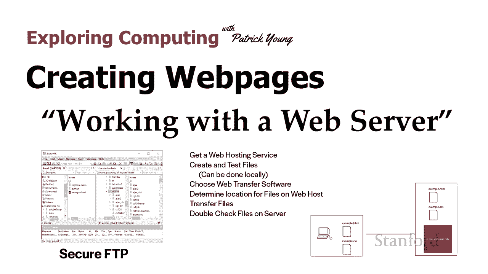

如果您真的想，如果您真的想，创建一个真正的网页，这显然很重要，undefined，undefined，所以到目前为止，如果您考虑我们的内容，这绝对值得讨论。所以到目前为止，如果您考虑我们的内容。

这绝对值得讨论。一直在为我们班做，如果你想一想，undefined，undefined，你在笔记本电脑上创建文件的作业，你在笔记本电脑上创建文件的作业，你已经将它们加载到，你已经将它们加载到。

笔记本电脑的网络浏览器中，笔记本电脑的网络浏览器中，所以我们真的利用了，所以我们真的利用了，一个方面 Web 浏览器的工作原理，一个方面 Web 浏览器的工作原理，因此 Web 浏览器实际上有几个。

因此 Web 浏览器实际上有几个，不同的任务，不同的任务，它了解如何使用 http 向，undefined，undefined，不同的 Web 服务器发出请求，然后它，不同的 Web 服务器发出请求。

然后它，了解文件何时返回，了解文件何时返回，如何实际呈现和显示这些文件，如何实际呈现和显示这些文件，我们 仅在将，undefined，undefined。

文件放置在我们的计算机上之后才利用渲染和显示文件，文件放置在我们的计算机上之后才利用渲染和显示文件，我们没有利用，undefined，undefined，我们从服务器请求文件的第一部分。

undefined，undefined，我们一直在我们，我们一直在我们，自己的笔记本电脑上生成文件 并将它们，自己的笔记本电脑上生成文件 并将它们。

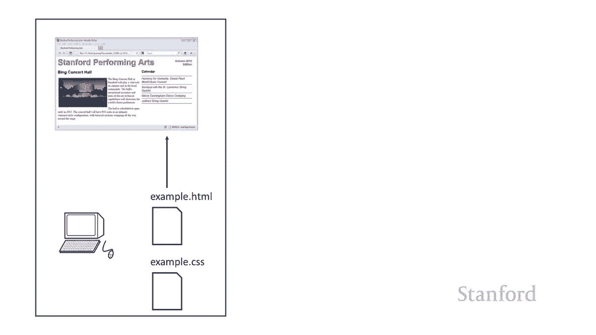

清晰地加载到我们自己的笔记本电脑上，清晰地加载到我们自己的笔记本电脑上，如果我们想让其他人，如果我们想让其他人，能够看到我们的网页 我们需要将，能够看到我们的网页 我们需要将，文件放在服务器。

文件放在服务器，上 可以将它们发送给许多，上 可以将它们发送给许多。

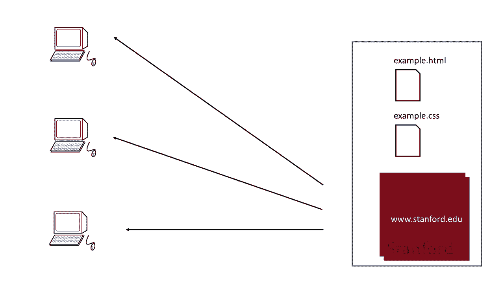

不同的人，不同的人，所以我们需要在这里做的是 我们需要，所以我们需要在这里做的是 我们需要，基本上逆转这里的过程，基本上逆转这里的过程，我们需要获取文件 html，我们需要获取文件 html。

css 图像文件，css 图像文件。

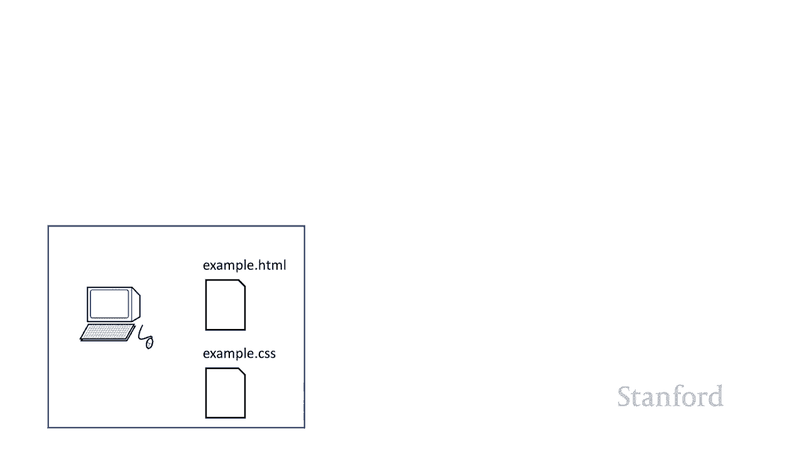

与我们的网页相关联的任何文件，与我们的网页相关联的任何文件，我们需要，我们需要，从我们，从我们，一直在玩的笔记本电脑中获取这些文件 它们并，一直在玩的笔记本电脑中获取这些文件 它们并。

试验它们并测试它们，试验它们并测试它们。

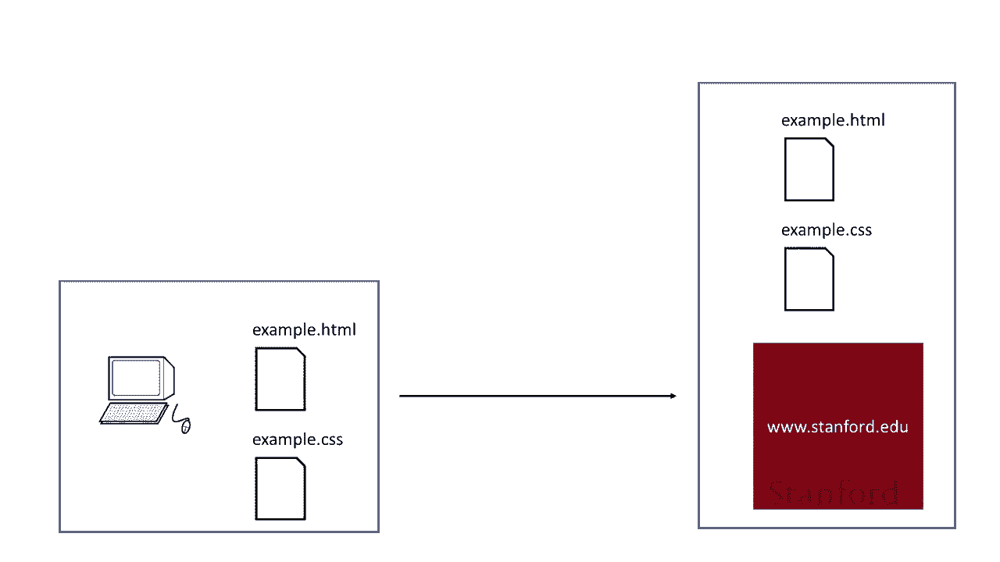

然后我们需要将它们实际放在，然后我们需要将它们实际放在，服务器上，这就是这个视频的，服务器上，这就是这个视频的，全部内容，全部内容，所以有许多不同的，所以有许多不同的，步骤，我将，步骤，我将。

详细介绍这些步骤中的每一个，但让我们只是，详细介绍这些步骤中的每一个，但让我们只是，在这里快速浏览一下好吧，我们，在这里快速浏览一下好吧，我们，需要获得，需要获得，网络托管服务，因此我们需要。

网络托管服务，因此我们需要，一个实际的服务器，我们可以将这些文件，一个实际的服务器，我们可以将这些文件，放在上面，放在上面，我们需要创建和测试文件并，我们需要创建和测试文件并，在本地测试它们，就像您。

在本地测试它们，就像您，为家庭作业所做的那样 这完全没问题，为家庭作业所做的那样 这完全没问题，undefined，undefined，这是一种常见的做法，但是一旦，这是一种常见的做法，但是一旦。

我们确信这些文件似乎，我们确信这些文件似乎，可以正常工作，可以正常工作，我们就需要弄清楚如何将它们，我们就需要弄清楚如何将它们，放到 Web 服务器上，这样，放到 Web 服务器上，这样。

我们首先需要做几件事，我们，我们首先需要做几件事，我们，需要选择，需要选择，我们将用来，我们将用来，将文件传输到服务器的软件，将文件传输到服务器的软件，然后我们将不得不，然后我们将不得不。

弄清楚将它们放在服务器上的哪个位置，弄清楚将它们放在服务器上的哪个位置，然后当然我们实际上，然后当然我们实际上，要传输它们，最后，要传输它们，最后，我们 应该仔细检查我们的文件并。

我们 应该仔细检查我们的文件并，确保一切正常工作，确保一切正常工作，我们将在此视频的末尾花一些时间，我们将在此视频的末尾花一些时间，专门，专门。

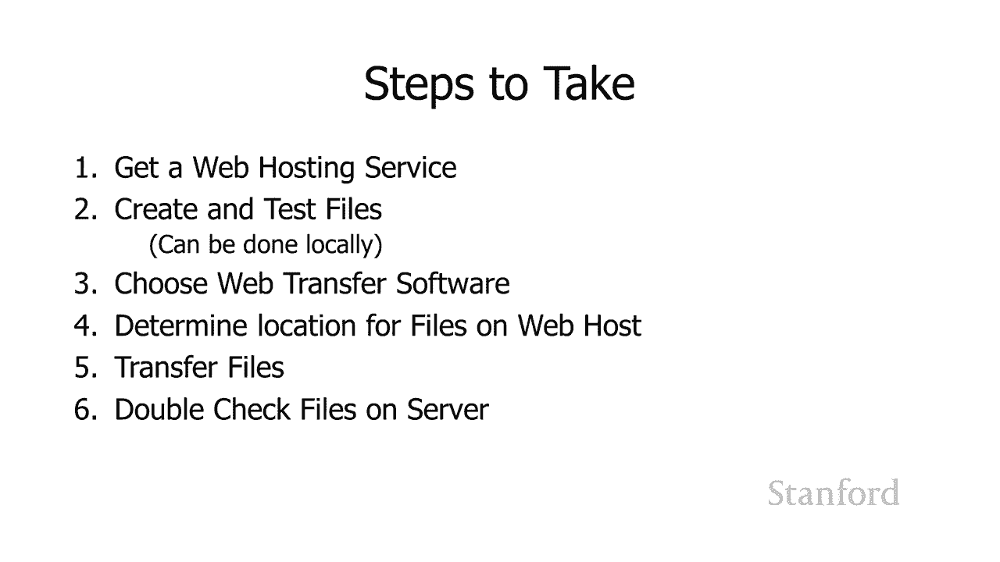

讨论可能出错的，讨论可能出错的，undefined，undefined，正常，因此您需要一个网络托管，正常，因此您需要一个网络托管，服务，服务，um stanford  为学生文件提供托管服务。

um stanford  为学生文件提供托管服务，因此，因此，斯坦福大学的每个学生都有一个，斯坦福大学的每个学生都有一个，目录，目录，他们可以在该目录上放置文件，他们可以在该目录上放置文件。

可以从 web。stanford。edu 访问该目录，可以从 web。stanford。edu 访问该目录，许多互联网服务提供商也，许多互联网服务提供商也，提供网络托管服务，因此如果您从斯坦福。

提供网络托管服务，因此如果您从斯坦福，大学毕业，您可以，大学毕业，您可以，与提供该文件的人联系 你的互联网，与提供该文件的人联系 你的互联网，服务他们可能会提供文件托管，服务他们可能会提供文件托管。

undefined，undefined，嗯，有很多，嗯，有很多，公司也提供，公司也提供，一些基本的网络托管服务，然后，一些基本的网络托管服务，然后。

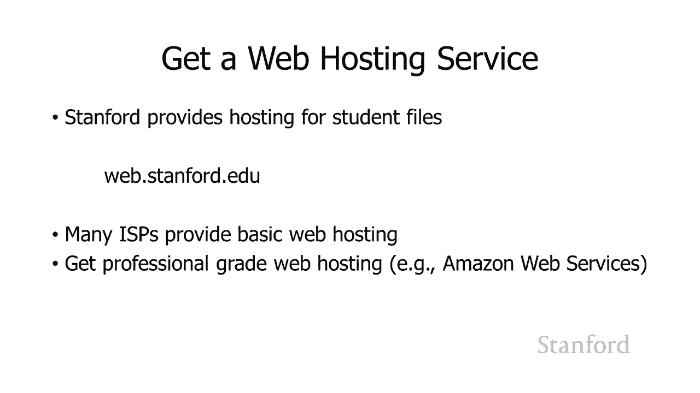

如果你真的进入它，如果你真的进入它，你可以获得，你可以获得，像亚马逊网络服务这样的专业级网络托管，像亚马逊网络服务这样的专业级网络托管，所以正如我建议的那样，所以正如我建议的那样。

在您自己的计算机上创建和测试文件，在您自己的计算机上创建和测试文件，是一个好主意，是一个好主意，这就是我们一直在做的事情，这就是我们一直在做的事情，您无法在实际的 Web 服务器上测试文件。

undefined，undefined，嗯，您知道我们是否变得，嗯，您知道我们是否变得，更先进，更先进，您可能想要 在，您可能想要 在，你自己的文件上做一些，但，你自己的文件上做一些，但。

要记住的主要事情是如果，要记住的主要事情是如果，你确实通过网络服务器传输文件，你确实通过网络服务器传输文件，undefined，undefined，并且你没有测试它们这些文件。

并且你没有测试它们这些文件，是实时的，是实时的，所以你知道 现在人们访问您的网站，所以你知道 现在人们访问您的网站，并且您正在测试，并且您正在测试，您的文件以确保他们正在工作。

您的文件以确保他们正在工作，他们将看到，他们将看到，可能被破坏的东西，可能被破坏的东西，所以解决这个问题的方法是，所以解决这个问题的方法是，您可以在您的服务器上有一个特殊的测试位置。

您可以在您的服务器上有一个特殊的测试位置，和 在那里做一些测试，和 在那里做一些测试。

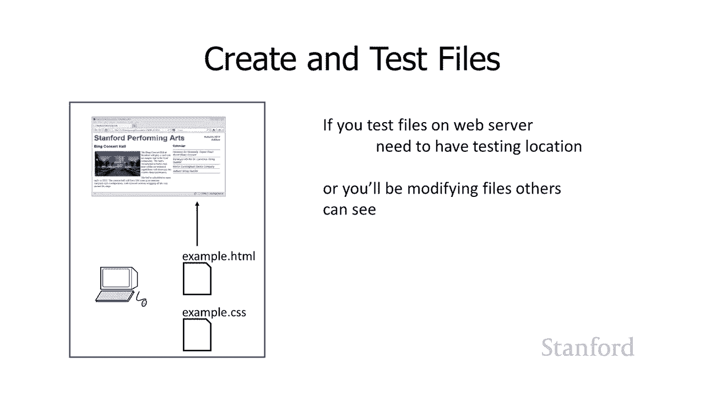

或者你实际上可以运行一个单独的，或者你实际上可以运行一个单独的，测试服务器，就文件传输，测试服务器，就文件传输，软件而言，一般你会，软件而言，一般你会，想要一个支持安全，想要一个支持安全，文件传输。

文件传输，协议或 sftp 的程序，所以有，undefined，undefined，这个协议的早期版本 称为 ftp，它仍然，这个协议的早期版本 称为 ftp，它仍然，可用，可用，但通常建议您使用。

但通常建议您使用，安全版本 sftp，安全版本 sftp，事实上，stanford 不会让您，事实上，stanford 不会让您，使用 ftp 连接到 stanford 服务器。

使用 ftp 连接到 stanford 服务器，您需要使用安全 ftp 这些是，undefined，undefined，您可能会考虑，您可能会考虑。

使用 sftp securefx 的几个示例程序 在 windows 上，使用 sftp securefx 的几个示例程序 在 windows 上，或在 mac 上获取，事实上，这些。

或在 mac 上获取，事实上，这些，都可以免费提供，都可以免费提供，给斯坦福大学的学生和教职员工，给斯坦福大学的学生和教职员工，undefined，undefined，如果您还，如果您还。

没有访问过这个网站，请访问这里的网站，没有访问过这个网站，请访问这里的网站，这是一个方便的网站，可以了解，这是一个方便的网站，可以了解，它被称为基本的斯坦福软件，它被称为基本的斯坦福软件，或 ess。

或 ess，您可以从 ess。stanford。edu 访问它，您可以从 ess。stanford。edu 访问它，它会让您使用您的 su netid 登录，它会让您使用您的 su netid 登录。

那里有很多软件，那里有很多软件，可以免费下载，可以免费下载，包括我们的 sftp 传输的安全 fx 和 fetch，包括我们的 sftp 传输的安全 fx 和 fetch，这些 sftp 程序。

这些 sftp 程序，可能适用于，可能适用于，您正在使用的，您正在使用的，任何网络托管解决方案的任何服务提供商您正在使用的任何网络托管解决方案。

任何网络托管解决方案的任何服务提供商您正在使用的任何网络托管解决方案，在那里获取文件，在那里获取文件，undefined，undefined，不同的托管解决方案也可能，不同的托管解决方案也可能。

有其他方式，有其他方式，在，在，那里获取文件，例如，那里获取文件，例如，undefined，undefined，如果您访问 afs。stanford。edu，stanford 有一个网络界面。

如果您访问 afs。stanford。edu，stanford 有一个网络界面，您可以使用该网站上传和下载文件，您可以使用该网站上传和下载文件，我们的经验是，我们的经验是，undefined。

undefined，总的来说，学生确实觉得它，总的来说，学生确实觉得它，更简单一些 使用，undefined，undefined，afs afs。stanford。edu 比，afs afs。

stanford。edu 比，获得单独的安全，获得单独的安全，ftp 程序要容易一些，但是，ftp 程序要容易一些，但是，您知道随着您开始做越来越，您知道随着您开始做越来越，多的工作，您可能会发现。

多的工作，您可能会发现，还有更多 学习，还有更多 学习，也许习惯 sftp 有点困难，也许习惯 sftp 有点困难，但是一旦您，但是一旦您，了解了 sftp 的工作原理，了解了 sftp 的工作原理。

您实际上可能会发现使用它，undefined，undefined，实际上可以大大简化您的过程，实际上可以大大简化您的过程，因此，因此，如果您只是做一些简单的事情，如果您只是做一些简单的事情。

例如家庭作业文件 使用，例如家庭作业文件 使用，像 afs。stanford。edu 这样简单的东西，像 afs。stanford。edu 这样简单的东西，就可以了，但是如果你正在，就可以了。

但是如果你正在，使用一个，使用一个，真正的大型网站，你可能，真正的大型网站，你可能，会想要使用，会想要使用。

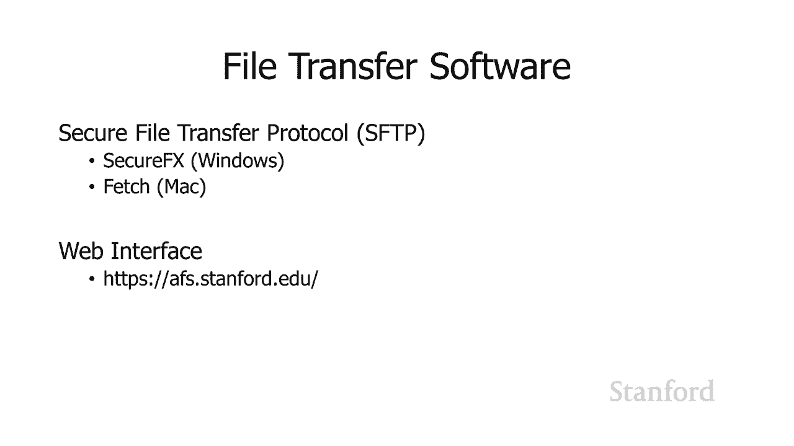

更复杂的东西，更复杂的东西，所以我们需要确定，所以我们需要确定，放置什么位置 我们的文件，放置什么位置 我们的文件，和我之前提到的所有斯坦福，和我之前提到的所有斯坦福，undefined。

undefined，学生都有来自斯坦福的网络托管，学生都有来自斯坦福的网络托管，所以斯坦福有一个文件服务器，您，所以斯坦福有一个文件服务器，您，可以使用它来，可以使用它来，存储不同的文件，这有时。

存储不同的文件，这有时，被称为 leland，被称为 leland，系统，呃，在您拥有的 leland 系统中，系统，呃，在您拥有的 leland 系统中，那里有一个目录，那里有一个目录，在该目录中。

在该目录中，已经为您创建了一个名为 www 的特殊目录，undefined，undefined，这是您放置网页，这是您放置网页，内容的地方，内容的地方，以便 wwe 目录（如果您将。

以便 wwe 目录（如果您将，内容放入其中）  e www 目录他们现在，内容放入其中）  e www 目录他们现在，undefined，undefined。

在网络上所以不要在 www 目录中放任何东西，在网络上所以不要在 www 目录中放任何东西，undefined，undefined，除非您希望其他人，除非您希望其他人，能够看到它，因为，能够看到它。

因为，它是公开可用的并且设置了，它是公开可用的并且设置了，读写权限以便，读写权限以便，任何人都可以查看其中的，任何人都可以查看其中的，文件 那个目录，如果你把东西，文件 那个目录，如果你把东西。

放在 www 目录中，放在 www 目录中，人们将能够使用，人们将能够使用，我放在这里的 url 访问它，我放在这里的 url 访问它，http 冒号斜杠 web。stanford。edu。

http 冒号斜杠 web。stanford。edu，波浪号，然后你的 su 网络 ID 是否是，波浪号，然后你的 su 网络 ID 是否是，然后如果他们只是以结束语结束它。

然后如果他们只是以结束语结束它，斜线它将加载，斜线它将加载，index。html，正如我们在，index。html，正如我们在，之前的视频，之前的视频，中讨论的那样。

这是 stanford loadingindex。html 的默认设置，中讨论的那样，这是 stanford loadingindex。html 的默认设置，undefined，undefined。

或者如果它们遵循，undefined，undefined，带有 html 文件的实际名称的 tildesu netid 斜线，这，带有 html 文件的实际名称的 tildesu netid 斜线，这。

就是将加载，就是将加载，好的内容，所以我们现在 了解，好的内容，所以我们现在 了解，我们的文件，我们的文件，传输选项是什么，我们现在，传输选项是什么，我们现在，知道将文件放在哪里，undefined。

undefined，如果您使用的是，如果您使用的是，斯坦福以外的网络服务器，那么，斯坦福以外的网络服务器，那么，提供您的网络托管的人应该，提供您的网络托管的人应该，告诉您在，告诉您在。

哪里 o 放置用于 uh 虚拟主机的文件，哪里 o 放置用于 uh 虚拟主机的文件。

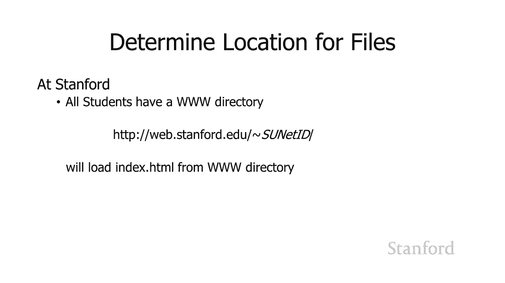

所以我们将继续，所以我们将继续，并传输文件，并传输文件，我在这里向您展示了 Securefx 正在运行的图像，undefined，undefined，这基本上有两组，这基本上有两组，方向，有一组目录。

方向，有一组目录，和文件 左边是，和文件 左边是，我的笔记本电脑，我的笔记本电脑，上的内容，右边有一组目录和文件，上的内容，右边有一组目录和文件，显示服务器上的内容，显示服务器上的内容。

我这里有一大堆垃圾，我这里有一大堆垃圾，你实际上可以看到我的，你实际上可以看到我的，www 目录那里有一大堆，www 目录那里有一大堆，里面有子文件夹，里面有子文件夹，但是你知道如果你什么都没做。

但是你知道如果你什么都没做，你就会有一个空的 www，你就会有一个空的 www，目录，目录，我不会过多谈论，我不会过多谈论，如何通过它传输文件，这，如何通过它传输文件，这，取决于，取决于，你使用的软件。

你使用的软件，它通常会非常，它通常会非常，简单，基本上你可以把，简单，基本上你可以把，左边的物品拖到右边，或者，undefined，undefined，通常你可以，通常你可以，在右边双击它们，我。

在右边双击它们，我，认为值得一提的另一件事是你，认为值得一提的另一件事是你，可以转移 印度 视频文件，或者，可以转移 印度 视频文件，或者，你可以只传输整个，你可以只传输整个，目录，目录。

所以如果你有呃你知道，undefined，undefined，undefined，你的网站的文件和文件夹的某种相当深的嵌套结构并且，你的网站的文件和文件夹的某种相当深的嵌套结构并且。

你已经在你的笔记本电脑上工作，你已经在你的笔记本电脑上工作，并且你想要 将它们传输，并且你想要 将它们传输，到服务器，您不需要，到服务器，您不需要。

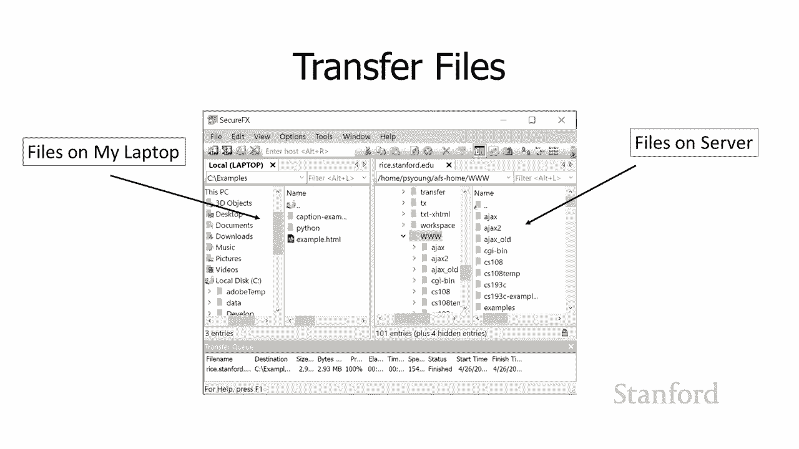

传输单个文件，您只需，传输单个文件，您只需，传输整个目录，传输整个目录，一旦您将它们放在那里，它应该可以正常工作，一旦您将它们放在那里，它应该可以正常工作，嗯，您知道即使它们在，嗯，您知道即使它们在。

您的笔记本电脑上工作正常，您的笔记本电脑上工作正常，您确实想要，您确实想要，一旦你把它们转移过来做一些额外的检查，一旦你把它们转移过来做一些额外的检查，所以如果我们是专业人士，所以如果我们是专业人士。

我们可能要做的，我们可能要做的，是我们将有一个单独的，是我们将有一个单独的，测试位置，而不是，测试位置，而不是，文件最终将要结束的地方，文件最终将要结束的地方，或者我们” 重新拥有一个测试服务器，您。

或者我们” 重新拥有一个测试服务器，您，可能偶尔会在这些，可能偶尔会在这些，测试服务器上运行它，实际上在网络上运行，测试服务器上运行它，实际上在网络上运行，有时人们只是将它们保留下来。

有时人们只是将它们保留下来，甚至有指向它们的链接，因此如果您，甚至有指向它们的链接，因此如果您，undefined，undefined，www。example。edu 冒号，www。example。

edu 冒号，8080 的内容 那是  实际上测试，8080 的内容 那是  实际上测试，服务器 8080，服务器 8080，是一个端口号 um cs106e，是一个端口号 um cs106e。

学生谈到了一些关于端口，学生谈到了一些关于端口，号用于识别，undefined，undefined，undefined，互联网上特定计算机上运行的特定程序和 http 的正常端口。

互联网上特定计算机上运行的特定程序和 http 的正常端口，号，号，是 80 和一个 8080 用作，是 80 和一个 8080 用作。

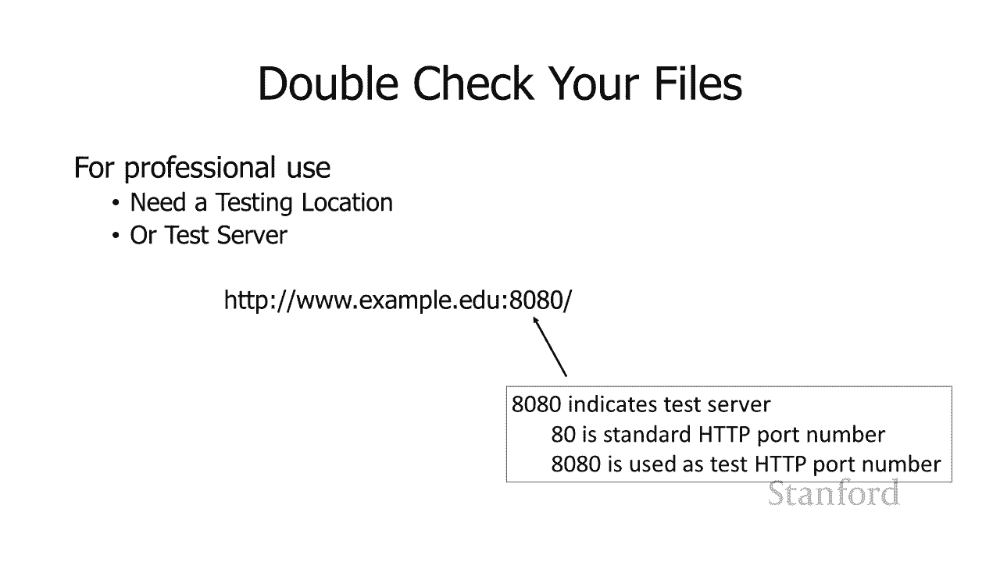

测试 uh 测试服务器的 http，测试 uh 测试服务器的 http，好吧，你可能会遇到什么样的问题，好吧，你可能会遇到什么样的问题，undefined，undefined，所以我建议，所以我建议。

你在转移到网络后应该仔细检查你所有的东西，undefined，undefined，你可以放在一个临时的测试，你可以放在一个临时的测试，位置，然后在你重命名测试，位置，然后在你重命名测试。

位置时 重新完成，您可以将，位置时 重新完成，您可以将，它们放在临时，它们放在临时，服务器位置，然后在完成后将它们移动，undefined，undefined，或者您知道它是否只是。

或者您知道它是否只是，您在网上放置的一些有趣的东西，您在网上放置的一些有趣的东西，您可以将其放在最终，您可以将其放在最终，目的地而不必费心 测试，目的地而不必费心 测试，服务器的东西，服务器的东西，嗯。

只是假设你知道如果，嗯，只是假设你知道如果，只是你的朋友会，只是你的朋友会，看到它，他们可能，看到它，他们可能，不会在，不会在，你发帖的同时访问你的网站 把，你发帖的同时访问你的网站 把，文件整理。

文件整理，好，所以会出什么问题为什么我要，好，所以会出什么问题为什么我要，告诉你仔细检查你所有的，告诉你仔细检查你所有的，东西，东西，这里有一些常见的事情，这里有一些常见的事情。

如果你得到 404 错误，如果你得到 404 错误，undefined，undefined，这可能意味着你的文件，这可能意味着你的文件，在错误的位置或 这可能意味着，在错误的位置或 这可能意味着。

您在文件名中拼错了某些内容，您在文件名中拼错了某些内容，undefined，undefined，所以这些拼写错误，所以这些拼写错误，实际上很常见，实际上很常见。

尽管如果您在转移之前在笔记本电脑上对其进行彻底测试，尽管如果您在转移之前在笔记本电脑上对其进行彻底测试，undefined，undefined，我们，我们，实际上会在几分钟内，实际上会在几分钟内。

查看一些问题 文件名，但，查看一些问题 文件名，但，希望你会发现，如果，希望你会发现，如果，你收到 403 错误，你收到 403 错误，记住这意味着没有找到权限，记住这意味着没有找到权限。

这意味着目录的权限，这意味着目录的权限，被搞乱了，被搞乱了，这曾经是斯坦福的一个问题，这曾经是斯坦福的一个问题，因为 www 目录不是，因为 www 目录不是，预先创建的，预先创建的。

并且 学生必须手动创建它们，并且 学生必须手动创建它们，如果您没有正确设置权限，如果您没有正确设置权限，undefined，undefined，基本上访问目录的人，基本上访问目录的人，都会在那里。

但人们试图，都会在那里，但人们试图，从网络访问，从网络访问，服务器 w 可以说，嘿，您无权，undefined，undefined，查看该文件，但此时，查看该文件，但此时，stanford 确实。

stanford 确实，为所有具有正确设置权限的学生创建了 www 目录，undefined，undefined，如果您使用的是，如果您使用的是，外部网络托管服务，他们将，外部网络托管服务，他们将。

设置权限，设置权限，正确地或者你知道你是否正在做，正确地或者你知道你是否正在做，一些非常复杂的事情，比如，一些非常复杂的事情，比如，亚马逊网络服务那么，亚马逊网络服务那么，undefined。

undefined，就不要拿出大枪并使用，就不要拿出大枪并使用，复杂的服务，除非你，复杂的服务，除非你，知道他们在做什么，否则他们会变得，知道他们在做什么，否则他们会变得，非常复杂，嗯亚马逊 有。

非常复杂，嗯亚马逊 有，大量的选择，大量的选择，它可以很快变得非常非常复杂，它可以很快变得非常非常复杂，好吧，好吧，我还建议，我还建议，您仔细检查网站上的每个链接并，您仔细检查网站上的每个链接并。

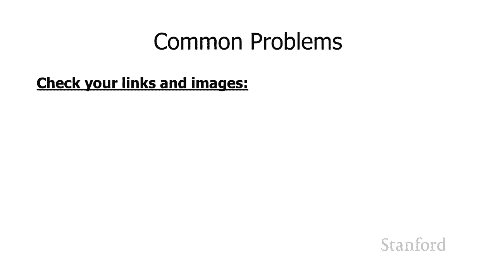

仔细检查您的图像，并，仔细检查您的图像，并，确保它们都正常工作，确保它们都正常工作，可能会出现什么问题 首先，可能会出现什么问题 首先，不要使用绝对引用我们，不要使用绝对引用我们，之前，之前。

在谈论创建链接时已经讨论过这个，在谈论创建链接时已经讨论过这个，绝对不要使用，绝对不要使用，文件引用记住绝对，文件引用记住绝对，引用是 ref，undefined，undefined。

如果您在笔记本电脑上进行测试并且，如果您在笔记本电脑上进行测试并且，您有绝对引用，那么您可以访问特定计算机上的特定位置，现在您，您有绝对引用，那么您可以访问特定计算机上的特定位置，现在您，将其移动到。

将其移动到，您的网络托管服务，您的网络托管服务，例如 stanford，例如 stanford，这些文件现在位于不同的，这些文件现在位于不同的，位置，因此这些绝对引用，位置，因此这些绝对引用。

现在是对的绝对引用 您的，现在是对的绝对引用 您的，原始笔记本电脑它们不是，undefined，undefined，对文件新位置的绝对引用，对文件新位置的绝对引用，因此一般不要使用绝对。

因此一般不要使用绝对，引用，除非您链接到，引用，除非您链接到，其他人的网页，其他人的网页，在这种情况下，其他人的，在这种情况下，其他人的，网页仍然位于其所在的任何位置，undefined。

undefined，在您将文件移至斯坦福之后，它仍然位于那里之前的网络，在您将文件移至斯坦福之后，它仍然位于那里之前的网络，因此这不会产生，因此这不会产生，影响，影响，但就您网站内网页的链接。

但就您网站内网页的链接，undefined，undefined，或对您网站内任何内容的引用而言，或对您网站内任何内容的引用而言，例如您需要在网站内的图像，例如您需要在网站内的图像，undefined。

undefined，可以使用相对引用，可以使用相对引用。

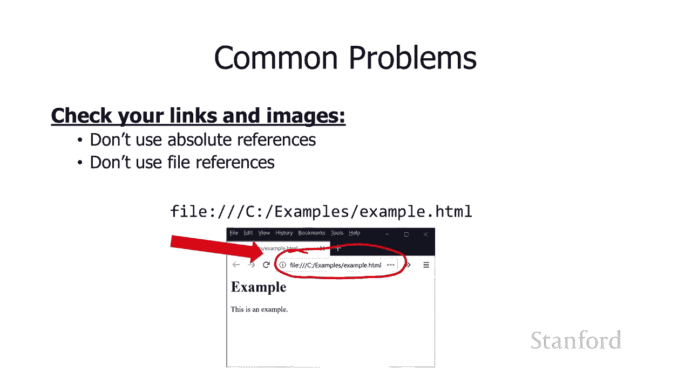

，我之前提到过，我之前提到过，当我们谈论四个四时，当我们谈论四个四时，有一些问题 可以想出，有一些问题 可以想出，文件名，文件名，呃这里是你要做什么来，呃这里是你要做什么来，避免这些问题，避免这些问题。

用所有小写字母命名你的文件，用所有小写字母命名你的文件，没有大写字母只是，没有大写字母只是，小写字母，小写字母，你可以使用数字 0 到 9 你，你可以使用数字 0 到 9 你，可以使用破折号。

可以使用破折号。

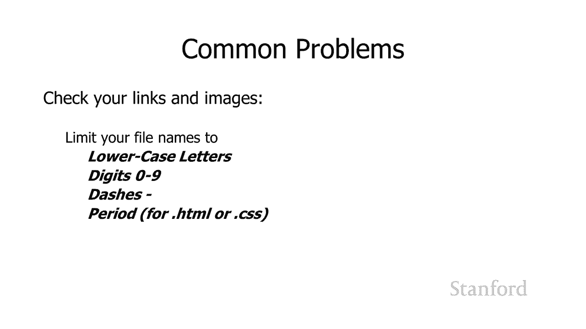

然后只是为了 dot html 或，然后只是为了 dot html 或，dot css 你可以使用，dot css 你可以使用，我推荐的所有句点，可以，我推荐的所有句点，可以，使用大写和小写字母。

使用大写和小写字母，但这是可能发生的，所以，但这是可能发生的，所以，当你在自己的计算机上测试文件时，当你在自己的计算机上测试文件时，就像，就像，你在上面创建文件一样 你的笔记本电脑 你。

你在上面创建文件一样 你的笔记本电脑 你，在你的笔记本电脑上做了一些测试，在你的笔记本电脑上做了一些测试，有些服务器实际上并不，有些服务器实际上并不，关心你是否弄错了大小写和字母。

关心你是否弄错了大小写和字母，所以如果你混合使用大写和，所以如果你混合使用大写和，小写字母就可以了，小写字母就可以了，所以如果我有一个名为的文件 test。html。

所以如果我有一个名为的文件 test。html，带有大写 t，带有大写 t，我使用 ahf 等于小写 t test。html 创建一个链接，它可以，我使用 ahf 等于小写 t test。

html 创建一个链接，它可以，undefined，undefined，undefined，在某些服务器上正常工作，在某些服务器上正常工作，并且，并且，当您仅在笔记本电脑上的文件上进行本地测试时。

它通常可以正常工作，undefined，undefined，但有些 服务器包括 ng stanford，但有些 服务器包括 ng stanford，'s 更挑剔，'s 更挑剔，大写和小写必须匹配。

大写和小写必须匹配，所以在这种情况下，如果我有一个名为，所以在这种情况下，如果我有一个名为，test。html 的文件大写 t，test。html 的文件大写 t，我试图用小写 t 将它链接到它。

undefined，undefined，它不会工作它会显示 嘿，我，它不会工作它会显示 嘿，我，不知道那个文件是什么，不知道那个文件是什么，请记住，链接，请记住，链接，会发生这种情况，会发生这种情况。

undefined，undefined，如果您有一个带有 src 的 img，如果您有一个带有 src 的 img，并且您的 src 上的大小写错误，它，并且您的 src 上的大小写错误，它。

也会发生这种情况 显示为损坏的，也会发生这种情况 显示为损坏的，图像，图像，所以我认为，所以我认为，只要你非常小心，你就可以让它工作，并且你，只要你非常小心，你就可以让它工作，并且你。

总是使用正确的大写小写，总是使用正确的大写小写，作为名称，作为名称，我认为只是不，我认为只是不。

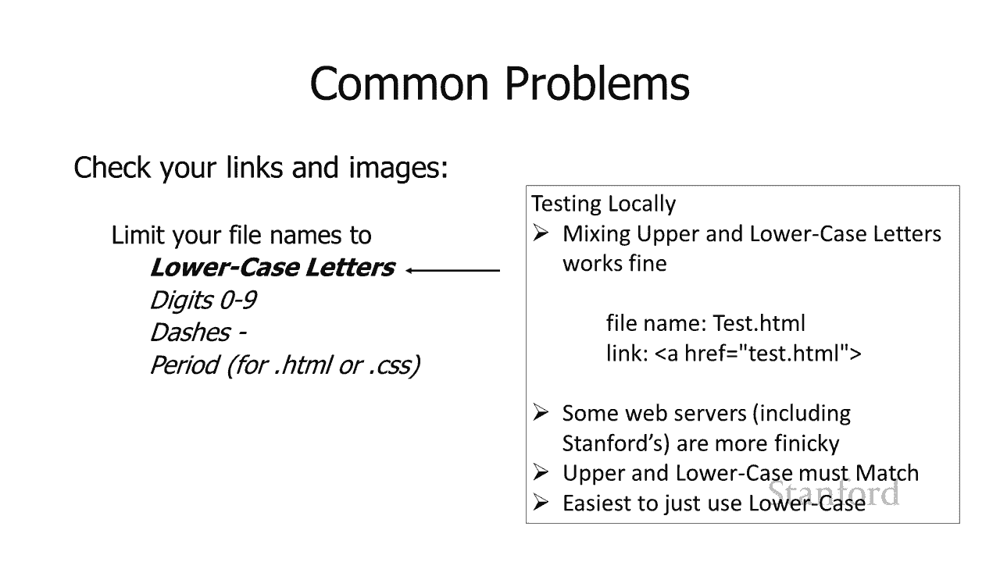

处理它而只是名称更容易 你所有的，处理它而只是名称更容易 你所有的，文件都是小写的，文件都是小写的，我还提到你应该，我还提到你应该，只使用破折号，只使用破折号，你可以使用其他字符，但它们。

你可以使用其他字符，但它们，会导致问题，会导致问题，并且它们存在一些问题，所以，并且它们存在一些问题，所以，你知道我认为你可能，你知道我认为你可能，偶尔会遇到的一件事是，例如，偶尔会遇到的一件事是。

例如，有人在文件 y 的名称中放了一个空格，有人在文件 y 的名称中放了一个空格，undefined，undefined，你可以链接到它，但基本上你，你可以链接到它，但基本上你。

需要用百分比 20 替换对该文件的所有引用中的空格。需要用百分比 20 替换对该文件的所有引用中的空格。undefined，undefined，undefined，undefined，嗯。

这实际上是对空格字符的原始 ascii 代码的引用，undefined，undefined，undefined，所以你知道最好不要处理，所以你知道最好不要处理，这些，这些。

百分比 20 和 co 涂层呃，百分比 20 和 co 涂层呃，这些有时被称为 url，这些有时被称为 url，编码，编码，呃只是你知道不要使用任何，呃只是你知道不要使用任何。

奇怪的字符破折号显然不需要，奇怪的字符破折号显然不需要，任何特殊编码，任何特殊编码，字母不需要任何，字母不需要任何，特殊编码，特殊编码。

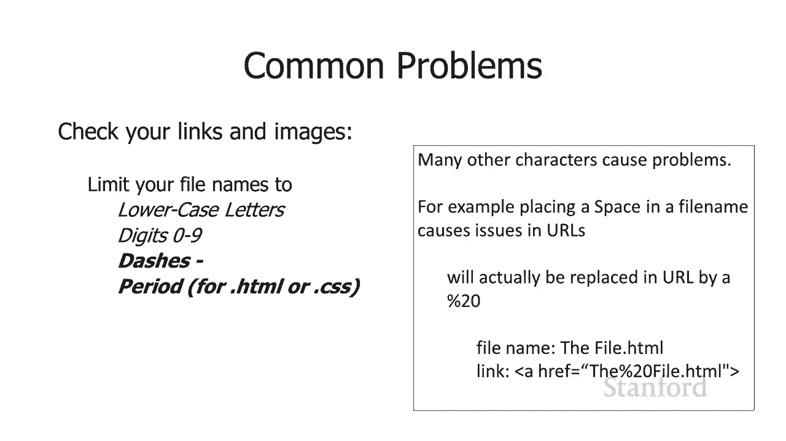

数字零也不需要 到九点，所以只限制，数字零也不需要 到九点，所以只限制，自己，自己，在你的名字中使用那些，这应该可以解决，在你的名字中使用那些，这应该可以解决，很多，很多，问题，我见过，问题，我见过。

学生，学生，遇到的另一个问题是图像格式类型错误，所以，遇到的另一个问题是图像格式类型错误，所以，这里是你应该使用的图像格式，这里是你应该使用的图像格式，你应该把自己限制在，你应该把自己限制在。

jpegs pngs gifs，jpegs pngs gifs，然后我们还没有真正谈论过，然后我们还没有真正谈论过，这一切我非常简短地提到了，这一切我非常简短地提到了，有一种叫做 svg 的东西，它。

有一种叫做 svg 的东西，它，允许我们使用，允许我们使用，对象，对象，sla 存储图像 sh vector 请记住，这两个是，sla 存储图像 sh vector 请记住，这两个是。

undefined，undefined，图形格式，图形格式，而不是使用位图的 jpeg png gif，而不是使用位图的 jpeg png gif，有时也称为光栅，有时也称为光栅，格式，因此我们可能会。

格式，因此我们可能会，在本季度晚些时候讨论 svg，但，在本季度晚些时候讨论 svg，但，您知道无论如何这四种，您知道无论如何这四种，格式 您可以，格式 您可以，使用其他一些您，使用其他一些您。

可能经常遇到的格式，可能经常遇到的格式，这些格式不一定适用于，这些格式不一定适用于，网络，因此，网络，因此，如果您使用 ios 设备拍摄图像，如果您使用 ios 设备拍摄图像，例如苹果有一种新。

例如苹果有一种新，格式，格式，heic 这是一种很好的格式，但它不是，heic 这是一种很好的格式，但它不是，网络 兼容甚至，网络 兼容甚至，苹果的网络浏览器，如果您要，苹果的网络浏览器，如果您要。

使用这种格式提供文件，使用这种格式提供文件，他们将不会显示它，所以，他们将不会显示它，所以，不要使用您需要转换它的 heic 格式，不要使用您需要转换它的 heic 格式。

谷歌也一直在推动这个 webp，谷歌也一直在推动这个 webp，和 webm 格式其中之一用于，和 webm 格式其中之一用于，照片，我们中的一个用于，照片，我们中的一个用于，电影，电影，嗯。

美国目前使用的 50 多种网络浏览器不支持这些格式，undefined，undefined，最大的阻力之一是事实，最大的阻力之一是事实，证明苹果是 在他们的，证明苹果是 在他们的，safari。

safari，uh web 浏览器上不支持它，所以，uh web 浏览器上不支持它，所以，我强烈不推荐使用，我强烈不推荐使用，这些格式，这些格式，所以如果你使用，所以如果你使用，像 heic。

像 heic，apple's htic 或 webp 这样的格式，你将，apple's htic 或 webp 这样的格式，你将，不得不将，不得不将，你的信息重新格式化为，你的信息重新格式化为。

一个 在这些其他格式中，jpeg png gif，一个 在这些其他格式中，jpeg png gif，或，或，潜在的 svg 嗯，我想提醒，潜在的 svg 嗯，我想提醒，您，您确实需要使用，您。

您确实需要使用，照片编辑程序，例如 photoshop，照片编辑程序，例如 photoshop，我有一些学生只是尝试，我有一些学生只是尝试，重命名文件，重命名文件，嗯，计算机会很好，嗯，计算机会很好。

足够聪明，足够聪明，现在可以处理，但他们目前还，现在可以处理，但他们目前还，没有，没有，所以你知道肯定会使用像 photoshop 这样的东西，所以你知道肯定会使用像 photoshop 这样的东西。

呃，呃，有一些内置软件，有一些内置软件，[音乐]，[音乐]，窗口，我怀疑 Mac 也，窗口，我怀疑 Mac 也，有一些内置的，有一些内置的，基本图像编辑软件，undefined，undefined。

如果您，如果您，不想为 Photoshop 工作，undefined，undefined，undefined，他们也可以专业人士，他们也可以专业人士，进行转移 说，进行转移 说，你们现在可能。

你们现在可能，已经深入了解了，但是，已经深入了解了，但是，对你在网上发布的信息要谨慎，undefined，undefined，呃每个人都可以看到它嗯你知道，呃每个人都可以看到它嗯你知道，如果你想把。

如果你想把，你的名字和电话号码放在那里要非常仔细地考虑，你的名字和电话号码放在那里要非常仔细地考虑，我提到的 关于将电子邮件放在那里的早期讲座之一，undefined，undefined。

所有这些都被自动化程序收集起来，所有这些都被自动化程序收集起来，undefined，undefined，我还没有听说过有关自动，我还没有听说过有关自动，程序查找电话号码并将其，程序查找电话号码并将其。

添加到，添加到，您知道的电话营销电话的任何信息，但这，您知道的电话营销电话的任何信息，但这，不会让我感到惊讶，它肯定，不会让我感到惊讶，它肯定，会发生，会发生，放在网上的电子邮件地址。

放在网上的电子邮件地址，当然你知道，当然你知道，你想非常小心地把，你想非常小心地把，你的家庭地址和其他，你的家庭地址和其他，类似的信息放在网上，类似的信息放在网上，所以这就是你，所以这就是你。

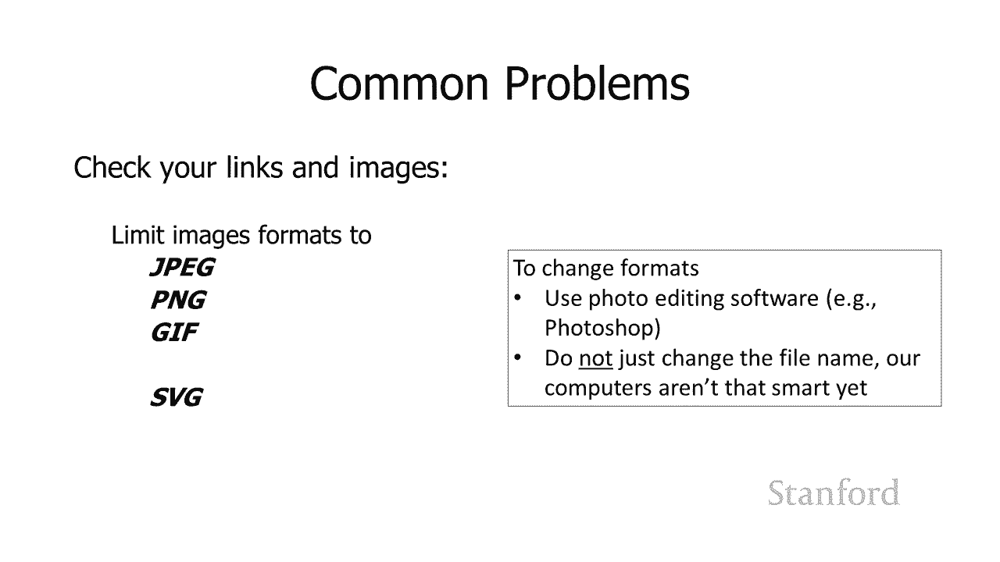

需要做，需要做，的才能真正获得你的文件，的才能真正获得你的文件。

undefined。